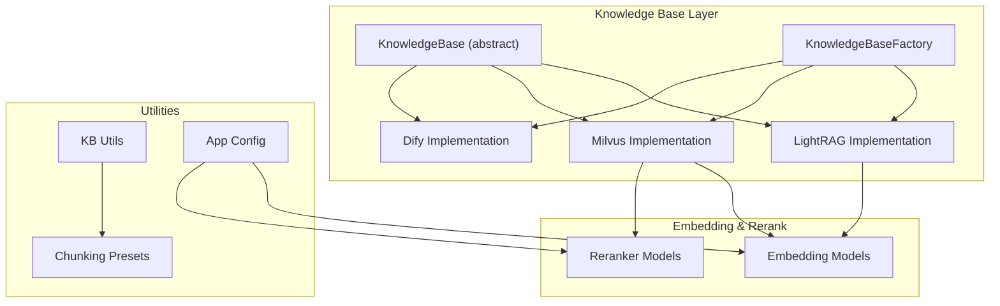
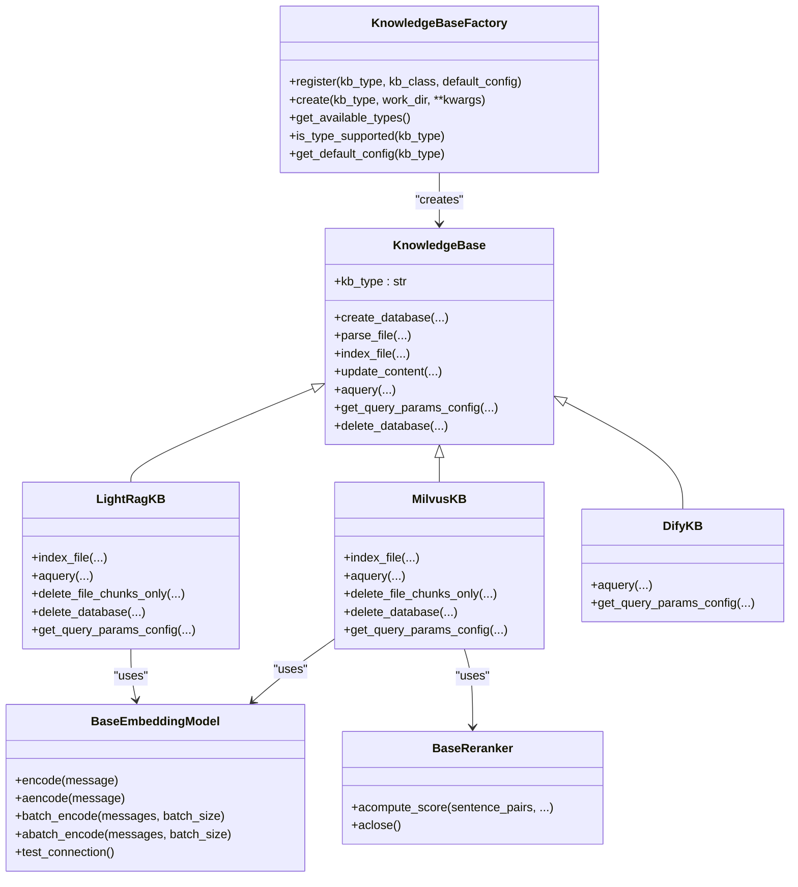
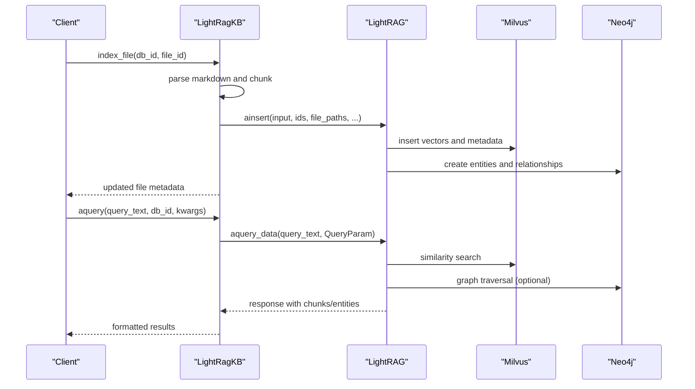
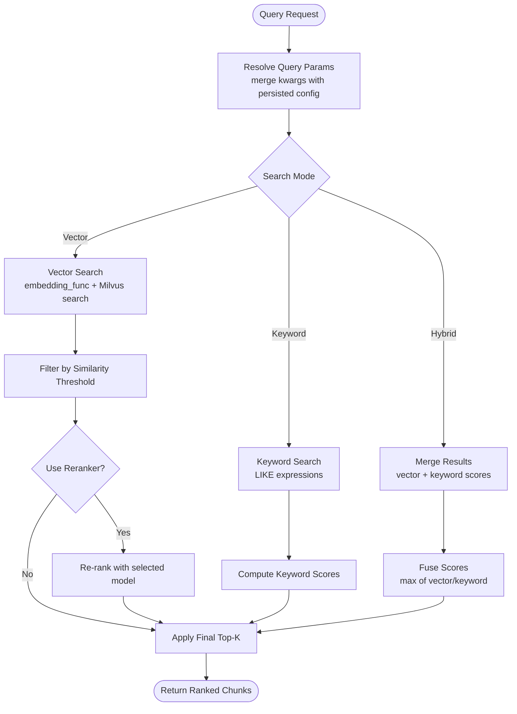
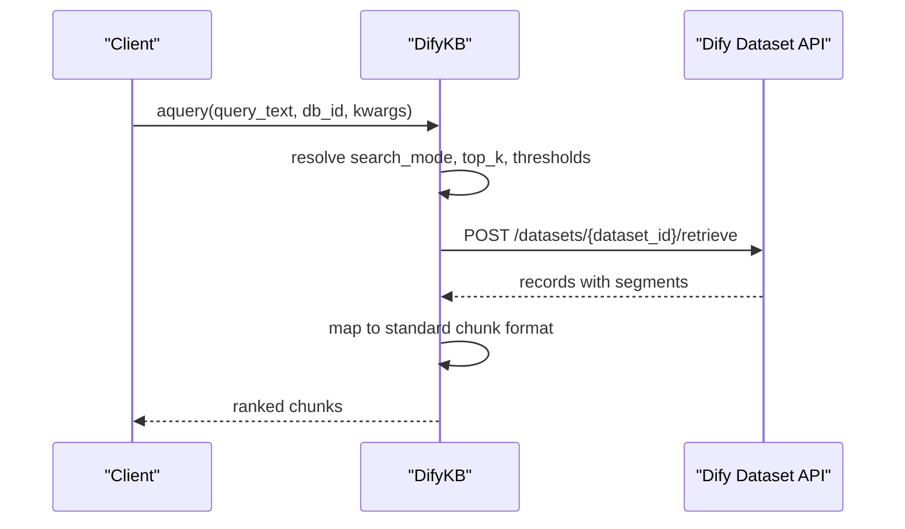
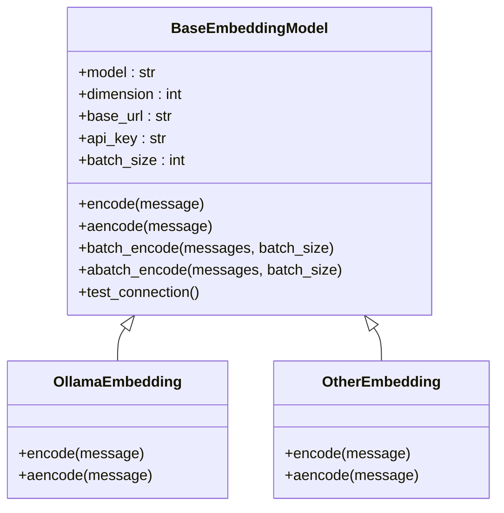
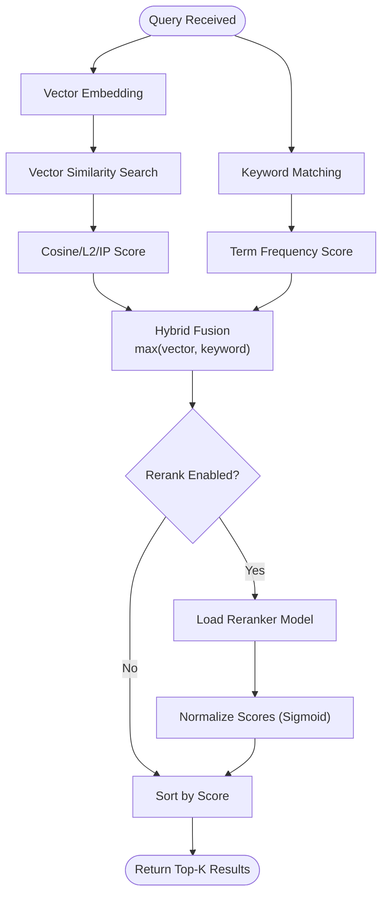
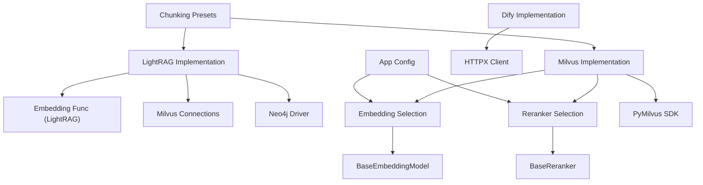

# Vector Storage Integration

<cite>
**Referenced Files in This Document**
- [lightrag.py](file://backend/package/yuxi/knowledge/implementations/lightrag.py)
- [milvus.py](file://backend/package/yuxi/knowledge/implementations/milvus.py)
- [dify.py](file://backend/package/yuxi/knowledge/implementations/dify.py)
- [embed.py](file://backend/package/yuxi/models/embed.py)
- [rerank.py](file://backend/package/yuxi/models/rerank.py)
- [base.py](file://backend/package/yuxi/knowledge/base.py)
- [factory.py](file://backend/package/yuxi/knowledge/factory.py)
- [kb_utils.py](file://backend/package/yuxi/knowledge/utils/kb_utils.py)
- [app.py](file://backend/package/yuxi/config/app.py)
- [models.py](file://backend/package/yuxi/config/static/models.py)
- [presets.py](file://backend/package/yuxi/knowledge/chunking/ragflow_like/presets.py)
</cite>

## Table of Contents
1. [Introduction](#introduction)
2. [Project Structure](#project-structure)
3. [Core Components](#core-components)
4. [Architecture Overview](#architecture-overview)
5. [Detailed Component Analysis](#detailed-component-analysis)
6. [Dependency Analysis](#dependency-analysis)
7. [Performance Considerations](#performance-considerations)
8. [Troubleshooting Guide](#troubleshooting-guide)
9. [Conclusion](#conclusion)

## Introduction
This document provides comprehensive coverage of vector storage integration across multiple backend implementations in the system. It explains how local vector storage and similarity search are integrated via LightRAG, how Milvus serves as a production-grade vector database with collection management and query optimization, and how Dify enables cloud-based vector storage services through its Dataset Retrieve API. The document also covers embedding model configuration, dimension management, similarity scoring algorithms, re-ranking strategies, query optimization techniques, and performance tuning for large-scale vector operations. Practical examples demonstrate configuration, custom embedding models, and migration between different vector backends.

## Project Structure
The vector storage integration spans several modules:
- Knowledge base implementations: LightRAG, Milvus, and Dify backends
- Embedding and re-ranking model abstractions
- Base knowledge base interface and factory pattern
- Utilities for chunking, metadata, and configuration
- Static model configurations and presets

**Diagram sources**
- [base.py:46-190](file://backend/package/yuxi/knowledge/base.py#L46-L190)
- [factory.py:5-108](file://backend/package/yuxi/knowledge/factory.py#L5-L108)
- [lightrag.py:23-779](file://backend/package/yuxi/knowledge/implementations/lightrag.py#L23-L779)
- [milvus.py:24-897](file://backend/package/yuxi/knowledge/implementations/milvus.py#L24-L897)
- [dify.py:10-221](file://backend/package/yuxi/knowledge/implementations/dify.py#L10-L221)
- [embed.py:13-296](file://backend/package/yuxi/models/embed.py#L13-L296)
- [rerank.py:18-170](file://backend/package/yuxi/models/rerank.py#L18-L170)
- [kb_utils.py:105-160](file://backend/package/yuxi/knowledge/utils/kb_utils.py#L105-L160)
- [app.py:31-598](file://backend/package/yuxi/config/app.py#L31-L598)

**Section sources**
- [base.py:46-190](file://backend/package/yuxi/knowledge/base.py#L46-L190)
- [factory.py:5-108](file://backend/package/yuxi/knowledge/factory.py#L5-L108)

## Core Components
- KnowledgeBase (abstract): Defines the unified interface for all knowledge base implementations, including indexing, querying, and metadata management.
- KnowledgeBaseFactory: Provides registration and instantiation of different knowledge base types (LightRAG, Milvus, Dify).
- LightRAG Implementation: Integrates LightRAG with Milvus for vector storage and Neo4j for graph storage, supporting LLM and embedding functions.
- Milvus Implementation: Production-ready vector database with collection creation, indexing, and optimized querying including hybrid search and re-ranking.
- Dify Implementation: Cloud-based retrieval via Dify Dataset Retrieve API, read-only but configurable per database.
- Embedding Models: Abstractions for embedding generation supporting both sync and async operations, with batch processing and model selection.
- Reranker Models: Asynchronous re-ranking with configurable providers and normalization.

**Section sources**
- [base.py:46-190](file://backend/package/yuxi/knowledge/base.py#L46-L190)
- [factory.py:5-108](file://backend/package/yuxi/knowledge/factory.py#L5-L108)
- [lightrag.py:23-779](file://backend/package/yuxi/knowledge/implementations/lightrag.py#L23-L779)
- [milvus.py:24-897](file://backend/package/yuxi/knowledge/implementations/milvus.py#L24-L897)
- [dify.py:10-221](file://backend/package/yuxi/knowledge/implementations/dify.py#L10-L221)
- [embed.py:13-296](file://backend/package/yuxi/models/embed.py#L13-L296)
- [rerank.py:18-170](file://backend/package/yuxi/models/rerank.py#L18-L170)

## Architecture Overview
The system supports pluggable knowledge base backends. Each backend implements the KnowledgeBase interface and can be instantiated via the factory. Embedding and reranking models are selected from configuration and used during indexing and querying.

**Diagram sources**
- [base.py:46-190](file://backend/package/yuxi/knowledge/base.py#L46-L190)
- [factory.py:5-108](file://backend/package/yuxi/knowledge/factory.py#L5-L108)
- [lightrag.py:23-779](file://backend/package/yuxi/knowledge/implementations/lightrag.py#L23-L779)
- [milvus.py:24-897](file://backend/package/yuxi/knowledge/implementations/milvus.py#L24-L897)
- [dify.py:10-221](file://backend/package/yuxi/knowledge/implementations/dify.py#L10-L221)
- [embed.py:13-296](file://backend/package/yuxi/models/embed.py#L13-L296)
- [rerank.py:18-170](file://backend/package/yuxi/models/rerank.py#L18-L170)

## Detailed Component Analysis

### LightRAG Integration (Local Vector Storage and Graph)
LightRAG integration provides:
- Vector storage backed by Milvus
- Graph storage backed by Neo4j
- LLM and embedding function selection
- Document lifecycle management (parsing, indexing, updating)
- Query parameter configuration for retrieval modes and content scope

Key capabilities:
- Embedding function selection supports both OpenAI-style and Ollama backends
- Milvus collection management for chunks, relationships, and entities
- Neo4j cleanup for graph data upon database deletion
- Query modes: local, global, hybrid, naive, mix; optional re-ranking
- Content scope selection for returned chunks, entities, relationships, or combined

**Diagram sources**
- [lightrag.py:305-601](file://backend/package/yuxi/knowledge/implementations/lightrag.py#L305-L601)
- [lightrag.py:526-596](file://backend/package/yuxi/knowledge/implementations/lightrag.py#L526-L596)

**Section sources**
- [lightrag.py:23-779](file://backend/package/yuxi/knowledge/implementations/lightrag.py#L23-L779)

### Milvus Vector Database Implementation
Milvus implementation provides:
- Collection creation with schema definition and index configuration
- Asynchronous embedding generation with batching
- Vector search with configurable metrics (COSINE, L2, IP)
- Keyword and hybrid search modes
- Optional re-ranking with configurable models
- File-level chunk deletion and database cleanup

Query optimization features:
- Metric type selection affects distance/similarity interpretation
- Similarity threshold filtering
- Recall vs. precision trade-offs via recall_top_k and final_top_k
- Hybrid mode merges vector and keyword results with score fusion
- Distance inclusion toggle for debugging and analytics

**Diagram sources**
- [milvus.py:471-676](file://backend/package/yuxi/knowledge/implementations/milvus.py#L471-L676)

**Section sources**
- [milvus.py:24-897](file://backend/package/yuxi/knowledge/implementations/milvus.py#L24-L897)

### Dify Integration (Cloud-Based Vector Storage)
Dify integration is read-only and retrieves results from Dify Dataset Retrieve API:
- Supports semantic, keyword, and hybrid search mapping
- Configurable top_k and score threshold
- Robust error handling with fallback to query-only retrieval
- Metadata mapping to standard chunk format

**Diagram sources**
- [dify.py:69-162](file://backend/package/yuxi/knowledge/implementations/dify.py#L69-L162)

**Section sources**
- [dify.py:10-221](file://backend/package/yuxi/knowledge/implementations/dify.py#L10-L221)

### Embedding Model Configuration and Dimension Management
Embedding models are selected via configuration and abstraction:
- BaseEmbeddingModel defines synchronous and asynchronous encoding, batch processing, and connection testing
- OllamaEmbedding and OtherEmbedding implement provider-specific logic
- Model selection supports provider/model combinations and local Ollama endpoints
- Dimensions are defined in static model configuration and used for Milvus schema creation

**Diagram sources**
- [embed.py:13-296](file://backend/package/yuxi/models/embed.py#L13-L296)

**Section sources**
- [embed.py:13-296](file://backend/package/yuxi/models/embed.py#L13-L296)
- [models.py:25-42](file://backend/package/yuxi/config/static/models.py#L25-L42)
- [app.py:31-598](file://backend/package/yuxi/config/app.py#L31-L598)

### Similarity Scoring Algorithms and Re-ranking Strategies
Similarity scoring and re-ranking:
- Milvus supports COSINE, L2, and IP metrics; distances are normalized appropriately
- Keyword scoring uses term frequency matching with max normalization
- Hybrid fusion retains the higher of vector or keyword scores per chunk
- Re-ranking uses configurable models with sigmoid normalization for stable scores

**Diagram sources**
- [milvus.py:511-671](file://backend/package/yuxi/knowledge/implementations/milvus.py#L511-L671)
- [rerank.py:14-100](file://backend/package/yuxi/models/rerank.py#L14-L100)

**Section sources**
- [milvus.py:471-676](file://backend/package/yuxi/knowledge/implementations/milvus.py#L471-L676)
- [rerank.py:18-170](file://backend/package/yuxi/models/rerank.py#L18-L170)

### Query Optimization Techniques and Performance Tuning
Optimization strategies implemented:
- Batch embedding with configurable batch sizes
- Asynchronous I/O for embedding and Milvus operations
- Index selection (IVF_FLAT) and probe parameters for scalability
- Threshold-based early filtering to reduce post-processing cost
- Re-ranking with controlled recall to balance latency and accuracy
- Hybrid search to leverage keyword matching for recall and vector similarity for precision

Practical tuning tips:
- Adjust final_top_k and recall_top_k based on latency and accuracy targets
- Use metric_type appropriate to embedding normalization (COSINE for normalized vectors)
- Enable re-ranking selectively for high-stakes queries
- Monitor similarity_threshold to prune low-quality candidates early

**Section sources**
- [milvus.py:159-160](file://backend/package/yuxi/knowledge/implementations/milvus.py#L159-L160)
- [milvus.py:517-526](file://backend/package/yuxi/knowledge/implementations/milvus.py#L517-L526)
- [milvus.py:638-671](file://backend/package/yuxi/knowledge/implementations/milvus.py#L638-L671)

### Migration Between Vector Backends
Migration considerations:
- Embedding dimension must match the target backend’s expectations
- Chunking parameters and presets should be preserved across migrations
- For Milvus, ensure collection schema matches embedding dimension
- For LightRAG, maintain consistent embedding model configuration across instances
- Dify migration requires aligning search modes and thresholds with on-prem behavior

Operational steps:
- Export metadata and chunk identifiers from the source backend
- Recreate collections or datasets in the target backend
- Re-index content using the same chunking parameters
- Validate similarity and re-ranking behavior with representative queries

**Section sources**
- [kb_utils.py:105-160](file://backend/package/yuxi/knowledge/utils/kb_utils.py#L105-L160)
- [presets.py:161-213](file://backend/package/yuxi/knowledge/chunking/ragflow_like/presets.py#L161-L213)
- [milvus.py:135-164](file://backend/package/yuxi/knowledge/implementations/milvus.py#L135-L164)
- [lightrag.py:263-303](file://backend/package/yuxi/knowledge/implementations/lightrag.py#L263-L303)

## Dependency Analysis
The following diagram shows key dependencies among vector storage components:

**Diagram sources**
- [lightrag.py:23-779](file://backend/package/yuxi/knowledge/implementations/lightrag.py#L23-L779)
- [milvus.py:24-897](file://backend/package/yuxi/knowledge/implementations/milvus.py#L24-L897)
- [dify.py:10-221](file://backend/package/yuxi/knowledge/implementations/dify.py#L10-L221)
- [embed.py:13-296](file://backend/package/yuxi/models/embed.py#L13-L296)
- [rerank.py:18-170](file://backend/package/yuxi/models/rerank.py#L18-L170)
- [app.py:31-598](file://backend/package/yuxi/config/app.py#L31-L598)
- [presets.py:161-213](file://backend/package/yuxi/knowledge/chunking/ragflow_like/presets.py#L161-L213)

**Section sources**
- [lightrag.py:23-779](file://backend/package/yuxi/knowledge/implementations/lightrag.py#L23-L779)
- [milvus.py:24-897](file://backend/package/yuxi/knowledge/implementations/milvus.py#L24-L897)
- [dify.py:10-221](file://backend/package/yuxi/knowledge/implementations/dify.py#L10-L221)
- [embed.py:13-296](file://backend/package/yuxi/models/embed.py#L13-L296)
- [rerank.py:18-170](file://backend/package/yuxi/models/rerank.py#L18-L170)
- [app.py:31-598](file://backend/package/yuxi/config/app.py#L31-L598)
- [presets.py:161-213](file://backend/package/yuxi/knowledge/chunking/ragflow_like/presets.py#L161-L213)

## Performance Considerations
- Embedding batching reduces API overhead; tune batch_size according to provider limits and latency targets
- Asynchronous embedding and Milvus operations minimize blocking
- Index type and parameters (e.g., IVF_FLAT nlist) impact recall and latency; profile with realistic workloads
- Use similarity_threshold and final_top_k to cap downstream processing costs
- Re-ranking adds latency; enable only for critical queries or when accuracy gains justify overhead
- Hybrid search improves recall at modest additional cost compared to pure vector search

## Troubleshooting Guide
Common issues and resolutions:
- Milvus connection failures: verify URI, token, and database existence; ensure proper alias usage
- Embedding model connectivity: use test_connection to validate base_url and api_key; confirm endpoint supports embeddings
- Dify retrieval errors: check dataset_id, token, and API URL; fallback behavior attempts query-only retrieval
- LightRAG initialization: ensure embedding function matches configured model; verify Neo4j credentials and Milvus collections
- Query timeouts: adjust timeouts and consider reducing top_k or disabling re-ranking temporarily

**Section sources**
- [milvus.py:70-88](file://backend/package/yuxi/knowledge/implementations/milvus.py#L70-L88)
- [embed.py:121-137](file://backend/package/yuxi/models/embed.py#L121-L137)
- [dify.py:164-176](file://backend/package/yuxi/knowledge/implementations/dify.py#L164-L176)
- [lightrag.py:176-180](file://backend/package/yuxi/knowledge/implementations/lightrag.py#L176-L180)

## Conclusion
The vector storage integration provides flexible, scalable solutions across local, on-premises, and cloud environments. LightRAG offers a comprehensive pipeline with graph capabilities, Milvus delivers production-grade vector operations with robust query optimization, and Dify enables seamless cloud-based retrieval. With configurable embedding models, dimension-aware schema design, and re-ranking strategies, the system supports diverse use cases while maintaining strong performance and operability.