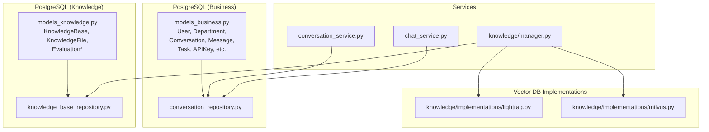
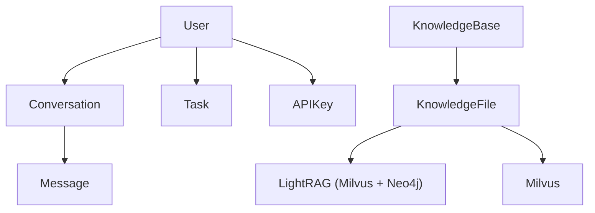
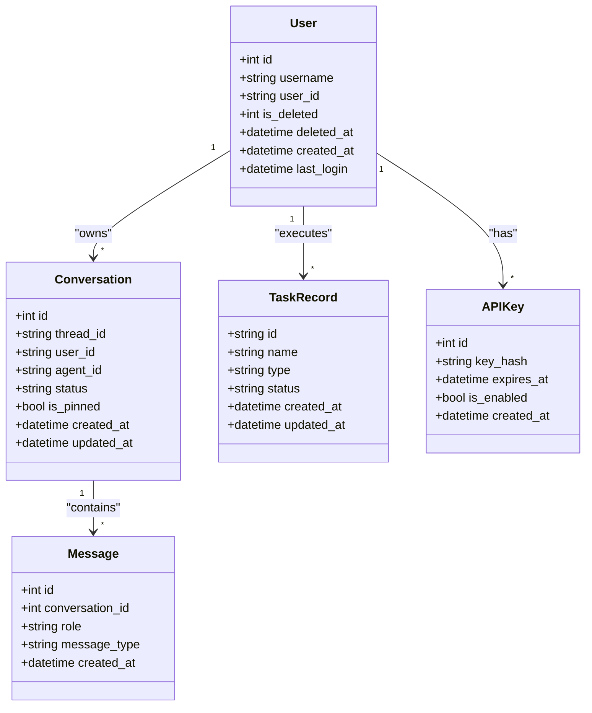
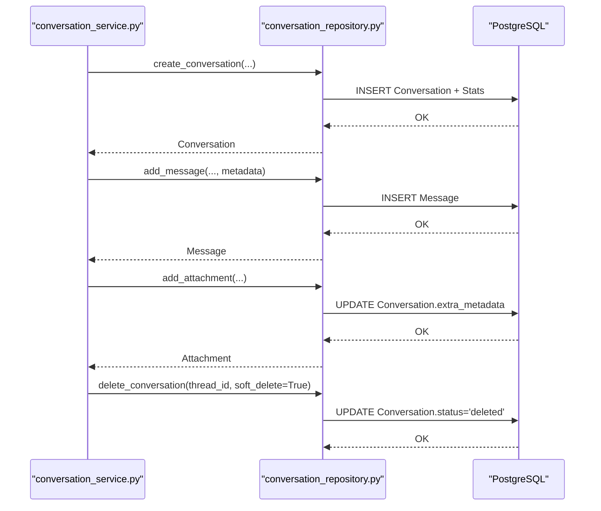
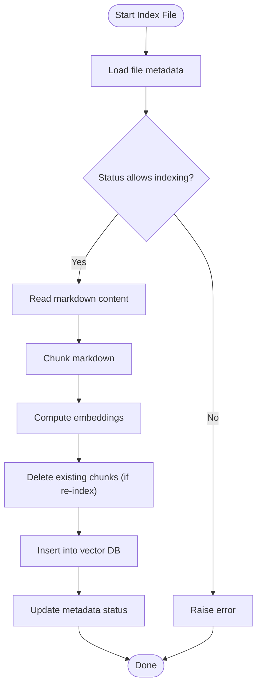
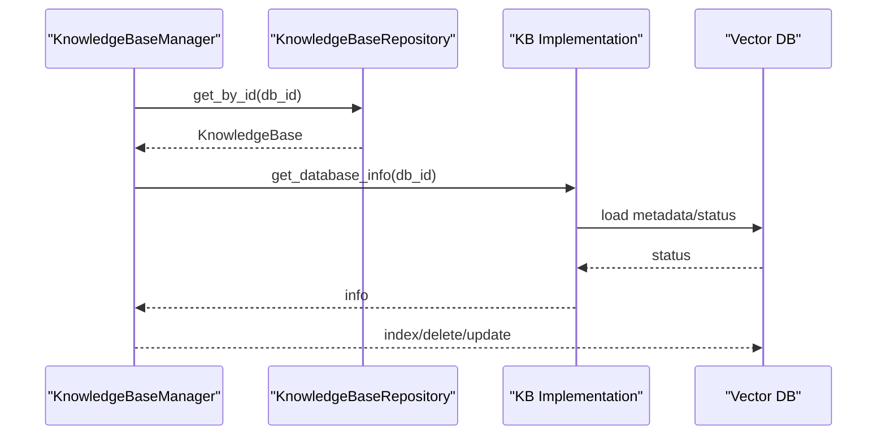
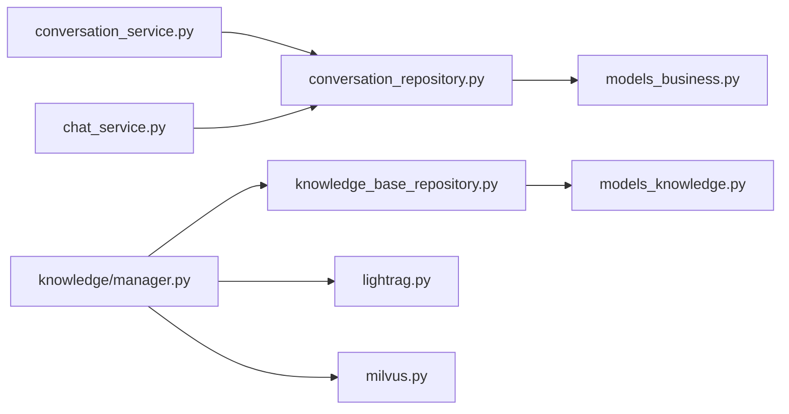

# Data Lifecycle Management

<cite>
**Referenced Files in This Document**
- [models_business.py](file://backend/package/yuxi/storage/postgres/models_business.py)
- [models_knowledge.py](file://backend/package/yuxi/storage/postgres/models_knowledge.py)
- [conversation_repository.py](file://backend/package/yuxi/repositories/conversation_repository.py)
- [knowledge_base_repository.py](file://backend/package/yuxi/repositories/knowledge_base_repository.py)
- [conversation_service.py](file://backend/package/yuxi/services/conversation_service.py)
- [chat_service.py](file://backend/package/yuxi/services/chat_service.py)
- [manager.py](file://backend/package/yuxi/knowledge/manager.py)
- [lightrag.py](file://backend/package/yuxi/knowledge/implementations/lightrag.py)
- [milvus.py](file://backend/package/yuxi/knowledge/implementations/milvus.py)
- [datetime_utils.py](file://backend/package/yuxi/utils/datetime_utils.py)
</cite>

## Table of Contents
1. [Introduction](#introduction)
2. [Project Structure](#project-structure)
3. [Core Components](#core-components)
4. [Architecture Overview](#architecture-overview)
5. [Detailed Component Analysis](#detailed-component-analysis)
6. [Dependency Analysis](#dependency-analysis)
7. [Performance Considerations](#performance-considerations)
8. [Troubleshooting Guide](#troubleshooting-guide)
9. [Conclusion](#conclusion)
10. [Appendices](#appendices)

## Introduction
This document describes the end-to-end data lifecycle management for the Yuxi platform’s database systems. It covers how business entities (users, departments, conversations, messages, tasks, API keys, etc.) and knowledge base content are created, maintained, archived, and eventually deleted. It also documents retention policies, soft deletion mechanisms, data archival strategies, automated cleanup processes, compliance requirements, backup and recovery procedures, data migration strategies, and version management for evolving schemas. Special attention is given to the coordination between PostgreSQL business data and vector database content management.

## Project Structure
The data lifecycle spans three major layers:
- Business data models and repositories (PostgreSQL): user, department, conversation, message, task, API key, operation logs, etc.
- Knowledge base models and repositories (PostgreSQL): knowledge base, knowledge file, evaluation records.
- Knowledge base implementations: LightRAG (Milvus + Neo4j) and Milvus-only implementations.

**Diagram sources**
- [models_business.py:29-706](file://backend/package/yuxi/storage/postgres/models_business.py#L29-L706)
- [models_knowledge.py:23-139](file://backend/package/yuxi/storage/postgres/models_knowledge.py#L23-L139)
- [conversation_repository.py:18-464](file://backend/package/yuxi/repositories/conversation_repository.py#L18-L464)
- [knowledge_base_repository.py:11-44](file://backend/package/yuxi/repositories/knowledge_base_repository.py#L11-L44)
- [conversation_service.py:267-340](file://backend/package/yuxi/services/conversation_service.py#L267-L340)
- [chat_service.py:464-655](file://backend/package/yuxi/services/chat_service.py#L464-L655)
- [manager.py:15-102](file://backend/package/yuxi/knowledge/manager.py#L15-L102)
- [lightrag.py:23-42](file://backend/package/yuxi/knowledge/implementations/lightrag.py#L23-L42)
- [milvus.py:24-63](file://backend/package/yuxi/knowledge/implementations/milvus.py#L24-L63)

**Section sources**
- [models_business.py:29-706](file://backend/package/yuxi/storage/postgres/models_business.py#L29-L706)
- [models_knowledge.py:23-139](file://backend/package/yuxi/storage/postgres/models_knowledge.py#L23-L139)
- [conversation_repository.py:18-464](file://backend/package/yuxi/repositories/conversation_repository.py#L18-L464)
- [knowledge_base_repository.py:11-44](file://backend/package/yuxi/repositories/knowledge_base_repository.py#L11-L44)
- [conversation_service.py:267-340](file://backend/package/yuxi/services/conversation_service.py#L267-L340)
- [chat_service.py:464-655](file://backend/package/yuxi/services/chat_service.py#L464-L655)
- [manager.py:15-102](file://backend/package/yuxi/knowledge/manager.py#L15-L102)
- [lightrag.py:23-42](file://backend/package/yuxi/knowledge/implementations/lightrag.py#L23-L42)
- [milvus.py:24-63](file://backend/package/yuxi/knowledge/implementations/milvus.py#L24-L63)

## Core Components
- PostgreSQL business models define entities such as users, departments, conversations, messages, tasks, and API keys. They include soft-deletion fields and timestamps for lifecycle tracking.
- PostgreSQL knowledge models define knowledge bases, files, and evaluation records with foreign-key relationships and JSON metadata.
- Repositories encapsulate persistence operations for conversations and knowledge base metadata.
- Services orchestrate conversation lifecycle events, manage attachment lifecycle, and coordinate with vector databases.
- KnowledgeBaseManager coordinates multiple knowledge base implementations and synchronizes metadata with vector storage.

**Section sources**
- [models_business.py:29-706](file://backend/package/yuxi/storage/postgres/models_business.py#L29-L706)
- [models_knowledge.py:23-139](file://backend/package/yuxi/storage/postgres/models_knowledge.py#L23-L139)
- [conversation_repository.py:18-464](file://backend/package/yuxi/repositories/conversation_repository.py#L18-L464)
- [knowledge_base_repository.py:11-44](file://backend/package/yuxi/repositories/knowledge_base_repository.py#L11-L44)
- [conversation_service.py:267-340](file://backend/package/yuxi/services/conversation_service.py#L267-L340)
- [chat_service.py:464-655](file://backend/package/yuxi/services/chat_service.py#L464-L655)
- [manager.py:15-102](file://backend/package/yuxi/knowledge/manager.py#L15-L102)

## Architecture Overview
The lifecycle architecture integrates relational and vector stores:
- Relational store (PostgreSQL) maintains business metadata and conversation/message threads.
- Vector store (Milvus or LightRAG stack) maintains indexed chunks and relationships for retrieval.
- KnowledgeBaseManager abstracts implementations and ensures metadata consistency across stores.

**Diagram sources**
- [models_business.py:29-706](file://backend/package/yuxi/storage/postgres/models_business.py#L29-L706)
- [models_knowledge.py:23-139](file://backend/package/yuxi/storage/postgres/models_knowledge.py#L23-L139)
- [lightrag.py:23-42](file://backend/package/yuxi/knowledge/implementations/lightrag.py#L23-L42)
- [milvus.py:24-63](file://backend/package/yuxi/knowledge/implementations/milvus.py#L24-L63)

## Detailed Component Analysis

### Business Data Lifecycle (PostgreSQL)
- Creation: Entities are created via service-layer calls that persist to repositories/models.
- Updates: Timestamps and counters are updated on changes; conversation status supports archival states.
- Soft Deletion: Users carry an is_deleted flag and deleted_at timestamp; conversations support a deleted status.
- Archival: Conversations can be marked archived; attachments metadata is maintained separately.
- Cleanup: No explicit automated cleanup jobs are present in the reviewed files; lifecycle hooks are not defined.

**Diagram sources**
- [models_business.py:51-706](file://backend/package/yuxi/storage/postgres/models_business.py#L51-L706)

**Section sources**
- [models_business.py:51-706](file://backend/package/yuxi/storage/postgres/models_business.py#L51-L706)
- [conversation_repository.py:312-326](file://backend/package/yuxi/repositories/conversation_repository.py#L312-L326)
- [conversation_service.py:328-340](file://backend/package/yuxi/services/conversation_service.py#L328-L340)

### Conversation and Message Lifecycle
- Creation: New conversations are created with defaults and initial stats; messages are appended with metadata and tool-call tracking.
- Streaming and persistence: Assistant messages and tool-call outputs are saved after generation or interruption.
- Attachments: Files are materialized locally and tracked in conversation metadata; removal deletes local files and updates state.
- Deletion: Conversations support soft deletion by setting status to deleted; permanent deletion removes records.

**Diagram sources**
- [conversation_service.py:267-340](file://backend/package/yuxi/services/conversation_service.py#L267-L340)
- [conversation_repository.py:35-69](file://backend/package/yuxi/repositories/conversation_repository.py#L35-L69)
- [conversation_repository.py:105-134](file://backend/package/yuxi/repositories/conversation_repository.py#L105-L134)
- [conversation_repository.py:413-424](file://backend/package/yuxi/repositories/conversation_repository.py#L413-L424)
- [conversation_repository.py:312-326](file://backend/package/yuxi/repositories/conversation_repository.py#L312-L326)

**Section sources**
- [conversation_service.py:267-340](file://backend/package/yuxi/services/conversation_service.py#L267-L340)
- [conversation_repository.py:35-69](file://backend/package/yuxi/repositories/conversation_repository.py#L35-L69)
- [conversation_repository.py:105-134](file://backend/package/yuxi/repositories/conversation_repository.py#L105-L134)
- [conversation_repository.py:413-424](file://backend/package/yuxi/repositories/conversation_repository.py#L413-L424)
- [conversation_repository.py:312-326](file://backend/package/yuxi/repositories/conversation_repository.py#L312-L326)

### Knowledge Base Content Lifecycle
- Metadata: KnowledgeBase and KnowledgeFile records live in PostgreSQL; they track processing status and parameters.
- Indexing: Files are parsed and chunked; implementations insert vectors/chunks into Milvus or LightRAG stacks.
- Retrieval: Queries return ranked chunks; optional reranking supported.
- Updates: Re-indexing deletes existing chunks and re-inserts new ones.
- Deletion: Files are removed from vector stores and metadata; databases can be dropped from vector backends.

**Diagram sources**
- [lightrag.py:305-421](file://backend/package/yuxi/knowledge/implementations/lightrag.py#L305-L421)
- [milvus.py:227-359](file://backend/package/yuxi/knowledge/implementations/milvus.py#L227-L359)

**Section sources**
- [models_knowledge.py:23-139](file://backend/package/yuxi/storage/postgres/models_knowledge.py#L23-L139)
- [knowledge_base_repository.py:11-44](file://backend/package/yuxi/repositories/knowledge_base_repository.py#L11-L44)
- [manager.py:406-427](file://backend/package/yuxi/knowledge/manager.py#L406-L427)
- [lightrag.py:305-421](file://backend/package/yuxi/knowledge/implementations/lightrag.py#L305-L421)
- [milvus.py:227-359](file://backend/package/yuxi/knowledge/implementations/milvus.py#L227-L359)

### Coordination Between PostgreSQL and Vector Databases
- Metadata-first: PostgreSQL stores metadata and processing state; vector stores hold searchable content.
- Consistency: KnowledgeBaseManager ensures metadata availability and delegates vector operations to implementations.
- Deletion: Vector stores are cleaned when files are removed; database-level deletions drop vector collections.

**Diagram sources**
- [manager.py:444-473](file://backend/package/yuxi/knowledge/manager.py#L444-L473)
- [lightrag.py:601-625](file://backend/package/yuxi/knowledge/implementations/lightrag.py#L601-L625)
- [milvus.py:703-714](file://backend/package/yuxi/knowledge/implementations/milvus.py#L703-L714)

**Section sources**
- [manager.py:444-473](file://backend/package/yuxi/knowledge/manager.py#L444-L473)
- [lightrag.py:601-625](file://backend/package/yuxi/knowledge/implementations/lightrag.py#L601-L625)
- [milvus.py:703-714](file://backend/package/yuxi/knowledge/implementations/milvus.py#L703-L714)

## Dependency Analysis
- Repositories depend on SQLAlchemy models and async sessions.
- Services depend on repositories and external integrations (parsers, vector DBs).
- KnowledgeBaseManager depends on repositories and implementation factories.
- Vector implementations depend on Milvus/LightRAG clients and embedding models.

**Diagram sources**
- [conversation_service.py:15-18](file://backend/package/yuxi/services/conversation_service.py#L15-L18)
- [chat_service.py:15-25](file://backend/package/yuxi/services/chat_service.py#L15-L25)
- [conversation_repository.py:11-13](file://backend/package/yuxi/repositories/conversation_repository.py#L11-L13)
- [models_business.py:23-24](file://backend/package/yuxi/storage/postgres/models_business.py#L23-L24)
- [manager.py:50-54](file://backend/package/yuxi/knowledge/manager.py#L50-L54)
- [knowledge_base_repository.py:7-8](file://backend/package/yuxi/repositories/knowledge_base_repository.py#L7-L8)
- [models_knowledge.py:16-20](file://backend/package/yuxi/storage/postgres/models_knowledge.py#L16-L20)
- [lightrag.py:6-11](file://backend/package/yuxi/knowledge/implementations/lightrag.py#L6-L11)
- [milvus.py:9-11](file://backend/package/yuxi/knowledge/implementations/milvus.py#L9-L11)

**Section sources**
- [conversation_service.py:15-18](file://backend/package/yuxi/services/conversation_service.py#L15-L18)
- [chat_service.py:15-25](file://backend/package/yuxi/services/chat_service.py#L15-L25)
- [conversation_repository.py:11-13](file://backend/package/yuxi/repositories/conversation_repository.py#L11-L13)
- [models_business.py:23-24](file://backend/package/yuxi/storage/postgres/models_business.py#L23-L24)
- [manager.py:50-54](file://backend/package/yuxi/knowledge/manager.py#L50-L54)
- [knowledge_base_repository.py:7-8](file://backend/package/yuxi/repositories/knowledge_base_repository.py#L7-L8)
- [models_knowledge.py:16-20](file://backend/package/yuxi/storage/postgres/models_knowledge.py#L16-L20)
- [lightrag.py:6-11](file://backend/package/yuxi/knowledge/implementations/lightrag.py#L6-L11)
- [milvus.py:9-11](file://backend/package/yuxi/knowledge/implementations/milvus.py#L9-L11)

## Performance Considerations
- Asynchronous operations: Repositories and services use async I/O to minimize latency.
- Batch embedding: Milvus implementation computes embeddings in batches to improve throughput.
- Indexing pipeline: Chunking and embedding are decoupled from persistence to enable parallelism.
- Query tuning: Milvus supports configurable top_k, thresholds, and reranking to balance accuracy and latency.

[No sources needed since this section provides general guidance]

## Troubleshooting Guide
- Conversation not found: Service checks ensure the thread belongs to the current user and is not deleted.
- Interrupted streams: On client disconnect or errors, partial assistant messages are saved with error metadata.
- Vector indexing failures: Status transitions to error; metadata persists for diagnostics.
- Timezone handling: All timestamps are normalized to UTC; ISO strings include timezone info.

**Section sources**
- [conversation_service.py:102-106](file://backend/package/yuxi/services/conversation_service.py#L102-L106)
- [chat_service.py:879-926](file://backend/package/yuxi/services/chat_service.py#L879-L926)
- [lightrag.py:408-416](file://backend/package/yuxi/knowledge/implementations/lightrag.py#L408-L416)
- [milvus.py:345-354](file://backend/package/yuxi/knowledge/implementations/milvus.py#L345-L354)
- [datetime_utils.py:57-76](file://backend/package/yuxi/utils/datetime_utils.py#L57-L76)

## Conclusion
The Yuxi platform implements a robust, layered data lifecycle:
- Business entities are managed with soft deletion and clear timestamps.
- Conversations and messages are persisted with streaming-safe hooks and attachment lifecycle management.
- Knowledge base content is governed by metadata-first design with vector stores for retrieval.
- No automated cleanup jobs were identified in the reviewed files; lifecycle hooks are not defined.
- Compliance and residency considerations are not explicitly implemented in the reviewed code.

[No sources needed since this section summarizes without analyzing specific files]

## Appendices

### Retention Policies and Archival Strategies
- Conversations: Support archival via status flags; soft deletion sets status to deleted.
- Messages: Persisted with timestamps; no automatic purge logic observed.
- Knowledge files: Indexed and stored in vector DBs; deletion removes both vector and metadata.
- Attachments: Stored locally and tracked in conversation metadata; removal cleans local files.

**Section sources**
- [models_business.py:228-264](file://backend/package/yuxi/storage/postgres/models_business.py#L228-L264)
- [conversation_repository.py:312-326](file://backend/package/yuxi/repositories/conversation_repository.py#L312-L326)
- [lightrag.py:614-625](file://backend/package/yuxi/knowledge/implementations/lightrag.py#L614-L625)
- [milvus.py:703-714](file://backend/package/yuxi/knowledge/implementations/milvus.py#L703-L714)

### Automated Cleanup and Scheduled Jobs
- No scheduled cleanup jobs or lifecycle hooks were found in the reviewed files.

**Section sources**
- [conversation_repository.py:18-464](file://backend/package/yuxi/repositories/conversation_repository.py#L18-L464)
- [manager.py:15-102](file://backend/package/yuxi/knowledge/manager.py#L15-L102)

### Backup and Recovery Procedures
- No explicit backup/recovery procedures were identified in the reviewed files.

**Section sources**
- [models_business.py:23-24](file://backend/package/yuxi/storage/postgres/models_business.py#L23-L24)
- [models_knowledge.py:16-20](file://backend/package/yuxi/storage/postgres/models_knowledge.py#L16-L20)

### Data Migration and Version Management
- Schema evolution relies on SQLAlchemy models and migrations; no migration-specific logic was found in the reviewed files.
- KnowledgeBaseManager caches instances per type and reloads metadata as needed.

**Section sources**
- [models_business.py:23-24](file://backend/package/yuxi/storage/postgres/models_business.py#L23-L24)
- [manager.py:38-82](file://backend/package/yuxi/knowledge/manager.py#L38-L82)

### Audit Trail and Compliance
- Operation logs capture user actions; no explicit GDPR or data residency controls were found in the reviewed files.

**Section sources**
- [models_business.py:373-396](file://backend/package/yuxi/storage/postgres/models_business.py#L373-L396)
- [models_business.py:51-104](file://backend/package/yuxi/storage/postgres/models_business.py#L51-L104)