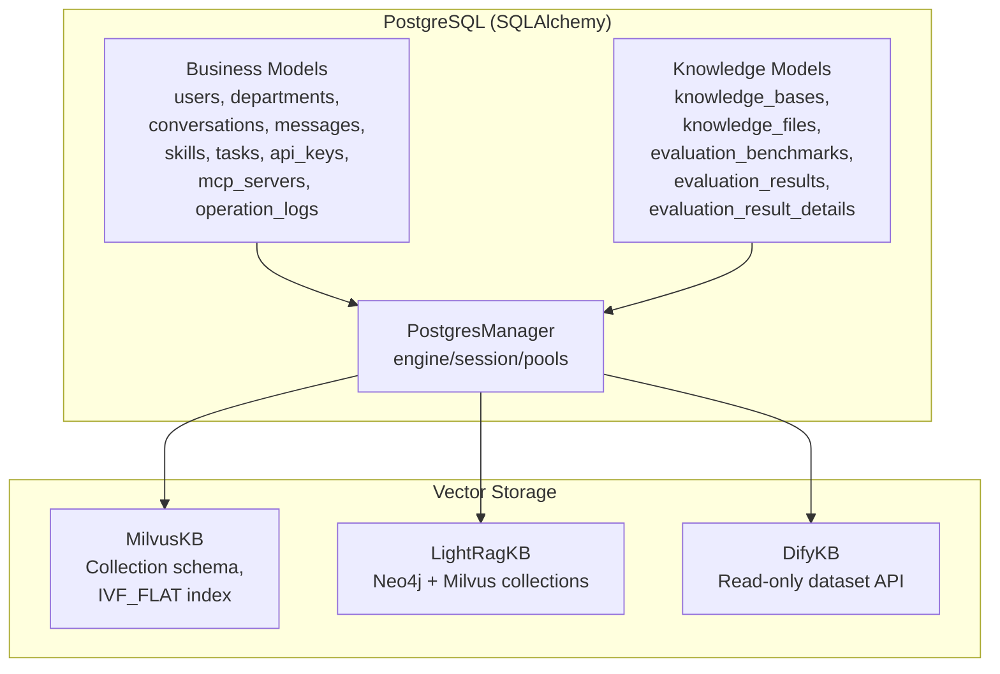
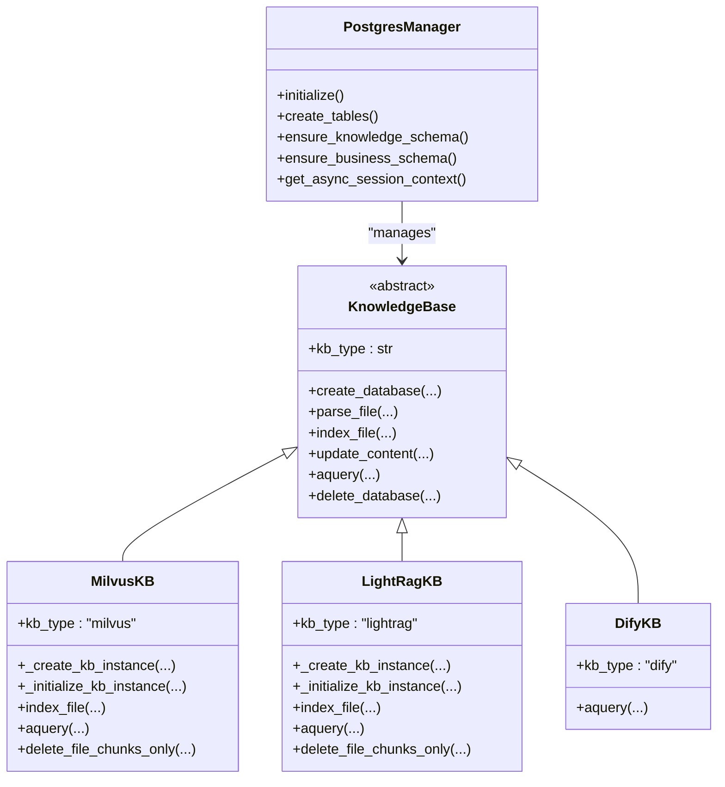
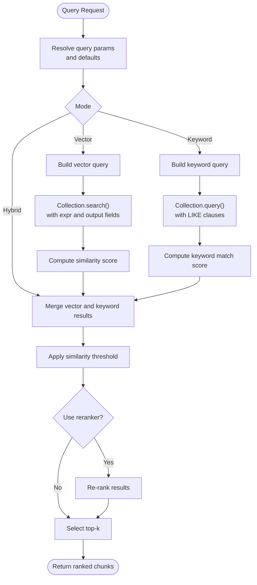
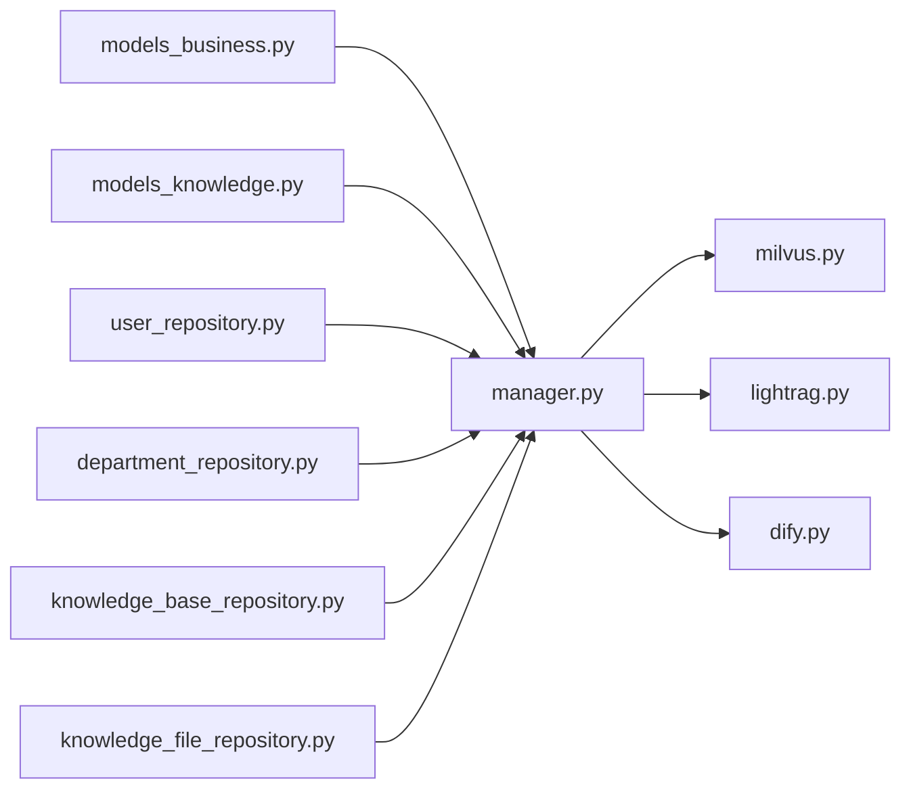

# Data Models & Database Schema

<cite>
**Referenced Files in This Document**
- [models_business.py](file://backend/package/yuxi/storage/postgres/models_business.py)
- [models_knowledge.py](file://backend/package/yuxi/storage/postgres/models_knowledge.py)
- [manager.py](file://backend/package/yuxi/storage/postgres/manager.py)
- [user_repository.py](file://backend/package/yuxi/repositories/user_repository.py)
- [department_repository.py](file://backend/package/yuxi/repositories/department_repository.py)
- [knowledge_base_repository.py](file://backend/package/yuxi/repositories/knowledge_base_repository.py)
- [knowledge_file_repository.py](file://backend/package/yuxi/repositories/knowledge_file_repository.py)
- [base.py](file://backend/package/yuxi/knowledge/base.py)
- [milvus.py](file://backend/package/yuxi/knowledge/implementations/milvus.py)
- [lightrag.py](file://backend/package/yuxi/knowledge/implementations/lightrag.py)
- [dify.py](file://backend/package/yuxi/knowledge/implementations/dify.py)
- [kb_utils.py](file://backend/package/yuxi/knowledge/utils/kb_utils.py)
- [embed.py](file://backend/package/yuxi/models/embed.py)
</cite>

## Table of Contents
1. [Introduction](#introduction)
2. [Project Structure](#project-structure)
3. [Core Components](#core-components)
4. [Architecture Overview](#architecture-overview)
5. [Detailed Component Analysis](#detailed-component-analysis)
6. [Dependency Analysis](#dependency-analysis)
7. [Performance Considerations](#performance-considerations)
8. [Troubleshooting Guide](#troubleshooting-guide)
9. [Conclusion](#conclusion)
10. [Appendices](#appendices)

## Introduction
This document provides comprehensive data model documentation for the Yuxi platform’s database schema. It covers:
- PostgreSQL relational models for business entities (users, departments, conversations, skills, tasks, etc.), including constraints, indexes, and referential integrity.
- Vector database schema for knowledge storage and retrieval, including embedding management and similarity search across Milvus, LightRAG (Neo4j + Milvus), and Dify integrations.
- Data access patterns via repositories and managers.
- Security, validation, and lifecycle management considerations.

## Project Structure
The database schema is split into two primary domains:
- Business domain: user management, departments, conversations, skills, tasks, API keys, MCP servers, and related operational logs.
- Knowledge domain: knowledge bases, knowledge files, and evaluation artifacts.

These are implemented as SQLAlchemy models and orchestrated by a shared PostgreSQL manager. Vector storage is handled by separate implementations (Milvus, LightRAG, Dify).

**Diagram sources**
- [models_business.py:1-706](file://backend/package/yuxi/storage/postgres/models_business.py#L1-L706)
- [models_knowledge.py:1-139](file://backend/package/yuxi/storage/postgres/models_knowledge.py#L1-L139)
- [manager.py:1-291](file://backend/package/yuxi/storage/postgres/manager.py#L1-L291)
- [milvus.py:1-897](file://backend/package/yuxi/knowledge/implementations/milvus.py#L1-L897)
- [lightrag.py:1-779](file://backend/package/yuxi/knowledge/implementations/lightrag.py#L1-L779)
- [dify.py:1-221](file://backend/package/yuxi/knowledge/implementations/dify.py#L1-L221)

**Section sources**
- [models_business.py:1-706](file://backend/package/yuxi/storage/postgres/models_business.py#L1-L706)
- [models_knowledge.py:1-139](file://backend/package/yuxi/storage/postgres/models_knowledge.py#L1-L139)
- [manager.py:1-291](file://backend/package/yuxi/storage/postgres/manager.py#L1-L291)

## Core Components
This section outlines the primary models and their roles.

- Business Models
  - Department: organizational units with unique names and hierarchical relationships via users.
  - User: identity and authentication with role-based access, login throttling, soft-deletion, and API key linkage.
  - AgentConfig: per-department agent configurations with uniqueness constraints.
  - Skill: metadata for skills stored in filesystem with JSON dependencies and optional versioning.
  - Conversation, Message, ToolCall, ConversationStats: structured chat history and tool-call tracking.
  - OperationLog: audit trail for user actions.
  - MessageFeedback: user ratings for messages.
  - MCPServer: external MCP server configuration with transport-specific fields.
  - TaskRecord: asynchronous task lifecycle tracking.
  - SubAgent: dynamic sub-agent specification.
  - APIKey: hashed API keys scoped to users or departments with expiration and enablement.
  - AgentRun: run-level tracking for agent executions.

- Knowledge Models
  - KnowledgeBase: knowledge base definition with JSON metadata for embeddings, LLMs, query params, sharing, mindmaps, and sample questions.
  - KnowledgeFile: file records with parent-child hierarchy, status, hashes, sizes, and processing params.
  - EvaluationBenchmark: benchmark definitions linked to knowledge bases.
  - EvaluationResult, EvaluationResultDetail: evaluation runs and per-query details.

- Vector Implementations
  - MilvusKB: production-grade vector storage with configurable IVF_FLAT index and hybrid search.
  - LightRagKB: integrates with Neo4j and Milvus for graph and vector storage.
  - DifyKB: read-only retrieval via Dify dataset APIs.

**Section sources**
- [models_business.py:29-706](file://backend/package/yuxi/storage/postgres/models_business.py#L29-L706)
- [models_knowledge.py:23-139](file://backend/package/yuxi/storage/postgres/models_knowledge.py#L23-L139)
- [base.py:46-800](file://backend/package/yuxi/knowledge/base.py#L46-L800)
- [milvus.py:24-897](file://backend/package/yuxi/knowledge/implementations/milvus.py#L24-L897)
- [lightrag.py:23-779](file://backend/package/yuxi/knowledge/implementations/lightrag.py#L23-L779)
- [dify.py:10-221](file://backend/package/yuxi/knowledge/implementations/dify.py#L10-L221)

## Architecture Overview
The system combines relational and vector stores:
- Relational data is managed by SQLAlchemy models under a single engine/session managed by PostgresManager.
- Vector data is managed by specialized implementations:
  - MilvusKB creates and manages collections with embedding vectors and indices.
  - LightRagKB orchestrates Neo4j and Milvus for graph and vector storage.
  - DifyKB provides read-only retrieval against external datasets.

**Diagram sources**
- [manager.py:28-291](file://backend/package/yuxi/storage/postgres/manager.py#L28-L291)
- [base.py:46-800](file://backend/package/yuxi/knowledge/base.py#L46-L800)
- [milvus.py:24-897](file://backend/package/yuxi/knowledge/implementations/milvus.py#L24-L897)
- [lightrag.py:23-779](file://backend/package/yuxi/knowledge/implementations/lightrag.py#L23-L779)
- [dify.py:10-221](file://backend/package/yuxi/knowledge/implementations/dify.py#L10-L221)

## Detailed Component Analysis

### PostgreSQL Business Models
- Department
  - Fields: id (PK), name (unique, indexed), description, created_at.
  - Relationships: users back-populated via department_id FK.
- User
  - Fields: id (PK), username (unique, indexed), user_id (unique, indexed), phone_number (unique, indexed), avatar, password_hash, role, department_id (FK), created_at, last_login, login counters and locks, is_deleted (indexed), deleted_at.
  - Constraints: login lockout logic and soft-delete semantics.
  - Relationships: department, operation_logs, api_keys.
- AgentConfig
  - Fields: id (PK), department_id (FK), agent_id, name, description, icon, pics, examples, config_json, is_default (indexed), created_by, updated_by, created_at, updated_at.
  - Constraints: unique constraint on (department_id, agent_id, name); partial unique index on (department_id, agent_id) where is_default is true.
- Skill
  - Fields: id (PK), slug (unique, indexed), name, description, tool_dependencies (JSON), mcp_dependencies (JSON), skill_dependencies (JSON), dir_path, version, is_builtin, content_hash, created_by, updated_by, created_at, updated_at.
- Conversation
  - Fields: id (PK), thread_id (unique, indexed), user_id, agent_id, title, status, is_pinned (indexed), created_at, updated_at, extra_metadata (JSON).
  - Relationships: messages, stats.
- Message
  - Fields: id (PK), conversation_id (FK), role, content, message_type, created_at, token_count, extra_metadata (JSON), image_content.
  - Relationships: conversation, tool_calls, feedbacks.
- ToolCall
  - Fields: id (PK), message_id (FK), langgraph_tool_call_id (indexed), tool_name, tool_input (JSON), tool_output, status, error_message, created_at.
- ConversationStats
  - Fields: id (PK), conversation_id (FK, unique), message_count, total_tokens, model_used, user_feedback (JSON), created_at, updated_at.
  - Relationships: conversation.
- OperationLog
  - Fields: id (PK), user_id (FK), operation, details, ip_address, timestamp.
  - Relationships: user.
- MessageFeedback
  - Fields: id (PK), message_id (FK, indexed), user_id (indexed), rating, reason, created_at.
- MCPServer
  - Fields: name (PK), description, transport, url, command, args (JSON), env (JSON), headers (JSON), timeout, sse_read_timeout, tags (JSON), icon, enabled, disabled_tools (JSON), created_by, updated_by, created_at, updated_at.
- TaskRecord
  - Fields: id (PK), name, type (indexed), status (indexed), progress, message, payload (JSON), result (JSON), error, cancel_requested, created_at (indexed), updated_at, started_at, completed_at.
- SubAgent
  - Fields: name (PK), description, system_prompt, tools (JSON), model, enabled, is_builtin, created_by, updated_by, created_at, updated_at.
- APIKey
  - Fields: id (PK), key_hash (unique, indexed), key_prefix, name, user_id (FK), department_id (FK), expires_at, is_enabled, last_used_at, created_by, created_at.
  - Relationships: user, department.
- AgentRun
  - Fields: id (PK), thread_id, agent_id, user_id, status (indexed), request_id (unique, indexed), input_payload (JSON), error_type, error_message, started_at, finished_at, created_at, updated_at.

Indexes and Constraints
- Unique constraints: departments.name, users.user_id, users.username, users.phone_number, agent_configs (department_id, agent_id, name), knowledge_bases.db_id, knowledge_files.file_id, evaluation_benchmarks.benchmark_id, evaluation_results.task_id, evaluation_result_details (task_id, query_index).
- Partial unique index: agent_configs default per (department_id, agent_id).
- Additional indexes: conversations.is_pinned, agent_runs indexes on user/thread/status/created_at.

Validation and Business Rules
- User login lockout after repeated failures; soft-delete pattern with is_deleted flag and masked identifiers on deletion.
- AgentRun status transitions and idempotency via request_id.
- KnowledgeBase/KnowledgeFile additional_params and JSON fields evolve via schema migrations.

**Section sources**
- [models_business.py:29-706](file://backend/package/yuxi/storage/postgres/models_business.py#L29-L706)
- [manager.py:119-222](file://backend/package/yuxi/storage/postgres/manager.py#L119-L222)

### PostgreSQL Knowledge Models
- KnowledgeBase
  - db_id (unique, indexed), name (indexed), description, kb_type (indexed), embed_info, llm_info, query_params, additional_params, share_config, mindmap, sample_questions, timestamps.
- KnowledgeFile
  - file_id (unique, indexed), db_id (FK, indexed), parent_id (FK), filename, original_filename, file_type, path, minio_url, markdown_file, status (indexed), content_hash (indexed), file_size, content_type, processing_params (JSON), is_folder, error_message, created_by, updated_by, timestamps.
- EvaluationBenchmark
  - benchmark_id (unique, indexed), db_id (FK, indexed), name, description, question_count, has_gold_chunks, has_gold_answers, data_file_path, created_by, timestamps.
- EvaluationResult
  - task_id (unique, indexed), db_id (FK, indexed), benchmark_id (FK, indexed), status (indexed), retrieval_config, metrics (JSON), overall_score, total_questions, completed_questions, started_at (indexed), completed_at, created_by.
- EvaluationResultDetail
  - task_id (FK, indexed), query_index, query_text, gold_chunk_ids (JSON), gold_answer, generated_answer, retrieved_chunks (JSON), metrics (JSON).

Vector Indexing and Retrieval
- MilvusKB: collection schema with embedding vector field and IVF_FLAT index; supports vector and keyword hybrid search with optional reranking.
- LightRagKB: manages Neo4j and Milvus collections for entities/relationships and chunks; supports graph and vector retrieval modes.
- DifyKB: read-only retrieval via dataset retrieve API with semantic/keyword/hybrid modes.

**Section sources**
- [models_knowledge.py:23-139](file://backend/package/yuxi/storage/postgres/models_knowledge.py#L23-L139)
- [milvus.py:90-164](file://backend/package/yuxi/knowledge/implementations/milvus.py#L90-L164)
- [lightrag.py:136-181](file://backend/package/yuxi/knowledge/implementations/lightrag.py#L136-L181)
- [dify.py:69-162](file://backend/package/yuxi/knowledge/implementations/dify.py#L69-L162)

### Data Access Patterns and Repositories
Repositories encapsulate CRUD and aggregation operations against PostgreSQL models:
- UserRepository: fetch by id/user_id/phone; list with filters; soft delete; counts; admin count per department.
- DepartmentRepository: fetch by id/name; list with user counts; create/update/delete; count users.
- KnowledgeBaseRepository: get/create/update/delete knowledge base.
- KnowledgeFileRepository: get/list by db_id; upsert; delete by file_id/db_id.

Usage Pattern
- Async context-managed sessions via PostgresManager.
- ORM queries with joins and filters; scalar queries for existence checks.

**Section sources**
- [user_repository.py:16-148](file://backend/package/yuxi/repositories/user_repository.py#L16-L148)
- [department_repository.py:11-96](file://backend/package/yuxi/repositories/department_repository.py#L11-L96)
- [knowledge_base_repository.py:11-44](file://backend/package/yuxi/repositories/knowledge_base_repository.py#L11-L44)
- [knowledge_file_repository.py:11-52](file://backend/package/yuxi/repositories/knowledge_file_repository.py#L11-L52)
- [manager.py:230-249](file://backend/package/yuxi/storage/postgres/manager.py#L230-L249)

### Vector Database Schema and Retrieval

#### Milvus Implementation
- Collection schema includes id, content, source, chunk_id, file_id, chunk_index, embedding vector.
- Index: IVF_FLAT with cosine distance.
- Query modes: vector, keyword, hybrid; optional reranking; threshold filtering; file-name filtering via expr.

**Diagram sources**
- [milvus.py:471-676](file://backend/package/yuxi/knowledge/implementations/milvus.py#L471-L676)

**Section sources**
- [milvus.py:135-164](file://backend/package/yuxi/knowledge/implementations/milvus.py#L135-L164)
- [milvus.py:471-676](file://backend/package/yuxi/knowledge/implementations/milvus.py#L471-L676)

#### LightRAG Implementation
- Manages three Milvus collections (chunks, relationships, entities) and Neo4j graph storage.
- Supports mixed retrieval mode and graph extraction; validates pipeline status post-insertion.

**Section sources**
- [lightrag.py:136-181](file://backend/package/yuxi/knowledge/implementations/lightrag.py#L136-L181)
- [lightrag.py:526-601](file://backend/package/yuxi/knowledge/implementations/lightrag.py#L526-L601)

#### Dify Implementation
- Read-only retrieval via dataset retrieve endpoint; maps modes to semantic/keyword/hybrid; supports threshold filtering.

**Section sources**
- [dify.py:69-162](file://backend/package/yuxi/knowledge/implementations/dify.py#L69-L162)

### Embedding Management
- Embedding selection and configuration:
  - select_embedding_model chooses provider (local unsupported, ollama or other).
  - OllamaEmbedding and OtherEmbedding implement sync/async encoding.
  - Batch encoding with progress tracking.
- KnowledgeBase metadata resolution:
  - get_embedding_config resolves model settings from environment/config.
  - kb_utils provides path validation, content hashing, and metadata preparation.

**Section sources**
- [embed.py:13-296](file://backend/package/yuxi/models/embed.py#L13-L296)
- [kb_utils.py:356-405](file://backend/package/yuxi/knowledge/utils/kb_utils.py#L356-L405)
- [kb_utils.py:192-328](file://backend/package/yuxi/knowledge/utils/kb_utils.py#L192-L328)

## Dependency Analysis
- Business models depend on shared Base and use foreign keys to enforce referential integrity.
- Knowledge models depend on shared Base and are managed alongside business models by PostgresManager.
- Vector implementations depend on external systems (Milvus, Neo4j, Dify) and use Postgres metadata for orchestration.
- Repositories depend on PostgresManager for sessions and SQLAlchemy ORM.

**Diagram sources**
- [models_business.py:1-706](file://backend/package/yuxi/storage/postgres/models_business.py#L1-L706)
- [models_knowledge.py:1-139](file://backend/package/yuxi/storage/postgres/models_knowledge.py#L1-L139)
- [manager.py:1-291](file://backend/package/yuxi/storage/postgres/manager.py#L1-L291)
- [user_repository.py:1-148](file://backend/package/yuxi/repositories/user_repository.py#L1-L148)
- [department_repository.py:1-96](file://backend/package/yuxi/repositories/department_repository.py#L1-L96)
- [knowledge_base_repository.py:1-44](file://backend/package/yuxi/repositories/knowledge_base_repository.py#L1-L44)
- [knowledge_file_repository.py:1-52](file://backend/package/yuxi/repositories/knowledge_file_repository.py#L1-L52)
- [milvus.py:1-897](file://backend/package/yuxi/knowledge/implementations/milvus.py#L1-L897)
- [lightrag.py:1-779](file://backend/package/yuxi/knowledge/implementations/lightrag.py#L1-L779)
- [dify.py:1-221](file://backend/package/yuxi/knowledge/implementations/dify.py#L1-L221)

**Section sources**
- [manager.py:17-26](file://backend/package/yuxi/storage/postgres/manager.py#L17-L26)

## Performance Considerations
- PostgreSQL
  - Indexes on frequently filtered/sorted columns (e.g., conversations.is_pinned, agent_runs indexes).
  - JSON/JSONB fields for flexible metadata; ensure appropriate use of JSON vs JSONB variants.
  - Asynchronous sessions and connection pooling via PostgresManager.
- Vector DB
  - Milvus IVF_FLAT index with tuned nlist; adjust nprobe for latency/accuracy trade-offs.
  - Hybrid search with optional reranking; consider cost of reranking on large result sets.
  - Batch embedding with configurable batch size; monitor progress and throughput.
- Caching and Lifecycle
  - In-memory metadata caches in knowledge base implementations; ensure consistency with persisted state.
  - Soft-delete pattern reduces cascading deletes; maintain audit trail via OperationLog.

[No sources needed since this section provides general guidance]

## Troubleshooting Guide
- PostgreSQL initialization
  - Ensure POSTGRES_URL environment variable is set; PostgresManager logs errors if missing.
- Migration and schema evolution
  - Use ensure_knowledge_schema and ensure_business_schema to add new columns/indexes.
- Vector storage connectivity
  - Verify Milvus URI/token; confirm database creation and collection existence.
  - For LightRAG, ensure Neo4j and Milvus endpoints are reachable and collections exist.
- Retrieval issues
  - Validate embedding model configuration and availability.
  - Check query parameters (top_k, thresholds, search mode) and expressions for keyword filters.
- Audit and compliance
  - OperationLog captures user actions; ensure IP address logging is enabled as needed.

**Section sources**
- [manager.py:40-90](file://backend/package/yuxi/storage/postgres/manager.py#L40-L90)
- [manager.py:119-222](file://backend/package/yuxi/storage/postgres/manager.py#L119-L222)
- [milvus.py:70-89](file://backend/package/yuxi/knowledge/implementations/milvus.py#L70-L89)
- [lightrag.py:61-111](file://backend/package/yuxi/knowledge/implementations/lightrag.py#L61-L111)
- [embed.py:218-277](file://backend/package/yuxi/models/embed.py#L218-L277)

## Conclusion
The Yuxi platform employs a robust dual-schema architecture:
- A relational PostgreSQL layer for identity, organization, conversations, and knowledge lifecycle management.
- A vectorized knowledge layer with pluggable backends for scalable retrieval and graph insights.
This design balances flexibility, performance, and maintainability, with clear separation of concerns and strong operational controls.

[No sources needed since this section summarizes without analyzing specific files]

## Appendices

### Sample Data Structures
- User
  - Example fields: id, username, user_id, phone_number, role, department_id, created_at, last_login, login_failed_count, last_failed_login, login_locked_until, is_deleted, deleted_at.
- KnowledgeBase
  - Example fields: db_id, name, description, kb_type, embed_info, llm_info, query_params, additional_params, share_config, mindmap, sample_questions, created_at, updated_at.
- KnowledgeFile
  - Example fields: file_id, db_id, parent_id, filename, original_filename, file_type, path, minio_url, markdown_file, status, content_hash, file_size, content_type, processing_params, is_folder, error_message, created_by, updated_by, created_at, updated_at.

[No sources needed since this section provides general guidance]