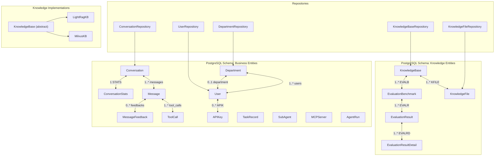
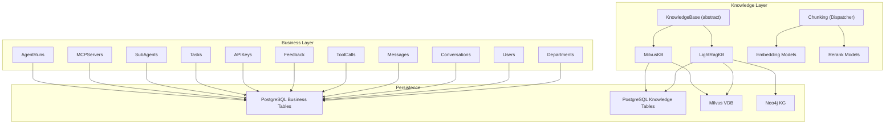
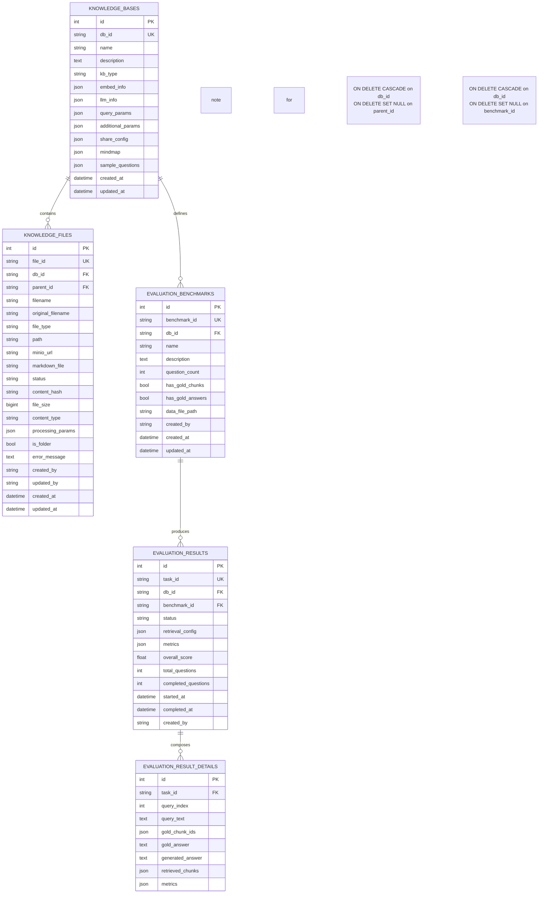
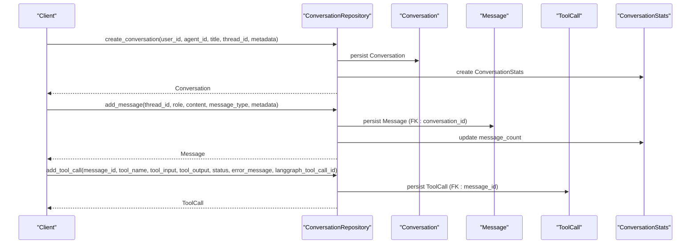
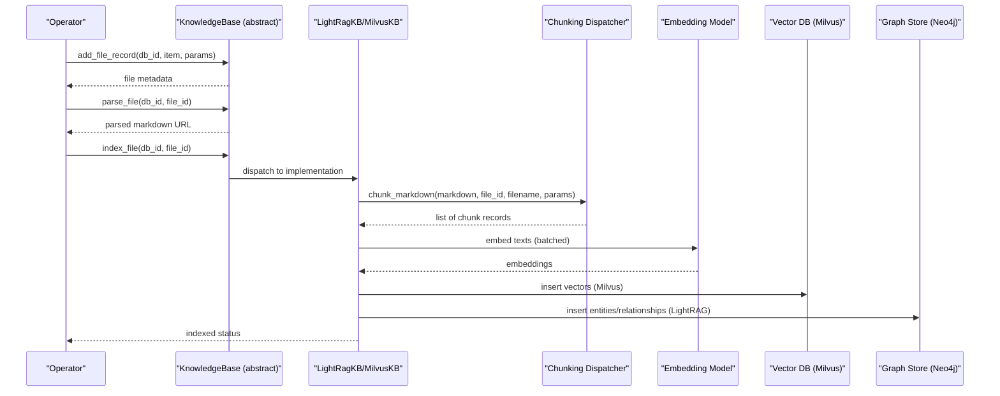
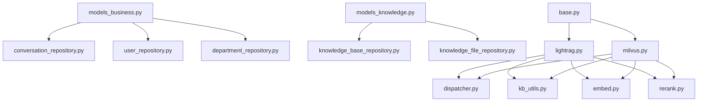

# Entity Relationship Diagrams

<cite>
**Referenced Files in This Document**
- [models_business.py](file://backend/package/yuxi/storage/postgres/models_business.py)
- [models_knowledge.py](file://backend/package/yuxi/storage/postgres/models_knowledge.py)
- [conversation_repository.py](file://backend/package/yuxi/repositories/conversation_repository.py)
- [user_repository.py](file://backend/package/yuxi/repositories/user_repository.py)
- [department_repository.py](file://backend/package/yuxi/repositories/department_repository.py)
- [knowledge_base_repository.py](file://backend/package/yuxi/repositories/knowledge_base_repository.py)
- [knowledge_file_repository.py](file://backend/package/yuxi/repositories/knowledge_file_repository.py)
- [base.py](file://backend/package/yuxi/knowledge/base.py)
- [lightrag.py](file://backend/package/yuxi/knowledge/implementations/lightrag.py)
- [milvus.py](file://backend/package/yuxi/knowledge/implementations/milvus.py)
- [dispatcher.py](file://backend/package/yuxi/knowledge/chunking/ragflow_like/dispatcher.py)
- [kb_utils.py](file://backend/package/yuxi/knowledge/utils/kb_utils.py)
- [chat.py](file://backend/package/yuxi/models/chat.py)
- [embed.py](file://backend/package/yuxi/models/embed.py)
- [rerank.py](file://backend/package/yuxi/models/rerank.py)
</cite>

## Table of Contents
1. [Introduction](#introduction)
2. [Project Structure](#project-structure)
3. [Core Components](#core-components)
4. [Architecture Overview](#architecture-overview)
5. [Detailed Component Analysis](#detailed-component-analysis)
6. [Dependency Analysis](#dependency-analysis)
7. [Performance Considerations](#performance-considerations)
8. [Troubleshooting Guide](#troubleshooting-guide)
9. [Conclusion](#conclusion)

## Introduction
This document presents comprehensive entity relationship documentation for the Yuxi platform, focusing on the complete data model architecture spanning business entities and knowledge management components. It explains foreign key relationships, cascading behaviors, referential integrity constraints, and data flows across departments, users, conversations, messages, and their associated metadata. It also details the relationships between knowledge base entities, document chunks, embeddings, and vector database collections, including complex relationships such as user-department hierarchies, conversation-message-tool_call chains, and skill-dependency graphs. Finally, it addresses many-to-many relationships, optional associations, inheritance patterns, and data consistency requirements across related entities.

## Project Structure
The Yuxi platform organizes its data models into two primary PostgreSQL schema sets:
- Business domain models: departments, users, conversations, messages, tool calls, feedback, API keys, tasks, subagents, MCP servers, and agent runs.
- Knowledge domain models: knowledge bases, knowledge files, and evaluation benchmarks/results.

These models are complemented by repositories for persistence, knowledge base implementations for vector/graph storage, and utility modules for chunking and embedding.



**Diagram sources**
- [models_business.py:29-706](file://backend/package/yuxi/storage/postgres/models_business.py#L29-L706)
- [models_knowledge.py:23-139](file://backend/package/yuxi/storage/postgres/models_knowledge.py#L23-L139)
- [conversation_repository.py:18-464](file://backend/package/yuxi/repositories/conversation_repository.py#L18-L464)
- [user_repository.py:16-148](file://backend/package/yuxi/repositories/user_repository.py#L16-L148)
- [department_repository.py:11-96](file://backend/package/yuxi/repositories/department_repository.py#L11-L96)
- [knowledge_base_repository.py:11-44](file://backend/package/yuxi/repositories/knowledge_base_repository.py#L11-L44)
- [knowledge_file_repository.py:11-52](file://backend/package/yuxi/repositories/knowledge_file_repository.py#L11-L52)
- [base.py:46-1257](file://backend/package/yuxi/knowledge/base.py#L46-L1257)
- [lightrag.py:23-779](file://backend/package/yuxi/knowledge/implementations/lightrag.py#L23-L779)
- [milvus.py:24-897](file://backend/package/yuxi/knowledge/implementations/milvus.py#L24-L897)

**Section sources**
- [models_business.py:1-706](file://backend/package/yuxi/storage/postgres/models_business.py#L1-L706)
- [models_knowledge.py:1-139](file://backend/package/yuxi/storage/postgres/models_knowledge.py#L1-L139)

## Core Components
This section outlines the primary entities and their relationships, highlighting foreign keys, cascading behaviors, and referential integrity constraints.

- Departments and Users
  - Department.id is the primary key; User.department_id references Department.id with ON DELETE SET NULL via the foreign key constraint.
  - Department.users has cascade="all, delete-orphan" and User.department has back_populates="users".
  - Soft deletion pattern: User.is_deleted and User.deleted_at fields indicate logical deletion.

- Conversations, Messages, ToolCalls, and Feedback
  - Conversation.id is the primary key; Message.conversation_id references Conversation.id with cascade="all, delete-orphan".
  - Message.tool_calls and Message.feedbacks both cascade via "all, delete-orphan".
  - Conversation.stats is a one-to-one relationship with ConversationStats.conversation_id.
  - ToolCall.message_id references Message.id with cascade="all, delete-orphan".

- API Keys
  - APIKey.user_id and APIKey.department_id both reference User.id and Department.id respectively; both are optional (nullable) and indexed.

- Tasks, SubAgents, MCP Servers, Agent Runs
  - TaskRecord.id is a string primary key; SubAgent.name is a string primary key; MCPServer.name is a string primary key; AgentRun.id is a string primary key.
  - These entities are standalone and do not participate in cross-entity foreign keys.

- Knowledge Base and Files
  - KnowledgeBase.db_id is unique; KnowledgeFile.db_id references KnowledgeBase.db_id with ON DELETE CASCADE.
  - KnowledgeFile.parent_id references KnowledgeFile.file_id with ON DELETE SET NULL.
  - EvaluationBenchmark.db_id references KnowledgeBase.db_id with ON DELETE CASCADE.
  - EvaluationResult.db_id references KnowledgeBase.db_id with ON DELETE CASCADE; EvaluationResult.benchmark_id references EvaluationBenchmark.benchmark_id with ON DELETE SET NULL.
  - EvaluationResultDetail.task_id references EvaluationResult.task_id with ON DELETE CASCADE.

- Repositories
  - ConversationRepository persists and loads conversations, messages, tool calls, and stats.
  - UserRepository and DepartmentRepository manage user and department lifecycle.
  - KnowledgeBaseRepository and KnowledgeFileRepository manage knowledge base and file records.

**Section sources**
- [models_business.py:29-706](file://backend/package/yuxi/storage/postgres/models_business.py#L29-L706)
- [models_knowledge.py:23-139](file://backend/package/yuxi/storage/postgres/models_knowledge.py#L23-L139)
- [conversation_repository.py:18-464](file://backend/package/yuxi/repositories/conversation_repository.py#L18-L464)
- [user_repository.py:16-148](file://backend/package/yuxi/repositories/user_repository.py#L16-L148)
- [department_repository.py:11-96](file://backend/package/yuxi/repositories/department_repository.py#L11-L96)
- [knowledge_base_repository.py:11-44](file://backend/package/yuxi/repositories/knowledge_base_repository.py#L11-L44)
- [knowledge_file_repository.py:11-52](file://backend/package/yuxi/repositories/knowledge_file_repository.py#L11-L52)

## Architecture Overview
The Yuxi platform integrates business and knowledge domains with a layered architecture:
- Business domain: SQLAlchemy ORM models define relational schemas for departments, users, conversations, and operational artifacts.
- Knowledge domain: Abstract KnowledgeBase orchestrates ingestion, chunking, embedding, and retrieval; implementations include LightRAG (Neo4j + Milvus) and Milvus-only.
- Repositories: Encapsulate persistence operations for business entities.
- Utilities: Chunking, embedding, and reranking models support knowledge processing.



**Diagram sources**
- [base.py:46-1257](file://backend/package/yuxi/knowledge/base.py#L46-L1257)
- [lightrag.py:23-779](file://backend/package/yuxi/knowledge/implementations/lightrag.py#L23-L779)
- [milvus.py:24-897](file://backend/package/yuxi/knowledge/implementations/milvus.py#L24-L897)
- [dispatcher.py:49-65](file://backend/package/yuxi/knowledge/chunking/ragflow_like/dispatcher.py#L49-L65)
- [embed.py:13-296](file://backend/package/yuxi/models/embed.py#L13-L296)
- [rerank.py:18-170](file://backend/package/yuxi/models/rerank.py#L18-L170)
- [models_business.py:29-706](file://backend/package/yuxi/storage/postgres/models_business.py#L29-L706)
- [models_knowledge.py:23-139](file://backend/package/yuxi/storage/postgres/models_knowledge.py#L23-L139)

## Detailed Component Analysis

### Business Domain ERD
This diagram maps core business entities and their relationships, including cascading deletes and optional associations.

```mermaid
erDiagram
DEPARTMENTS {
int id PK
string name UK
string description
datetime created_at
}
USERS {
int id PK
string username
string user_id UK
string phone_number UK
string avatar
string password_hash
string role
int department_id FK
datetime created_at
datetime last_login
int login_failed_count
datetime last_failed_login
datetime login_locked_until
int is_deleted
datetime deleted_at
}
API_KEYS {
int id PK
string key_hash UK
string key_prefix
string name
int user_id FK
int department_id FK
datetime expires_at
bool is_enabled
datetime last_used_at
string created_by
datetime created_at
}
CONVERSATIONS {
int id PK
string thread_id UK
string user_id
string agent_id
string title
string status
bool is_pinned
datetime created_at
datetime updated_at
json extra_metadata
}
MESSAGES {
int id PK
int conversation_id FK
string role
text content
string message_type
datetime created_at
int token_count
json extra_metadata
text image_content
}
TOOL_CALLS {
int id PK
int message_id FK
string langgraph_tool_call_id
string tool_name
json tool_input
text tool_output
string status
text error_message
datetime created_at
}
MESSAGE_FEEDBACKS {
int id PK
int message_id FK
string user_id
string rating
text reason
datetime created_at
}
CONVERSATION_STATS {
int id PK
int conversation_id FK UK
int message_count
int total_tokens
string model_used
json user_feedback
datetime created_at
datetime updated_at
}
TASKS {
string id PK
string name
string type
string status
float progress
text message
json payload
json result
text error
int cancel_requested
datetime created_at
datetime updated_at
datetime started_at
datetime completed_at
}
SUBAGENTS {
string name PK
text description
text system_prompt
json tools
string model
bool enabled
bool is_builtin
string created_by
string updated_by
datetime created_at
datetime updated_at
}
MCP_SERVERS {
string name PK
string description
string transport
string url
string command
json args
json env
json headers
int timeout
int sse_read_timeout
json tags
string icon
int enabled
json disabled_tools
string created_by
string updated_by
datetime created_at
datetime updated_at
}
AGENT_RUNS {
string id PK
string thread_id
string agent_id
string user_id
string status
string request_id UK
json input_payload
text error_type
text error_message
datetime started_at
datetime finished_at
datetime created_at
datetime updated_at
}
DEPARTMENTS ||--o{ USERS : "has"
USERS ||--o{ API_KEYS : "creates"
DEPARTMENTS ||--o{ API_KEYS : "owns"
CONVERSATIONS ||--o{ MESSAGES : "contains"
CONVERSATIONS ||--|| CONVERSATION_STATS : "has"
MESSAGES ||--o{ TOOL_CALLS : "records"
MESSAGES ||--o{ MESSAGE_FEEDBACKS : "receives"
API_KEYS }o--|| USERS : "binds to"
API_KEYS }o--|| DEPARTMENTS : "binds to"
```

**Diagram sources**
- [models_business.py:29-706](file://backend/package/yuxi/storage/postgres/models_business.py#L29-L706)

**Section sources**
- [models_business.py:29-706](file://backend/package/yuxi/storage/postgres/models_business.py#L29-L706)
- [conversation_repository.py:18-464](file://backend/package/yuxi/repositories/conversation_repository.py#L18-L464)
- [user_repository.py:16-148](file://backend/package/yuxi/repositories/user_repository.py#L16-L148)
- [department_repository.py:11-96](file://backend/package/yuxi/repositories/department_repository.py#L11-L96)
- [knowledge_base_repository.py:11-44](file://backend/package/yuxi/repositories/knowledge_base_repository.py#L11-L44)
- [knowledge_file_repository.py:11-52](file://backend/package/yuxi/repositories/knowledge_file_repository.py#L11-L52)

### Knowledge Management ERD
This diagram focuses on knowledge base entities, chunking, embeddings, and vector/graph storage integrations.



**Diagram sources**
- [models_knowledge.py:23-139](file://backend/package/yuxi/storage/postgres/models_knowledge.py#L23-L139)

**Section sources**
- [models_knowledge.py:23-139](file://backend/package/yuxi/storage/postgres/models_knowledge.py#L23-L139)
- [base.py:46-1257](file://backend/package/yuxi/knowledge/base.py#L46-L1257)
- [lightrag.py:23-779](file://backend/package/yuxi/knowledge/implementations/lightrag.py#L23-L779)
- [milvus.py:24-897](file://backend/package/yuxi/knowledge/implementations/milvus.py#L24-L897)
- [dispatcher.py:49-65](file://backend/package/yuxi/knowledge/chunking/ragflow_like/dispatcher.py#L49-L65)
- [kb_utils.py:192-328](file://backend/package/yuxi/knowledge/utils/kb_utils.py#L192-L328)

### Data Flow: Conversations, Messages, and Tool Calls
This sequence illustrates the end-to-end flow from conversation creation to message insertion and tool call recording.



**Diagram sources**
- [conversation_repository.py:35-194](file://backend/package/yuxi/repositories/conversation_repository.py#L35-L194)

**Section sources**
- [conversation_repository.py:35-194](file://backend/package/yuxi/repositories/conversation_repository.py#L35-L194)
- [models_business.py:228-371](file://backend/package/yuxi/storage/postgres/models_business.py#L228-L371)

### Data Flow: Knowledge Ingestion Pipeline
This flow covers file ingestion, parsing, chunking, embedding, and indexing into vector/graph storage.



**Diagram sources**
- [base.py:192-401](file://backend/package/yuxi/knowledge/base.py#L192-L401)
- [lightrag.py:305-421](file://backend/package/yuxi/knowledge/implementations/lightrag.py#L305-L421)
- [milvus.py:227-359](file://backend/package/yuxi/knowledge/implementations/milvus.py#L227-L359)
- [dispatcher.py:49-65](file://backend/package/yuxi/knowledge/chunking/ragflow_like/dispatcher.py#L49-L65)
- [kb_utils.py:192-328](file://backend/package/yuxi/knowledge/utils/kb_utils.py#L192-L328)
- [embed.py:13-296](file://backend/package/yuxi/models/embed.py#L13-L296)

**Section sources**
- [base.py:192-401](file://backend/package/yuxi/knowledge/base.py#L192-L401)
- [lightrag.py:305-421](file://backend/package/yuxi/knowledge/implementations/lightrag.py#L305-L421)
- [milvus.py:227-359](file://backend/package/yuxi/knowledge/implementations/milvus.py#L227-L359)
- [dispatcher.py:49-65](file://backend/package/yuxi/knowledge/chunking/ragflow_like/dispatcher.py#L49-L65)
- [kb_utils.py:192-328](file://backend/package/yuxi/knowledge/utils/kb_utils.py#L192-L328)
- [embed.py:13-296](file://backend/package/yuxi/models/embed.py#L13-L296)

### Complex Relationships: Many-to-Many and Optional Associations
- Many-to-Many: Skills and tools are represented as JSON arrays in the Skill model; there is no explicit junction table for skills-to-tools or skills-to-MCP services in the provided models.
- Optional Associations:
  - User.department_id is nullable; users may not belong to a department.
  - APIKey.user_id and APIKey.department_id are both nullable; keys may be scoped to either a user or a department.
  - Message.image_content is nullable; multimodal messages may omit image payloads.
  - ConversationStats fields such as model_used and user_feedback are nullable.

**Section sources**
- [models_business.py:187-226](file://backend/package/yuxi/storage/postgres/models_business.py#L187-L226)
- [models_business.py:618-663](file://backend/package/yuxi/storage/postgres/models_business.py#L618-L663)
- [models_business.py:266-307](file://backend/package/yuxi/storage/postgres/models_business.py#L266-L307)
- [models_business.py:341-371](file://backend/package/yuxi/storage/postgres/models_business.py#L341-L371)

### Inheritance Patterns and Specializations
- KnowledgeBase is an abstract base class with concrete specializations:
  - LightRagKB: Integrates LightRAG with Milvus (vector) and Neo4j (graph).
  - MilvusKB: Provides Milvus-only vector storage with chunking and embedding.
- Embedding and reranking models expose abstract interfaces with concrete implementations (e.g., OllamaEmbedding, OtherEmbedding, OpenAIReranker, DashscopeReranker).

**Section sources**
- [base.py:46-1257](file://backend/package/yuxi/knowledge/base.py#L46-L1257)
- [lightrag.py:23-779](file://backend/package/yuxi/knowledge/implementations/lightrag.py#L23-L779)
- [milvus.py:24-897](file://backend/package/yuxi/knowledge/implementations/milvus.py#L24-L897)
- [embed.py:13-296](file://backend/package/yuxi/models/embed.py#L13-L296)
- [rerank.py:18-170](file://backend/package/yuxi/models/rerank.py#L18-L170)

## Dependency Analysis
This section analyzes component coupling and external dependencies.



**Diagram sources**
- [models_business.py:1-706](file://backend/package/yuxi/storage/postgres/models_business.py#L1-L706)
- [models_knowledge.py:1-139](file://backend/package/yuxi/storage/postgres/models_knowledge.py#L1-L139)
- [conversation_repository.py:1-464](file://backend/package/yuxi/repositories/conversation_repository.py#L1-L464)
- [user_repository.py:1-148](file://backend/package/yuxi/repositories/user_repository.py#L1-L148)
- [department_repository.py:1-96](file://backend/package/yuxi/repositories/department_repository.py#L1-L96)
- [knowledge_base_repository.py:1-44](file://backend/package/yuxi/repositories/knowledge_base_repository.py#L1-L44)
- [knowledge_file_repository.py:1-52](file://backend/package/yuxi/repositories/knowledge_file_repository.py#L1-L52)
- [base.py:1-1257](file://backend/package/yuxi/knowledge/base.py#L1-L1257)
- [lightrag.py:1-779](file://backend/package/yuxi/knowledge/implementations/lightrag.py#L1-L779)
- [milvus.py:1-897](file://backend/package/yuxi/knowledge/implementations/milvus.py#L1-L897)
- [dispatcher.py:1-65](file://backend/package/yuxi/knowledge/chunking/ragflow_like/dispatcher.py#L1-L65)
- [kb_utils.py:1-462](file://backend/package/yuxi/knowledge/utils/kb_utils.py#L1-L462)
- [embed.py:1-296](file://backend/package/yuxi/models/embed.py#L1-L296)
- [rerank.py:1-170](file://backend/package/yuxi/models/rerank.py#L1-L170)

**Section sources**
- [models_business.py:1-706](file://backend/package/yuxi/storage/postgres/models_business.py#L1-L706)
- [models_knowledge.py:1-139](file://backend/package/yuxi/storage/postgres/models_knowledge.py#L1-L139)
- [base.py:1-1257](file://backend/package/yuxi/knowledge/base.py#L1-L1257)

## Performance Considerations
- Vector search performance: MilvusKB uses IVF_FLAT index with configurable nlist; cosine distance is used for similarity scoring. Tuning nprobe impacts latency vs. recall trade-offs.
- Batch embedding: Both sync and async batching are supported; batch size affects throughput and memory usage.
- Reranking: Optional reranker integration improves relevance; consider cost and latency when enabling.
- Concurrency: KnowledgeBase implementations use asyncio locks and per-db write locks to serialize writes safely.
- Indexing pipeline: Chunking, embedding, and insertion are asynchronous; ensure adequate CPU/GPU resources for embedding and vector operations.

[No sources needed since this section provides general guidance]

## Troubleshooting Guide
Common issues and resolutions:
- Embedding model connectivity failures: Validate base URLs and API keys; test embedding model status via the embedding model selection utilities.
- Reranker timeouts: Increase timeout settings and reduce batch sizes; verify network connectivity.
- Knowledge indexing errors: Inspect file status transitions and error fields; re-parse and re-index as needed.
- Vector database connectivity: Verify Milvus URI/token and database existence; ensure proper schema creation and index building.
- Conversation/message retrieval: Confirm foreign key integrity and cascade behaviors; ensure stats updates occur after message inserts.

**Section sources**
- [embed.py:121-138](file://backend/package/yuxi/models/embed.py#L121-L138)
- [rerank.py:28-31](file://backend/package/yuxi/models/rerank.py#L28-L31)
- [base.py:388-401](file://backend/package/yuxi/knowledge/base.py#L388-L401)
- [milvus.py:70-89](file://backend/package/yuxi/knowledge/implementations/milvus.py#L70-L89)
- [conversation_repository.py:105-134](file://backend/package/yuxi/repositories/conversation_repository.py#L105-L134)

## Conclusion
The Yuxi platform’s data model integrates robust business and knowledge domains with clear foreign key relationships, cascading behaviors, and referential integrity constraints. The architecture supports scalable conversation management, flexible knowledge ingestion with chunking and embeddings, and pluggable vector/graph storage backends. Repositories encapsulate persistence concerns, while abstract base classes enable extensibility. Adhering to the outlined constraints and best practices ensures data consistency and optimal performance across the platform.