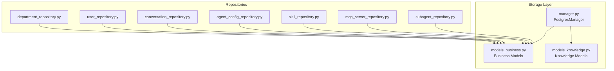
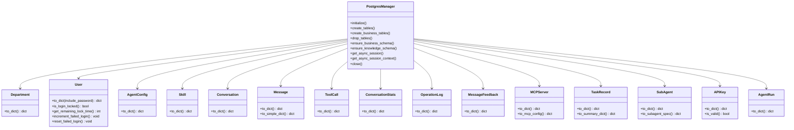
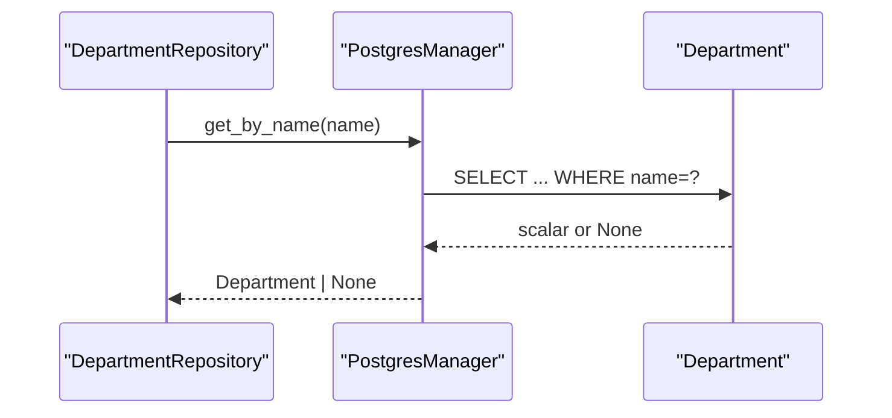
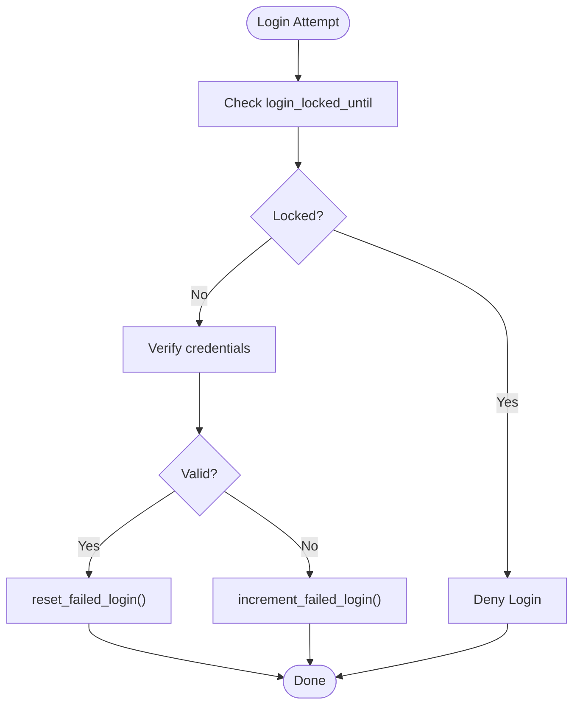
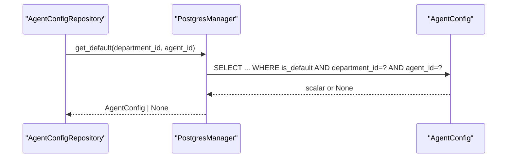
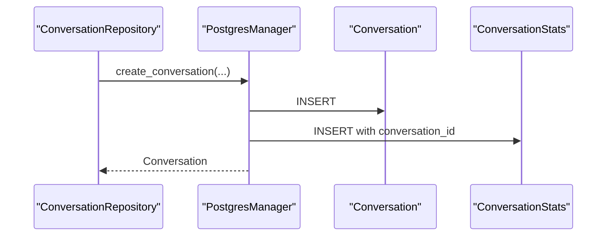
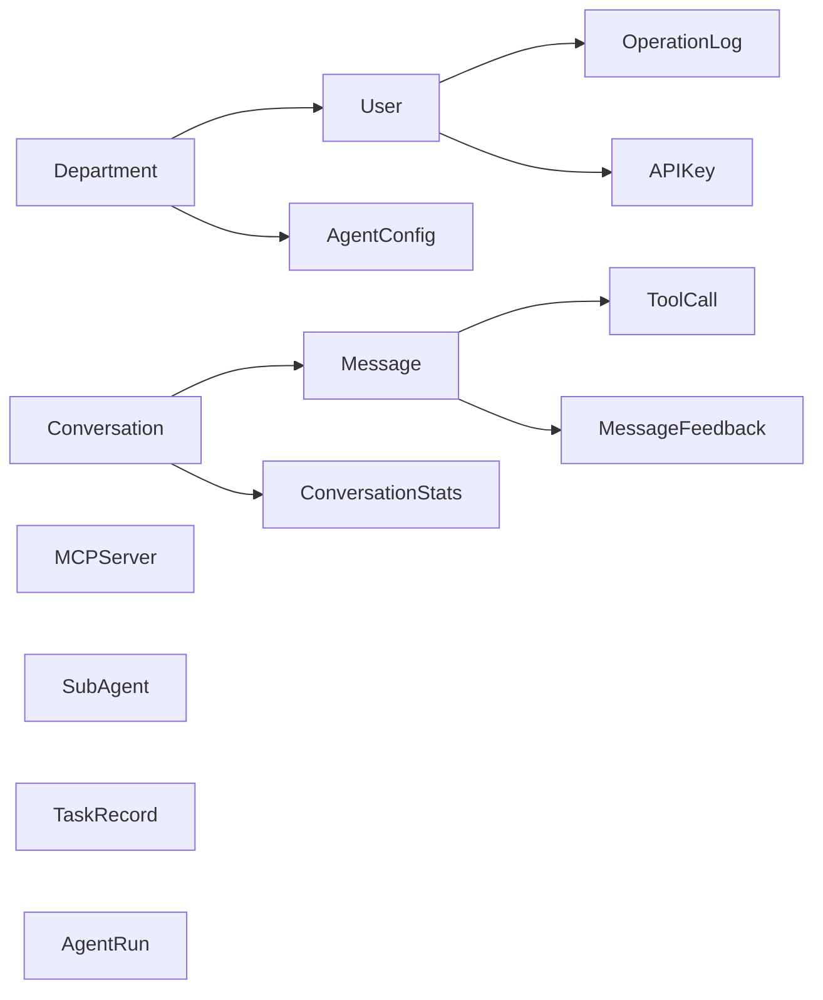

# PostgreSQL Business Models

<cite>
**Referenced Files in This Document**
- [models_business.py](file://backend/package/yuxi/storage/postgres/models_business.py)
- [models_knowledge.py](file://backend/package/yuxi/storage/postgres/models_knowledge.py)
- [manager.py](file://backend/package/yuxi/storage/postgres/manager.py)
- [department_repository.py](file://backend/package/yuxi/repositories/department_repository.py)
- [user_repository.py](file://backend/package/yuxi/repositories/user_repository.py)
- [conversation_repository.py](file://backend/package/yuxi/repositories/conversation_repository.py)
- [agent_config_repository.py](file://backend/package/yuxi/repositories/agent_config_repository.py)
- [skill_repository.py](file://backend/package/yuxi/repositories/skill_repository.py)
- [mcp_server_repository.py](file://backend/package/yuxi/repositories/mcp_server_repository.py)
- [subagent_repository.py](file://backend/package/yuxi/repositories/subagent_repository.py)
</cite>

## Table of Contents
1. [Introduction](#introduction)
2. [Project Structure](#project-structure)
3. [Core Components](#core-components)
4. [Architecture Overview](#architecture-overview)
5. [Detailed Component Analysis](#detailed-component-analysis)
6. [Dependency Analysis](#dependency-analysis)
7. [Performance Considerations](#performance-considerations)
8. [Troubleshooting Guide](#troubleshooting-guide)
9. [Conclusion](#conclusion)

## Introduction
This document provides comprehensive data model documentation for the PostgreSQL business models in the Yuxi platform. It covers all business entities including Department, User, AgentConfig, Skill, Conversation, Message, ToolCall, ConversationStats, OperationLog, MessageFeedback, MCPServer, TaskRecord, SubAgent, APIKey, and AgentRun. For each model, we describe fields, data types, constraints, relationships, indexes, and serialization via to_dict(). We also explain soft deletion strategies, audit trails, and security considerations, and provide examples of instantiation and common data access patterns.

## Project Structure
The business models are defined in a single SQLAlchemy declarative module and are managed by a shared database manager. Knowledge base models are defined separately but share the same Base class for combined table registration.

**Diagram sources**
- [models_business.py:1-706](file://backend/package/yuxi/storage/postgres/models_business.py#L1-L706)
- [models_knowledge.py:1-139](file://backend/package/yuxi/storage/postgres/models_knowledge.py#L1-L139)
- [manager.py:1-291](file://backend/package/yuxi/storage/postgres/manager.py#L1-L291)
- [department_repository.py:1-96](file://backend/package/yuxi/repositories/department_repository.py#L1-L96)
- [user_repository.py:1-148](file://backend/package/yuxi/repositories/user_repository.py#L1-L148)
- [conversation_repository.py:1-464](file://backend/package/yuxi/repositories/conversation_repository.py#L1-L464)
- [agent_config_repository.py:1-230](file://backend/package/yuxi/repositories/agent_config_repository.py#L1-L230)
- [skill_repository.py:1-116](file://backend/package/yuxi/repositories/skill_repository.py#L1-L116)
- [mcp_server_repository.py:1-82](file://backend/package/yuxi/repositories/mcp_server_repository.py#L1-L82)
- [subagent_repository.py:1-108](file://backend/package/yuxi/repositories/subagent_repository.py#L1-L108)

**Section sources**
- [models_business.py:1-706](file://backend/package/yuxi/storage/postgres/models_business.py#L1-L706)
- [models_knowledge.py:1-139](file://backend/package/yuxi/storage/postgres/models_knowledge.py#L1-L139)
- [manager.py:1-291](file://backend/package/yuxi/storage/postgres/manager.py#L1-L291)

## Core Components
This section summarizes the business models, their fields, constraints, and relationships.

- Department
  - Fields: id, name (unique, indexed), description, created_at
  - Relationships: users (one-to-many, cascade delete-orphan)
  - Indexes: name (unique), created_at
  - Security: none
  - Audit: created_at
  - Serialization: to_dict()

- User
  - Fields: id, username (unique, indexed), user_id (unique, indexed), phone_number (unique, indexed), avatar, password_hash, role, department_id (FK), created_at, last_login, login_failed_count, last_failed_login, login_locked_until, is_deleted (soft delete flag, indexed), deleted_at
  - Relationships: department (many-to-one), operation_logs (one-to-many, delete-orphan), api_keys (one-to-many, delete-orphan)
  - Indexes: username, user_id, phone_number, department_id, is_deleted
  - Constraints: role default "user"; login lock thresholds and durations enforced by model methods
  - Security: password_hash stored; login lockout logic; soft delete
  - Audit: created_at, last_login, login_locked_until
  - Serialization: to_dict(include_password=False by default)

- AgentConfig
  - Fields: id, department_id (FK), agent_id, name, description, icon, pics (JSON), examples (JSON), config_json (JSON), is_default (indexed), created_by, updated_by, created_at, updated_at
  - Constraints: unique constraint on (department_id, agent_id, name); partial unique index on (department_id, agent_id) where is_default is true
  - Indexes: department_id, agent_id, is_default, created_at
  - Audit: created_by, updated_by, timestamps
  - Serialization: to_dict()

- Skill
  - Fields: id, slug (unique, indexed), name, description, tool_dependencies (JSON), mcp_dependencies (JSON), skill_dependencies (JSON), dir_path, version, is_builtin, content_hash, created_by, updated_by, created_at, updated_at
  - Serialization: to_dict()

- Conversation
  - Fields: id, thread_id (unique, indexed), user_id, agent_id, title, status, is_pinned (indexed), created_at, updated_at, extra_metadata (JSON)
  - Relationships: messages (one-to-many, delete-orphan), stats (one-to-one, delete-orphan)
  - Indexes: thread_id, user_id, agent_id, is_pinned
  - Audit: timestamps
  - Serialization: to_dict()

- Message
  - Fields: id, conversation_id (FK), role, content, message_type, created_at, token_count, extra_metadata (JSON), image_content
  - Relationships: conversation (many-to-one), tool_calls (one-to-many, delete-orphan), feedbacks (one-to-many, delete-orphan)
  - Indexes: conversation_id, created_at
  - Audit: timestamps
  - Serialization: to_dict(), to_simple_dict()

- ToolCall
  - Fields: id, message_id (FK), langgraph_tool_call_id (indexed), tool_name, tool_input (JSON), tool_output, status, error_message, created_at
  - Relationships: message (many-to-one)
  - Indexes: message_id, langgraph_tool_call_id
  - Audit: timestamps
  - Serialization: to_dict()

- ConversationStats
  - Fields: id, conversation_id (unique FK), message_count, total_tokens, model_used, user_feedback (JSON), created_at, updated_at
  - Relationships: conversation (many-to-one)
  - Serialization: to_dict()

- OperationLog
  - Fields: id, user_id (FK), operation, details, ip_address, timestamp
  - Relationships: user (many-to-one)
  - Serialization: to_dict()

- MessageFeedback
  - Fields: id, message_id (FK, indexed), user_id, rating, reason, created_at
  - Relationships: message (many-to-one)
  - Indexes: message_id, user_id
  - Audit: timestamps
  - Serialization: to_dict()

- MCPServer
  - Fields: name (PK), description, transport, url, command, args (JSON), env (JSON), headers (JSON), timeout, sse_read_timeout, tags (JSON), icon, enabled, disabled_tools (JSON), created_by, updated_by, created_at, updated_at
  - Serialization: to_dict(), to_mcp_config()

- TaskRecord
  - Fields: id (PK), name, type (indexed), status (indexed), progress, message, payload (JSON), result, error, cancel_requested, created_at (indexed), updated_at, started_at, completed_at
  - Serialization: to_dict(), to_summary_dict()

- SubAgent
  - Fields: name (PK), description, system_prompt, tools (JSON), model, enabled, is_builtin, created_by, updated_by, created_at, updated_at
  - Serialization: to_dict(), to_subagent_spec()

- APIKey
  - Fields: id, key_hash (unique, indexed), key_prefix, name, user_id (FK), department_id (FK), expires_at, is_enabled, last_used_at, created_by, created_at
  - Relationships: user (many-to-one), department (many-to-one)
  - Indexes: key_hash, user_id, department_id
  - Validation: is_valid() checks enabled and expiration
  - Serialization: to_dict()

- AgentRun
  - Fields: id (PK), thread_id, agent_id, user_id, status (indexed), request_id (unique, indexed), input_payload (JSON), error_type, error_message, started_at, finished_at, created_at, updated_at
  - Serialization: to_dict()

**Section sources**
- [models_business.py:29-706](file://backend/package/yuxi/storage/postgres/models_business.py#L29-L706)

## Architecture Overview
The business models are mapped to PostgreSQL tables and integrated with a shared Base class. Repositories encapsulate CRUD operations and enforce domain-specific logic (e.g., soft deletes, defaults, uniqueness constraints). The PostgresManager centralizes connection configuration and schema migration helpers.

**Diagram sources**
- [manager.py:28-291](file://backend/package/yuxi/storage/postgres/manager.py#L28-L291)
- [models_business.py:29-706](file://backend/package/yuxi/storage/postgres/models_business.py#L29-L706)

## Detailed Component Analysis

### Department
- Purpose: Organizational unit with users.
- Key constraints: name is unique and indexed; created_at default.
- Relationships: One-to-many with User via department_id.
- Access patterns: List with user counts, create/update/delete, existence checks by name.
- Security: No sensitive data; ensure unique name enforcement in repositories.
- Audit: created_at.

**Diagram sources**
- [department_repository.py:20-24](file://backend/package/yuxi/repositories/department_repository.py#L20-L24)
- [models_business.py:29-48](file://backend/package/yuxi/storage/postgres/models_business.py#L29-L48)

**Section sources**
- [models_business.py:29-48](file://backend/package/yuxi/storage/postgres/models_business.py#L29-L48)
- [department_repository.py:1-96](file://backend/package/yuxi/repositories/department_repository.py#L1-L96)

### User
- Purpose: Platform user with roles, optional department association, and login security controls.
- Key constraints: usernames, user_id, phone_number are unique and indexed; is_deleted indexed for soft delete filtering.
- Relationships: belongs to Department; generates OperationLogs; owns APIKeys.
- Security: Password hash stored; login lockout threshold and duration; soft delete with anonymization of username and removal of phone number.
- Audit: created_at, last_login, login_locked_until.
- Serialization: to_dict(include_password) supports controlled exposure.

**Diagram sources**
- [models_business.py:106-131](file://backend/package/yuxi/storage/postgres/models_business.py#L106-L131)

**Section sources**
- [models_business.py:51-131](file://backend/package/yuxi/storage/postgres/models_business.py#L51-L131)
- [user_repository.py:92-109](file://backend/package/yuxi/repositories/user_repository.py#L92-L109)

### AgentConfig
- Purpose: Per-department per-agent configuration variants with default selection.
- Key constraints: Composite unique on (department_id, agent_id, name); partial unique index ensuring a single default per department+agent.
- Access patterns: List configs, set default, get default, ensure unique name, CRUD.
- Audit: created_by, updated_by, timestamps.

**Diagram sources**
- [agent_config_repository.py:54-62](file://backend/package/yuxi/repositories/agent_config_repository.py#L54-L62)
- [models_business.py:133-184](file://backend/package/yuxi/storage/postgres/models_business.py#L133-L184)

**Section sources**
- [models_business.py:133-184](file://backend/package/yuxi/storage/postgres/models_business.py#L133-L184)
- [agent_config_repository.py:1-230](file://backend/package/yuxi/repositories/agent_config_repository.py#L1-L230)

### Skill
- Purpose: Metadata for skills, including dependencies and installation metadata.
- Key constraints: slug is unique and indexed; JSON fields for dependencies.
- Access patterns: List, get by slug, create/update/delete; update dependencies and builtin install metadata.
- Audit: created_by, updated_by, timestamps.

**Section sources**
- [models_business.py:187-225](file://backend/package/yuxi/storage/postgres/models_business.py#L187-L225)
- [skill_repository.py:1-116](file://backend/package/yuxi/repositories/skill_repository.py#L1-L116)

### Conversation
- Purpose: Thread-level conversation container with status and pinning.
- Key constraints: thread_id is unique and indexed; is_pinned indexed.
- Relationships: Messages and ConversationStats.
- Access patterns: Create with metadata, list with pinned-first ordering, update title/status/pin, attach files, soft delete.
- Audit: timestamps.

**Diagram sources**
- [conversation_repository.py:35-69](file://backend/package/yuxi/repositories/conversation_repository.py#L35-L69)
- [models_business.py:228-263](file://backend/package/yuxi/storage/postgres/models_business.py#L228-L263)

**Section sources**
- [models_business.py:228-263](file://backend/package/yuxi/storage/postgres/models_business.py#L228-L263)
- [conversation_repository.py:1-464](file://backend/package/yuxi/repositories/conversation_repository.py#L1-L464)

### Message
- Purpose: Individual message within a conversation; supports tool calls and feedback.
- Key constraints: JSON fields for metadata and tool inputs; optional token count.
- Relationships: Belongs to Conversation; owns ToolCalls and MessageFeedback.
- Access patterns: Add message by thread or ID, load with eager relationships, normalize title and metadata.
- Audit: timestamps.

**Section sources**
- [models_business.py:266-307](file://backend/package/yuxi/storage/postgres/models_business.py#L266-L307)
- [conversation_repository.py:105-157](file://backend/package/yuxi/repositories/conversation_repository.py#L105-L157)

### ToolCall
- Purpose: Tracks tool invocations associated with a message.
- Key constraints: langgraph_tool_call_id indexed; status field.
- Relationships: Belongs to Message.
- Access patterns: Upsert by langgraph_tool_call_id, update output and status.

**Section sources**
- [models_business.py:309-338](file://backend/package/yuxi/storage/postgres/models_business.py#L309-L338)
- [conversation_repository.py:159-193](file://backend/package/yuxi/repositories/conversation_repository.py#L159-L193)

### ConversationStats
- Purpose: Aggregated metrics per conversation.
- Relationships: One-to-one with Conversation.
- Access patterns: Update counters and model usage, merge user feedback.

**Section sources**
- [models_business.py:341-370](file://backend/package/yuxi/storage/postgres/models_business.py#L341-L370)
- [conversation_repository.py:334-356](file://backend/package/yuxi/repositories/conversation_repository.py#L334-L356)

### OperationLog
- Purpose: Audit log of user operations.
- Relationships: Belongs to User.
- Access patterns: Repositories create logs after operations.

**Section sources**
- [models_business.py:373-396](file://backend/package/yuxi/storage/postgres/models_business.py#L373-L396)
- [user_repository.py:71-78](file://backend/package/yuxi/repositories/user_repository.py#L71-L78)

### MessageFeedback
- Purpose: User ratings and reasons for messages.
- Key constraints: Indexed message_id and user_id; rating enum-like values.
- Relationships: Belongs to Message.

**Section sources**
- [models_business.py:399-424](file://backend/package/yuxi/storage/postgres/models_business.py#L399-L424)
- [conversation_repository.py:195-210](file://backend/package/yuxi/repositories/conversation_repository.py#L195-L210)

### MCPServer
- Purpose: MCP server configuration with transport-specific fields.
- Key constraints: name is PK; JSON fields for args/env/headers; enabled flag.
- Access patterns: List enabled servers, upsert, existence checks.
- Serialization: to_dict() and to_mcp_config() for runtime loading.

**Section sources**
- [models_business.py:427-525](file://backend/package/yuxi/storage/postgres/models_business.py#L427-L525)
- [mcp_server_repository.py:1-82](file://backend/package/yuxi/repositories/mcp_server_repository.py#L1-L82)

### TaskRecord
- Purpose: Background task tracking with progress and cancellation.
- Key constraints: id PK; type and status indexed; created_at indexed.
- Access patterns: Create, update status/progress, summarize without payload/result.

**Section sources**
- [models_business.py:528-569](file://backend/package/yuxi/storage/postgres/models_business.py#L528-L569)
- [manager.py:184-221](file://backend/package/yuxi/storage/postgres/manager.py#L184-L221)

### SubAgent
- Purpose: Dynamic sub-agent specification with tools and model override.
- Key constraints: name PK; enabled flag; JSON tools.
- Access patterns: List enabled specs, create/update/delete, convert to spec.

**Section sources**
- [models_business.py:571-616](file://backend/package/yuxi/storage/postgres/models_business.py#L571-L616)
- [subagent_repository.py:1-108](file://backend/package/yuxi/repositories/subagent_repository.py#L1-L108)

### APIKey
- Purpose: API key management with scoping to user or department.
- Key constraints: key_hash unique and indexed; optional user_id/department_id FKs; expires_at and is_enabled.
- Access patterns: Create, update, delete; validity check via is_valid().
- Audit: created_by, created_at, last_used_at.

**Section sources**
- [models_business.py:618-663](file://backend/package/yuxi/storage/postgres/models_business.py#L618-L663)
- [mcp_server_repository.py:32-75](file://backend/package/yuxi/repositories/mcp_server_repository.py#L32-L75)

### AgentRun
- Purpose: Track asynchronous agent runs with idempotency and error reporting.
- Key constraints: id PK; thread_id and agent_id indexed; request_id unique and indexed; status indexed.
- Access patterns: Create with request_id, update status and timestamps, query by user/thread/status.

**Section sources**
- [models_business.py:665-706](file://backend/package/yuxi/storage/postgres/models_business.py#L665-L706)
- [manager.py:198-216](file://backend/package/yuxi/storage/postgres/manager.py#L198-L216)

## Dependency Analysis
- Model-level dependencies:
  - Conversation depends on Message and ConversationStats.
  - Message depends on Conversation and aggregates ToolCall and MessageFeedback.
  - User depends on Department and produces OperationLog and APIKey.
  - AgentConfig depends on Department.
  - MCPServer, SubAgent, TaskRecord, APIKey, AgentRun are standalone.
- Repository-level dependencies:
  - Repositories depend on PostgresManager for sessions and on models for ORM operations.
  - Some repositories join with related models (e.g., DepartmentRepository with User for counts).
- Indexes and constraints:
  - Unique constraints on (department_id, agent_id, name) for AgentConfig.
  - Partial unique index enforcing a single default per department+agent.
  - Indexes on frequently filtered/sorted fields (thread_id, user_id, agent_id, status, created_at, etc.).

**Diagram sources**
- [models_business.py:29-706](file://backend/package/yuxi/storage/postgres/models_business.py#L29-L706)

**Section sources**
- [models_business.py:29-706](file://backend/package/yuxi/storage/postgres/models_business.py#L29-L706)

## Performance Considerations
- Indexes:
  - Use indexes on foreign keys and frequently filtered columns (e.g., user_id, agent_id, thread_id, status, created_at).
  - Consider composite indexes for common filters (e.g., (department_id, agent_id)).
- JSON fields:
  - JSON/JSONB fields enable flexible metadata but avoid heavy scanning; prefer selective filtering and projections.
- Soft delete:
  - Filter out deleted rows using is_deleted or status flags to prevent scanning tombstoned records.
- Eager loading:
  - Use joined or selectin loads for relationships (e.g., ConversationRepository loads messages with tool_calls and feedbacks).
- Concurrency:
  - Use partial unique indexes (e.g., default per department+agent) to avoid contention during updates.

[No sources needed since this section provides general guidance]

## Troubleshooting Guide
- Login lockout:
  - If a user cannot log in, check login_locked_until and increment_failed_login/reset_failed_login logic.
- Soft delete anomalies:
  - Ensure queries filter by is_deleted=0 (e.g., UserRepository lists non-deleted users).
- Default configuration conflicts:
  - Use AgentConfigRepository.set_default to clear previous defaults before setting a new one.
- Duplicate tool calls:
  - Use langgraph_tool_call_id to deduplicate inserts in ConversationRepository.
- Schema evolution:
  - Use PostgresManager.ensure_business_schema to add missing columns and indexes.

**Section sources**
- [models_business.py:106-131](file://backend/package/yuxi/storage/postgres/models_business.py#L106-L131)
- [user_repository.py:37-49](file://backend/package/yuxi/repositories/user_repository.py#L37-L49)
- [agent_config_repository.py:29-52](file://backend/package/yuxi/repositories/agent_config_repository.py#L29-L52)
- [conversation_repository.py:169-176](file://backend/package/yuxi/repositories/conversation_repository.py#L169-L176)
- [manager.py:184-221](file://backend/package/yuxi/storage/postgres/manager.py#L184-L221)

## Conclusion
The Yuxi business models define a robust, extensible foundation for conversations, users, configurations, and auxiliary systems. They incorporate soft deletion, audit trails, and performance-focused indexing. Repositories encapsulate domain logic and ensure data integrity, while the PostgresManager provides centralized connection and schema management. Together, these components support scalable and maintainable operations across the platform.