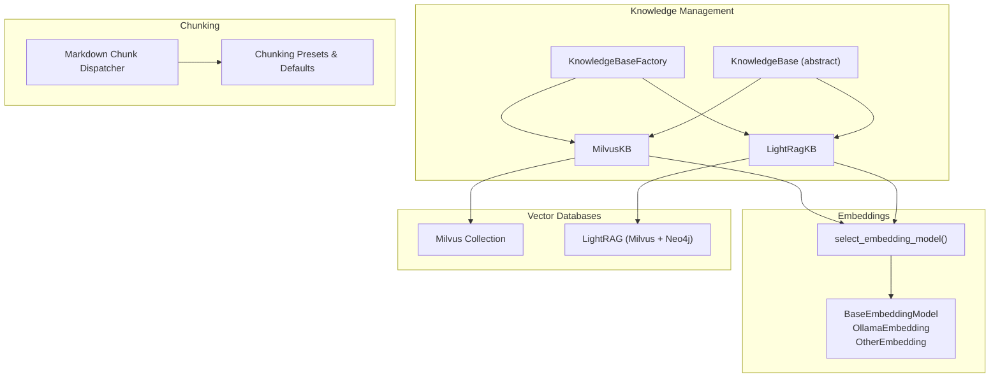
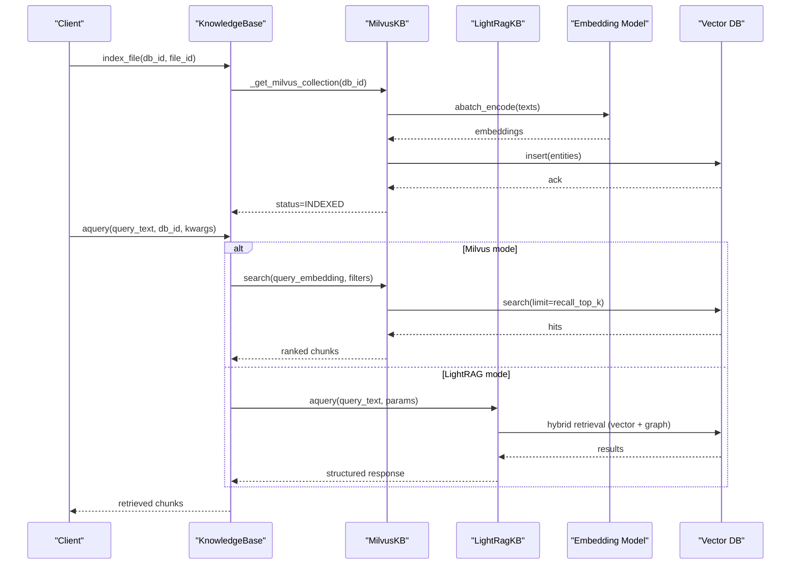
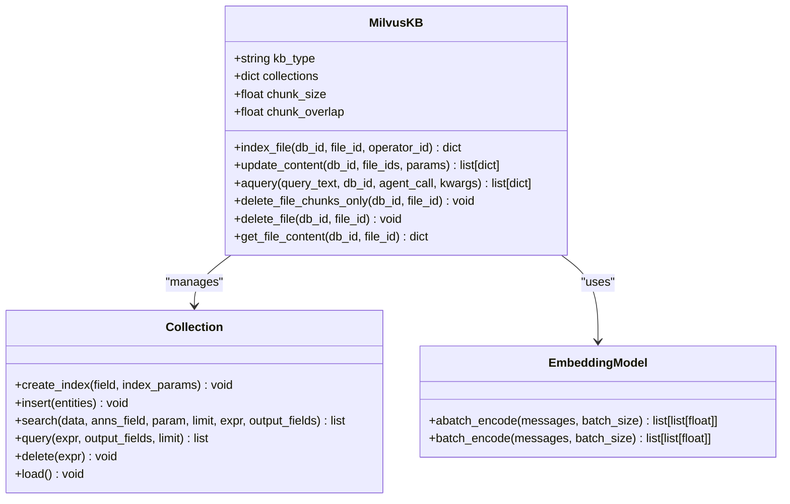
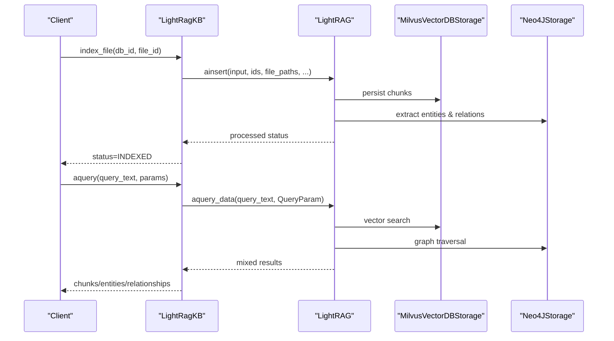
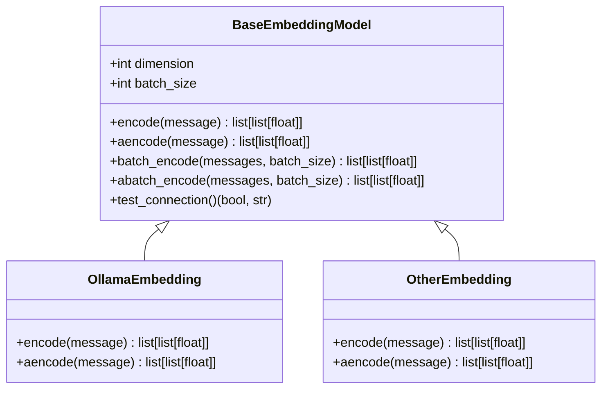
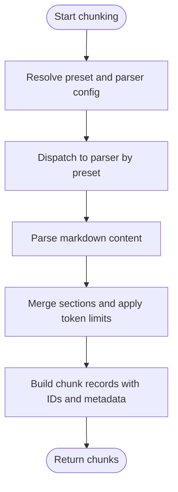
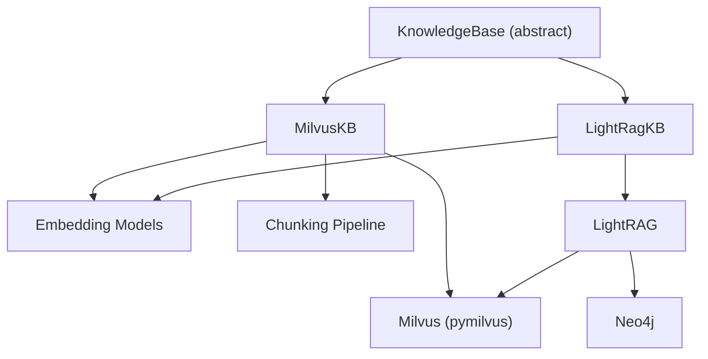

# Vector Database Schema

<cite>
**Referenced Files in This Document**
- [milvus.py](file://backend/package/yuxi/knowledge/implementations/milvus.py)
- [lightrag.py](file://backend/package/yuxi/knowledge/implementations/lightrag.py)
- [base.py](file://backend/package/yuxi/knowledge/base.py)
- [embed.py](file://backend/package/yuxi/models/embed.py)
- [dispatcher.py](file://backend/package/yuxi/knowledge/chunking/ragflow_like/dispatcher.py)
- [presets.py](file://backend/package/yuxi/knowledge/chunking/ragflow_like/presets.py)
- [kb_utils.py](file://backend/package/yuxi/knowledge/utils/kb_utils.py)
- [factory.py](file://backend/package/yuxi/knowledge/factory.py)
</cite>

## Table of Contents
1. [Introduction](#introduction)
2. [Project Structure](#project-structure)
3. [Core Components](#core-components)
4. [Architecture Overview](#architecture-overview)
5. [Detailed Component Analysis](#detailed-component-analysis)
6. [Dependency Analysis](#dependency-analysis)
7. [Performance Considerations](#performance-considerations)
8. [Troubleshooting Guide](#troubleshooting-guide)
9. [Conclusion](#conclusion)

## Introduction
This document describes the vector database schema used in the Yuxi platform’s knowledge management system. It covers embedding storage models, vector indexing strategies, and similarity search implementations. It explains the schema design for storing document embeddings, metadata, and chunk information, and details the integration with Milvus and LightRAG vector databases, including collection schemas, index types, and query optimization techniques. It also documents embedding dimension requirements, similarity metrics, and search parameters, and provides examples of vector insertion, querying, and retrieval operations. Finally, it addresses performance optimization strategies, batch processing capabilities, and memory management considerations for large-scale vector operations.

## Project Structure
The vector database functionality is implemented as pluggable knowledge base backends:
- Milvus-backed vector storage for pure vector search
- LightRAG-backed hybrid storage integrating vector and graph components

**Diagram sources**
- [factory.py:32-64](file://backend/package/yuxi/knowledge/factory.py#L32-L64)
- [base.py:46-190](file://backend/package/yuxi/knowledge/base.py#L46-L190)
- [milvus.py:24-164](file://backend/package/yuxi/knowledge/implementations/milvus.py#L24-L164)
- [lightrag.py:23-174](file://backend/package/yuxi/knowledge/implementations/lightrag.py#L23-L174)
- [embed.py:13-296](file://backend/package/yuxi/models/embed.py#L13-L296)
- [dispatcher.py:49-65](file://backend/package/yuxi/knowledge/chunking/ragflow_like/dispatcher.py#L49-L65)
- [presets.py:161-213](file://backend/package/yuxi/knowledge/chunking/ragflow_like/presets.py#L161-L213)

**Section sources**
- [factory.py:5-108](file://backend/package/yuxi/knowledge/factory.py#L5-L108)
- [base.py:46-190](file://backend/package/yuxi/knowledge/base.py#L46-L190)

## Core Components
- KnowledgeBase abstraction defines the unified interface for indexing, querying, and managing knowledge base operations.
- MilvusKB implements a pure vector search backend using Milvus collections with IVF_FLAT index and COSINE similarity.
- LightRagKB integrates LightRAG with Milvus for vector storage and Neo4j for graph storage, enabling hybrid retrieval.
- Embedding models encapsulate batch encoding and async embedding generation for vectorization.
- Chunking pipeline produces document chunks with deterministic IDs and metadata for vectorization.

**Section sources**
- [base.py:46-190](file://backend/package/yuxi/knowledge/base.py#L46-L190)
- [milvus.py:24-164](file://backend/package/yuxi/knowledge/implementations/milvus.py#L24-L164)
- [lightrag.py:23-174](file://backend/package/yuxi/knowledge/implementations/lightrag.py#L23-L174)
- [embed.py:13-296](file://backend/package/yuxi/models/embed.py#L13-L296)
- [dispatcher.py:9-29](file://backend/package/yuxi/knowledge/chunking/ragflow_like/dispatcher.py#L9-L29)

## Architecture Overview
The system orchestrates ingestion and retrieval across two backends:

**Diagram sources**
- [milvus.py:227-355](file://backend/package/yuxi/knowledge/implementations/milvus.py#L227-L355)
- [milvus.py:471-676](file://backend/package/yuxi/knowledge/implementations/milvus.py#L471-L676)
- [lightrag.py:305-421](file://backend/package/yuxi/knowledge/implementations/lightrag.py#L305-L421)
- [lightrag.py:526-600](file://backend/package/yuxi/knowledge/implementations/lightrag.py#L526-L600)

## Detailed Component Analysis

### Milvus Vector Storage Schema
MilvusKB creates a collection per database with a fixed schema optimized for fast similarity search:

- Fields
  - id: primary key (VARCHAR, max_length 100)
  - content: chunk text (VARCHAR, max_length 65535)
  - source: filename or identifier (VARCHAR, max_length 500)
  - chunk_id: unique chunk identifier (VARCHAR, max_length 100)
  - file_id: document identifier (VARCHAR, max_length 100)
  - chunk_index: order within the document (INT64)
  - embedding: FLOAT_VECTOR with dimension from embedding model

- Index
  - Index type: IVF_FLAT
  - Metric type: COSINE
  - Parameters: nlist (proportional to dataset size)

- Insertion
  - Chunks are generated via the chunking pipeline and inserted in bulk using Collection.insert.
  - Re-indexing deletes existing file chunks first, then inserts new vectors.

- Querying
  - Vector search with configurable top-k and similarity threshold.
  - Optional keyword search and hybrid modes.
  - Optional re-ranking with a reranker model.

**Diagram sources**
- [milvus.py:24-164](file://backend/package/yuxi/knowledge/implementations/milvus.py#L24-L164)
- [milvus.py:227-355](file://backend/package/yuxi/knowledge/implementations/milvus.py#L227-L355)
- [milvus.py:471-676](file://backend/package/yuxi/knowledge/implementations/milvus.py#L471-L676)
- [embed.py:13-296](file://backend/package/yuxi/models/embed.py#L13-L296)

**Section sources**
- [milvus.py:135-164](file://backend/package/yuxi/knowledge/implementations/milvus.py#L135-L164)
- [milvus.py:227-355](file://backend/package/yuxi/knowledge/implementations/milvus.py#L227-L355)
- [milvus.py:471-676](file://backend/package/yuxi/knowledge/implementations/milvus.py#L471-L676)

### LightRAG Hybrid Storage Schema
LightRagKB integrates vector and graph storage:
- Vector storage: MilvusVectorDBStorage (via LightRAG)
- Graph storage: Neo4JStorage (entities and relationships)
- KV storage: JsonKVStorage (text chunks and metadata)
- Document status storage: JsonDocStatusStorage

Key behaviors:
- Creates three Milvus collections per workspace: {db_id}_chunks, {db_id}_entities, {db_id}_relationships
- Supports retrieval modes: local, global, hybrid, naive, mix
- Exposes retrieval scopes: chunks, graph, all
- Ensures document processing status before retrieval

**Diagram sources**
- [lightrag.py:136-174](file://backend/package/yuxi/knowledge/implementations/lightrag.py#L136-L174)
- [lightrag.py:305-421](file://backend/package/yuxi/knowledge/implementations/lightrag.py#L305-L421)
- [lightrag.py:526-600](file://backend/package/yuxi/knowledge/implementations/lightrag.py#L526-L600)

**Section sources**
- [lightrag.py:23-174](file://backend/package/yuxi/knowledge/implementations/lightrag.py#L23-L174)
- [lightrag.py:305-421](file://backend/package/yuxi/knowledge/implementations/lightrag.py#L305-L421)
- [lightrag.py:526-600](file://backend/package/yuxi/knowledge/implementations/lightrag.py#L526-L600)

### Embedding Models and Batch Processing
- BaseEmbeddingModel defines sync/async encoding and batch encoding with progress tracking.
- OllamaEmbedding and OtherEmbedding implement provider-specific embedding generation.
- select_embedding_model resolves provider and constructs the appropriate embedding model.
- Batch sizes are configurable and used during vectorization.

**Diagram sources**
- [embed.py:13-296](file://backend/package/yuxi/models/embed.py#L13-L296)

**Section sources**
- [embed.py:13-296](file://backend/package/yuxi/models/embed.py#L13-L296)

### Chunking Pipeline and Metadata
- Chunking presets define general, QA, book, and laws strategies with defaults and overrides.
- The dispatcher selects a parser based on preset ID and builds chunk records with deterministic IDs and metadata.
- Processing parameters are resolved from KB defaults, file params, and request params, with legacy compatibility.

**Diagram sources**
- [presets.py:161-213](file://backend/package/yuxi/knowledge/chunking/ragflow_like/presets.py#L161-L213)
- [dispatcher.py:32-57](file://backend/package/yuxi/knowledge/chunking/ragflow_like/dispatcher.py#L32-L57)

**Section sources**
- [presets.py:161-213](file://backend/package/yuxi/knowledge/chunking/ragflow_like/presets.py#L161-L213)
- [dispatcher.py:9-29](file://backend/package/yuxi/knowledge/chunking/ragflow_like/dispatcher.py#L9-L29)

### Relationship Between Documents and Embeddings
- Each file is parsed to markdown and split into chunks.
- Each chunk receives a unique chunk_id and file_id, preserving ordering via chunk_index.
- Embeddings are computed for chunk contents and stored alongside metadata in the vector database.
- Retrieval returns chunk content, metadata (source, chunk_id, file_id, chunk_index), and similarity scores.

**Section sources**
- [dispatcher.py:9-29](file://backend/package/yuxi/knowledge/chunking/ragflow_like/dispatcher.py#L9-L29)
- [milvus.py:316-324](file://backend/package/yuxi/knowledge/implementations/milvus.py#L316-L324)
- [milvus.py:534-545](file://backend/package/yuxi/knowledge/implementations/milvus.py#L534-L545)

## Dependency Analysis
- MilvusKB depends on:
  - pymilvus for collection creation, indexing, search, and query
  - Embedding models for vectorization
  - Chunking pipeline for content preparation
- LightRagKB depends on:
  - LightRAG for ingestion and retrieval
  - MilvusVectorDBStorage for vector storage
  - Neo4j driver for graph storage
  - Embedding models for vectorization
- Both backends depend on the KnowledgeBase abstraction for lifecycle and metadata management.

**Diagram sources**
- [base.py:46-190](file://backend/package/yuxi/knowledge/base.py#L46-L190)
- [milvus.py:9-19](file://backend/package/yuxi/knowledge/implementations/milvus.py#L9-L19)
- [lightrag.py:6-11](file://backend/package/yuxi/knowledge/implementations/lightrag.py#L6-L11)

**Section sources**
- [base.py:46-190](file://backend/package/yuxi/knowledge/base.py#L46-L190)
- [milvus.py:9-19](file://backend/package/yuxi/knowledge/implementations/milvus.py#L9-L19)
- [lightrag.py:6-11](file://backend/package/yuxi/knowledge/implementations/lightrag.py#L6-L11)

## Performance Considerations
- Index selection
  - IVF_FLAT with COSINE metric is used for Milvus. Parameter nlist controls inverted list count; larger datasets typically require higher nlist for better recall.
- Search parameters
  - recall_top_k determines initial vector search results; final_top_k trims to desired output size.
  - similarity_threshold filters low-similarity matches.
  - nprobe controls the number of inverted lists to probe during search; higher increases accuracy but latency.
- Batch processing
  - Embedding batch sizes are configurable; batching reduces overhead and improves throughput.
  - Async batch encoding is supported to overlap network I/O with computation.
- Memory management
  - Collections are loaded into memory after creation; ensure adequate memory allocation for large collections.
  - Limit returned fields to reduce bandwidth and memory footprint.
- Re-indexing
  - Existing chunks are deleted before re-inserting to avoid duplication; this minimizes stale data but requires extra write operations.

[No sources needed since this section provides general guidance]

## Troubleshooting Guide
Common issues and resolutions:
- Connection failures to Milvus
  - Verify URI and token configuration; ensure database exists and is selected.
- Index mismatch
  - If embedding model name changes, the collection description is checked and recreated automatically.
- Query errors
  - Validate metric type and index parameters; ensure embeddings are computed with matching dimensionality.
- Reranking failures
  - If reranker fails, results fall back to vector scores; confirm reranker model availability and configuration.
- File deletion anomalies
  - delete_file_chunks_only removes only vector data while preserving metadata; delete_file removes both vector data and metadata entries.

**Section sources**
- [milvus.py:70-89](file://backend/package/yuxi/knowledge/implementations/milvus.py#L70-L89)
- [milvus.py:104-133](file://backend/package/yuxi/knowledge/implementations/milvus.py#L104-L133)
- [milvus.py:677-701](file://backend/package/yuxi/knowledge/implementations/milvus.py#L677-L701)
- [milvus.py:703-716](file://backend/package/yuxi/knowledge/implementations/milvus.py#L703-L716)

## Conclusion
The Yuxi platform implements a robust vector database schema supporting both pure vector search (Milvus) and hybrid retrieval (LightRAG). The schema emphasizes deterministic chunking, flexible embedding models, and configurable indexing and search parameters. By leveraging batch processing, async encoding, and careful index tuning, the system scales to large document sets while maintaining responsive query performance. The modular design allows seamless integration with external vector and graph databases, enabling future enhancements and migrations.