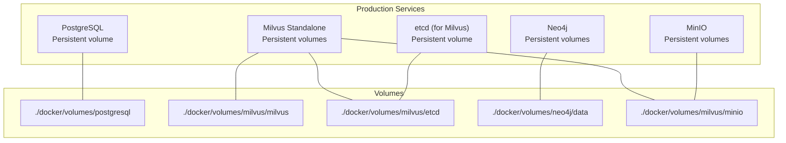
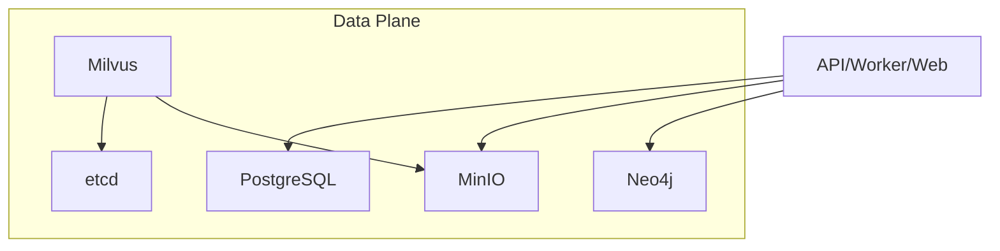
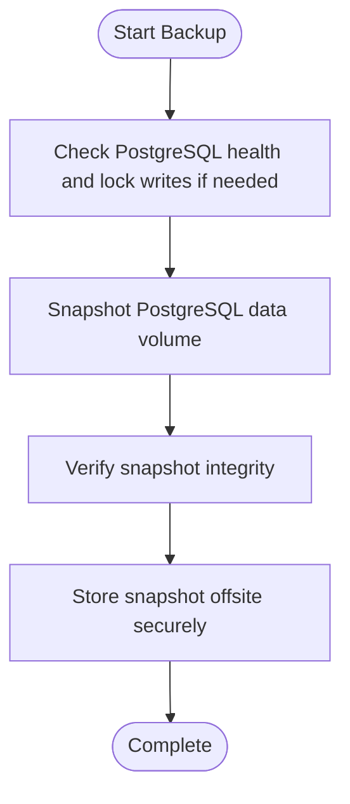
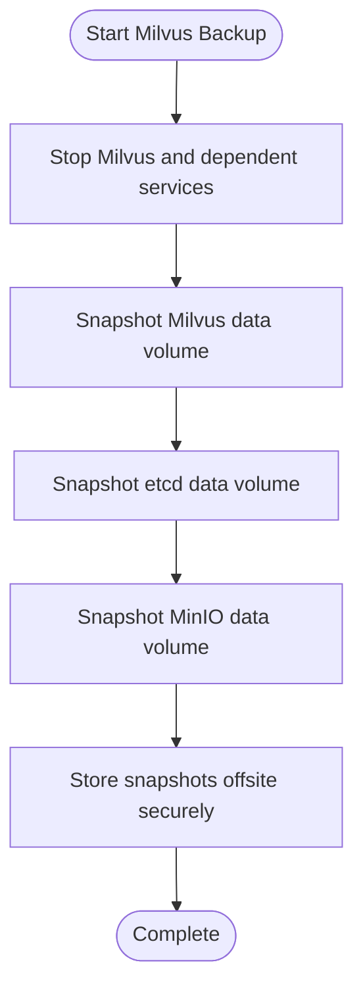
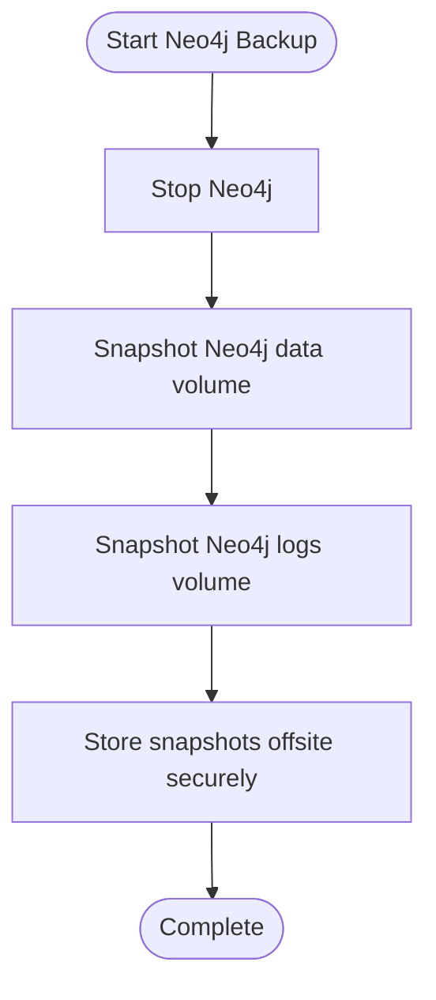
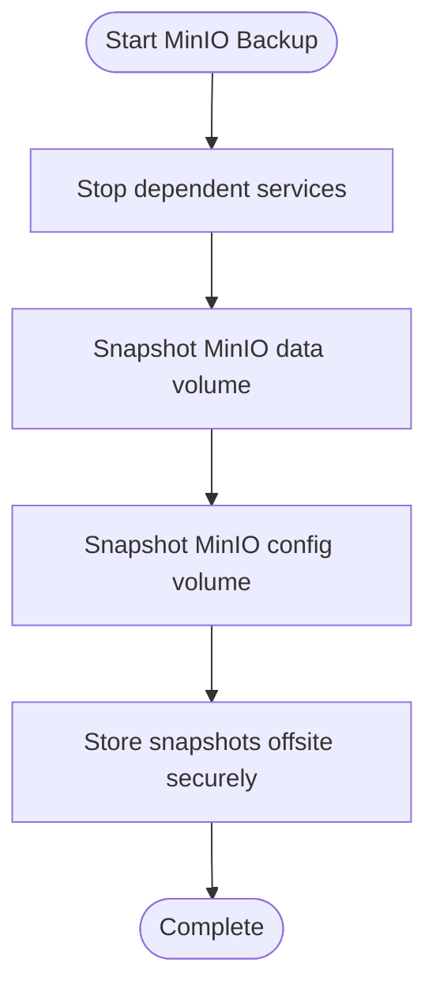
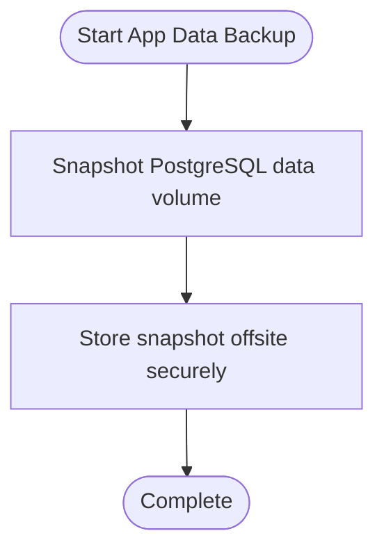
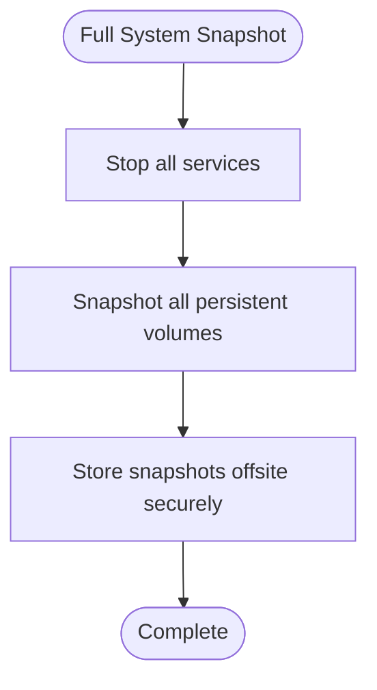
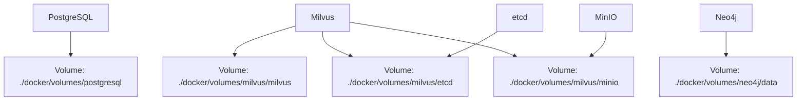

# Backup & Disaster Recovery

<cite>
**Referenced Files in This Document**
- [docker-compose.prod.yml](file://docker-compose.prod.yml)
- [docker-compose.yml](file://docker-compose.yml)
- [manager.py](file://backend/package/yuxi/storage/postgres/manager.py)
- [client.py](file://backend/package/yuxi/storage/minio/client.py)
- [migrate.py](file://backend/server/utils/migrate.py)
- [save_docker_images.sh](file://docker/save_docker_images.sh)
- [save_docker_images.ps1](file://docker/save_docker_images.ps1)
- [deployment.md](file://docs/advanced/deployment.md)
</cite>

## Table of Contents
1. [Introduction](#introduction)
2. [Project Structure](#project-structure)
3. [Core Components](#core-components)
4. [Architecture Overview](#architecture-overview)
5. [Detailed Component Analysis](#detailed-component-analysis)
6. [Dependency Analysis](#dependency-analysis)
7. [Performance Considerations](#performance-considerations)
8. [Troubleshooting Guide](#troubleshooting-guide)
9. [Conclusion](#conclusion)
10. [Appendices](#appendices)

## Introduction
This document defines comprehensive backup and disaster recovery (DR) practices for production systems hosting PostgreSQL, Milvus, Neo4j, and MinIO. It covers backup strategies, automated scheduling, incremental/full procedures, full system snapshots, restore processes, DR planning (failover, redundancy, continuity), verification/testing, RTO validation, consistency guarantees, point-in-time recovery (PITR), security and encryption, and step-by-step recovery procedures for common failure scenarios.

## Project Structure
The production stack is orchestrated via Docker Compose with persistent volumes for each data-bearing service. PostgreSQL, Milvus, Neo4j, and MinIO are configured with mounted volumes under dedicated directories for durability and offline backup.

**Diagram sources**
- [docker-compose.prod.yml:248-267](file://docker-compose.prod.yml#L248-L267)
- [docker-compose.prod.yml:222-246](file://docker-compose.prod.yml#L222-L246)
- [docker-compose.prod.yml:181-200](file://docker-compose.prod.yml#L181-L200)
- [docker-compose.prod.yml:202-220](file://docker-compose.prod.yml#L202-L220)
- [docker-compose.prod.yml:160-179](file://docker-compose.prod.yml#L160-L179)

**Section sources**
- [docker-compose.prod.yml:248-267](file://docker-compose.prod.yml#L248-L267)
- [docker-compose.prod.yml:222-246](file://docker-compose.prod.yml#L222-L246)
- [docker-compose.prod.yml:181-200](file://docker-compose.prod.yml#L181-L200)
- [docker-compose.prod.yml:202-220](file://docker-compose.prod.yml#L202-L220)
- [docker-compose.prod.yml:160-179](file://docker-compose.prod.yml#L160-L179)

## Core Components
- PostgreSQL: Business and knowledge base relational data; configured with a persistent volume for WAL and data.
- Milvus: Vector database with embedded etcd and MinIO; all three components use persistent volumes.
- Neo4j: Graph database with dedicated data and logs volumes.
- MinIO: Object storage for knowledge files and artifacts; uses two persistent volumes (data and config).

Operational notes:
- Production compose sets environment variables for credentials and URIs, and mounts persistent volumes for each service.
- Development compose mirrors the same pattern for local environments.

**Section sources**
- [docker-compose.prod.yml:248-267](file://docker-compose.prod.yml#L248-L267)
- [docker-compose.prod.yml:222-246](file://docker-compose.prod.yml#L222-L246)
- [docker-compose.prod.yml:181-200](file://docker-compose.prod.yml#L181-L200)
- [docker-compose.prod.yml:202-220](file://docker-compose.prod.yml#L202-L220)
- [docker-compose.prod.yml:160-179](file://docker-compose.prod.yml#L160-L179)
- [docker-compose.yml:301-320](file://docker-compose.yml#L301-L320)
- [docker-compose.yml:272-299](file://docker-compose.yml#L272-L299)
- [docker-compose.yml:238-247](file://docker-compose.yml#L238-L247)
- [docker-compose.yml:249-270](file://docker-compose.yml#L249-L270)
- [docker-compose.yml:201-209](file://docker-compose.yml#L201-L209)

## Architecture Overview
The production stack orchestrates four persistent data domains behind a single network. Backups leverage the mounted volumes to capture full system snapshots and enable granular restores.

**Diagram sources**
- [docker-compose.prod.yml:29-66](file://docker-compose.prod.yml#L29-L66)
- [docker-compose.prod.yml:160-179](file://docker-compose.prod.yml#L160-L179)
- [docker-compose.prod.yml:181-200](file://docker-compose.prod.yml#L181-L200)
- [docker-compose.prod.yml:202-220](file://docker-compose.prod.yml#L202-L220)
- [docker-compose.prod.yml:222-246](file://docker-compose.prod.yml#L222-L246)
- [docker-compose.prod.yml:248-267](file://docker-compose.prod.yml#L248-L267)

## Detailed Component Analysis

### PostgreSQL Backup and Restore
- Strategy
  - Full backups via filesystem-level snapshot of the PostgreSQL data volume.
  - Incremental strategy: leverage WAL archiving and point-in-time recovery (PITR) if enabled; otherwise rely on periodic full snapshots.
- Automated Scheduling
  - Use cron/systemd timers to periodically snapshot the PostgreSQL volume directory.
- Restore Procedure
  - Stop the API/worker services to avoid writes.
  - Replace the PostgreSQL data volume with the chosen snapshot.
  - Restart PostgreSQL and re-run application migrations if necessary.
- Consistency and PITR
  - Ensure transactions are quiesced or backed up consistently; consider pg_start_backup()/pg_stop_backup() for online consistent snapshots.
  - Enable WAL archiving for PITR if required; otherwise use snapshot-based recovery.
- Verification
  - Run basic SELECT queries and integrity checks after restore.
  - Validate application connectivity and health endpoints post-restore.

**Section sources**
- [docker-compose.prod.yml:248-267](file://docker-compose.prod.yml#L248-L267)
- [docker-compose.yml:301-320](file://docker-compose.yml#L301-L320)
- [migrate.py:26-44](file://backend/server/utils/migrate.py#L26-L44)

### Milvus Backup and Restore
- Strategy
  - Full backup via filesystem-level snapshot of Milvus and etcd data volumes.
  - MinIO snapshot captures object storage for Milvus data.
- Automated Scheduling
  - Schedule periodic snapshots of Milvus, etcd, and MinIO volumes.
- Restore Procedure
  - Stop Milvus and dependent services.
  - Replace Milvus and etcd data volumes with the snapshot.
  - Restart Milvus; verify health endpoint.
- Consistency and PITR
  - Milvus relies on etcd for metadata; ensure etcd snapshot aligns with Milvus snapshot.
  - No native WAL-based PITR for Milvus; rely on snapshot-based recovery.
- Verification
  - Confirm collection existence and basic query capability.
  - Validate MinIO bucket/object integrity.

**Section sources**
- [docker-compose.prod.yml:222-246](file://docker-compose.prod.yml#L222-L246)
- [docker-compose.prod.yml:181-200](file://docker-compose.prod.yml#L181-L200)
- [docker-compose.prod.yml:202-220](file://docker-compose.prod.yml#L202-L220)

### Neo4j Backup and Restore
- Strategy
  - Full backup via filesystem-level snapshot of Neo4j data and logs volumes.
- Automated Scheduling
  - Use scheduled snapshots of the Neo4j data directory.
- Restore Procedure
  - Stop Neo4j.
  - Replace Neo4j data volume with the snapshot.
  - Restart Neo4j and verify health.
- Consistency and PITR
  - No native WAL-based PITR for Neo4j in this stack; rely on snapshot-based recovery.
- Verification
  - Run a lightweight Cypher query to confirm graph availability.

**Section sources**
- [docker-compose.prod.yml:160-179](file://docker-compose.prod.yml#L160-L179)
- [docker-compose.yml:201-209](file://docker-compose.yml#L201-L209)

### MinIO Backup and Restore
- Strategy
  - Full backup via filesystem-level snapshot of MinIO data and config volumes.
- Automated Scheduling
  - Schedule periodic snapshots of MinIO data/config directories.
- Restore Procedure
  - Stop dependent services (e.g., Milvus) to prevent writes.
  - Replace MinIO data volume with the snapshot.
  - Restart MinIO and verify health.
- Consistency and PITR
  - Object storage snapshots provide point-in-time consistency for buckets and objects.
- Verification
  - List buckets and download a test object to confirm integrity.

**Section sources**
- [docker-compose.prod.yml:202-220](file://docker-compose.prod.yml#L202-L220)
- [docker-compose.yml:249-270](file://docker-compose.yml#L249-L270)
- [client.py:88-108](file://backend/package/yuxi/storage/minio/client.py#L88-L108)

### Application-Level Data (PostgreSQL Business/Knowledge Tables)
- Strategy
  - Use the PostgreSQL manager to manage schema and ensure tables exist.
  - For migration-related changes, rely on application migrations; maintain backups before applying migrations.
- Automated Scheduling
  - Include PostgreSQL snapshot in the overall schedule.
- Restore Procedure
  - Restore PostgreSQL snapshot, then run application migrations to ensure schema alignment.
- Verification
  - Run application health checks and verify business/knowledge features.

**Section sources**
- [manager.py:96-118](file://backend/package/yuxi/storage/postgres/manager.py#L96-L118)
- [manager.py:184-222](file://backend/package/yuxi/storage/postgres/manager.py#L184-L222)
- [docker-compose.prod.yml:248-267](file://docker-compose.prod.yml#L248-L267)

### Full System Snapshot
- Strategy
  - Perform coordinated snapshots of all persistent volumes (PostgreSQL, Milvus, etcd, Neo4j, MinIO).
- Automated Scheduling
  - Use cron/systemd timers to trigger a snapshot job across all volumes.
- Restore Procedure
  - Stop all services.
  - Replace all persistent volumes with the snapshot.
  - Restart services and validate health.
- Verification
  - Health checks for all services and basic functional tests.

**Section sources**
- [docker-compose.prod.yml:248-267](file://docker-compose.prod.yml#L248-L267)
- [docker-compose.prod.yml:222-246](file://docker-compose.prod.yml#L222-L246)
- [docker-compose.prod.yml:181-200](file://docker-compose.prod.yml#L181-L200)
- [docker-compose.prod.yml:160-179](file://docker-compose.prod.yml#L160-L179)
- [docker-compose.prod.yml:202-220](file://docker-compose.prod.yml#L202-L220)

### Disaster Recovery Planning
- Failover Mechanisms
  - Maintain secondary hosts with identical Docker Compose configuration and persistent volumes.
  - Automate failover by switching DNS/IP to the secondary host and restoring volumes.
- Geographic Redundancy
  - Store offsite snapshots in secure, geographically separated locations.
  - Consider cross-region replication for MinIO buckets if applicable.
- Business Continuity
  - Define RTO/RPO targets per component and validate against backups.
  - Maintain hot standby for non-critical components; cold standby for others.

[No sources needed since this section provides general guidance]

### Backup Verification and Restore Testing
- Verification
  - Periodically validate backups by attempting to mount and inspect volumes.
  - Run targeted queries and lightweight operations after restore.
- Restore Testing
  - Conduct quarterly restore drills across all components.
  - Track RTO and validate end-to-end functionality.

[No sources needed since this section provides general guidance]

### Security, Encryption at Rest, and Secure Offsite Storage
- Encryption at Rest
  - Enable filesystem-level encryption for persistent volumes.
  - Consider container registry encryption and secure transfer for images.
- Secure Offsite Storage
  - Encrypt snapshots before shipping offsite.
  - Use secure channels and access controls for offsite storage.
- Access Control
  - Restrict access to backup artifacts and restore procedures.
  - Rotate secrets regularly and audit access logs.

[No sources needed since this section provides general guidance]

## Dependency Analysis
The following diagram shows how services depend on persistent volumes and each other.

**Diagram sources**
- [docker-compose.prod.yml:248-267](file://docker-compose.prod.yml#L248-L267)
- [docker-compose.prod.yml:222-246](file://docker-compose.prod.yml#L222-L246)
- [docker-compose.prod.yml:181-200](file://docker-compose.prod.yml#L181-L200)
- [docker-compose.prod.yml:160-179](file://docker-compose.prod.yml#L160-L179)
- [docker-compose.prod.yml:202-220](file://docker-compose.prod.yml#L202-L220)

**Section sources**
- [docker-compose.prod.yml:248-267](file://docker-compose.prod.yml#L248-L267)
- [docker-compose.prod.yml:222-246](file://docker-compose.prod.yml#L222-L246)
- [docker-compose.prod.yml:181-200](file://docker-compose.prod.yml#L181-L200)
- [docker-compose.prod.yml:160-179](file://docker-compose.prod.yml#L160-L179)
- [docker-compose.prod.yml:202-220](file://docker-compose.prod.yml#L202-L220)

## Performance Considerations
- Snapshot frequency vs. I/O impact: schedule snapshots during low-traffic windows.
- Compression and deduplication: compress snapshots offsite to reduce storage costs.
- Parallelization: coordinate snapshots across volumes to minimize downtime windows.

[No sources needed since this section provides general guidance]

## Troubleshooting Guide
- PostgreSQL Migration Backup
  - The migration utility creates a backup before applying migrations; use this as a template for manual backups.
- MinIO Bucket Operations
  - Use the MinIO client to verify bucket existence and policies; handle NoSuchKey errors gracefully.
- Deployment Notes
  - Production deployment requires strong credentials and environment variables; ensure secrets are rotated.

**Section sources**
- [migrate.py:26-44](file://backend/server/utils/migrate.py#L26-L44)
- [migrate.py:207-240](file://backend/server/utils/migrate.py#L207-L240)
- [client.py:88-108](file://backend/package/yuxi/storage/minio/client.py#L88-L108)
- [deployment.md:21-31](file://docs/advanced/deployment.md#L21-L31)

## Conclusion
By leveraging filesystem-level snapshots of persistent volumes, implementing automated schedules, and validating restore procedures, the system achieves robust backup and DR capabilities. Align RPO/RTO targets with business requirements, enforce security and encryption, and continuously test recovery procedures to ensure readiness.

[No sources needed since this section summarizes without analyzing specific files]

## Appendices

### Step-by-Step Recovery Procedures

- PostgreSQL Recovery
  - Stop API/worker services.
  - Replace the PostgreSQL data volume with the selected snapshot.
  - Restart PostgreSQL and re-run application migrations if needed.
  - Verify health and basic queries.

- Milvus Recovery
  - Stop Milvus and dependent services.
  - Replace Milvus and etcd data volumes with the snapshot.
  - Restart Milvus and verify health.

- Neo4j Recovery
  - Stop Neo4j.
  - Replace Neo4j data and logs volumes with the snapshot.
  - Restart Neo4j and verify health.

- MinIO Recovery
  - Stop dependent services.
  - Replace MinIO data and config volumes with the snapshot.
  - Restart MinIO and verify health.

- Full System Recovery
  - Stop all services.
  - Replace all persistent volumes with the snapshot.
  - Restart all services and validate health.

[No sources needed since this section provides general guidance]

### Emergency Response Protocols
- Immediate Actions
  - Isolate affected component and assess impact.
  - Activate DR site and restore volumes.
  - Communicate with stakeholders and update status.
- Post-Restoration
  - Validate data integrity and application functionality.
  - Review and update DR plan based on lessons learned.

[No sources needed since this section provides general guidance]

### Backup Image Preservation
- Preserve Docker images for reproducible environments.
- Export images to a compressed archive and store offsite.

**Section sources**
- [save_docker_images.sh:1-41](file://docker/save_docker_images.sh#L1-L41)
- [save_docker_images.ps1:1-43](file://docker/save_docker_images.ps1#L1-L43)