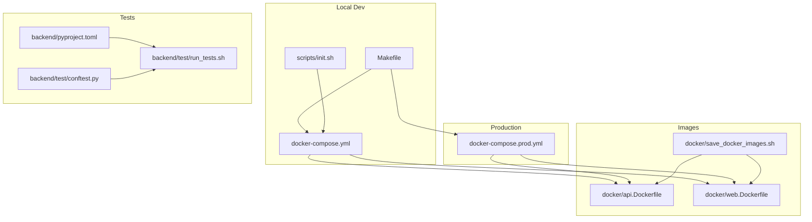
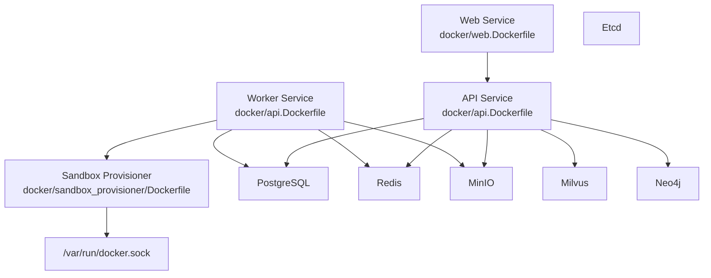
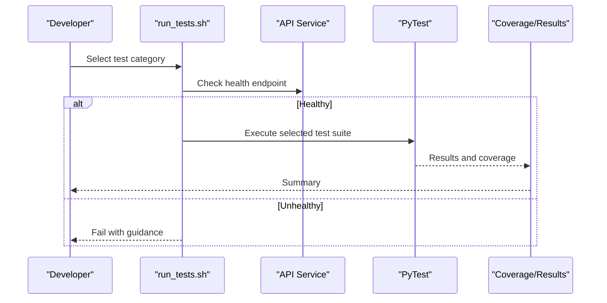
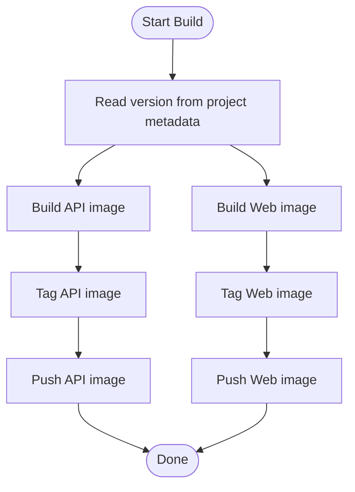
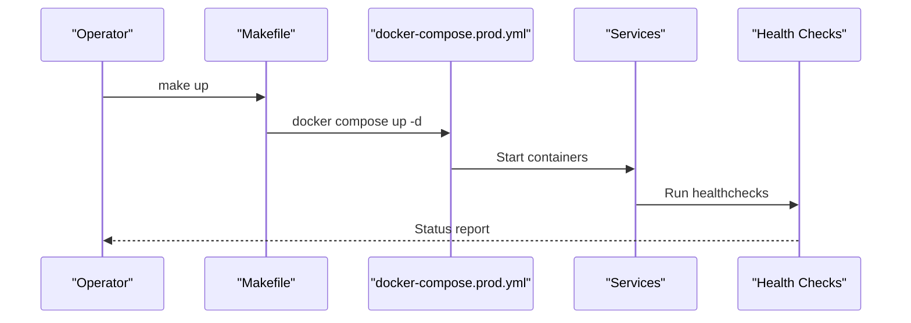
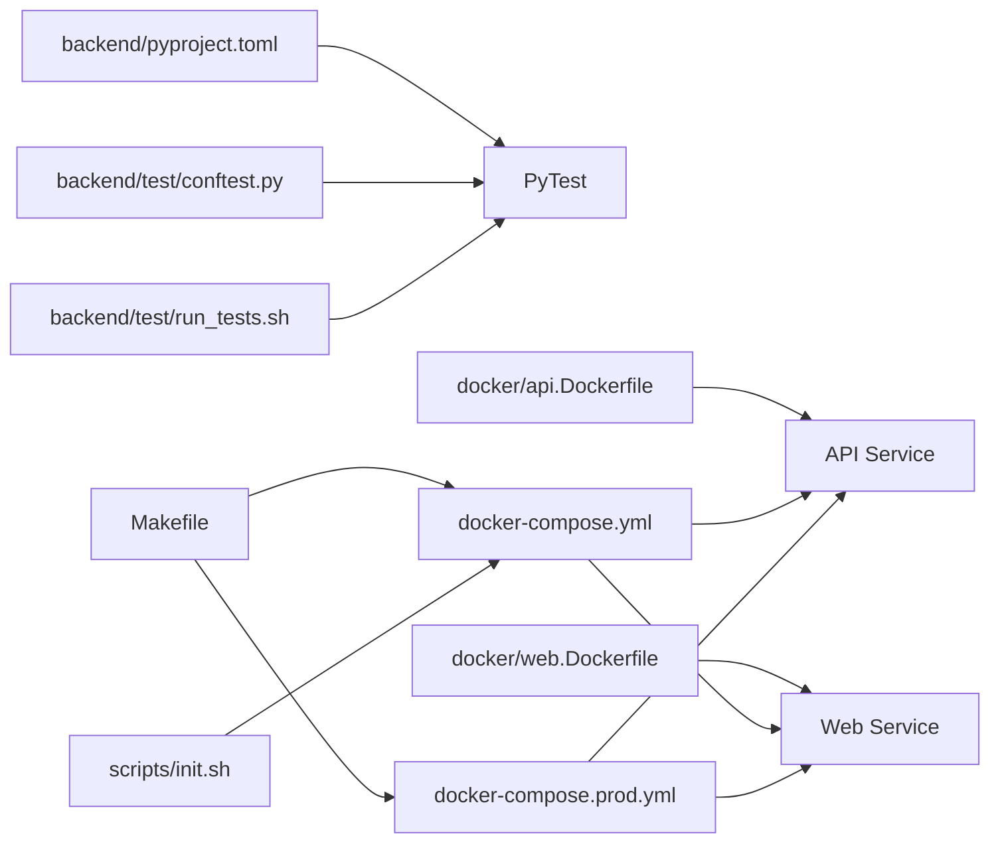

# CI/CD & Automated Deployment

<cite>
**Referenced Files in This Document**
- [docker-compose.yml](file://docker-compose.yml)
- [docker-compose.prod.yml](file://docker-compose.prod.yml)
- [Makefile](file://Makefile)
- [backend/pyproject.toml](file://backend/pyproject.toml)
- [backend/test/conftest.py](file://backend/test/conftest.py)
- [backend/test/run_tests.sh](file://backend/test/run_tests.sh)
- [docker/api.Dockerfile](file://docker/api.Dockerfile)
- [docker/web.Dockerfile](file://docker/web.Dockerfile)
- [docker/save_docker_images.sh](file://docker/save_docker_images.sh)
- [scripts/init.sh](file://scripts/init.sh)
- [.github/PULL_REQUEST_TEMPLATE.md](file://.github/PULL_REQUEST_TEMPLATE.md)
</cite>

## Table of Contents
1. [Introduction](#introduction)
2. [Project Structure](#project-structure)
3. [Core Components](#core-components)
4. [Architecture Overview](#architecture-overview)
5. [Detailed Component Analysis](#detailed-component-analysis)
6. [Dependency Analysis](#dependency-analysis)
7. [Performance Considerations](#performance-considerations)
8. [Troubleshooting Guide](#troubleshooting-guide)
9. [Conclusion](#conclusion)
10. [Appendices](#appendices)

## Introduction
This document describes the CI/CD and automated deployment practices for production environments. It covers code quality checks, automated testing, container image building, and deployment automation. It also documents environment provisioning, service orchestration, rollback procedures, infrastructure-as-code practices, and deployment strategies such as blue-green deployments, rolling updates, and canary releases. Security scanning, vulnerability assessment, and compliance validation are addressed alongside manual intervention procedures, emergency deployment overrides, and post-deployment validation steps.

## Project Structure
The repository organizes the platform into:
- Backend services and Python packages
- Frontend web application
- Container images and Docker Compose orchestration
- Test suites and linting/formatting tooling
- Scripts for environment initialization and image backup

**Diagram sources**
- [docker-compose.yml:1-436](file://docker-compose.yml#L1-L436)
- [docker-compose.prod.yml:1-373](file://docker-compose.prod.yml#L1-L373)
- [Makefile:1-39](file://Makefile#L1-L39)
- [scripts/init.sh:1-86](file://scripts/init.sh#L1-L86)
- [docker/api.Dockerfile:1-59](file://docker/api.Dockerfile#L1-L59)
- [docker/web.Dockerfile:1-49](file://docker/web.Dockerfile#L1-L49)
- [docker/save_docker_images.sh:1-41](file://docker/save_docker_images.sh#L1-L41)
- [backend/pyproject.toml:1-66](file://backend/pyproject.toml#L1-L66)
- [backend/test/conftest.py:1-27](file://backend/test/conftest.py#L1-L27)
- [backend/test/run_tests.sh:1-88](file://backend/test/run_tests.sh#L1-L88)

**Section sources**
- [docker-compose.yml:1-436](file://docker-compose.yml#L1-L436)
- [docker-compose.prod.yml:1-373](file://docker-compose.prod.yml#L1-L373)
- [Makefile:1-39](file://Makefile#L1-L39)
- [scripts/init.sh:1-86](file://scripts/init.sh#L1-L86)
- [docker/api.Dockerfile:1-59](file://docker/api.Dockerfile#L1-L59)
- [docker/web.Dockerfile:1-49](file://docker/web.Dockerfile#L1-L49)
- [docker/save_docker_images.sh:1-41](file://docker/save_docker_images.sh#L1-L41)
- [backend/pyproject.toml:1-66](file://backend/pyproject.toml#L1-L66)
- [backend/test/conftest.py:1-27](file://backend/test/conftest.py#L1-L27)
- [backend/test/run_tests.sh:1-88](file://backend/test/run_tests.sh#L1-L88)

## Core Components
- Orchestration: Docker Compose for local development and production deployment.
- Images: Multi-stage builds for API and web services.
- Testing: PyTest with unit, integration, and end-to-end categories.
- Quality: Ruff for Python linting/formatting; Prettier/ESLint for web.
- Provisioning: Initialization script to prepare environment variables and pull images.
- Backup: Image export script to back up base images.

**Section sources**
- [docker-compose.yml:37-122](file://docker-compose.yml#L37-L122)
- [docker-compose.prod.yml:29-158](file://docker-compose.prod.yml#L29-L158)
- [docker/api.Dockerfile:1-59](file://docker/api.Dockerfile#L1-L59)
- [docker/web.Dockerfile:1-49](file://docker/web.Dockerfile#L1-L49)
- [backend/pyproject.toml:41-66](file://backend/pyproject.toml#L41-L66)
- [Makefile:30-39](file://Makefile#L30-L39)
- [scripts/init.sh:1-86](file://scripts/init.sh#L1-L86)
- [docker/save_docker_images.sh:1-41](file://docker/save_docker_images.sh#L1-L41)

## Architecture Overview
The system uses Docker Compose to define services and their interdependencies. Production and development share the same image definitions but differ in targets, environment files, and exposed ports.

**Diagram sources**
- [docker-compose.yml:38-122](file://docker-compose.yml#L38-L122)
- [docker-compose.prod.yml:30-158](file://docker-compose.prod.yml#L30-L158)
- [docker/api.Dockerfile:1-59](file://docker/api.Dockerfile#L1-L59)
- [docker/web.Dockerfile:1-49](file://docker/web.Dockerfile#L1-L49)

## Detailed Component Analysis

### CI/CD Pipeline and GitHub Actions Workflows
- Code quality checks: Python linting/formatting via Ruff; web linting/formatting via ESLint/Prettier.
- Automated testing: PyTest configured in pyproject.toml; test runner script supports unit, integration, e2e, and full suites.
- Container image building: Multi-stage Dockerfiles produce optimized images for API and Web.
- Deployment automation: Docker Compose orchestrates services; production compose targets production-ready runtime.

Note: The repository snapshot does not include GitHub Actions workflow YAML files. The following guidance prescribes recommended stages and jobs aligned with the existing tooling and images.

Recommended workflow stages:
- Build and push images
  - Build API image using docker/api.Dockerfile
  - Build Web image using docker/web.Dockerfile
  - Tag images with semantic version from project metadata
  - Push to registry
- Code quality
  - Run Ruff checks and format
  - Run ESLint and Prettier for web
- Automated testing
  - Unit tests
  - Integration tests against orchestrated services
  - End-to-end tests
- Security scanning
  - SCA and SAST scans on images and source
- Deploy to staging
  - Deploy using docker-compose.prod.yml
  - Health checks and readiness probes
- Canary rollout
  - Gradually shift traffic to new version
- Promote to production
  - Manual approval gate
  - Apply production compose
- Rollback
  - Re-deploy previous image tag
  - Reverse canary rollout

[No sources needed since this section provides recommended workflow structure not present in the repository]

### Automated Testing Strategies
- Unit tests: Marked with pytest markers; run without live services.
- Integration tests: Require API health and live services.
- End-to-end tests: Exercise complete workflows.
- Test runner script: Provides commands to run subsets and check server health.

**Diagram sources**
- [backend/test/run_tests.sh:10-43](file://backend/test/run_tests.sh#L10-L43)
- [backend/pyproject.toml:41-54](file://backend/pyproject.toml#L41-L54)

**Section sources**
- [backend/pyproject.toml:41-66](file://backend/pyproject.toml#L41-L66)
- [backend/test/conftest.py:17-26](file://backend/test/conftest.py#L17-L26)
- [backend/test/run_tests.sh:1-88](file://backend/test/run_tests.sh#L1-L88)

### Container Image Management and Versioning
- Images are built from multi-stage Dockerfiles.
- Version is derived from project metadata.
- Registry operations: Build, tag, push, and rollback by redeploying previous tag.
- Base image backup: Export script aggregates commonly used base images.

**Diagram sources**
- [docker/api.Dockerfile:1-59](file://docker/api.Dockerfile#L1-L59)
- [docker/web.Dockerfile:1-49](file://docker/web.Dockerfile#L1-L49)
- [backend/pyproject.toml:2-4](file://backend/pyproject.toml#L2-L4)
- [docker/save_docker_images.sh:13-33](file://docker/save_docker_images.sh#L13-L33)

**Section sources**
- [docker/api.Dockerfile:1-59](file://docker/api.Dockerfile#L1-L59)
- [docker/web.Dockerfile:1-49](file://docker/web.Dockerfile#L1-L49)
- [backend/pyproject.toml:2-4](file://backend/pyproject.toml#L2-L4)
- [docker/save_docker_images.sh:1-41](file://docker/save_docker_images.sh#L1-L41)

### Deployment Automation Scripts and Orchestration
- Local development: Makefile targets for up/down, lite mode, logs, and formatting.
- Production: docker-compose.prod.yml defines production services and health checks.
- Environment initialization: scripts/init.sh pulls base images and prepares .env.
- Health checks: Services include healthcheck directives for readiness.

**Diagram sources**
- [Makefile:6-14](file://Makefile#L6-L14)
- [docker-compose.prod.yml:49-65](file://docker-compose.prod.yml#L49-L65)

**Section sources**
- [Makefile:1-39](file://Makefile#L1-L39)
- [docker-compose.prod.yml:1-373](file://docker-compose.prod.yml#L1-L373)
- [scripts/init.sh:53-80](file://scripts/init.sh#L53-L80)

### Infrastructure as Code and Configuration Management
- Compose files define services, networks, volumes, and environment variables.
- Separate environment files (.env and .env.prod) manage configuration per environment.
- Health checks embedded in Compose ensure observability.
- Volume mounts for persistent data and model directories.

**Section sources**
- [docker-compose.yml:1-436](file://docker-compose.yml#L1-L436)
- [docker-compose.prod.yml:1-373](file://docker-compose.prod.yml#L1-L373)

### Deployment Strategies
- Blue-green deployments: Maintain two identical environments; switch traffic after validation.
- Rolling updates: Gradually replace instances with minimal downtime.
- Canary releases: Route a small percentage of traffic to the new version.

[No sources needed since this section provides general deployment strategy guidance]

### Security Scanning, Vulnerability Assessment, and Compliance Validation
- Static analysis: Ruff for Python; ESLint/Prettier for web.
- Image scanning: Integrate SCA/SAST scans on built images.
- Secrets management: Keep sensitive keys in environment files and avoid committing secrets.
- Network isolation: Use dedicated Docker networks for services.

[No sources needed since this section provides general security guidance]

### Manual Intervention Procedures and Emergency Overrides
- Emergency rollback: Redeploy previous image tag immediately.
- Pause/Resume: Stop or scale down problematic services.
- Override configuration: Temporarily adjust environment variables for mitigation.
- Post-deployment validation: Verify health endpoints, metrics, and logs.

[No sources needed since this section provides general operational guidance]

## Dependency Analysis
The following diagram shows key dependencies among components used in CI/CD and deployment.

**Diagram sources**
- [backend/pyproject.toml:41-66](file://backend/pyproject.toml#L41-L66)
- [backend/test/conftest.py:17-26](file://backend/test/conftest.py#L17-L26)
- [backend/test/run_tests.sh:1-88](file://backend/test/run_tests.sh#L1-L88)
- [docker/api.Dockerfile:1-59](file://docker/api.Dockerfile#L1-L59)
- [docker/web.Dockerfile:1-49](file://docker/web.Dockerfile#L1-L49)
- [docker-compose.yml:37-122](file://docker-compose.yml#L37-L122)
- [docker-compose.prod.yml:29-158](file://docker-compose.prod.yml#L29-L158)
- [Makefile:6-14](file://Makefile#L6-L14)
- [scripts/init.sh:53-80](file://scripts/init.sh#L53-L80)

**Section sources**
- [backend/pyproject.toml:41-66](file://backend/pyproject.toml#L41-L66)
- [backend/test/conftest.py:17-26](file://backend/test/conftest.py#L17-L26)
- [backend/test/run_tests.sh:1-88](file://backend/test/run_tests.sh#L1-L88)
- [docker/api.Dockerfile:1-59](file://docker/api.Dockerfile#L1-L59)
- [docker/web.Dockerfile:1-49](file://docker/web.Dockerfile#L1-L49)
- [docker-compose.yml:37-122](file://docker-compose.yml#L37-L122)
- [docker-compose.prod.yml:29-158](file://docker-compose.prod.yml#L29-L158)
- [Makefile:6-14](file://Makefile#L6-L14)
- [scripts/init.sh:53-80](file://scripts/init.sh#L53-L80)

## Performance Considerations
- Multi-stage builds reduce final image size and improve cold start times.
- Caching uv pip installer reduces build time.
- Health checks prevent routing unhealthy instances.
- Lite mode reduces resource footprint during development.

[No sources needed since this section provides general guidance]

## Troubleshooting Guide
Common issues and resolutions:
- Missing .env: The initialization script creates .env and pulls required images.
- Test server not healthy: The test runner checks health and provides guidance.
- Build failures: Verify Dockerfile stages and ensure base images are cached.
- Health check failures: Inspect service logs and environment variables.

**Section sources**
- [scripts/init.sh:11-50](file://scripts/init.sh#L11-L50)
- [backend/test/run_tests.sh:10-20](file://backend/test/run_tests.sh#L10-L20)
- [docker/api.Dockerfile:51-55](file://docker/api.Dockerfile#L51-L55)
- [docker-compose.yml:69-83](file://docker-compose.yml#L69-L83)

## Conclusion
The repository provides a solid foundation for CI/CD and automated deployment with Docker Compose, multi-stage images, and comprehensive testing. To operationalize in production, integrate the recommended GitHub Actions stages, add security scanning, and adopt blue-green/rolling/canary strategies. Use health checks, environment separation, and image backup procedures to ensure reliability and recoverability.

## Appendices
- Pull Request template encourages pre-checks and testing.

**Section sources**
- [.github/PULL_REQUEST_TEMPLATE.md:20-22](file://.github/PULL_REQUEST_TEMPLATE.md#L20-L22)