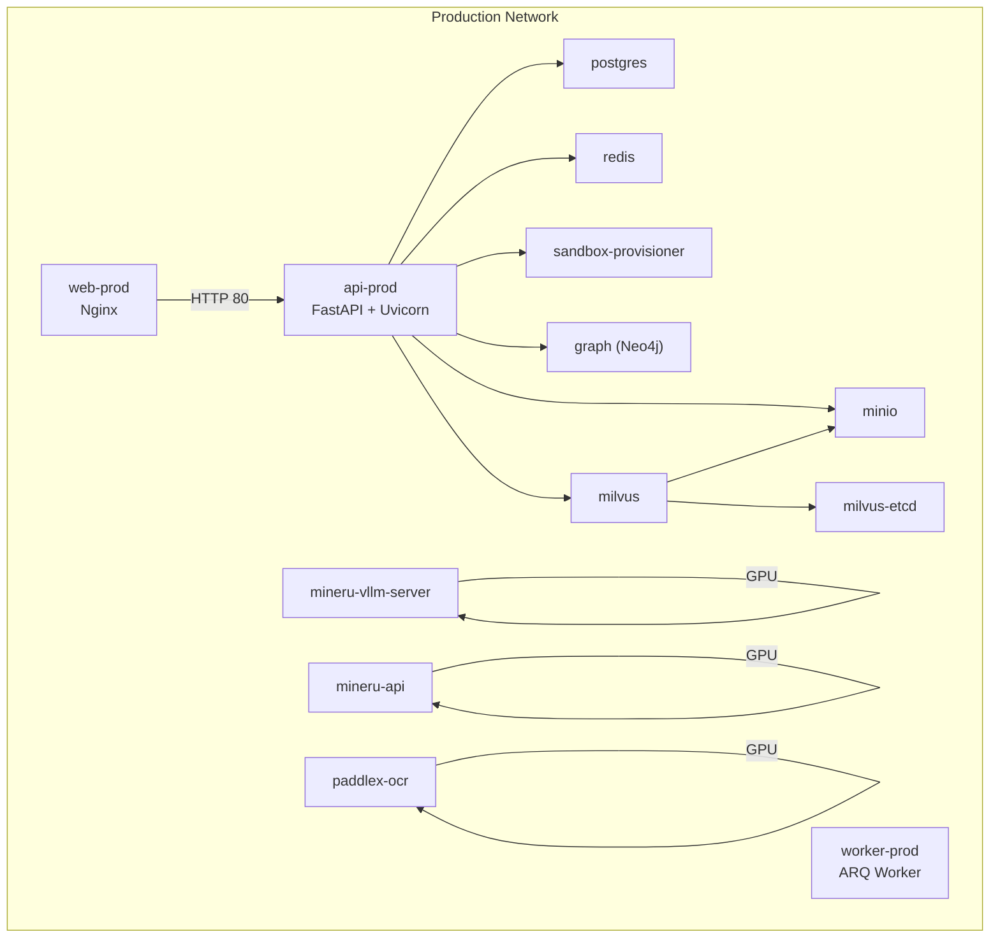
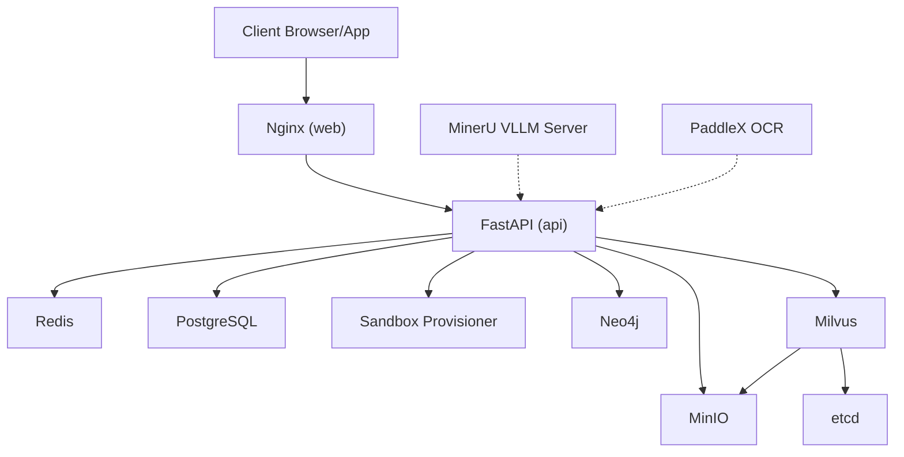
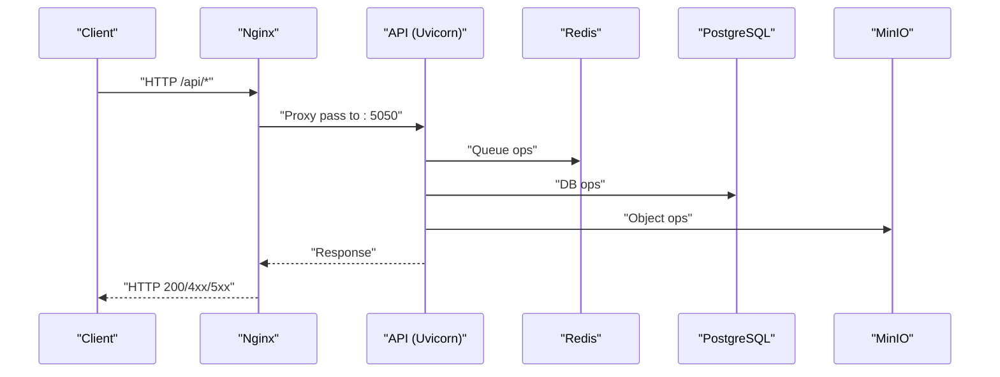
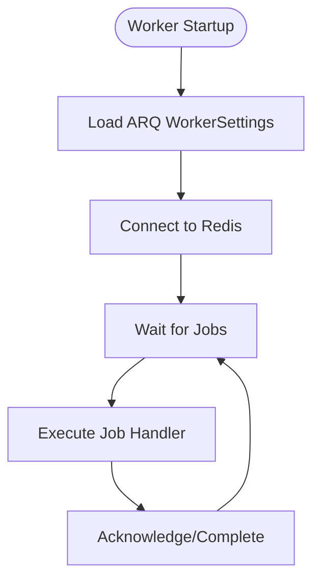
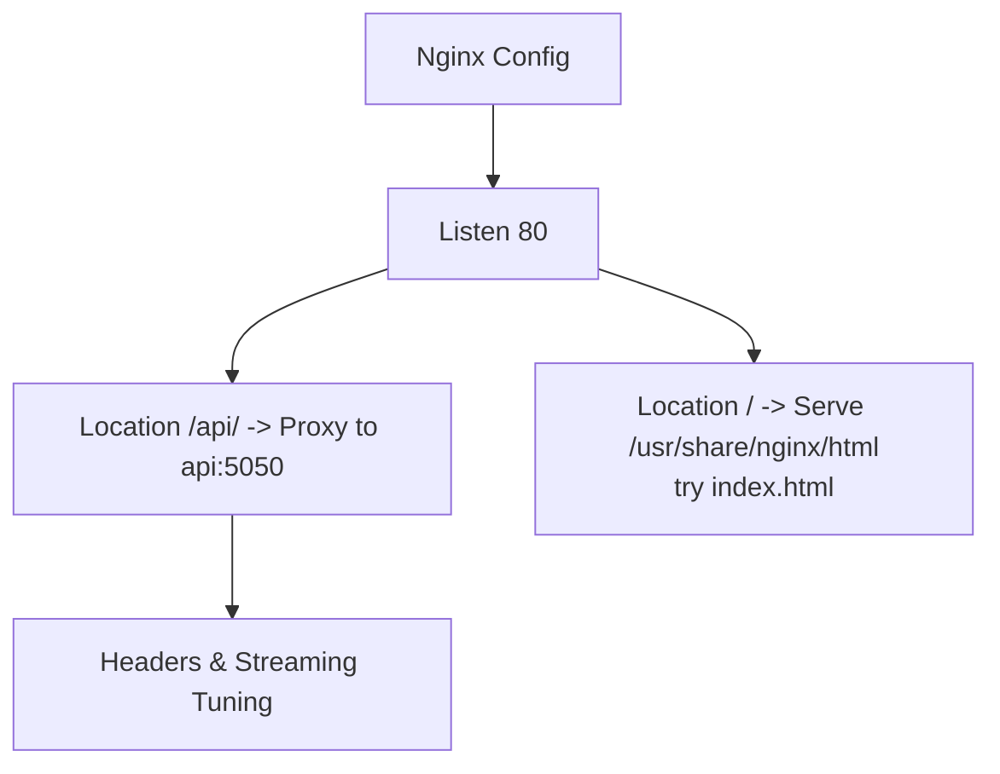
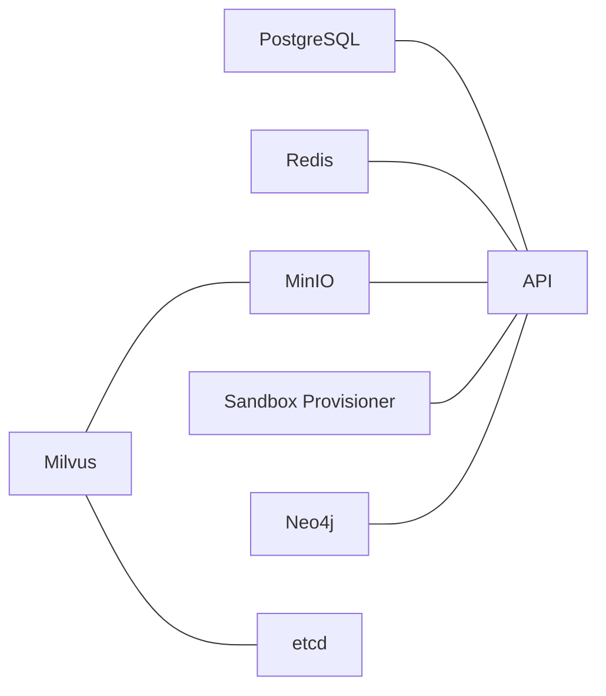
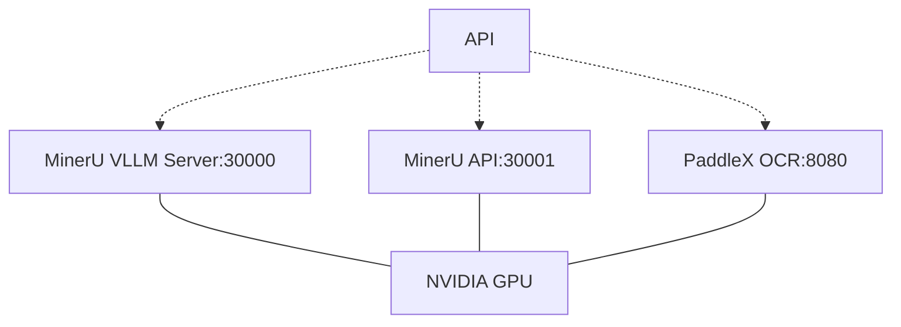
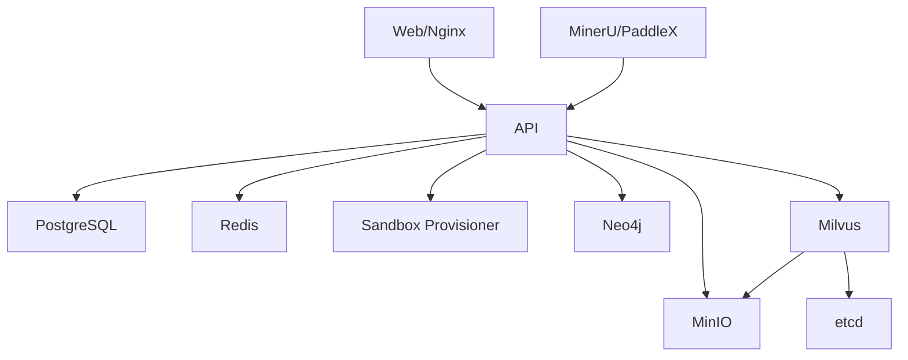
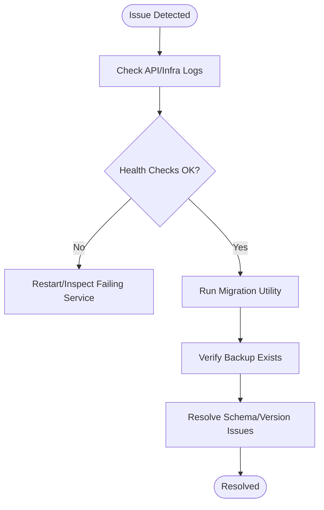

# Deployment & Production

<cite>
**Referenced Files in This Document**
- [docker-compose.prod.yml](file://docker-compose.prod.yml)
- [docker-compose.yml](file://docker-compose.yml)
- [api.Dockerfile](file://docker/api.Dockerfile)
- [web.Dockerfile](file://docker/web.Dockerfile)
- [nginx.conf](file://docker/nginx/nginx.conf)
- [default.conf](file://docker/nginx/default.conf)
- [main.py](file://backend/server/main.py)
- [lifespan.py](file://backend/server/utils/lifespan.py)
- [migrate.py](file://backend/server/utils/migrate.py)
- [pyproject.toml](file://backend/pyproject.toml)
- [Makefile](file://Makefile)
- [init.sh](file://scripts/init.sh)
</cite>

## Table of Contents
1. [Introduction](#introduction)
2. [Project Structure](#project-structure)
3. [Core Components](#core-components)
4. [Architecture Overview](#architecture-overview)
5. [Detailed Component Analysis](#detailed-component-analysis)
6. [Dependency Analysis](#dependency-analysis)
7. [Performance Considerations](#performance-considerations)
8. [Troubleshooting Guide](#troubleshooting-guide)
9. [Conclusion](#conclusion)
10. [Appendices](#appendices)

## Introduction
This document provides comprehensive production deployment guidance for the platform, focusing on a Docker-based strategy with container orchestration, service configuration, and networking. It covers production topology, load balancing, scaling, high availability, environment variable configuration, secrets management, security hardening, monitoring and logging, backup and recovery, disaster recovery, maintenance workflows, CI/CD integration, and operational procedures. Practical examples are linked via file paths to the repository’s configuration and scripts.

## Project Structure
The deployment relies on Docker Compose for orchestration and multi-stage Dockerfiles for building the API and Web assets. The production compose file defines services for the API, background worker, sandbox provisioner, Neo4j, etcd, MinIO, Milvus, PostgreSQL, Redis, optional GPU-accelerated miners, and a reverse proxy (Nginx). The development compose mirrors the production setup but adds hot-reload and developer-friendly ports.

**Diagram sources**
- [docker-compose.prod.yml:29-373](file://docker-compose.prod.yml#L29-L373)

**Section sources**
- [docker-compose.prod.yml:1-373](file://docker-compose.prod.yml#L1-L373)
- [docker-compose.yml:1-436](file://docker-compose.yml#L1-L436)

## Core Components
- API service: FastAPI application with Uvicorn, ARQ worker, and health checks. Exposed internally on port 5050; proxied by Nginx on port 80.
- Worker service: Background job processor using ARQ with Redis-backed queues.
- Web service: Nginx serving frontend static assets and proxying API requests.
- Infrastructure: PostgreSQL, Redis, Neo4j, Milvus (with etcd and MinIO), sandbox provisioner, and optional GPU-accelerated services (MinerU and PaddleX).
- Environment configuration: Centralized via environment variables and env files; production compose uses a dedicated env file.

**Section sources**
- [docker-compose.prod.yml:29-373](file://docker-compose.prod.yml#L29-L373)
- [docker-compose.yml:37-436](file://docker-compose.yml#L37-L436)
- [api.Dockerfile:1-59](file://docker/api.Dockerfile#L1-L59)
- [web.Dockerfile:1-49](file://docker/web.Dockerfile#L1-L49)

## Architecture Overview
The production architecture separates compute (API/Worker), persistence (PostgreSQL, Redis), vector/graph (Milvus/Neo4j), and object storage (MinIO) behind a reverse proxy. Services communicate over an internal Docker network. Health checks ensure readiness across dependent services.

**Diagram sources**
- [docker-compose.prod.yml:29-373](file://docker-compose.prod.yml#L29-L373)
- [default.conf:13-31](file://docker/nginx/default.conf#L13-L31)

## Detailed Component Analysis

### API Service
- Containerization: Built from the API Dockerfile, installed with uv and Node tooling, and runs Uvicorn under production settings.
- Entrypoint: Uvicorn with host binding to 0.0.0.0 and port 5050.
- Health check: HTTP GET against the system health endpoint.
- Dependencies: Depends on PostgreSQL, Redis, MinIO, and sandbox-provisioner being healthy before starting.

**Diagram sources**
- [docker-compose.prod.yml:29-66](file://docker-compose.prod.yml#L29-L66)
- [default.conf:13-31](file://docker/nginx/default.conf#L13-L31)

**Section sources**
- [docker-compose.prod.yml:29-66](file://docker-compose.prod.yml#L29-L66)
- [api.Dockerfile:1-59](file://docker/api.Dockerfile#L1-L59)
- [main.py:139-150](file://backend/server/main.py#L139-L150)
- [lifespan.py:17-89](file://backend/server/utils/lifespan.py#L17-L89)

### Worker Service
- Containerization: Same base image and build as API.
- Entrypoint: ARQ worker configured via WorkerSettings.
- Dependencies: Shares the same environment and depends on the same infrastructure services.

**Diagram sources**
- [docker-compose.prod.yml:67-95](file://docker-compose.prod.yml#L67-L95)

**Section sources**
- [docker-compose.prod.yml:67-95](file://docker-compose.prod.yml#L67-L95)

### Web/Nginx Service
- Multi-stage build: Development stage for dev server, production stage builds and serves static assets via Nginx.
- Reverse proxy: Routes /api/ to the API service and serves SPA fallback via try_files.
- Streaming support: Disables proxy buffering and sets long timeouts for SSE/streaming.

**Diagram sources**
- [web.Dockerfile:24-49](file://docker/web.Dockerfile#L24-L49)
- [nginx.conf:1-25](file://docker/nginx/nginx.conf#L1-L25)
- [default.conf:1-32](file://docker/nginx/default.conf#L1-L32)

**Section sources**
- [web.Dockerfile:1-49](file://docker/web.Dockerfile#L1-L49)
- [nginx.conf:1-25](file://docker/nginx/nginx.conf#L1-L25)
- [default.conf:1-32](file://docker/nginx/default.conf#L1-L32)

### Infrastructure Services
- PostgreSQL: Persistent relational store with health checks and mounted volumes.
- Redis: In-memory cache/queue with AOF persistence.
- Neo4j: Graph database with Bolt and HTTP endpoints.
- Milvus: Vector database with etcd and MinIO; standalone mode.
- MinIO: S3-compatible object storage.
- Sandbox Provisioner: Manages sandbox containers and exposes health endpoint.

**Diagram sources**
- [docker-compose.prod.yml:181-246](file://docker-compose.prod.yml#L181-L246)

**Section sources**
- [docker-compose.prod.yml:181-246](file://docker-compose.prod.yml#L181-L246)

### GPU-Accelerated Services
- MinerU VLLM Server/API: Exposed on 30000/30001 with GPU reservations and host IPC.
- PaddleX OCR: Exposed on 8080 with GPU reservations.

**Diagram sources**
- [docker-compose.prod.yml:284-368](file://docker-compose.prod.yml#L284-L368)

**Section sources**
- [docker-compose.prod.yml:284-368](file://docker-compose.prod.yml#L284-L368)

## Dependency Analysis
- API depends on PostgreSQL, Redis, MinIO, and sandbox-provisioner for full functionality.
- Milvus depends on etcd and MinIO.
- GPU services depend on NVIDIA runtime and host GPU devices.
- Nginx depends on API for proxying.

**Diagram sources**
- [docker-compose.prod.yml:29-373](file://docker-compose.prod.yml#L29-L373)

**Section sources**
- [docker-compose.prod.yml:29-373](file://docker-compose.prod.yml#L29-L373)

## Performance Considerations
- Container resource allocation: GPU services define device reservations; tune ulimits and IPC as needed.
- Streaming and uploads: Nginx disables proxy buffering and increases timeouts for SSE and large uploads.
- Database and caches: Ensure adequate disk I/O and memory for PostgreSQL, Redis, and Milvus.
- Lite mode: Disable heavy subsystems (e.g., knowledge base) via environment flag to reduce footprint.
- Image caching: uv cache mount reduces installation time; keep lockfiles stable.

**Section sources**
- [docker-compose.prod.yml:300-315](file://docker-compose.prod.yml#L300-L315)
- [default.conf:22-31](file://docker/nginx/default.conf#L22-L31)
- [api.Dockerfile:51-55](file://docker/api.Dockerfile#L51-L55)
- [pyproject.toml:22-38](file://backend/pyproject.toml#L22-L38)

## Troubleshooting Guide
- Health checks: Use compose health checks to detect failing services; inspect logs for API and infrastructure.
- Logs: Use the provided Makefile target to fetch recent logs and environment metadata.
- Database migrations: The migration utility validates schema and applies incremental migrations with backups.
- Initialization: Use the initialization script to scaffold environment variables and pull base images.

**Diagram sources**
- [docker-compose.prod.yml:51-56](file://docker-compose.prod.yml#L51-L56)
- [Makefile:23-28](file://Makefile#L23-L28)
- [migrate.py:17-89](file://backend/server/utils/migrate.py#L17-L89)

**Section sources**
- [Makefile:23-28](file://Makefile#L23-L28)
- [migrate.py:17-89](file://backend/server/utils/migrate.py#L17-L89)
- [init.sh:1-86](file://scripts/init.sh#L1-L86)

## Conclusion
The production deployment leverages Docker Compose to orchestrate a cohesive stack of compute, persistence, vector/graph, and object storage services, with Nginx providing reverse proxying and streaming support. Health checks, environment-driven configuration, and GPU reservations enable scalable and secure operations. The included scripts and utilities streamline initialization, logging, and migrations, supporting robust day-2 operations.

## Appendices

### A. Production Deployment Topology and Scaling
- Horizontal scaling: Run multiple replicas of the API and Worker services behind a load balancer; ensure shared Redis and PostgreSQL backends remain single-instance or clustered as appropriate.
- High availability: Deploy PostgreSQL and Redis in HA modes; replicate Milvus with external etcd and MinIO; monitor health checks and auto-healing.
- Load balancing: Place a reverse proxy (Nginx) in front of the API; configure sticky sessions if required by upstream logic.

[No sources needed since this section provides general guidance]

### B. Environment Variables and Secrets Management
- Centralized variables: Define in the production env file and compose environment blocks; avoid committing secrets to source control.
- Secret rotation: Use external secret managers or encrypted env files; rotate credentials and re-deploy with zero-downtime strategies.

[No sources needed since this section provides general guidance]

### C. Security Hardening
- Network isolation: Keep internal services on an isolated Docker network; expose only necessary ports externally.
- TLS termination: Terminate TLS at the reverse proxy; enforce HTTPS redirects.
- Least privilege: Run services with minimal privileges; disable unnecessary capabilities and host mounts.

[No sources needed since this section provides general guidance]

### D. Monitoring and Logging
- Health checks: Leverage compose health checks for automatic restarts.
- Access logs: Enable Nginx access logs and centralize via log aggregation.
- Application logs: Configure structured logging in the API and forward to centralized systems.

[No sources needed since this section provides general guidance]

### E. Backup and Recovery
- Database: Back up PostgreSQL regularly; test restoration procedures.
- Object storage: Ensure MinIO snapshots/backups are automated and validated.
- Migration safety: The migration utility creates backups before applying changes.

**Section sources**
- [migrate.py:26-44](file://backend/server/utils/migrate.py#L26-L44)

### F. Disaster Recovery Planning
- Recovery time/objectives: Define RTO/RPO targets for each service tier.
- Failover drills: Practice failover for PostgreSQL, Redis, and Milvus; validate data consistency.
- Documentation: Maintain runbooks for restoring services and rehydrating state.

[No sources needed since this section provides general guidance]

### G. Maintenance Workflows
- Rolling updates: Use blue/green or rolling restarts for the API and Web services.
- Dependency updates: Pin base images and rebuild with updated lockfiles; test upgrades in staging first.

[No sources needed since this section provides general guidance]

### H. CI/CD Pipeline Integration
- Build stages: Use the multi-stage Dockerfiles to produce production images.
- Orchestration: Automate docker compose deployments with environment-specific overrides.
- Gatekeeping: Add pre-deploy health checks and smoke tests to the pipeline.

[No sources needed since this section provides general guidance]

### I. Practical Examples and Operational Procedures
- Start/stop services: Use the Makefile targets for convenience.
- Initialize environment: Run the initialization script to scaffold variables and pull images.
- Verify deployment: Confirm health checks and connectivity between services.

**Section sources**
- [Makefile:6-28](file://Makefile#L6-L28)
- [init.sh:1-86](file://scripts/init.sh#L1-L86)