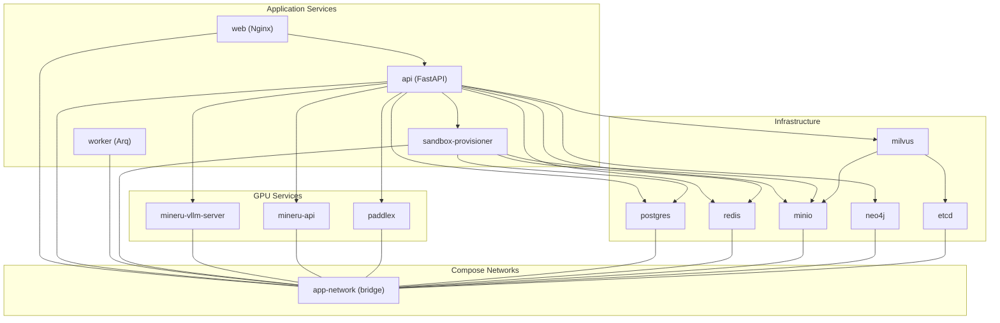
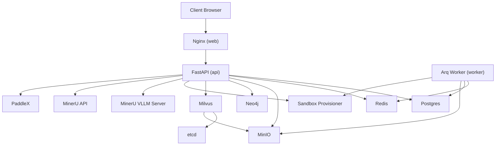
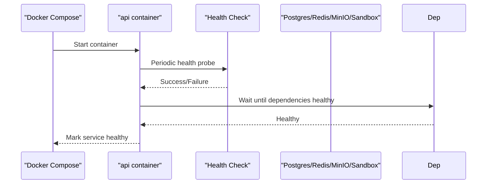
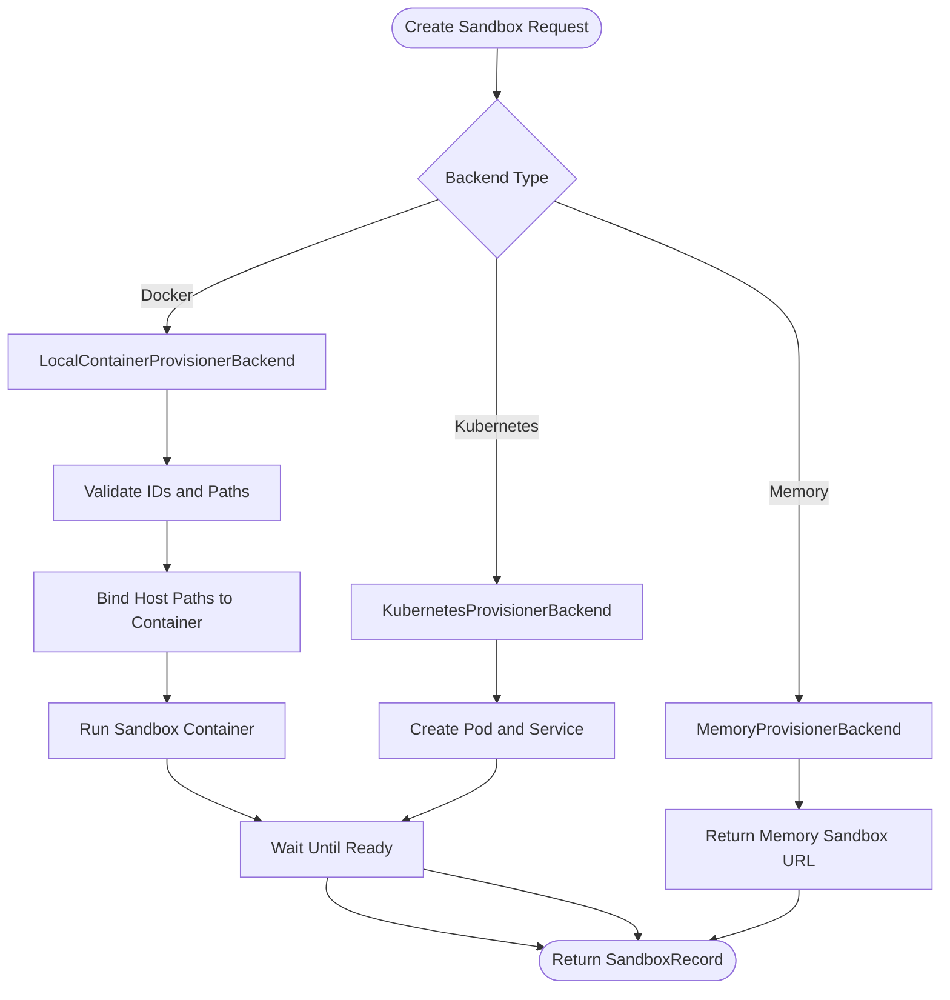
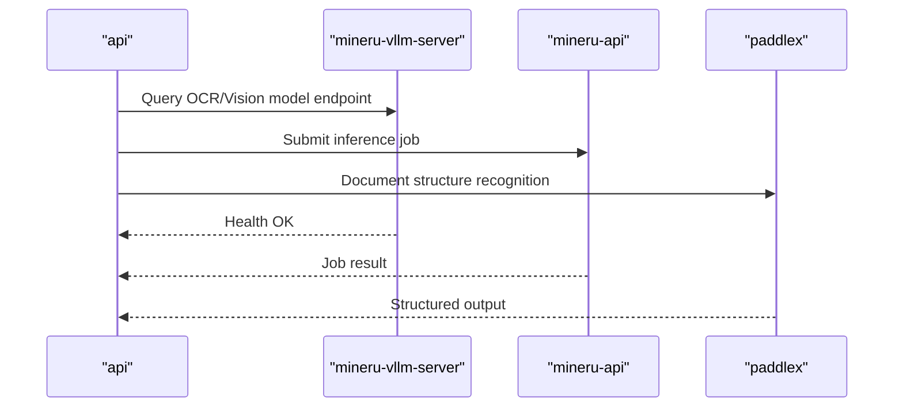
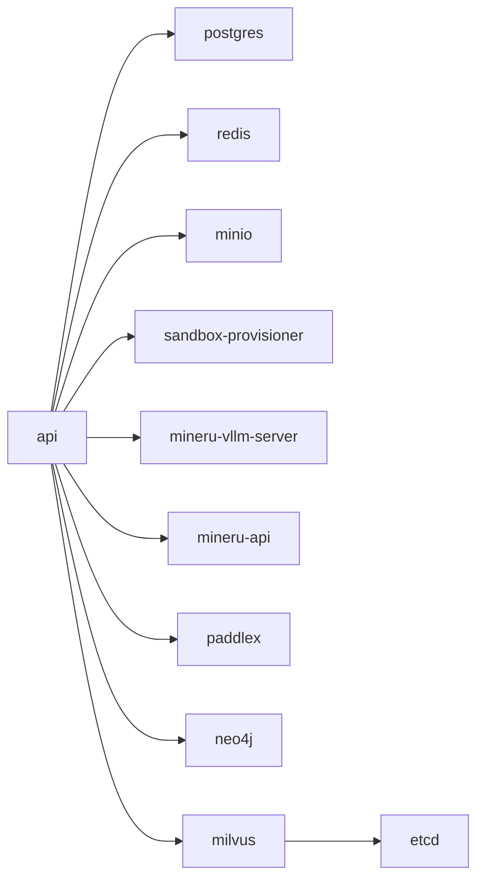

# Docker Configuration

<cite>
**Referenced Files in This Document**
- [docker-compose.prod.yml](file://docker-compose.prod.yml)
- [docker-compose.yml](file://docker-compose.yml)
- [api.Dockerfile](file://docker/api.Dockerfile)
- [web.Dockerfile](file://docker/web.Dockerfile)
- [mineru.Dockerfile](file://docker/mineru.Dockerfile)
- [paddlex.Dockerfile](file://docker/paddlex.Dockerfile)
- [Dockerfile (sandbox_provisioner)](file://docker/sandbox_provisioner/Dockerfile)
- [app.py (sandbox_provisioner)](file://docker/sandbox_provisioner/app.py)
- [requirements.txt (sandbox_provisioner)](file://docker/sandbox_provisioner/requirements.txt)
- [nginx.conf](file://docker/nginx/nginx.conf)
- [default.conf](file://docker/nginx/default.conf)
- [.dockerignore](file://.dockerignore)
- [PP-StructureV3.yaml](file://docker/PP-StructureV3.yaml)
</cite>

## Table of Contents
1. [Introduction](#introduction)
2. [Project Structure](#project-structure)
3. [Core Components](#core-components)
4. [Architecture Overview](#architecture-overview)
5. [Detailed Component Analysis](#detailed-component-analysis)
6. [Dependency Analysis](#dependency-analysis)
7. [Performance Considerations](#performance-considerations)
8. [Troubleshooting Guide](#troubleshooting-guide)
9. [Conclusion](#conclusion)
10. [Appendices](#appendices)

## Introduction
This document provides comprehensive Docker configuration guidance for production deployment of the platform. It covers the multi-service Docker Compose architecture, container specifications, resource allocation, networking, and volume mounting strategies. It documents the production Dockerfiles for API and web services, including build optimization and security hardening. It also explains service dependencies, health checks, startup ordering, and GPU-enabled containers for MinerU and PaddleX with NVIDIA runtime configuration. Environment variable management, secrets handling, and configuration inheritance patterns are included, along with practical examples for orchestration, scaling, and troubleshooting.

## Project Structure
The Docker configuration is organized around:
- Production and development Docker Compose files orchestrating services
- Multi-stage Dockerfiles for API, web, MinerU, and PaddleX
- Supporting infrastructure services (Postgres, Redis, Milvus, etcd, MinIO, Neo4j)
- A sandbox provisioner service for managing ephemeral execution environments
- Nginx configuration for reverse proxying API traffic to the backend

**Diagram sources**
- [docker-compose.prod.yml:29-373](file://docker-compose.prod.yml#L29-L373)
- [docker-compose.yml:37-436](file://docker-compose.yml#L37-L436)

**Section sources**
- [docker-compose.prod.yml:29-373](file://docker-compose.prod.yml#L29-L373)
- [docker-compose.yml:37-436](file://docker-compose.yml#L37-L436)

## Core Components
- API service: FastAPI application built with uv and Arq worker for background tasks
- Worker service: Arq worker process consuming the queue managed by Redis
- Web service: Nginx proxying API requests and serving frontend static assets
- Infrastructure services: Postgres, Redis, Milvus (with etcd), MinIO, Neo4j
- GPU-enabled services: MinerU (VLLM server and API) and PaddleX OCR pipeline
- Sandbox provisioner: Manages ephemeral sandbox containers for secure execution

Key production environment variables are centralized under a shared environment block and injected via env_file and environment blocks. Health checks ensure readiness before dependent services start.

**Section sources**
- [docker-compose.prod.yml:1-28](file://docker-compose.prod.yml#L1-L28)
- [docker-compose.prod.yml:29-373](file://docker-compose.prod.yml#L29-L373)
- [docker-compose.yml:1-36](file://docker-compose.yml#L1-L36)
- [docker-compose.yml:37-436](file://docker-compose.yml#L37-L436)

## Architecture Overview
The production architecture uses a single bridge network for inter-service communication. The web tier proxies API requests, while the API service coordinates with databases, vector store, object storage, sandbox provisioner, and GPU services. GPU services are constrained to a single GPU by default and require NVIDIA runtime support.

**Diagram sources**
- [docker-compose.prod.yml:29-373](file://docker-compose.prod.yml#L29-L373)

## Detailed Component Analysis

### API Service (Production)
- Build: Multi-stage using uv for optimized dependency installation and a slim Python base
- Entrypoint: Uvicorn running the FastAPI app
- Networking: Attached to app-network
- Volumes: Persistent saves mounted for artifacts and logs
- Health check: GET on internal health endpoint
- Dependencies: Requires Postgres, Redis, MinIO, and sandbox-provisioner healthy before starting

**Diagram sources**
- [docker-compose.prod.yml:49-66](file://docker-compose.prod.yml#L49-L66)

**Section sources**
- [docker-compose.prod.yml:30-66](file://docker-compose.prod.yml#L30-L66)
- [api.Dockerfile:1-59](file://docker/api.Dockerfile#L1-L59)

### Worker Service (Production)
- Build: Same base as API
- Entrypoint: Arq worker process
- Networking: Attached to app-network
- Volumes: Persistent saves mounted
- Dependencies: Same as API

**Section sources**
- [docker-compose.prod.yml:67-95](file://docker-compose.prod.yml#L67-L95)

### Web Service (Production)
- Build: Multi-stage Node build followed by Nginx serving
- Ports: Exposes 80
- Reverse proxy: Proxies /api/ to api:5050 with streaming support
- Environment: NODE_ENV=production and optional lite mode flag

**Section sources**
- [docker-compose.prod.yml:141-158](file://docker-compose.prod.yml#L141-L158)
- [web.Dockerfile:1-49](file://docker/web.Dockerfile#L1-L49)
- [default.conf:13-31](file://docker/nginx/default.conf#L13-L31)

### Sandbox Provisioner
- Purpose: Creates, discovers, lists, and deletes ephemeral sandbox containers or Kubernetes pods
- Backends: Docker (local), Kubernetes, or memory stub
- Mounts: Persists user-data and skills under a structured host path
- Health: Lightweight health endpoint
- Security: Uses unconfined seccomp for sandbox container

**Diagram sources**
- [app.py:116-455](file://docker/sandbox_provisioner/app.py#L116-L455)
- [app.py:457-698](file://docker/sandbox_provisioner/app.py#L457-L698)
- [app.py:778-789](file://docker/sandbox_provisioner/app.py#L778-L789)

**Section sources**
- [docker-compose.yml:124-174](file://docker-compose.yml#L124-L174)
- [Dockerfile (sandbox_provisioner):1-16](file://docker/sandbox_provisioner/Dockerfile#L1-L16)
- [requirements.txt (sandbox_provisioner):1-5](file://docker/sandbox_provisioner/requirements.txt#L1-L5)
- [app.py:1-800](file://docker/sandbox_provisioner/app.py#L1-L800)

### Infrastructure Services
- Postgres: Persisted data and logs; health check via pg_isready
- Redis: Append-only persistence; health via ping
- Milvus: Standalone with etcd and MinIO; health via /healthz
- etcd: Configured with compaction and quota
- MinIO: Live health endpoint; console exposed
- Neo4j: Bolt and HTTP endpoints with embedding enabled

**Section sources**
- [docker-compose.prod.yml:248-282](file://docker-compose.prod.yml#L248-L282)
- [docker-compose.prod.yml:284-368](file://docker-compose.prod.yml#L284-L368)

### GPU-Enabled Services (MinerU and PaddleX)
- MinerU VLLM Server: Single GPU reservation, host IPC, ulimits, health check
- MinerU API: Port exposure, host IPC, ulimits
- PaddleX: Single GPU reservation, model pipeline configuration, health check

**Diagram sources**
- [docker-compose.prod.yml:284-368](file://docker-compose.prod.yml#L284-L368)

**Section sources**
- [docker-compose.prod.yml:284-368](file://docker-compose.prod.yml#L284-L368)
- [mineru.Dockerfile:1-33](file://docker/mineru.Dockerfile#L1-L33)
- [paddlex.Dockerfile:1-15](file://docker/paddlex.Dockerfile#L1-L15)
- [PP-StructureV3.yaml:1-230](file://docker/PP-StructureV3.yaml#L1-L230)

### Production Dockerfiles

#### API Dockerfile
- Base: Python slim with uv and NodeJS copied into image
- System dependencies: ffmpeg, git, PostgreSQL client libs
- uv sync: Frozen lockfile, cached wheels, bytecode compilation
- Final stage: Copies server code and sets executable path

**Section sources**
- [api.Dockerfile:1-59](file://docker/api.Dockerfile#L1-L59)

#### Web Dockerfile
- Development stage: Node Alpine with pnpm install and dev server
- Build stage: Node Alpine with pnpm install and build
- Production stage: Nginx Alpine serving dist assets and custom configs

**Section sources**
- [web.Dockerfile:1-49](file://docker/web.Dockerfile#L1-L49)
- [nginx.conf:1-25](file://docker/nginx/nginx.conf#L1-L25)
- [default.conf:1-32](file://docker/nginx/default.conf#L1-L32)

#### MinerU Dockerfile
- Base: vLLM OpenAI image with Chinese font and libgl support
- Installs MinerU core and pre-downloads models
- Sets model source to local and preserves entrypoint behavior

**Section sources**
- [mineru.Dockerfile:1-33](file://docker/mineru.Dockerfile#L1-L33)

#### PaddleX Dockerfile
- Base: PaddleX GPU image with CUDA and TensorRT
- Installs CPU HPI and serving components
- Copies pipeline config and exposes 8080

**Section sources**
- [paddlex.Dockerfile:1-15](file://docker/paddlex.Dockerfile#L1-L15)
- [PP-StructureV3.yaml:1-230](file://docker/PP-StructureV3.yaml#L1-L230)

## Dependency Analysis
- Startup ordering: API and worker depend on Postgres, Redis, MinIO, and sandbox-provisioner being healthy
- GPU services: Deployed with device reservations; ensure NVIDIA runtime is available
- Network isolation: All services share app-network; inter-service DNS resolves by service name
- Volume persistence: Saves and infrastructure data persisted to host paths

**Diagram sources**
- [docker-compose.prod.yml:57-66](file://docker-compose.prod.yml#L57-L66)
- [docker-compose.prod.yml:86-94](file://docker-compose.prod.yml#L86-L94)

**Section sources**
- [docker-compose.prod.yml:29-373](file://docker-compose.prod.yml#L29-L373)

## Performance Considerations
- Build optimization:
  - uv sync with frozen lockfile and caching reduces build time and image size
  - Multi-stage builds minimize final image layers
- Resource allocation:
  - GPU services currently reserve a single GPU; adjust device IDs and capabilities as needed
  - Milvus and etcd configured with quotas and compaction to manage disk and memory
- Networking:
  - Nginx proxy buffering disabled for streaming responses; timeouts increased for uploads
- Caching:
  - uv cache directory mounted for Python dependency caching
  - Node pnpm registry mirror improves install speed

[No sources needed since this section provides general guidance]

## Troubleshooting Guide
Common issues and resolutions:
- Health check failures:
  - Verify service-specific health endpoints and credentials
  - Confirm dependent services are reachable on expected ports
- GPU service startup:
  - Ensure NVIDIA runtime is installed and configured
  - Check device reservations and driver compatibility
- Sandbox provisioning:
  - Validate host path bindings and permissions
  - Confirm Docker socket is mounted and accessible
- Proxy and CORS:
  - Review Nginx proxy headers and timeouts
  - Confirm API routes are correctly proxied under /api/

**Section sources**
- [docker-compose.prod.yml:51-56](file://docker-compose.prod.yml#L51-L56)
- [docker-compose.prod.yml:133-138](file://docker-compose.prod.yml#L133-L138)
- [docker-compose.prod.yml:304-315](file://docker-compose.prod.yml#L304-L315)
- [docker-compose.prod.yml:353-358](file://docker-compose.prod.yml#L353-L358)
- [default.conf:13-31](file://docker/nginx/default.conf#L13-L31)

## Conclusion
The production Docker configuration establishes a robust, modular, and scalable deployment model. It leverages multi-stage builds, health checks, and explicit dependency ordering to ensure reliable operation. GPU services are integrated with device reservations and appropriate runtime settings. The sandbox provisioner enables secure, isolated execution environments. With careful attention to environment variables, secrets handling, and volume persistence, the platform can be reliably deployed and operated at scale.

[No sources needed since this section summarizes without analyzing specific files]

## Appendices

### Environment Variable Management and Secrets
- Centralized environment block for API/worker variables
- Separate env files for development and production
- Inheritance pattern: compose injects variables into services; services consume them at runtime

**Section sources**
- [docker-compose.prod.yml:1-28](file://docker-compose.prod.yml#L1-L28)
- [docker-compose.prod.yml:43-44](file://docker-compose.prod.yml#L43-L44)
- [docker-compose.yml:1-36](file://docker-compose.yml#L1-L36)
- [docker-compose.yml:61-62](file://docker-compose.yml#L61-L62)

### Container Orchestration and Scaling Examples
- Scale workers horizontally to handle background load
- Use separate profiles to selectively start GPU services
- Adjust ulimits and IPC settings for GPU workloads

**Section sources**
- [docker-compose.prod.yml:290-315](file://docker-compose.prod.yml#L290-L315)
- [docker-compose.prod.yml:349-368](file://docker-compose.prod.yml#L349-L368)

### Volume Mounting Strategies
- Persistent data: Postgres, Redis, Milvus, MinIO, Neo4j
- Application saves: Mounted to API, worker, sandbox-provisioner
- Pipeline models: Mounted for PaddleX

**Section sources**
- [docker-compose.prod.yml:39-40](file://docker-compose.prod.yml#L39-L40)
- [docker-compose.prod.yml:101-103](file://docker-compose.prod.yml#L101-L103)
- [docker-compose.prod.yml:258-259](file://docker-compose.prod.yml#L258-L259)
- [docker-compose.prod.yml:278-279](file://docker-compose.prod.yml#L278-L279)
- [docker-compose.prod.yml:232-234](file://docker-compose.prod.yml#L232-L234)
- [docker-compose.prod.yml:208-210](file://docker-compose.prod.yml#L208-L210)
- [docker-compose.prod.yml:163-165](file://docker-compose.prod.yml#L163-L165)
- [docker-compose.prod.yml:351-352](file://docker-compose.prod.yml#L351-L352)

### Security Hardening Notes
- Python and Node mirrors configured for faster installs
- uv bytecode compilation enabled
- Milvus and sandbox containers use unconfined seccomp for functionality; evaluate necessity in hardened environments

**Section sources**
- [api.Dockerfile:13-16](file://docker/api.Dockerfile#L13-L16)
- [api.Dockerfile:49-52](file://docker/api.Dockerfile#L49-L52)
- [docker-compose.prod.yml:226-227](file://docker-compose.prod.yml#L226-L227)
- [app.py:383](file://docker/sandbox_provisioner/app.py#L383)

### Ignoring Build Artifacts
- .dockerignore excludes logs, caches, and temporary files to reduce image size

**Section sources**
- [.dockerignore:1-24](file://.dockerignore#L1-L24)