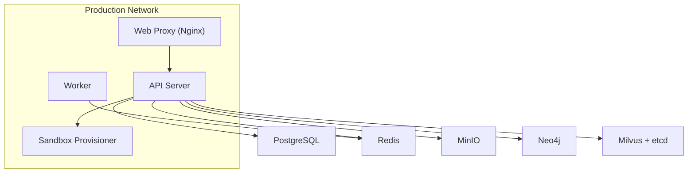
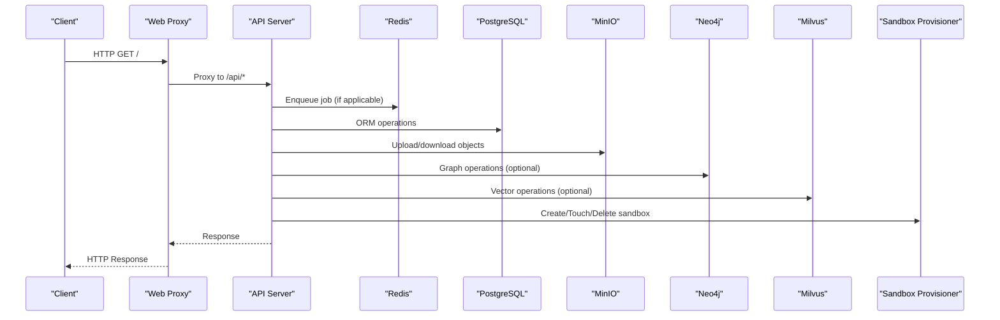
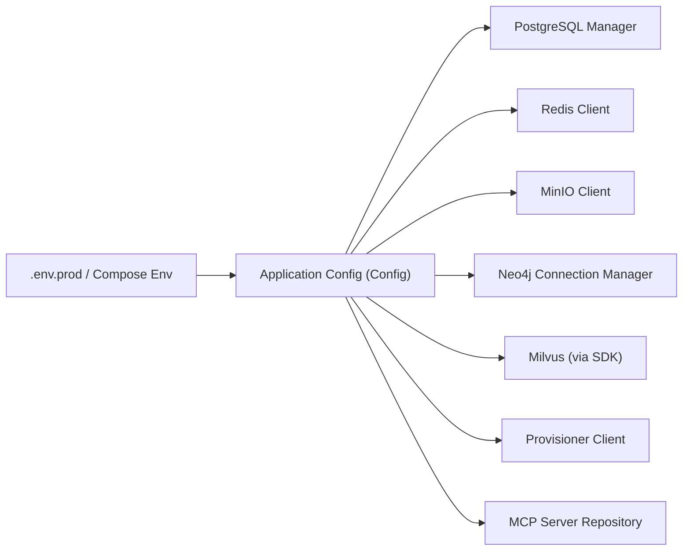

# Environment Setup & Configuration

<cite>
**Referenced Files in This Document**
- [docker-compose.prod.yml](file://docker-compose.prod.yml)
- [deployment.md](file://docs/advanced/deployment.md)
- [app.py](file://backend/package/yuxi/config/app.py)
- [models.py](file://backend/package/yuxi/config/static/models.py)
- [manager.py](file://backend/package/yuxi/storage/postgres/manager.py)
- [client.py](file://backend/package/yuxi/storage/minio/client.py)
- [provisioner_client.py](file://backend/package/yuxi/agents/backends/sandbox/provisioner_client.py)
- [base.py](file://backend/package/yuxi/knowledge/graphs/adapters/base.py)
- [upload_graph_service.py](file://backend/package/yuxi/knowledge/graphs/upload_graph_service.py)
- [run_queue_service.py](file://backend/package/yuxi/services/run_queue_service.py)
- [main.py](file://backend/server/main.py)
- [migrate.py](file://backend/server/utils/migrate.py)
- [mcp_server_repository.py](file://backend/package/yuxi/repositories/mcp_server_repository.py)
</cite>

## Table of Contents
1. [Introduction](#introduction)
2. [Project Structure](#project-structure)
3. [Core Components](#core-components)
4. [Architecture Overview](#architecture-overview)
5. [Detailed Component Analysis](#detailed-component-analysis)
6. [Dependency Analysis](#dependency-analysis)
7. [Performance Considerations](#performance-considerations)
8. [Troubleshooting Guide](#troubleshooting-guide)
9. [Conclusion](#conclusion)
10. [Appendices](#appendices)

## Introduction
This document provides comprehensive environment setup and configuration guidance for production deployment. It covers required environment variables, database configuration for PostgreSQL, Redis, Milvus, and Neo4j, external service integrations (MinIO, sandbox provisioner, MCP servers), model provider configuration, security considerations, validation procedures, and operational tuning.

## Project Structure
Production deployment is orchestrated via Docker Compose with a dedicated production compose file. Services include the API server, worker, web proxy, sandbox provisioner, graph database (Neo4j), vector database (Milvus), object storage (MinIO), relational database (PostgreSQL), and caching (Redis). A shared environment template is used to define environment variables consumed by containers.

**Diagram sources**
- [docker-compose.prod.yml:29-95](file://docker-compose.prod.yml#L29-L95)
- [docker-compose.prod.yml:160-246](file://docker-compose.prod.yml#L160-L246)
- [docker-compose.prod.yml:202-221](file://docker-compose.prod.yml#L202-L221)

**Section sources**
- [docker-compose.prod.yml:1-373](file://docker-compose.prod.yml#L1-L373)
- [deployment.md:1-71](file://docs/advanced/deployment.md#L1-L71)

## Core Components
This section enumerates the environment variables and configuration parameters required for production deployment, grouped by subsystem.

- Application configuration and model providers
  - SAVE_DIR: Directory for persisted configuration and saves
  - MODEL_DIR: Local model directory (optional)
  - Feature flags: enable_reranker, enable_content_guard, enable_content_guard_llm, enable_web_search
  - Default models: default_model, fast_model, embed_model, reranker, content_guard_llm_model
  - Default agent: default_agent_id
  - Model provider configuration via environment variables per provider (see Model Providers section)

- Sandbox configuration
  - SANDBOX_PROVIDER: Currently supports "provisioner"
  - SANDBOX_PROVISIONER_URL: Internal URL to sandbox provisioner
  - SANDBOX_VIRTUAL_PATH_PREFIX: Virtual path prefix inside sandbox
  - SANDBOX_EXEC_TIMEOUT_SECONDS: Execution timeout for sandbox commands
  - SANDBOX_MAX_OUTPUT_BYTES: Maximum stdout/stderr bytes to capture
  - SANDBOX_KEEPALIVE_INTERVAL_SECONDS: Keepalive interval for sandbox sessions

- Database connections
  - POSTGRES_URL: Asynchronous PostgreSQL connection string
  - REDIS_URL: Redis connection string for queues and caching
  - NEO4J_URI, NEO4J_USERNAME, NEO4J_PASSWORD: Neo4j Bolt URI and credentials
  - MILVUS_URI, MILVUS_DB_NAME, MILVUS_TOKEN: Milvus standalone endpoint and optional token

- Object storage
  - MINIO_URI: MinIO endpoint
  - MINIO_ACCESS_KEY, MINIO_SECRET_KEY: MinIO credentials

- External services
  - MINERU_VL_SERVER: Mineru VLLM server endpoint
  - MINERU_API_URI: Mineru API endpoint
  - PADDLEX_URI: PaddleX OCR service endpoint

- Runtime and proxy
  - HOST_IP: Host IP for Docker-safe URLs
  - RUNNING_IN_DOCKER: Flag to adjust internal URLs
  - NO_PROXY/no_proxy: Internal services excluded from proxy

- Queue and TTL controls
  - RUN_CANCEL_KEY_TTL_SECONDS: TTL for cancellation keys
  - RUN_EVENTS_STREAM_TTL_SECONDS: TTL for run events streams

- Model providers (environment variables)
  - OPENAI_API_KEY
  - DEEPSEEK_API_KEY
  - ZHIPUAI_API_KEY
  - SILICONFLOW_API_KEY
  - DASHSCOPE_API_KEY
  - ARK_API_KEY
  - MINIMAX_API_KEY
  - OPENROUTER_API_KEY
  - MODELSCOPE_ACCESS_TOKEN
  - TAVILY_API_KEY (enables web search)

Notes:
- The application validates that at least one model provider is available and raises errors if none are configured.
- The sandbox provider must be "provisioner" and requires a valid provisioner URL.

**Section sources**
- [app.py:31-273](file://backend/package/yuxi/config/app.py#L31-L273)
- [docker-compose.prod.yml:1-31](file://docker-compose.prod.yml#L1-L31)
- [docker-compose.prod.yml:21-26](file://docker-compose.prod.yml#L21-L26)

## Architecture Overview
The production environment integrates multiple distributed systems. The API server consumes environment variables to configure databases, caches, object storage, and external services. Workers rely on Redis for job queues. The web proxy serves frontend assets and routes API traffic. The sandbox provisioner manages ephemeral execution environments.

**Diagram sources**
- [docker-compose.prod.yml:29-95](file://docker-compose.prod.yml#L29-L95)
- [run_queue_service.py:61-99](file://backend/package/yuxi/services/run_queue_service.py#L61-L99)
- [manager.py:40-90](file://backend/package/yuxi/storage/postgres/manager.py#L40-L90)
- [client.py:54-86](file://backend/package/yuxi/storage/minio/client.py#L54-L86)
- [base.py:155-181](file://backend/package/yuxi/knowledge/graphs/adapters/base.py#L155-L181)
- [provisioner_client.py:15-73](file://backend/package/yuxi/agents/backends/sandbox/provisioner_client.py#L15-L73)

## Detailed Component Analysis

### Database Configuration

#### PostgreSQL
- Connection string: POSTGRES_URL
  - Uses an async dialect; the application strips asyncpg-specific suffixes for native psycopg pools used by LangGraph checkpoints.
- Initialization: Creates combined metadata for knowledge and business tables, then ensures tables exist.
- Schema evolution: Provides methods to add columns and indexes for compatibility with evolving models.
- Session management: Async engine and session factory; LangGraph uses a dedicated connection pool with autocommit enabled.

Operational notes:
- Pool settings include pre-ping and recycle to maintain reliability.
- Ensure the database is healthy before starting the API and worker.

**Section sources**
- [docker-compose.prod.yml:7-7](file://docker-compose.prod.yml#L7-L7)
- [manager.py:40-90](file://backend/package/yuxi/storage/postgres/manager.py#L40-L90)
- [manager.py:96-222](file://backend/package/yuxi/storage/postgres/manager.py#L96-L222)

#### Redis
- Connection string: REDIS_URL
- Used by:
  - Run queue service for Redis-backed job queues
  - Worker processes to consume jobs
- Health-checked during startup; ping verifies connectivity.

**Section sources**
- [docker-compose.prod.yml:8-8](file://docker-compose.prod.yml#L8-L8)
- [run_queue_service.py:61-99](file://backend/package/yuxi/services/run_queue_service.py#L61-L99)

#### Milvus
- Standalone deployment with etcd and MinIO backing.
- Environment variables:
  - MILVUS_URI: HTTP endpoint for Milvus
  - MILVUS_DB_NAME: Default database name
  - MILVUS_TOKEN: Optional token for Milvus
- Health checked via HTTP endpoint.

**Section sources**
- [docker-compose.prod.yml:14-16](file://docker-compose.prod.yml#L14-L16)
- [docker-compose.prod.yml:222-246](file://docker-compose.prod.yml#L222-L246)

#### Neo4j
- Environment variables:
  - NEO4J_URI: Bolt URI
  - NEO4J_USERNAME, NEO4J_PASSWORD: Credentials
- Connection manager supports Lite mode; when enabled, Neo4j is skipped.
- Driver lifecycle managed centrally; connection validated via a simple session run.

**Section sources**
- [docker-compose.prod.yml:11-13](file://docker-compose.prod.yml#L11-L13)
- [base.py:155-181](file://backend/package/yuxi/knowledge/graphs/adapters/base.py#L155-L181)
- [upload_graph_service.py:48-61](file://backend/package/yuxi/knowledge/graphs/upload_graph_service.py#L48-L61)

### Object Storage (MinIO)
- Endpoint and credentials:
  - MINIO_URI
  - MINIO_ACCESS_KEY, MINIO_SECRET_KEY
- Public endpoint resolution adjusts for Docker host networking.
- Bucket creation and public-read policies are enforced automatically for specific buckets.
- Presigned URLs are generated for controlled access.

**Section sources**
- [docker-compose.prod.yml:20-20](file://docker-compose.prod.yml#L20-L20)
- [client.py:54-86](file://backend/package/yuxi/storage/minio/client.py#L54-L86)
- [client.py:88-108](file://backend/package/yuxi/storage/minio/client.py#L88-L108)
- [client.py:225-230](file://backend/package/yuxi/storage/minio/client.py#L225-L230)

### Sandbox Provisioner
- Provider must be "provisioner".
- Required URL: SANDBOX_PROVISIONER_URL
- Additional sandbox parameters include virtual path prefix, timeouts, and output limits.
- Provisioner client exposes health checks and CRUD operations for sandboxes.

**Section sources**
- [app.py:245-273](file://backend/package/yuxi/config/app.py#L245-L273)
- [docker-compose.prod.yml:21-26](file://docker-compose.prod.yml#L21-L26)
- [provisioner_client.py:15-73](file://backend/package/yuxi/agents/backends/sandbox/provisioner_client.py#L15-L73)

### Model Providers and API Endpoints
Supported providers and their environment variables:
- OpenAI: OPENAI_API_KEY
- DeepSeek: DEEPSEEK_API_KEY
- Zhipu: ZHIPUAI_API_KEY
- SiliconFlow: SILICONFLOW_API_KEY
- DashScope: DASHSCOPE_API_KEY
- Ark: ARK_API_KEY
- MiniMax: MINIMAX_API_KEY
- OpenRouter: OPENROUTER_API_KEY
- ModelScope: MODELSCOPE_ACCESS_TOKEN

Provider configuration is loaded from defaults and can be extended or overridden via configuration files. The application validates availability of at least one provider and raises explicit errors if none are configured.

**Section sources**
- [models.py:48-164](file://backend/package/yuxi/config/static/models.py#L48-L164)
- [app.py:216-273](file://backend/package/yuxi/config/app.py#L216-L273)

### External Services
- Mineru VLLM server and API:
  - MINERU_VL_SERVER
  - MINERU_API_URI
- PaddleX OCR:
  - PADDLEX_URI

These services are optional and used by specialized skills and OCR pipelines.

**Section sources**
- [docker-compose.prod.yml:17-19](file://docker-compose.prod.yml#L17-L19)
- [docker-compose.prod.yml:284-368](file://docker-compose.prod.yml#L284-L368)

### Queue and TTL Controls
- RUN_CANCEL_KEY_TTL_SECONDS: TTL for cancellation keys
- RUN_EVENTS_STREAM_TTL_SECONDS: TTL for run events streams
- Redis URL is used for queue operations.

**Section sources**
- [docker-compose.prod.yml:9-10](file://docker-compose.prod.yml#L9-L10)
- [run_queue_service.py:61-99](file://backend/package/yuxi/services/run_queue_service.py#L61-L99)

## Dependency Analysis
The following diagram shows how the API server depends on external services and how environment variables propagate from compose to application code.

**Diagram sources**
- [docker-compose.prod.yml:1-31](file://docker-compose.prod.yml#L1-L31)
- [app.py:127-273](file://backend/package/yuxi/config/app.py#L127-L273)
- [manager.py:40-90](file://backend/package/yuxi/storage/postgres/manager.py#L40-L90)
- [client.py:54-86](file://backend/package/yuxi/storage/minio/client.py#L54-L86)
- [base.py:155-181](file://backend/package/yuxi/knowledge/graphs/adapters/base.py#L155-L181)
- [mcp_server_repository.py:11-82](file://backend/package/yuxi/repositories/mcp_server_repository.py#L11-L82)

**Section sources**
- [docker-compose.prod.yml:1-31](file://docker-compose.prod.yml#L1-L31)
- [app.py:127-273](file://backend/package/yuxi/config/app.py#L127-L273)

## Performance Considerations
- PostgreSQL
  - Use connection pooling and pre-ping/recycle settings to maintain stability under load.
  - Ensure indexes exist for frequently queried columns (indexes are ensured during initialization).
- Redis
  - Tune queue TTLs (RUN_CANCEL_KEY_TTL_SECONDS, RUN_EVENTS_STREAM_TTL_SECONDS) according to workload patterns.
  - Monitor latency and throughput; scale Redis if bottlenecks appear.
- Milvus
  - Monitor Milvus health endpoint and tune resource allocation (CPU/GPU) based on vector workload.
- Neo4j
  - Enable only when needed; Lite mode disables Neo4j to reduce overhead.
- MinIO
  - Use presigned URLs for controlled access and avoid exposing private objects.
- Sandbox
  - Adjust SANDBOX_EXEC_TIMEOUT_SECONDS and SANDBOX_MAX_OUTPUT_BYTES based on typical workload.
- Model providers
  - Prefer providers with lower latency and higher throughput for your primary models.
- Caching and rate limiting
  - The API includes rate limiting middleware for sensitive endpoints; ensure reverse proxies honor headers.

[No sources needed since this section provides general guidance]

## Troubleshooting Guide
Common setup issues and resolutions:

- No model provider available
  - Symptom: Startup error indicating no model provider available.
  - Cause: Missing or unset provider API keys.
  - Resolution: Set at least one provider’s API key environment variable and restart.

- Sandbox provider misconfiguration
  - Symptom: Error stating only "provisioner" provider is supported or missing URL.
  - Resolution: Set SANDBOX_PROVIDER to "provisioner" and ensure SANDBOX_PROVISIONER_URL is valid.

- PostgreSQL connection failure
  - Symptom: Database initialization fails or health checks fail.
  - Resolution: Verify POSTGRES_URL format and credentials; confirm the database is reachable and initialized.

- Redis connectivity issues
  - Symptom: Redis ping fails or queue operations error.
  - Resolution: Confirm REDIS_URL and that Redis is healthy.

- MinIO access denied or bucket errors
  - Symptom: Upload/download failures or policy errors.
  - Resolution: Verify MINIO_URI, MINIO_ACCESS_KEY, and MINIO_SECRET_KEY; ensure buckets exist and public policies are applied if needed.

- Neo4j connection errors
  - Symptom: Connection refused or authentication failure.
  - Resolution: Check NEO4J_URI, NEO4J_USERNAME, and NEO4J_PASSWORD; disable Lite mode if graph features are required.

- Milvus health check failing
  - Symptom: Health endpoint returns non-200.
  - Resolution: Verify MILVUS_URI and underlying etcd/MinIO are healthy.

- Database schema validation and migrations
  - Use the migration utility to validate and apply schema updates for SQLite-based development artifacts.
  - Production primarily uses PostgreSQL; ensure migrations are executed against the PostgreSQL instance.

**Section sources**
- [app.py:263-273](file://backend/package/yuxi/config/app.py#L263-L273)
- [docker-compose.prod.yml:7-7](file://docker-compose.prod.yml#L7-L7)
- [docker-compose.prod.yml:8-8](file://docker-compose.prod.yml#L8-L8)
- [docker-compose.prod.yml:20-20](file://docker-compose.prod.yml#L20-L20)
- [docker-compose.prod.yml:11-13](file://docker-compose.prod.yml#L11-L13)
- [docker-compose.prod.yml:14-16](file://docker-compose.prod.yml#L14-L16)
- [migrate.py:411-572](file://backend/server/utils/migrate.py#L411-L572)

## Conclusion
This guide consolidates production environment setup, configuration parameters, and operational best practices. By adhering to the environment variable definitions, validating service health, and applying the recommended security and performance practices, you can deploy a robust and scalable system.

[No sources needed since this section summarizes without analyzing specific files]

## Appendices

### A. Environment Variables Reference
- Application and model providers
  - SAVE_DIR, MODEL_DIR, enable_reranker, enable_content_guard, enable_content_guard_llm, enable_web_search
  - default_model, fast_model, embed_model, reranker, content_guard_llm_model
  - default_agent_id
  - Provider keys: OPENAI_API_KEY, DEEPSEEK_API_KEY, ZHIPUAI_API_KEY, SILICONFLOW_API_KEY, DASHSCOPE_API_KEY, ARK_API_KEY, MINIMAX_API_KEY, OPENROUTER_API_KEY, MODELSCOPE_ACCESS_TOKEN
  - TAVILY_API_KEY (enables web search)

- Sandbox
  - SANDBOX_PROVIDER, SANDBOX_PROVISIONER_URL, SANDBOX_VIRTUAL_PATH_PREFIX, SANDBOX_EXEC_TIMEOUT_SECONDS, SANDBOX_MAX_OUTPUT_BYTES, SANDBOX_KEEPALIVE_INTERVAL_SECONDS

- Databases
  - POSTGRES_URL, REDIS_URL, NEO4J_URI, NEO4J_USERNAME, NEO4J_PASSWORD, MILVUS_URI, MILVUS_DB_NAME, MILVUS_TOKEN

- Object storage
  - MINIO_URI, MINIO_ACCESS_KEY, MINIO_SECRET_KEY

- External services
  - MINERU_VL_SERVER, MINERU_API_URI, PADDLEX_URI

- Runtime and proxy
  - HOST_IP, RUNNING_IN_DOCKER, NO_PROXY, no_proxy

- Queue and TTL
  - RUN_CANCEL_KEY_TTL_SECONDS, RUN_EVENTS_STREAM_TTL_SECONDS

**Section sources**
- [app.py:31-273](file://backend/package/yuxi/config/app.py#L31-L273)
- [docker-compose.prod.yml:1-31](file://docker-compose.prod.yml#L1-L31)

### B. Security Considerations
- Credential management
  - Store secrets in environment variables or a secrets manager; avoid committing secrets to source control.
  - Rotate credentials regularly and revoke unused keys.
- TLS and encryption
  - Use HTTPS endpoints for external services when possible.
  - Configure TLS termination at the web proxy/Nginx if serving externally.
- Network security
  - Restrict inbound access to only necessary ports (80/443 for web, 5050 for API).
  - Isolate internal services on a dedicated Docker network.
  - Use NO_PROXY/no_proxy to prevent internal traffic from being routed through unintended proxies.
- Least privilege
  - Grant minimal permissions to database and object storage accounts.
  - Limit MCP server access to trusted endpoints.

[No sources needed since this section provides general guidance]

### C. Validation Procedures
- Health checks
  - API: curl http://localhost/api/system/health
  - PostgreSQL: pg_isready via compose healthcheck
  - Redis: redis-cli ping via compose healthcheck
  - MinIO: curl http://localhost:9000/minio/health/live
  - Neo4j: curl http://localhost:7474
  - Milvus: curl http://localhost:9091/healthz
  - Sandbox provisioner: HTTP health endpoint
- Configuration validation
  - Confirm environment variables are present and correctly formatted.
  - Verify at least one model provider is configured and accessible.
- Database schema
  - For SQLite development artifacts, run the migration utility to validate and apply schema updates.

**Section sources**
- [docker-compose.prod.yml:51-56](file://docker-compose.prod.yml#L51-L56)
- [docker-compose.prod.yml:166-171](file://docker-compose.prod.yml#L166-L171)
- [docker-compose.prod.yml:213-217](file://docker-compose.prod.yml#L213-L217)
- [docker-compose.prod.yml:235-240](file://docker-compose.prod.yml#L235-L240)
- [docker-compose.prod.yml:133-138](file://docker-compose.prod.yml#L133-L138)
- [migrate.py:551-572](file://backend/server/utils/migrate.py#L551-L572)

### D. Capacity Planning Considerations
- Compute and memory
  - Scale API and worker containers based on concurrent requests and long-running tasks.
  - Allocate CPU and memory to Redis and Milvus proportional to queue depth and vector workload.
- Storage
  - Plan disk space for PostgreSQL, Milvus, MinIO, and logs.
- Networking
  - Ensure sufficient bandwidth for object uploads/downloads and vector queries.
- Observability
  - Monitor queue backlog, database connection pool saturation, and external service latencies.

[No sources needed since this section provides general guidance]