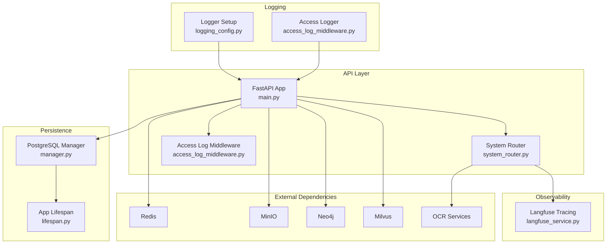
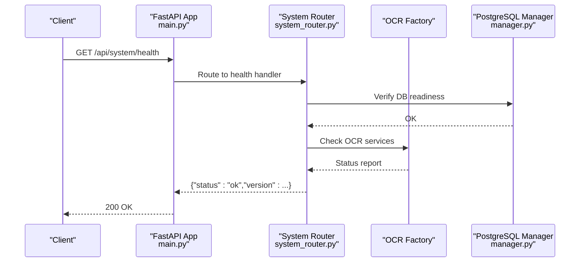
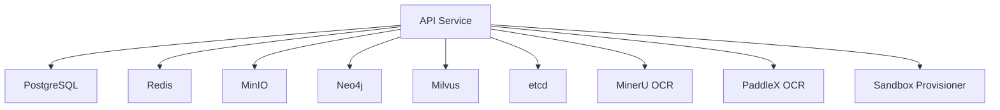

# Monitoring & Logging

<cite>
**Referenced Files in This Document**
- [logging_config.py](file://backend/package/yuxi/utils/logging_config.py)
- [access_log_middleware.py](file://backend/server/utils/access_log_middleware.py)
- [main.py](file://backend/server/main.py)
- [system_router.py](file://backend/server/routers/system_router.py)
- [manager.py](file://backend/package/yuxi/storage/postgres/manager.py)
- [lifespan.py](file://backend/server/utils/lifespan.py)
- [chat.py](file://backend/package/yuxi/models/chat.py)
- [docker-compose.prod.yml](file://docker-compose.prod.yml)
- [docker-compose.yml](file://docker-compose.yml)
- [app.py](file://backend/package/yuxi/config/app.py)
- [info.template.yaml](file://backend/package/yuxi/config/static/info.template.yaml)
- [langfuse_service.py](file://backend/package/yuxi/services/langfuse_service.py)
</cite>

## Table of Contents
1. [Introduction](#introduction)
2. [Project Structure](#project-structure)
3. [Core Components](#core-components)
4. [Architecture Overview](#architecture-overview)
5. [Detailed Component Analysis](#detailed-component-analysis)
6. [Dependency Analysis](#dependency-analysis)
7. [Performance Considerations](#performance-considerations)
8. [Troubleshooting Guide](#troubleshooting-guide)
9. [Conclusion](#conclusion)
10. [Appendices](#appendices)

## Introduction
This document provides comprehensive monitoring and logging guidance for production deployments. It covers health checks across services (API, database, external dependencies), centralized logging architecture with rotation and retention, metrics collection strategies, alerting mechanisms, dashboard setup, log analysis techniques, observability integrations, and security/compliance considerations.

## Project Structure
The monitoring and logging implementation spans:
- Centralized logging configuration and access logs middleware
- Health check endpoints for system, OCR, and chat model providers
- Database connectivity and lifecycle management
- Docker Compose health checks for all dependent services
- Optional Langfuse tracing integration

**Diagram sources**
- [main.py:1-150](file://backend/server/main.py#L1-L150)
- [system_router.py:1-320](file://backend/server/routers/system_router.py#L1-L320)
- [access_log_middleware.py:1-68](file://backend/server/utils/access_log_middleware.py#L1-L68)
- [logging_config.py:1-99](file://backend/package/yuxi/utils/logging_config.py#L1-L99)
- [manager.py:1-291](file://backend/package/yuxi/storage/postgres/manager.py#L1-L291)
- [lifespan.py:1-89](file://backend/server/utils/lifespan.py#L1-L89)
- [docker-compose.prod.yml:1-373](file://docker-compose.prod.yml#L1-L373)

**Section sources**
- [main.py:1-150](file://backend/server/main.py#L1-L150)
- [system_router.py:1-320](file://backend/server/routers/system_router.py#L1-L320)
- [access_log_middleware.py:1-68](file://backend/server/utils/access_log_middleware.py#L1-L68)
- [logging_config.py:1-99](file://backend/package/yuxi/utils/logging_config.py#L1-L99)
- [manager.py:1-291](file://backend/package/yuxi/storage/postgres/manager.py#L1-L291)
- [lifespan.py:1-89](file://backend/server/utils/lifespan.py#L1-L89)
- [docker-compose.prod.yml:1-373](file://docker-compose.prod.yml#L1-L373)

## Core Components
- Centralized logging with file rotation and retention, plus bridging legacy logging to modern logger
- Access log middleware capturing request duration and endpoint metadata
- Health check endpoints for system, OCR services, and chat model providers
- Database manager with connection pooling and schema migration helpers
- Docker Compose health checks for all dependent services
- Optional Langfuse tracing integration for end-to-end observability

**Section sources**
- [logging_config.py:55-99](file://backend/package/yuxi/utils/logging_config.py#L55-L99)
- [access_log_middleware.py:34-68](file://backend/server/utils/access_log_middleware.py#L34-L68)
- [system_router.py:21-223](file://backend/server/routers/system_router.py#L21-L223)
- [manager.py:28-90](file://backend/package/yuxi/storage/postgres/manager.py#L28-L90)
- [docker-compose.prod.yml:51-373](file://docker-compose.prod.yml#L51-L373)
- [langfuse_service.py:30-62](file://backend/package/yuxi/services/langfuse_service.py#L30-L62)

## Architecture Overview
The monitoring and logging architecture integrates:
- API health checks exposed under /api/system
- Access logs streamed to stdout/stderr for container log collection
- Rotating application logs stored on disk with retention
- Docker health checks ensuring dependent services are ready before API starts
- Optional tracing via Langfuse for request-scoped traces

**Diagram sources**
- [system_router.py:21-25](file://backend/server/routers/system_router.py#L21-L25)
- [manager.py:258-269](file://backend/package/yuxi/storage/postgres/manager.py#L258-L269)

## Detailed Component Analysis

### Centralized Logging
- File logging with daily rotation (10 MB) and 30-day retention, compressed archives
- Console logging with timestamps and colored formatting
- Bridge for third-party libraries (e.g., LightRAG, httpx, openai, neo4j, urllib3) to capture noisy logs at WARNING level
- Root logger initialized early in application startup

Implementation highlights:
- Rotation and retention policy defined in logger setup
- Bridge attaches to selected third-party loggers and normalizes levels
- Save directory configurable via environment variable

Operational guidance:
- Mount persistent volume for saves/logs to preserve rotated archives
- Monitor disk usage and adjust rotation/retention based on log volume
- Use structured parsing for log aggregation platforms

**Section sources**
- [logging_config.py:55-99](file://backend/package/yuxi/utils/logging_config.py#L55-L99)
- [logging_config.py:33-53](file://backend/package/yuxi/utils/logging_config.py#L33-L53)
- [logging_config.py:92-99](file://backend/package/yuxi/utils/logging_config.py#L92-L99)

### Access Logs
- Dedicated access logger separate from application logs
- Captures client IP, method, path, query, HTTP version, status code, and response time (ms)
- Emits to stdout/stderr for container log collection

Implementation highlights:
- Extracts X-Forwarded-For or request client host
- Uses high-resolution timer for accurate latency measurement
- Prevents propagation to avoid duplicate logs

Operational guidance:
- Aggregate stdout/stderr logs via container orchestrator or sidecar collector
- Index by status code and path for anomaly detection
- Consider sampling high-volume endpoints if needed

**Section sources**
- [access_log_middleware.py:34-68](file://backend/server/utils/access_log_middleware.py#L34-L68)

### Health Checks
- Public system health endpoint returns service status and version
- OCR health endpoint aggregates health across OCR services
- Chat model status endpoints test connectivity to external providers
- Docker Compose health checks ensure dependent services are healthy before API starts

Implementation highlights:
- System health: lightweight, returns ok and version
- OCR health: async orchestration via factory, overall status derived from individual services
- Chat model status: selects provider, sends minimal test request, returns availability
- Docker health checks: curl-based probes for API and service readiness

Operational guidance:
- Expose health endpoints to load balancers and orchestrators
- Use OCR and model status endpoints for automated remediation
- Combine Docker health checks with external monitoring for comprehensive coverage

**Section sources**
- [system_router.py:21-25](file://backend/server/routers/system_router.py#L21-L25)
- [system_router.py:152-191](file://backend/server/routers/system_router.py#L152-L191)
- [system_router.py:198-223](file://backend/server/routers/system_router.py#L198-L223)
- [chat.py:143-198](file://backend/package/yuxi/models/chat.py#L143-L198)
- [docker-compose.prod.yml:51-373](file://docker-compose.prod.yml#L51-L373)

### Database Connectivity and Lifecycle
- Asynchronous SQLAlchemy engine with connection pooling and pre-ping
- Dedicated connection pool for LangGraph checkpointing with autocommit
- Schema migration helpers for knowledge and business tables
- Lifespan hooks initialize services and verify/checkpoint tables

Implementation highlights:
- Engine configured with JSON serializer/deserializer and recycle settings
- LangGraph pool specialized for checkpointing requirements
- Lifespan ensures DB readiness and table setup before serving requests

Operational guidance:
- Monitor pool utilization and adjust max_size based on concurrency
- Use pre-ping to handle stale connections after network interruptions
- Track schema migration steps in logs for rollback scenarios

**Section sources**
- [manager.py:28-90](file://backend/package/yuxi/storage/postgres/manager.py#L28-L90)
- [manager.py:119-222](file://backend/package/yuxi/storage/postgres/manager.py#L119-L222)
- [lifespan.py:17-89](file://backend/server/utils/lifespan.py#L17-L89)

### Observability Integration (Langfuse)
- Optional tracing integration controlled by environment variables
- Builds trace metadata and tags for downstream correlation
- Provides async trace URL retrieval to avoid blocking critical path
- Flushes events at shutdown or on demand

Implementation highlights:
- Environment gating for enabling/disabling
- Caching of client instance
- Safe fallbacks when dependencies are missing

Operational guidance:
- Enable only when credentials are present
- Use trace metadata to join logs, traces, and metrics
- Defer trace URL resolution to background tasks

**Section sources**
- [langfuse_service.py:30-62](file://backend/package/yuxi/services/langfuse_service.py#L30-L62)
- [langfuse_service.py:109-142](file://backend/package/yuxi/services/langfuse_service.py#L109-L142)
- [langfuse_service.py:172-211](file://backend/package/yuxi/services/langfuse_service.py#L172-L211)

### Configuration and Branding
- Application configuration supports dynamic loading and persistence
- System info configuration (branding, actions, footer) loaded asynchronously
- Environment-driven toggles for features and providers

Operational guidance:
- Store sensitive keys in environment variables
- Use TOML for user-modified settings to minimize diffs
- Keep branding files in sync with frontend assets

**Section sources**
- [app.py:127-171](file://backend/package/yuxi/config/app.py#L127-L171)
- [system_router.py:101-144](file://backend/server/routers/system_router.py#L101-L144)
- [info.template.yaml:1-62](file://backend/package/yuxi/config/static/info.template.yaml#L1-L62)

## Dependency Analysis
The system relies on several external dependencies whose health is monitored via Docker Compose health checks:
- PostgreSQL, Redis, MinIO, Neo4j, Milvus, etcd, OCR services (MinerU, PaddleX), and sandbox provisioner

**Diagram sources**
- [docker-compose.prod.yml:29-373](file://docker-compose.prod.yml#L29-L373)

**Section sources**
- [docker-compose.prod.yml:29-373](file://docker-compose.prod.yml#L29-L373)

## Performance Considerations
- Logging overhead: moderate due to buffered writes and asynchronous file handling; rotation and compression reduce I/O spikes
- Access logs: low overhead; ensure container log drivers support high throughput
- Database pools: tune max_size and recycle based on workload; pre-ping improves resilience
- OCR and model status checks: lightweight; cache results if frequent polling is required
- Langfuse: avoid fetching trace URLs synchronously on hot paths; defer to background tasks

[No sources needed since this section provides general guidance]

## Troubleshooting Guide
Common issues and resolutions:
- API fails to start due to missing environment variables:
  - Ensure database URL and other service endpoints are set
  - Check Docker Compose environment blocks and secrets
- Database connectivity errors:
  - Verify pool settings and pre-ping configuration
  - Confirm dependent services are healthy via Docker health checks
- Excessive noise in logs:
  - Adjust third-party logger levels in the bridge configuration
  - Filter by level in log aggregation pipeline
- Health check flakiness:
  - Increase retries and timeouts in Docker health checks
  - Use system endpoints to probe readiness before traffic switching
- Langfuse tracing disabled unexpectedly:
  - Confirm environment variables and credentials are present
  - Check client initialization warnings in logs

**Section sources**
- [manager.py:40-90](file://backend/package/yuxi/storage/postgres/manager.py#L40-L90)
- [logging_config.py:33-53](file://backend/package/yuxi/utils/logging_config.py#L33-L53)
- [docker-compose.prod.yml:51-373](file://docker-compose.prod.yml#L51-L373)
- [langfuse_service.py:49-62](file://backend/package/yuxi/services/langfuse_service.py#L49-L62)

## Conclusion
The system provides a robust foundation for production monitoring and logging:
- Health checks span internal services and external dependencies
- Centralized logging with rotation and retention, plus access logs for request telemetry
- Optional tracing integration for end-to-end observability
- Docker health checks ensure readiness before traffic admission

Adopt the operational guidance to tailor rotation/retention, configure log aggregation, and integrate alerting and dashboards aligned with your platform.

[No sources needed since this section summarizes without analyzing specific files]

## Appendices

### Health Check Endpoints Reference
- GET /api/system/health: Public system health and version
- GET /api/system/ocr/health: Aggregate OCR service health
- GET /api/system/chat-models/status: Single model status
- GET /api/system/chat-models/all/status: All models status

**Section sources**
- [system_router.py:21-25](file://backend/server/routers/system_router.py#L21-L25)
- [system_router.py:152-191](file://backend/server/routers/system_router.py#L152-L191)
- [system_router.py:198-223](file://backend/server/routers/system_router.py#L198-L223)

### Logging Configuration Reference
- Log file location: SAVE_DIR/logs with daily rotation (10 MB) and 30-day retention
- Console output: colored, timestamped, and enqueued for thread safety
- Third-party logger bridge: captures and normalizes logs from LightRAG, httpx, openai, neo4j, urllib3

**Section sources**
- [logging_config.py:55-99](file://backend/package/yuxi/utils/logging_config.py#L55-L99)
- [logging_config.py:33-53](file://backend/package/yuxi/utils/logging_config.py#L33-L53)

### Docker Health Checks Reference
- API service: curl-based health check against /api/system/health
- OCR services: MinerU and PaddleX health endpoints
- Databases: PostgreSQL pg_isready, Redis ping, MinIO live endpoint, etcd health, Milvus healthz

**Section sources**
- [docker-compose.prod.yml:51-373](file://docker-compose.prod.yml#L51-L373)
- [docker-compose.yml:69-436](file://docker-compose.yml#L69-L436)