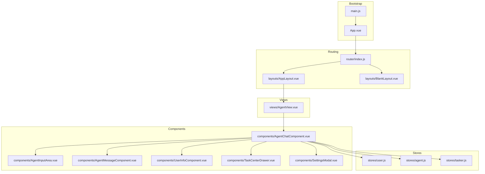
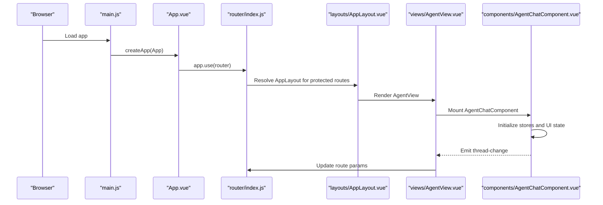
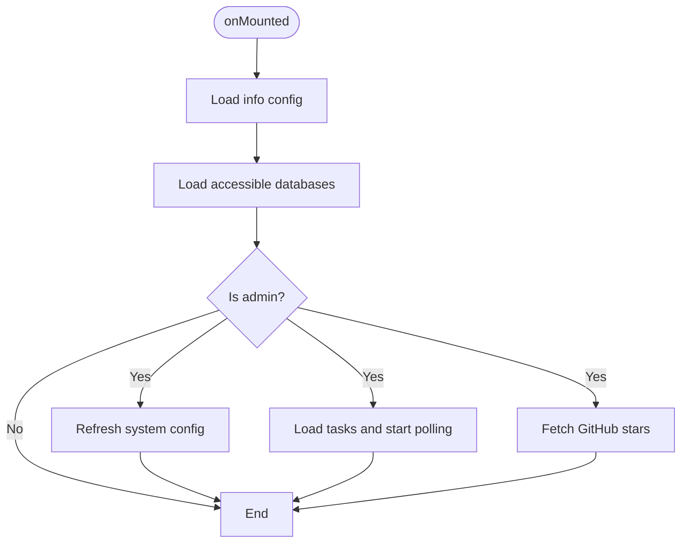
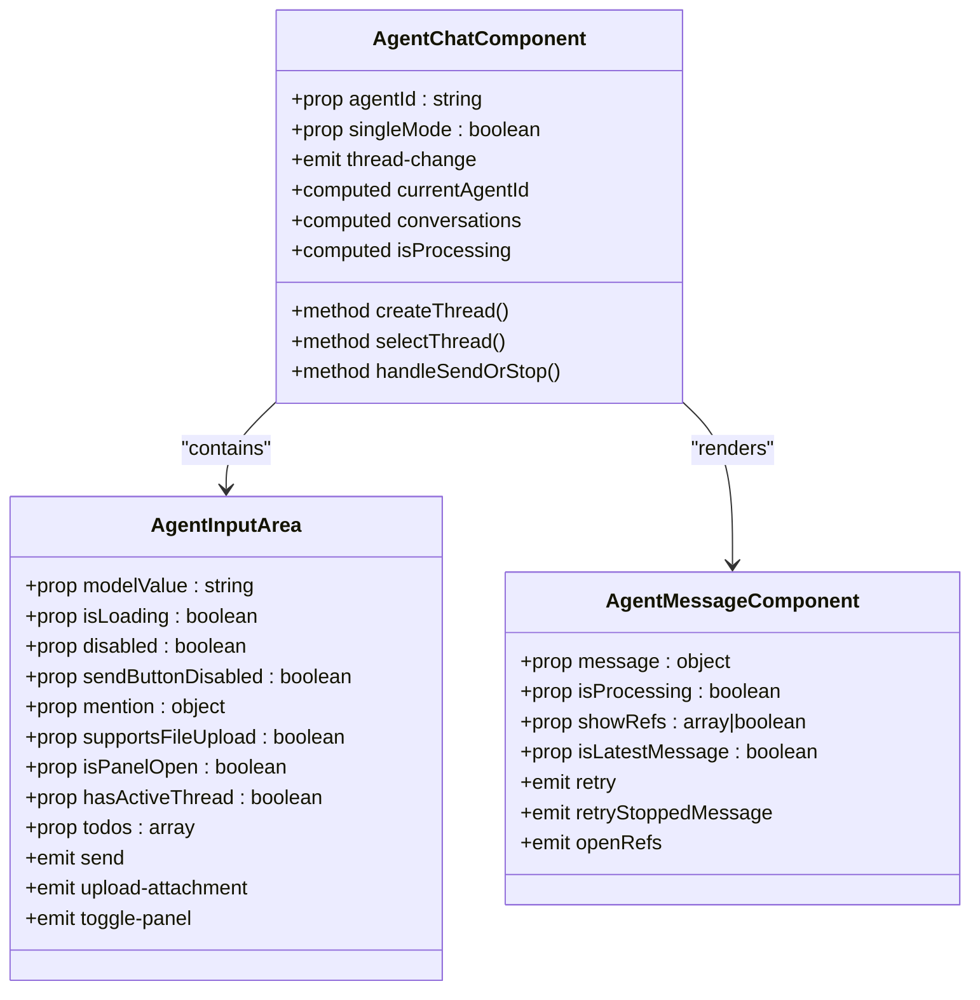
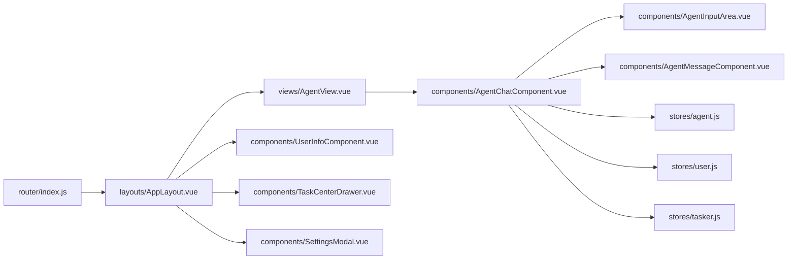

# Component Architecture

<cite>
**Referenced Files in This Document**
- [App.vue](file://web/src/App.vue)
- [main.js](file://web/src/main.js)
- [AppLayout.vue](file://web/src/layouts/AppLayout.vue)
- [BlankLayout.vue](file://web/src/layouts/BlankLayout.vue)
- [index.js](file://web/src/router/index.js)
- [AgentChatComponent.vue](file://web/src/components/AgentChatComponent.vue)
- [AgentInputArea.vue](file://web/src/components/AgentInputArea.vue)
- [AgentMessageComponent.vue](file://web/src/components/AgentMessageComponent.vue)
- [UserInfoComponent.vue](file://web/src/components/UserInfoComponent.vue)
- [TaskCenterDrawer.vue](file://web/src/components/TaskCenterDrawer.vue)
- [SettingsModal.vue](file://web/src/components/SettingsModal.vue)
- [AgentView.vue](file://web/src/views/AgentView.vue)
- [agent.js](file://web/src/stores/agent.js)
- [user.js](file://web/src/stores/user.js)
- [tasker.js](file://web/src/stores/tasker.js)
</cite>

## Table of Contents
1. [Introduction](#introduction)
2. [Project Structure](#project-structure)
3. [Core Components](#core-components)
4. [Architecture Overview](#architecture-overview)
5. [Detailed Component Analysis](#detailed-component-analysis)
6. [Dependency Analysis](#dependency-analysis)
7. [Performance Considerations](#performance-considerations)
8. [Troubleshooting Guide](#troubleshooting-guide)
9. [Conclusion](#conclusion)

## Introduction
This document explains the Vue.js component architecture used in the project, focusing on how Ant Design Vue components and custom components work together. It describes the layout system built around AppLayout and BlankLayout, component composition patterns, prop interfaces, event handling, modular reusable components, and integration patterns. Practical usage examples, slot configurations, and guidelines for building custom components are included, along with lifecycle management, performance optimization techniques, and best practices for reusability.

## Project Structure
The frontend is organized around a Vue 3 + Pinia + Ant Design Vue stack. The application bootstraps in main.js, mounts the root App.vue, and renders pages via vue-router. Layouts wrap views to provide consistent navigation and shared UI affordances. Stores encapsulate cross-cutting concerns like user, agent, and tasker state.

**Diagram sources**
- [main.js:1-26](file://web/src/main.js#L1-L26)
- [App.vue:1-23](file://web/src/App.vue#L1-L23)
- [index.js:1-200](file://web/src/router/index.js#L1-L200)
- [AppLayout.vue:1-545](file://web/src/layouts/AppLayout.vue#L1-L545)
- [BlankLayout.vue:1-10](file://web/src/layouts/BlankLayout.vue#L1-L10)
- [AgentView.vue:1-384](file://web/src/views/AgentView.vue#L1-L384)
- [AgentChatComponent.vue:1-800](file://web/src/components/AgentChatComponent.vue#L1-L800)
- [AgentInputArea.vue:1-445](file://web/src/components/AgentInputArea.vue#L1-L445)
- [AgentMessageComponent.vue:1-793](file://web/src/components/AgentMessageComponent.vue#L1-L793)
- [UserInfoComponent.vue:1-658](file://web/src/components/UserInfoComponent.vue#L1-L658)
- [TaskCenterDrawer.vue:1-630](file://web/src/components/TaskCenterDrawer.vue#L1-L630)
- [SettingsModal.vue:1-536](file://web/src/components/SettingsModal.vue#L1-L536)
- [agent.js:1-567](file://web/src/stores/agent.js#L1-L567)
- [user.js:1-404](file://web/src/stores/user.js#L1-L404)
- [tasker.js:1-230](file://web/src/stores/tasker.js#L1-L230)

**Section sources**
- [main.js:1-26](file://web/src/main.js#L1-L26)
- [App.vue:1-23](file://web/src/App.vue#L1-L23)
- [index.js:1-200](file://web/src/router/index.js#L1-L200)

## Core Components
- AppLayout: Provides the primary application shell with navigation, header actions, and routed content area. It initializes shared data and exposes a settings modal provider to child components.
- BlankLayout: Minimal layout wrapper for login/home pages; keeps routing simple and avoids unnecessary UI overhead.
- AgentChatComponent: Central chat container composing sidebar, message list, input area, agent panel, and artifacts card. Manages conversation state, streaming, and UI transitions.
- AgentInputArea: Reusable input component with attachments, image previews, todo popover, and action slots. Emits send events and forwards keydown handlers.
- AgentMessageComponent: Renders human/assistant/system messages, supports markdown preview, tool call rendering, reasoning panels, and references.
- UserInfoComponent: Dropdown user menu with role-aware actions, profile modal, theme toggle, and debug access.
- TaskCenterDrawer: Right-side drawer for admin users to monitor and manage background tasks with filtering, progress, and actions.
- SettingsModal: Multi-tab settings dialog for admins/super-admins covering base settings, model providers, user/department management, and API keys.

**Section sources**
- [AppLayout.vue:1-545](file://web/src/layouts/AppLayout.vue#L1-L545)
- [BlankLayout.vue:1-10](file://web/src/layouts/BlankLayout.vue#L1-L10)
- [AgentChatComponent.vue:1-800](file://web/src/components/AgentChatComponent.vue#L1-L800)
- [AgentInputArea.vue:1-445](file://web/src/components/AgentInputArea.vue#L1-L445)
- [AgentMessageComponent.vue:1-793](file://web/src/components/AgentMessageComponent.vue#L1-L793)
- [UserInfoComponent.vue:1-658](file://web/src/components/UserInfoComponent.vue#L1-L658)
- [TaskCenterDrawer.vue:1-630](file://web/src/components/TaskCenterDrawer.vue#L1-L630)
- [SettingsModal.vue:1-536](file://web/src/components/SettingsModal.vue#L1-L536)

## Architecture Overview
The architecture follows a layered pattern:
- Bootstrap: main.js registers Pinia, router, and Ant Design Vue plugin; App.vue wraps the app with theme configuration and global stores initialization.
- Routing: router/index.js defines nested routes with AppLayout and BlankLayout as page shells. Guards enforce authentication and role checks.
- Layouts: AppLayout wires user/admin-specific UI, pulls in shared components (user info, task center, settings), and hosts router-view with keep-alive.
- Views: AgentView orchestrates AgentChatComponent and related UI, synchronizes route params to thread selection, and manages share/feedback actions.
- Components: Compose smaller, focused components with clear props/events and leverage Pinia stores for state.
- Stores: user.js, agent.js, tasker.js encapsulate domain logic and persistence.

**Diagram sources**
- [main.js:1-26](file://web/src/main.js#L1-L26)
- [App.vue:1-23](file://web/src/App.vue#L1-L23)
- [index.js:125-197](file://web/src/router/index.js#L125-L197)
- [AppLayout.vue:1-545](file://web/src/layouts/AppLayout.vue#L1-L545)
- [AgentView.vue:148-172](file://web/src/views/AgentView.vue#L148-L172)
- [AgentChatComponent.vue:270-276](file://web/src/components/AgentChatComponent.vue#L270-L276)

## Detailed Component Analysis

### AppLayout
- Responsibilities:
  - Hosts the main navigation bar with dynamic items based on user roles and environment flags.
  - Initializes organization info, database lists, and admin-only config on mount.
  - Exposes a settings modal provider to child components via provide/inject.
  - Renders router-view with keep-alive for cached views and conditionally shows task center drawer and settings modal.
- Key behaviors:
  - Conditional rendering of admin-only sections (graph, database, extensions, dashboard).
  - GitHub star count fetching and display.
  - Task center badge counts and drawer open/close integration.
- Integration:
  - Consumes stores: config, database, info, tasker, user.
  - Uses Ant Design Vue components for tooltips, badges, modals, drawers.

**Diagram sources**
- [AppLayout.vue:82-93](file://web/src/layouts/AppLayout.vue#L82-L93)

**Section sources**
- [AppLayout.vue:1-545](file://web/src/layouts/AppLayout.vue#L1-L545)

### BlankLayout
- Purpose: Minimal layout for non-protected routes (home/login).
- Behavior: Wraps router-view with keep-alive to cache views.

**Section sources**
- [BlankLayout.vue:1-10](file://web/src/layouts/BlankLayout.vue#L1-L10)

### AgentChatComponent
- Composition:
  - Chat sidebar, header with slots, message list, input area, agent panel, artifacts card, and approval modal.
  - Integrates with stores: agent, chatUI, info, user, config.
- Props and Events:
  - Props: agentId (String), singleMode (Boolean).
  - Emits: thread-change.
- Key patterns:
  - Computed derived state for current agent, threads, messages, and panel visibility.
  - Streaming smoother integration and thread lifecycle management.
  - Example questions from agent metadata, segmented agent selection, and file support detection.
- Slots:
  - Header left/right, input-actions-left extra.

**Diagram sources**
- [AgentChatComponent.vue:270-276](file://web/src/components/AgentChatComponent.vue#L270-L276)
- [AgentInputArea.vue:120-141](file://web/src/components/AgentInputArea.vue#L120-L141)
- [AgentMessageComponent.vue:124-155](file://web/src/components/AgentMessageComponent.vue#L124-L155)

**Section sources**
- [AgentChatComponent.vue:1-800](file://web/src/components/AgentChatComponent.vue#L1-L800)
- [AgentInputArea.vue:1-445](file://web/src/components/AgentInputArea.vue#L1-L445)
- [AgentMessageComponent.vue:1-793](file://web/src/components/AgentMessageComponent.vue#L1-L793)

### AgentInputArea
- Purpose: Encapsulates message input with optional image preview, attachment options, todo popover, and action slots.
- Props:
  - modelValue, isLoading, disabled, sendButtonDisabled, mention, supportsFileUpload, isPanelOpen, hasActiveThread, todos.
- Events:
  - update:modelValue, send, keydown, upload-attachment, toggle-panel.
- UX features:
  - Enter-to-send with shift modifier handling.
  - Popover for todo progress and status.
  - Exposed focus/close methods for parent orchestration.

**Section sources**
- [AgentInputArea.vue:1-445](file://web/src/components/AgentInputArea.vue#L1-L445)

### AgentMessageComponent
- Rendering:
  - Human/assistant/system variants with copy button for human messages.
  - Markdown preview via md-editor-v3 with theme switching.
  - Tool call rendering via ToolCallRenderer.
  - Reasoning panel with collapsible UI.
  - Error hints and retry prompts.
- Props:
  - message, isProcessing, customClasses, showRefs, isLatestMessage.
- Events:
  - retry, retryStoppedMessage, openRefs.

**Section sources**
- [AgentMessageComponent.vue:1-793](file://web/src/components/AgentMessageComponent.vue#L1-L793)

### UserInfoComponent
- Features:
  - Role-aware dropdown menu with docs, theme toggle, debug panel, settings, and logout.
  - Profile modal with avatar upload and editable fields.
  - Injects settings modal handler from AppLayout provider.
- Props:
  - showRole (Boolean), showButton (Boolean).

**Section sources**
- [UserInfoComponent.vue:1-658](file://web/src/components/UserInfoComponent.vue#L1-L658)
- [AppLayout.vue:152-155](file://web/src/layouts/AppLayout.vue#L152-L155)

### TaskCenterDrawer
- Purpose: Admin-only task monitoring drawer with filtering, progress bars, and actions (cancel/delete).
- Store integration:
  - Uses tasker store for tasks, counts, and polling.
- UX:
  - Segmented filter controls, progress indicators, and status badges.
  - Modal detail view per task.

**Section sources**
- [TaskCenterDrawer.vue:1-630](file://web/src/components/TaskCenterDrawer.vue#L1-L630)
- [tasker.js:1-230](file://web/src/stores/tasker.js#L1-L230)

### SettingsModal
- Tabs:
  - Base settings (admin), model providers (super admin), user management (admin), department management (super admin), API key (logged-in).
- Behavior:
  - Responsive desktop/mobile navigation.
  - Star card dismissal persisted in localStorage.
  - Controlled via v-model:visible and emits close.

**Section sources**
- [SettingsModal.vue:1-536](file://web/src/components/SettingsModal.vue#L1-L536)

### AgentView
- Orchestration:
  - Wires AgentChatComponent, config sidebar, feedback modal, and more menu.
  - Synchronizes route params to thread selection and emits thread-change to update URLs.
- Actions:
  - Share chat exports HTML via ChatExporter.
  - Opens feedback modal.

**Section sources**
- [AgentView.vue:1-384](file://web/src/views/AgentView.vue#L1-L384)

## Dependency Analysis
- Router guards depend on user store to enforce authentication and role checks, and to initialize agent store when needed.
- AppLayout depends on multiple stores for configuration, database lists, info, tasker, and user.
- AgentChatComponent composes AgentInputArea and AgentMessageComponent and integrates with agent, chatUI, info, user, and config stores.
- UserInfoComponent consumes user store and injects settings handler from AppLayout.
- TaskCenterDrawer and SettingsModal are admin-focused and rely on user store permissions.

**Diagram sources**
- [index.js:125-197](file://web/src/router/index.js#L125-L197)
- [AppLayout.vue:1-545](file://web/src/layouts/AppLayout.vue#L1-L545)
- [AgentView.vue:1-384](file://web/src/views/AgentView.vue#L1-L384)
- [AgentChatComponent.vue:1-800](file://web/src/components/AgentChatComponent.vue#L1-L800)
- [agent.js:1-567](file://web/src/stores/agent.js#L1-L567)
- [user.js:1-404](file://web/src/stores/user.js#L1-L404)
- [tasker.js:1-230](file://web/src/stores/tasker.js#L1-L230)

**Section sources**
- [index.js:125-197](file://web/src/router/index.js#L125-L197)
- [AppLayout.vue:1-545](file://web/src/layouts/AppLayout.vue#L1-L545)
- [AgentChatComponent.vue:1-800](file://web/src/components/AgentChatComponent.vue#L1-L800)

## Performance Considerations
- Keep-alive caching:
  - AppLayout and BlankLayout wrap router-view with keep-alive to reduce re-renders for frequently visited pages.
- Streaming and smoothing:
  - AgentChatComponent uses a stream smoother to stabilize UI during partial message updates.
- Resize and scroll observers:
  - Chat container attaches a ResizeObserver and scroll controller to adapt UI and maintain scroll positions efficiently.
- Store persistence:
  - Agent store persists selected agent and config selections to localStorage to avoid re-fetching on reload.
- Conditional rendering:
  - Admin-only features (task center, settings tabs) are gated to prevent unnecessary computations and DOM for non-admins.

[No sources needed since this section provides general guidance]

## Troubleshooting Guide
- Authentication and routing:
  - Router guards redirect unauthenticated users to login and enforce admin/super-admin access for specific routes. On token errors, user store clears state and redirects to login.
- Initialization failures:
  - AppLayout logs warnings when remote config or database loads fail; ensure backend endpoints are reachable.
  - Agent store catches and displays errors during initialization and config loading.
- UI state resets:
  - On logout, user store resets agent store to ensure clean state on next login.
- Task center drawer:
  - Drawer starts polling on open and stops on close; errors are surfaced via alerts.

**Section sources**
- [index.js:125-197](file://web/src/router/index.js#L125-L197)
- [AppLayout.vue:50-65](file://web/src/layouts/AppLayout.vue#L50-L65)
- [agent.js:169-175](file://web/src/stores/agent.js#L169-L175)
- [user.js:72-90](file://web/src/stores/user.js#L72-L90)
- [tasker.js:180-194](file://web/src/stores/tasker.js#L180-L194)

## Conclusion
The component architecture leverages Ant Design Vue for robust UI primitives while maintaining a highly modular set of custom components. AppLayout and BlankLayout provide consistent shell experiences, routing enforces security and UX policies, and stores centralize cross-cutting concerns. Composition patterns emphasize clear props/events, slot-based customization, and store-driven state, enabling scalable reuse and maintainability.