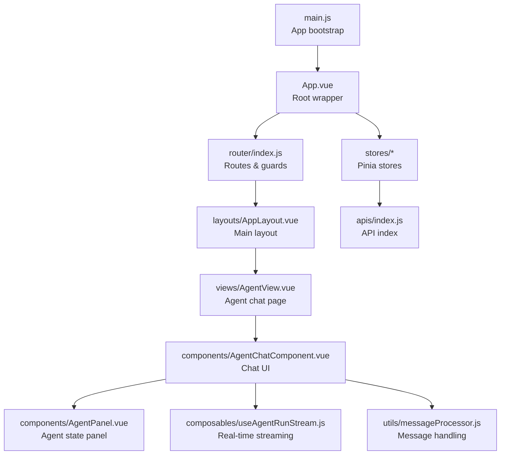
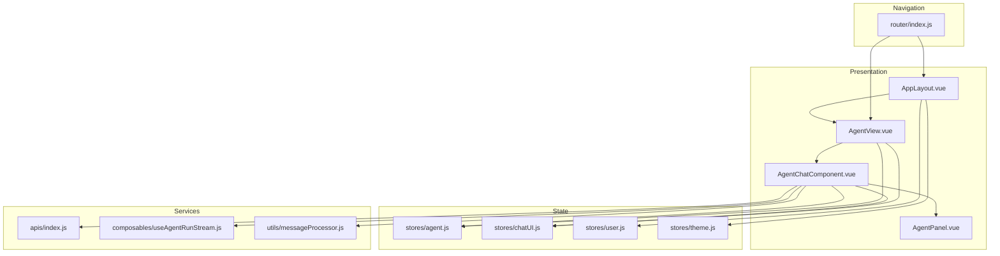
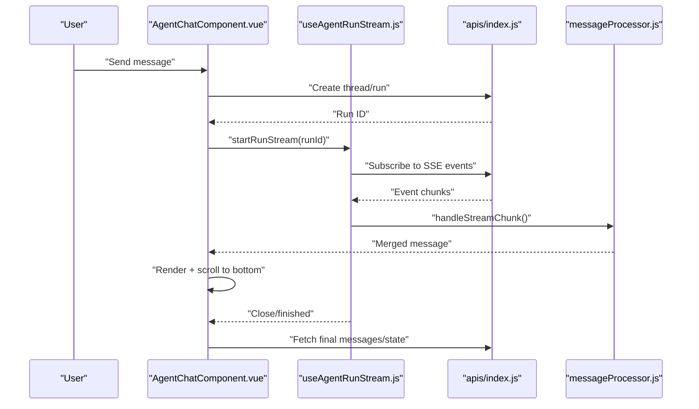
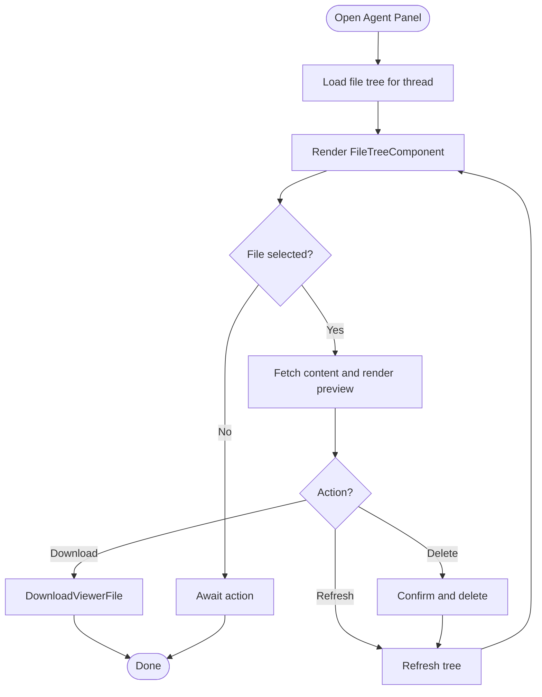
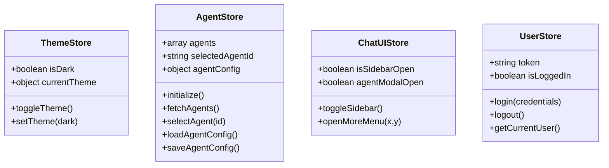
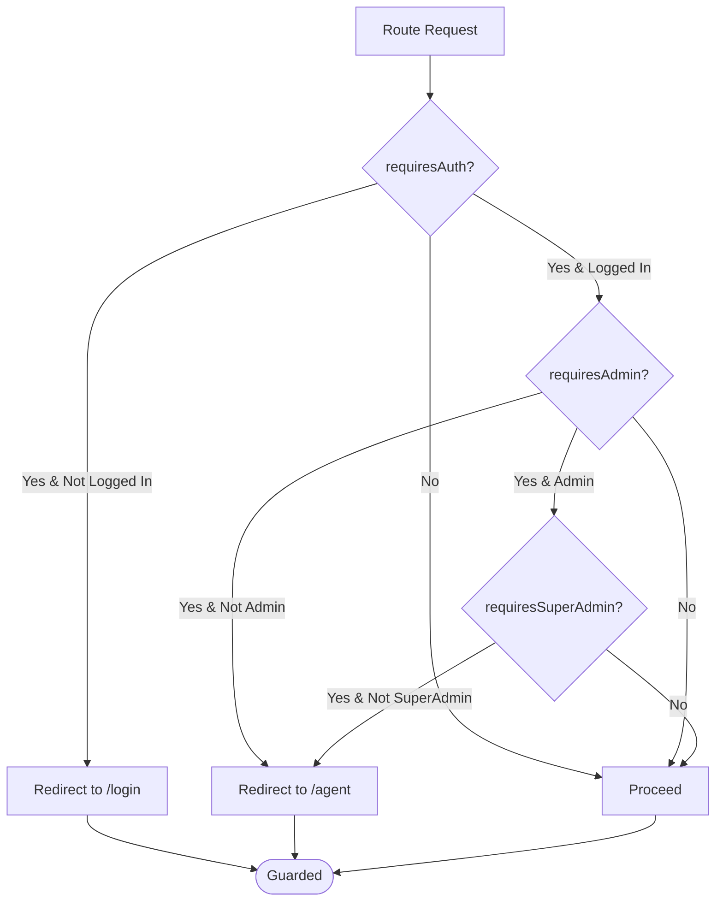
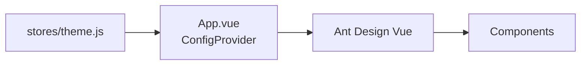
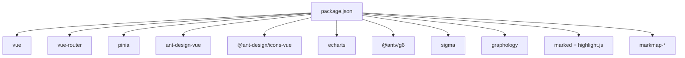

# Frontend Application

<cite>
**Referenced Files in This Document**
- [main.js](file://web/src/main.js)
- [App.vue](file://web/src/App.vue)
- [index.js](file://web/src/router/index.js)
- [theme.js](file://web/src/stores/theme.js)
- [agent.js](file://web/src/stores/agent.js)
- [chatUI.js](file://web/src/stores/chatUI.js)
- [user.js](file://web/src/stores/user.js)
- [AgentChatComponent.vue](file://web/src/components/AgentChatComponent.vue)
- [AgentPanel.vue](file://web/src/components/AgentPanel.vue)
- [useAgentRunStream.js](file://web/src/composables/useAgentRunStream.js)
- [messageProcessor.js](file://web/src/utils/messageProcessor.js)
- [index.js](file://web/src/apis/index.js)
- [AgentView.vue](file://web/src/views/AgentView.vue)
- [AppLayout.vue](file://web/src/layouts/AppLayout.vue)
- [package.json](file://web/package.json)
</cite>

## Table of Contents
1. [Introduction](#introduction)
2. [Project Structure](#project-structure)
3. [Core Components](#core-components)
4. [Architecture Overview](#architecture-overview)
5. [Detailed Component Analysis](#detailed-component-analysis)
6. [Dependency Analysis](#dependency-analysis)
7. [Performance Considerations](#performance-considerations)
8. [Troubleshooting Guide](#troubleshooting-guide)
9. [Conclusion](#conclusion)
10. [Appendices](#appendices)

## Introduction
This document describes the Vue.js frontend application built with modern patterns and Ant Design Vue. It covers component architecture, state management via Pinia stores, routing and navigation, the chat interface, dashboard components, file management features, UI design system and theming, real-time communication and streaming, component composition and events, and practical integration guidance with backend APIs. Accessibility and responsive design considerations are addressed throughout.

## Project Structure
The frontend is organized around a Vue 3 application with:
- Application bootstrap and plugin registration
- Centralized state via Pinia stores
- Routing with guards and nested layouts
- Component-driven UI with Ant Design Vue
- Utilities for message processing and streams
- API module index for backend integration

**Diagram sources**
- [main.js:1-26](file://web/src/main.js#L1-L26)
- [App.vue:1-23](file://web/src/App.vue#L1-L23)
- [index.js:1-200](file://web/src/router/index.js#L1-L200)
- [AgentView.vue:1-384](file://web/src/views/AgentView.vue#L1-L384)
- [AgentChatComponent.vue:1-800](file://web/src/components/AgentChatComponent.vue#L1-L800)
- [AgentPanel.vue:1-800](file://web/src/components/AgentPanel.vue#L1-L800)
- [useAgentRunStream.js:1-349](file://web/src/composables/useAgentRunStream.js#L1-L349)
- [messageProcessor.js:1-491](file://web/src/utils/messageProcessor.js#L1-L491)
- [index.js:1-58](file://web/src/apis/index.js#L1-L58)

**Section sources**
- [main.js:1-26](file://web/src/main.js#L1-L26)
- [App.vue:1-23](file://web/src/App.vue#L1-L23)
- [index.js:1-200](file://web/src/router/index.js#L1-L200)

## Core Components
- Application bootstrap initializes Vue, Pinia, Vue Router, and Ant Design Vue, then preloads configuration.
- Root wrapper applies Ant Design’s ConfigProvider with locale and theme configuration.
- Router defines nested layouts, protected routes, and global navigation guards.
- Stores encapsulate domain logic: theme, agent configuration, chat UI state, and user authentication.
- Chat UI composes the AgentChatComponent with sidebar, input area, and agent panel.
- AgentPanel integrates file system tree, inline preview, and actions for agent artifacts.
- Streaming composables manage SSE-based runs and smooth rendering.
- MessageProcessor normalizes server-side messages and merges tool results.

**Section sources**
- [main.js:1-26](file://web/src/main.js#L1-L26)
- [App.vue:1-23](file://web/src/App.vue#L1-L23)
- [theme.js:1-66](file://web/src/stores/theme.js#L1-L66)
- [agent.js:1-567](file://web/src/stores/agent.js#L1-L567)
- [chatUI.js:1-82](file://web/src/stores/chatUI.js#L1-L82)
- [user.js:1-404](file://web/src/stores/user.js#L1-L404)
- [AgentChatComponent.vue:1-800](file://web/src/components/AgentChatComponent.vue#L1-L800)
- [AgentPanel.vue:1-800](file://web/src/components/AgentPanel.vue#L1-L800)
- [useAgentRunStream.js:1-349](file://web/src/composables/useAgentRunStream.js#L1-L349)
- [messageProcessor.js:1-491](file://web/src/utils/messageProcessor.js#L1-L491)

## Architecture Overview
The application follows a layered architecture:
- Presentation layer: Vue components and layouts
- State layer: Pinia stores for agent, UI, user, and theme
- Services layer: API modules and composables for streams and message processing
- Navigation layer: Vue Router with guards and nested layouts

**Diagram sources**
- [AppLayout.vue:1-545](file://web/src/layouts/AppLayout.vue#L1-L545)
- [AgentView.vue:1-384](file://web/src/views/AgentView.vue#L1-L384)
- [AgentChatComponent.vue:1-800](file://web/src/components/AgentChatComponent.vue#L1-L800)
- [AgentPanel.vue:1-800](file://web/src/components/AgentPanel.vue#L1-L800)
- [agent.js:1-567](file://web/src/stores/agent.js#L1-L567)
- [chatUI.js:1-82](file://web/src/stores/chatUI.js#L1-L82)
- [user.js:1-404](file://web/src/stores/user.js#L1-L404)
- [theme.js:1-66](file://web/src/stores/theme.js#L1-L66)
- [index.js:1-58](file://web/src/apis/index.js#L1-L58)
- [useAgentRunStream.js:1-349](file://web/src/composables/useAgentRunStream.js#L1-L349)
- [messageProcessor.js:1-491](file://web/src/utils/messageProcessor.js#L1-L491)
- [index.js:1-200](file://web/src/router/index.js#L1-L200)

## Detailed Component Analysis

### Chat Interface and Real-Time Streaming
The chat interface is centered around AgentChatComponent, which orchestrates:
- Sidebar for thread management and agent selection
- Main chat area with message rendering and “generating” indicators
- Input area with attachment support and agent panel integration
- Agent panel for file system and artifact inspection
- Real-time streaming via useAgentRunStream and messageProcessor

**Diagram sources**
- [AgentChatComponent.vue:1-800](file://web/src/components/AgentChatComponent.vue#L1-L800)
- [useAgentRunStream.js:1-349](file://web/src/composables/useAgentRunStream.js#L1-L349)
- [messageProcessor.js:1-491](file://web/src/utils/messageProcessor.js#L1-L491)
- [index.js:1-58](file://web/src/apis/index.js#L1-L58)

**Section sources**
- [AgentChatComponent.vue:1-800](file://web/src/components/AgentChatComponent.vue#L1-L800)
- [useAgentRunStream.js:1-349](file://web/src/composables/useAgentRunStream.js#L1-L349)
- [messageProcessor.js:1-491](file://web/src/utils/messageProcessor.js#L1-L491)

### Agent Panel and File Management
AgentPanel renders a file system tree with:
- Dynamic loading of directory entries
- Inline preview or modal preview depending on available width
- Actions to download, delete, and refresh
- Integration with viewer_filesystem API

**Diagram sources**
- [AgentPanel.vue:1-800](file://web/src/components/AgentPanel.vue#L1-L800)
- [index.js:1-58](file://web/src/apis/index.js#L1-L58)

**Section sources**
- [AgentPanel.vue:1-800](file://web/src/components/AgentPanel.vue#L1-L800)

### State Management with Pinia
Stores encapsulate:
- Theme: persistent theme switching and document class toggling
- Agent: agent lists, configurations, mentions, and initialization
- Chat UI: sidebar visibility, menus, and modal states
- User: authentication, roles, and profile operations

**Diagram sources**
- [theme.js:1-66](file://web/src/stores/theme.js#L1-L66)
- [agent.js:1-567](file://web/src/stores/agent.js#L1-L567)
- [chatUI.js:1-82](file://web/src/stores/chatUI.js#L1-L82)
- [user.js:1-404](file://web/src/stores/user.js#L1-L404)

**Section sources**
- [theme.js:1-66](file://web/src/stores/theme.js#L1-L66)
- [agent.js:1-567](file://web/src/stores/agent.js#L1-L567)
- [chatUI.js:1-82](file://web/src/stores/chatUI.js#L1-L82)
- [user.js:1-404](file://web/src/stores/user.js#L1-L404)

### Routing and Navigation
The router defines nested layouts and guards:
- AppLayout wraps admin-only pages
- AgentView handles thread routing and export
- Global beforeEach checks auth, admin/super-admin permissions, and redirects accordingly

**Diagram sources**
- [index.js:1-200](file://web/src/router/index.js#L1-L200)
- [AppLayout.vue:1-545](file://web/src/layouts/AppLayout.vue#L1-L545)
- [AgentView.vue:1-384](file://web/src/views/AgentView.vue#L1-L384)

**Section sources**
- [index.js:1-200](file://web/src/router/index.js#L1-L200)
- [AppLayout.vue:1-545](file://web/src/layouts/AppLayout.vue#L1-L545)
- [AgentView.vue:1-384](file://web/src/views/AgentView.vue#L1-L384)

### UI Component Library, Design System, and Theming
- Ant Design Vue is globally installed with a reset stylesheet and theme provider.
- Theme store defines a common token and toggles dark mode, persisting preference and updating document class.
- App.vue wraps the app with ConfigProvider to apply locale and theme.

**Diagram sources**
- [theme.js:1-66](file://web/src/stores/theme.js#L1-L66)
- [App.vue:1-23](file://web/src/App.vue#L1-L23)

**Section sources**
- [theme.js:1-66](file://web/src/stores/theme.js#L1-L66)
- [App.vue:1-23](file://web/src/App.vue#L1-L23)

### Dashboard Components
- AppLayout exposes navigation items for admin/super-admin, including Dashboard.
- DashboardView would be rendered under the AppLayout shell; AgentView demonstrates configuration sidebar and export features.

**Section sources**
- [AppLayout.vue:1-545](file://web/src/layouts/AppLayout.vue#L1-L545)
- [AgentView.vue:1-384](file://web/src/views/AgentView.vue#L1-L384)

### API Integration Patterns
- apis/index.js exports modular API modules and helper functions for admin/super-admin scopes.
- Components import specific API modules and call them directly; Pinia stores centralize fetching and caching.

**Section sources**
- [index.js:1-58](file://web/src/apis/index.js#L1-L58)

## Dependency Analysis
External dependencies include Vue 3, Vue Router, Pinia, Ant Design Vue, and various libraries for charts, markdown, and graph visualization.

**Diagram sources**
- [package.json:1-51](file://web/package.json#L1-L51)

**Section sources**
- [package.json:1-51](file://web/package.json#L1-L51)

## Performance Considerations
- Keep-alive routing: AppLayout conditionally caches views based on route meta.
- Stream smoothing: useStreamSmoother buffers and flushes during SSE events to reduce re-renders.
- Lazy loading: Route components are dynamically imported.
- Local persistence: Pinia persisted state minimizes repeated fetches on reload.
- Resize observers and pointer capture: Used in AgentPanel and Chat for efficient UI updates.

[No sources needed since this section provides general guidance]

## Troubleshooting Guide
Common areas to inspect:
- Authentication and permissions: user store methods and router guards
- Streaming interruptions: run snapshot persistence and automatic resume
- Message merging errors: ensure tool results and AI messages are properly aligned
- File preview failures: verify viewer_filesystem API responses and blob handling

**Section sources**
- [user.js:1-404](file://web/src/stores/user.js#L1-L404)
- [index.js:1-200](file://web/src/router/index.js#L1-L200)
- [useAgentRunStream.js:1-349](file://web/src/composables/useAgentRunStream.js#L1-L349)
- [messageProcessor.js:1-491](file://web/src/utils/messageProcessor.js#L1-L491)
- [AgentPanel.vue:1-800](file://web/src/components/AgentPanel.vue#L1-L800)

## Conclusion
The frontend leverages Vue 3, Pinia, and Ant Design Vue to deliver a robust, extensible interface. Real-time streaming, structured state management, and modular APIs enable scalable chat experiences, while thoughtful theming and responsive layouts improve usability. The architecture supports future enhancements such as additional agent types, expanded file operations, and richer dashboard integrations.

## Appendices

### Practical Examples and Customization
- Customize theme tokens in the theme store and apply via ConfigProvider.
- Extend AgentChatComponent by adding slots and props for specialized inputs.
- Integrate new tools by registering them in the agent store and updating mention resources.
- Add new routes by extending router/index.js and protecting them with meta flags.

[No sources needed since this section provides general guidance]