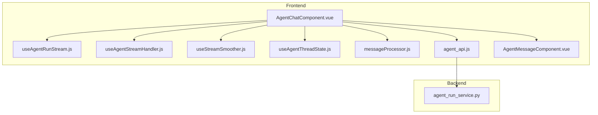
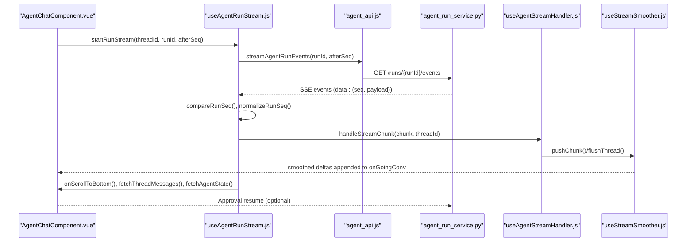
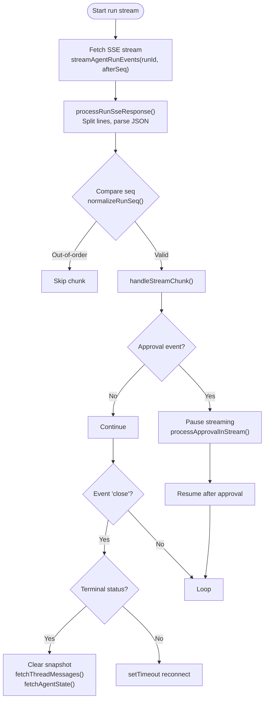
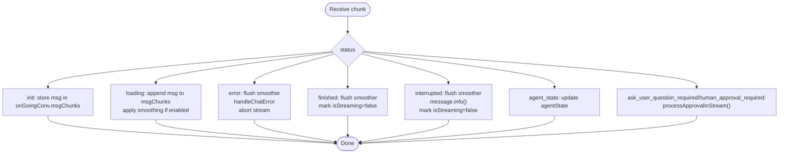
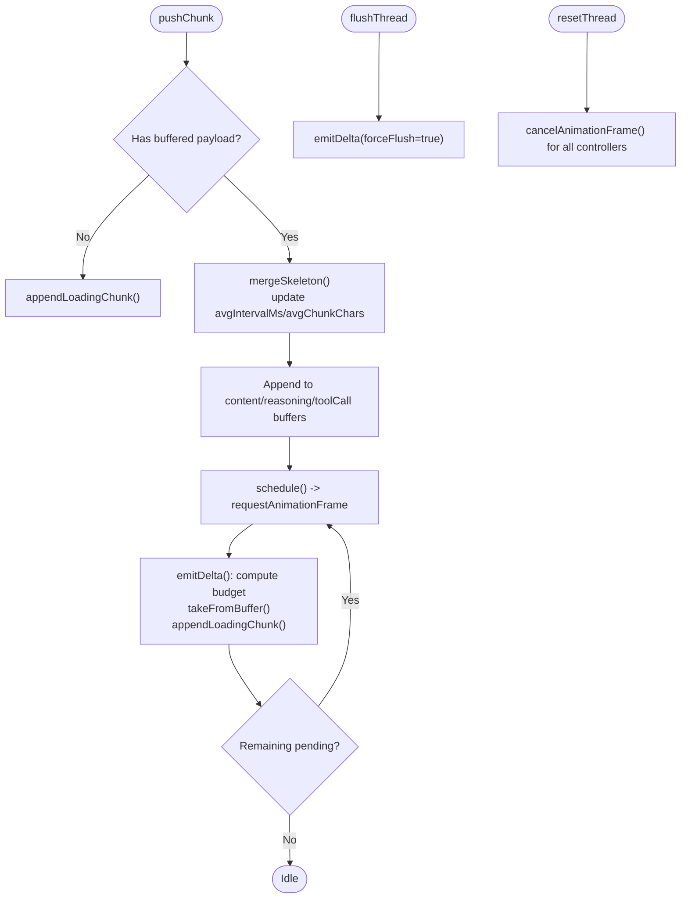
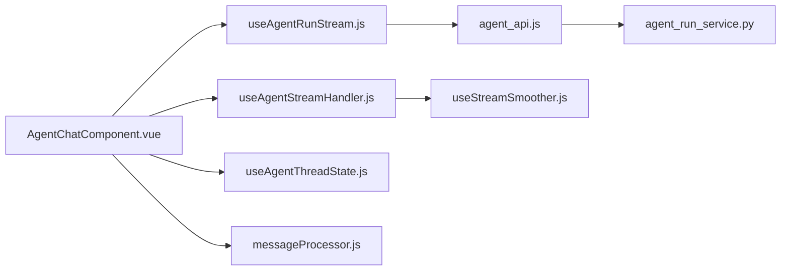

# Real-time Communication

<cite>
**Referenced Files in This Document**
- [useAgentRunStream.js](file://web/src/composables/useAgentRunStream.js)
- [useAgentStreamHandler.js](file://web/src/composables/useAgentStreamHandler.js)
- [useStreamSmoother.js](file://web/src/composables/useStreamSmoother.js)
- [useAgentThreadState.js](file://web/src/composables/useAgentThreadState.js)
- [messageProcessor.js](file://web/src/utils/messageProcessor.js)
- [errorHandler.js](file://web/src/utils/errorHandler.js)
- [agent_api.js](file://web/src/apis/agent_api.js)
- [AgentChatComponent.vue](file://web/src/components/AgentChatComponent.vue)
- [AgentMessageComponent.vue](file://web/src/components/AgentMessageComponent.vue)
- [agent_run_service.py](file://backend/package/yuxi/services/agent_run_service.py)
</cite>

## Table of Contents
1. [Introduction](#introduction)
2. [Project Structure](#project-structure)
3. [Core Components](#core-components)
4. [Architecture Overview](#architecture-overview)
5. [Detailed Component Analysis](#detailed-component-analysis)
6. [Dependency Analysis](#dependency-analysis)
7. [Performance Considerations](#performance-considerations)
8. [Troubleshooting Guide](#troubleshooting-guide)
9. [Conclusion](#conclusion)

## Introduction
This document explains the real-time communication patterns and stream processing in the application, focusing on agent streaming via two composables: useAgentRunStream and useAgentStreamHandler. It covers WebSocket/SSE connections, real-time data updates, event handling, message processing pipelines, stream smoothing, interruption handling, and integration with backend streaming APIs. It also documents connection management, error handling, retry mechanisms, and performance optimizations for real-time features, along with client-side state synchronization.

## Project Structure
The real-time streaming spans three layers:
- Frontend composables and utilities: manage SSE connections, stream parsing, smoothing, and thread state.
- Frontend components: render messages, handle approvals, and orchestrate streaming lifecycle.
- Backend services: produce SSE streams for agent runs and handle interruptions.

**Diagram sources**
- [AgentChatComponent.vue:239-346](file://web/src/components/AgentChatComponent.vue#L239-L346)
- [useAgentRunStream.js:118-348](file://web/src/composables/useAgentRunStream.js#L118-L348)
- [useAgentStreamHandler.js:65-235](file://web/src/composables/useAgentStreamHandler.js#L65-L235)
- [useStreamSmoother.js:232-435](file://web/src/composables/useStreamSmoother.js#L232-L435)
- [useAgentThreadState.js:8-101](file://web/src/composables/useAgentThreadState.js#L8-L101)
- [messageProcessor.js:1-491](file://web/src/utils/messageProcessor.js#L1-L491)
- [agent_api.js:22-243](file://web/src/apis/agent_api.js#L22-L243)
- [agent_run_service.py:152-203](file://backend/package/yuxi/services/agent_run_service.py#L152-L203)

**Section sources**
- [AgentChatComponent.vue:239-346](file://web/src/components/AgentChatComponent.vue#L239-L346)
- [agent_api.js:22-243](file://web/src/apis/agent_api.js#L22-L243)
- [agent_run_service.py:152-203](file://backend/package/yuxi/services/agent_run_service.py#L152-L203)

## Core Components
- useAgentRunStream: Manages SSE connections for agent runs, handles sequence ordering, retryable errors, approvals, and terminal run states.
- useAgentStreamHandler: Processes generic streaming responses, applies stream smoothing, and manages agent state updates.
- useStreamSmoother: Implements adaptive chunk emission to smooth real-time text rendering with pacing and buffering.
- useAgentThreadState: Centralizes per-thread state including streaming flags, abort controllers, ongoing message buffers, and agent state.
- messageProcessor: Converts server history to UI-friendly messages, merges chunks, and extracts sources.
- agent_api: Provides client-side APIs for SSE run events and other chat operations.
- agent_run_service: Produces SSE events for agent runs, handles heartbeat, error events, and terminal states.

**Section sources**
- [useAgentRunStream.js:118-348](file://web/src/composables/useAgentRunStream.js#L118-L348)
- [useAgentStreamHandler.js:65-235](file://web/src/composables/useAgentStreamHandler.js#L65-L235)
- [useStreamSmoother.js:232-435](file://web/src/composables/useStreamSmoother.js#L232-L435)
- [useAgentThreadState.js:8-101](file://web/src/composables/useAgentThreadState.js#L8-L101)
- [messageProcessor.js:1-491](file://web/src/utils/messageProcessor.js#L1-L491)
- [agent_api.js:22-243](file://web/src/apis/agent_api.js#L22-L243)
- [agent_run_service.py:152-203](file://backend/package/yuxi/services/agent_run_service.py#L152-L203)

## Architecture Overview
The real-time architecture uses Server-Sent Events (SSE) for agent run streaming. The frontend establishes an SSE connection, parses events, applies smoothing, and updates UI state. Approval events pause streaming until user input is received. Terminal run statuses trigger cleanup and history refresh.

**Diagram sources**
- [useAgentRunStream.js:168-300](file://web/src/composables/useAgentRunStream.js#L168-L300)
- [agent_api.js:229-242](file://web/src/apis/agent_api.js#L229-L242)
- [agent_run_service.py:152-203](file://backend/package/yuxi/services/agent_run_service.py#L152-L203)
- [useAgentStreamHandler.js:79-200](file://web/src/composables/useAgentStreamHandler.js#L79-L200)
- [useStreamSmoother.js:337-393](file://web/src/composables/useStreamSmoother.js#L337-L393)

## Detailed Component Analysis

### useAgentRunStream: Run Streaming and Event Handling
Responsibilities:
- Establishes SSE connection to backend run events endpoint.
- Validates and orders sequence numbers to prevent duplicates.
- Handles retryable errors by tracking job_try to avoid redundant retries.
- Routes approval events to approval handler and pauses streaming until resolved.
- On terminal run statuses, clears snapshots, fetches history, and resets state.
- Implements automatic reconnection with exponential backoff-like delays.

Key behaviors:
- Sequence normalization and comparison support both legacy numeric and stream-formatted sequences.
- Heartbeat events are ignored; close events trigger cleanup and optional resumption.
- Retryable errors are logged and skipped if already seen for the same job_try.
- Approval statuses are detected from both event names and chunk status.

**Diagram sources**
- [useAgentRunStream.js:59-116](file://web/src/composables/useAgentRunStream.js#L59-L116)
- [useAgentRunStream.js:168-300](file://web/src/composables/useAgentRunStream.js#L168-L300)

**Section sources**
- [useAgentRunStream.js:118-348](file://web/src/composables/useAgentRunStream.js#L118-L348)

### useAgentStreamHandler: Generic Stream Processing and Smoothing
Responsibilities:
- Parses generic streaming responses line-by-line and emits parsed chunks.
- Applies stream smoothing for loading messages when smoothing is enabled.
- Manages agent state updates and termination conditions (finished, error, interrupted).
- Handles approval-required events by delegating to approval handler.

Processing logic:
- Status-driven branching: init, loading, error, finished, interrupted, agent_state, ask_user_question_required, human_approval_required.
- For non-loading statuses, logs chunk status for visibility.
- On finished/interrupted/error/approval, marks streaming as stopped and flushes smoother.

**Diagram sources**
- [useAgentStreamHandler.js:79-200](file://web/src/composables/useAgentStreamHandler.js#L79-L200)

**Section sources**
- [useAgentStreamHandler.js:65-235](file://web/src/composables/useAgentStreamHandler.js#L65-L235)

### useStreamSmoother: Adaptive Text Smoothing
Responsibilities:
- Buffers incremental content by message id and tool call indices.
- Computes pacing based on moving averages of observed intervals and chunk sizes.
- Emits chunks at controlled rates to avoid UI thrashing while maintaining responsiveness.
- Flushes buffers on finish or explicit flush to render remaining content.

Key mechanics:
- Controllers track average interval and chunk character counts with exponential moving averages.
- Dynamic reserve sizing balances latency and throughput.
- requestAnimationFrame-based scheduling ensures smooth rendering.

**Diagram sources**
- [useStreamSmoother.js:337-393](file://web/src/composables/useStreamSmoother.js#L337-L393)
- [useStreamSmoother.js:247-328](file://web/src/composables/useStreamSmoother.js#L247-L328)

**Section sources**
- [useStreamSmoother.js:232-435](file://web/src/composables/useStreamSmoother.js#L232-L435)

### useAgentThreadState: Per-Thread State Management
Responsibilities:
- Creates and maintains per-thread state: streaming flags, abort controllers, run tracking, ongoing message buffers, and agent state.
- Provides helpers to stop or reset streams and clean up thread state.
- Integrates with smoother and thread cleanup hooks.

**Section sources**
- [useAgentThreadState.js:8-101](file://web/src/composables/useAgentThreadState.js#L8-L101)

### messageProcessor: History and Chunk Processing
Responsibilities:
- Converts server-side histories into UI conversations.
- Merges message chunks into complete messages.
- Extracts knowledge chunks and web sources from tool results.
- Processes streaming chunks for older non-run flows.

**Section sources**
- [messageProcessor.js:1-491](file://web/src/utils/messageProcessor.js#L1-L491)

### agent_api: SSE and Chat APIs
Responsibilities:
- Exposes streamAgentRunEvents for SSE run event consumption.
- Provides other chat endpoints for messages, threads, and agent state.

**Section sources**
- [agent_api.js:229-242](file://web/src/apis/agent_api.js#L229-L242)

### agent_run_service: Backend SSE Producer
Responsibilities:
- Normalizes after_seq and yields SSE events.
- Emits heartbeat events periodically and close events on completion.
- Emits error events for transient failures and closes the stream.
- Lists run stream events from storage with limits.

**Section sources**
- [agent_run_service.py:152-203](file://backend/package/yuxi/services/agent_run_service.py#L152-L203)

## Dependency Analysis
The streaming stack exhibits clear separation of concerns:
- AgentChatComponent orchestrates lifecycle, approval handling, and UI updates.
- useAgentRunStream depends on agent_api and delegates chunk handling to useAgentStreamHandler.
- useAgentStreamHandler depends on useStreamSmoother for smoothing and useAgentThreadState for state.
- messageProcessor is used by AgentChatComponent to render historical messages.
- agent_run_service produces SSE events consumed by useAgentRunStream.

**Diagram sources**
- [AgentChatComponent.vue:239-346](file://web/src/components/AgentChatComponent.vue#L239-L346)
- [useAgentRunStream.js:118-348](file://web/src/composables/useAgentRunStream.js#L118-L348)
- [useAgentStreamHandler.js:65-235](file://web/src/composables/useAgentStreamHandler.js#L65-L235)
- [useStreamSmoother.js:232-435](file://web/src/composables/useStreamSmoother.js#L232-L435)
- [useAgentThreadState.js:8-101](file://web/src/composables/useAgentThreadState.js#L8-L101)
- [messageProcessor.js:1-491](file://web/src/utils/messageProcessor.js#L1-L491)
- [agent_api.js:22-243](file://web/src/apis/agent_api.js#L22-L243)
- [agent_run_service.py:152-203](file://backend/package/yuxi/services/agent_run_service.py#L152-L203)

**Section sources**
- [AgentChatComponent.vue:239-346](file://web/src/components/AgentChatComponent.vue#L239-L346)
- [useAgentRunStream.js:118-348](file://web/src/composables/useAgentRunStream.js#L118-L348)
- [useAgentStreamHandler.js:65-235](file://web/src/composables/useAgentStreamHandler.js#L65-L235)
- [useStreamSmoother.js:232-435](file://web/src/composables/useStreamSmoother.js#L232-L435)
- [useAgentThreadState.js:8-101](file://web/src/composables/useAgentThreadState.js#L8-L101)
- [messageProcessor.js:1-491](file://web/src/utils/messageProcessor.js#L1-L491)
- [agent_api.js:22-243](file://web/src/apis/agent_api.js#L22-L243)
- [agent_run_service.py:152-203](file://backend/package/yuxi/services/agent_run_service.py#L152-L203)

## Performance Considerations
- Adaptive pacing: useStreamSmoother computes pacing dynamically using exponential moving averages of observed intervals and chunk sizes, preventing UI overload.
- Reserve sizing: dynamic reserves balance latency and throughput; overflow boosts increase emission rate to drain backlog.
- Frame scheduling: requestAnimationFrame-based scheduling ensures smooth rendering and efficient CPU usage.
- Minimal DOM updates: smoothing batches content and tool call args, reducing reflows.
- Connection reuse and snapshots: useAgentRunStream persists last sequence and run id to resume efficiently after interruptions.
- Backpressure handling: retryable error detection prevents redundant retries and reduces load.

[No sources needed since this section provides general guidance]

## Troubleshooting Guide
Common issues and resolutions:
- SSE connection fails or disconnects:
  - The composables automatically retry after a short delay; check network connectivity and backend availability.
  - Inspect console warnings for “Failed to parse run SSE data” indicating malformed payloads.
- Duplicate or out-of-order chunks:
  - Sequence comparison prevents rendering duplicates; ensure after_seq is correctly tracked and stored.
- Retryable errors:
  - The system logs retryable errors and waits for worker retries; avoid manual restarts during the same job_try.
- Approval required:
  - When approval events occur, streaming pauses. Complete the approval flow to resume.
- Interrupted or error states:
  - UI displays interruption messages; check backend logs for root causes.
- Smoothing anomalies:
  - If content appears delayed, verify smoother options and ensure flushThread is called on terminal events.

**Section sources**
- [useAgentRunStream.js:190-299](file://web/src/composables/useAgentRunStream.js#L190-L299)
- [useAgentStreamHandler.js:103-116](file://web/src/composables/useAgentStreamHandler.js#L103-L116)
- [errorHandler.js:88-101](file://web/src/utils/errorHandler.js#L88-L101)

## Conclusion
The real-time communication system combines robust SSE streaming, adaptive smoothing, and resilient state management to deliver responsive agent interactions. The composables encapsulate complexity around sequencing, approvals, and retries, while the backend ensures reliable event delivery. Together, they provide a scalable foundation for real-time chat, agent responses, and file-related state synchronization.