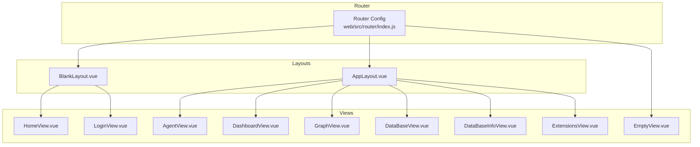
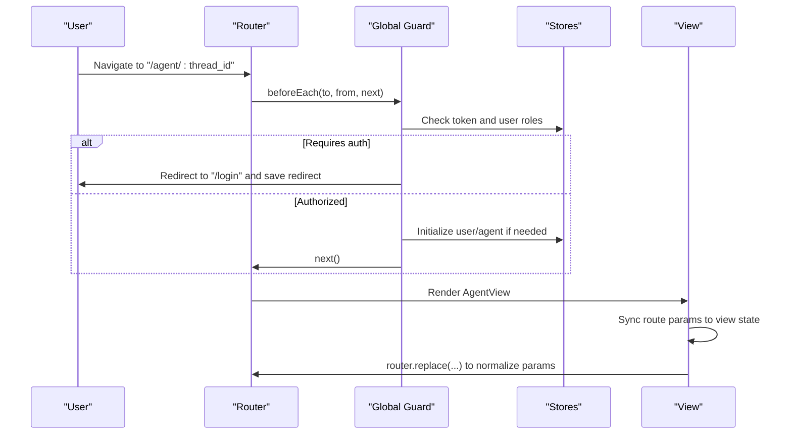
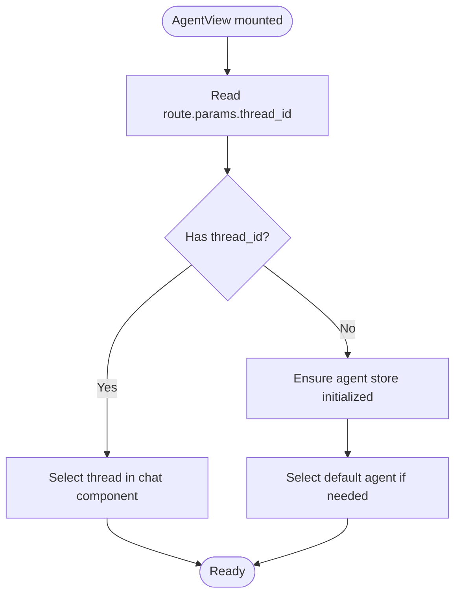
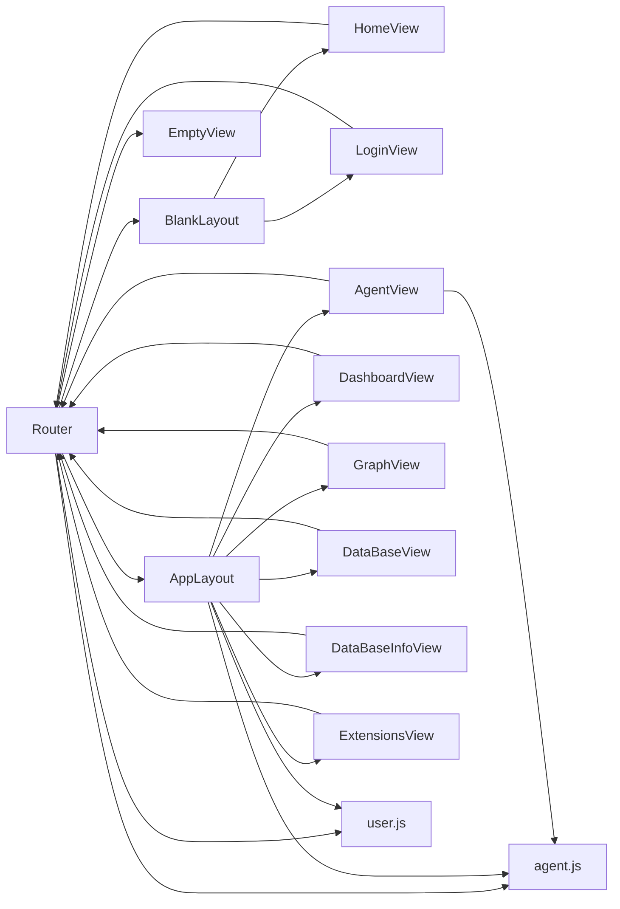

# Routing System

<cite>
**Referenced Files in This Document**
- [index.js](file://web/src/router/index.js)
- [AppLayout.vue](file://web/src/layouts/AppLayout.vue)
- [BlankLayout.vue](file://web/src/layouts/BlankLayout.vue)
- [AgentView.vue](file://web/src/views/AgentView.vue)
- [DashboardView.vue](file://web/src/views/DashboardView.vue)
- [HomeView.vue](file://web/src/views/HomeView.vue)
- [LoginView.vue](file://web/src/views/LoginView.vue)
- [DataBaseView.vue](file://web/src/views/DataBaseView.vue)
- [DataBaseInfoView.vue](file://web/src/views/DataBaseInfoView.vue)
- [ExtensionsView.vue](file://web/src/views/ExtensionsView.vue)
- [GraphView.vue](file://web/src/views/GraphView.vue)
- [EmptyView.vue](file://web/src/views/EmptyView.vue)
- [user.js](file://web/src/stores/user.js)
- [agent.js](file://web/src/stores/agent.js)
</cite>

## Table of Contents
1. [Introduction](#introduction)
2. [Project Structure](#project-structure)
3. [Core Components](#core-components)
4. [Architecture Overview](#architecture-overview)
5. [Detailed Component Analysis](#detailed-component-analysis)
6. [Dependency Analysis](#dependency-analysis)
7. [Performance Considerations](#performance-considerations)
8. [Troubleshooting Guide](#troubleshooting-guide)
9. [Conclusion](#conclusion)

## Introduction
This document explains the Vue Router configuration and navigation system used in the frontend application. It covers all routes, including AgentView, DashboardView, HomeView, LoginView, and other view components. It also documents route guards, navigation patterns, parameter handling, nested routes, dynamic route generation, programmatic navigation, route meta fields, authentication-based routing, route transitions, and navigation optimization techniques.

## Project Structure
The routing system is configured centrally and composed with layout components and view components:
- Router configuration defines routes, nested layouts, guards, and redirects.
- Layout components provide shared UI scaffolding and navigation menus.
- View components encapsulate page-specific logic and navigation patterns.

**Diagram sources**
- [index.js:1-200](file://web/src/router/index.js#L1-L200)
- [BlankLayout.vue:1-10](file://web/src/layouts/BlankLayout.vue#L1-L10)
- [AppLayout.vue:1-545](file://web/src/layouts/AppLayout.vue#L1-L545)
- [HomeView.vue:1-800](file://web/src/views/HomeView.vue#L1-L800)
- [LoginView.vue:1-942](file://web/src/views/LoginView.vue#L1-L942)
- [AgentView.vue:1-384](file://web/src/views/AgentView.vue#L1-L384)
- [DashboardView.vue:1-470](file://web/src/views/DashboardView.vue#L1-L470)
- [GraphView.vue:1-786](file://web/src/views/GraphView.vue#L1-L786)
- [DataBaseView.vue:1-859](file://web/src/views/DataBaseView.vue#L1-L859)
- [DataBaseInfoView.vue:1-820](file://web/src/views/DataBaseInfoView.vue#L1-L820)
- [ExtensionsView.vue:1-311](file://web/src/views/ExtensionsView.vue#L1-L311)
- [EmptyView.vue:1-30](file://web/src/views/EmptyView.vue#L1-L30)

**Section sources**
- [index.js:1-200](file://web/src/router/index.js#L1-L200)
- [BlankLayout.vue:1-10](file://web/src/layouts/BlankLayout.vue#L1-L10)
- [AppLayout.vue:1-545](file://web/src/layouts/AppLayout.vue#L1-L545)

## Core Components
- Router configuration: Defines routes, nested layouts, redirects, and global navigation guards.
- Global navigation guards: Enforce authentication and role-based access, manage session redirection, and handle user initialization.
- Layouts: Provide shared navigation and keep-alive behavior per route.
- Views: Implement route-specific logic, parameter handling, and programmatic navigation.

Key responsibilities:
- Authentication enforcement via route meta and global guards.
- Role-based access control (admin, super admin).
- Dynamic route parameters and query string handling.
- Programmatic navigation and route transitions.

**Section sources**
- [index.js:1-200](file://web/src/router/index.js#L1-L200)
- [user.js:1-404](file://web/src/stores/user.js#L1-L404)
- [agent.js:1-567](file://web/src/stores/agent.js#L1-L567)

## Architecture Overview
The routing architecture combines:
- Nested routes under AppLayout and BlankLayout.
- Global beforeEach guard for authentication and role checks.
- Route meta flags for keep-alive and permission requirements.
- Programmatic navigation within views and stores.

**Diagram sources**
- [index.js:125-197](file://web/src/router/index.js#L125-L197)
- [AgentView.vue:115-172](file://web/src/views/AgentView.vue#L115-L172)
- [user.js:1-404](file://web/src/stores/user.js#L1-L404)
- [agent.js:1-567](file://web/src/stores/agent.js#L1-L567)

## Detailed Component Analysis

### Router Configuration and Guards
- Routes:
  - "/" -> BlankLayout -> HomeView (keepAlive: true, requiresAuth: false)
  - "/login" -> LoginView (requiresAuth: false)
  - "/agent" -> AppLayout -> AgentView (keepAlive: true, requiresAuth: true)
  - "/agent/:thread_id" -> AppLayout -> AgentView (keepAlive: true, requiresAuth: true)
  - "/graph" -> AppLayout -> GraphView (keepAlive: false, requiresAdmin: true)
  - "/database" -> AppLayout -> DataBaseView (keepAlive: true, requiresAdmin: true)
  - "/database/:database_id" -> AppLayout -> DataBaseInfoView (keepAlive: false, requiresAdmin: true)
  - "/dashboard" -> AppLayout -> DashboardView (keepAlive: false, requiresAdmin: true)
  - "/extensions" -> AppLayout -> ExtensionsView (keepAlive: false, requiresAdmin: true, requiresSuperAdmin: true)
  - "/skills" -> Redirect to "/extensions"
  - "Catch-all" -> EmptyView (requiresAuth: false)
- Global beforeEach guard:
  - Checks meta.requiresAuth, meta.requiresAdmin, meta.requiresSuperAdmin.
  - Loads user info if token exists but user info is missing.
  - Redirects unauthorized users to "/login" and saves intended path in sessionStorage.
  - Redirects admins/super-admins to "/agent" if insufficient privileges.
  - Prevents logged-in users from accessing "/login".
  - Normal navigation otherwise.

Examples of programmatic navigation:
- From HomeView: push("/agent") or push("/agent/:defaultId") depending on user role.
- From LoginView: push("/agent") after successful login; uses sessionStorage redirect.
- From AgentView: replace({ name: "AgentCompWithThreadId", params }) to keep history clean.

Parameter handling:
- Dynamic segment ":thread_id" in "/agent/:thread_id".
- Route params synchronized to view state; invalid threads cause router.replace to default route.
- Query string handling in ExtensionsView watches route.query.tab and sets active tab accordingly.

Route meta fields:
- keepAlive: controls keep-alive wrapping around RouterView in AppLayout.
- requiresAuth: blocks access if not authenticated.
- requiresAdmin: restricts to admin/super-admin.
- requiresSuperAdmin: restricts to super-admin.

**Section sources**
- [index.js:1-200](file://web/src/router/index.js#L1-L200)
- [HomeView.vue:358-388](file://web/src/views/HomeView.vue#L358-L388)
- [LoginView.vue:400-428](file://web/src/views/LoginView.vue#L400-L428)
- [AgentView.vue:115-172](file://web/src/views/AgentView.vue#L115-L172)
- [ExtensionsView.vue:113-122](file://web/src/views/ExtensionsView.vue#L113-L122)

### Layout Components
- BlankLayout:
  - Wraps child routes with keep-alive.
  - Used for root-level routes like HomeView and LoginView.
- AppLayout:
  - Provides sidebar navigation with icons and tooltips.
  - Renders RouterView with conditional keep-alive based on route.meta.keepAlive.
  - Admin-only sections: Graph, Database, Extensions, Dashboard.
  - Super-admin-only section: Extensions.
  - Task center drawer and settings modal integration.

Navigation patterns:
- RouterLink items generated dynamically based on user role.
- Active state determined by route.path.startsWith(item.path).

**Section sources**
- [BlankLayout.vue:1-10](file://web/src/layouts/BlankLayout.vue#L1-L10)
- [AppLayout.vue:104-150](file://web/src/layouts/AppLayout.vue#L104-L150)
- [AppLayout.vue:221-226](file://web/src/layouts/AppLayout.vue#L221-L226)

### View Components and Navigation Patterns

#### AgentView
- Purpose: Chat interface with thread selection and configuration sidebar.
- Parameter handling:
  - Reads route.params.thread_id.
  - Synchronizes thread selection to view state; invalid thread navigates back to default route.
- Programmatic navigation:
  - Uses router.replace to update route when thread changes, preserving history semantics.
- UI features:
  - Config sidebar toggle.
  - Feedback modal for admins.
  - More menu with Teleport and click-outside handling.

**Diagram sources**
- [AgentView.vue:120-146](file://web/src/views/AgentView.vue#L120-L146)
- [AgentView.vue:161-172](file://web/src/views/AgentView.vue#L161-L172)

**Section sources**
- [AgentView.vue:1-384](file://web/src/views/AgentView.vue#L1-L384)

#### DashboardView
- Purpose: Administrative dashboard with statistics and charts.
- Data loading:
  - Parallel API calls to load stats; fallback to basic stats on failure.
  - Cleanup of chart instances on unmount.
- Keep-alive:
  - Disabled via route.meta.keepAlive to avoid stale data.

**Section sources**
- [DashboardView.vue:98-133](file://web/src/views/DashboardView.vue#L98-L133)
- [DashboardView.vue:140-157](file://web/src/views/DashboardView.vue#L140-L157)

#### HomeView
- Purpose: Landing page with hero content, badges, and navigation to chat.
- Authentication-aware navigation:
  - If not logged in, sets sessionStorage redirect to "/" and navigates to "/login".
  - If admin, navigates to "/agent"; otherwise navigates to "/agent/:defaultId" or "/agent".

**Section sources**
- [HomeView.vue:358-388](file://web/src/views/HomeView.vue#L358-L388)

#### LoginView
- Purpose: Authentication and first-run initialization.
- First-run detection and initialization flow.
- Role-aware post-login navigation:
  - Initializes agent store, then navigates to "/agent".
  - Uses sessionStorage redirect if present.
- Lockout handling with countdown and error messaging.

**Section sources**
- [LoginView.vue:496-548](file://web/src/views/LoginView.vue#L496-L548)
- [LoginView.vue:400-428](file://web/src/views/LoginView.vue#L400-L428)

#### GraphView
- Purpose: Knowledge graph visualization and management.
- Navigation:
  - Programmatic navigation to "/database/:id" when switching to non-Neo4j knowledge base type.
- UI features:
  - Database selector, search, sample node loading, upload modal, export.

**Section sources**
- [GraphView.vue:594-608](file://web/src/views/GraphView.vue#L594-L608)

#### DataBaseView and DataBaseInfoView
- Purpose: Knowledge base listing and detailed management.
- Navigation:
  - Programmatic navigation to "/database/:database_id" for detail view.
- UI features:
  - New database creation modal, file upload, tabs for different sections.

**Section sources**
- [DataBaseView.vue:487-489](file://web/src/views/DataBaseView.vue#L487-L489)

#### ExtensionsView
- Purpose: Management of tools, MCP servers, subagents, and skills.
- Parameter handling:
  - Watches route.query.tab and sets active tab accordingly.

**Section sources**
- [ExtensionsView.vue:113-122](file://web/src/views/ExtensionsView.vue#L113-L122)

#### NotFound
- Purpose: Catch-all route for unknown paths.
- Behavior: Renders EmptyView with 404 messaging.

**Section sources**
- [index.js:117-121](file://web/src/router/index.js#L117-L121)
- [EmptyView.vue:1-30](file://web/src/views/EmptyView.vue#L1-L30)

## Dependency Analysis
- Router depends on:
  - Layout components for rendering.
  - Stores (user, agent) for guard logic and initialization.
- Views depend on:
  - Router for programmatic navigation.
  - Stores for data and initialization.
- Layouts depend on:
  - Stores for user info and configuration.
  - Router for navigation links and active state.

**Diagram sources**
- [index.js:1-200](file://web/src/router/index.js#L1-L200)
- [BlankLayout.vue:1-10](file://web/src/layouts/BlankLayout.vue#L1-L10)
- [AppLayout.vue:1-545](file://web/src/layouts/AppLayout.vue#L1-L545)
- [HomeView.vue:1-800](file://web/src/views/HomeView.vue#L1-L800)
- [LoginView.vue:1-942](file://web/src/views/LoginView.vue#L1-L942)
- [AgentView.vue:1-384](file://web/src/views/AgentView.vue#L1-L384)
- [DashboardView.vue:1-470](file://web/src/views/DashboardView.vue#L1-L470)
- [GraphView.vue:1-786](file://web/src/views/GraphView.vue#L1-L786)
- [DataBaseView.vue:1-859](file://web/src/views/DataBaseView.vue#L1-L859)
- [DataBaseInfoView.vue:1-820](file://web/src/views/DataBaseInfoView.vue#L1-L820)
- [ExtensionsView.vue:1-311](file://web/src/views/ExtensionsView.vue#L1-L311)
- [EmptyView.vue:1-30](file://web/src/views/EmptyView.vue#L1-L30)
- [user.js:1-404](file://web/src/stores/user.js#L1-L404)
- [agent.js:1-567](file://web/src/stores/agent.js#L1-L567)

**Section sources**
- [index.js:1-200](file://web/src/router/index.js#L1-L200)
- [user.js:1-404](file://web/src/stores/user.js#L1-L404)
- [agent.js:1-567](file://web/src/stores/agent.js#L1-L567)

## Performance Considerations
- Keep-alive optimization:
  - Enabled for frequently visited pages (Home, Agent, Database) via route.meta.keepAlive to reduce re-renders.
  - Disabled for admin-heavy pages (Dashboard, Graph, Database Info) to prevent stale data.
- Lazy loading:
  - Route components are loaded via dynamic imports to improve initial bundle size.
- Guard efficiency:
  - Guard checks token presence and role flags; initializes user/agent stores only when necessary.
- Programmatic navigation:
  - Uses replace for parameter normalization to avoid extra history entries.

[No sources needed since this section provides general guidance]

## Troubleshooting Guide
Common issues and resolutions:
- Unauthorized access:
  - Symptom: Redirect to "/login" with intended path saved.
  - Resolution: Authenticate; the guard will redirect to the saved path after login.
- Insufficient permissions:
  - Symptom: Redirect to "/agent" for admins/super-admins when visiting restricted routes.
  - Resolution: Ensure user has appropriate role; verify meta flags in router.
- Invalid thread parameter:
  - Symptom: Thread switch fails; route normalized to default agent route.
  - Resolution: Ensure thread_id is valid; view handles invalid IDs gracefully.
- Login lockout:
  - Symptom: Account locked with countdown; error message indicates remaining time.
  - Resolution: Wait for lockout to expire or contact administrator.
- Stale dashboard data:
  - Symptom: Dashboard shows cached data.
  - Resolution: Disable keep-alive for dashboard route or refresh manually.

**Section sources**
- [index.js:125-197](file://web/src/router/index.js#L125-L197)
- [AgentView.vue:136-145](file://web/src/views/AgentView.vue#L136-L145)
- [LoginView.vue:432-462](file://web/src/views/LoginView.vue#L432-L462)
- [DashboardView.vue:115-132](file://web/src/views/DashboardView.vue#L115-L132)

## Conclusion
The routing system enforces robust authentication and role-based access through global guards and route meta flags. It supports nested layouts, dynamic parameters, and programmatic navigation patterns. Keep-alive and lazy loading strategies optimize performance while ensuring accurate data presentation. The system is extensible and maintains clear separation between routing logic, layout scaffolding, and view-specific behavior.