# State Management

<cite>
**Referenced Files in This Document**
- [main.js](file://web/src/main.js)
- [package.json](file://web/package.json)
- [agent.js](file://web/src/stores/agent.js)
- [chatUI.js](file://web/src/stores/chatUI.js)
- [config.js](file://web/src/stores/config.js)
- [database.js](file://web/src/stores/database.js)
- [graphStore.js](file://web/src/stores/graphStore.js)
- [info.js](file://web/src/stores/info.js)
- [tasker.js](file://web/src/stores/tasker.js)
- [theme.js](file://web/src/stores/theme.js)
- [user.js](file://web/src/stores/user.js)
- [App.vue](file://web/src/App.vue)
- [AgentChatComponent.vue](file://web/src/components/AgentChatComponent.vue)
</cite>

## Table of Contents
1. [Introduction](#introduction)
2. [Project Structure](#project-structure)
3. [Core Components](#core-components)
4. [Architecture Overview](#architecture-overview)
5. [Detailed Component Analysis](#detailed-component-analysis)
6. [Dependency Analysis](#dependency-analysis)
7. [Performance Considerations](#performance-considerations)
8. [Troubleshooting Guide](#troubleshooting-guide)
9. [Conclusion](#conclusion)
10. [Appendices](#appendices)

## Introduction
This document explains the Pinia state management system used in the web application. It covers all store modules, their reactive state patterns, actions, computed properties, and persistence via pinia-plugin-persistedstate. It also details data flow between stores and components, synchronization mechanisms, and best practices for performance and debugging.

## Project Structure
The state management is implemented using Composition API stores under web/src/stores. Pinia is initialized in main.js with pinia-plugin-persistedstate enabled globally. Stores are consumed by Vue components to manage UI state, agent configuration, database operations, graph rendering, task queues, themes, and user authentication.

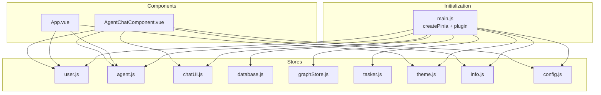

**Diagram sources**
- [main.js:12-25](file://web/src/main.js#L12-L25)
- [agent.js:7-567](file://web/src/stores/agent.js#L7-L567)
- [chatUI.js:4-82](file://web/src/stores/chatUI.js#L4-L82)
- [database.js:10-568](file://web/src/stores/database.js#L10-L568)
- [graphStore.js:4-435](file://web/src/stores/graphStore.js#L4-L435)
- [tasker.js:35-230](file://web/src/stores/tasker.js#L35-L230)
- [theme.js:5-66](file://web/src/stores/theme.js#L5-L66)
- [info.js:5-129](file://web/src/stores/info.js#L5-L129)
- [config.js:15-51](file://web/src/stores/config.js#L15-L51)
- [App.vue:8-22](file://web/src/App.vue#L8-L22)
- [AgentChatComponent.vue:277-295](file://web/src/components/AgentChatComponent.vue#L277-L295)

**Section sources**
- [main.js:12-25](file://web/src/main.js#L12-L25)
- [package.json:34-35](file://web/package.json#L34-L35)

## Core Components
- user.js: Authentication state, roles, and user lifecycle actions. Integrates with agent.js to reset agent state on logout.
- agent.js: Agent catalog, default agent, agent configuration profiles, and related UI resource discovery. Uses pinia-plugin-persistedstate to persist selected agent and selected config across sessions.
- chatUI.js: UI toggles for sidebar, menus, and loading states. Persists sidebar open state in localStorage.
- database.js: Knowledge base CRUD, file ingestion, parsing, indexing, and auto-refresh orchestration. Coordinates with tasker.js for queued tasks.
- graphStore.js: Graph rendering state for sigma.js, selection/focus, statistics, and conversion from API data to sigma-compatible structures.
- tasker.js: Background task queue, polling, summaries, and cancellation/deletion actions.
- theme.js: Theme switching with localStorage persistence and document class updates.
- info.js: Branding and organization metadata, with lazy loading and reload capability.
- config.js: Application configuration management with batch updates and refresh.

**Section sources**
- [user.js:5-388](file://web/src/stores/user.js#L5-L388)
- [agent.js:7-567](file://web/src/stores/agent.js#L7-L567)
- [chatUI.js:4-82](file://web/src/stores/chatUI.js#L4-L82)
- [database.js:10-568](file://web/src/stores/database.js#L10-L568)
- [graphStore.js:4-435](file://web/src/stores/graphStore.js#L4-L435)
- [tasker.js:35-230](file://web/src/stores/tasker.js#L35-L230)
- [theme.js:5-66](file://web/src/stores/theme.js#L5-L66)
- [info.js:5-129](file://web/src/stores/info.js#L5-L129)
- [config.js:15-51](file://web/src/stores/config.js#L15-L51)

## Architecture Overview
The stores are initialized with Pinia and the persistedstate plugin. Components consume stores via Composition API hooks. Reactive state updates propagate automatically to dependent computed properties and watchers. Persistence is configured per store to selectively persist specific keys.

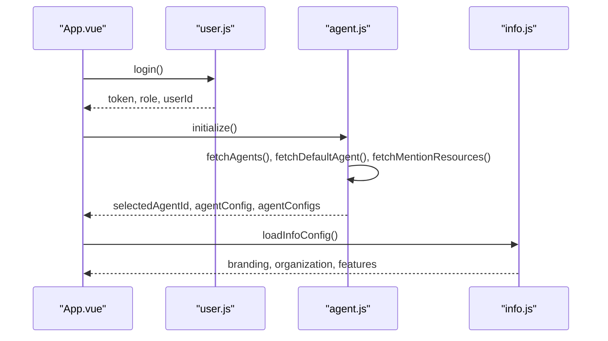

**Diagram sources**
- [App.vue:12-16](file://web/src/App.vue#L12-L16)
- [user.js:23-70](file://web/src/stores/user.js#L23-L70)
- [agent.js:120-176](file://web/src/stores/agent.js#L120-L176)
- [info.js:60-84](file://web/src/stores/info.js#L60-L84)

## Detailed Component Analysis

### user.js
- Purpose: Manage authentication state, roles, and user lifecycle. Provides helpers to fetch current user, update profile, and upload avatar. On logout, resets agent store to ensure clean state upon re-authentication.
- Reactive state: token, userId, username, userRole, department info.
- Computed: isLoggedIn, isAdmin, isSuperAdmin.
- Actions: login, logout, initialize, checkFirstRun, getAuthHeaders, user management CRUD, validateUsernameAndGenerateUserId, uploadAvatar, getCurrentUser, updateProfile.
- Integration: Used by App.vue to gate initialization; used by agent.js to enforce admin-only actions.

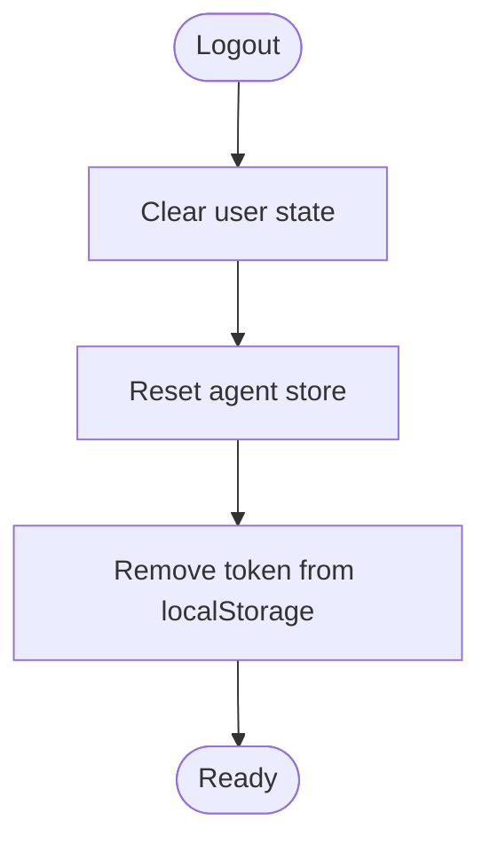

**Diagram sources**
- [user.js:72-90](file://web/src/stores/user.js#L72-L90)
- [agent.js:505-504](file://web/src/stores/agent.js#L505-L504)

**Section sources**
- [user.js:5-388](file://web/src/stores/user.js#L5-L388)

### agent.js
- Purpose: Central store for agent catalog, default agent, and agent configuration profiles. Handles fetching agent details, configurable items, and saving/restoring configurations. Integrates with knowledge bases, MCP servers, and skills for mentions.
- Reactive state: agents, selectedAgentId, defaultAgentId, agentConfig, agentConfigs, agentDetails, availableKnowledgeBases, availableMcps, availableSkills.
- Computed: selectedAgent, defaultAgent, agentsList, isDefaultAgent, configurableItems, availableTools, hasConfigChanges, selectedConfigSummary.
- Actions: initialize, fetchAgents, fetchDefaultAgent, setDefaultAgent, selectAgent, fetchAgentDetail, fetchAgentConfigs, loadAgentConfig, saveAgentConfig, createAgentConfigProfile, deleteSelectedAgentConfigProfile, setSelectedAgentConfigDefault, resetAgentConfig, updateConfigItem, updateAgentConfig, clearError, reset.
- Persistence: Selected agent and selected config persisted via persistedstate plugin configuration.

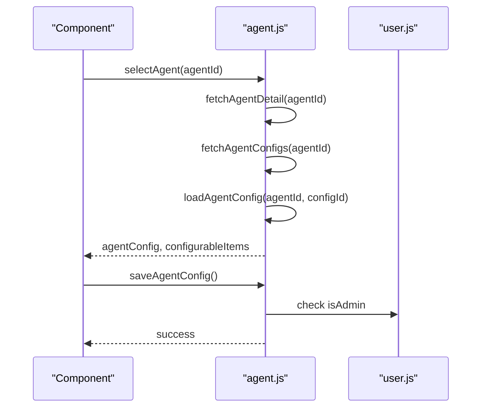

**Diagram sources**
- [agent.js:260-292](file://web/src/stores/agent.js#L260-L292)
- [agent.js:317-370](file://web/src/stores/agent.js#L317-L370)
- [agent.js:384-401](file://web/src/stores/agent.js#L384-L401)
- [user.js:18-20](file://web/src/stores/user.js#L18-L20)

**Section sources**
- [agent.js:7-567](file://web/src/stores/agent.js#L7-L567)

### chatUI.js
- Purpose: Manage UI-related state for chat interface, including sidebar visibility, loading states, and context menus. Sidebar preference is persisted in localStorage.
- Reactive state: isSidebarOpen, creatingNewChat, isLoadingThreads, isLoadingMessages, agentModalOpen, isConfigSidebarOpen, moreMenuOpen, moreMenuPosition.
- Actions: toggleSidebar, openMoreMenu, closeMoreMenu, reset.

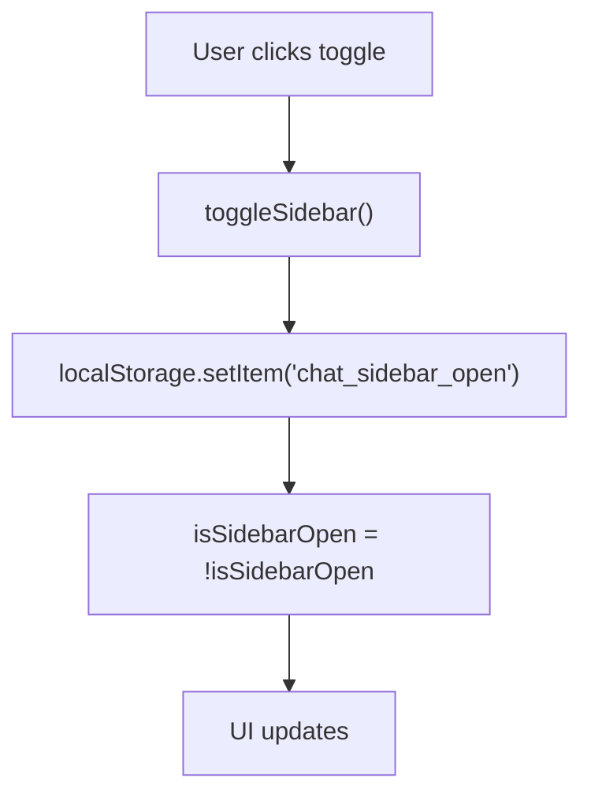

**Diagram sources**
- [chatUI.js:29-32](file://web/src/stores/chatUI.js#L29-L32)

**Section sources**
- [chatUI.js:4-82](file://web/src/stores/chatUI.js#L4-L82)

### database.js
- Purpose: Manage knowledge base lifecycle, file operations, and ingestion pipeline. Orchestrates auto-refresh while files are processing and integrates with tasker.js for queued tasks.
- Reactive state: databases, database, databaseId, selectedFile, queryParams, meta, selectedRowKeys, state (listLoading, creating, databaseLoading, etc.).
- Actions: loadDatabases, createDatabase, getDatabaseInfo, updateDatabaseInfo, deleteDatabase, deleteFile, handleDeleteFile, handleBatchDelete, moveFile, addFiles, parseFiles, indexFiles, openFileDetail, loadQueryParams, startAutoRefresh, stopAutoRefresh, toggleAutoRefresh, selectAllFailedFiles.
- Auto-refresh: Starts/stops polling based on file statuses and manual overrides.

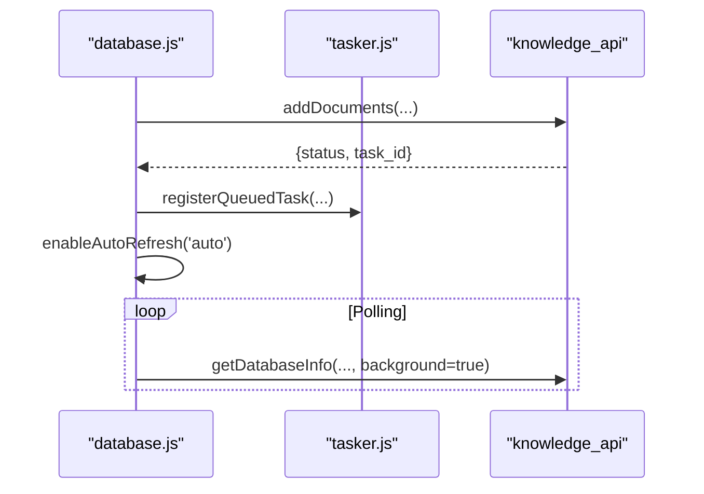

**Diagram sources**
- [database.js:317-360](file://web/src/stores/database.js#L317-L360)
- [database.js:335-346](file://web/src/stores/database.js#L335-L346)
- [database.js:489-502](file://web/src/stores/database.js#L489-L502)

**Section sources**
- [database.js:10-568](file://web/src/stores/database.js#L10-L568)

### graphStore.js
- Purpose: Manage graph rendering state for sigma.js, selection, focus, statistics, and conversion from API data to sigma-compatible structures.
- Reactive state: selectedNode, focusedNode, selectedEdge, focusedEdge, rawGraph, sigmaGraph, sigmaInstance, entityTypes, typeColorMap, isFetching, graphIsEmpty, moveToSelectedNode, stats.
- Getters: selectedNodeData, selectedEdgeData, isGraphEmpty.
- Actions: setSigmaInstance, setSelectedNode, setFocusedNode, setSelectedEdge, setFocusedEdge, clearSelection, setIsFetching, setEntityTypes, updateTypeColorMap, getEntityColor, setRawGraph, setSigmaGraph, updateStats, createGraphFromApiData, createSigmaGraph, reset.

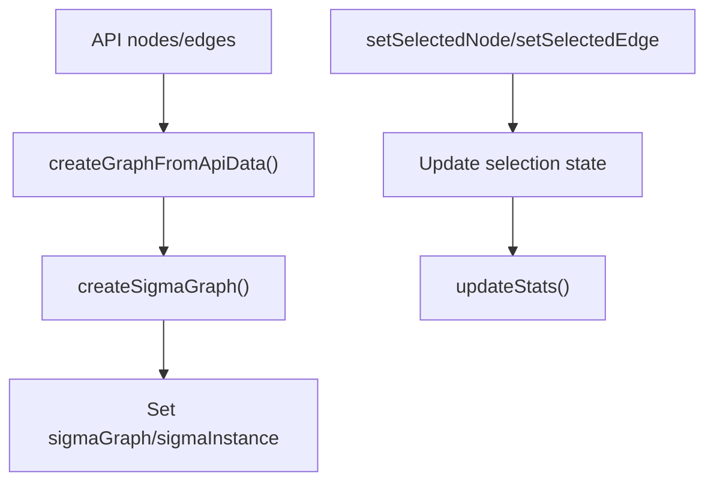

**Diagram sources**
- [graphStore.js:214-306](file://web/src/stores/graphStore.js#L214-L306)
- [graphStore.js:324-415](file://web/src/stores/graphStore.js#L324-L415)
- [graphStore.js:36-99](file://web/src/stores/graphStore.js#L36-L99)

**Section sources**
- [graphStore.js:4-435](file://web/src/stores/graphStore.js#L4-L435)

### tasker.js
- Purpose: Manage background task queue, polling, and summaries. Supports registering queued tasks, refreshing details, cancellation, and deletion.
- Reactive state: tasks, loading, lastError, isPolling, isDrawerOpen, summary.
- Computed: sortedTasks, statusCounts, activeCount, failedCount, successCount, totalCount.
- Actions: loadTasks, refreshTask, cancelTask, deleteTask, registerQueuedTask, startPolling, stopPolling, reset, openDrawer, closeDrawer, toggleDrawer.

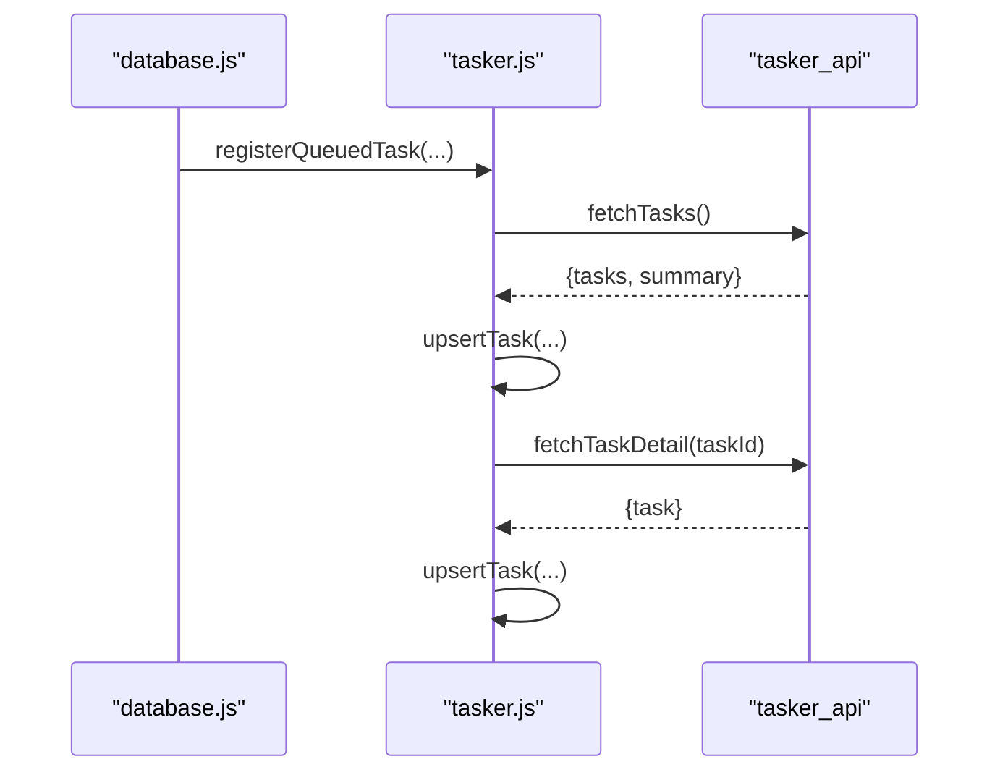

**Diagram sources**
- [tasker.js:152-166](file://web/src/stores/tasker.js#L152-L166)
- [tasker.js:84-109](file://web/src/stores/tasker.js#L84-L109)
- [tasker.js:111-122](file://web/src/stores/tasker.js#L111-L122)

**Section sources**
- [tasker.js:35-230](file://web/src/stores/tasker.js#L35-L230)

### theme.js
- Purpose: Manage theme switching between light/dark modes, persist theme preference in localStorage, and update document root classes.
- Reactive state: isDark, currentTheme.
- Actions: toggleTheme, setTheme, updateDocumentTheme.

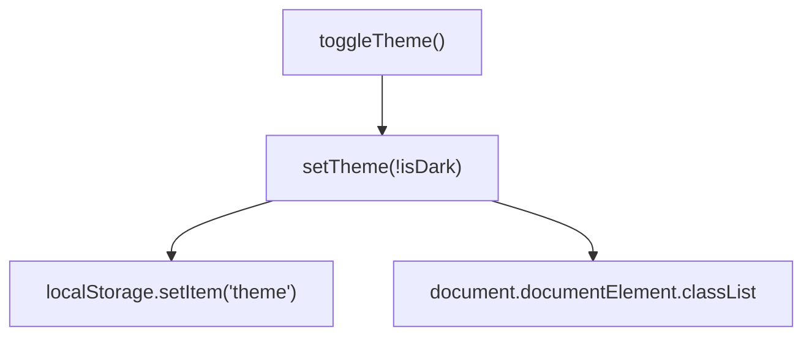

**Diagram sources**
- [theme.js:35-57](file://web/src/stores/theme.js#L35-L57)

**Section sources**
- [theme.js:5-66](file://web/src/stores/theme.js#L5-L66)

### info.js
- Purpose: Load and cache branding and organization metadata from backend, with optional reload.
- Reactive state: infoConfig, isLoading, isLoaded, debugMode.
- Computed: organization, branding, features, actions, footer.
- Actions: setInfoConfig, setDebugMode, toggleDebugMode, loadInfoConfig, reloadInfoConfig.

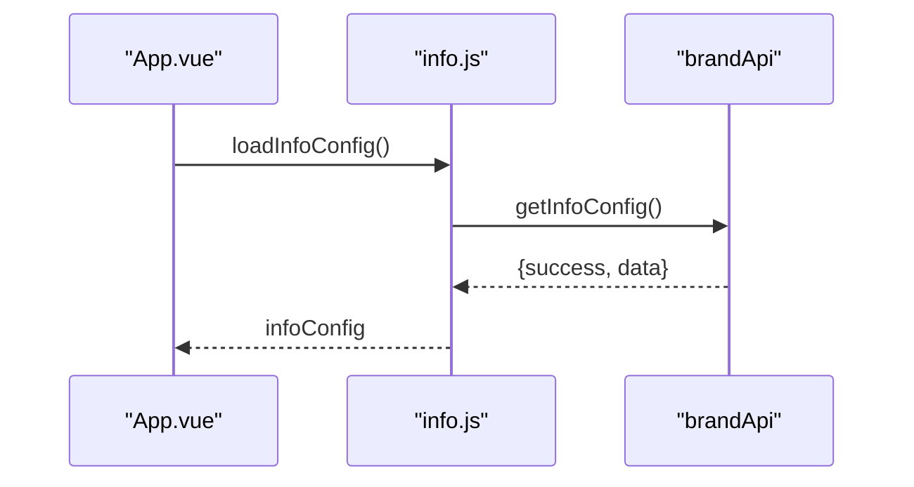

**Diagram sources**
- [info.js:60-84](file://web/src/stores/info.js#L60-L84)
- [App.vue:20-23](file://web/src/App.vue#L20-L23)

**Section sources**
- [info.js:5-129](file://web/src/stores/info.js#L5-L129)

### config.js
- Purpose: Manage application configuration, batch updates, and refresh from backend.
- Reactive state: config.
- Actions: setConfig, setConfigValue, setConfigValues, refreshConfig.

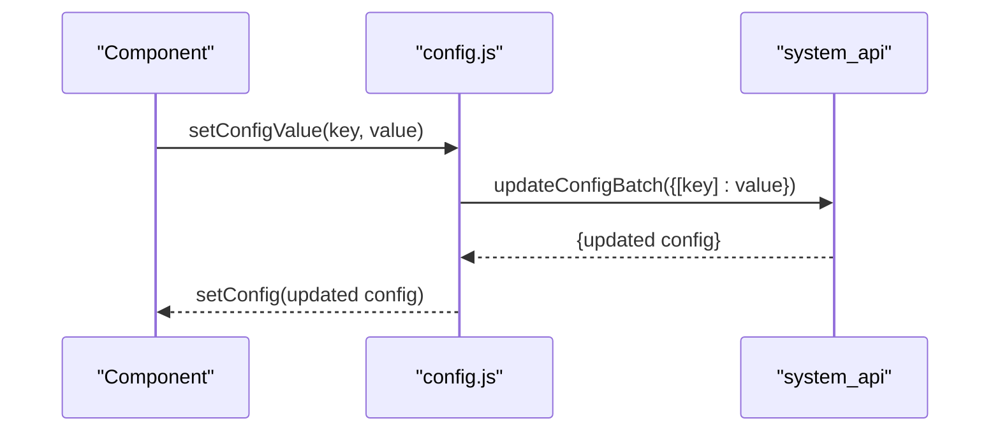

**Diagram sources**
- [config.js:21-27](file://web/src/stores/config.js#L21-L27)

**Section sources**
- [config.js:15-51](file://web/src/stores/config.js#L15-L51)

## Dependency Analysis
- Initialization: main.js initializes Pinia and enables persistedstate plugin. It also preloads branding info.
- Store-to-store dependencies:
  - user.js is used by agent.js for admin checks and by App.vue to gate initialization.
  - database.js uses tasker.js to register queued tasks and user.js for role checks.
  - graphStore.js is independent and used by graph-related components.
  - chatUI.js and theme.js are UI-focused and used widely by components.
  - info.js is consumed by App.vue and components for branding.
  - config.js is used by components for configuration updates.
- Persistence: agent.js persists selectedAgentId and selectedAgentConfigId; chatUI.js persists sidebar open state in localStorage.

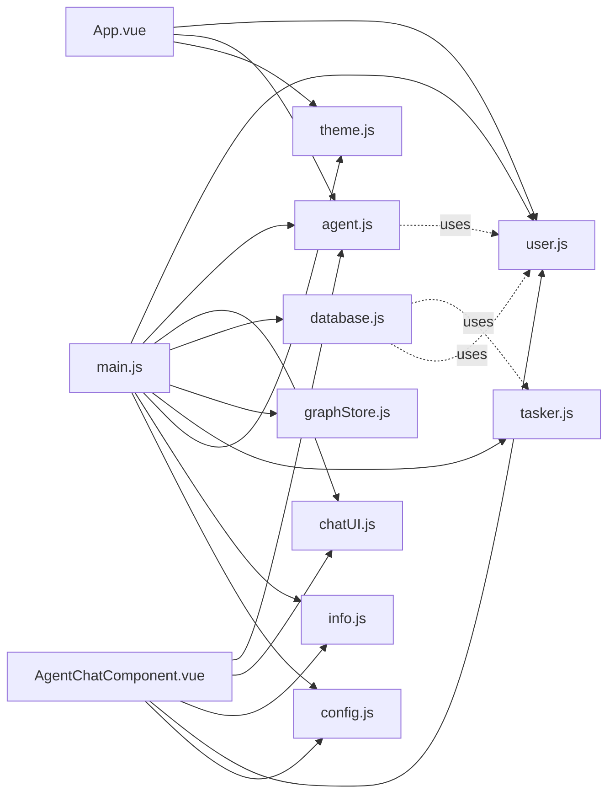

**Diagram sources**
- [main.js:12-25](file://web/src/main.js#L12-L25)
- [App.vue:8-22](file://web/src/App.vue#L8-L22)
- [AgentChatComponent.vue:277-295](file://web/src/components/AgentChatComponent.vue#L277-L295)
- [agent.js:10](file://web/src/stores/agent.js#L10)
- [database.js:5-13](file://web/src/stores/database.js#L5-L13)

**Section sources**
- [main.js:12-25](file://web/src/main.js#L12-L25)
- [App.vue:8-22](file://web/src/App.vue#L8-L22)
- [AgentChatComponent.vue:277-295](file://web/src/components/AgentChatComponent.vue#L277-L295)

## Performance Considerations
- Prefer computed properties for derived state to minimize recomputation and avoid unnecessary re-renders.
- Use storeToRefs in components to maintain reactivity without extra overhead.
- Batch updates where possible (e.g., updateAgentConfig) to reduce intermediate renders.
- Leverage persistedstate only for essential UI/session keys to limit storage footprint.
- For long-running operations (e.g., database ingestion), use controlled polling intervals and stop when no longer needed.
- Avoid heavy synchronous computations inside actions; offload to microtasks or workers when feasible.

## Troubleshooting Guide
- Authentication failures: Check user.js login/logout flows and ensure Authorization headers are set via getAuthHeaders.
- Agent configuration errors: Verify admin role checks before saving; inspect hasConfigChanges and originalAgentConfig sync.
- Database operations: Confirm auto-refresh is enabled when files are processing; review batch delete progress messages and error handling.
- Graph rendering: Validate node/edge creation and ensure dynamic IDs are unique; check type color mapping and entity types.
- Task polling: Ensure startPolling is called and stopped appropriately; monitor lastError and summary counts.
- Theme switching: Confirm localStorage key and document class updates occur on toggle.
- Info loading: Handle fallbacks when load fails; use reloadInfoConfig to refresh branding data.

**Section sources**
- [user.js:142-146](file://web/src/stores/user.js#L142-L146)
- [agent.js:388-401](file://web/src/stores/agent.js#L388-L401)
- [database.js:288-300](file://web/src/stores/database.js#L288-L300)
- [graphStore.js:324-415](file://web/src/stores/graphStore.js#L324-L415)
- [tasker.js:180-194](file://web/src/stores/tasker.js#L180-L194)
- [theme.js:48-57](file://web/src/stores/theme.js#L48-L57)
- [info.js:60-84](file://web/src/stores/info.js#L60-L84)

## Conclusion
The Pinia state management system organizes concerns cleanly across dedicated stores, with reactive state and computed properties driving efficient UI updates. Persistence is selectively applied to improve UX without overloading storage. Integration patterns between stores and components are straightforward, enabling scalable development and maintainable state flows.

## Appendices

### Practical Examples

- Initialize agent store after login:
  - Path: [App.vue:12-16](file://web/src/App.vue#L12-L16)
  - Flow: On mount, if logged in, call agentStore.initialize() to fetch agents, default agent, and mention resources.

- Persisted selections:
  - agent.js: [agent.js:558-565](file://web/src/stores/agent.js#L558-L565)
  - chatUI.js: [chatUI.js:29-32](file://web/src/stores/chatUI.js#L29-L32)

- Backend integration:
  - user.js: [user.js:30-70](file://web/src/stores/user.js#L30-L70)
  - agent.js: [agent.js:186-196](file://web/src/stores/agent.js#L186-L196)
  - database.js: [database.js:317-360](file://web/src/stores/database.js#L317-L360)
  - tasker.js: [tasker.js:95-109](file://web/src/stores/tasker.js#L95-L109)
  - info.js: [info.js:68-84](file://web/src/stores/info.js#L68-L84)
  - config.js: [config.js:23-27](file://web/src/stores/config.js#L23-L27)

- State mutation patterns:
  - agent.js: [agent.js:360-362](file://web/src/stores/agent.js#L360-L362)
  - database.js: [database.js:118](file://web/src/stores/database.js#L118)
  - theme.js: [theme.js:40-44](file://web/src/stores/theme.js#L40-L44)

- Best practices:
  - Use computed for derived data: [agent.js:59-79](file://web/src/stores/agent.js#L59-L79)
  - Batch updates: [agent.js:471-473](file://web/src/stores/agent.js#L471-L473)
  - Controlled polling: [tasker.js:180-194](file://web/src/stores/tasker.js#L180-L194)