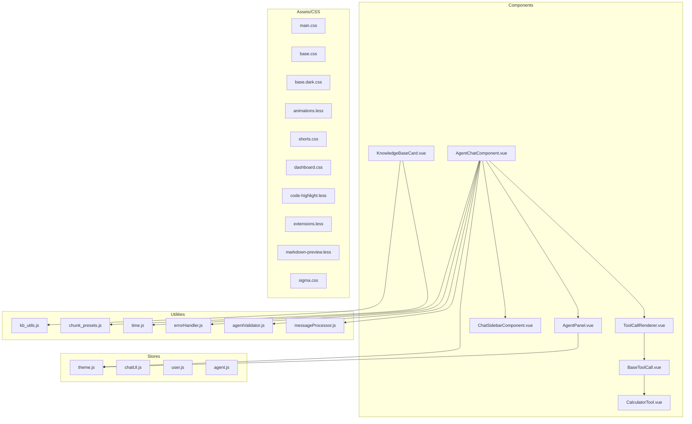
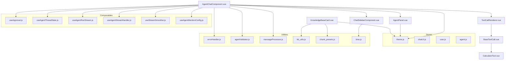
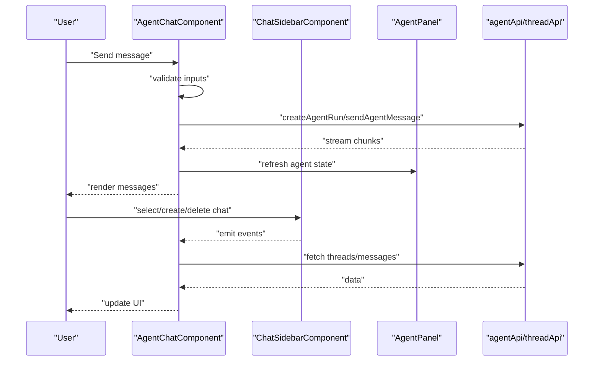
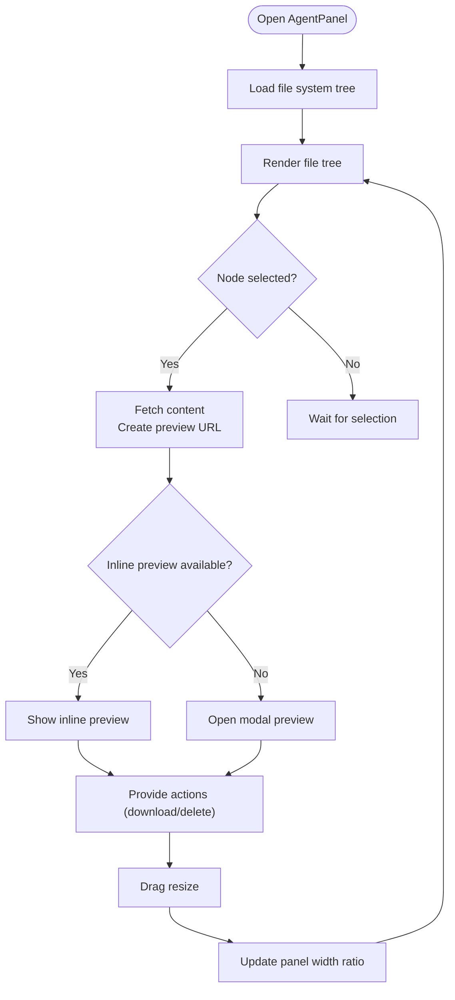
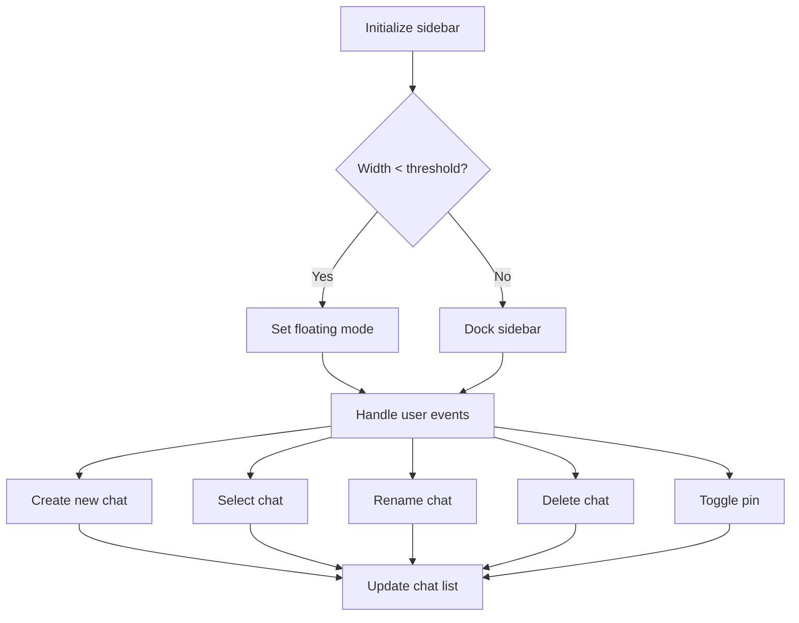
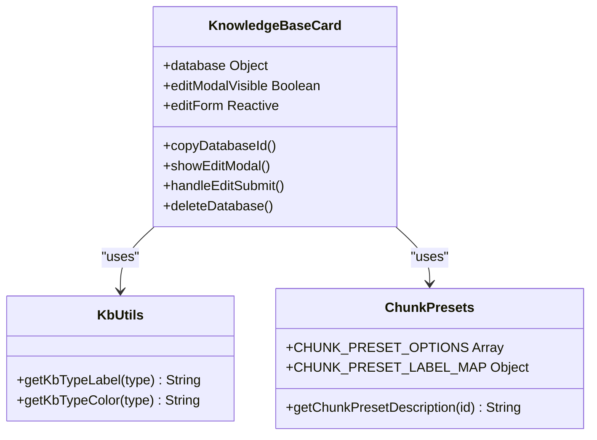
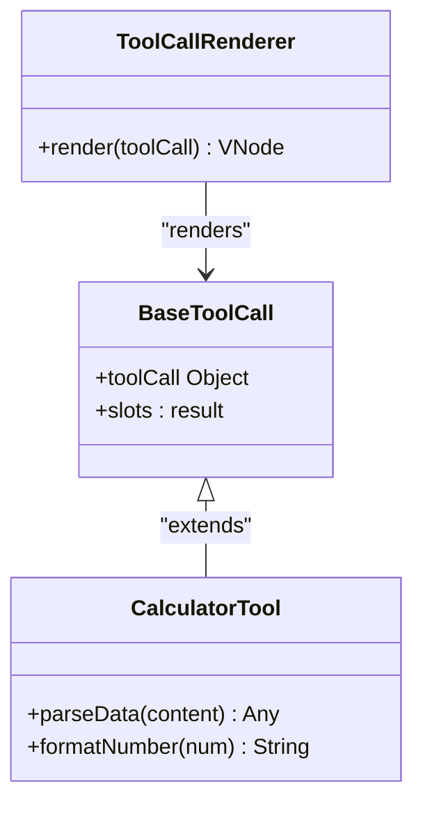
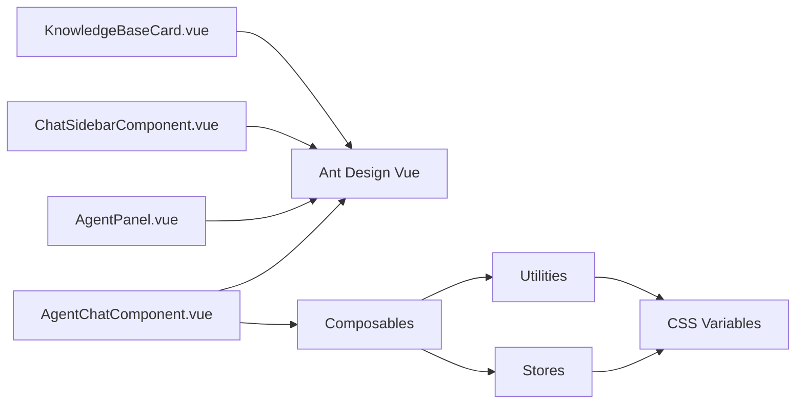

# UI Components & Design System

<cite>
**Referenced Files in This Document**
- [AgentChatComponent.vue](file://web/src/components/AgentChatComponent.vue)
- [AgentPanel.vue](file://web/src/components/AgentPanel.vue)
- [ChatSidebarComponent.vue](file://web/src/components/ChatSidebarComponent.vue)
- [KnowledgeBaseCard.vue](file://web/src/components/KnowledgeBaseCard.vue)
- [CalculatorTool.vue](file://web/src/components/ToolCallingResult/tools/CalculatorTool.vue)
- [BaseToolCall.vue](file://web/src/components/ToolCallingResult/BaseToolCall.vue)
- [ToolCallRenderer.vue](file://web/src/components/ToolCallingResult/ToolCallRenderer.vue)
- [theme.js](file://web/src/stores/theme.js)
- [main.css](file://web/src/assets/css/main.css)
- [base.css](file://web/src/assets/css/base.css)
- [base.dark.css](file://web/src/assets/css/base.dark.css)
- [animations.less](file://web/src/assets/css/animations.less)
- [shorts.css](file://web/src/assets/css/shorts.css)
- [dashboard.css](file://web/src/assets/css/dashboard.css)
- [code-highlight.less](file://web/src/assets/css/code-highlight.less)
- [extensions.less](file://web/src/assets/css/extensions.less)
- [markdown-preview.less](file://web/src/assets/css/markdown-preview.less)
- [sigma.css](file://web/src/assets/css/sigma.css)
- [ThemeToggle.vue](file://web/src/components/ThemeToggle.vue)
- [AgentMessageComponent.vue](file://web/src/components/AgentMessageComponent.vue)
- [AgentInputArea.vue](file://web/src/components/AgentInputArea.vue)
- [AgentArtifactsCard.vue](file://web/src/components/AgentArtifactsCard.vue)
- [HumanApprovalModal.vue](file://web/src/components/HumanApprovalModal.vue)
- [RefsComponent.vue](file://web/src/components/RefsComponent.vue)
- [FileTreeComponent.vue](file://web/src/components/FileTreeComponent.vue)
- [AgentFilePreview.vue](file://web/src/components/AgentFilePreview.vue)
- [viewer_filesystem.js](file://web/src/apis/viewer_filesystem.js)
- [kb_utils.js](file://web/src/utils/kb_utils.js)
- [chunk_presets.js](file://web/src/utils/chunk_presets.js)
- [time.js](file://web/src/utils/time.js)
- [errorHandler.js](file://web/src/utils/errorHandler.js)
- [agentValidator.js](file://web/src/utils/agentValidator.js)
- [messageProcessor.js](file://web/src/utils/messageProcessor.js)
- [useApproval.js](file://web/src/composables/useApproval.js)
- [useAgentThreadState.js](file://web/src/composables/useAgentThreadState.js)
- [useAgentRunStream.js](file://web/src/composables/useAgentRunStream.js)
- [useAgentStreamHandler.js](file://web/src/composables/useAgentStreamHandler.js)
- [useStreamSmoother.js](file://web/src/composables/useStreamSmoother.js)
- [useAgentMentionConfig.js](file://web/src/composables/useAgentMentionConfig.js)
- [agentPanelAutoOpen.js](file://web/src/utils/agentPanelAutoOpen.js)
</cite>

## Table of Contents
1. [Introduction](#introduction)
2. [Project Structure](#project-structure)
3. [Core Components](#core-components)
4. [Architecture Overview](#architecture-overview)
5. [Detailed Component Analysis](#detailed-component-analysis)
6. [Dependency Analysis](#dependency-analysis)
7. [Performance Considerations](#performance-considerations)
8. [Troubleshooting Guide](#troubleshooting-guide)
9. [Conclusion](#conclusion)
10. [Appendices](#appendices)

## Introduction
This document describes the UI component library and design system used in the web application. It focuses on major chat and agent-centric components (AgentChatComponent, AgentPanel, ChatSidebarComponent, KnowledgeBaseCard), specialized tool rendering components, Ant Design Vue integration, custom component development patterns, and the CSS architecture including Ant Design CSS variables, custom stylesheets, and responsive design. It also covers theming support, dark mode implementation, accessibility features, component APIs, prop interfaces, event handling, customization options, and design tokens such as color schemes, typography, and spacing.

## Project Structure
The UI layer is organized around feature-based components under web/src/components, with shared assets under web/src/assets/css and composables under web/src/composables. Stores manage global state (theme, chat UI, user, agent), while APIs encapsulate backend integrations. Specialized tool rendering resides under ToolCallingResult with individual tool implementations.

**Diagram sources**
- [AgentChatComponent.vue:1-237](file://web/src/components/AgentChatComponent.vue#L1-237)
- [AgentPanel.vue:1-127](file://web/src/components/AgentPanel.vue#L1-127)
- [ChatSidebarComponent.vue:1-108](file://web/src/components/ChatSidebarComponent.vue#L1-108)
- [KnowledgeBaseCard.vue:1-521](file://web/src/components/KnowledgeBaseCard.vue#L1-521)
- [ToolCallRenderer.vue](file://web/src/components/ToolCallingResult/ToolCallRenderer.vue)
- [BaseToolCall.vue](file://web/src/components/ToolCallingResult/BaseToolCall.vue)
- [CalculatorTool.vue:1-112](file://web/src/components/ToolCallingResult/tools/CalculatorTool.vue#L1-112)
- [theme.js](file://web/src/stores/theme.js)
- [main.css](file://web/src/assets/css/main.css)
- [base.css](file://web/src/assets/css/base.css)
- [base.dark.css](file://web/src/assets/css/base.dark.css)
- [kb_utils.js](file://web/src/utils/kb_utils.js)
- [chunk_presets.js](file://web/src/utils/chunk_presets.js)
- [time.js](file://web/src/utils/time.js)
- [errorHandler.js](file://web/src/utils/errorHandler.js)
- [agentValidator.js](file://web/src/utils/agentValidator.js)
- [messageProcessor.js](file://web/src/utils/messageProcessor.js)

**Section sources**
- [AgentChatComponent.vue:1-237](file://web/src/components/AgentChatComponent.vue#L1-237)
- [AgentPanel.vue:1-127](file://web/src/components/AgentPanel.vue#L1-127)
- [ChatSidebarComponent.vue:1-108](file://web/src/components/ChatSidebarComponent.vue#L1-108)
- [KnowledgeBaseCard.vue:1-521](file://web/src/components/KnowledgeBaseCard.vue#L1-521)
- [ToolCallRenderer.vue](file://web/src/components/ToolCallingResult/ToolCallRenderer.vue)
- [BaseToolCall.vue](file://web/src/components/ToolCallingResult/BaseToolCall.vue)
- [CalculatorTool.vue:1-112](file://web/src/components/ToolCallingResult/tools/CalculatorTool.vue#L1-112)
- [theme.js](file://web/src/stores/theme.js)
- [main.css](file://web/src/assets/css/main.css)
- [base.css](file://web/src/assets/css/base.css)
- [base.dark.css](file://web/src/assets/css/base.dark.css)
- [kb_utils.js](file://web/src/utils/kb_utils.js)
- [chunk_presets.js](file://web/src/utils/chunk_presets.js)
- [time.js](file://web/src/utils/time.js)
- [errorHandler.js](file://web/src/utils/errorHandler.js)
- [agentValidator.js](file://web/src/utils/agentValidator.js)
- [messageProcessor.js](file://web/src/utils/messageProcessor.js)

## Core Components
This section documents the primary UI components and their roles in the design system.

- AgentChatComponent: Orchestrates the chat experience, manages threads, renders messages, handles streaming, approvals, and integrates the agent panel and sidebar.
- AgentPanel: Provides a resizable workbench panel for agent state, file system browsing, and artifact previews.
- ChatSidebarComponent: Manages conversation list navigation, actions, and responsive sidebar behavior.
- KnowledgeBaseCard: Renders knowledge base metadata, editing capabilities, and sharing configuration.
- ToolCallRenderer and BaseToolCall: Provide a framework for rendering tool call results with consistent styling and slots.
- CalculatorTool: Demonstrates a specialized tool renderer with parsing and number formatting.

Key integration points:
- Ant Design Vue: Used via message, modal, dropdown, menu, segmented controls, and form components.
- Composition API and Pinia: Centralized state management for theme, chat UI, user, and agent.
- CSS custom properties: Extensive use of CSS variables for theming and responsive design.

**Section sources**
- [AgentChatComponent.vue:239-1626](file://web/src/components/AgentChatComponent.vue#L239-1626)
- [AgentPanel.vue:129-634](file://web/src/components/AgentPanel.vue#L129-634)
- [ChatSidebarComponent.vue:110-276](file://web/src/components/ChatSidebarComponent.vue#L110-276)
- [KnowledgeBaseCard.vue:156-417](file://web/src/components/KnowledgeBaseCard.vue#L156-417)
- [ToolCallRenderer.vue](file://web/src/components/ToolCallingResult/ToolCallRenderer.vue)
- [BaseToolCall.vue](file://web/src/components/ToolCallingResult/BaseToolCall.vue)
- [CalculatorTool.vue:19-57](file://web/src/components/ToolCallingResult/tools/CalculatorTool.vue#L19-57)

## Architecture Overview
The UI architecture follows a layered pattern:
- Components: Presentational and interactive UI elements.
- Composables: Encapsulated logic for streams, approvals, mentions, and thread state.
- Stores: Global state for theme, chat UI, user, and agent.
- Utilities: Shared helpers for validation, processing, and formatting.
- Assets: CSS and LESS for styling, animations, and responsive breakpoints.

**Diagram sources**
- [AgentChatComponent.vue:239-1626](file://web/src/components/AgentChatComponent.vue#L239-1626)
- [AgentPanel.vue:129-634](file://web/src/components/AgentPanel.vue#L129-634)
- [ChatSidebarComponent.vue:110-276](file://web/src/components/ChatSidebarComponent.vue#L110-276)
- [KnowledgeBaseCard.vue:156-417](file://web/src/components/KnowledgeBaseCard.vue#L156-417)
- [ToolCallRenderer.vue](file://web/src/components/ToolCallingResult/ToolCallRenderer.vue)
- [BaseToolCall.vue](file://web/src/components/ToolCallingResult/BaseToolCall.vue)
- [CalculatorTool.vue:19-57](file://web/src/components/ToolCallingResult/tools/CalculatorTool.vue#L19-57)
- [useApproval.js](file://web/src/composables/useApproval.js)
- [useAgentThreadState.js](file://web/src/composables/useAgentThreadState.js)
- [useAgentRunStream.js](file://web/src/composables/useAgentRunStream.js)
- [useAgentStreamHandler.js](file://web/src/composables/useAgentStreamHandler.js)
- [useStreamSmoother.js](file://web/src/composables/useStreamSmoother.js)
- [useAgentMentionConfig.js](file://web/src/composables/useAgentMentionConfig.js)
- [theme.js](file://web/src/stores/theme.js)
- [errorHandler.js](file://web/src/utils/errorHandler.js)
- [agentValidator.js](file://web/src/utils/agentValidator.js)
- [messageProcessor.js](file://web/src/utils/messageProcessor.js)
- [kb_utils.js](file://web/src/utils/kb_utils.js)
- [chunk_presets.js](file://web/src/utils/chunk_presets.js)
- [time.js](file://web/src/utils/time.js)

## Detailed Component Analysis

### AgentChatComponent
AgentChatComponent is the central orchestrator for chat interactions. It:
- Integrates ChatSidebarComponent, AgentPanel, AgentInputArea, AgentMessageComponent, and RefsComponent.
- Manages thread lifecycle, message streaming, approvals, and artifact updates.
- Implements responsive behavior with floating sidebar detection and panel resizing.
- Uses Ant Design Vue components for UI elements and composables for stream handling.

**Diagram sources**
- [AgentChatComponent.vue:951-1298](file://web/src/components/AgentChatComponent.vue#L951-1298)
- [ChatSidebarComponent.vue:204-275](file://web/src/components/ChatSidebarComponent.vue#L204-275)
- [AgentPanel.vue:519-522](file://web/src/components/AgentPanel.vue#L519-522)

**Section sources**
- [AgentChatComponent.vue:270-1626](file://web/src/components/AgentChatComponent.vue#L270-1626)
- [AgentMessageComponent.vue](file://web/src/components/AgentMessageComponent.vue)
- [AgentInputArea.vue](file://web/src/components/AgentInputArea.vue)
- [AgentArtifactsCard.vue](file://web/src/components/AgentArtifactsCard.vue)
- [HumanApprovalModal.vue](file://web/src/components/HumanApprovalModal.vue)
- [RefsComponent.vue](file://web/src/components/RefsComponent.vue)

### AgentPanel
AgentPanel provides a resizable workbench for agent state and file system operations:
- File tree with lazy loading, selection, and actions (download, delete).
- Inline preview pane that adapts to available width.
- Modal preview for larger screens.
- Drag-to-resize with pointer capture and requestAnimationFrame throttling.

**Diagram sources**
- [AgentPanel.vue:321-522](file://web/src/components/AgentPanel.vue#L321-522)
- [FileTreeComponent.vue](file://web/src/components/FileTreeComponent.vue)
- [AgentFilePreview.vue](file://web/src/components/AgentFilePreview.vue)
- [viewer_filesystem.js](file://web/src/apis/viewer_filesystem.js)

**Section sources**
- [AgentPanel.vue:129-634](file://web/src/components/AgentPanel.vue#L129-634)
- [FileTreeComponent.vue](file://web/src/components/FileTreeComponent.vue)
- [AgentFilePreview.vue](file://web/src/components/AgentFilePreview.vue)
- [viewer_filesystem.js](file://web/src/apis/viewer_filesystem.js)

### ChatSidebarComponent
ChatSidebarComponent manages conversation navigation and actions:
- Displays pinned and unpinned chats, sorted by recency.
- Supports create, select, rename, delete, and toggle pin.
- Responsive behavior toggles floating sidebar on narrow widths.

**Diagram sources**
- [ChatSidebarComponent.vue:190-276](file://web/src/components/ChatSidebarComponent.vue#L190-276)
- [time.js](file://web/src/utils/time.js)

**Section sources**
- [ChatSidebarComponent.vue:110-276](file://web/src/components/ChatSidebarComponent.vue#L110-276)
- [time.js](file://web/src/utils/time.js)

### KnowledgeBaseCard
KnowledgeBaseCard presents and edits knowledge base metadata:
- Displays name, description, tags (type, embedding, chunk preset).
- Edit modal supports renaming, description, auto-generated questions, chunk presets, and provider-specific fields (e.g., Dify).
- Handles shared configuration visibility and editing permissions.

**Diagram sources**
- [KnowledgeBaseCard.vue:156-417](file://web/src/components/KnowledgeBaseCard.vue#L156-417)
- [kb_utils.js](file://web/src/utils/kb_utils.js)
- [chunk_presets.js](file://web/src/utils/chunk_presets.js)

**Section sources**
- [KnowledgeBaseCard.vue:156-417](file://web/src/components/KnowledgeBaseCard.vue#L156-417)
- [kb_utils.js](file://web/src/utils/kb_utils.js)
- [chunk_presets.js](file://web/src/utils/chunk_presets.js)

### Tool Calling Result Rendering
ToolCallRenderer and BaseToolCall provide a consistent framework for displaying tool results. Specialized tools (e.g., CalculatorTool) extend BaseToolCall to render structured outputs.

**Diagram sources**
- [ToolCallRenderer.vue](file://web/src/components/ToolCallingResult/ToolCallRenderer.vue)
- [BaseToolCall.vue](file://web/src/components/ToolCallingResult/BaseToolCall.vue)
- [CalculatorTool.vue:19-57](file://web/src/components/ToolCallingResult/tools/CalculatorTool.vue#L19-57)

**Section sources**
- [ToolCallRenderer.vue](file://web/src/components/ToolCallingResult/ToolCallRenderer.vue)
- [BaseToolCall.vue](file://web/src/components/ToolCallingResult/BaseToolCall.vue)
- [CalculatorTool.vue:19-57](file://web/src/components/ToolCallingResult/tools/CalculatorTool.vue#L19-57)

## Dependency Analysis
The components depend on:
- Ant Design Vue for UI primitives (message, modal, dropdown, menu, segmented, form).
- Composition API and Pinia for state management.
- Utility modules for validation, processing, and formatting.
- CSS custom properties for theming and responsive breakpoints.

**Diagram sources**
- [AgentChatComponent.vue:240-268](file://web/src/components/AgentChatComponent.vue#L240-268)
- [AgentPanel.vue:140-148](file://web/src/components/AgentPanel.vue#L140-148)
- [ChatSidebarComponent.vue:112-122](file://web/src/components/ChatSidebarComponent.vue#L112-122)
- [KnowledgeBaseCard.vue:167-173](file://web/src/components/KnowledgeBaseCard.vue#L167-173)

**Section sources**
- [AgentChatComponent.vue:240-268](file://web/src/components/AgentChatComponent.vue#L240-268)
- [AgentPanel.vue:140-148](file://web/src/components/AgentPanel.vue#L140-148)
- [ChatSidebarComponent.vue:112-122](file://web/src/components/ChatSidebarComponent.vue#L112-122)
- [KnowledgeBaseCard.vue:167-173](file://web/src/components/KnowledgeBaseCard.vue#L167-173)

## Performance Considerations
- Streaming and debouncing: Stream smoothing and send cooldown prevent excessive re-renders and API calls.
- Lazy loading: File system tree loads children on demand; chat sidebar collapses content when closed.
- Resize observation: Panel resizing uses requestAnimationFrame to throttle updates.
- CSS containment: Chat area uses contain: layout to limit forced reflows.
- Scroll management: Dedicated controller optimizes scroll behavior during streaming.

[No sources needed since this section provides general guidance]

## Troubleshooting Guide
Common issues and resolutions:
- Validation errors: AgentChatComponent uses agentValidator and errorHandler to surface actionable messages.
- Approval flows: useApproval coordinates modal interactions and stream resumption.
- Stream interruptions: AbortController and stopRunStreamSubscription ensure clean cancellation.
- File operations: Viewer filesystem APIs handle downloads and deletions with proper error handling.

**Section sources**
- [errorHandler.js](file://web/src/utils/errorHandler.js)
- [agentValidator.js](file://web/src/utils/agentValidator.js)
- [useApproval.js](file://web/src/composables/useApproval.js)
- [useAgentRunStream.js](file://web/src/composables/useAgentRunStream.js)
- [viewer_filesystem.js](file://web/src/apis/viewer_filesystem.js)

## Conclusion
The UI component library combines Ant Design Vue with custom components to deliver a cohesive chat and agent experience. The design system leverages CSS custom properties for theming, responsive breakpoints, and consistent spacing. Tool rendering is standardized through BaseToolCall and ToolCallRenderer, enabling extensibility. State management via Pinia and composables ensures maintainable logic separation and robust error handling.

[No sources needed since this section summarizes without analyzing specific files]

## Appendices

### Theming and Dark Mode
- Theme store: Centralizes theme state and preferences.
- CSS variables: Extensive use of --gray-* and --main-* variables for consistent theming.
- Dark stylesheet: base.dark.css provides dark-mode overrides.
- Theme toggle: ThemeToggle integrates with theme store to switch modes.

**Section sources**
- [theme.js](file://web/src/stores/theme.js)
- [ThemeToggle.vue](file://web/src/components/ThemeToggle.vue)
- [base.dark.css](file://web/src/assets/css/base.dark.css)

### CSS Architecture and Responsive Design
- main.css and base.css define foundational styles and variables.
- Animations and transitions use CSS animations and LESS mixins.
- Responsive breakpoints applied in components (e.g., chat header, segmented controls).
- Typography and spacing tokens derived from CSS variables.

**Section sources**
- [main.css](file://web/src/assets/css/main.css)
- [base.css](file://web/src/assets/css/base.css)
- [animations.less](file://web/src/assets/css/animations.less)
- [AgentChatComponent.vue:2053-2096](file://web/src/components/AgentChatComponent.vue#L2053-L2096)

### Accessibility Features
- Semantic markup and ARIA-compliant Ant Design components.
- Keyboard navigable menus and dropdowns.
- Focus management in modals and dialogs.
- Sufficient color contrast using CSS variables.

[No sources needed since this section provides general guidance]