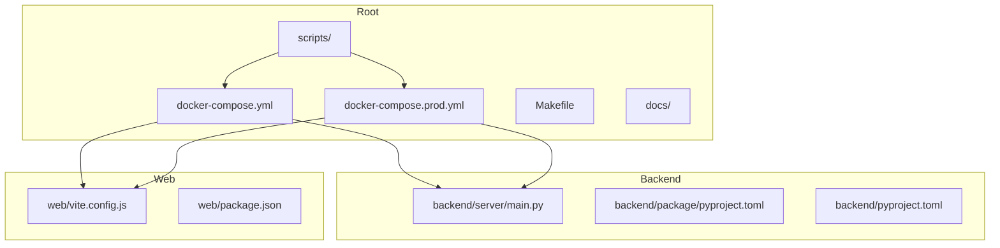
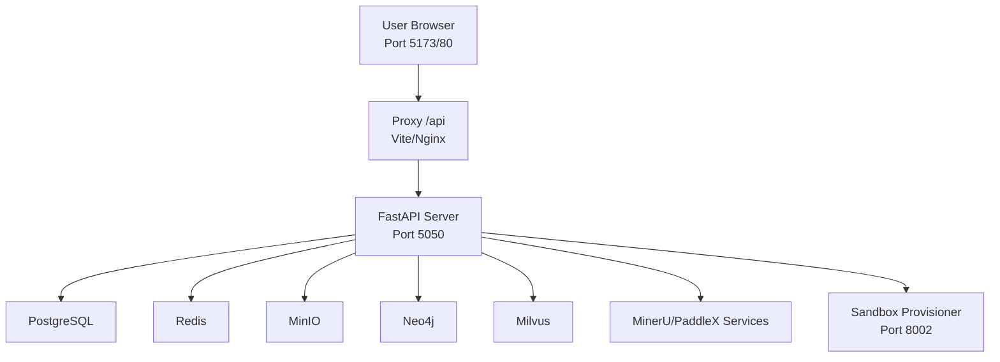
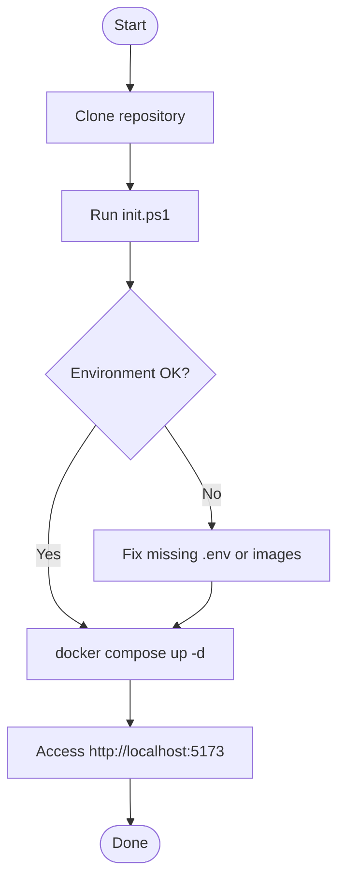
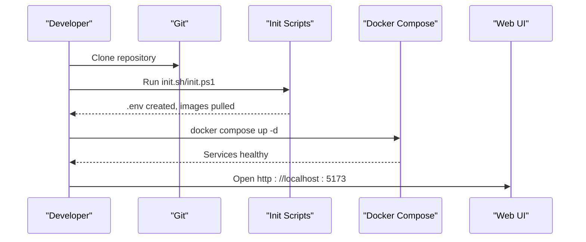
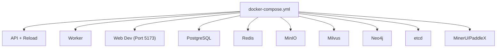
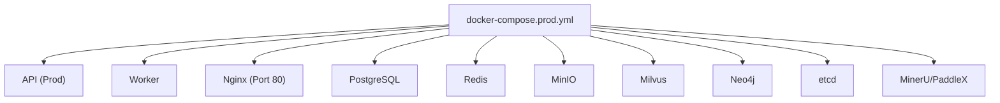
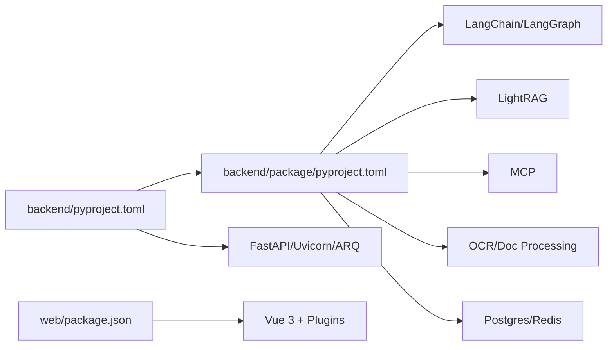

# Getting Started

<cite>
**Referenced Files in This Document**
- [README.md](file://README.md)
- [Makefile](file://Makefile)
- [docker-compose.yml](file://docker-compose.yml)
- [docker-compose.prod.yml](file://docker-compose.prod.yml)
- [scripts/init.sh](file://scripts/init.sh)
- [scripts/init.ps1](file://scripts/init.ps1)
- [scripts/pull_image.sh](file://scripts/pull_image.sh)
- [scripts/pull_image.ps1](file://scripts/pull_image.ps1)
- [backend/pyproject.toml](file://backend/pyproject.toml)
- [backend/package/pyproject.toml](file://backend/package/pyproject.toml)
- [backend/server/main.py](file://backend/server/main.py)
- [web/package.json](file://web/package.json)
- [web/vite.config.js](file://web/vite.config.js)
</cite>

## Table of Contents
1. [Introduction](#introduction)
2. [Project Structure](#project-structure)
3. [Core Components](#core-components)
4. [Architecture Overview](#architecture-overview)
5. [Detailed Component Analysis](#detailed-component-analysis)
6. [Dependency Analysis](#dependency-analysis)
7. [Performance Considerations](#performance-considerations)
8. [Troubleshooting Guide](#troubleshooting-guide)
9. [Conclusion](#conclusion)
10. [Appendices](#appendices)

## Introduction
This guide helps you install, configure, and run the Yuxi intelligent agent platform locally and in production. It covers prerequisites, OS-specific installation steps, environment initialization, dependency setup, quick start workflow, verification, and first-time usage examples. It also outlines development versus production deployment approaches.

## Project Structure
The repository is organized into:
- backend: Python/FastAPI server and internal package
- web: Vue 3 frontend
- docker: Multi-stage Dockerfiles and Nginx config
- scripts: OS-specific initialization and image-pulling helpers
- docs: Documentation site sources
- Root compose files for dev and prod deployments

**Diagram sources**
- [docker-compose.yml:1-436](file://docker-compose.yml#L1-L436)
- [docker-compose.prod.yml:1-373](file://docker-compose.prod.yml#L1-L373)
- [Makefile:1-39](file://Makefile#L1-L39)
- [scripts/init.sh:1-86](file://scripts/init.sh#L1-L86)
- [scripts/init.ps1:1-95](file://scripts/init.ps1#L1-L95)
- [backend/server/main.py:1-150](file://backend/server/main.py#L1-L150)
- [backend/package/pyproject.toml:1-106](file://backend/package/pyproject.toml#L1-L106)
- [backend/pyproject.toml:1-66](file://backend/pyproject.toml#L1-L66)
- [web/vite.config.js:1-30](file://web/vite.config.js#L1-L30)
- [web/package.json:1-51](file://web/package.json#L1-L51)

**Section sources**
- [README.md:97-118](file://README.md#L97-L118)
- [docker-compose.yml:1-436](file://docker-compose.yml#L1-L436)
- [docker-compose.prod.yml:1-373](file://docker-compose.prod.yml#L1-L373)
- [Makefile:1-39](file://Makefile#L1-L39)

## Core Components
- Backend API server (FastAPI) with hot-reload support for development
- Worker for asynchronous tasks
- Frontend (Vue 3) served via Vite in development or Nginx in production
- Supporting services: PostgreSQL, Redis, MinIO, Milvus, Neo4j, etcd, OCR/VLM services
- Sandbox provisioner for secure agent execution environments

Prerequisites:
- Python 3.12–3.13 (backend enforces this range)
- Node.js 20.x (frontend)
- Docker and Docker Compose
- Git (to clone the repository)
- Bash or PowerShell (for initialization scripts)

**Section sources**
- [backend/package/pyproject.toml:10-106](file://backend/package/pyproject.toml#L10-L106)
- [backend/pyproject.toml:6-12](file://backend/pyproject.toml#L6-L12)
- [web/package.json:1-51](file://web/package.json#L1-L51)
- [README.md:97-118](file://README.md#L97-L118)

## Architecture Overview
High-level runtime architecture:
- Web UI runs on port 5173 (dev) or 80 (prod) depending on environment
- API server listens on 5050 inside containers
- Frontend proxies /api requests to the backend
- Backend orchestrates agents, RAG, knowledge graph, and tool integrations
- Persistent data and vector/graph storage backed by PostgreSQL, Redis, Milvus, Neo4j, MinIO

**Diagram sources**
- [docker-compose.yml:176-200](file://docker-compose.yml#L176-L200)
- [docker-compose.prod.yml:141-158](file://docker-compose.prod.yml#L141-L158)
- [web/vite.config.js:15-22](file://web/vite.config.js#L15-L22)
- [backend/server/main.py:139-150](file://backend/server/main.py#L139-L150)

**Section sources**
- [docker-compose.yml:38-84](file://docker-compose.yml#L38-L84)
- [docker-compose.prod.yml:30-66](file://docker-compose.prod.yml#L30-L66)
- [web/vite.config.js:15-22](file://web/vite.config.js#L15-L22)

## Detailed Component Analysis

### Prerequisites and Environment Setup
- Python: The backend requires Python 3.12–3.13. The project’s pyproject.toml enforces this range.
- Node.js: The frontend uses Node 20.x and pnpm.
- Docker: Required for containerized services and development/production stacks.
- Git: To clone the repository and follow the quick start.

Verification steps:
- Confirm Python version satisfies the backend requirement.
- Confirm Node.js and pnpm availability.
- Confirm Docker and Docker Compose installed and running.

**Section sources**
- [backend/package/pyproject.toml:10-10](file://backend/package/pyproject.toml#L10-L10)
- [backend/pyproject.toml:6-6](file://backend/pyproject.toml#L6-L6)
- [web/package.json:50-51](file://web/package.json#L50-L51)

### Step-by-Step Installation

#### Linux/macOS
1. Clone the repository and initialize the environment:
   - Run the initialization script to create .env and pull Docker images.
2. Start services:
   - Use Docker Compose to bring up all services in development mode.

**Diagram sources**
- [scripts/init.sh:1-86](file://scripts/init.sh#L1-L86)
- [docker-compose.yml:1-436](file://docker-compose.yml#L1-L436)
- [README.md:99-118](file://README.md#L99-L118)

**Section sources**
- [README.md:99-118](file://README.md#L99-L118)
- [scripts/init.sh:1-86](file://scripts/init.sh#L1-L86)

#### Windows
1. Clone the repository and initialize the environment:
   - Run the PowerShell initialization script to create .env and pull Docker images.
2. Start services:
   - Use Docker Compose to bring up all services in development mode.

**Diagram sources**
- [scripts/init.ps1:1-95](file://scripts/init.ps1#L1-L95)
- [docker-compose.yml:1-436](file://docker-compose.yml#L1-L436)
- [README.md:99-118](file://README.md#L99-L118)

**Section sources**
- [README.md:99-118](file://README.md#L99-L118)
- [scripts/init.ps1:1-95](file://scripts/init.ps1#L1-L95)

### Environment Configuration and Dependency Setup
- The initialization scripts prompt for required and optional API keys and generate .env.
- The scripts pull essential Docker images from mirrors to improve reliability.
- Docker Compose mounts backend and frontend source directories for hot-reload in development.

Key behaviors:
- .env creation and validation
- Image mirroring and tagging
- Mounting backend and web sources for live reload

**Section sources**
- [scripts/init.sh:11-50](file://scripts/init.sh#L11-L50)
- [scripts/init.ps1:8-53](file://scripts/init.ps1#L8-L53)
- [scripts/pull_image.sh:1-39](file://scripts/pull_image.sh#L1-L39)
- [scripts/pull_image.ps1:1-56](file://scripts/pull_image.ps1#L1-L56)
- [docker-compose.yml:45-54](file://docker-compose.yml#L45-L54)
- [docker-compose.yml:183-189](file://docker-compose.yml#L183-L189)

### Quick Start Workflow
- Clone the repository
- Initialize environment (generate .env, pull images)
- Bring up services
- Open the web UI at the appropriate port

**Diagram sources**
- [README.md:99-118](file://README.md#L99-L118)
- [scripts/init.sh:1-86](file://scripts/init.sh#L1-L86)
- [scripts/init.ps1:1-95](file://scripts/init.ps1#L1-L95)
- [docker-compose.yml:176-200](file://docker-compose.yml#L176-L200)

**Section sources**
- [README.md:97-118](file://README.md#L97-L118)

### First-Time Usage Examples
- Create your first agent:
  - Navigate to the Agents section in the web UI and configure a new agent.
- Upload documents:
  - Use the Knowledge Base management area to upload supported formats (PDF, Word, Markdown, images).
- Run basic queries:
  - Use the chat panel to ask questions; the system will leverage RAG and optionally knowledge graph.

These workflows are demonstrated in the screenshots included in the repository’s README.

**Section sources**
- [README.md:120-195](file://README.md#L120-L195)

### Development vs Production Deployment Scenarios

#### Development Mode
- Use the default compose file to run:
  - API server with hot-reload
  - Worker for async tasks
  - Web UI on port 5173
  - All supporting services (PostgreSQL, Redis, MinIO, Milvus, Neo4j, etcd, OCR/VLM)
- Hot-reload is enabled for backend and frontend code changes.

**Diagram sources**
- [docker-compose.yml:38-84](file://docker-compose.yml#L38-L84)
- [docker-compose.yml:176-200](file://docker-compose.yml#L176-L200)
- [docker-compose.yml:301-337](file://docker-compose.yml#L301-L337)

**Section sources**
- [docker-compose.yml:1-436](file://docker-compose.yml#L1-L436)
- [Makefile:6-21](file://Makefile#L6-L21)

#### Production Mode
- Use the production compose file to run:
  - API server without hot-reload
  - Worker for async tasks
  - Web served by Nginx on port 80
  - All supporting services
- Environment variables are loaded from .env.prod.

**Diagram sources**
- [docker-compose.prod.yml:30-66](file://docker-compose.prod.yml#L30-L66)
- [docker-compose.prod.yml:141-158](file://docker-compose.prod.yml#L141-L158)
- [docker-compose.prod.yml:248-282](file://docker-compose.prod.yml#L248-L282)

**Section sources**
- [docker-compose.prod.yml:1-373](file://docker-compose.prod.yml#L1-L373)

## Dependency Analysis
- Backend Python dependencies are declared in two pyproject.toml files:
  - Workspace-level dependencies (FastAPI, Uvicorn, ARQ) and an editable dependency on the internal package
  - Internal package dependencies (LangChain, LangGraph, LightRAG, MCP, OCR, Redis, Postgres, etc.)
- Frontend dependencies include Vue 3, Ant Design Vue, graph libraries, and build tooling.

**Diagram sources**
- [backend/pyproject.toml:1-66](file://backend/pyproject.toml#L1-L66)
- [backend/package/pyproject.toml:1-106](file://backend/package/pyproject.toml#L1-L106)
- [web/package.json:1-51](file://web/package.json#L1-L51)

**Section sources**
- [backend/pyproject.toml:6-12](file://backend/pyproject.toml#L6-L12)
- [backend/package/pyproject.toml:11-79](file://backend/package/pyproject.toml#L11-L79)
- [web/package.json:14-39](file://web/package.json#L14-L39)

## Performance Considerations
- Use the production compose file for production workloads to disable hot-reload and optimize resource usage.
- Enable LITE mode to reduce startup footprint by skipping knowledge base and knowledge graph modules when appropriate.
- Ensure sufficient CPU and memory for OCR/VLM services and Milvus if using GPU acceleration.

[No sources needed since this section provides general guidance]

## Troubleshooting Guide
Common issues and resolutions:
- Missing .env:
  - The Makefile checks for .env before starting services. Generate it using the initialization scripts.
- Port conflicts:
  - Ensure ports 5050 (API), 5173 (web dev), 80 (web prod), 5432 (PostgreSQL), 6379 (Redis), 9000/9001 (MinIO), 19530/9091 (Milvus), 7474/7687 (Neo4j) are free.
- Health checks failing:
  - Review service health probes and logs for PostgreSQL, Redis, MinIO, Milvus, Neo4j, and OCR services.
- Frontend proxy issues:
  - Confirm Vite proxy targets the backend API URL and that the backend is reachable from the web container.
- Windows-specific note:
  - The backend sets an event loop policy to avoid issues with async drivers on Windows.

Verification steps:
- Access the web UI at the configured port.
- Check API health endpoint via the backend health route.
- Inspect logs for any failed service startups.

**Section sources**
- [Makefile:7-11](file://Makefile#L7-L11)
- [docker-compose.yml:69-74](file://docker-compose.yml#L69-L74)
- [docker-compose.prod.yml:51-56](file://docker-compose.prod.yml#L51-L56)
- [web/vite.config.js:15-22](file://web/vite.config.js#L15-L22)
- [backend/server/main.py:9-12](file://backend/server/main.py#L9-L12)

## Conclusion
You now have the essentials to install, configure, and run Yuxi locally and in production. Use the initialization scripts to prepare your environment, Docker Compose to orchestrate services, and the web UI to create agents, ingest documents, and run queries. For production, switch to the production compose file and ensure proper networking and persistence.

[No sources needed since this section summarizes without analyzing specific files]

## Appendices

### Appendix A: Ports and Services
- API server: 5050
- Web (dev): 5173
- Web (prod): 80
- PostgreSQL: 5432
- Redis: 6379
- MinIO: 9000, 9001
- Milvus: 19530, 9091
- Neo4j: 7474, 7687
- Sandbox provisioner: 8002
- MinerU VLLM server: 30000
- MinerU API: 30001
- PaddleX OCR: 8080

**Section sources**
- [docker-compose.yml:55-56](file://docker-compose.yml#L55-L56)
- [docker-compose.yml:188-189](file://docker-compose.yml#L188-L189)
- [docker-compose.yml:304-305](file://docker-compose.yml#L304-L305)
- [docker-compose.yml:325-326](file://docker-compose.yml#L325-L326)
- [docker-compose.yml:265-267](file://docker-compose.yml#L265-L267)
- [docker-compose.yml:291-293](file://docker-compose.yml#L291-L293)
- [docker-compose.yml:207-208](file://docker-compose.yml#L207-L208)
- [docker-compose.yml:134-135](file://docker-compose.yml#L134-L135)
- [docker-compose.yml:350-351](file://docker-compose.yml#L350-L351)
- [docker-compose.yml:388-389](file://docker-compose.yml#L388-L389)
- [docker-compose.yml:414-415](file://docker-compose.yml#L414-L415)

### Appendix B: Lite Mode
- Use the lite mode shortcut to start only core services for a minimal setup.

**Section sources**
- [Makefile:16-21](file://Makefile#L16-L21)