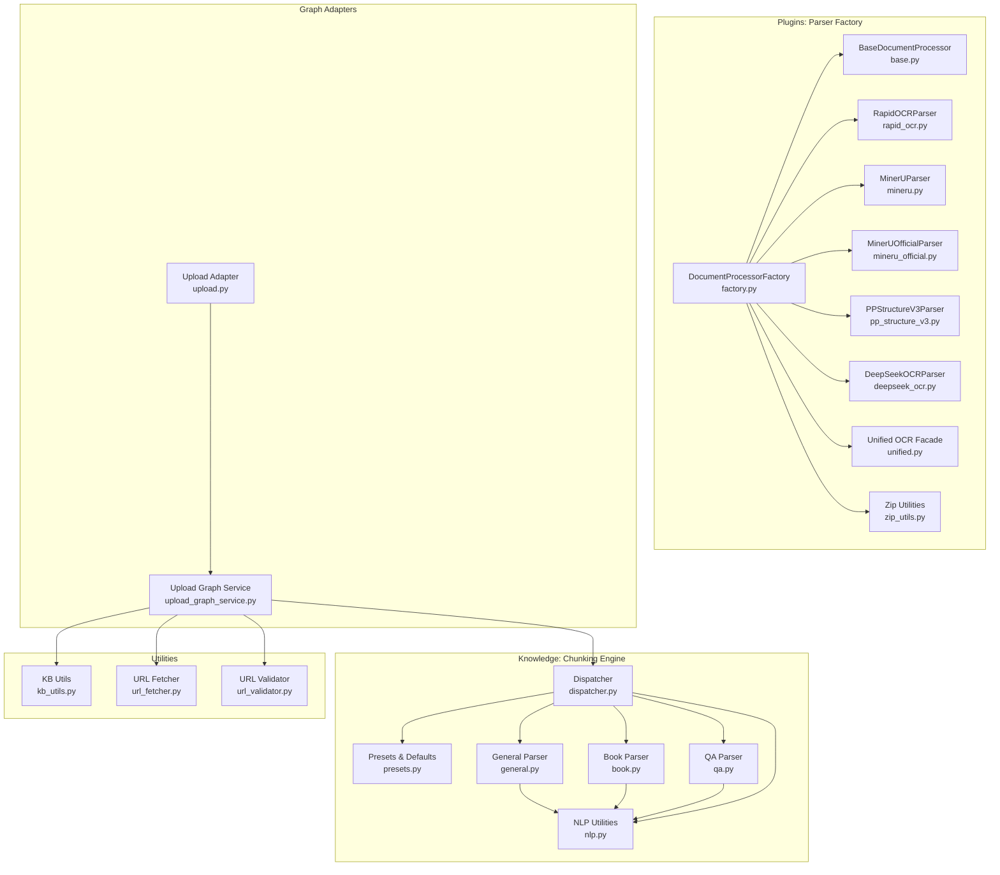
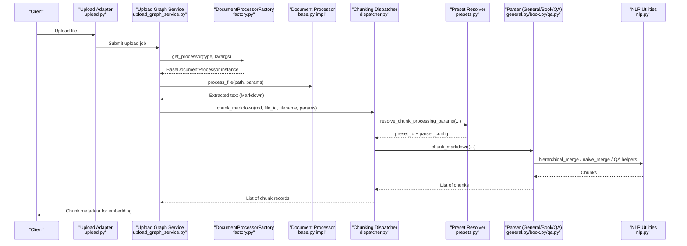
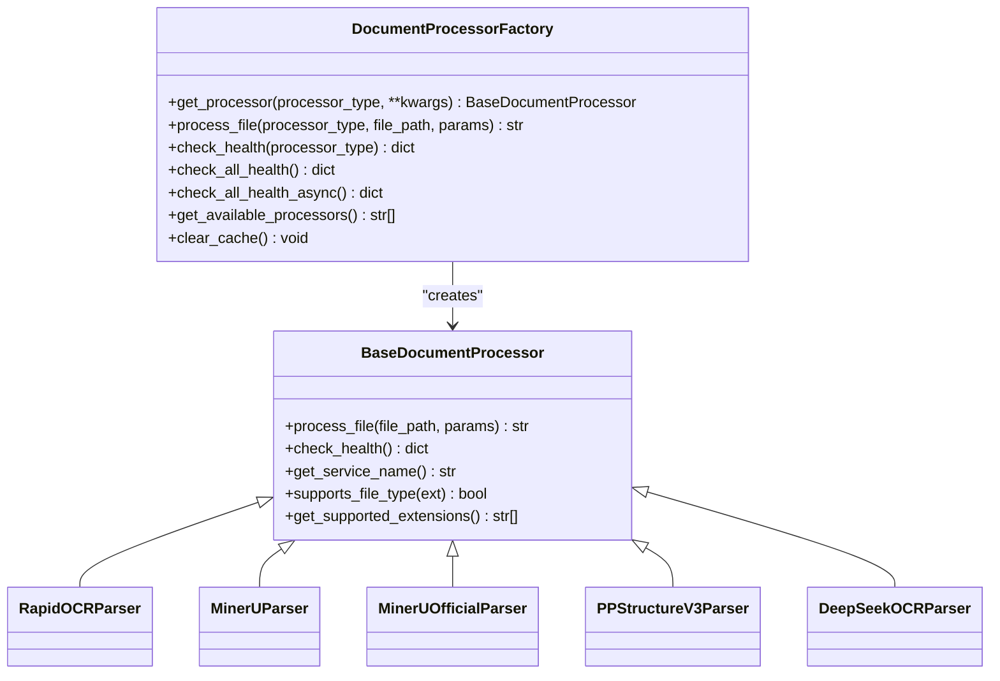
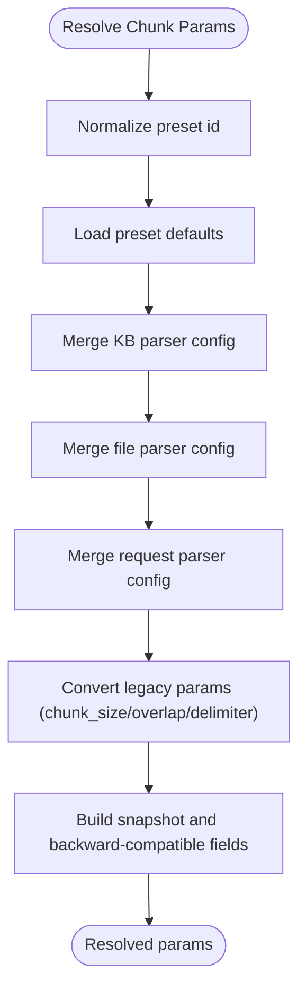
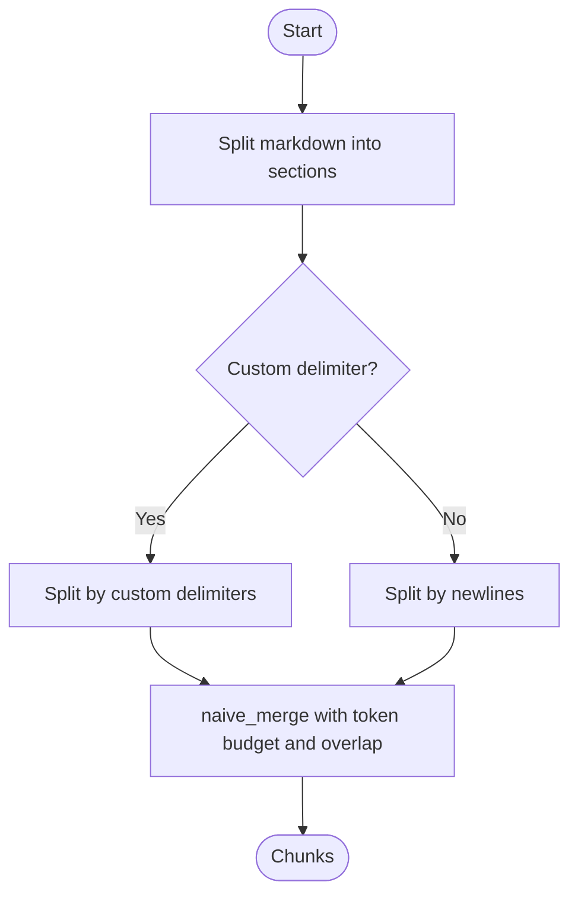
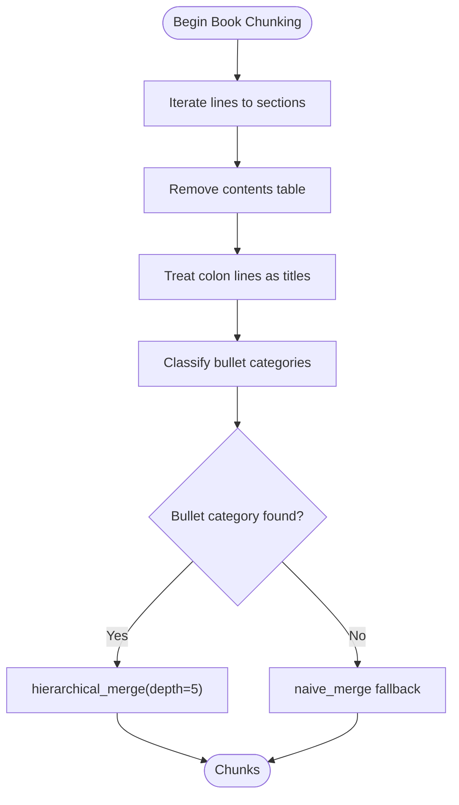
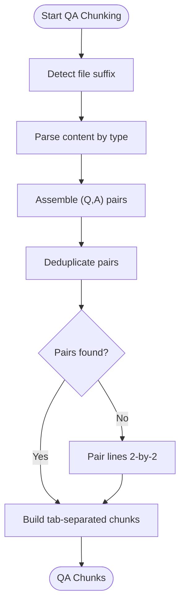
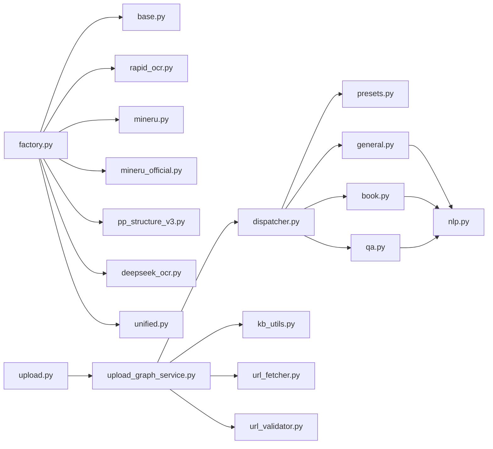

# Document Processing Pipeline

<cite>
**Referenced Files in This Document**
- [factory.py](file://backend/package/yuxi/plugins/parser/factory.py)
- [base.py](file://backend/package/yuxi/plugins/parser/base.py)
- [rapid_ocr.py](file://backend/package/yuxi/plugins/parser/rapid_ocr.py)
- [mineru.py](file://backend/package/yuxi/plugins/parser/mineru.py)
- [mineru_official.py](file://backend/package/yuxi/plugins/parser/mineru_official.py)
- [pp_structure_v3.py](file://backend/package/yuxi/plugins/parser/pp_structure_v3.py)
- [deepseek_ocr.py](file://backend/package/yuxi/plugins/parser/deepseek_ocr.py)
- [unified.py](file://backend/package/yuxi/plugins/parser/unified.py)
- [zip_utils.py](file://backend/package/yuxi/plugins/parser/zip_utils.py)
- [dispatcher.py](file://backend/package/yuxi/knowledge/chunking/ragflow_like/dispatcher.py)
- [presets.py](file://backend/package/yuxi/knowledge/chunking/ragflow_like/presets.py)
- [nlp.py](file://backend/package/yuxi/knowledge/chunking/ragflow_like/nlp.py)
- [general.py](file://backend/package/yuxi/knowledge/chunking/ragflow_like/parsers/general.py)
- [book.py](file://backend/package/yuxi/knowledge/chunking/ragflow_like/parsers/book.py)
- [qa.py](file://backend/package/yuxi/knowledge/chunking/ragflow_like/parsers/qa.py)
- [upload.py](file://backend/package/yuxi/knowledge/graphs/adapters/upload.py)
- [upload_graph_service.py](file://backend/package/yuxi/knowledge/graphs/upload_graph_service.py)
- [kb_utils.py](file://backend/package/yuxi/knowledge/utils/kb_utils.py)
- [url_fetcher.py](file://backend/package/yuxi/knowledge/utils/url_fetcher.py)
- [url_validator.py](file://backend/package/yuxi/knowledge/utils/url_validator.py)
- [filesystem_service.py](file://backend/package/yuxi/services/filesystem_service.py)
- [viewer_filesystem_service.py](file://backend/package/yuxi/services/viewer_filesystem_service.py)
- [knowledge_fs_service.py](file://backend/package/yuxi/services/knowledge_fs_service.py)
- [logger.py](file://backend/package/yuxi/utils/logging_config.py)
</cite>

## Table of Contents
1. [Introduction](#introduction)
2. [Project Structure](#project-structure)
3. [Core Components](#core-components)
4. [Architecture Overview](#architecture-overview)
5. [Detailed Component Analysis](#detailed-component-analysis)
6. [Dependency Analysis](#dependency-analysis)
7. [Performance Considerations](#performance-considerations)
8. [Troubleshooting Guide](#troubleshooting-guide)
9. [Conclusion](#conclusion)

## Introduction
This document explains the end-to-end document processing pipeline used to transform uploaded documents into vector-ready chunks. It covers:
- Multi-format ingestion and OCR support for PDF, Word, Markdown, HTML, and images
- A factory-driven plugin architecture for pluggable document processors
- Chunking strategies: sentence/paragraph-based and semantic-aware hierarchical merging
- Text preprocessing, NLP utilities, and content validation
- Practical configuration examples, performance tuning, memory management, batching, and error handling

## Project Structure
The pipeline spans two primary areas:
- Plugins: OCR/document parsing plugins and a factory to manage them
- Knowledge chunking: preset-driven chunking engine with parsers and NLP utilities

**Diagram sources**
- [factory.py:18-148](file://backend/package/yuxi/plugins/parser/factory.py#L18-L148)
- [base.py:44-100](file://backend/package/yuxi/plugins/parser/base.py#L44-L100)
- [dispatcher.py:1-65](file://backend/package/yuxi/knowledge/chunking/ragflow_like/dispatcher.py#L1-L65)
- [presets.py:1-239](file://backend/package/yuxi/knowledge/chunking/ragflow_like/presets.py#L1-L239)
- [nlp.py:1-535](file://backend/package/yuxi/knowledge/chunking/ragflow_like/nlp.py#L1-L535)
- [general.py:1-47](file://backend/package/yuxi/knowledge/chunking/ragflow_like/parsers/general.py#L1-L47)
- [book.py:1-62](file://backend/package/yuxi/knowledge/chunking/ragflow_like/parsers/book.py#L1-L62)
- [qa.py:1-261](file://backend/package/yuxi/knowledge/chunking/ragflow_like/parsers/qa.py#L1-L261)
- [upload.py:1-200](file://backend/package/yuxi/knowledge/graphs/adapters/upload.py#L1-L200)
- [upload_graph_service.py:1-200](file://backend/package/yuxi/knowledge/graphs/upload_graph_service.py#L1-L200)
- [kb_utils.py:1-200](file://backend/package/yuxi/knowledge/utils/kb_utils.py#L1-L200)
- [url_fetcher.py:1-200](file://backend/package/yuxi/knowledge/utils/url_fetcher.py#L1-L200)
- [url_validator.py:1-200](file://backend/package/yuxi/knowledge/utils/url_validator.py#L1-L200)

**Section sources**
- [factory.py:18-148](file://backend/package/yuxi/plugins/parser/factory.py#L18-L148)
- [dispatcher.py:1-65](file://backend/package/yuxi/knowledge/chunking/ragflow_like/dispatcher.py#L1-L65)

## Core Components
- Plugin Factory: Creates and caches processor instances, exposes health checks, and provides convenience methods for processing files.
- Base Processor Interface: Defines the contract for all OCR/document parsers.
- Chunking Dispatcher: Routes markdown content to appropriate parsers based on preset IDs and builds chunk records.
- Preset Engine: Normalizes chunking presets, merges defaults and overrides, and resolves effective parameters.
- NLP Utilities: Token counting, heading detection, bullet categorization, hierarchical merging, and QA pair extraction.
- Parsers: General, Book, and QA-specific chunkers that leverage NLP utilities.

**Section sources**
- [factory.py:18-148](file://backend/package/yuxi/plugins/parser/factory.py#L18-L148)
- [base.py:44-100](file://backend/package/yuxi/plugins/parser/base.py#L44-L100)
- [dispatcher.py:32-65](file://backend/package/yuxi/knowledge/chunking/ragflow_like/dispatcher.py#L32-L65)
- [presets.py:79-214](file://backend/package/yuxi/knowledge/chunking/ragflow_like/presets.py#L79-L214)
- [nlp.py:49-535](file://backend/package/yuxi/knowledge/chunking/ragflow_like/nlp.py#L49-L535)
- [general.py:33-47](file://backend/package/yuxi/knowledge/chunking/ragflow_like/parsers/general.py#L33-L47)
- [book.py:26-62](file://backend/package/yuxi/knowledge/chunking/ragflow_like/parsers/book.py#L26-L62)
- [qa.py:213-261](file://backend/package/yuxi/knowledge/chunking/ragflow_like/parsers/qa.py#L213-L261)

## Architecture Overview
The pipeline transforms raw files into structured, chunked text suitable for embedding and retrieval.

**Diagram sources**
- [upload.py:1-200](file://backend/package/yuxi/knowledge/graphs/adapters/upload.py#L1-L200)
- [upload_graph_service.py:1-200](file://backend/package/yuxi/knowledge/graphs/upload_graph_service.py#L1-L200)
- [factory.py:46-94](file://backend/package/yuxi/plugins/parser/factory.py#L46-L94)
- [dispatcher.py:49-65](file://backend/package/yuxi/knowledge/chunking/ragflow_like/dispatcher.py#L49-L65)
- [presets.py:161-213](file://backend/package/yuxi/knowledge/chunking/ragflow_like/presets.py#L161-L213)
- [general.py:33-47](file://backend/package/yuxi/knowledge/chunking/ragflow_like/parsers/general.py#L33-L47)
- [book.py:26-62](file://backend/package/yuxi/knowledge/chunking/ragflow_like/parsers/book.py#L26-L62)
- [qa.py:213-261](file://backend/package/yuxi/knowledge/chunking/ragflow_like/parsers/qa.py#L213-L261)
- [nlp.py:411-482](file://backend/package/yuxi/knowledge/chunking/ragflow_like/nlp.py#L411-L482)

## Detailed Component Analysis

### Plugin Factory and Base Interface
- Factory manages processor lifecycle via a cache keyed by type and parameters. It supports health checks and async health polling.
- Base interface defines the contract for OCR/document parsers, including health checks and supported file extensions.

**Diagram sources**
- [base.py:44-100](file://backend/package/yuxi/plugins/parser/base.py#L44-L100)
- [factory.py:18-148](file://backend/package/yuxi/plugins/parser/factory.py#L18-L148)
- [rapid_ocr.py:1-200](file://backend/package/yuxi/plugins/parser/rapid_ocr.py#L1-L200)
- [mineru.py:1-200](file://backend/package/yuxi/plugins/parser/mineru.py#L1-L200)
- [mineru_official.py:1-200](file://backend/package/yuxi/plugins/parser/mineru_official.py#L1-L200)
- [pp_structure_v3.py:1-200](file://backend/package/yuxi/plugins/parser/pp_structure_v3.py#L1-L200)
- [deepseek_ocr.py:1-200](file://backend/package/yuxi/plugins/parser/deepseek_ocr.py#L1-L200)

**Section sources**
- [factory.py:18-148](file://backend/package/yuxi/plugins/parser/factory.py#L18-L148)
- [base.py:44-100](file://backend/package/yuxi/plugins/parser/base.py#L44-L100)

### Multi-format Support and OCR Capabilities
- Supported formats are determined by each processor’s extension list. The factory exposes a unified interface to select and reuse processors.
- OCR backends include local and cloud APIs:
  - Local OCR: RapidOCR
  - HTTP API: MinerU
  - Official cloud API: MinerU Official
  - PP-Structure-V3 layout understanding
  - DeepSeek-OCR via external API
- A unified facade consolidates OCR behavior for downstream chunking.

Practical notes:
- Choose processor based on accuracy vs latency trade-offs.
- Use cache clearing when changing OCR configurations.

**Section sources**
- [factory.py:22-28](file://backend/package/yuxi/plugins/parser/factory.py#L22-L28)
- [factory.py:139-148](file://backend/package/yuxi/plugins/parser/factory.py#L139-L148)
- [unified.py:1-200](file://backend/package/yuxi/plugins/parser/unified.py#L1-L200)

### Chunking Strategies and Presets
- Preset IDs: general, qa, book, laws.
- Defaults include token budgets, delimiters, overlapped percentages, and optional graph features.
- Parameter resolution merges knowledge base defaults, per-file overrides, and request-time parameters.

**Diagram sources**
- [presets.py:161-213](file://backend/package/yuxi/knowledge/chunking/ragflow_like/presets.py#L161-L213)

**Section sources**
- [presets.py:8-66](file://backend/package/yuxi/knowledge/chunking/ragflow_like/presets.py#L8-L66)
- [presets.py:161-213](file://backend/package/yuxi/knowledge/chunking/ragflow_like/presets.py#L161-L213)

### Sentence-based and Paragraph-based Chunking
- General parser splits on custom delimiters or falls back to newline-based sections, then merges tokens within budget and optional overlap.
- Uses token counting and optional custom delimiter extraction.

**Diagram sources**
- [general.py:12-47](file://backend/package/yuxi/knowledge/chunking/ragflow_like/parsers/general.py#L12-L47)
- [nlp.py:411-482](file://backend/package/yuxi/knowledge/chunking/ragflow_like/nlp.py#L411-L482)

**Section sources**
- [general.py:33-47](file://backend/package/yuxi/knowledge/chunking/ragflow_like/parsers/general.py#L33-L47)
- [nlp.py:411-482](file://backend/package/yuxi/knowledge/chunking/ragflow_like/nlp.py#L411-L482)

### Semantic Chunking (Hierarchical Merging)
- Detects heading-like bullet patterns and languages, removes table of contents, normalizes colon-as-title cases, and performs hierarchical merging by inferred depth.
- Falls back to naive merge if no strong hierarchy detected.

**Diagram sources**
- [book.py:26-62](file://backend/package/yuxi/knowledge/chunking/ragflow_like/parsers/book.py#L26-L62)
- [nlp.py:187-401](file://backend/package/yuxi/knowledge/chunking/ragflow_like/nlp.py#L187-L401)

**Section sources**
- [book.py:26-62](file://backend/package/yuxi/knowledge/chunking/ragflow_like/parsers/book.py#L26-L62)
- [nlp.py:187-401](file://backend/package/yuxi/knowledge/chunking/ragflow_like/nlp.py#L187-L401)

### QA-focused Chunking
- Extracts question-answer pairs from CSV/XLSX/Markdown/TXT/DOCX by:
  - Parsing markdown tables
  - Detecting heading-based Q&A
  - Prefix-based extraction (Q/A markers)
  - Delimiter-based splitting
  - Final deduplication and fallback pairing
- Outputs tab-separated QA chunks.

**Diagram sources**
- [qa.py:213-261](file://backend/package/yuxi/knowledge/chunking/ragflow_like/parsers/qa.py#L213-L261)

**Section sources**
- [qa.py:213-261](file://backend/package/yuxi/knowledge/chunking/ragflow_like/parsers/qa.py#L213-L261)

### Text Preprocessing and Validation
- Token estimation avoids heavy dependencies by splitting on words/CJK and digits.
- Heading heuristics and bullet classification improve semantic grouping.
- Content table removal and colon-as-title normalization reduce noise.
- QA-specific validations ensure non-empty, non-duplicated pairs.

**Section sources**
- [nlp.py:49-116](file://backend/package/yuxi/knowledge/chunking/ragflow_like/nlp.py#L49-L116)
- [nlp.py:187-244](file://backend/package/yuxi/knowledge/chunking/ragflow_like/nlp.py#L187-L244)
- [qa.py:195-211](file://backend/package/yuxi/knowledge/chunking/ragflow_like/parsers/qa.py#L195-L211)

### Practical Configuration Examples
- Select preset:
  - Use general for most documents; book for long-form texts; qa for FAQ-like content; laws for regulatory content.
- Configure chunk size and overlap:
  - Set token budget and overlap percentage; the resolver converts legacy fields and computes derived values.
- Delimiter customization:
  - Provide custom delimiters for general chunking; QA parsers auto-detect separators or rely on markdown headings.
- Enable/disable auxiliary features:
  - GraphRAG and RAPTOR toggles are preset-scoped; adjust via parser config merges.

**Section sources**
- [presets.py:161-213](file://backend/package/yuxi/knowledge/chunking/ragflow_like/presets.py#L161-L213)
- [general.py:33-47](file://backend/package/yuxi/knowledge/chunking/ragflow_like/parsers/general.py#L33-L47)
- [book.py:26-62](file://backend/package/yuxi/knowledge/chunking/ragflow_like/parsers/book.py#L26-L62)
- [qa.py:213-261](file://backend/package/yuxi/knowledge/chunking/ragflow_like/parsers/qa.py#L213-L261)

## Dependency Analysis
- Factory depends on Base interface and concrete processors; it caches instances to avoid repeated initialization.
- Dispatcher depends on presets and parsers; parsers depend on NLP utilities.
- Graph adapters orchestrate upload and chunking; utilities support URL fetching/validation and KB operations.

**Diagram sources**
- [factory.py:18-148](file://backend/package/yuxi/plugins/parser/factory.py#L18-L148)
- [dispatcher.py:1-65](file://backend/package/yuxi/knowledge/chunking/ragflow_like/dispatcher.py#L1-L65)
- [presets.py:1-239](file://backend/package/yuxi/knowledge/chunking/ragflow_like/presets.py#L1-L239)
- [nlp.py:1-535](file://backend/package/yuxi/knowledge/chunking/ragflow_like/nlp.py#L1-L535)
- [upload.py:1-200](file://backend/package/yuxi/knowledge/graphs/adapters/upload.py#L1-L200)
- [upload_graph_service.py:1-200](file://backend/package/yuxi/knowledge/graphs/upload_graph_service.py#L1-L200)

**Section sources**
- [factory.py:18-148](file://backend/package/yuxi/plugins/parser/factory.py#L18-L148)
- [dispatcher.py:1-65](file://backend/package/yuxi/knowledge/chunking/ragflow_like/dispatcher.py#L1-L65)

## Performance Considerations
- Processor caching: Reuse cached instances to avoid repeated initialization overhead.
- Async health checks: Poll multiple OCR backends concurrently to detect availability quickly.
- Token budget tuning: Adjust chunk_token_num and overlapped_percent to balance recall and embedding costs.
- Memory management:
  - Prefer streaming or chunked processing for large files.
  - Avoid retaining intermediate markdown buffers longer than necessary.
- Batching:
  - Group uploads by similar presets to maximize cache hits.
  - Batch health checks and OCR requests where supported by the underlying services.
- Logging: Use structured logs to track OCR latency, chunk sizes, and failures.

[No sources needed since this section provides general guidance]

## Troubleshooting Guide
- Processor selection errors:
  - Ensure the requested processor type is registered in the factory mapping.
- Health check failures:
  - Inspect returned status and details; the factory wraps exceptions into health dictionaries.
- OCR failures:
  - Verify credentials and endpoints for cloud OCR services; retry with local OCR as fallback.
- Chunking anomalies:
  - Adjust delimiter and token budget; for books, ensure sufficient content after TOC removal.
  - For QA, confirm presence of Q/A markers or delimiter consistency.
- Logging:
  - Use the configured logger to capture processor messages and exceptions.

**Section sources**
- [factory.py:65-66](file://backend/package/yuxi/plugins/parser/factory.py#L65-L66)
- [factory.py:107-115](file://backend/package/yuxi/plugins/parser/factory.py#L107-L115)
- [base.py:11-42](file://backend/package/yuxi/plugins/parser/base.py#L11-L42)
- [logger.py:1-200](file://backend/package/yuxi/utils/logging_config.py#L1-L200)

## Conclusion
The pipeline integrates a flexible plugin architecture for OCR/document parsing with a robust, preset-driven chunking engine. By leveraging sentence/paragraph-based and semantic-aware hierarchical merging, it prepares diverse document types for embedding and retrieval. Proper configuration of chunking parameters, careful selection of OCR backends, and attention to memory and batching yield reliable, scalable processing.