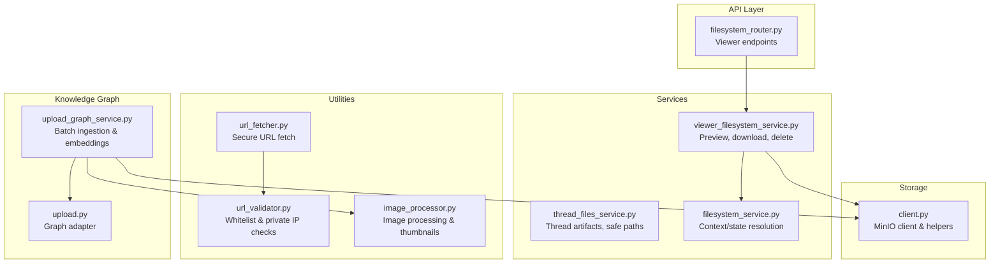
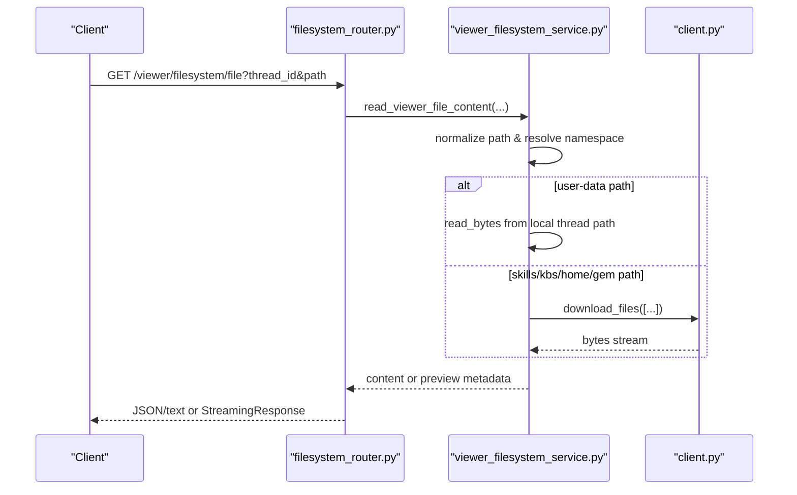
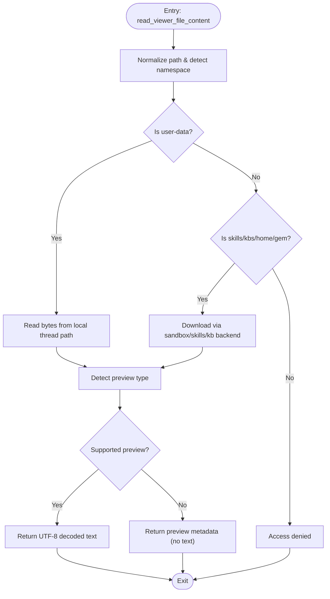
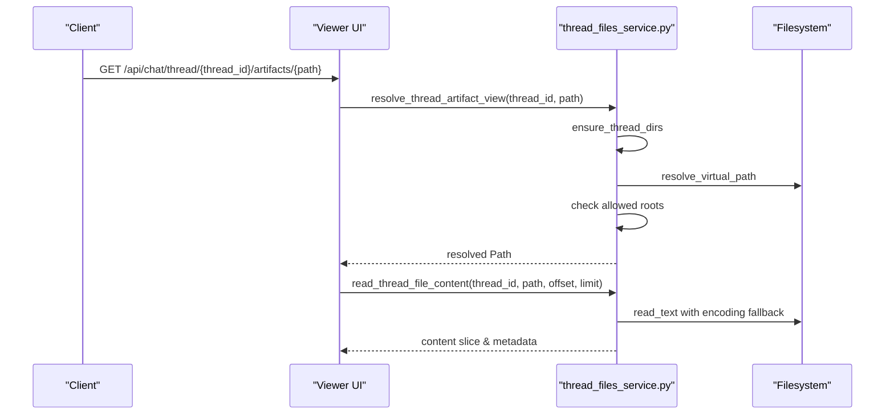
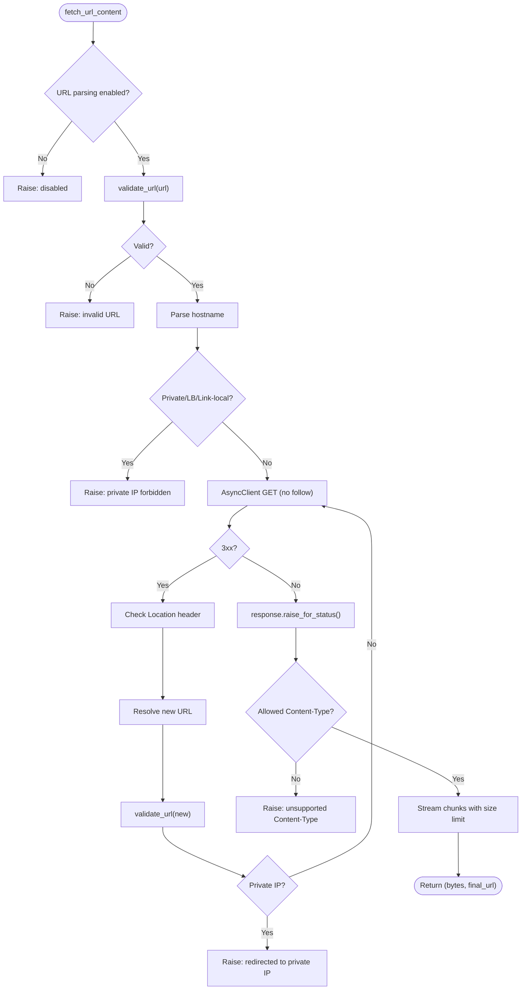
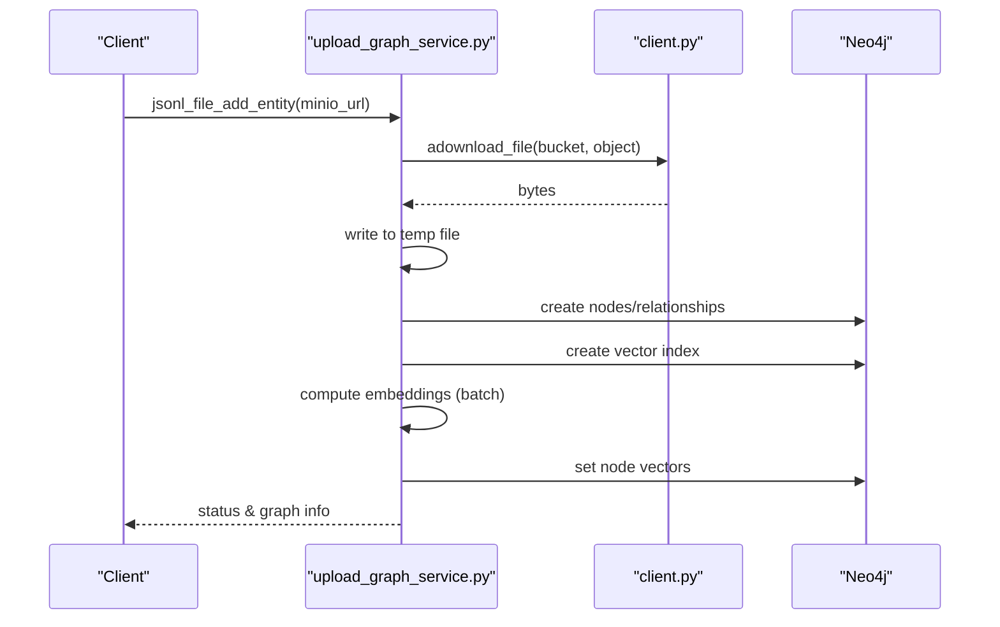
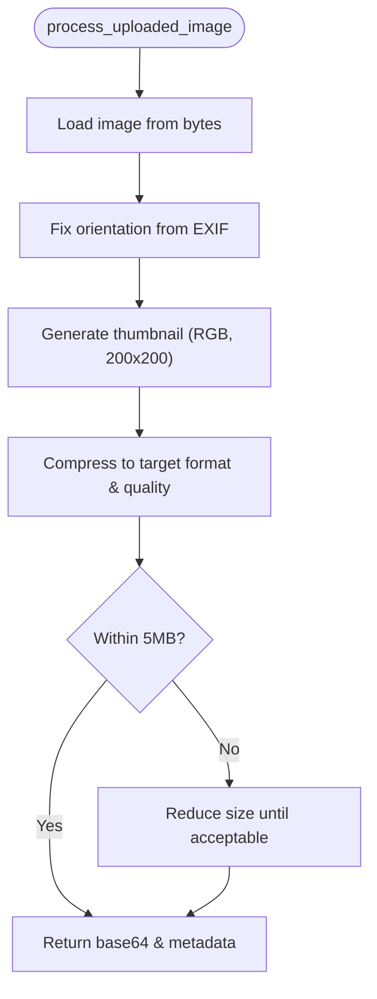
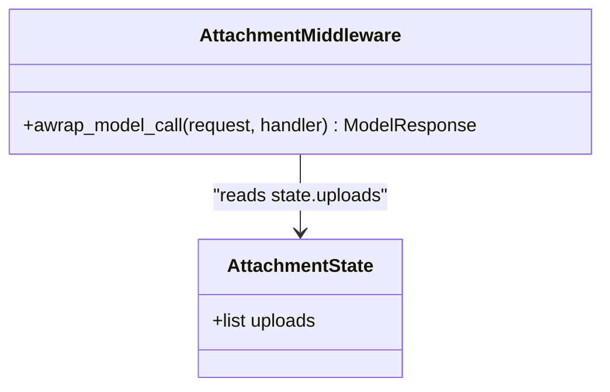
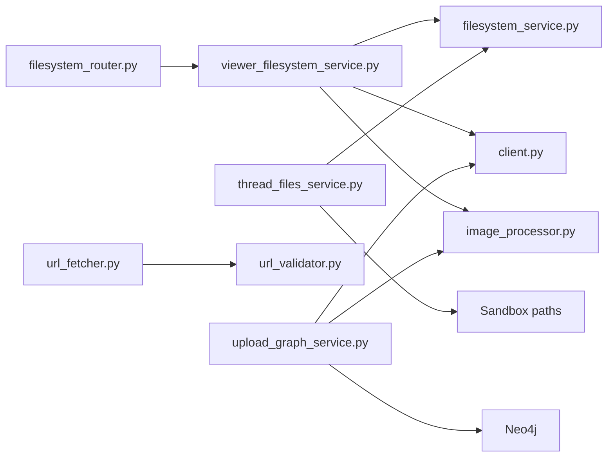

# File Upload and Management

<cite>
**Referenced Files in This Document**
- [filesystem_service.py](file://backend/package/yuxi/services/filesystem_service.py)
- [thread_files_service.py](file://backend/package/yuxi/services/thread_files_service.py)
- [viewer_filesystem_service.py](file://backend/package/yuxi/services/viewer_filesystem_service.py)
- [filesystem_router.py](file://backend/server/routers/filesystem_router.py)
- [url_fetcher.py](file://backend/package/yuxi/knowledge/utils/url_fetcher.py)
- [url_validator.py](file://backend/package/yuxi/knowledge/utils/url_validator.py)
- [upload_graph_service.py](file://backend/package/yuxi/knowledge/graphs/upload_graph_service.py)
- [upload.py](file://backend/package/yuxi/knowledge/graphs/adapters/upload.py)
- [image_processor.py](file://backend/package/yuxi/utils/image_processor.py)
- [client.py](file://backend/package/yuxi/storage/minio/client.py)
- [knowledge_file_repository.py](file://backend/package/yuxi/repositories/knowledge_file_repository.py)
- [attachment_middleware.py](file://backend/package/yuxi/agents/middlewares/attachment_middleware.py)
</cite>

## Table of Contents
1. [Introduction](#introduction)
2. [Project Structure](#project-structure)
3. [Core Components](#core-components)
4. [Architecture Overview](#architecture-overview)
5. [Detailed Component Analysis](#detailed-component-analysis)
6. [Dependency Analysis](#dependency-analysis)
7. [Performance Considerations](#performance-considerations)
8. [Troubleshooting Guide](#troubleshooting-guide)
9. [Conclusion](#conclusion)
10. [Appendices](#appendices)

## Introduction
This document explains the file upload and management system across the backend. It covers:
- Direct file uploads and ingestion via MinIO
- URL-based content ingestion with security validation and streaming
- Batch processing for knowledge graph entities
- Thread-safe file management for concurrent operations and artifact handling
- Preview and metadata extraction for supported formats
- Security controls for access, content sanitization, and external URL handling
- Performance optimization strategies for large files and progress tracking
- Examples for integrating custom handlers and external storage systems

## Project Structure
The file management system spans services, routers, utilities, and storage clients:
- Services expose read-only viewer APIs and thread-scoped artifact management
- Routers define REST endpoints for viewer operations
- Utilities implement URL fetching/validation and image processing
- Storage client integrates MinIO for object storage and batch downloads
- Knowledge graph services orchestrate ingestion and vector indexing

**Diagram sources**
- [filesystem_router.py:1-98](file://backend/server/routers/filesystem_router.py#L1-L98)
- [viewer_filesystem_service.py:1-582](file://backend/package/yuxi/services/viewer_filesystem_service.py#L1-L582)
- [thread_files_service.py:1-292](file://backend/package/yuxi/services/thread_files_service.py#L1-L292)
- [filesystem_service.py:1-164](file://backend/package/yuxi/services/filesystem_service.py#L1-L164)
- [url_fetcher.py:1-143](file://backend/package/yuxi/knowledge/utils/url_fetcher.py#L1-L143)
- [url_validator.py:1-88](file://backend/package/yuxi/knowledge/utils/url_validator.py#L1-L88)
- [image_processor.py:1-208](file://backend/package/yuxi/utils/image_processor.py#L1-L208)
- [client.py:1-455](file://backend/package/yuxi/storage/minio/client.py#L1-L455)
- [upload_graph_service.py:1-778](file://backend/package/yuxi/knowledge/graphs/upload_graph_service.py#L1-L778)
- [upload.py:1-123](file://backend/package/yuxi/knowledge/graphs/adapters/upload.py#L1-L123)

**Section sources**
- [filesystem_router.py:1-98](file://backend/server/routers/filesystem_router.py#L1-L98)
- [viewer_filesystem_service.py:1-582](file://backend/package/yuxi/services/viewer_filesystem_service.py#L1-L582)
- [thread_files_service.py:1-292](file://backend/package/yuxi/services/thread_files_service.py#L1-L292)
- [filesystem_service.py:1-164](file://backend/package/yuxi/services/filesystem_service.py#L1-L164)
- [url_fetcher.py:1-143](file://backend/package/yuxi/knowledge/utils/url_fetcher.py#L1-L143)
- [url_validator.py:1-88](file://backend/package/yuxi/knowledge/utils/url_validator.py#L1-L88)
- [image_processor.py:1-208](file://backend/package/yuxi/utils/image_processor.py#L1-L208)
- [client.py:1-455](file://backend/package/yuxi/storage/minio/client.py#L1-L455)
- [upload_graph_service.py:1-778](file://backend/package/yuxi/knowledge/graphs/upload_graph_service.py#L1-L778)
- [upload.py:1-123](file://backend/package/yuxi/knowledge/graphs/adapters/upload.py#L1-L123)

## Core Components
- Viewer filesystem service: lists, previews, downloads, and deletes files within controlled namespaces; detects preview types and enforces safe paths
- Thread files service: manages thread-scoped artifacts, ensures safe virtual-to-physical path resolution, and exposes artifact URLs
- Filesystem base service: resolves runtime context and sandbox backends for thread-aware operations
- URL fetcher and validator: secure HTTP fetching with size limits, content-type checks, redirect handling, and private IP blocking
- MinIO client: asynchronous upload/download, presigned URLs, and safe temporary file handling
- Knowledge graph upload service: batch ingestion from JSONL/MinIO URLs, vector indexing, and embedding computation
- Image processor: format validation, orientation fix, thumbnail generation, compression, and metadata extraction
- Attachment middleware: injects readable file paths into agent prompts for on-demand reading

**Section sources**
- [viewer_filesystem_service.py:93-134](file://backend/package/yuxi/services/viewer_filesystem_service.py#L93-L134)
- [thread_files_service.py:23-292](file://backend/package/yuxi/services/thread_files_service.py#L23-L292)
- [filesystem_service.py:20-71](file://backend/package/yuxi/services/filesystem_service.py#L20-L71)
- [url_fetcher.py:37-143](file://backend/package/yuxi/knowledge/utils/url_fetcher.py#L37-L143)
- [url_validator.py:19-88](file://backend/package/yuxi/knowledge/utils/url_validator.py#L19-L88)
- [client.py:109-252](file://backend/package/yuxi/storage/minio/client.py#L109-L252)
- [upload_graph_service.py:86-143](file://backend/package/yuxi/knowledge/graphs/upload_graph_service.py#L86-L143)
- [image_processor.py:26-77](file://backend/package/yuxi/utils/image_processor.py#L26-L77)
- [attachment_middleware.py:21-90](file://backend/package/yuxi/agents/middlewares/attachment_middleware.py#L21-L90)

## Architecture Overview
The system separates concerns across viewer APIs, thread-scoped artifacts, secure URL ingestion, and knowledge graph processing. Viewer APIs operate within controlled namespaces and enforce safe paths. Thread artifacts are isolated per thread and user. URL ingestion validates domains and blocks private IPs. Knowledge graph ingestion supports batch processing and vector indexing.

**Diagram sources**
- [filesystem_router.py:43-59](file://backend/server/routers/filesystem_router.py#L43-L59)
- [viewer_filesystem_service.py:379-473](file://backend/package/yuxi/services/viewer_filesystem_service.py#L379-L473)
- [client.py:196-223](file://backend/package/yuxi/storage/minio/client.py#L196-L223)

## Detailed Component Analysis

### Viewer Filesystem Service
Responsibilities:
- Normalize and validate paths within viewer namespaces
- Detect preview types for images, PDFs, markdown, and text
- Enforce allowed roots for user-data and thread workspace
- Stream downloads and return previews for supported formats
- Delete files under constraints

Key behaviors:
- Preview detection uses suffix, MIME type, and magic bytes
- Safe path resolution prevents traversal outside allowed roots
- StreamingResponse used for binary downloads

**Diagram sources**
- [viewer_filesystem_service.py:379-473](file://backend/package/yuxi/services/viewer_filesystem_service.py#L379-L473)
- [viewer_filesystem_service.py:93-134](file://backend/package/yuxi/services/viewer_filesystem_service.py#L93-L134)

**Section sources**
- [viewer_filesystem_service.py:93-134](file://backend/package/yuxi/services/viewer_filesystem_service.py#L93-L134)
- [viewer_filesystem_service.py:379-473](file://backend/package/yuxi/services/viewer_filesystem_service.py#L379-L473)
- [viewer_filesystem_service.py:475-540](file://backend/package/yuxi/services/viewer_filesystem_service.py#L475-L540)
- [viewer_filesystem_service.py:542-582](file://backend/package/yuxi/services/viewer_filesystem_service.py#L542-L582)

### Thread Files Service
Responsibilities:
- List thread-scoped files recursively or non-recursively
- Read text content with offset/limit windowing
- Resolve artifacts safely and expose artifact URLs
- Save artifacts to workspace with collision-free naming

Thread-safety and isolation:
- Ensures thread/user directories exist
- Virtual-to-physical path resolution with allowed roots
- Artifact URL construction for downstream viewers

**Diagram sources**
- [thread_files_service.py:198-232](file://backend/package/yuxi/services/thread_files_service.py#L198-L232)
- [thread_files_service.py:159-195](file://backend/package/yuxi/services/thread_files_service.py#L159-L195)

**Section sources**
- [thread_files_service.py:29-78](file://backend/package/yuxi/services/thread_files_service.py#L29-L78)
- [thread_files_service.py:159-195](file://backend/package/yuxi/services/thread_files_service.py#L159-L195)
- [thread_files_service.py:198-232](file://backend/package/yuxi/services/thread_files_service.py#L198-L232)
- [thread_files_service.py:234-264](file://backend/package/yuxi/services/thread_files_service.py#L234-L264)

### URL Fetching and Validation
Capabilities:
- Secure HTTP fetching with size limits and allowed content types
- Redirect handling with validation at each hop
- Private IP and loopback/link-local blocking
- Whitelist-based domain validation

**Diagram sources**
- [url_fetcher.py:37-143](file://backend/package/yuxi/knowledge/utils/url_fetcher.py#L37-L143)
- [url_validator.py:19-88](file://backend/package/yuxi/knowledge/utils/url_validator.py#L19-L88)

**Section sources**
- [url_fetcher.py:37-143](file://backend/package/yuxi/knowledge/utils/url_fetcher.py#L37-L143)
- [url_validator.py:19-88](file://backend/package/yuxi/knowledge/utils/url_validator.py#L19-L88)

### Knowledge Graph Upload Service
Capabilities:
- Ingest JSONL triples from MinIO URLs
- Create vector index and compute embeddings for entities
- Batch processing with configurable batch sizes
- Query entities with vector similarity and fuzzy matching

**Diagram sources**
- [upload_graph_service.py:86-143](file://backend/package/yuxi/knowledge/graphs/upload_graph_service.py#L86-L143)
- [upload_graph_service.py:145-316](file://backend/package/yuxi/knowledge/graphs/upload_graph_service.py#L145-L316)
- [client.py:211-223](file://backend/package/yuxi/storage/minio/client.py#L211-L223)

**Section sources**
- [upload_graph_service.py:86-143](file://backend/package/yuxi/knowledge/graphs/upload_graph_service.py#L86-L143)
- [upload_graph_service.py:145-316](file://backend/package/yuxi/knowledge/graphs/upload_graph_service.py#L145-L316)
- [upload_graph_service.py:525-610](file://backend/package/yuxi/knowledge/graphs/upload_graph_service.py#L525-L610)

### Image Processing and Thumbnails
Capabilities:
- Validate image format and EXIF orientation
- Generate JPEG thumbnails and compress images
- Enforce maximum file size thresholds
- Extract metadata (dimensions, MIME type)

**Diagram sources**
- [image_processor.py:26-77](file://backend/package/yuxi/utils/image_processor.py#L26-L77)
- [image_processor.py:106-131](file://backend/package/yuxi/utils/image_processor.py#L106-L131)
- [image_processor.py:132-190](file://backend/package/yuxi/utils/image_processor.py#L132-L190)

**Section sources**
- [image_processor.py:26-77](file://backend/package/yuxi/utils/image_processor.py#L26-L77)
- [image_processor.py:106-131](file://backend/package/yuxi/utils/image_processor.py#L106-L131)
- [image_processor.py:132-190](file://backend/package/yuxi/utils/image_processor.py#L132-L190)

### Attachment Middleware for Agents
Purpose:
- Inject readable file paths from state into agent prompts
- Prevent duplicate injection markers
- Support on-demand file reading via tools

**Diagram sources**
- [attachment_middleware.py:21-90](file://backend/package/yuxi/agents/middlewares/attachment_middleware.py#L21-L90)

**Section sources**
- [attachment_middleware.py:21-90](file://backend/package/yuxi/agents/middlewares/attachment_middleware.py#L21-L90)

## Dependency Analysis
- Viewer filesystem depends on:
  - Filesystem base service for runtime context
  - MinIO client for remote content
  - Image processor for preview metadata
- Thread files service depends on:
  - Sandbox virtual path resolution
  - Thread/workspace directories
- URL fetcher depends on:
  - URL validator for whitelisting
  - httpx for async fetching
- Knowledge graph service depends on:
  - MinIO client for JSONL downloads
  - Embedding models for vector indexing
  - Neo4j for graph operations

**Diagram sources**
- [viewer_filesystem_service.py:25-28](file://backend/package/yuxi/services/viewer_filesystem_service.py#L25-L28)
- [filesystem_service.py:17-20](file://backend/package/yuxi/services/filesystem_service.py#L17-L20)
- [url_fetcher.py:7-8](file://backend/package/yuxi/knowledge/utils/url_fetcher.py#L7-L8)
- [upload_graph_service.py:11-12](file://backend/package/yuxi/knowledge/graphs/upload_graph_service.py#L11-L12)

**Section sources**
- [viewer_filesystem_service.py:1-582](file://backend/package/yuxi/services/viewer_filesystem_service.py#L1-L582)
- [thread_files_service.py:1-292](file://backend/package/yuxi/services/thread_files_service.py#L1-L292)
- [url_fetcher.py:1-143](file://backend/package/yuxi/knowledge/utils/url_fetcher.py#L1-L143)
- [upload_graph_service.py:1-778](file://backend/package/yuxi/knowledge/graphs/upload_graph_service.py#L1-L778)

## Performance Considerations
- Asynchronous I/O
  - Use asyncio.to_thread for CPU-bound tasks and blocking I/O
  - Prefer streaming responses for large downloads
- Memory efficiency
  - Stream URL content with size limits
  - Windowed reads for large text files
- Vector indexing and batching
  - Batch embedding computation with configurable batch sizes
  - Limit batch sizes to control memory footprint
- Thumbnails and compression
  - Generate thumbnails on demand
  - Compress images to reduce payload sizes

[No sources needed since this section provides general guidance]

## Troubleshooting Guide
Common issues and resolutions:
- Access denied for viewer paths
  - Ensure path is within allowed roots and normalized
  - Verify namespace prefixes (user-data, skills, kbs)
- Private IP or invalid URL
  - Confirm domain is whitelisted and not private/loopback/link-local
  - Review redirect chain and final URL validation
- Unsupported content type or binary files
  - Only specific content types are allowed for URL ingestion
  - Binary files cannot be previewed as text
- File not found or directory errors
  - Confirm path normalization and existence
  - For downloads, ensure path is a file, not a directory
- MinIO errors
  - Check bucket existence and public read policies
  - Validate presigned URLs and object names

**Section sources**
- [viewer_filesystem_service.py:371-377](file://backend/package/yuxi/services/viewer_filesystem_service.py#L371-L377)
- [viewer_filesystem_service.py:434-438](file://backend/package/yuxi/services/viewer_filesystem_service.py#L434-L438)
- [url_fetcher.py:137-143](file://backend/package/yuxi/knowledge/utils/url_fetcher.py#L137-L143)
- [url_validator.py:54-71](file://backend/package/yuxi/knowledge/utils/url_validator.py#L54-L71)
- [client.py:109-135](file://backend/package/yuxi/storage/minio/client.py#L109-L135)

## Conclusion
The system provides a robust, secure, and scalable foundation for file upload and management:
- Viewer APIs offer safe, namespace-controlled access to files
- Thread-scoped artifacts isolate concurrent operations
- URL ingestion is secured with validation and streaming
- Knowledge graph ingestion supports batch processing and embeddings
- Image processing and thumbnails improve UX and performance
- Integration with MinIO enables efficient object storage and retrieval

[No sources needed since this section summarizes without analyzing specific files]

## Appendices

### Security Considerations
- Path validation and allowed roots
  - Restrict access to user-data, workspace, and thread-specific directories
- URL ingestion safeguards
  - Domain whitelist, private IP blocking, and content-type restrictions
- Content sanitization
  - Preview detection avoids rendering unsafe binaries
- Access control
  - Thread and user scoping for artifacts
  - Presigned URLs for controlled access

**Section sources**
- [viewer_filesystem_service.py:151-160](file://backend/package/yuxi/services/viewer_filesystem_service.py#L151-L160)
- [url_fetcher.py:51-62](file://backend/package/yuxi/knowledge/utils/url_fetcher.py#L51-L62)
- [url_validator.py:54-71](file://backend/package/yuxi/knowledge/utils/url_validator.py#L54-L71)
- [client.py:225-230](file://backend/package/yuxi/storage/minio/client.py#L225-L230)

### Examples and Integration Notes
- Custom file handlers
  - Extend preview detection in viewer service for new formats
  - Add new MIME types and signatures in preview detection logic
- External storage integration
  - Implement a new storage client with upload/download/presigned URL methods
  - Integrate with knowledge graph ingestion to support new sources
- Batch processing
  - Configure embedding batch sizes and vector index dimensions
  - Use MinIO URLs for large JSONL datasets

**Section sources**
- [viewer_filesystem_service.py:93-134](file://backend/package/yuxi/services/viewer_filesystem_service.py#L93-L134)
- [upload_graph_service.py:491-513](file://backend/package/yuxi/knowledge/graphs/upload_graph_service.py#L491-L513)
- [client.py:440-455](file://backend/package/yuxi/storage/minio/client.py#L440-L455)