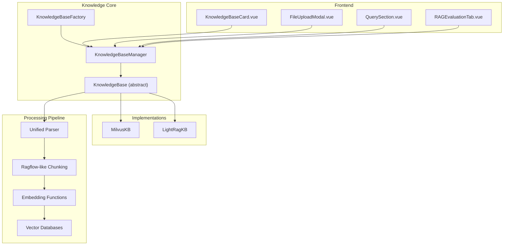
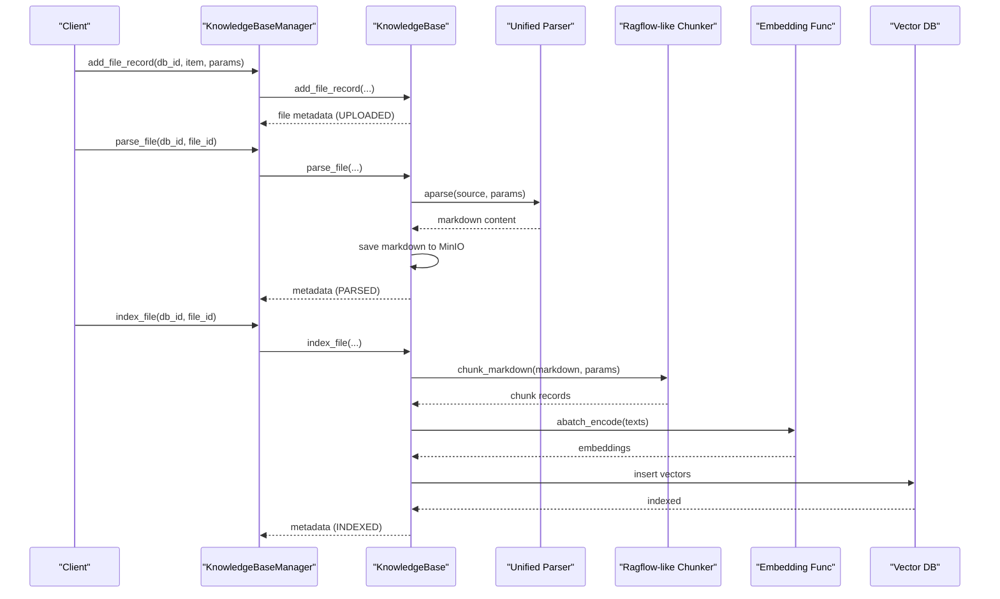
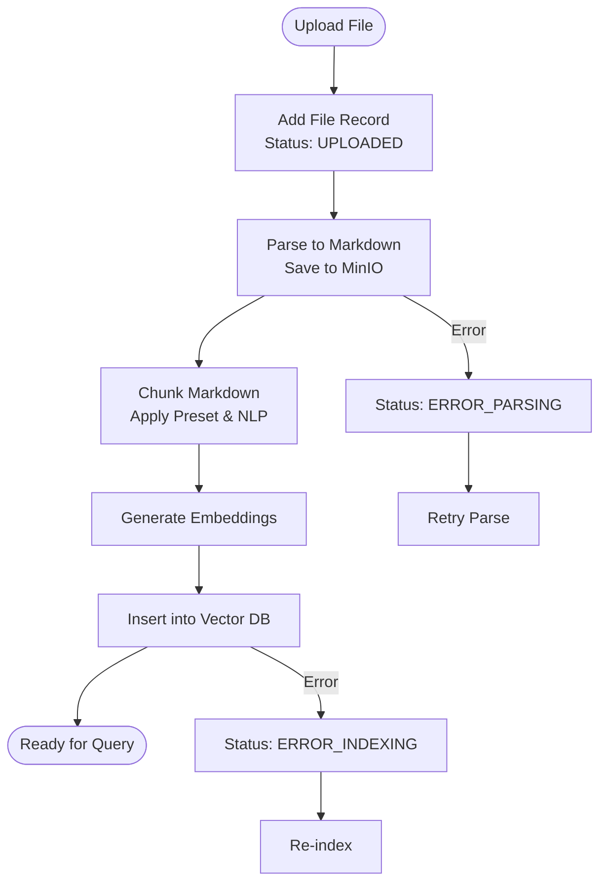
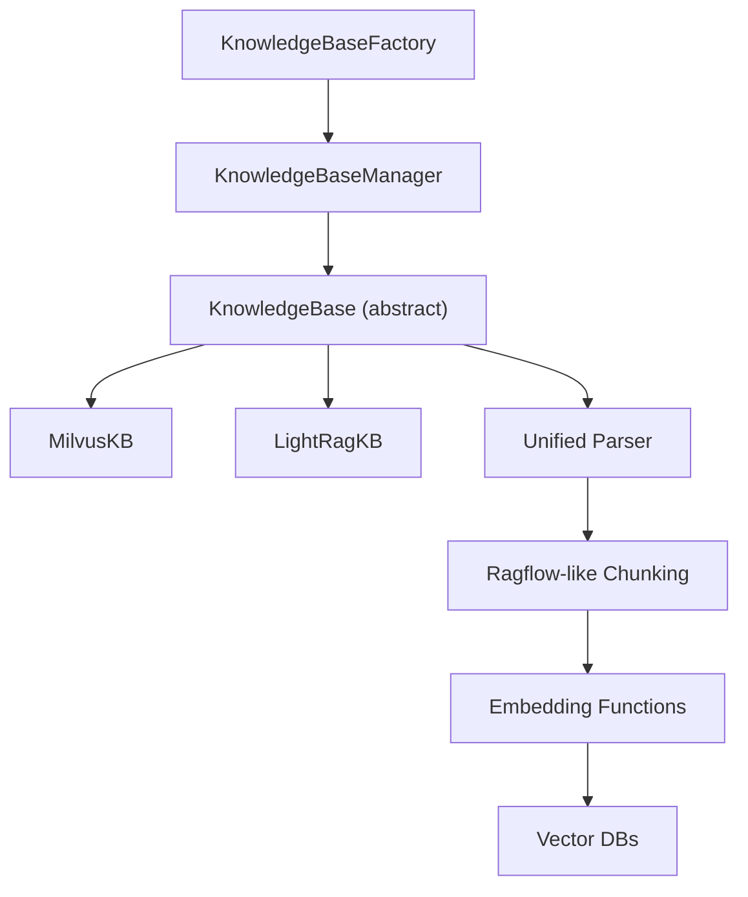

# Knowledge Base Management

<cite>
**Referenced Files in This Document**
- [__init__.py](file://backend/package/yuxi/knowledge/__init__.py)
- [base.py](file://backend/package/yuxi/knowledge/base.py)
- [factory.py](file://backend/package/yuxi/knowledge/factory.py)
- [manager.py](file://backend/package/yuxi/knowledge/manager.py)
- [lightrag.py](file://backend/package/yuxi/knowledge/implementations/lightrag.py)
- [milvus.py](file://backend/package/yuxi/knowledge/implementations/milvus.py)
- [dispatcher.py](file://backend/package/yuxi/knowledge/chunking/ragflow_like/dispatcher.py)
- [presets.py](file://backend/package/yuxi/knowledge/chunking/ragflow_like/presets.py)
- [nlp.py](file://backend/package/yuxi/knowledge/chunking/ragflow_like/nlp.py)
- [unified.py](file://backend/package/yuxi/plugins/parser/unified.py)
- [kb_utils.py](file://backend/package/yuxi/knowledge/utils/kb_utils.py)
- [knowledge_router.py](file://backend/server/routers/knowledge_router.py)
- [knowledge_api.js](file://web/src/apis/knowledge_api.js)
- [KnowledgeBaseCard.vue](file://web/src/components/KnowledgeBaseCard.vue)
- [FileUploadModal.vue](file://web/src/components/FileUploadModal.vue)
- [QuerySection.vue](file://web/src/components/QuerySection.vue)
- [RAGEvaluationTab.vue](file://web/src/components/RAGEvaluationTab.vue)
</cite>

## Table of Contents
1. [Introduction](#introduction)
2. [Project Structure](#project-structure)
3. [Core Components](#core-components)
4. [Architecture Overview](#architecture-overview)
5. [Detailed Component Analysis](#detailed-component-analysis)
6. [Dependency Analysis](#dependency-analysis)
7. [Performance Considerations](#performance-considerations)
8. [Troubleshooting Guide](#troubleshooting-guide)
9. [Conclusion](#conclusion)
10. [Appendices](#appendices)

## Introduction
This document describes the knowledge base management system that ingests, parses, chunks, embeds, indexes, and retrieves documents across multiple formats. It covers the end-to-end pipeline from file upload to vector indexing, the supported formats (PDF, Word, Markdown, images), chunking strategies, text extraction, vector embedding generation, and the operations for creating, modifying, deleting, and querying knowledge bases. It also explains the integration with Milvus and LightRAG vector databases, the RAG evaluation framework, and practical configuration examples for optimal performance and scalability.

## Project Structure
The knowledge base system is organized around a factory-based architecture that supports multiple backends (Milvus, LightRAG, Dify). The core processing pipeline is implemented in the knowledge module, with chunking utilities under chunking/ragflow_like, and parsers under plugins/parser/unified. The frontend provides UI components for knowledge base management and querying.

**Diagram sources**
- [factory.py:1-108](file://backend/package/yuxi/knowledge/factory.py#L1-L108)
- [manager.py:1-955](file://backend/package/yuxi/knowledge/manager.py#L1-L955)
- [base.py:1-800](file://backend/package/yuxi/knowledge/base.py#L1-L800)
- [milvus.py:1-897](file://backend/package/yuxi/knowledge/implementations/milvus.py#L1-L897)
- [lightrag.py:1-779](file://backend/package/yuxi/knowledge/implementations/lightrag.py#L1-L779)
- [dispatcher.py:1-65](file://backend/package/yuxi/knowledge/chunking/ragflow_like/dispatcher.py#L1-L65)
- [presets.py:1-239](file://backend/package/yuxi/knowledge/chunking/ragflow_like/presets.py#L1-L239)
- [unified.py](file://backend/package/yuxi/plugins/parser/unified.py)

**Section sources**
- [__init__.py:1-52](file://backend/package/yuxi/knowledge/__init__.py#L1-L52)
- [factory.py:1-108](file://backend/package/yuxi/knowledge/factory.py#L1-L108)
- [manager.py:1-955](file://backend/package/yuxi/knowledge/manager.py#L1-L955)

## Core Components
- KnowledgeBaseFactory: Registers and instantiates knowledge base implementations (Milvus, LightRAG, Dify).
- KnowledgeBaseManager: Central coordinator that loads metadata, routes operations to the appropriate backend, and manages permissions and statistics.
- KnowledgeBase (abstract): Defines the unified interface for file lifecycle (add, parse, index, query) and database operations (create, delete, update).
- Implementations: MilvusKB and LightRagKB implement vector storage and retrieval with different backends and capabilities.
- Chunking Engine: Ragflow-like chunking with preset strategies (General, QA, Book, Laws) and NLP utilities for intelligent merging.
- Unified Parser: Extracts text and images from various formats and produces Markdown for downstream processing.

**Section sources**
- [factory.py:1-108](file://backend/package/yuxi/knowledge/factory.py#L1-L108)
- [manager.py:1-955](file://backend/package/yuxi/knowledge/manager.py#L1-L955)
- [base.py:1-800](file://backend/package/yuxi/knowledge/base.py#L1-L800)
- [milvus.py:1-897](file://backend/package/yuxi/knowledge/implementations/milvus.py#L1-L897)
- [lightrag.py:1-779](file://backend/package/yuxi/knowledge/implementations/lightrag.py#L1-L779)
- [dispatcher.py:1-65](file://backend/package/yuxi/knowledge/chunking/ragflow_like/dispatcher.py#L1-L65)
- [presets.py:1-239](file://backend/package/yuxi/knowledge/chunking/ragflow_like/presets.py#L1-L239)
- [nlp.py:1-535](file://backend/package/yuxi/knowledge/chunking/ragflow_like/nlp.py#L1-L535)
- [unified.py](file://backend/package/yuxi/plugins/parser/unified.py)

## Architecture Overview
The system orchestrates a multi-stage pipeline:
1. File ingestion: Add file records with metadata and initial status.
2. Parsing: Convert files to Markdown via the unified parser, storing parsed content to MinIO.
3. Chunking: Split Markdown into chunks using configurable presets and NLP-aware strategies.
4. Embedding: Generate vector embeddings using configured embedding models.
5. Indexing: Store vectors in Milvus or LightRAG (with Neo4j graph storage).
6. Querying: Retrieve top-k chunks or enriched results with optional reranking.

**Diagram sources**
- [manager.py:406-427](file://backend/package/yuxi/knowledge/manager.py#L406-L427)
- [base.py:192-401](file://backend/package/yuxi/knowledge/base.py#L192-L401)
- [lightrag.py:305-421](file://backend/package/yuxi/knowledge/implementations/lightrag.py#L305-L421)
- [milvus.py:227-360](file://backend/package/yuxi/knowledge/implementations/milvus.py#L227-L360)
- [dispatcher.py:49-65](file://backend/package/yuxi/knowledge/chunking/ragflow_like/dispatcher.py#L49-L65)
- [presets.py:161-214](file://backend/package/yuxi/knowledge/chunking/ragflow_like/presets.py#L161-L214)

## Detailed Component Analysis

### Document Processing Pipeline
- File Lifecycle States: UPLOADED → PARSING → PARSED → INDEXING → INDEXED, with error states for robustness.
- Parsing: Uses the unified parser to extract text and images, producing Markdown stored in MinIO with a standardized URL.
- Chunking: Dispatches to preset-specific chunkers (general, QA, book, laws) with NLP-aware merging and overlap computation.
- Embedding: Supports OpenAI-compatible and Ollama embedding functions with batch encoding.
- Indexing: MilvusKB writes vectors with metadata; LightRagKB integrates with Milvus and Neo4j for graph-enhanced retrieval.

**Diagram sources**
- [base.py:192-401](file://backend/package/yuxi/knowledge/base.py#L192-L401)
- [dispatcher.py:49-65](file://backend/package/yuxi/knowledge/chunking/ragflow_like/dispatcher.py#L49-L65)
- [presets.py:161-214](file://backend/package/yuxi/knowledge/chunking/ragflow_like/presets.py#L161-L214)
- [lightrag.py:305-421](file://backend/package/yuxi/knowledge/implementations/lightrag.py#L305-L421)
- [milvus.py:227-360](file://backend/package/yuxi/knowledge/implementations/milvus.py#L227-L360)

**Section sources**
- [base.py:15-26](file://backend/package/yuxi/knowledge/base.py#L15-L26)
- [base.py:233-324](file://backend/package/yuxi/knowledge/base.py#L233-L324)
- [base.py:354-401](file://backend/package/yuxi/knowledge/base.py#L354-L401)
- [dispatcher.py:1-65](file://backend/package/yuxi/knowledge/chunking/ragflow_like/dispatcher.py#L1-L65)
- [presets.py:1-239](file://backend/package/yuxi/knowledge/chunking/ragflow_like/presets.py#L1-L239)
- [nlp.py:411-482](file://backend/package/yuxi/knowledge/chunking/ragflow_like/nlp.py#L411-L482)

### Multi-format Support and Text Extraction
- Supported formats: PDF, Word, Markdown, and images (OCR and extraction handled by the unified parser).
- Extraction pipeline: The unified parser converts source files to Markdown, preserving structure and extracting embedded images into a public bucket with a structured prefix per database.

**Section sources**
- [unified.py](file://backend/package/yuxi/plugins/parser/unified.py)
- [base.py:283-324](file://backend/package/yuxi/knowledge/base.py#L283-L324)

### Chunking Strategies and NLP Utilities
- Presets:
  - General: Default chunking by delimiters and token counts with optional RAPTOR and GraphRAG features.
  - QA: Optimized for question-answer pairs.
  - Book: Hierarchical merging aligned with chapter/section structures.
  - Laws: Structured by legal article hierarchy.
- NLP-aware merging: Uses bullet patterns, heading detection, and hierarchical tree merging to preserve semantic boundaries.

**Section sources**
- [presets.py:8-25](file://backend/package/yuxi/knowledge/chunking/ragflow_like/presets.py#L8-L25)
- [presets.py:101-105](file://backend/package/yuxi/knowledge/chunking/ragflow_like/presets.py#L101-L105)
- [nlp.py:140-179](file://backend/package/yuxi/knowledge/chunking/ragflow_like/nlp.py#L140-L179)
- [nlp.py:306-401](file://backend/package/yuxi/knowledge/chunking/ragflow_like/nlp.py#L306-L401)

### Vector Embedding Generation
- Embedding functions:
  - OpenAI-compatible embeddings with configurable base URL and API key.
  - Ollama embeddings for local models with Docker-safe host resolution.
- Batch encoding: Both sync and async batch encoders are supported for throughput optimization.

**Section sources**
- [lightrag.py:263-303](file://backend/package/yuxi/knowledge/implementations/lightrag.py#L263-L303)
- [milvus.py:174-201](file://backend/package/yuxi/knowledge/implementations/milvus.py#L174-L201)
- [kb_utils.py](file://backend/package/yuxi/knowledge/utils/kb_utils.py)

### Vector Database Integrations
- MilvusKB:
  - Creates collections per database with schema fields for id, content, source, chunk_id, file_id, chunk_index, and embedding.
  - Supports vector search, keyword search, hybrid search, and optional reranking.
- LightRagKB:
  - Uses LightRAG with Milvus for vectors and Neo4j for graph storage.
  - Provides mixed retrieval modes (local/global/hybrid/naive/mix) and entity/relationship extraction.

**Section sources**
- [milvus.py:135-165](file://backend/package/yuxi/knowledge/implementations/milvus.py#L135-L165)
- [milvus.py:471-676](file://backend/package/yuxi/knowledge/implementations/milvus.py#L471-L676)
- [lightrag.py:136-181](file://backend/package/yuxi/knowledge/implementations/lightrag.py#L136-L181)
- [lightrag.py:526-601](file://backend/package/yuxi/knowledge/implementations/lightrag.py#L526-L601)

### Knowledge Base Operations
- Creation: Create databases with type-specific configurations, embedding info, and sharing settings.
- Modification: Update database metadata, chunking parameters, and reprocess content for selected files.
- Deletion: Remove database records, associated MinIO objects, and backend collections/graphs.
- Querying: Backend-specific query parameters and retrieval scopes (chunks, graph, all).

**Section sources**
- [manager.py:326-388](file://backend/package/yuxi/knowledge/manager.py#L326-L388)
- [manager.py:389-405](file://backend/package/yuxi/knowledge/manager.py#L389-L405)
- [manager.py:428-436](file://backend/package/yuxi/knowledge/manager.py#L428-L436)
- [base.py:403-457](file://backend/package/yuxi/knowledge/base.py#L403-L457)
- [base.py:458-521](file://backend/package/yuxi/knowledge/base.py#L458-L521)
- [base.py:542-556](file://backend/package/yuxi/knowledge/base.py#L542-L556)

### File Upload and Management
- Validation and storage: Adds file records with content type, processing parameters, and status tracking.
- Metadata handling: Stores MinIO URLs, filenames, sizes, hashes, and timestamps; normalizes timestamps and updates operators.
- Duplicate detection: Checks by filename and content hash to prevent duplicates.

**Section sources**
- [base.py:192-232](file://backend/package/yuxi/knowledge/base.py#L192-L232)
- [base.py:325-353](file://backend/package/yuxi/knowledge/base.py#L325-L353)
- [manager.py:520-538](file://backend/package/yuxi/knowledge/manager.py#L520-L538)
- [manager.py:587-606](file://backend/package/yuxi/knowledge/manager.py#L587-L606)

### RAG Evaluation Framework
- Evaluation tab in the frontend enables benchmarking and metrics computation for retrieval quality.
- Backend services coordinate dataset preparation, evaluation runs, and result aggregation.

**Section sources**
- [RAGEvaluationTab.vue](file://web/src/components/RAGEvaluationTab.vue)
- [evaluation_router.py](file://backend/server/routers/evaluation_router.py)
- [evaluation_service.py](file://backend/package/yuxi/knowledge/services/evaluation_service.py)

## Dependency Analysis
The system exhibits clear separation of concerns:
- Factory and Manager decouple clients from backend specifics.
- Implementations encapsulate vector database specifics.
- Chunking and parsing are reusable utilities.
- Frontend components integrate with backend APIs.

**Diagram sources**
- [factory.py:1-108](file://backend/package/yuxi/knowledge/factory.py#L1-L108)
- [manager.py:1-955](file://backend/package/yuxi/knowledge/manager.py#L1-L955)
- [base.py:1-800](file://backend/package/yuxi/knowledge/base.py#L1-L800)
- [milvus.py:1-897](file://backend/package/yuxi/knowledge/implementations/milvus.py#L1-L897)
- [lightrag.py:1-779](file://backend/package/yuxi/knowledge/implementations/lightrag.py#L1-L779)
- [dispatcher.py:1-65](file://backend/package/yuxi/knowledge/chunking/ragflow_like/dispatcher.py#L1-L65)
- [presets.py:1-239](file://backend/package/yuxi/knowledge/chunking/ragflow_like/presets.py#L1-L239)

**Section sources**
- [factory.py:1-108](file://backend/package/yuxi/knowledge/factory.py#L1-L108)
- [manager.py:1-955](file://backend/package/yuxi/knowledge/manager.py#L1-L955)

## Performance Considerations
- Batch Embedding: Use batch encoding to reduce overhead; configure batch sizes according to model capabilities.
- Chunk Size and Overlap: Tune chunk_token_num and overlapped_percent to balance recall and latency.
- Hybrid Search: Combine vector and keyword search; adjust recall_top_k and final_top_k for quality-latency trade-offs.
- Concurrency: Per-database write locks and processing queues prevent contention; leverage async I/O for I/O-bound stages.
- Storage: Ensure MinIO and vector databases are on fast networks; pre-warm collections and indexes for production workloads.

[No sources needed since this section provides general guidance]

## Troubleshooting Guide
Common issues and resolutions:
- Parsing failures: Verify file accessibility and parser compatibility; check MinIO connectivity and bucket permissions.
- Indexing errors: Confirm embedding dimension matches collection schema; ensure vector database is reachable and collections are loaded.
- Query timeouts: Adjust top_k, metric_type, and search parameters; enable reranking judiciously.
- Status inconsistencies: The system auto-fixes processing states; monitor logs for persistent failures.

**Section sources**
- [base.py:786-820](file://backend/package/yuxi/knowledge/base.py#L786-L820)
- [lightrag.py:183-194](file://backend/package/yuxi/knowledge/implementations/lightrag.py#L183-L194)
- [milvus.py:677-701](file://backend/package/yuxi/knowledge/implementations/milvus.py#L677-L701)

## Conclusion
The knowledge base management system provides a scalable, modular pipeline for multi-format document ingestion, intelligent chunking, vector embedding, and retrieval across Milvus and LightRAG. Its factory-based architecture and unified interfaces simplify backend switching and maintenance, while robust status tracking and error handling improve reliability. The frontend components enable efficient knowledge base administration and evaluation.

[No sources needed since this section summarizes without analyzing specific files]

## Appendices

### Practical Configuration Examples
- Creating a Milvus-backed knowledge base with custom chunking:
  - Set kb_type to "milvus".
  - Configure embed_info with model name, base URL, API key, and dimension.
  - Define additional_params with chunk_preset_id and chunk_parser_config.
- Creating a LightRAG-backed knowledge base:
  - Set kb_type to "lightrag".
  - Provide llm_info and embed_info; optionally set addon_params for language.
  - Use retrieval modes and top_k via query parameters.

**Section sources**
- [manager.py:326-388](file://backend/package/yuxi/knowledge/manager.py#L326-L388)
- [presets.py:150-214](file://backend/package/yuxi/knowledge/chunking/ragflow_like/presets.py#L150-L214)
- [lightrag.py:136-174](file://backend/package/yuxi/knowledge/implementations/lightrag.py#L136-L174)

### Retrieval Optimization Tips
- Use retrieval_content_scope to control whether to return chunks, graph entities/relations, or both.
- Enable reranking with a suitable reranker model for improved relevance.
- Filter by file_name using keyword search for targeted retrieval.

**Section sources**
- [lightrag.py:689-742](file://backend/package/yuxi/knowledge/implementations/lightrag.py#L689-L742)
- [milvus.py:471-676](file://backend/package/yuxi/knowledge/implementations/milvus.py#L471-L676)