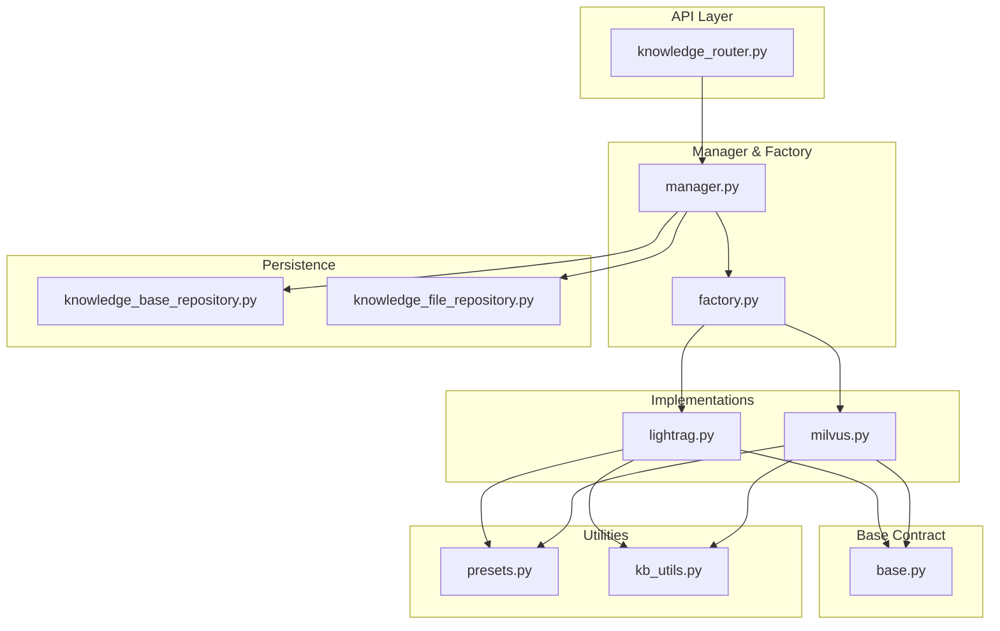
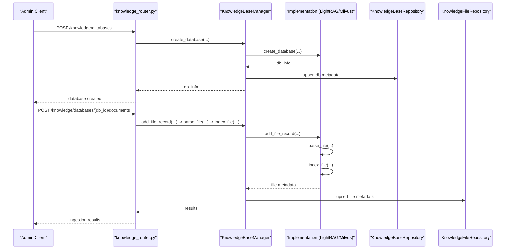
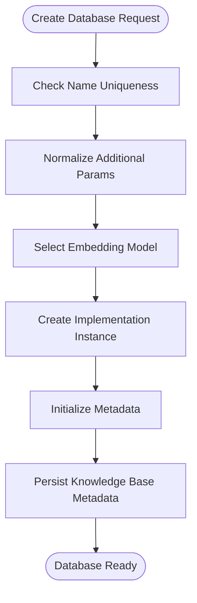
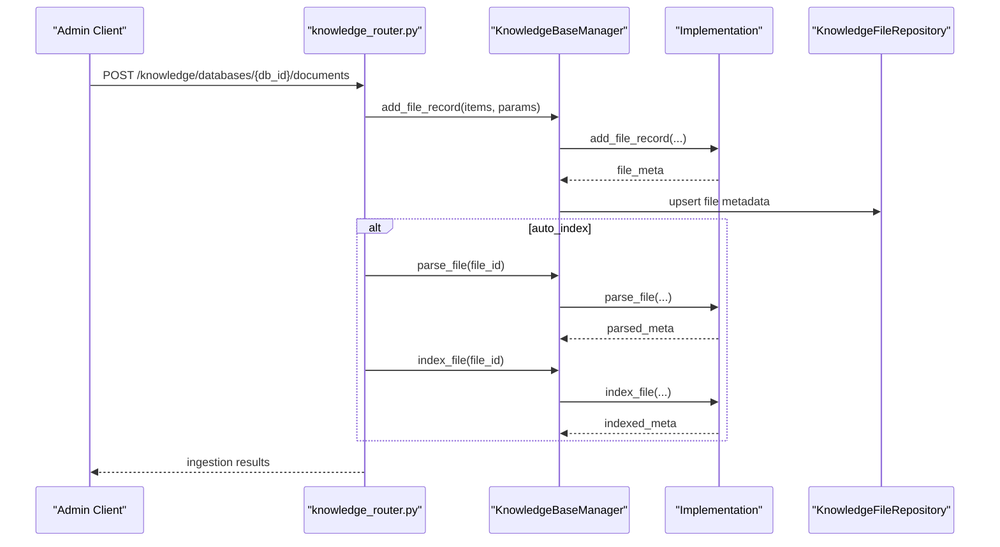
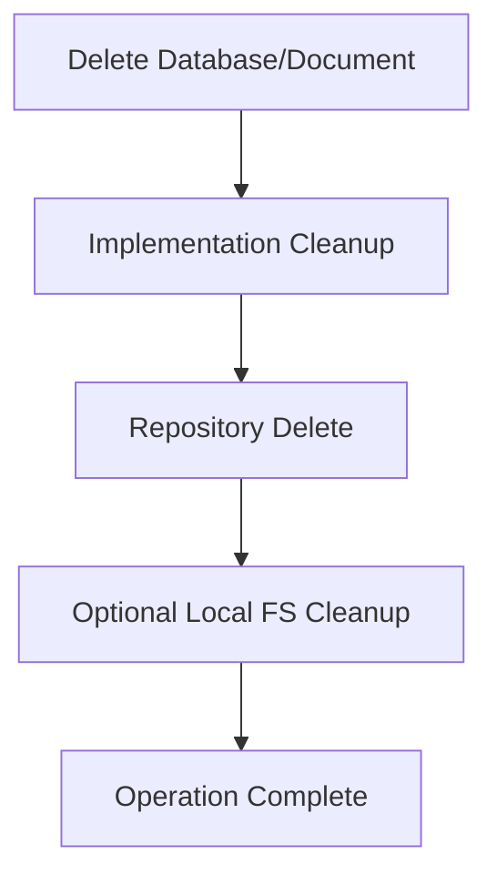
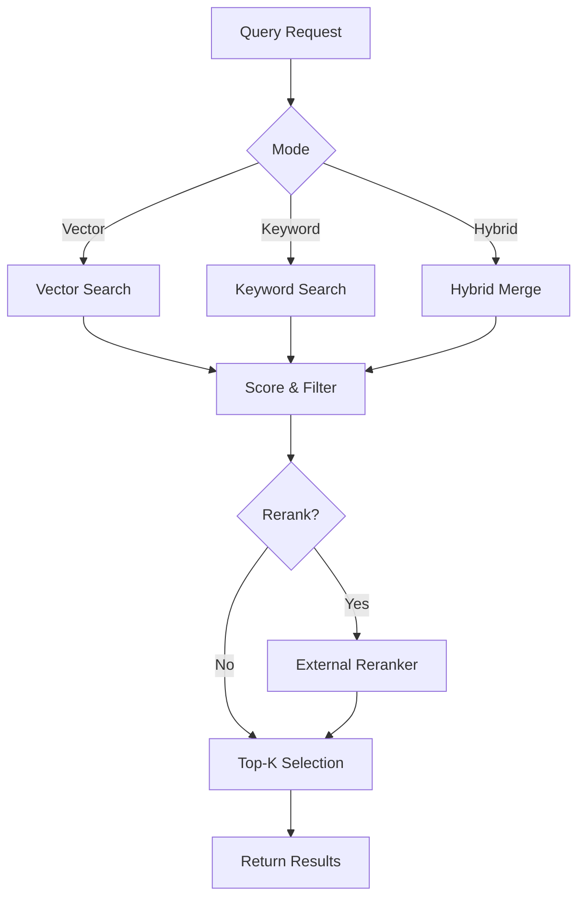
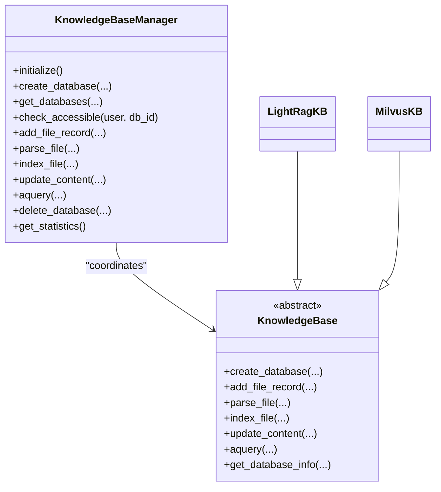
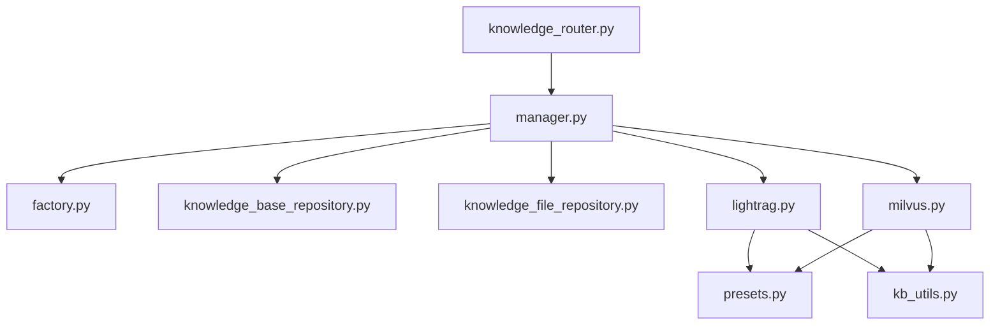

# Knowledge Base Operations

<cite>
**Referenced Files in This Document**
- [manager.py](file://backend/package/yuxi/knowledge/manager.py)
- [base.py](file://backend/package/yuxi/knowledge/base.py)
- [factory.py](file://backend/package/yuxi/knowledge/factory.py)
- [lightrag.py](file://backend/package/yuxi/knowledge/implementations/lightrag.py)
- [milvus.py](file://backend/package/yuxi/knowledge/implementations/milvus.py)
- [knowledge_router.py](file://backend/server/routers/knowledge_router.py)
- [knowledge_base_repository.py](file://backend/package/yuxi/repositories/knowledge_base_repository.py)
- [knowledge_file_repository.py](file://backend/package/yuxi/repositories/knowledge_file_repository.py)
- [presets.py](file://backend/package/yuxi/knowledge/chunking/ragflow_like/presets.py)
- [kb_utils.py](file://backend/package/yuxi/knowledge/utils/kb_utils.py)
</cite>

## Table of Contents
1. [Introduction](#introduction)
2. [Project Structure](#project-structure)
3. [Core Components](#core-components)
4. [Architecture Overview](#architecture-overview)
5. [Detailed Component Analysis](#detailed-component-analysis)
6. [Dependency Analysis](#dependency-analysis)
7. [Performance Considerations](#performance-considerations)
8. [Troubleshooting Guide](#troubleshooting-guide)
9. [Conclusion](#conclusion)
10. [Appendices](#appendices)

## Introduction
This document describes the end-to-end knowledge base operations across creation, lifecycle management, modification, querying, and deletion. It explains how configuration validation, workspace initialization, and metadata setup are performed; how updates, document addition/removal, and reprocessing work; how deletion cascades and resource cleanup are handled; and how querying supports semantic and hybrid retrieval. It also covers the responsibilities of the knowledge base manager, including workspace coordination, file system operations, and state management. Practical examples and troubleshooting guidance are included for administrators.

## Project Structure
The knowledge base subsystem is organized around:
- A manager that coordinates multiple knowledge base implementations and orchestrates persistence and permissions
- An abstract base class defining the contract for knowledge base implementations
- Concrete implementations (LightRAG and Milvus) with distinct storage backends
- Repositories for persistence of knowledge base and file records
- A router exposing administrative APIs for CRUD and lifecycle operations
- Utilities for chunking, metadata preparation, and embedding configuration

**Diagram sources**
- [knowledge_router.py:1-120](file://backend/server/routers/knowledge_router.py#L1-L120)
- [manager.py:1-120](file://backend/package/yuxi/knowledge/manager.py#L1-L120)
- [factory.py:1-108](file://backend/package/yuxi/knowledge/factory.py#L1-L108)
- [base.py:1-120](file://backend/package/yuxi/knowledge/base.py#L1-L120)
- [lightrag.py:1-120](file://backend/package/yuxi/knowledge/implementations/lightrag.py#L1-L120)
- [milvus.py:1-120](file://backend/package/yuxi/knowledge/implementations/milvus.py#L1-L120)
- [knowledge_base_repository.py:1-44](file://backend/package/yuxi/repositories/knowledge_base_repository.py#L1-L44)
- [knowledge_file_repository.py:1-52](file://backend/package/yuxi/repositories/knowledge_file_repository.py#L1-L52)
- [presets.py:1-120](file://backend/package/yuxi/knowledge/chunking/ragflow_like/presets.py#L1-L120)
- [kb_utils.py:1-120](file://backend/package/yuxi/knowledge/utils/kb_utils.py#L1-L120)

**Section sources**
- [knowledge_router.py:1-120](file://backend/server/routers/knowledge_router.py#L1-L120)
- [manager.py:1-120](file://backend/package/yuxi/knowledge/manager.py#L1-L120)
- [factory.py:1-108](file://backend/package/yuxi/knowledge/factory.py#L1-L108)
- [base.py:1-120](file://backend/package/yuxi/knowledge/base.py#L1-L120)

## Core Components
- KnowledgeBaseManager: Central coordinator for knowledge base instances, permission checks, and cross-cutting operations like statistics and consistency detection
- KnowledgeBase (abstract): Defines the contract for implementations, including metadata loading, file lifecycle, and querying
- KnowledgeBaseFactory: Creates and registers implementations by type
- Implementations:
  - LightRagKB: Integrates LightRAG with Milvus and Neo4j
  - MilvusKB: Pure Milvus-backed vector storage with hybrid search
- Repositories: Persist knowledge base and file metadata to PostgreSQL
- Router: Exposes admin APIs for CRUD, ingestion, indexing, querying, and deletion

**Section sources**
- [manager.py:15-120](file://backend/package/yuxi/knowledge/manager.py#L15-L120)
- [base.py:46-120](file://backend/package/yuxi/knowledge/base.py#L46-L120)
- [factory.py:5-108](file://backend/package/yuxi/knowledge/factory.py#L5-L108)
- [lightrag.py:23-120](file://backend/package/yuxi/knowledge/implementations/lightrag.py#L23-L120)
- [milvus.py:24-120](file://backend/package/yuxi/knowledge/implementations/milvus.py#L24-L120)
- [knowledge_base_repository.py:11-44](file://backend/package/yuxi/repositories/knowledge_base_repository.py#L11-L44)
- [knowledge_file_repository.py:11-52](file://backend/package/yuxi/repositories/knowledge_file_repository.py#L11-L52)

## Architecture Overview
The system separates concerns across layers:
- API layer validates inputs and enforces permissions
- Manager layer resolves the correct implementation and coordinates persistence
- Implementation layer handles storage-specific operations (vector/graph/objects)
- Repositories persist metadata to relational storage
- Utilities handle chunking, hashing, and embedding configuration

**Diagram sources**
- [knowledge_router.py:100-178](file://backend/server/routers/knowledge_router.py#L100-L178)
- [manager.py:326-387](file://backend/package/yuxi/knowledge/manager.py#L326-L387)
- [base.py:403-456](file://backend/package/yuxi/knowledge/base.py#L403-L456)
- [lightrag.py:305-421](file://backend/package/yuxi/knowledge/implementations/lightrag.py#L305-L421)
- [milvus.py:227-359](file://backend/package/yuxi/knowledge/implementations/milvus.py#L227-L359)
- [knowledge_base_repository.py:22-36](file://backend/package/yuxi/repositories/knowledge_base_repository.py#L22-L36)
- [knowledge_file_repository.py:28-38](file://backend/package/yuxi/repositories/knowledge_file_repository.py#L28-L38)

## Detailed Component Analysis

### Knowledge Base Creation Workflow
- Validation and normalization:
  - Name uniqueness checked via manager
  - Additional parameters normalized using chunk presets
  - Embedding model selection validated against configured models
- Workspace initialization:
  - Manager creates implementation instance and initializes metadata
  - Implementation ensures working directories and storage backends
- Metadata setup:
  - Database metadata stored in repository
  - File metadata tracked in-memory and persisted atomically

**Diagram sources**
- [manager.py:326-387](file://backend/package/yuxi/knowledge/manager.py#L326-L387)
- [knowledge_router.py:117-178](file://backend/server/routers/knowledge_router.py#L117-L178)
- [presets.py:150-158](file://backend/package/yuxi/knowledge/chunking/ragflow_like/presets.py#L150-L158)
- [knowledge_base_repository.py:22-36](file://backend/package/yuxi/repositories/knowledge_base_repository.py#L22-L36)

**Section sources**
- [manager.py:326-387](file://backend/package/yuxi/knowledge/manager.py#L326-L387)
- [knowledge_router.py:117-178](file://backend/server/routers/knowledge_router.py#L117-L178)
- [presets.py:150-158](file://backend/package/yuxi/knowledge/chunking/ragflow_like/presets.py#L150-L158)
- [knowledge_base_repository.py:22-36](file://backend/package/yuxi/repositories/knowledge_base_repository.py#L22-L36)

### Modification Operations
- Update knowledge base settings:
  - Manager merges additional parameters and persists changes
  - Implementation-specific updates (e.g., LLM model cache invalidation) handled internally
- Add/remove documents:
  - Add: add_file_record -> parse_file -> optional index_file
  - Remove: delete_file deletes vectors and metadata; delete_folder recursively removes
- Reprocessing existing content:
  - update_content re-parses and reindexes selected files
  - Supports parameter overrides per-file or globally

**Diagram sources**
- [knowledge_router.py:302-492](file://backend/server/routers/knowledge_router.py#L302-L492)
- [manager.py:406-427](file://backend/package/yuxi/knowledge/manager.py#L406-L427)
- [base.py:192-232](file://backend/package/yuxi/knowledge/base.py#L192-L232)
- [lightrag.py:305-421](file://backend/package/yuxi/knowledge/implementations/lightrag.py#L305-L421)
- [milvus.py:227-359](file://backend/package/yuxi/knowledge/implementations/milvus.py#L227-L359)
- [knowledge_file_repository.py:28-38](file://backend/package/yuxi/repositories/knowledge_file_repository.py#L28-L38)

**Section sources**
- [knowledge_router.py:302-492](file://backend/server/routers/knowledge_router.py#L302-L492)
- [manager.py:406-427](file://backend/package/yuxi/knowledge/manager.py#L406-L427)
- [base.py:192-232](file://backend/package/yuxi/knowledge/base.py#L192-L232)
- [lightrag.py:422-524](file://backend/package/yuxi/knowledge/implementations/lightrag.py#L422-L524)
- [milvus.py:360-469](file://backend/package/yuxi/knowledge/implementations/milvus.py#L360-L469)

### Deletion Procedures
- Database deletion:
  - Implementation deletes vector/graph collections and local artifacts
  - Manager removes database record from repository
- Document deletion:
  - delete_file removes vector chunks and file metadata
  - delete_folder recursively removes folders and contained items
- Cascade cleanup and dependency resolution:
  - MinIO objects removed alongside metadata
  - Locks and queues ensure atomicity during concurrent operations

**Diagram sources**
- [base.py:458-520](file://backend/package/yuxi/knowledge/base.py#L458-L520)
- [lightrag.py:61-111](file://backend/package/yuxi/knowledge/implementations/lightrag.py#L61-L111)
- [milvus.py:781-794](file://backend/package/yuxi/knowledge/implementations/milvus.py#L781-L794)
- [knowledge_base_repository.py:38-44](file://backend/package/yuxi/repositories/knowledge_base_repository.py#L38-L44)
- [knowledge_file_repository.py:40-45](file://backend/package/yuxi/repositories/knowledge_file_repository.py#L40-L45)

**Section sources**
- [base.py:458-520](file://backend/package/yuxi/knowledge/base.py#L458-L520)
- [lightrag.py:61-111](file://backend/package/yuxi/knowledge/implementations/lightrag.py#L61-L111)
- [milvus.py:781-794](file://backend/package/yuxi/knowledge/implementations/milvus.py#L781-L794)
- [knowledge_base_repository.py:38-44](file://backend/package/yuxi/repositories/knowledge_base_repository.py#L38-L44)
- [knowledge_file_repository.py:40-45](file://backend/package/yuxi/repositories/knowledge_file_repository.py#L40-L45)

### Querying Interface
- Semantic search:
  - Vector similarity search using embedding vectors
  - Threshold filtering and optional distance normalization
- Hybrid search:
  - Combines vector and keyword scoring
  - Keyword scoring based on term frequency; merged by chunk identity
- Result filtering:
  - Filters by file name and configurable top-k
  - Optional reranking with external models

**Diagram sources**
- [milvus.py:471-676](file://backend/package/yuxi/knowledge/implementations/milvus.py#L471-L676)
- [lightrag.py:526-601](file://backend/package/yuxi/knowledge/implementations/lightrag.py#L526-L601)

**Section sources**
- [milvus.py:471-676](file://backend/package/yuxi/knowledge/implementations/milvus.py#L471-L676)
- [lightrag.py:526-601](file://backend/package/yuxi/knowledge/implementations/lightrag.py#L526-L601)

### Knowledge Base Manager Responsibilities
- Workspace coordination:
  - Ensures working directories exist per knowledge base type
  - Manages per-type instances and locks
- File system operations:
  - Provides upload paths and deduplication helpers
  - Validates file paths and prevents traversal
- State management:
  - Loads and normalizes metadata
  - Maintains processing queues and status transitions
- Permissions and visibility:
  - Enforces shared/accessibility rules per database
  - Filters database lists by user roles and departments

**Diagram sources**
- [manager.py:15-120](file://backend/package/yuxi/knowledge/manager.py#L15-L120)
- [base.py:46-120](file://backend/package/yuxi/knowledge/base.py#L46-L120)
- [lightrag.py:23-120](file://backend/package/yuxi/knowledge/implementations/lightrag.py#L23-L120)
- [milvus.py:24-120](file://backend/package/yuxi/knowledge/implementations/milvus.py#L24-L120)

**Section sources**
- [manager.py:15-120](file://backend/package/yuxi/knowledge/manager.py#L15-L120)
- [base.py:46-120](file://backend/package/yuxi/knowledge/base.py#L46-L120)

## Dependency Analysis
- Manager depends on:
  - KnowledgeBaseFactory for implementation instantiation
  - Repositories for persistence
  - MinIO client for object storage
- Implementations depend on:
  - Chunking presets for normalization and splitting
  - Embedding utilities for vector generation
  - External storages (Milvus, Neo4j) for vector/graph data
- Router depends on:
  - Manager for orchestration
  - Validation utilities for inputs and paths

**Diagram sources**
- [manager.py:1-120](file://backend/package/yuxi/knowledge/manager.py#L1-L120)
- [factory.py:1-108](file://backend/package/yuxi/knowledge/factory.py#L1-L108)
- [knowledge_base_repository.py:1-44](file://backend/package/yuxi/repositories/knowledge_base_repository.py#L1-L44)
- [knowledge_file_repository.py:1-52](file://backend/package/yuxi/repositories/knowledge_file_repository.py#L1-L52)
- [lightrag.py:1-120](file://backend/package/yuxi/knowledge/implementations/lightrag.py#L1-L120)
- [milvus.py:1-120](file://backend/package/yuxi/knowledge/implementations/milvus.py#L1-L120)
- [presets.py:1-120](file://backend/package/yuxi/knowledge/chunking/ragflow_like/presets.py#L1-L120)
- [kb_utils.py:1-120](file://backend/package/yuxi/knowledge/utils/kb_utils.py#L1-L120)
- [knowledge_router.py:1-120](file://backend/server/routers/knowledge_router.py#L1-L120)

**Section sources**
- [manager.py:1-120](file://backend/package/yuxi/knowledge/manager.py#L1-L120)
- [factory.py:1-108](file://backend/package/yuxi/knowledge/factory.py#L1-L108)
- [knowledge_router.py:1-120](file://backend/server/routers/knowledge_router.py#L1-L120)

## Performance Considerations
- Batch operations:
  - Use batch ingestion APIs to reduce overhead and improve throughput
- Chunking strategy:
  - Choose appropriate chunk presets and sizes to balance recall and latency
- Vector search:
  - Tune top-k and similarity thresholds to reduce post-processing cost
- Concurrency:
  - Implementers use per-database locks and processing queues to avoid contention
- Reranking:
  - Apply reranking selectively to reduce compute costs

[No sources needed since this section provides general guidance]

## Troubleshooting Guide
Common operational issues and resolutions:
- Database creation fails due to duplicate name:
  - Ensure unique database name; the manager checks and rejects duplicates
- Parsing failures:
  - Verify file paths and content types; ensure MinIO URLs are valid
  - Check processing parameters and chunk presets
- Indexing errors:
  - Confirm embedding model availability and credentials
  - Validate vector storage connectivity (Milvus/Neo4j)
- Permission denied:
  - Verify user role and department access configuration
- Inconsistent metadata:
  - Use manager’s consistency detection to identify missing collections or files

**Section sources**
- [manager.py:305-320](file://backend/package/yuxi/knowledge/manager.py#L305-L320)
- [base.py:233-324](file://backend/package/yuxi/knowledge/base.py#L233-L324)
- [lightrag.py:305-421](file://backend/package/yuxi/knowledge/implementations/lightrag.py#L305-L421)
- [milvus.py:227-359](file://backend/package/yuxi/knowledge/implementations/milvus.py#L227-L359)
- [knowledge_router.py:77-83](file://backend/server/routers/knowledge_router.py#L77-L83)
- [manager.py:776-800](file://backend/package/yuxi/knowledge/manager.py#L776-L800)

## Conclusion
The knowledge base subsystem provides a robust, extensible framework for managing structured and unstructured content with configurable backends. Administrators can create, ingest, update, query, and delete knowledge bases with strong validation, permission enforcement, and resource cleanup. The modular design allows easy extension to new storage backends and retrieval modes.

[No sources needed since this section summarizes without analyzing specific files]

## Appendices

### Practical Examples
- Create a knowledge base with a specific embedding model and chunking preset
- Ingest documents in batch with automatic parsing and indexing
- Update chunking parameters for existing documents and reprocess
- Perform hybrid search with keyword and vector scoring
- Bulk delete documents and verify cleanup across vector and object storage

[No sources needed since this section provides general guidance]