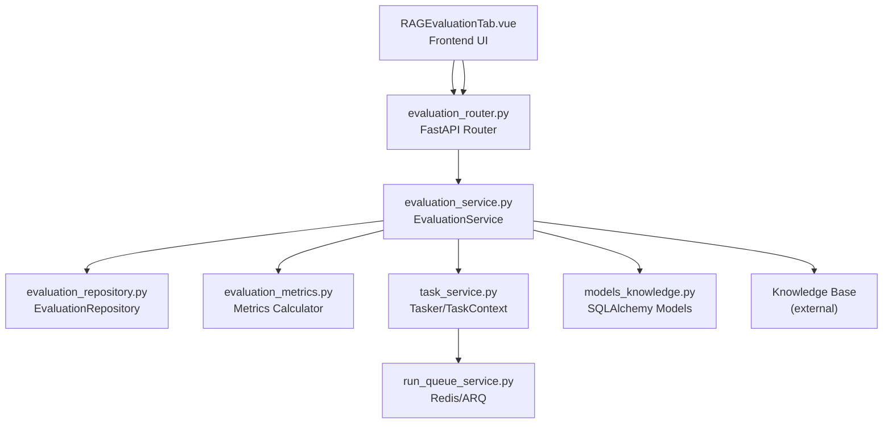
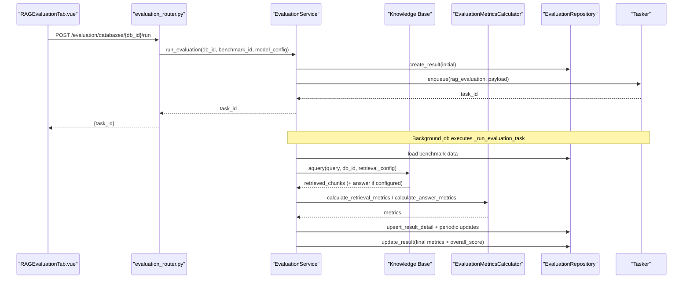
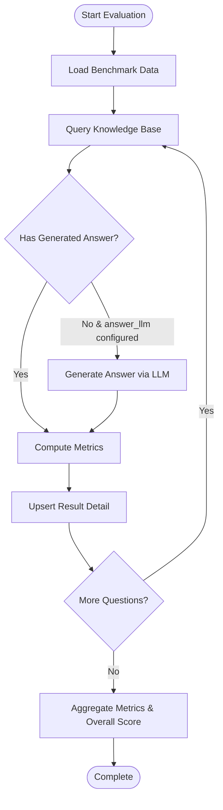
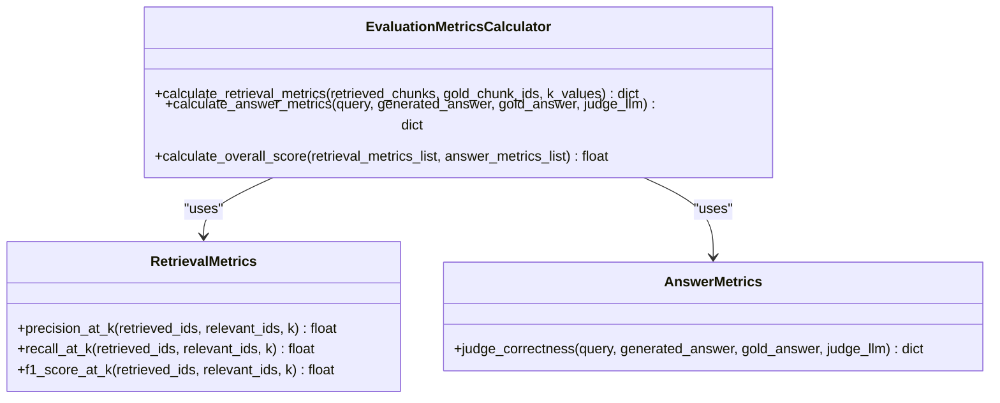
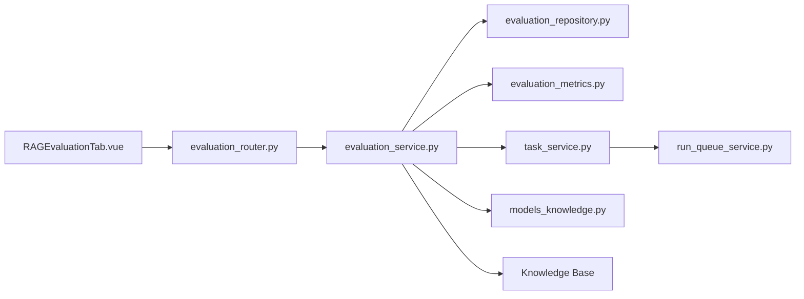

# RAG Evaluation Framework

<cite>
**Referenced Files in This Document**
- [evaluation_repository.py](file://backend/package/yuxi/repositories/evaluation_repository.py)
- [evaluation_service.py](file://backend/package/yuxi/services/evaluation_service.py)
- [evaluation_router.py](file://backend/server/routers/evaluation_router.py)
- [evaluation_metrics.py](file://backend/package/yuxi/utils/evaluation_metrics.py)
- [models_knowledge.py](file://backend/package/yuxi/storage/postgres/models_knowledge.py)
- [RAGEvaluationTab.vue](file://web/src/components/RAGEvaluationTab.vue)
- [task_service.py](file://backend/package/yuxi/services/task_service.py)
- [run_queue_service.py](file://backend/package/yuxi/services/run_queue_service.py)
- [A_Dream_of_Red_Mansions.jsonl](file://backend/test/data/A_Dream_of_Red_Mansions.jsonl)
- [A_Dream_of_Red_Mansions_tiny.jsonl](file://backend/test/data/A_Dream_of_Red_Mansions_tiny.jsonl)
- [complex_graph_test.jsonl](file://backend/test/data/complex_graph_test.jsonl)
- [test_evaluation_router.py](file://backend/test/integration/api/test_evaluation_router.py)
</cite>

## Table of Contents
1. [Introduction](#introduction)
2. [Project Structure](#project-structure)
3. [Core Components](#core-components)
4. [Architecture Overview](#architecture-overview)
5. [Detailed Component Analysis](#detailed-component-analysis)
6. [Dependency Analysis](#dependency-analysis)
7. [Performance Considerations](#performance-considerations)
8. [Troubleshooting Guide](#troubleshooting-guide)
9. [Conclusion](#conclusion)
10. [Appendices](#appendices)

## Introduction
This document describes the RAG evaluation framework implemented in the repository. It covers assessment methodologies, evaluation metrics (precision, recall, F1-score, and LLM-based answer correctness), the evaluation service architecture for running benchmark tests and quality assessments, the evaluation repository for storing datasets, ground truths, and historical results, built-in benchmarks using literary works and technical documents, the evaluation workflow (generation, scheduling, execution, and aggregation), and guidelines for creating custom datasets, defining success criteria, interpreting results, and performing comparative analysis.

## Project Structure
The evaluation system spans backend services, routing, persistence, metrics calculation, and a frontend evaluation tab. Key areas:
- Backend services: evaluation service orchestrates benchmark lifecycle and runs evaluations.
- Routing: FastAPI endpoints expose CRUD and run operations for benchmarks and results.
- Persistence: SQLAlchemy models define evaluation benchmarks, results, and result details.
- Metrics: Utilities compute retrieval metrics and answer correctness via an LLM judge.
- Frontend: Vue component provides UI for selecting benchmarks, configuring models, viewing history, and inspecting results.
- Tasking: Asynchronous task queue manages long-running evaluation jobs.
- Test data: Sample JSONL datasets for literary and structured knowledge graphs.

**Diagram sources**
- [evaluation_router.py:1-227](file://backend/server/routers/evaluation_router.py#L1-L227)
- [evaluation_service.py:1-853](file://backend/package/yuxi/services/evaluation_service.py#L1-L853)
- [evaluation_repository.py:1-119](file://backend/package/yuxi/repositories/evaluation_repository.py#L1-L119)
- [evaluation_metrics.py:1-153](file://backend/package/yuxi/utils/evaluation_metrics.py#L1-L153)
- [models_knowledge.py:1-139](file://backend/package/yuxi/storage/postgres/models_knowledge.py#L1-L139)
- [RAGEvaluationTab.vue:1-1559](file://web/src/components/RAGEvaluationTab.vue#L1-L1559)
- [task_service.py:1-339](file://backend/package/yuxi/services/task_service.py#L1-L339)
- [run_queue_service.py:1-240](file://backend/package/yuxi/services/run_queue_service.py#L1-L240)

**Section sources**
- [evaluation_router.py:1-227](file://backend/server/routers/evaluation_router.py#L1-L227)
- [evaluation_service.py:1-853](file://backend/package/yuxi/services/evaluation_service.py#L1-L853)
- [evaluation_repository.py:1-119](file://backend/package/yuxi/repositories/evaluation_repository.py#L1-L119)
- [evaluation_metrics.py:1-153](file://backend/package/yuxi/utils/evaluation_metrics.py#L1-L153)
- [models_knowledge.py:1-139](file://backend/package/yuxi/storage/postgres/models_knowledge.py#L1-L139)
- [RAGEvaluationTab.vue:1-1559](file://web/src/components/RAGEvaluationTab.vue#L1-L1559)
- [task_service.py:1-339](file://backend/package/yuxi/services/task_service.py#L1-L339)
- [run_queue_service.py:1-240](file://backend/package/yuxi/services/run_queue_service.py#L1-L240)

## Core Components
- EvaluationService: Central orchestration for benchmark upload/generation, evaluation runs, and result aggregation. Manages directories for benchmarks/results, persists metadata, and coordinates with the knowledge base and LLMs.
- EvaluationRepository: Database layer for benchmarks, results, and per-query details using SQLAlchemy models.
- EvaluationMetricsCalculator: Computes retrieval metrics (Recall@K, F1@K) and answer correctness via an LLM judge.
- EvaluationRouter: REST endpoints for uploading/downloading benchmarks, generating benchmarks, running evaluations, listing history, and retrieving results.
- RAGEvaluationTab.vue: Frontend UI enabling selection of benchmarks, configuration of answer/judge models, viewing history, and inspecting per-query details.
- Tasker/TaskContext: Asynchronous task execution engine for long-running jobs with progress updates and cancellation support.
- PostgreSQL models: Schema for EvaluationBenchmark, EvaluationResult, and EvaluationResultDetail.

**Section sources**
- [evaluation_service.py:18-853](file://backend/package/yuxi/services/evaluation_service.py#L18-L853)
- [evaluation_repository.py:11-119](file://backend/package/yuxi/repositories/evaluation_repository.py#L11-L119)
- [evaluation_metrics.py:95-153](file://backend/package/yuxi/utils/evaluation_metrics.py#L95-L153)
- [evaluation_router.py:19-227](file://backend/server/routers/evaluation_router.py#L19-L227)
- [RAGEvaluationTab.vue:1-1559](file://web/src/components/RAGEvaluationTab.vue#L1-L1559)
- [task_service.py:23-200](file://backend/package/yuxi/services/task_service.py#L23-L200)
- [models_knowledge.py:74-139](file://backend/package/yuxi/storage/postgres/models_knowledge.py#L74-L139)

## Architecture Overview
The evaluation pipeline integrates frontend, backend APIs, asynchronous tasking, persistence, and knowledge base retrieval. Benchmarks are stored locally under the knowledge base work directory and persisted in the database. Evaluations run asynchronously, computing retrieval and answer metrics, and aggregating results.

**Diagram sources**
- [evaluation_router.py:196-213](file://backend/server/routers/evaluation_router.py#L196-L213)
- [evaluation_service.py:461-751](file://backend/package/yuxi/services/evaluation_service.py#L461-L751)
- [evaluation_metrics.py:95-153](file://backend/package/yuxi/utils/evaluation_metrics.py#L95-L153)
- [evaluation_repository.py:49-112](file://backend/package/yuxi/repositories/evaluation_repository.py#L49-L112)
- [task_service.py:127-142](file://backend/package/yuxi/services/task_service.py#L127-L142)

## Detailed Component Analysis

### Evaluation Service
Responsibilities:
- Manage benchmark lifecycle: upload, generate, list, download, delete.
- Run evaluations: schedule tasks, query knowledge base, compute metrics, persist results.
- Aggregate metrics: compute averages and overall score.

Key behaviors:
- Benchmark upload validates JSONL, extracts gold_chunk_ids and gold_answer presence, persists metadata and data file.
- Benchmark generation selects chunks, computes embeddings, finds neighbors, prompts LLM to produce query/gold_answer/gold_chunk_ids pairs.
- Evaluation execution loads benchmark, queries knowledge base, optionally generates answers via LLM, computes retrieval and answer metrics, and periodically persists per-query details and overall metrics.

**Diagram sources**
- [evaluation_service.py:523-751](file://backend/package/yuxi/services/evaluation_service.py#L523-L751)
- [evaluation_metrics.py:95-153](file://backend/package/yuxi/utils/evaluation_metrics.py#L95-L153)

**Section sources**
- [evaluation_service.py:45-114](file://backend/package/yuxi/services/evaluation_service.py#L45-L114)
- [evaluation_service.py:280-460](file://backend/package/yuxi/services/evaluation_service.py#L280-L460)
- [evaluation_service.py:461-751](file://backend/package/yuxi/services/evaluation_service.py#L461-L751)

### Evaluation Repository
Manages persistence of:
- EvaluationBenchmark: benchmark metadata and file path.
- EvaluationResult: task-level summary, metrics, and timestamps.
- EvaluationResultDetail: per-query metrics and outputs.

Operations include listing, creation, updates, and deletion with cascading cleanup for details.

**Section sources**
- [evaluation_repository.py:11-119](file://backend/package/yuxi/repositories/evaluation_repository.py#L11-L119)
- [models_knowledge.py:74-139](file://backend/package/yuxi/storage/postgres/models_knowledge.py#L74-L139)

### Evaluation Metrics Calculator
Computes:
- Retrieval metrics: Recall@K and F1@K across configurable K values.
- Answer metrics: LLM-based correctness judgment returning a score and reasoning.
- Overall score: arithmetic mean across all retrieval and answer scores.

**Diagram sources**
- [evaluation_metrics.py:95-153](file://backend/package/yuxi/utils/evaluation_metrics.py#L95-L153)

**Section sources**
- [evaluation_metrics.py:13-153](file://backend/package/yuxi/utils/evaluation_metrics.py#L13-L153)

### Evaluation Router
Endpoints:
- Upload benchmark (JSONL) with name and description.
- Download benchmark file.
- Generate benchmark automatically from knowledge base content.
- Run evaluation with retrieval configuration.
- List benchmarks and evaluation history.
- Retrieve evaluation results with pagination and filtering.

Validation and error handling are performed at the router level.

**Section sources**
- [evaluation_router.py:19-227](file://backend/server/routers/evaluation_router.py#L19-L227)
- [test_evaluation_router.py:14-62](file://backend/test/integration/api/test_evaluation_router.py#L14-L62)

### Frontend Evaluation Tab
Provides:
- Benchmark selection and refresh.
- Model configuration for answer generation and judge LLM.
- History table with status, overall score, and actions.
- Detailed results modal with retrieval metrics and answer correctness.
- Pagination and error-only filtering.

**Section sources**
- [RAGEvaluationTab.vue:1-1559](file://web/src/components/RAGEvaluationTab.vue#L1-L1559)

### Tasking and Queue
Asynchronous execution:
- Tasker enqueues tasks and maintains in-memory state with persistence.
- TaskContext exposes progress, messages, and result updates.
- Redis/ARQ helpers manage cancellation signals and event streams.

**Section sources**
- [task_service.py:23-200](file://backend/package/yuxi/services/task_service.py#L23-L200)
- [run_queue_service.py:61-200](file://backend/package/yuxi/services/run_queue_service.py#L61-L200)

## Dependency Analysis
- EvaluationService depends on EvaluationRepository, KnowledgeBase, EvaluationMetricsCalculator, Tasker, and model selection utilities.
- Router depends on EvaluationService for business logic.
- Frontend depends on evaluation API endpoints.
- Metrics calculator depends on LLM judge for answer scoring.
- Tasking integrates with Redis/ARQ for distributed cancellation and event streaming.

**Diagram sources**
- [evaluation_router.py:1-227](file://backend/server/routers/evaluation_router.py#L1-L227)
- [evaluation_service.py:1-853](file://backend/package/yuxi/services/evaluation_service.py#L1-L853)
- [evaluation_repository.py:1-119](file://backend/package/yuxi/repositories/evaluation_repository.py#L1-L119)
- [evaluation_metrics.py:1-153](file://backend/package/yuxi/utils/evaluation_metrics.py#L1-L153)
- [models_knowledge.py:1-139](file://backend/package/yuxi/storage/postgres/models_knowledge.py#L1-L139)
- [task_service.py:1-339](file://backend/package/yuxi/services/task_service.py#L1-L339)
- [run_queue_service.py:1-240](file://backend/package/yuxi/services/run_queue_service.py#L1-L240)
- [RAGEvaluationTab.vue:1-1559](file://web/src/components/RAGEvaluationTab.vue#L1-L1559)

**Section sources**
- [evaluation_service.py:18-24](file://backend/package/yuxi/services/evaluation_service.py#L18-L24)
- [evaluation_router.py:24-34](file://backend/server/routers/evaluation_router.py#L24-L34)
- [task_service.py:95-142](file://backend/package/yuxi/services/task_service.py#L95-L142)

## Performance Considerations
- Embedding reuse: The benchmark generation process recomputes embeddings for all chunks; consider reusing vector DB embeddings when the embedding model matches the knowledge base to reduce latency and cost.
- Batch sizes: Adjust embedding batch sizes according to model capabilities to balance throughput and memory usage.
- Streaming and pagination: Results are paginated and streamed progressively to the UI; ensure appropriate page sizes for large datasets.
- LLM judge calls: Minimize judge LLM calls by batching judgements and caching where feasible.

[No sources needed since this section provides general guidance]

## Troubleshooting Guide
Common issues and resolutions:
- Benchmark not found: Verify benchmark_id and db_id pairing; check file path existence.
- Evaluation task fails: Inspect task status and error payload; confirm knowledge base availability and supported types.
- Missing judge LLM: Configure judge_llm or answer_llm in retrieval_config; otherwise answer metrics will be omitted.
- Download errors: Confirm admin permissions and file existence; ensure filename sanitization.

**Section sources**
- [evaluation_service.py:538-544](file://backend/package/yuxi/services/evaluation_service.py#L538-L544)
- [evaluation_service.py:738-750](file://backend/package/yuxi/services/evaluation_service.py#L738-L750)
- [evaluation_router.py:33-40](file://backend/server/routers/evaluation_router.py#L33-L40)

## Conclusion
The RAG evaluation framework provides a robust, extensible system for benchmark management, automated generation, asynchronous evaluation execution, and comprehensive metrics reporting. It supports both retrieval-focused and answer-focused assessments, integrates with knowledge bases and LLMs, and offers a user-friendly interface for monitoring and analysis.

[No sources needed since this section summarizes without analyzing specific files]

## Appendices

### Built-in Benchmarks and Datasets
- Literary works: JSONL datasets derived from classical texts suitable for entity/relation extraction and retrieval tasks.
- Technical documents: Structured JSONL samples for knowledge graph-style relationships.

Examples:
- [A_Dream_of_Red_Mansions.jsonl](file://backend/test/data/A_Dream_of_Red_Mansions.jsonl)
- [A_Dream_of_Red_Mansions_tiny.jsonl](file://backend/test/data/A_Dream_of_Red_Mansions_tiny.jsonl)
- [complex_graph_test.jsonl](file://backend/test/data/complex_graph_test.jsonl)

**Section sources**
- [A_Dream_of_Red_Mansions.jsonl:1-381](file://backend/test/data/A_Dream_of_Red_Mansions.jsonl#L1-L381)
- [A_Dream_of_Red_Mansions_tiny.jsonl:1-5](file://backend/test/data/A_Dream_of_Red_Mansions_tiny.jsonl#L1-L5)
- [complex_graph_test.jsonl:1-6](file://backend/test/data/complex_graph_test.jsonl#L1-L6)

### Evaluation Workflow Details
- Test case generation: Automatic generation from knowledge base chunks using neighbor similarity and LLM prompting.
- Execution scheduling: Enqueue tasks via Tasker; progress and results exposed via TaskContext.
- Result aggregation: Per-query details aggregated into overall metrics and an overall score.

**Section sources**
- [evaluation_service.py:290-460](file://backend/package/yuxi/services/evaluation_service.py#L290-L460)
- [evaluation_service.py:523-751](file://backend/package/yuxi/services/evaluation_service.py#L523-L751)
- [task_service.py:69-93](file://backend/package/yuxi/services/task_service.py#L69-L93)

### Metrics Definitions
- Precision@K: Proportion of retrieved items among top-K that are relevant.
- Recall@K: Proportion of relevant items among top-K that were retrieved.
- F1@K: Harmonic mean of precision and recall at K.
- Answer correctness: LLM judge returns a binary score and reasoning.

**Section sources**
- [evaluation_metrics.py:13-42](file://backend/package/yuxi/utils/evaluation_metrics.py#L13-L42)
- [evaluation_metrics.py:44-93](file://backend/package/yuxi/utils/evaluation_metrics.py#L44-L93)
- [evaluation_metrics.py:95-153](file://backend/package/yuxi/utils/evaluation_metrics.py#L95-L153)

### Creating Custom Evaluation Datasets
Guidelines:
- Format: JSONL with one test case per line.
- Required fields: query; optional gold_answer and/or gold_chunk_ids depending on assessment goals.
- Validation: Ensure each line is valid JSON and includes required fields.
- Upload: Use the upload endpoint with name and description; download for archival.

**Section sources**
- [evaluation_service.py:45-114](file://backend/package/yuxi/services/evaluation_service.py#L45-L114)
- [evaluation_router.py:128-164](file://backend/server/routers/evaluation_router.py#L128-L164)

### Defining Success Criteria and Interpreting Results
- Success criteria: Define acceptable thresholds for Recall@K, F1@K, and answer correctness.
- Interpretation: Use the evaluation history and detailed results modal to compare runs, review per-query metrics, and filter by errors.
- Comparative analysis: Compare overall scores and per-metric averages across different retrieval configurations or knowledge base setups.

**Section sources**
- [RAGEvaluationTab.vue:494-573](file://web/src/components/RAGEvaluationTab.vue#L494-L573)
- [evaluation_metrics.py:130-153](file://backend/package/yuxi/utils/evaluation_metrics.py#L130-L153)

### Statistical Significance and Confidence Intervals
- For comparative analysis across multiple runs or configurations, collect paired results (same test sets) and apply appropriate statistical tests (e.g., bootstrap confidence intervals for medians or means).
- Consider effect sizes and practical significance alongside statistical significance.

[No sources needed since this section provides general guidance]