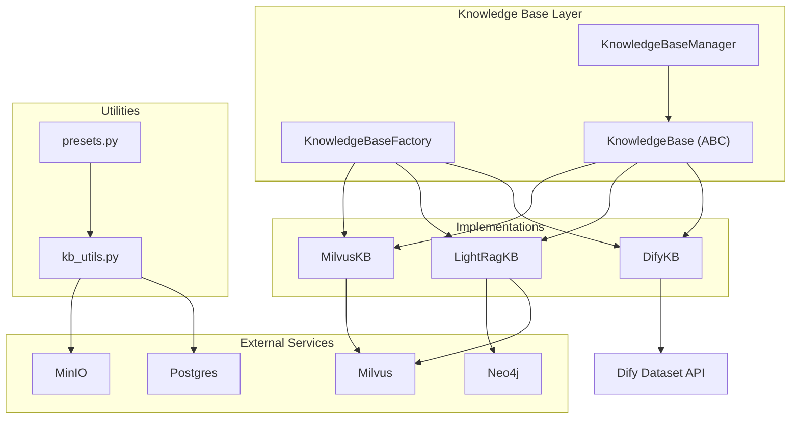
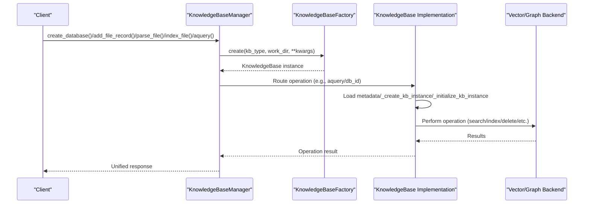
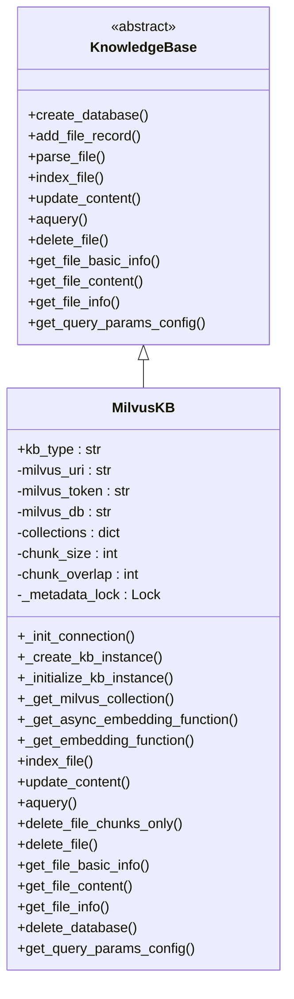
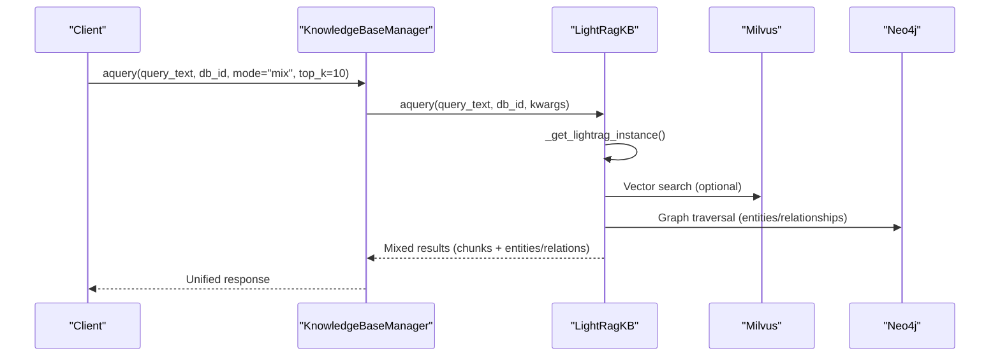
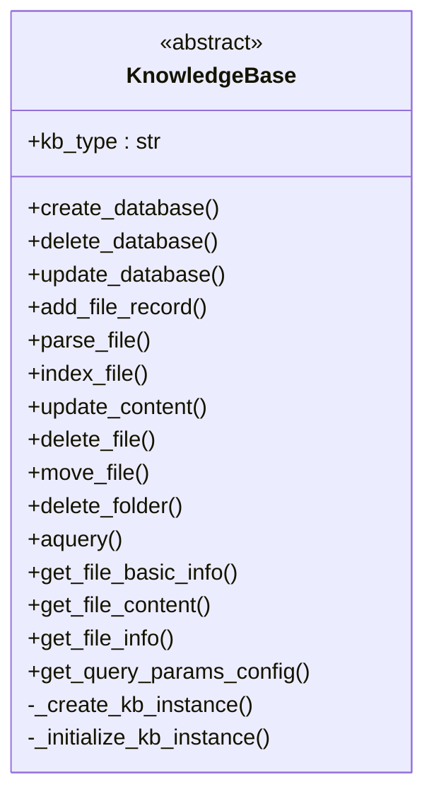
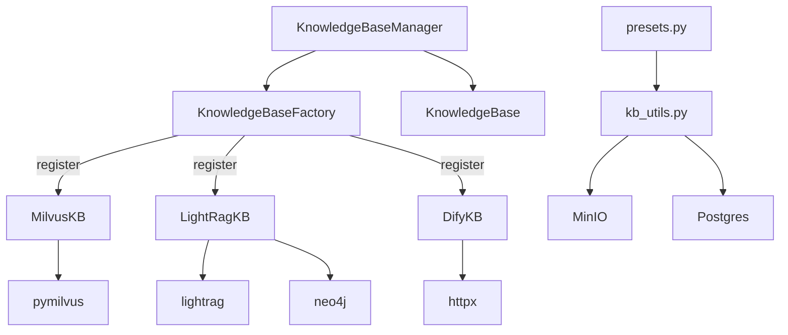

# Vector Database Integration

<cite>
**Referenced Files in This Document**
- [base.py](file://backend/package/yuxi/knowledge/base.py)
- [factory.py](file://backend/package/yuxi/knowledge/factory.py)
- [manager.py](file://backend/package/yuxi/knowledge/manager.py)
- [milvus.py](file://backend/package/yuxi/knowledge/implementations/milvus.py)
- [lightrag.py](file://backend/package/yuxi/knowledge/implementations/lightrag.py)
- [dify.py](file://backend/package/yuxi/knowledge/implementations/dify.py)
- [__init__.py](file://backend/package/yuxi/knowledge/implementations/__init__.py)
- [__init__.py](file://backend/package/yuxi/knowledge/__init__.py)
- [kb_utils.py](file://backend/package/yuxi/knowledge/utils/kb_utils.py)
- [presets.py](file://backend/package/yuxi/knowledge/chunking/ragflow_like/presets.py)
- [app.py](file://backend/package/yuxi/config/app.py)
- [docker-compose.yml](file://docker-compose.yml)
- [docker-compose.prod.yml](file://docker-compose.prod.yml)
</cite>

## Table of Contents
1. [Introduction](#introduction)
2. [Project Structure](#project-structure)
3. [Core Components](#core-components)
4. [Architecture Overview](#architecture-overview)
5. [Detailed Component Analysis](#detailed-component-analysis)
6. [Dependency Analysis](#dependency-analysis)
7. [Performance Considerations](#performance-considerations)
8. [Troubleshooting Guide](#troubleshooting-guide)
9. [Conclusion](#conclusion)
10. [Appendices](#appendices)

## Introduction
This document provides comprehensive documentation for vector database integration within the knowledge base system. It explains the pluggable architecture supporting multiple vector database backends, details the Milvus integration for collection management, embedding storage, and similarity search, and covers the LightRAG integration for graph-based knowledge representation and entity relationship building. It also documents the abstract base classes and interface contracts, configuration examples, connection management, performance tuning, query optimization, indexing strategies, scalability considerations, backup procedures, and migration between providers.

## Project Structure
The knowledge base system is organized around a factory pattern and a pluggable architecture:
- Abstract base classes define the interface contract for knowledge base implementations.
- A factory registers and instantiates concrete implementations (Milvus, LightRAG, Dify).
- A manager coordinates metadata loading, routing requests to the appropriate implementation, and provides unified APIs.
- Implementations encapsulate backend-specific logic (Milvus collections, LightRAG graph storage, Dify read-only retrieval).
- Utilities support chunking, embedding configuration, and MinIO integration.

**Diagram sources**
- [factory.py:1-108](file://backend/package/yuxi/knowledge/factory.py#L1-L108)
- [manager.py:1-200](file://backend/package/yuxi/knowledge/manager.py#L1-L200)
- [base.py:46-120](file://backend/package/yuxi/knowledge/base.py#L46-L120)
- [milvus.py:24-80](file://backend/package/yuxi/knowledge/implementations/milvus.py#L24-L80)
- [lightrag.py:23-50](file://backend/package/yuxi/knowledge/implementations/lightrag.py#L23-L50)
- [dify.py:10-30](file://backend/package/yuxi/knowledge/implementations/dify.py#L10-L30)
- [kb_utils.py:1-120](file://backend/package/yuxi/knowledge/utils/kb_utils.py#L1-L120)
- [presets.py:1-120](file://backend/package/yuxi/knowledge/chunking/ragflow_like/presets.py#L1-L120)

**Section sources**
- [factory.py:1-108](file://backend/package/yuxi/knowledge/factory.py#L1-L108)
- [manager.py:1-200](file://backend/package/yuxi/knowledge/manager.py#L1-L200)
- [base.py:46-120](file://backend/package/yuxi/knowledge/base.py#L46-L120)

## Core Components
- KnowledgeBase (abstract): Defines the interface contract for all knowledge base implementations, including lifecycle hooks, metadata management, file operations, indexing, querying, and configuration.
- KnowledgeBaseFactory: Registers and creates knowledge base instances by type, merging default configurations with user-provided parameters.
- KnowledgeBaseManager: Central coordinator that loads metadata per type, routes operations to the correct implementation, and exposes unified APIs for database and file operations.
- Implementations:
  - MilvusKB: Manages Milvus collections, embedding vectors, and hybrid vector/keyword search with optional reranking.
  - LightRagKB: Integrates LightRAG with Milvus for vector storage and Neo4j for graph storage, enabling entity/relationship extraction and mixed retrieval.
  - DifyKB: Provides read-only retrieval via Dify Dataset API.

Key responsibilities:
- Metadata normalization and persistence via Postgres repositories.
- Chunking and embedding pipeline via chunking presets and embedding utilities.
- MinIO integration for parsed markdown storage and retrieval.

**Section sources**
- [base.py:46-120](file://backend/package/yuxi/knowledge/base.py#L46-L120)
- [factory.py:14-65](file://backend/package/yuxi/knowledge/factory.py#L14-L65)
- [manager.py:83-138](file://backend/package/yuxi/knowledge/manager.py#L83-L138)
- [milvus.py:24-80](file://backend/package/yuxi/knowledge/implementations/milvus.py#L24-L80)
- [lightrag.py:23-50](file://backend/package/yuxi/knowledge/implementations/lightrag.py#L23-L50)
- [dify.py:10-30](file://backend/package/yuxi/knowledge/implementations/dify.py#L10-L30)

## Architecture Overview
The system follows a layered architecture:
- Application layer interacts with KnowledgeBaseManager for database and file operations.
- Manager delegates to KnowledgeBase implementations based on kb_type.
- Implementations manage backend-specific resources (Milvus, Neo4j, external APIs) and coordinate with utilities for chunking and embedding.
- Metadata is persisted in Postgres; parsed content is stored in MinIO.

**Diagram sources**
- [manager.py:326-436](file://backend/package/yuxi/knowledge/manager.py#L326-L436)
- [factory.py:32-65](file://backend/package/yuxi/knowledge/factory.py#L32-L65)
- [base.py:168-190](file://backend/package/yuxi/knowledge/base.py#L168-L190)

**Section sources**
- [manager.py:326-436](file://backend/package/yuxi/knowledge/manager.py#L326-L436)
- [factory.py:32-65](file://backend/package/yuxi/knowledge/factory.py#L32-L65)
- [base.py:168-190](file://backend/package/yuxi/knowledge/base.py#L168-L190)

## Detailed Component Analysis

### Milvus Integration
MilvusKB provides production-grade vector storage with:
- Connection management via URI/token and database selection.
- Collection creation with schema definition (id, content, source, chunk_id, file_id, chunk_index, embedding).
- Index creation (IVF_FLAT) and metric configuration (COSINE).
- Asynchronous embedding generation using configured embedding models.
- Hybrid search supporting vector, keyword, and hybrid modes with optional reranking.
- File-level CRUD operations with chunk-level updates and deletions.

**Diagram sources**
- [base.py:46-120](file://backend/package/yuxi/knowledge/base.py#L46-L120)
- [milvus.py:24-80](file://backend/package/yuxi/knowledge/implementations/milvus.py#L24-L80)

Key capabilities:
- Collection lifecycle: creation, loading, and deletion.
- Embedding pipeline: async and sync embedding functions with batching.
- Query pipeline: vector search, keyword search, hybrid scoring, similarity threshold filtering, optional reranking.
- File operations: chunk-level updates and deletions preserving metadata.

**Section sources**
- [milvus.py:24-80](file://backend/package/yuxi/knowledge/implementations/milvus.py#L24-L80)
- [milvus.py:227-355](file://backend/package/yuxi/knowledge/implementations/milvus.py#L227-L355)
- [milvus.py:471-676](file://backend/package/yuxi/knowledge/implementations/milvus.py#L471-L676)
- [milvus.py:677-795](file://backend/package/yuxi/knowledge/implementations/milvus.py#L677-L795)

### LightRAG Integration
LightRagKB integrates LightRAG with Milvus (vector storage) and Neo4j (graph storage):
- Instance caching and initialization with addon parameters (e.g., language).
- Embedding function selection supporting OpenAI and Ollama variants.
- Document insertion with chunk payload preparation and deduplication.
- Mixed retrieval modes (local/global/hybrid/naive/mix) with configurable top-k and content scope.
- Entity/relationship extraction and graph-based queries.
- Multi-backend cleanup for Milvus and Neo4j when deleting databases.

**Diagram sources**
- [lightrag.py:23-50](file://backend/package/yuxi/knowledge/implementations/lightrag.py#L23-L50)
- [lightrag.py:526-597](file://backend/package/yuxi/knowledge/implementations/lightrag.py#L526-L597)

**Section sources**
- [lightrag.py:23-50](file://backend/package/yuxi/knowledge/implementations/lightrag.py#L23-L50)
- [lightrag.py:136-181](file://backend/package/yuxi/knowledge/implementations/lightrag.py#L136-L181)
- [lightrag.py:305-421](file://backend/package/yuxi/knowledge/implementations/lightrag.py#L305-L421)
- [lightrag.py:526-597](file://backend/package/yuxi/knowledge/implementations/lightrag.py#L526-L597)
- [lightrag.py:602-625](file://backend/package/yuxi/knowledge/implementations/lightrag.py#L602-L625)

### Dify Integration (Read-Only)
DifyKB provides read-only retrieval against Dify Dataset APIs:
- Enforces read-only operations by raising errors for write actions.
- Supports vector, keyword, and hybrid search modes mapped to Dify’s retrieval methods.
- Configurable thresholds and top-k parameters.
- Fallback behavior for compatibility with varying Dify deployments.

**Section sources**
- [dify.py:10-30](file://backend/package/yuxi/knowledge/implementations/dify.py#L10-L30)
- [dify.py:69-162](file://backend/package/yuxi/knowledge/implementations/dify.py#L69-L162)
- [dify.py:178-221](file://backend/package/yuxi/knowledge/implementations/dify.py#L178-L221)

### Abstract Base Classes and Interface Contracts
The KnowledgeBase abstract class defines the canonical interface:
- Lifecycle: create_database, delete_database, update_database.
- File lifecycle: add_file_record, parse_file, index_file, update_content, delete_file, move_file, delete_folder.
- Retrieval: aquery with unified result format; get_file_* helpers.
- Metadata: load_metadata, persist operations, normalized timestamps.
- Query configuration: get_query_params_config per implementation.

**Diagram sources**
- [base.py:46-120](file://backend/package/yuxi/knowledge/base.py#L46-L120)

**Section sources**
- [base.py:46-120](file://backend/package/yuxi/knowledge/base.py#L46-L120)
- [base.py:1020-1257](file://backend/package/yuxi/knowledge/base.py#L1020-L1257)

## Dependency Analysis
- Factory-to-Implementation: Registered types are Milvus, LightRAG, and Dify. The factory merges default configs with user-provided kwargs.
- Manager-to-Factory: Creates instances per kb_type and caches them for reuse.
- Implementation-to-Backend: MilvusKB uses pymilvus; LightRagKB uses lightrag with Milvus and Neo4j; DifyKB uses HTTP client to Dify API.
- Utilities-to-External: kb_utils integrates MinIO and Postgres repositories; chunking presets drive text splitting.

**Diagram sources**
- [factory.py:14-65](file://backend/package/yuxi/knowledge/factory.py#L14-L65)
- [manager.py:83-138](file://backend/package/yuxi/knowledge/manager.py#L83-L138)
- [milvus.py:9-19](file://backend/package/yuxi/knowledge/implementations/milvus.py#L9-L19)
- [lightrag.py:6-11](file://backend/package/yuxi/knowledge/implementations/lightrag.py#L6-L11)
- [dify.py:4-7](file://backend/package/yuxi/knowledge/implementations/dify.py#L4-L7)
- [kb_utils.py:1-20](file://backend/package/yuxi/knowledge/utils/kb_utils.py#L1-L20)
- [presets.py:1-30](file://backend/package/yuxi/knowledge/chunking/ragflow_like/presets.py#L1-L30)

**Section sources**
- [factory.py:14-65](file://backend/package/yuxi/knowledge/factory.py#L14-L65)
- [manager.py:83-138](file://backend/package/yuxi/knowledge/manager.py#L83-L138)
- [__init__.py:11-21](file://backend/package/yuxi/knowledge/__init__.py#L11-L21)

## Performance Considerations
- Indexing and search parameters:
  - IVF_FLAT index with configurable nlist for Milvus.
  - Metric type COSINE with distance normalization.
  - nprobe parameter controls recall-speed trade-off.
- Batch embedding:
  - Async/sync embedding functions with configurable batch sizes.
- Query-time ranking:
  - Similarity threshold filtering and optional reranking with configurable recall_top_k and final_top_k.
- Concurrency:
  - Per-database locks for write operations and per-instance initialization locks for LightRAG.
- Chunking:
  - Token-based chunk sizing and overlap percent derived from presets.
- Caching:
  - In-memory collection and LightRAG instance caches keyed by db_id.

[No sources needed since this section provides general guidance]

## Troubleshooting Guide
Common issues and resolutions:
- Milvus connection failures:
  - Verify URI and token; ensure database exists and is selected.
  - Check collection existence and recreate if model mismatch detected.
- Embedding configuration errors:
  - Ensure embed_info contains valid model_id and environment variables are set.
- Query parameter mismatches:
  - Use get_query_params_config to discover supported parameters per kb_type.
- LightRAG initialization failures:
  - Confirm Milvus and Neo4j connectivity; verify addon parameters (e.g., language).
- Dify API errors:
  - Validate API URL, token, and dataset_id; fallback behavior handles certain compatibility issues.

**Section sources**
- [milvus.py:70-89](file://backend/package/yuxi/knowledge/implementations/milvus.py#L70-L89)
- [milvus.py:90-134](file://backend/package/yuxi/knowledge/implementations/milvus.py#L90-L134)
- [lightrag.py:61-111](file://backend/package/yuxi/knowledge/implementations/lightrag.py#L61-L111)
- [dify.py:69-129](file://backend/package/yuxi/knowledge/implementations/dify.py#L69-L129)

## Conclusion
The knowledge base system provides a robust, pluggable architecture for vector and graph-based retrieval. MilvusKB offers production-ready vector operations with flexible query modes and reranking. LightRagKB extends capabilities with graph-based entity/relationship extraction and mixed retrieval. The factory and manager layers ensure clean separation of concerns, while utilities and presets standardize chunking and embedding. Configuration via environment variables and Docker Compose enables seamless deployment across providers.

[No sources needed since this section summarizes without analyzing specific files]

## Appendices

### Configuration Examples and Environment Variables
- Milvus:
  - Environment variables: MILVUS_URI, MILVUS_TOKEN, MILVUS_DB_NAME.
  - Connection aliasing ensures isolation per work_dir.
- Neo4j:
  - Environment variables: NEO4J_URI, NEO4J_USERNAME, NEO4J_PASSWORD.
- MinIO:
  - Environment variables: MINIO_URI (used by utilities for MinIO operations).
- Postgres:
  - Environment variable: POSTGRES_URL (used by repositories).
- Docker Compose:
  - Services for milvus, neo4j, minio, and redis are defined with health checks and volumes.

**Section sources**
- [milvus.py:43-45](file://backend/package/yuxi/knowledge/implementations/milvus.py#L43-L45)
- [lightrag.py:84-87](file://backend/package/yuxi/knowledge/implementations/lightrag.py#L84-L87)
- [docker-compose.yml:7-15](file://docker-compose.yml#L7-L15)
- [docker-compose.yml:202-226](file://docker-compose.yml#L202-L226)
- [docker-compose.prod.yml:202-215](file://docker-compose.prod.yml#L202-L215)

### Query Optimization and Indexing Strategies
- Milvus:
  - Use IVF_FLAT with tuned nlist; adjust nprobe for latency vs. recall balance.
  - Apply similarity threshold filtering post-search.
  - Optional reranking improves precision at cost of latency.
- LightRAG:
  - Configure retrieval mode (local/global/hybrid/naive/mix) and top_k.
  - Scope content returned to chunks, graph, or both.
- Chunking:
  - Choose presets (general, qa, book, laws) and tune chunk_token_num and overlapped_percent.

**Section sources**
- [milvus.py:158-160](file://backend/package/yuxi/knowledge/implementations/milvus.py#L158-L160)
- [milvus.py:485-499](file://backend/package/yuxi/knowledge/implementations/milvus.py#L485-L499)
- [lightrag.py:534-566](file://backend/package/yuxi/knowledge/implementations/lightrag.py#L534-L566)
- [presets.py:35-66](file://backend/package/yuxi/knowledge/chunking/ragflow_like/presets.py#L35-L66)

### Scalability and Migration
- Horizontal scaling:
  - Use separate work_dir per kb_type and isolate connections per instance.
  - Leverage per-db locks to avoid contention.
- Migration between providers:
  - Export/import via implementation-specific mechanisms (e.g., LightRAG export disabled pending upstream fix).
  - Maintain consistent metadata schema in Postgres for cross-provider portability.
- Backup and restore:
  - Persist metadata in Postgres; store parsed content in MinIO.
  - For LightRAG, remove Milvus and Neo4j collections alongside local metadata on delete.

**Section sources**
- [manager.py:389-404](file://backend/package/yuxi/knowledge/manager.py#L389-L404)
- [lightrag.py:61-111](file://backend/package/yuxi/knowledge/implementations/lightrag.py#L61-L111)
- [kb_utils.py:470-520](file://backend/package/yuxi/knowledge/utils/kb_utils.py#L470-L520)