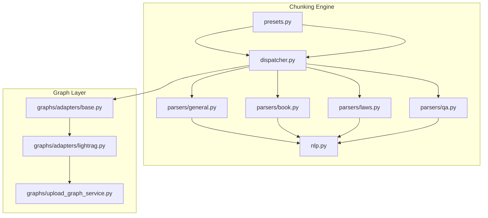
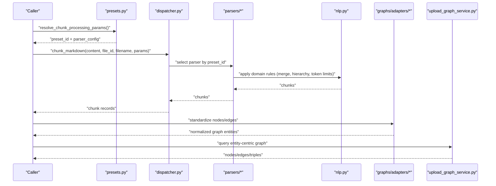
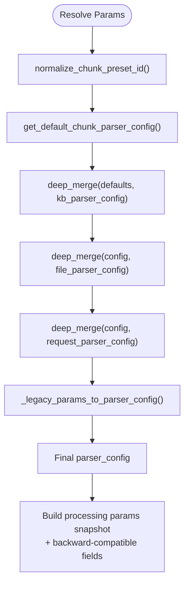
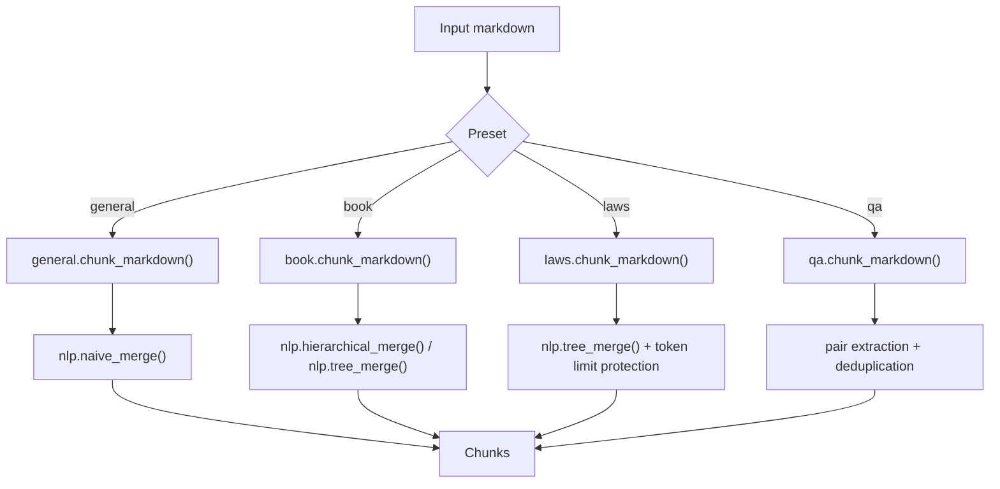
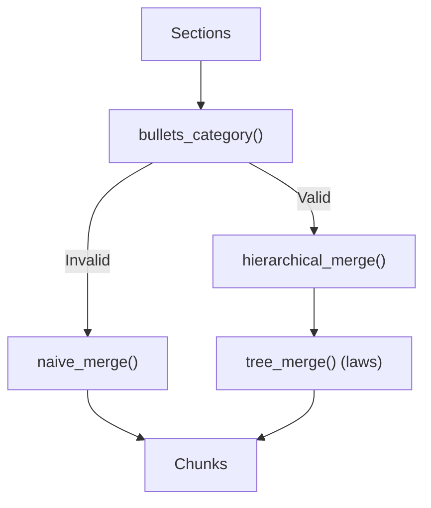
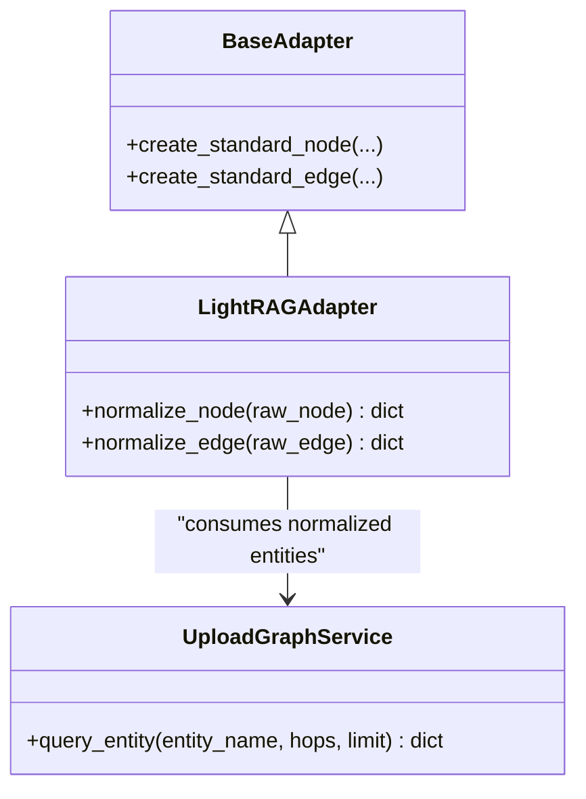
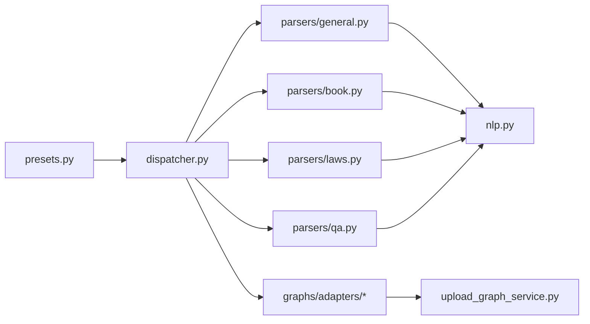

# Entity Extraction & Relationship Building

<cite>
**Referenced Files in This Document**
- [nlp.py](file://backend/package/yuxi/knowledge/chunking/ragflow_like/nlp.py)
- [presets.py](file://backend/package/yuxi/knowledge/chunking/ragflow_like/presets.py)
- [dispatcher.py](file://backend/package/yuxi/knowledge/chunking/ragflow_like/dispatcher.py)
- [general.py](file://backend/package/yuxi/knowledge/chunking/ragflow_like/parsers/general.py)
- [book.py](file://backend/package/yuxi/knowledge/chunking/ragflow_like/parsers/book.py)
- [laws.py](file://backend/package/yuxi/knowledge/chunking/ragflow_like/parsers/laws.py)
- [qa.py](file://backend/package/yuxi/knowledge/chunking/ragflow_like/parsers/qa.py)
- [base.py](file://backend/package/yuxi/knowledge/graphs/adapters/base.py)
- [lightrag.py](file://backend/package/yuxi/knowledge/graphs/adapters/lightrag.py)
- [upload_graph_service.py](file://backend/package/yuxi/knowledge/graphs/upload_graph_service.py)
</cite>

## Table of Contents
1. [Introduction](#introduction)
2. [Project Structure](#project-structure)
3. [Core Components](#core-components)
4. [Architecture Overview](#architecture-overview)
5. [Detailed Component Analysis](#detailed-component-analysis)
6. [Dependency Analysis](#dependency-analysis)
7. [Performance Considerations](#performance-considerations)
8. [Troubleshooting Guide](#troubleshooting-guide)
9. [Conclusion](#conclusion)
10. [Appendices](#appendices)

## Introduction
This document explains the entity extraction and relationship building pipeline implemented in the repository. It focuses on:
- How text is segmented into chunks tailored to domain types (general, QA, books, laws)
- How the system prepares structured knowledge for downstream entity and relationship extraction
- How graph adapters and upload services standardize and export extracted entities and relations
- Preset configurations per domain and how to customize parameters
- Practical guidance for tuning extraction behavior and handling edge cases
- Performance optimization strategies for large-scale workflows

Note: The repository’s chunking and graph layers provide the foundation for entity and relationship extraction. While dedicated NER or SRL modules are not present here, the chunking presets and graph adapters enable a robust knowledge graph construction workflow.

## Project Structure
The entity and relationship building capability is centered around:
- Domain-aware chunking and normalization (ragflow-like engine)
- Graph adapters and upload service for standardized entity/edge representation
- Preset configuration and parameter resolution

**Diagram sources**
- [dispatcher.py:1-65](file://backend/package/yuxi/knowledge/chunking/ragflow_like/dispatcher.py#L1-L65)
- [general.py:1-47](file://backend/package/yuxi/knowledge/chunking/ragflow_like/parsers/general.py#L1-L47)
- [book.py:1-62](file://backend/package/yuxi/knowledge/chunking/ragflow_like/parsers/book.py#L1-L62)
- [laws.py:1-210](file://backend/package/yuxi/knowledge/chunking/ragflow_like/parsers/laws.py#L1-L210)
- [qa.py:1-261](file://backend/package/yuxi/knowledge/chunking/ragflow_like/parsers/qa.py#L1-L261)
- [nlp.py:1-535](file://backend/package/yuxi/knowledge/chunking/ragflow_like/nlp.py#L1-L535)
- [presets.py:1-239](file://backend/package/yuxi/knowledge/chunking/ragflow_like/presets.py#L1-L239)
- [base.py:89-135](file://backend/package/yuxi/knowledge/graphs/adapters/base.py#L89-L135)
- [lightrag.py:125-157](file://backend/package/yuxi/knowledge/graphs/adapters/lightrag.py#L125-L157)
- [upload_graph_service.py:726-777](file://backend/package/yuxi/knowledge/graphs/upload_graph_service.py#L726-L777)

**Section sources**
- [dispatcher.py:1-65](file://backend/package/yuxi/knowledge/chunking/ragflow_like/dispatcher.py#L1-L65)
- [presets.py:1-239](file://backend/package/yuxi/knowledge/chunking/ragflow_like/presets.py#L1-L239)

## Core Components
- Chunking presets and defaults define how documents are segmented and prepared for knowledge graph ingestion.
- Domain-specific parsers apply targeted strategies (e.g., QA pair extraction, book chapter merging, legal article parsing).
- The NLP utilities provide token counting, heading detection, hierarchical merging, and safe chunking under token limits.
- Graph adapters and upload service convert internal structures into standardized nodes and edges for downstream systems.

Key responsibilities:
- Presets: Define default chunk sizes, delimiters, and optional enrichment (e.g., RAPTOR summarization, GraphRAG entity types).
- Dispatch: Route markdown content to the appropriate parser based on preset ID.
- Parsers: Transform markdown into domain-tailored chunks.
- NLP: Provide robust text segmentation and hierarchy-aware merging.
- Graph adapters: Normalize nodes and edges for external graph databases.
- Upload service: Query and return structured triples/nodes/edges for a given entity.

**Section sources**
- [presets.py:30-104](file://backend/package/yuxi/knowledge/chunking/ragflow_like/presets.py#L30-L104)
- [dispatcher.py:32-57](file://backend/package/yuxi/knowledge/chunking/ragflow_like/dispatcher.py#L32-L57)
- [nlp.py:49-535](file://backend/package/yuxi/knowledge/chunking/ragflow_like/nlp.py#L49-L535)
- [base.py:89-135](file://backend/package/yuxi/knowledge/graphs/adapters/base.py#L89-L135)
- [lightrag.py:125-157](file://backend/package/yuxi/knowledge/graphs/adapters/lightrag.py#L125-L157)
- [upload_graph_service.py:726-777](file://backend/package/yuxi/knowledge/graphs/upload_graph_service.py#L726-L777)

## Architecture Overview
The end-to-end flow:
1. Resolve preset and parser configuration from request/knowledge base/file parameters.
2. Dispatch markdown content to the correct parser.
3. Apply domain-specific chunking and normalization.
4. Convert chunks into graph-ready nodes/edges via adapters.
5. Optionally query uploaded graph for entity-centric results.

**Diagram sources**
- [presets.py:161-213](file://backend/package/yuxi/knowledge/chunking/ragflow_like/presets.py#L161-L213)
- [dispatcher.py:49-65](file://backend/package/yuxi/knowledge/chunking/ragflow_like/dispatcher.py#L49-L65)
- [general.py:33-47](file://backend/package/yuxi/knowledge/chunking/ragflow_like/parsers/general.py#L33-L47)
- [book.py:26-62](file://backend/package/yuxi/knowledge/chunking/ragflow_like/parsers/book.py#L26-L62)
- [laws.py:169-210](file://backend/package/yuxi/knowledge/chunking/ragflow_like/parsers/laws.py#L169-L210)
- [qa.py:213-261](file://backend/package/yuxi/knowledge/chunking/ragflow_like/parsers/qa.py#L213-L261)
- [nlp.py:411-482](file://backend/package/yuxi/knowledge/chunking/ragflow_like/nlp.py#L411-L482)
- [base.py:89-135](file://backend/package/yuxi/knowledge/graphs/adapters/base.py#L89-L135)
- [upload_graph_service.py:726-777](file://backend/package/yuxi/knowledge/graphs/upload_graph_service.py#L726-L777)

## Detailed Component Analysis

### Preset Configuration and Parameter Resolution
- Preset IDs: general, qa, book, laws.
- Defaults include chunk size, delimiter, overlapped percent, and optional enrichment toggles (RAPTOR, GraphRAG).
- Legacy parameters (e.g., chunk_size, chunk_overlap, qa_separator) are normalized into the modern parser_config.
- Resolution order: request > file > knowledge base > defaults.

**Diagram sources**
- [presets.py:79-213](file://backend/package/yuxi/knowledge/chunking/ragflow_like/presets.py#L79-L213)

**Section sources**
- [presets.py:13-25](file://backend/package/yuxi/knowledge/chunking/ragflow_like/presets.py#L13-L25)
- [presets.py:30-104](file://backend/package/yuxi/knowledge/chunking/ragflow_like/presets.py#L30-L104)
- [presets.py:161-213](file://backend/package/yuxi/knowledge/chunking/ragflow_like/presets.py#L161-L213)

### Domain-Specific Parsers
- General: Split by delimiter or lines, merge to token budget with optional overlap.
- Book: Detect headings and hierarchy; merge by levels; fallback to naive merge.
- Laws: Normalize legal headings; prefer heading-tree or hierarchical merge; enforce token limits safely.
- QA: Extract question-answer pairs from CSV/XLSX/Markdown/TXT; support prefix-based and table-based extraction; deduplicate and format.

**Diagram sources**
- [dispatcher.py:32-57](file://backend/package/yuxi/knowledge/chunking/ragflow_like/dispatcher.py#L32-L57)
- [general.py:33-47](file://backend/package/yuxi/knowledge/chunking/ragflow_like/parsers/general.py#L33-L47)
- [book.py:26-62](file://backend/package/yuxi/knowledge/chunking/ragflow_like/parsers/book.py#L26-L62)
- [laws.py:169-210](file://backend/package/yuxi/knowledge/chunking/ragflow_like/parsers/laws.py#L169-L210)
- [qa.py:213-261](file://backend/package/yuxi/knowledge/chunking/ragflow_like/parsers/qa.py#L213-L261)
- [nlp.py:411-482](file://backend/package/yuxi/knowledge/chunking/ragflow_like/nlp.py#L411-L482)

**Section sources**
- [general.py:33-47](file://backend/package/yuxi/knowledge/chunking/ragflow_like/parsers/general.py#L33-L47)
- [book.py:26-62](file://backend/package/yuxi/knowledge/chunking/ragflow_like/parsers/book.py#L26-L62)
- [laws.py:169-210](file://backend/package/yuxi/knowledge/chunking/ragflow_like/parsers/laws.py#L169-L210)
- [qa.py:213-261](file://backend/package/yuxi/knowledge/chunking/ragflow_like/parsers/qa.py#L213-L261)

### NLP Utilities for Chunking and Hierarchy
Key capabilities:
- Token counting approximation for budget enforcement.
- Heading detection heuristics and bullet category classification.
- Hierarchical merging and tree-based aggregation.
- Safe hard-split under token limits with fallback strategies.

**Diagram sources**
- [nlp.py:140-178](file://backend/package/yuxi/knowledge/chunking/ragflow_like/nlp.py#L140-L178)
- [nlp.py:306-401](file://backend/package/yuxi/knowledge/chunking/ragflow_like/nlp.py#L306-L401)
- [nlp.py:411-482](file://backend/package/yuxi/knowledge/chunking/ragflow_like/nlp.py#L411-L482)

**Section sources**
- [nlp.py:49-56](file://backend/package/yuxi/knowledge/chunking/ragflow_like/nlp.py#L49-L56)
- [nlp.py:90-116](file://backend/package/yuxi/knowledge/chunking/ragflow_like/nlp.py#L90-L116)
- [nlp.py:140-178](file://backend/package/yuxi/knowledge/chunking/ragflow_like/nlp.py#L140-L178)
- [nlp.py:306-401](file://backend/package/yuxi/knowledge/chunking/ragflow_like/nlp.py#L306-L401)
- [nlp.py:411-482](file://backend/package/yuxi/knowledge/chunking/ragflow_like/nlp.py#L411-L482)

### Graph Adapters and Upload Service
- Standardized node/edge creation with consistent fields (IDs, labels, properties, normalized metadata).
- Neo4j adapter normalizes edge types and labels, filtering unwanted prefixes.
- Upload service queries entity neighborhoods and returns structured triples.

**Diagram sources**
- [base.py:89-135](file://backend/package/yuxi/knowledge/graphs/adapters/base.py#L89-L135)
- [lightrag.py:125-157](file://backend/package/yuxi/knowledge/graphs/adapters/lightrag.py#L125-L157)
- [upload_graph_service.py:726-777](file://backend/package/yuxi/knowledge/graphs/upload_graph_service.py#L726-L777)

**Section sources**
- [base.py:89-135](file://backend/package/yuxi/knowledge/graphs/adapters/base.py#L89-L135)
- [lightrag.py:125-157](file://backend/package/yuxi/knowledge/graphs/adapters/lightrag.py#L125-L157)
- [upload_graph_service.py:726-777](file://backend/package/yuxi/knowledge/graphs/upload_graph_service.py#L726-L777)

## Dependency Analysis
- Presets feed dispatcher with normalized preset_id and parser_config.
- Dispatcher selects a parser based on preset_id.
- Parsers depend on NLP utilities for segmentation and hierarchy.
- Graph adapters depend on base adapter contracts to produce uniform structures.
- Upload service consumes graph structures for retrieval.

**Diagram sources**
- [presets.py:79-213](file://backend/package/yuxi/knowledge/chunking/ragflow_like/presets.py#L79-L213)
- [dispatcher.py:32-57](file://backend/package/yuxi/knowledge/chunking/ragflow_like/dispatcher.py#L32-L57)
- [general.py:1-47](file://backend/package/yuxi/knowledge/chunking/ragflow_like/parsers/general.py#L1-L47)
- [book.py:1-62](file://backend/package/yuxi/knowledge/chunking/ragflow_like/parsers/book.py#L1-L62)
- [laws.py:1-210](file://backend/package/yuxi/knowledge/chunking/ragflow_like/parsers/laws.py#L1-L210)
- [qa.py:1-261](file://backend/package/yuxi/knowledge/chunking/ragflow_like/parsers/qa.py#L1-L261)
- [nlp.py:1-535](file://backend/package/yuxi/knowledge/chunking/ragflow_like/nlp.py#L1-L535)
- [base.py:89-135](file://backend/package/yuxi/knowledge/graphs/adapters/base.py#L89-L135)
- [lightrag.py:125-157](file://backend/package/yuxi/knowledge/graphs/adapters/lightrag.py#L125-L157)
- [upload_graph_service.py:726-777](file://backend/package/yuxi/knowledge/graphs/upload_graph_service.py#L726-L777)

**Section sources**
- [dispatcher.py:32-57](file://backend/package/yuxi/knowledge/chunking/ragflow_like/dispatcher.py#L32-L57)
- [presets.py:161-213](file://backend/package/yuxi/knowledge/chunking/ragflow_like/presets.py#L161-L213)

## Performance Considerations
- Prefer preset-specific parsers to reduce post-processing and improve chunk quality.
- Tune chunk_token_num and overlapped_percent to balance recall and embedding costs.
- Use hierarchical_merge/tree_merge for structured documents (books, laws) to avoid oversplitting.
- Enforce token limits early and avoid deep recursion in fallbacks.
- Batch uploads and leverage graph adapters’ standardized structures to minimize conversion overhead.

[No sources needed since this section provides general guidance]

## Troubleshooting Guide
Common issues and remedies:
- Unexpectedly large chunks: Lower chunk_token_num or increase overlapped_percent to allow safer splitting.
- Poor QA pair extraction: Verify delimiter detection and ensure input files have proper suffix (.csv, .xlsx, .txt, .md).
- Legal document mis-hierarchy: Confirm heading normalization and fallback to naive_merge if bullets_category fails.
- Graph query returns empty: Check entity name spelling and adjust hops/limit; confirm labels and filters.

**Section sources**
- [nlp.py:118-178](file://backend/package/yuxi/knowledge/chunking/ragflow_like/nlp.py#L118-L178)
- [nlp.py:113-167](file://backend/package/yuxi/knowledge/chunking/ragflow_like/nlp.py#L113-L167)
- [laws.py:169-210](file://backend/package/yuxi/knowledge/chunking/ragflow_like/parsers/laws.py#L169-L210)
- [qa.py:213-261](file://backend/package/yuxi/knowledge/chunking/ragflow_like/parsers/qa.py#L213-L261)
- [upload_graph_service.py:726-777](file://backend/package/yuxi/knowledge/graphs/upload_graph_service.py#L726-L777)

## Conclusion
The repository implements a robust, preset-driven chunking pipeline that prepares domain-specific content for knowledge graph construction. By combining domain-aware parsers, NLP utilities for segmentation and hierarchy, and standardized graph adapters, it enables scalable entity and relationship building. Tuning preset parameters and leveraging the provided adapters ensures reliable performance across general, QA, book, and legal domains.

[No sources needed since this section summarizes without analyzing specific files]

## Appendices

### Preset Options and Descriptions
- General: default chunking with RAPTOR and GraphRAG enabled.
- QA: prioritizes question-answer extraction; disables RAPTOR/GraphRAG by default.
- Book: emphasizes chapter-level merging; disables RAPTOR/GraphRAG by default.
- Laws: enforces legal article parsing and token-limit protection; disables RAPTOR/GraphRAG by default.

**Section sources**
- [presets.py:20-25](file://backend/package/yuxi/knowledge/chunking/ragflow_like/presets.py#L20-L25)
- [presets.py:216-239](file://backend/package/yuxi/knowledge/chunking/ragflow_like/presets.py#L216-L239)

### Customization Examples
- Change chunk size and overlap:
  - Set chunk_token_num and overlapped_percent in chunk_parser_config.
- Switch preset:
  - Provide chunk_preset_id in request or file params.
- Modify delimiter:
  - Set delimiter in chunk_parser_config for general/book/laws.
- Enable/disable enrichment:
  - Toggle use_raptor/use_graphrag in chunk_parser_config.

**Section sources**
- [presets.py:101-104](file://backend/package/yuxi/knowledge/chunking/ragflow_like/presets.py#L101-L104)
- [presets.py:161-213](file://backend/package/yuxi/knowledge/chunking/ragflow_like/presets.py#L161-L213)
- [general.py:33-47](file://backend/package/yuxi/knowledge/chunking/ragflow_like/parsers/general.py#L33-L47)
- [book.py:26-62](file://backend/package/yuxi/knowledge/chunking/ragflow_like/parsers/book.py#L26-L62)
- [laws.py:169-210](file://backend/package/yuxi/knowledge/chunking/ragflow_like/parsers/laws.py#L169-L210)
- [qa.py:213-261](file://backend/package/yuxi/knowledge/chunking/ragflow_like/parsers/qa.py#L213-L261)