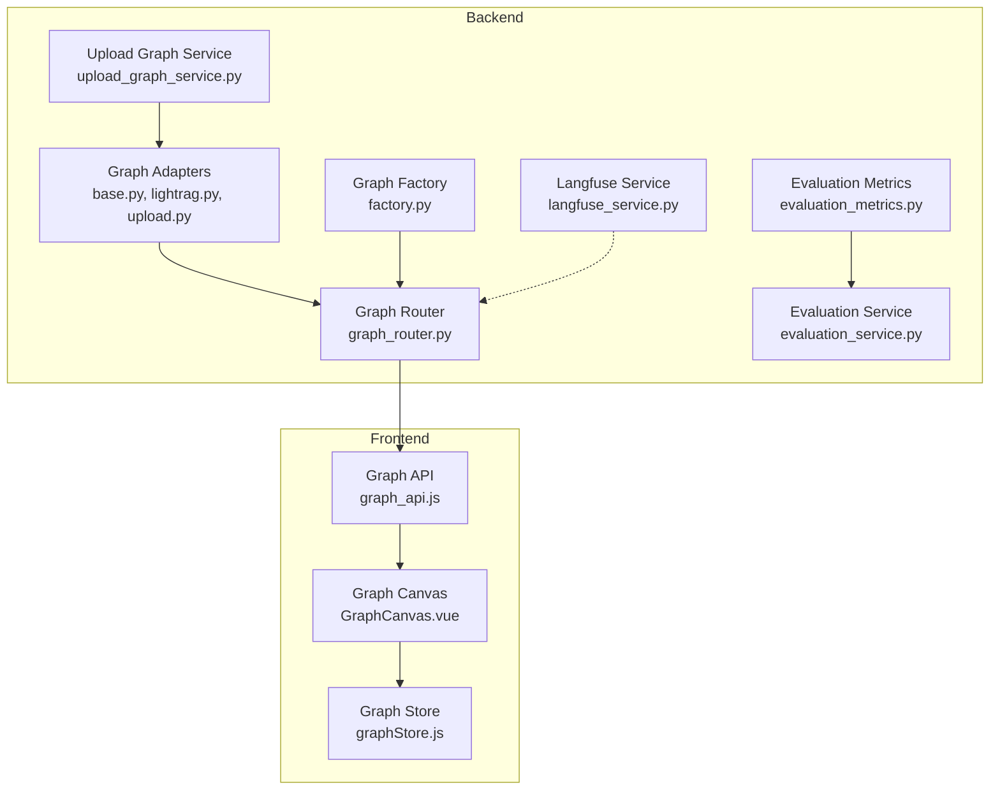
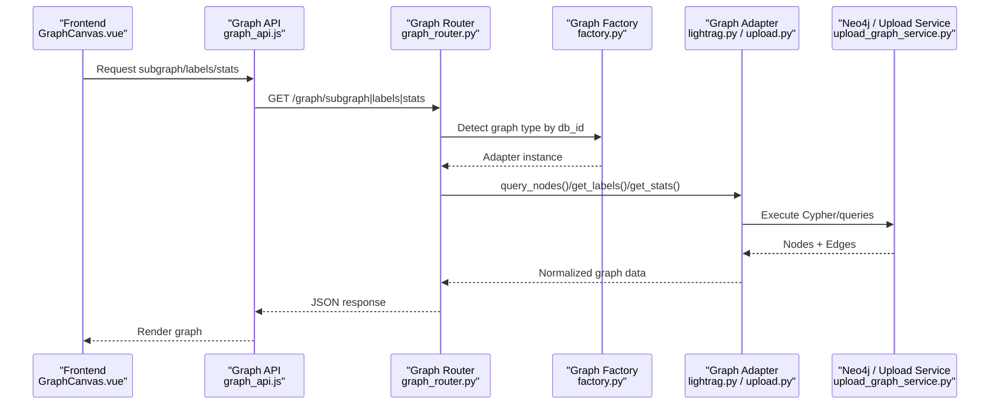
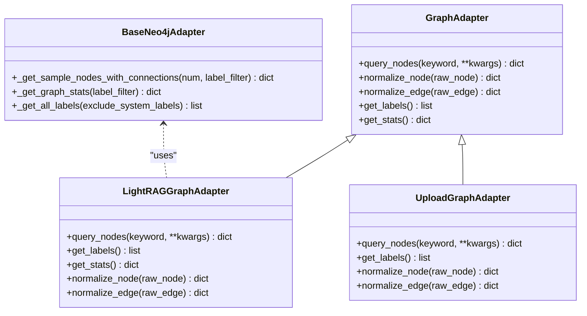
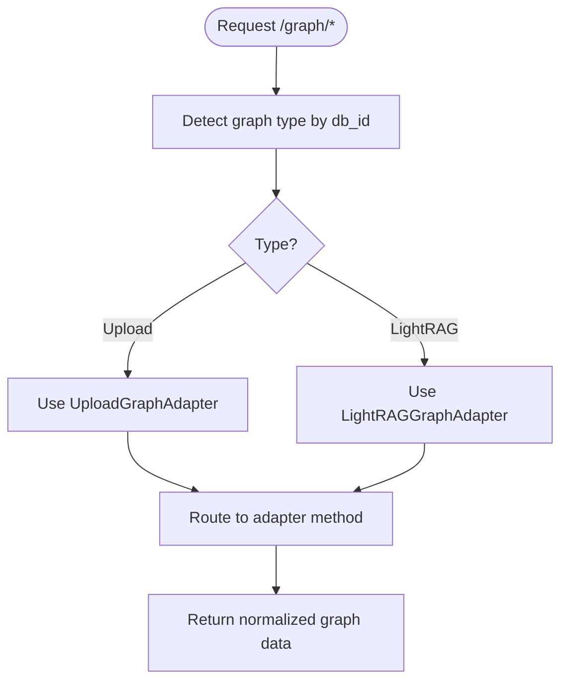
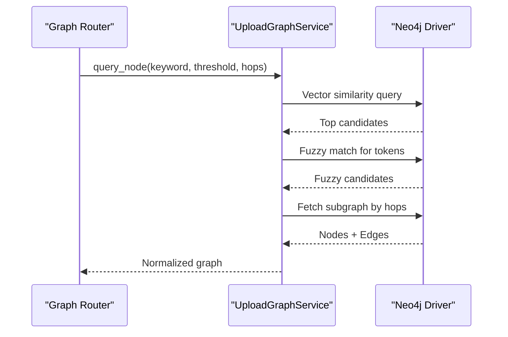
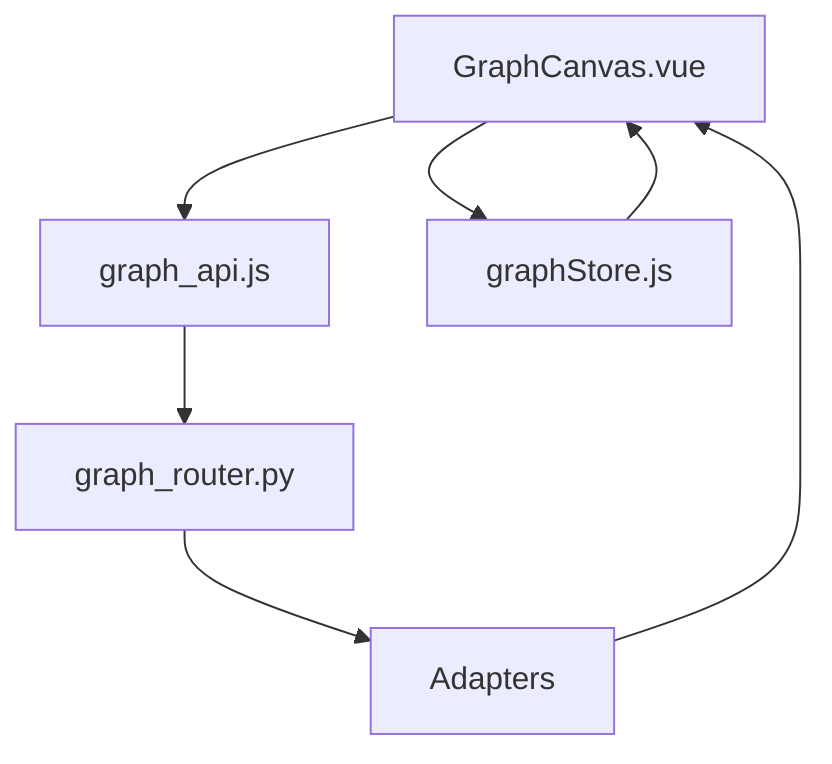
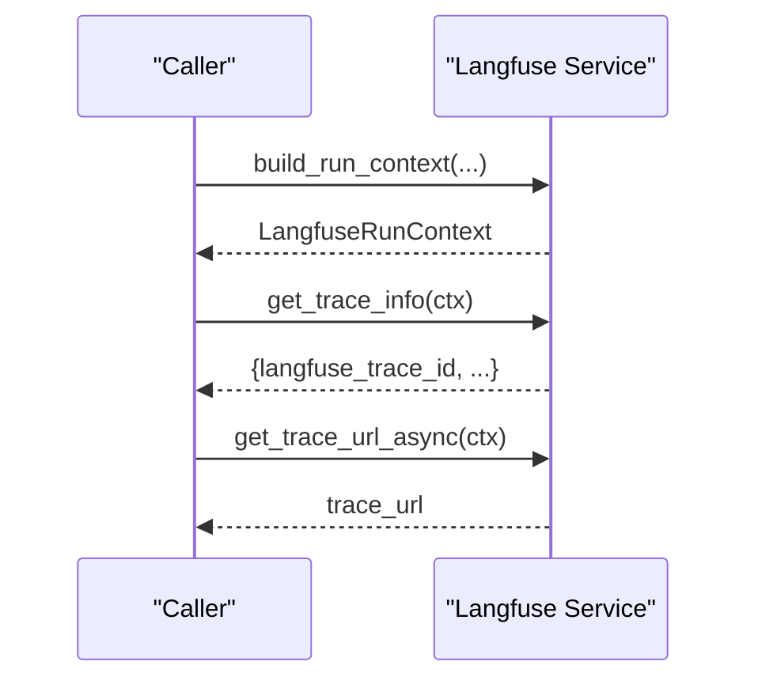
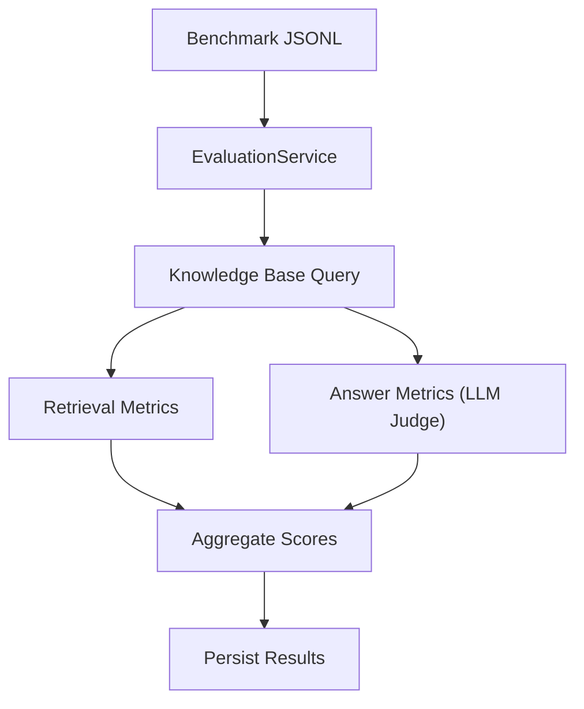
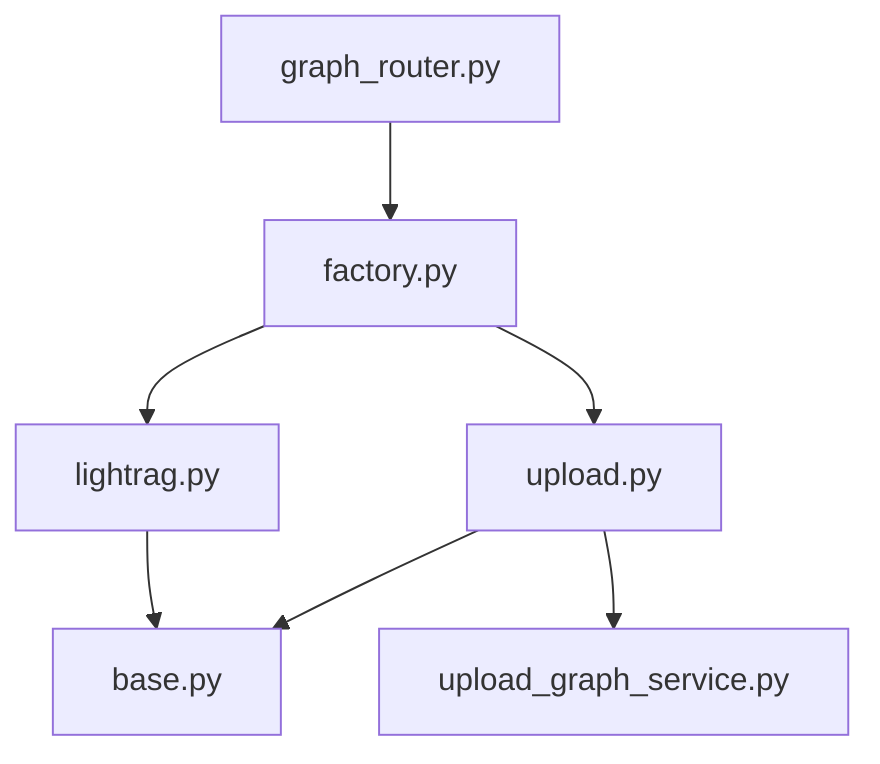

# Graph Analytics & Insights

<cite>
**Referenced Files in This Document**
- [base.py](file://backend/package/yuxi/knowledge/graphs/adapters/base.py)
- [lightrag.py](file://backend/package/yuxi/knowledge/graphs/adapters/lightrag.py)
- [upload.py](file://backend/package/yuxi/knowledge/graphs/adapters/upload.py)
- [factory.py](file://backend/package/yuxi/knowledge/graphs/adapters/factory.py)
- [upload_graph_service.py](file://backend/package/yuxi/knowledge/graphs/upload_graph_service.py)
- [graph_router.py](file://backend/server/routers/graph_router.py)
- [langfuse_service.py](file://backend/package/yuxi/services/langfuse_service.py)
- [evaluation_metrics.py](file://backend/package/yuxi/utils/evaluation_metrics.py)
- [models_knowledge.py](file://backend/package/yuxi/storage/postgres/models_knowledge.py)
- [evaluation_service.py](file://backend/package/yuxi/services/evaluation_service.py)
- [graph_api.js](file://web/src/apis/graph_api.js)
- [GraphCanvas.vue](file://web/src/components/GraphCanvas.vue)
- [graphStore.js](file://web/src/stores/graphStore.js)
</cite>

## Table of Contents
1. [Introduction](#introduction)
2. [Project Structure](#project-structure)
3. [Core Components](#core-components)
4. [Architecture Overview](#architecture-overview)
5. [Detailed Component Analysis](#detailed-component-analysis)
6. [Dependency Analysis](#dependency-analysis)
7. [Performance Considerations](#performance-considerations)
8. [Troubleshooting Guide](#troubleshooting-guide)
9. [Conclusion](#conclusion)
10. [Appendices](#appendices)

## Introduction
This document explains the graph analytics capabilities and insights generation in the system. It covers:
- Graph metrics calculation system (centrality, clustering, community detection)
- Statistical analysis (degree distribution, path analysis, graph density)
- Knowledge graph quality evaluation (entity coverage, relationship accuracy, completeness)
- Integration with Langfuse for observability and performance tracking
- Examples of custom analytics queries, dashboard integration, and automated graph health monitoring
- Performance optimization strategies for analytical queries and real-time statistics

Where applicable, the document references concrete source files and provides diagram sources for code-level understanding.

## Project Structure
The graph analytics stack spans backend graph adapters and services, frontend visualization, and evaluation tooling:
- Backend graph adapters and services: Neo4j-based connectors, upload graph service, and unified graph router
- Frontend graph canvas and API bindings for visualization and interaction
- Evaluation utilities and services for quality metrics
- Langfuse integration for tracing and performance telemetry

**Diagram sources**
- [base.py:43-147](file://backend/package/yuxi/knowledge/graphs/adapters/base.py#L43-L147)
- [lightrag.py:8-329](file://backend/package/yuxi/knowledge/graphs/adapters/lightrag.py#L8-L329)
- [upload.py:11-123](file://backend/package/yuxi/knowledge/graphs/adapters/upload.py#L11-L123)
- [factory.py:6-93](file://backend/package/yuxi/knowledge/graphs/adapters/factory.py#L6-L93)
- [upload_graph_service.py:18-778](file://backend/package/yuxi/knowledge/graphs/upload_graph_service.py#L18-L778)
- [graph_router.py:13-290](file://backend/server/routers/graph_router.py#L13-L290)
- [langfuse_service.py:22-211](file://backend/package/yuxi/services/langfuse_service.py#L22-L211)
- [evaluation_metrics.py:13-153](file://backend/package/yuxi/utils/evaluation_metrics.py#L13-L153)
- [evaluation_service.py:18-853](file://backend/package/yuxi/services/evaluation_service.py#L18-L853)
- [graph_api.js:13-262](file://web/src/apis/graph_api.js#L13-L262)
- [GraphCanvas.vue:31-588](file://web/src/components/GraphCanvas.vue#L31-L588)
- [graphStore.js:320-363](file://web/src/stores/graphStore.js#L320-L363)

**Section sources**
- [graph_router.py:13-290](file://backend/server/routers/graph_router.py#L13-L290)
- [graph_api.js:13-262](file://web/src/apis/graph_api.js#L13-L262)
- [GraphCanvas.vue:31-588](file://web/src/components/GraphCanvas.vue#L31-L588)
- [graphStore.js:320-363](file://web/src/stores/graphStore.js#L320-L363)

## Core Components
- Graph adapters and factories: Unified abstraction for querying different graph backends (Upload and LightRAG), with standardized node/edge normalization and metadata.
- Upload graph service: Manages entity ingestion, vector indexing, and hybrid similarity search (vector + fuzzy).
- BaseNeo4jAdapter: Provides shared Neo4j operations including sampling subgraphs and computing basic statistics.
- Graph router: Exposes unified endpoints for listing graphs, retrieving subgraphs, labels, and stats; routes to appropriate adapters.
- Langfuse service: Optional tracing integration for performance monitoring and observability.
- Evaluation utilities and service: Compute retrieval and answer quality metrics; persist evaluation results and benchmarks.

**Section sources**
- [base.py:43-147](file://backend/package/yuxi/knowledge/graphs/adapters/base.py#L43-L147)
- [lightrag.py:8-329](file://backend/package/yuxi/knowledge/graphs/adapters/lightrag.py#L8-L329)
- [upload.py:11-123](file://backend/package/yuxi/knowledge/graphs/adapters/upload.py#L11-L123)
- [factory.py:6-93](file://backend/package/yuxi/knowledge/graphs/adapters/factory.py#L6-L93)
- [upload_graph_service.py:18-778](file://backend/package/yuxi/knowledge/graphs/upload_graph_service.py#L18-L778)
- [graph_router.py:13-290](file://backend/server/routers/graph_router.py#L13-L290)
- [langfuse_service.py:22-211](file://backend/package/yuxi/services/langfuse_service.py#L22-L211)
- [evaluation_metrics.py:13-153](file://backend/package/yuxi/utils/evaluation_metrics.py#L13-L153)
- [evaluation_service.py:18-853](file://backend/package/yuxi/services/evaluation_service.py#L18-L853)

## Architecture Overview
The system integrates frontend visualization with backend graph analytics and evaluation:

**Diagram sources**
- [graph_router.py:21-157](file://backend/server/routers/graph_router.py#L21-L157)
- [factory.py:37-92](file://backend/package/yuxi/knowledge/graphs/adapters/factory.py#L37-L92)
- [lightrag.py:30-106](file://backend/package/yuxi/knowledge/graphs/adapters/lightrag.py#L30-L106)
- [upload.py:42-63](file://backend/package/yuxi/knowledge/graphs/adapters/upload.py#L42-L63)
- [upload_graph_service.py:525-609](file://backend/package/yuxi/knowledge/graphs/upload_graph_service.py#L525-L609)
- [graph_api.js:31-80](file://web/src/apis/graph_api.js#L31-L80)
- [GraphCanvas.vue:124-283](file://web/src/components/GraphCanvas.vue#L124-L283)

## Detailed Component Analysis

### Graph Adapters and Factories
- GraphAdapter defines a common interface for querying nodes, normalizing records, and retrieving labels/statistics.
- BaseNeo4jAdapter encapsulates Neo4j operations: sampling connected subgraphs, computing basic stats, and label enumeration.
- LightRAGGraphAdapter: Queries by kb_id labels, constructs Cypher with configurable depth, normalizes nodes/edges, and computes per-kb stats.
- UploadGraphAdapter: Bridges UploadGraphService for hybrid vector+keyword search, sampling subgraphs, and normalization.

**Diagram sources**
- [base.py:43-147](file://backend/package/yuxi/knowledge/graphs/adapters/base.py#L43-L147)
- [lightrag.py:8-329](file://backend/package/yuxi/knowledge/graphs/adapters/lightrag.py#L8-L329)
- [upload.py:11-123](file://backend/package/yuxi/knowledge/graphs/adapters/upload.py#L11-L123)

**Section sources**
- [base.py:206-459](file://backend/package/yuxi/knowledge/graphs/adapters/base.py#L206-L459)
- [lightrag.py:30-106](file://backend/package/yuxi/knowledge/graphs/adapters/lightrag.py#L30-L106)
- [upload.py:42-123](file://backend/package/yuxi/knowledge/graphs/adapters/upload.py#L42-L123)

### Unified Graph Router
- Provides unified endpoints for listing graphs, retrieving subgraphs, labels, and stats.
- Detects graph type by db_id and routes to appropriate adapter.
- Supports both Upload and LightRAG backends.

**Diagram sources**
- [graph_router.py:21-157](file://backend/server/routers/graph_router.py#L21-L157)
- [factory.py:37-92](file://backend/package/yuxi/knowledge/graphs/adapters/factory.py#L37-L92)

**Section sources**
- [graph_router.py:52-211](file://backend/server/routers/graph_router.py#L52-L211)

### Upload Graph Service
- Handles ingestion of JSONL triples into Neo4j, creates vector index, and batches embedding assignment.
- Implements hybrid search combining vector similarity and fuzzy matching.
- Provides per-entity subgraph extraction with configurable hops.

**Diagram sources**
- [upload_graph_service.py:525-778](file://backend/package/yuxi/knowledge/graphs/upload_graph_service.py#L525-L778)
- [upload.py:42-63](file://backend/package/yuxi/knowledge/graphs/adapters/upload.py#L42-L63)

**Section sources**
- [upload_graph_service.py:145-345](file://backend/package/yuxi/knowledge/graphs/upload_graph_service.py#L145-L345)
- [upload_graph_service.py:525-778](file://backend/package/yuxi/knowledge/graphs/upload_graph_service.py#L525-L778)

### Frontend Graph Visualization and Interaction
- GraphCanvas renders the graph using a visualization library, computes node degrees for sizing, and supports highlighting and focus modes.
- graph_api.js exposes unified endpoints for subgraph, labels, and stats.
- graphStore.js prepares Sigma-compatible graph instances from backend responses.

**Diagram sources**
- [GraphCanvas.vue:124-283](file://web/src/components/GraphCanvas.vue#L124-L283)
- [graph_api.js:31-80](file://web/src/apis/graph_api.js#L31-L80)
- [graphStore.js:320-363](file://web/src/stores/graphStore.js#L320-L363)

**Section sources**
- [GraphCanvas.vue:88-122](file://web/src/components/GraphCanvas.vue#L88-L122)
- [graph_api.js:13-81](file://web/src/apis/graph_api.js#L13-L81)
- [graphStore.js:320-363](file://web/src/stores/graphStore.js#L320-L363)

### Langfuse Observability Integration
- Optional tracing via Langfuse service: builds run contexts, attaches metadata/tags, and exposes helpers to fetch trace URLs asynchronously.
- Useful for correlating graph operations with downstream analytics and evaluation tasks.

**Diagram sources**
- [langfuse_service.py:109-211](file://backend/package/yuxi/services/langfuse_service.py#L109-L211)

**Section sources**
- [langfuse_service.py:109-211](file://backend/package/yuxi/services/langfuse_service.py#L109-L211)

### Evaluation Metrics and Knowledge Graph Quality
- Retrieval metrics: Precision@K, Recall@K, F1@K.
- Answer metrics: LLM-based correctness judgment.
- Evaluation service orchestrates benchmark uploads, runs evaluations, and persists results with pagination and filtering.

**Diagram sources**
- [evaluation_metrics.py:13-153](file://backend/package/yuxi/utils/evaluation_metrics.py#L13-L153)
- [evaluation_service.py:461-750](file://backend/package/yuxi/services/evaluation_service.py#L461-L750)
- [models_knowledge.py:74-138](file://backend/package/yuxi/storage/postgres/models_knowledge.py#L74-L138)

**Section sources**
- [evaluation_metrics.py:13-153](file://backend/package/yuxi/utils/evaluation_metrics.py#L13-L153)
- [evaluation_service.py:461-853](file://backend/package/yuxi/services/evaluation_service.py#L461-L853)
- [models_knowledge.py:74-138](file://backend/package/yuxi/storage/postgres/models_knowledge.py#L74-L138)

## Dependency Analysis
- Coupling: GraphRouter depends on GraphAdapterFactory to resolve adapters by db_id; adapters depend on BaseNeo4jAdapter or UploadGraphService for Neo4j operations.
- Cohesion: Each adapter encapsulates backend-specific logic and normalization.
- External dependencies: Neo4j driver, Langfuse SDK, visualization libraries in the frontend.

**Diagram sources**
- [graph_router.py:21-42](file://backend/server/routers/graph_router.py#L21-L42)
- [factory.py:6-35](file://backend/package/yuxi/knowledge/graphs/adapters/factory.py#L6-L35)
- [lightrag.py:8-30](file://backend/package/yuxi/knowledge/graphs/adapters/lightrag.py#L8-L30)
- [upload.py:11-31](file://backend/package/yuxi/knowledge/graphs/adapters/upload.py#L11-L31)
- [base.py:206-241](file://backend/package/yuxi/knowledge/graphs/adapters/base.py#L206-L241)
- [upload_graph_service.py:18-58](file://backend/package/yuxi/knowledge/graphs/upload_graph_service.py#L18-L58)

**Section sources**
- [graph_router.py:21-42](file://backend/server/routers/graph_router.py#L21-L42)
- [factory.py:6-35](file://backend/package/yuxi/knowledge/graphs/adapters/factory.py#L6-L35)

## Performance Considerations
- Sampling subgraphs: BaseNeo4jAdapter prioritizes connected components and limits neighbors to control result size.
- Vector indexing: UploadGraphService creates vector indexes and batches embedding assignments to avoid memory pressure.
- Query limits: Adapters enforce max_nodes and max_depth to bound computational cost.
- Asynchronous tracing: Langfuse operations are offloaded to avoid blocking request paths.

Recommendations:
- Tune max_nodes and max_depth per use case.
- Prefer vector similarity for initial candidate filtering, then expand neighborhoods.
- Batch embedding computations and reuse existing embeddings when possible.
- Use pagination for evaluation result listings.

**Section sources**
- [base.py:242-384](file://backend/package/yuxi/knowledge/graphs/adapters/base.py#L242-L384)
- [upload_graph_service.py:294-316](file://backend/package/yuxi/knowledge/graphs/upload_graph_service.py#L294-L316)
- [graph_router.py:116-157](file://backend/server/routers/graph_router.py#L116-L157)
- [langfuse_service.py:172-211](file://backend/package/yuxi/services/langfuse_service.py#L172-L211)

## Troubleshooting Guide
Common issues and resolutions:
- Graph database not running: Router raises 503 for Upload type when service is down; check service status and connectivity.
- Invalid kb_id format: LightRAG adapter validates identifiers and returns empty stats on invalid input.
- Missing vector index: UploadGraphService raises an exception if attempting vector queries without an index.
- Evaluation errors: EvaluationService persists error metadata and sets task status to failed.

Actions:
- Verify graph_base status and Neo4j connectivity.
- Confirm kb_id conforms to allowed characters.
- Ensure vector index exists before vector similarity queries.
- Inspect evaluation results for error payloads.

**Section sources**
- [graph_router.py:31-41](file://backend/server/routers/graph_router.py#L31-L41)
- [lightrag.py:61-106](file://backend/package/yuxi/knowledge/graphs/adapters/lightrag.py#L61-L106)
- [upload_graph_service.py:632-666](file://backend/package/yuxi/knowledge/graphs/upload_graph_service.py#L632-L666)
- [evaluation_service.py:738-750](file://backend/package/yuxi/services/evaluation_service.py#L738-L750)

## Conclusion
The system provides a unified, extensible framework for graph analytics across multiple backends. It combines efficient sampling and indexing strategies with robust evaluation tooling and optional observability via Langfuse. The frontend integrates seamlessly with backend APIs to deliver interactive dashboards and insights.

## Appendices

### Graph Metrics Calculation System
- Centrality: Compute node degrees client-side for proportional sizing and selection.
- Clustering coefficient: Not implemented in the referenced code; can be computed by aggregating triangle counts locally or via Cypher.
- Community detection: Not implemented in the referenced code; can be integrated via external libraries or graph algorithms.

Implementation notes:
- Degree-based sizing is already supported in the frontend graph renderer.
- For deeper metrics, extend adapters to expose neighborhood-centric Cypher queries and aggregate results.

**Section sources**
- [GraphCanvas.vue:88-122](file://web/src/components/GraphCanvas.vue#L88-L122)

### Statistical Analysis Features
- Node degree distributions: Computed client-side from returned edges.
- Path analysis: UploadGraphService supports hop-based subgraph extraction.
- Graph density: Can be derived from total edges and node counts exposed by adapters.

**Section sources**
- [base.py:386-429](file://backend/package/yuxi/knowledge/graphs/adapters/base.py#L386-L429)
- [upload_graph_service.py:668-778](file://backend/package/yuxi/knowledge/graphs/upload_graph_service.py#L668-L778)

### Knowledge Graph Quality Evaluation
- Entity coverage: Measured by label distributions and counts from adapters.
- Relationship accuracy: Evaluated using retrieval and answer metrics; supports configurable judge LLM.
- Graph completeness: Summarized by total nodes/edges and label distributions.

**Section sources**
- [lightrag.py:61-106](file://backend/package/yuxi/knowledge/graphs/adapters/lightrag.py#L61-L106)
- [base.py:386-429](file://backend/package/yuxi/knowledge/graphs/adapters/base.py#L386-L429)
- [evaluation_metrics.py:13-153](file://backend/package/yuxi/utils/evaluation_metrics.py#L13-L153)
- [evaluation_service.py:461-750](file://backend/package/yuxi/services/evaluation_service.py#L461-L750)

### Custom Analytics Queries and Dashboards
- Custom analytics: Extend adapters to add Cypher-based metrics (e.g., triangles, closeness, betweenness) and expose via router endpoints.
- Dashboard integration: Use graph_api.js unified endpoints to populate GraphCanvas.vue and graphStore.js for Sigma rendering.

**Section sources**
- [graph_router.py:116-211](file://backend/server/routers/graph_router.py#L116-L211)
- [graph_api.js:31-81](file://web/src/apis/graph_api.js#L31-L81)
- [GraphCanvas.vue:124-283](file://web/src/components/GraphCanvas.vue#L124-L283)
- [graphStore.js:320-363](file://web/src/stores/graphStore.js#L320-L363)

### Automated Graph Health Monitoring
- Health checks: Retrieve graph stats and labels via unified endpoints; surface counts and distributions in dashboards.
- Tracing: Attach Langfuse run contexts to long-running operations to track latency and throughput.

**Section sources**
- [graph_router.py:178-211](file://backend/server/routers/graph_router.py#L178-L211)
- [langfuse_service.py:109-170](file://backend/package/yuxi/services/langfuse_service.py#L109-L170)