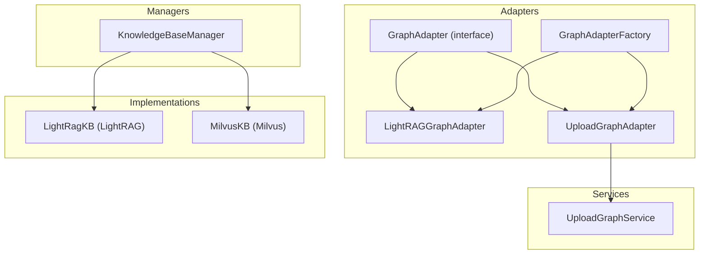
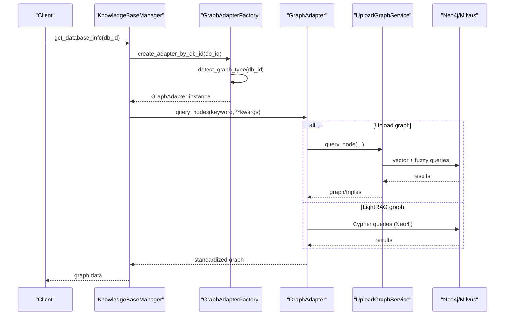
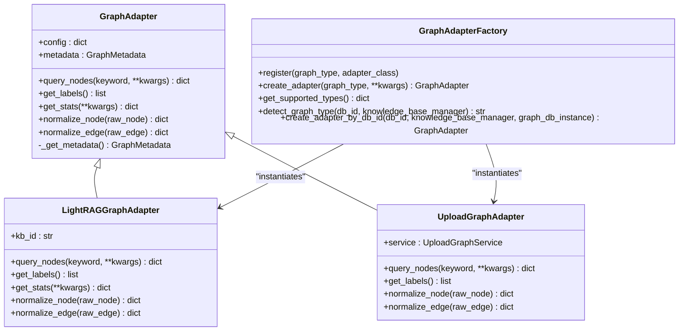
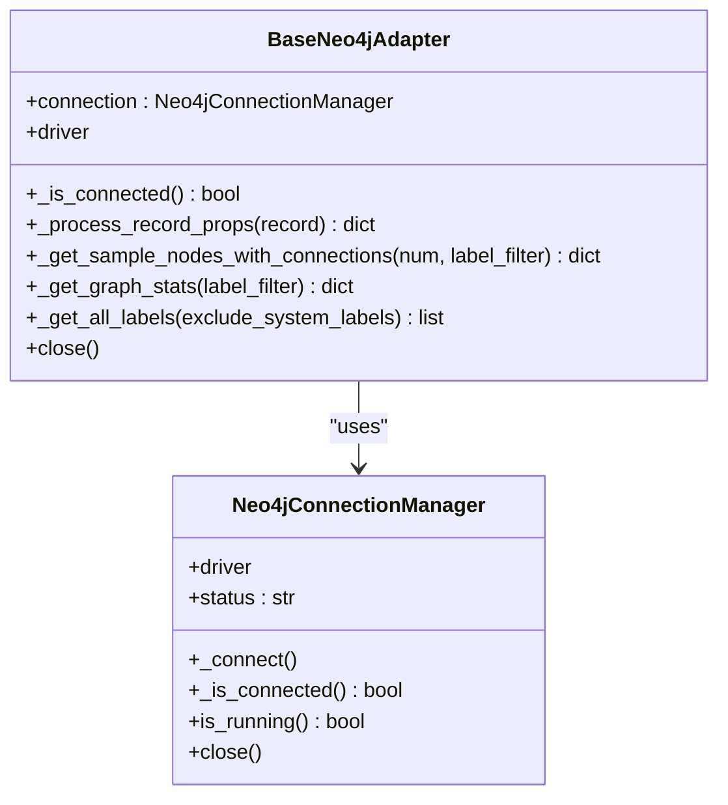
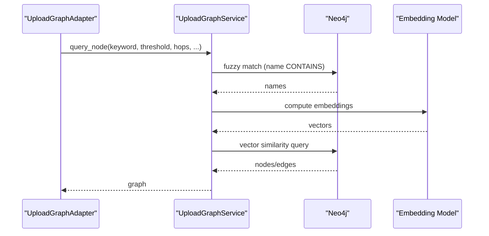
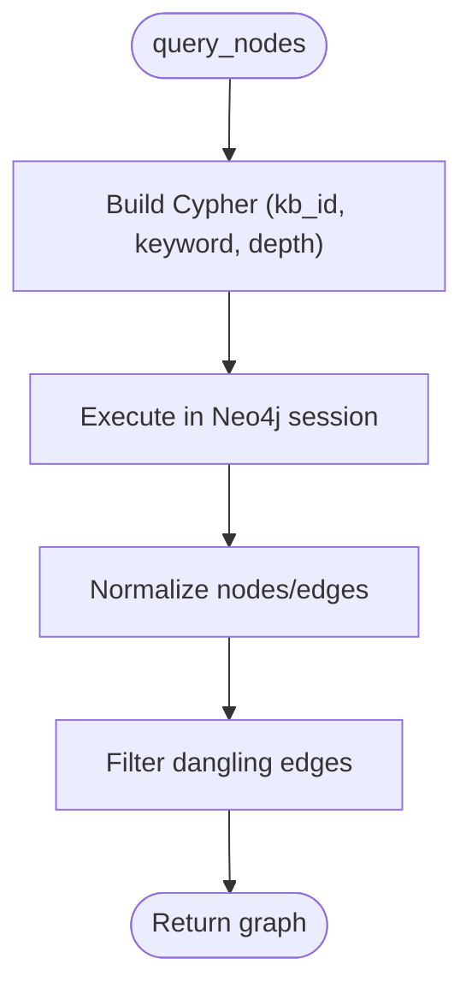
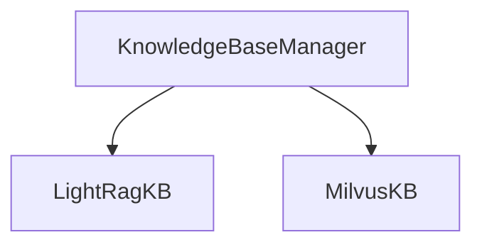
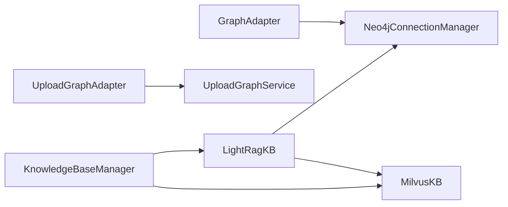

# Graph Database Management

<cite>
**Referenced Files in This Document**
- [base.py](file://backend/package/yuxi/knowledge/graphs/adapters/base.py)
- [factory.py](file://backend/package/yuxi/knowledge/graphs/adapters/factory.py)
- [lightrag.py](file://backend/package/yuxi/knowledge/graphs/adapters/lightrag.py)
- [upload.py](file://backend/package/yuxi/knowledge/graphs/adapters/upload.py)
- [upload_graph_service.py](file://backend/package/yuxi/knowledge/graphs/upload_graph_service.py)
- [lightrag_impl.py](file://backend/package/yuxi/knowledge/implementations/lightrag.py)
- [milvus_impl.py](file://backend/package/yuxi/knowledge/implementations/milvus.py)
- [manager.py](file://backend/package/yuxi/knowledge/manager.py)
- [base_knowledge.py](file://backend/package/yuxi/knowledge/base.py)
- [factory_knowledge.py](file://backend/package/yuxi/knowledge/factory.py)
</cite>

## Table of Contents
1. [Introduction](#introduction)
2. [Project Structure](#project-structure)
3. [Core Components](#core-components)
4. [Architecture Overview](#architecture-overview)
5. [Detailed Component Analysis](#detailed-component-analysis)
6. [Dependency Analysis](#dependency-analysis)
7. [Performance Considerations](#performance-considerations)
8. [Troubleshooting Guide](#troubleshooting-guide)
9. [Conclusion](#conclusion)
10. [Appendices](#appendices)

## Introduction
This document explains the graph database management and adapter patterns implemented in the project. It covers the factory pattern for creating different graph database adapters (LightRAG, Neo4j, Milvus), the base graph adapter interface, connection management, query optimization, indexing strategies, schema design, and data persistence patterns. It also provides practical guidance for switching backends, migration procedures, backup/restore operations, and performance monitoring.

## Project Structure
The graph-related functionality is organized around:
- Adapters: a common interface and implementations for different graph backends
- Services: business logic for upload-based graph operations
- Implementations: concrete knowledge base implementations (LightRAG, Milvus)
- Managers: orchestration and routing of operations

**Diagram sources**
- [base.py:43-146](file://backend/package/yuxi/knowledge/graphs/adapters/base.py#L43-L146)
- [factory.py:6-92](file://backend/package/yuxi/knowledge/graphs/adapters/factory.py#L6-L92)
- [lightrag.py:8-329](file://backend/package/yuxi/knowledge/graphs/adapters/lightrag.py#L8-L329)
- [upload.py:11-123](file://backend/package/yuxi/knowledge/graphs/adapters/upload.py#L11-L123)
- [upload_graph_service.py:18-778](file://backend/package/yuxi/knowledge/graphs/upload_graph_service.py#L18-L778)
- [lightrag_impl.py:23-779](file://backend/package/yuxi/knowledge/implementations/lightrag.py#L23-L779)
- [milvus_impl.py:24-897](file://backend/package/yuxi/knowledge/implementations/milvus.py#L24-L897)
- [manager.py:15-955](file://backend/package/yuxi/knowledge/manager.py#L15-L955)

**Section sources**
- [base.py:1-459](file://backend/package/yuxi/knowledge/graphs/adapters/base.py#L1-L459)
- [factory.py:1-93](file://backend/package/yuxi/knowledge/graphs/adapters/factory.py#L1-L93)
- [upload.py:1-123](file://backend/package/yuxi/knowledge/graphs/adapters/upload.py#L1-L123)
- [upload_graph_service.py:1-778](file://backend/package/yuxi/knowledge/graphs/upload_graph_service.py#L1-L778)
- [lightrag_impl.py:1-779](file://backend/package/yuxi/knowledge/implementations/lightrag.py#L1-L779)
- [milvus_impl.py:1-897](file://backend/package/yuxi/knowledge/implementations/milvus.py#L1-L897)
- [manager.py:1-955](file://backend/package/yuxi/knowledge/manager.py#L1-L955)

## Core Components
- GraphAdapter: abstract interface defining common graph operations (query_nodes, get_labels, get_stats, normalize_node, normalize_edge).
- GraphAdapterFactory: factory for creating adapters by type and automatic detection by database ID.
- Neo4jConnectionManager and BaseNeo4jAdapter: connection lifecycle and reusable Neo4j operations.
- UploadGraphAdapter and UploadGraphService: upload-based graph ingestion, vector indexing, and hybrid retrieval.
- LightRAGGraphAdapter: Neo4j-backed adapter for LightRAG knowledge bases.
- KnowledgeBaseManager: orchestrates knowledge base instances (LightRAG, Milvus) and routes operations.

**Section sources**
- [base.py:43-146](file://backend/package/yuxi/knowledge/graphs/adapters/base.py#L43-L146)
- [factory.py:6-92](file://backend/package/yuxi/knowledge/graphs/adapters/factory.py#L6-L92)
- [upload.py:11-123](file://backend/package/yuxi/knowledge/graphs/adapters/upload.py#L11-L123)
- [upload_graph_service.py:18-778](file://backend/package/yuxi/knowledge/graphs/upload_graph_service.py#L18-L778)
- [lightrag.py:8-329](file://backend/package/yuxi/knowledge/graphs/adapters/lightrag.py#L8-L329)
- [manager.py:15-955](file://backend/package/yuxi/knowledge/manager.py#L15-L955)

## Architecture Overview
The system separates concerns:
- Adapter layer: uniform graph operations across backends
- Service layer: upload graph ingestion and retrieval
- Implementation layer: concrete knowledge base backends (LightRAG, Milvus)
- Manager layer: discovery, routing, and lifecycle management

**Diagram sources**
- [manager.py:443-473](file://backend/package/yuxi/knowledge/manager.py#L443-L473)
- [factory.py:36-92](file://backend/package/yuxi/knowledge/graphs/adapters/factory.py#L36-L92)
- [upload.py:42-63](file://backend/package/yuxi/knowledge/graphs/adapters/upload.py#L42-L63)
- [upload_graph_service.py:525-609](file://backend/package/yuxi/knowledge/graphs/upload_graph_service.py#L525-L609)
- [lightrag.py:30-48](file://backend/package/yuxi/knowledge/graphs/adapters/lightrag.py#L30-L48)

## Detailed Component Analysis

### Graph Adapter Pattern and Factory
- GraphAdapter defines the contract for graph operations and normalization helpers.
- GraphAdapterFactory registers and instantiates adapters by type, and auto-detects graph type by db_id.
- Detection logic prefers LightRAG when metadata indicates a LightRAG database or when db_id starts with "kb_"; otherwise defaults to upload.

**Diagram sources**
- [base.py:43-146](file://backend/package/yuxi/knowledge/graphs/adapters/base.py#L43-L146)
- [lightrag.py:8-329](file://backend/package/yuxi/knowledge/graphs/adapters/lightrag.py#L8-L329)
- [upload.py:11-123](file://backend/package/yuxi/knowledge/graphs/adapters/upload.py#L11-L123)
- [factory.py:6-92](file://backend/package/yuxi/knowledge/graphs/adapters/factory.py#L6-L92)

**Section sources**
- [base.py:43-146](file://backend/package/yuxi/knowledge/graphs/adapters/base.py#L43-L146)
- [factory.py:6-92](file://backend/package/yuxi/knowledge/graphs/adapters/factory.py#L6-L92)
- [lightrag.py:8-329](file://backend/package/yuxi/knowledge/graphs/adapters/lightrag.py#L8-L329)
- [upload.py:11-123](file://backend/package/yuxi/knowledge/graphs/adapters/upload.py#L11-L123)

### Neo4j Connection Management and Base Operations
- Neo4jConnectionManager handles driver creation, health checks, and lifecycle.
- BaseNeo4jAdapter encapsulates common Neo4j operations: sampling connected subgraphs, statistics, and label enumeration.

**Diagram sources**
- [base.py:149-459](file://backend/package/yuxi/knowledge/graphs/adapters/base.py#L149-L459)

**Section sources**
- [base.py:149-459](file://backend/package/yuxi/knowledge/graphs/adapters/base.py#L149-L459)

### Upload Graph Adapter and Service
- UploadGraphAdapter delegates ingestion to UploadGraphService and uses BaseNeo4jAdapter for sampling queries.
- UploadGraphService manages Neo4j ingestion, vector indexing, embedding computation, and hybrid retrieval (vector + fuzzy).

**Diagram sources**
- [upload.py:42-63](file://backend/package/yuxi/knowledge/graphs/adapters/upload.py#L42-L63)
- [upload_graph_service.py:525-609](file://backend/package/yuxi/knowledge/graphs/upload_graph_service.py#L525-L609)
- [upload_graph_service.py:632-666](file://backend/package/yuxi/knowledge/graphs/upload_graph_service.py#L632-L666)

**Section sources**
- [upload.py:11-123](file://backend/package/yuxi/knowledge/graphs/adapters/upload.py#L11-L123)
- [upload_graph_service.py:18-778](file://backend/package/yuxi/knowledge/graphs/upload_graph_service.py#L18-L778)

### LightRAG Graph Adapter
- LightRAGGraphAdapter targets Neo4j graphs labeled by kb_id, supporting Cypher-based queries and statistics.
- Normalization adapts LightRAG-specific node/edge properties to a standard format.

**Diagram sources**
- [lightrag.py:30-48](file://backend/package/yuxi/knowledge/graphs/adapters/lightrag.py#L30-L48)
- [lightrag.py:168-256](file://backend/package/yuxi/knowledge/graphs/adapters/lightrag.py#L168-L256)
- [lightrag.py:283-329](file://backend/package/yuxi/knowledge/graphs/adapters/lightrag.py#L283-L329)

**Section sources**
- [lightrag.py:8-329](file://backend/package/yuxi/knowledge/graphs/adapters/lightrag.py#L8-L329)

### Knowledge Base Implementations and Management
- KnowledgeBaseManager discovers and routes to LightRAGKB and MilvusKB instances.
- LightRagKB integrates with LightRAG library, Neo4j, and Milvus for graph and vector storage.
- MilvusKB provides production-grade vector storage with configurable chunking and indexing.

**Diagram sources**
- [manager.py:15-955](file://backend/package/yuxi/knowledge/manager.py#L15-L955)
- [lightrag_impl.py:23-779](file://backend/package/yuxi/knowledge/implementations/lightrag.py#L23-L779)
- [milvus_impl.py:24-897](file://backend/package/yuxi/knowledge/implementations/milvus.py#L24-L897)

**Section sources**
- [manager.py:15-955](file://backend/package/yuxi/knowledge/manager.py#L15-L955)
- [lightrag_impl.py:1-779](file://backend/package/yuxi/knowledge/implementations/lightrag.py#L1-L779)
- [milvus_impl.py:1-897](file://backend/package/yuxi/knowledge/implementations/milvus.py#L1-L897)

## Dependency Analysis
- Adapters depend on Neo4jConnectionManager for connectivity.
- UploadGraphAdapter depends on UploadGraphService for ingestion and retrieval.
- KnowledgeBaseManager depends on factories to instantiate concrete implementations.
- LightRagKB coordinates with external systems (Neo4j, Milvus) via environment variables and configuration.

**Diagram sources**
- [base.py:149-459](file://backend/package/yuxi/knowledge/graphs/adapters/base.py#L149-L459)
- [upload.py:11-123](file://backend/package/yuxi/knowledge/graphs/adapters/upload.py#L11-L123)
- [upload_graph_service.py:18-778](file://backend/package/yuxi/knowledge/graphs/upload_graph_service.py#L18-L778)
- [manager.py:15-955](file://backend/package/yuxi/knowledge/manager.py#L15-L955)
- [lightrag_impl.py:1-779](file://backend/package/yuxi/knowledge/implementations/lightrag.py#L1-L779)
- [milvus_impl.py:1-897](file://backend/package/yuxi/knowledge/implementations/milvus.py#L1-L897)

**Section sources**
- [base.py:149-459](file://backend/package/yuxi/knowledge/graphs/adapters/base.py#L149-L459)
- [upload.py:11-123](file://backend/package/yuxi/knowledge/graphs/adapters/upload.py#L11-L123)
- [upload_graph_service.py:18-778](file://backend/package/yuxi/knowledge/graphs/upload_graph_service.py#L18-L778)
- [manager.py:15-955](file://backend/package/yuxi/knowledge/manager.py#L15-L955)
- [lightrag_impl.py:1-779](file://backend/package/yuxi/knowledge/implementations/lightrag.py#L1-L779)
- [milvus_impl.py:1-897](file://backend/package/yuxi/knowledge/implementations/milvus.py#L1-L897)

## Performance Considerations
- Vector indexing: UploadGraphService creates a vector index on the embedding field after ingestion; ensure embedding dimension matches model configuration.
- Query strategies: Hybrid retrieval combines vector similarity and fuzzy matching; tune thresholds and top-k to balance precision/recall.
- Sampling subgraphs: BaseNeo4jAdapter samples connected subgraphs to avoid heavy traversals; leverage label filters to constrain scope.
- Concurrency and batching: Embedding computations are batched; adjust batch sizes according to memory constraints.
- Caching and reuse: KnowledgeBaseManager caches instances per kb_type; avoid frequent recreation.

[No sources needed since this section provides general guidance]

## Troubleshooting Guide
Common issues and resolutions:
- Neo4j connectivity failures: Verify URI, credentials, and network reachability; check LITE_MODE environment variable.
- Missing vector index: UploadGraphService raises an exception if index does not exist; ensure ingestion completes successfully.
- Invalid kb_id format: LightRAGGraphAdapter validates kb_id; ensure only alphanumeric and underscore characters.
- Permission/access errors: KnowledgeBaseManager enforces sharing rules; verify user permissions and share_config.

**Section sources**
- [base.py:155-203](file://backend/package/yuxi/knowledge/graphs/adapters/base.py#L155-L203)
- [upload_graph_service.py:632-666](file://backend/package/yuxi/knowledge/graphs/upload_graph_service.py#L632-L666)
- [lightrag.py:66-68](file://backend/package/yuxi/knowledge/graphs/adapters/lightrag.py#L66-L68)
- [manager.py:203-245](file://backend/package/yuxi/knowledge/manager.py#L203-L245)

## Conclusion
The system provides a robust, extensible graph database management framework with a clean adapter pattern, strong separation of concerns, and practical ingestion and retrieval capabilities. By leveraging the factory pattern and managers, teams can switch backends, scale operations, and maintain consistent graph semantics across Neo4j and Milvus environments.

## Appendices

### Switching Backends
- Use GraphAdapterFactory to create adapters by type or by db_id for automatic detection.
- For upload graphs, configure kgdb_name; for LightRAG graphs, configure kb_id.

**Section sources**
- [factory.py:36-92](file://backend/package/yuxi/knowledge/graphs/adapters/factory.py#L36-L92)

### Migration Procedures
- LightRAG: delete_database removes Neo4j nodes and Milvus collections; ensure both are cleaned up.
- Milvus: delete_database drops the collection; confirm alignment with kb_type.

**Section sources**
- [lightrag_impl.py:61-110](file://backend/package/yuxi/knowledge/implementations/lightrag.py#L61-L110)
- [milvus_impl.py:781-794](file://backend/package/yuxi/knowledge/implementations/milvus.py#L781-L794)

### Backup and Restore
- UploadGraphService persists graph_info to disk; use this as a lightweight backup of metadata and status.
- For full backups, export Neo4j dumps and Milvus snapshots as appropriate to your deployment.

**Section sources**
- [upload_graph_service.py:436-490](file://backend/package/yuxi/knowledge/graphs/upload_graph_service.py#L436-L490)

### Schema Design and Data Persistence
- Upload graphs: nodes labeled with Upload and Upload tags; edges represent relationships; embedding stored as vector property.
- LightRAG graphs: nodes labeled by kb_id; statistics and labels derived from Neo4j.

**Section sources**
- [upload_graph_service.py:174-200](file://backend/package/yuxi/knowledge/graphs/upload_graph_service.py#L174-L200)
- [lightrag.py:76-106](file://backend/package/yuxi/knowledge/graphs/adapters/lightrag.py#L76-L106)

### Query Optimization and Indexing Strategies
- Vector index: created on embedding property; ensure dimension matches embedding model.
- Fuzzy search: uses case-insensitive CONTAINS on name; combine with vector similarity for robust retrieval.
- Sampling: BaseNeo4jAdapter collects connected subgraphs to limit traversal cost.

**Section sources**
- [upload_graph_service.py:201-213](file://backend/package/yuxi/knowledge/graphs/upload_graph_service.py#L201-L213)
- [upload_graph_service.py:611-631](file://backend/package/yuxi/knowledge/graphs/upload_graph_service.py#L611-L631)
- [base.py:242-384](file://backend/package/yuxi/knowledge/graphs/adapters/base.py#L242-L384)