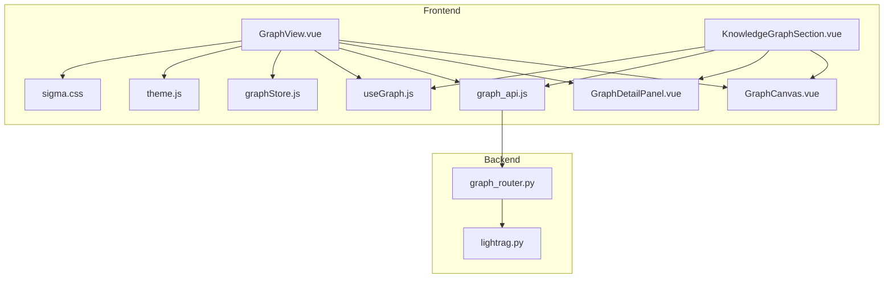
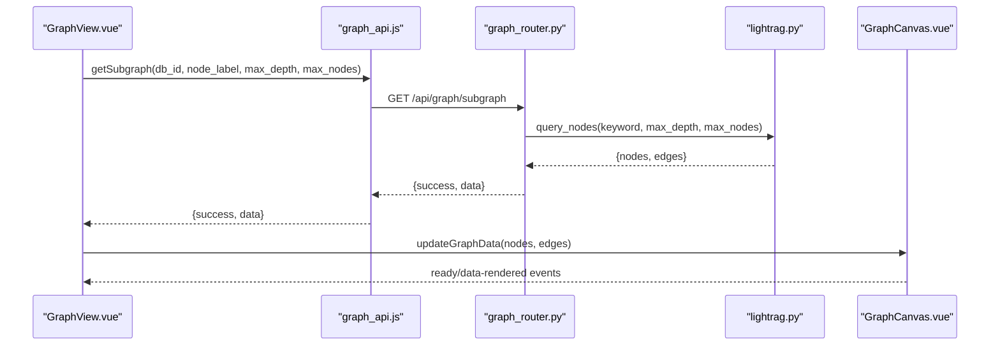
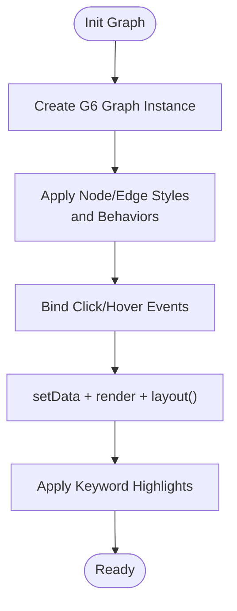
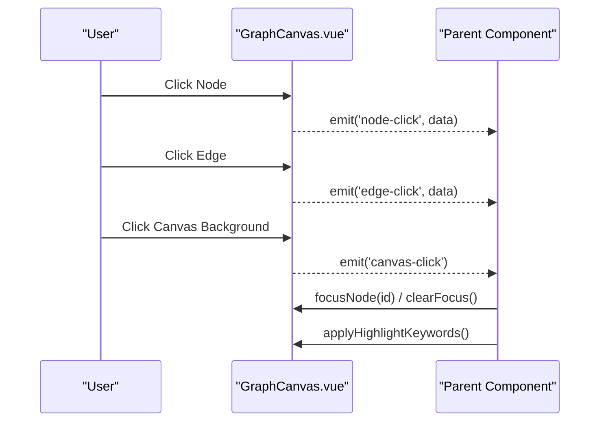
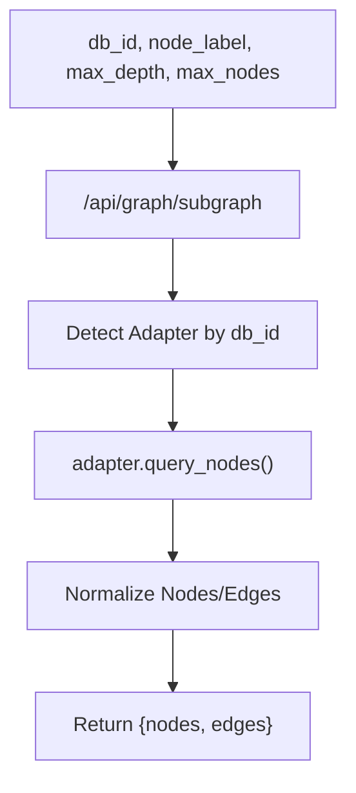
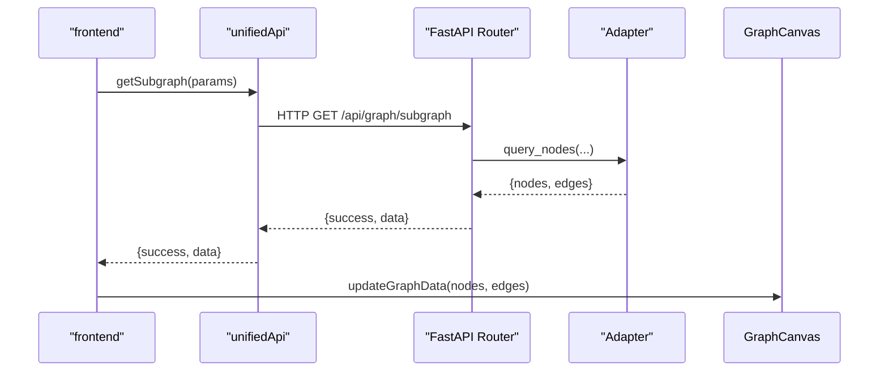
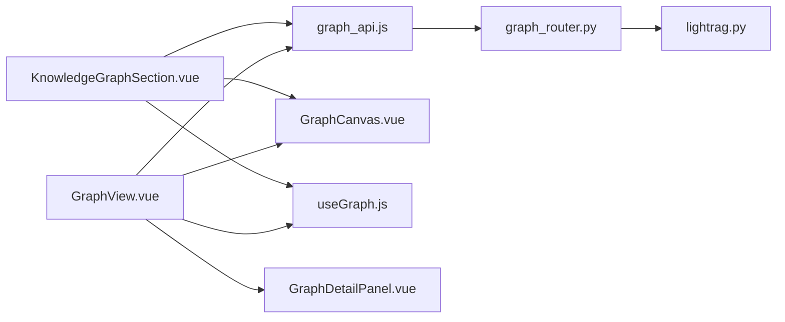

# Graph Visualization & Exploration

<cite>
**Referenced Files in This Document**
- [GraphCanvas.vue](file://web/src/components/GraphCanvas.vue)
- [KnowledgeGraphSection.vue](file://web/src/components/KnowledgeGraphSection.vue)
- [useGraph.js](file://web/src/composables/useGraph.js)
- [graphStore.js](file://web/src/stores/graphStore.js)
- [sigma.css](file://web/src/assets/css/sigma.css)
- [theme.js](file://web/src/stores/theme.js)
- [graph_api.js](file://web/src/apis/graph_api.js)
- [GraphView.vue](file://web/src/views/GraphView.vue)
- [GraphDetailPanel.vue](file://web/src/components/GraphDetailPanel.vue)
- [graph_router.py](file://backend/server/routers/graph_router.py)
- [lightrag.py](file://backend/package/yuxi/knowledge/graphs/adapters/lightrag.py)
</cite>

## Table of Contents
1. [Introduction](#introduction)
2. [Project Structure](#project-structure)
3. [Core Components](#core-components)
4. [Architecture Overview](#architecture-overview)
5. [Detailed Component Analysis](#detailed-component-analysis)
6. [Dependency Analysis](#dependency-analysis)
7. [Performance Considerations](#performance-considerations)
8. [Troubleshooting Guide](#troubleshooting-guide)
9. [Conclusion](#conclusion)
10. [Appendices](#appendices)

## Introduction
This document explains the graph visualization and interactive exploration features of the system. It covers the frontend rendering pipeline (with AntV G6), the backend graph APIs and adapters, interactive controls (zoom, pan, selection, filtering), detail panels, and the integration between backend graph data and frontend visualization. It also provides guidance on customizing visualization themes, extending analysis tools, optimizing performance for large graphs, and ensuring responsive design and accessibility.

## Project Structure
The graph visualization spans frontend Vue components and stores, and backend FastAPI routers and adapters. The frontend renders graphs via AntV G6 and exposes a compact knowledge graph section for LightRAG-backed knowledge bases. The backend exposes unified graph APIs and adapters for Neo4j/LightRAG.

**Diagram sources**
- [GraphView.vue:1-786](file://web/src/views/GraphView.vue#L1-L786)
- [KnowledgeGraphSection.vue:1-325](file://web/src/components/KnowledgeGraphSection.vue#L1-L325)
- [GraphCanvas.vue:1-588](file://web/src/components/GraphCanvas.vue#L1-L588)
- [GraphDetailPanel.vue:1-170](file://web/src/components/GraphDetailPanel.vue#L1-L170)
- [useGraph.js:1-73](file://web/src/composables/useGraph.js#L1-L73)
- [graphStore.js:1-435](file://web/src/stores/graphStore.js#L1-L435)
- [graph_api.js:1-262](file://web/src/apis/graph_api.js#L1-L262)
- [theme.js:1-66](file://web/src/stores/theme.js#L1-L66)
- [sigma.css:1-88](file://web/src/assets/css/sigma.css#L1-L88)
- [graph_router.py:1-290](file://backend/server/routers/graph_router.py#L1-L290)
- [lightrag.py:1-329](file://backend/package/yuxi/knowledge/graphs/adapters/lightrag.py#L1-L329)

**Section sources**
- [GraphView.vue:1-786](file://web/src/views/GraphView.vue#L1-L786)
- [KnowledgeGraphSection.vue:1-325](file://web/src/components/KnowledgeGraphSection.vue#L1-L325)
- [GraphCanvas.vue:1-588](file://web/src/components/GraphCanvas.vue#L1-L588)
- [graph_api.js:1-262](file://web/src/apis/graph_api.js#L1-L262)
- [graph_router.py:1-290](file://backend/server/routers/graph_router.py#L1-L290)

## Core Components
- GraphCanvas: Renders the graph using AntV G6, manages layout, styling, events, and highlights. It watches for prop changes and theme updates, and exposes methods to refresh, fit view, focus nodes, and clear highlights.
- useGraph: Composable managing selection and detail panel visibility, and coordinating data updates to the graph canvas.
- KnowledgeGraphSection: Provides a compact UI for LightRAG knowledge bases, including search, settings, and subgraph loading.
- graphStore: Manages Sigma.js graph data and state (used elsewhere in the codebase for Sigma-based views).
- graph_api: Unified frontend API module for subgraph retrieval, stats, labels, and Neo4j-specific operations.
- GraphView: Full-featured graph explorer with database selector, search, sample loading, upload modal, and export.
- GraphDetailPanel: Floating detail card for nodes and edges with filtered properties.
- theme.js: Theme store controlling light/dark mode and CSS variable-driven styles.
- sigma.css: Styles for Sigma.js overlays and states.

**Section sources**
- [GraphCanvas.vue:1-588](file://web/src/components/GraphCanvas.vue#L1-L588)
- [useGraph.js:1-73](file://web/src/composables/useGraph.js#L1-L73)
- [KnowledgeGraphSection.vue:1-325](file://web/src/components/KnowledgeGraphSection.vue#L1-L325)
- [graphStore.js:1-435](file://web/src/stores/graphStore.js#L1-L435)
- [graph_api.js:1-262](file://web/src/apis/graph_api.js#L1-L262)
- [GraphView.vue:1-786](file://web/src/views/GraphView.vue#L1-L786)
- [GraphDetailPanel.vue:1-170](file://web/src/components/GraphDetailPanel.vue#L1-L170)
- [theme.js:1-66](file://web/src/stores/theme.js#L1-L66)
- [sigma.css:1-88](file://web/src/assets/css/sigma.css#L1-L88)

## Architecture Overview
The system integrates frontend and backend as follows:
- Frontend requests subgraphs via unified APIs.
- Backend routes dispatch to adapters (Neo4j/LightRAG) and return standardized node/edge arrays.
- Frontend renders the graph with AntV G6, handles user interactions, and displays details.

**Diagram sources**
- [GraphView.vue:411-468](file://web/src/views/GraphView.vue#L411-L468)
- [graph_api.js:31-46](file://web/src/apis/graph_api.js#L31-L46)
- [graph_router.py:116-157](file://backend/server/routers/graph_router.py#L116-L157)
- [lightrag.py:30-48](file://backend/package/yuxi/knowledge/graphs/adapters/lightrag.py#L30-L48)
- [GraphCanvas.vue:252-283](file://web/src/components/GraphCanvas.vue#L252-L283)

## Detailed Component Analysis

### Graph Rendering with AntV G6 (GraphCanvas)
- Layout: Uses a force-directed layout with overlap prevention, decay, and collision detection. Options are merged with props to allow overrides.
- Nodes: Circle nodes sized by degree; labels derived from a configurable field; styled with CSS variables for theme-awareness.
- Edges: Quadratic curves with arrows and label backgrounds; styled with CSS variables.
- Behaviors: Drag node, zoom canvas, drag canvas, hover activation, click-select with multi-selection and neighbor highlighting.
- Events: Emits node-click, edge-click, canvas-click; forwards to parent handlers.
- Highlights: Keyword-based highlighting applied after render; supports clearing highlights.
- Focus: Optional focus-and-blur of neighbors around a selected node.
- Responsiveness: ResizeObserver and window resize listeners; changeSize and refreshGraph on dimension changes.
- Theming: Watches theme store; recreates graph on theme change to re-evaluate CSS variables.

**Diagram sources**
- [GraphCanvas.vue:124-250](file://web/src/components/GraphCanvas.vue#L124-L250)
- [GraphCanvas.vue:252-283](file://web/src/components/GraphCanvas.vue#L252-L283)
- [GraphCanvas.vue:285-324](file://web/src/components/GraphCanvas.vue#L285-L324)

**Section sources**
- [GraphCanvas.vue:68-81](file://web/src/components/GraphCanvas.vue#L68-L81)
- [GraphCanvas.vue:151-224](file://web/src/components/GraphCanvas.vue#L151-L224)
- [GraphCanvas.vue:227-247](file://web/src/components/GraphCanvas.vue#L227-L247)
- [GraphCanvas.vue:285-324](file://web/src/components/GraphCanvas.vue#L285-L324)
- [GraphCanvas.vue:368-404](file://web/src/components/GraphCanvas.vue#L368-L404)
- [GraphCanvas.vue:437-467](file://web/src/components/GraphCanvas.vue#L437-L467)

### Interactive Exploration Interface
- Zoom and Pan: Provided by G6 behaviors (zoom-canvas, drag-canvas).
- Selection: click-select with multi-select enabled; supports neighbor highlighting and unselected inactive state.
- Filtering: Keyword-based node highlighting; search input in views triggers subgraph reload.
- Detail Panels: Floating drawer shows node/edge properties; hides on canvas click.
- Actions: Fit view/center, refresh, export graph data.

**Diagram sources**
- [GraphCanvas.vue:227-247](file://web/src/components/GraphCanvas.vue#L227-L247)
- [GraphCanvas.vue:368-404](file://web/src/components/GraphCanvas.vue#L368-L404)
- [GraphCanvas.vue:285-324](file://web/src/components/GraphCanvas.vue#L285-L324)
- [useGraph.js:14-36](file://web/src/composables/useGraph.js#L14-L36)

**Section sources**
- [GraphCanvas.vue:207-223](file://web/src/components/GraphCanvas.vue#L207-L223)
- [GraphDetailPanel.vue:1-170](file://web/src/components/GraphDetailPanel.vue#L1-L170)
- [GraphView.vue:433-468](file://web/src/views/GraphView.vue#L433-L468)

### Graph Query Interface and Traversals
- Unified API: getSubgraph supports db_id, node_label (keyword), max_depth, max_nodes.
- Backend routing: Validates graph adapter availability, delegates to adapter, and returns standardized nodes/edges.
- Adapter specifics (LightRAG): Builds Cypher queries with optional depth expansion; normalizes nodes/edges; filters out internal labels; supports sampling and limits.

**Diagram sources**
- [graph_api.js:31-46](file://web/src/apis/graph_api.js#L31-L46)
- [graph_router.py:116-157](file://backend/server/routers/graph_router.py#L116-L157)
- [lightrag.py:30-48](file://backend/package/yuxi/knowledge/graphs/adapters/lightrag.py#L30-L48)

**Section sources**
- [graph_api.js:13-81](file://web/src/apis/graph_api.js#L13-L81)
- [graph_router.py:116-157](file://backend/server/routers/graph_router.py#L116-L157)
- [lightrag.py:168-256](file://backend/package/yuxi/knowledge/graphs/adapters/lightrag.py#L168-L256)

### Integration Between Backend and Frontend
- Frontend calls unifiedApi.getSubgraph with db_id and parameters.
- Backend resolves adapter and executes query; returns nodes/edges.
- Frontend passes data to GraphCanvas via reactive store/composable.

**Diagram sources**
- [graph_api.js:31-46](file://web/src/apis/graph_api.js#L31-L46)
- [graph_router.py:116-157](file://backend/server/routers/graph_router.py#L116-L157)
- [lightrag.py:30-48](file://backend/package/yuxi/knowledge/graphs/adapters/lightrag.py#L30-L48)
- [GraphCanvas.vue:252-283](file://web/src/components/GraphCanvas.vue#L252-L283)

**Section sources**
- [graph_api.js:13-81](file://web/src/apis/graph_api.js#L13-L81)
- [graph_router.py:116-157](file://backend/server/routers/graph_router.py#L116-L157)
- [GraphCanvas.vue:252-283](file://web/src/components/GraphCanvas.vue#L252-L283)

### Knowledge Graph Section (LightRAG)
- Supports only LightRAG knowledge base type; disables otherwise.
- Provides search input, refresh, settings modal (max_nodes, depth).
- Loads subgraph on activation and database changes.

**Section sources**
- [KnowledgeGraphSection.vue:135-215](file://web/src/components/KnowledgeGraphSection.vue#L135-L215)
- [KnowledgeGraphSection.vue:143-173](file://web/src/components/KnowledgeGraphSection.vue#L143-L173)

### Detail Panels and Properties
- Node details: name, id, labels, and all original properties.
- Edge details: type, filtered properties (hides internal fields).
- Controlled visibility via useGraph composable.

**Section sources**
- [GraphDetailPanel.vue:14-97](file://web/src/components/GraphDetailPanel.vue#L14-L97)
- [useGraph.js:14-36](file://web/src/composables/useGraph.js#L14-L36)

### Themes and Responsive Design
- Theme store toggles light/dark mode; CSS variables drive colors.
- GraphCanvas watches theme changes and refreshes graph.
- sigma.css provides overlay and state styles; includes minimal responsive adjustments.

**Section sources**
- [theme.js:1-66](file://web/src/stores/theme.js#L1-L66)
- [GraphCanvas.vue:427-435](file://web/src/components/GraphCanvas.vue#L427-L435)
- [sigma.css:1-88](file://web/src/assets/css/sigma.css#L1-L88)

## Dependency Analysis
- Frontend dependencies:
  - GraphCanvas depends on AntV G6, theme store, emits events to parents.
  - useGraph composes selection and data update logic.
  - GraphView and KnowledgeGraphSection depend on unifiedApi and useGraph.
  - GraphDetailPanel depends on item/type props.
- Backend dependencies:
  - graph_router.py depends on GraphAdapterFactory and adapters.
  - LightRAG adapter depends on Neo4j driver and builds Cypher queries.

**Diagram sources**
- [graph_api.js:1-262](file://web/src/apis/graph_api.js#L1-L262)
- [graph_router.py:1-290](file://backend/server/routers/graph_router.py#L1-L290)
- [lightrag.py:1-329](file://backend/package/yuxi/knowledge/graphs/adapters/lightrag.py#L1-L329)
- [GraphView.vue:1-786](file://web/src/views/GraphView.vue#L1-L786)
- [GraphCanvas.vue:1-588](file://web/src/components/GraphCanvas.vue#L1-L588)
- [useGraph.js:1-73](file://web/src/composables/useGraph.js#L1-L73)
- [GraphDetailPanel.vue:1-170](file://web/src/components/GraphDetailPanel.vue#L1-L170)
- [KnowledgeGraphSection.vue:1-325](file://web/src/components/KnowledgeGraphSection.vue#L1-L325)

**Section sources**
- [graph_router.py:21-41](file://backend/server/routers/graph_router.py#L21-L41)
- [lightrag.py:8-29](file://backend/package/yuxi/knowledge/graphs/adapters/lightrag.py#L8-L29)

## Performance Considerations
- Limit subgraph size: Control max_nodes and max_depth to keep graphs manageable.
- Force-directed layout tuning: Adjust iterations, decay, and collision parameters to balance quality and speed.
- Debounce rendering: GraphCanvas already debounces data updates; avoid excessive re-renders by batching updates.
- Highlighting cost: Keyword highlighting scans nodes; keep keyword lists concise.
- Large graphs: Prefer sampling (node_label="*") with lower max_nodes during exploration; increase gradually.
- CSS variables: Using CSS variables avoids frequent style recalculations; keep theme changes infrequent.

[No sources needed since this section provides general guidance]

## Troubleshooting Guide
- Graph does not render:
  - Ensure container has non-zero dimensions; GraphCanvas retries initialization until width/height are available.
  - Verify graphData nodes/edges are passed and normalized.
- No data after search:
  - Confirm db_id is valid and supported; check unifiedApi.getSubgraph response.
  - For LightRAG, ensure kb_id exists and labels are not all internal prefixes.
- Selection/interaction not working:
  - Check click-select behavior configuration and that pointer-events are not blocked by overlays.
- Theme mismatch:
  - Theme changes trigger graph refresh; ensure theme store is initialized and CSS variables are defined.

**Section sources**
- [GraphCanvas.vue:124-137](file://web/src/components/GraphCanvas.vue#L124-L137)
- [GraphCanvas.vue:406-425](file://web/src/components/GraphCanvas.vue#L406-L425)
- [graph_router.py:21-41](file://backend/server/routers/graph_router.py#L21-L41)
- [lightrag.py:168-256](file://backend/package/yuxi/knowledge/graphs/adapters/lightrag.py#L168-L256)

## Conclusion
The system provides a robust, interactive graph visualization pipeline. The frontend leverages AntV G6 for rendering and interactions, while the backend offers unified APIs and adapters for diverse graph backends. Users can explore, filter, and inspect graph data efficiently, with room to customize themes, extend analysis tools, and optimize performance for large datasets.

[No sources needed since this section summarizes without analyzing specific files]

## Appendices

### Customizing Visualization Themes
- Modify CSS variables in theme store to change colors globally; GraphCanvas reads CSS variables for node/edge colors and backgrounds.
- Override nodeStyleOptions and edgeStyleOptions props on GraphCanvas for fine-grained control.

**Section sources**
- [theme.js:10-29](file://web/src/stores/theme.js#L10-L29)
- [GraphCanvas.vue:158-206](file://web/src/components/GraphCanvas.vue#L158-L206)

### Adding New Graph Analysis Tools
- Extend useGraph composable to expose new selection/focus behaviors and integrate with GraphCanvas methods (focusNode/clearFocus).
- Add new UI controls in GraphView or KnowledgeGraphSection to call these behaviors and pass parameters to unifiedApi.

**Section sources**
- [useGraph.js:38-71](file://web/src/composables/useGraph.js#L38-L71)
- [GraphCanvas.vue:368-404](file://web/src/components/GraphCanvas.vue#L368-L404)
- [GraphView.vue:411-468](file://web/src/views/GraphView.vue#L411-L468)

### Optimizing Performance for Large Graphs
- Reduce max_nodes and max_depth in getSubgraph calls.
- Use node_label="*" for sampling; refine search after initial exploration.
- Tune force-directed layout parameters in GraphCanvas layout options.

**Section sources**
- [graph_api.js:31-46](file://web/src/apis/graph_api.js#L31-L46)
- [GraphCanvas.vue:68-81](file://web/src/components/GraphCanvas.vue#L68-L81)

### Accessibility and Responsive Design
- Ensure sufficient contrast in theme variants; rely on CSS variables for consistent theming.
- Keep overlay controls accessible; avoid blocking pointer events unintentionally.
- sigma.css includes minimal responsive adjustments for tooltips; extend as needed.

**Section sources**
- [sigma.css:77-87](file://web/src/assets/css/sigma.css#L77-L87)
- [GraphCanvas.vue:534-568](file://web/src/components/GraphCanvas.vue#L534-L568)