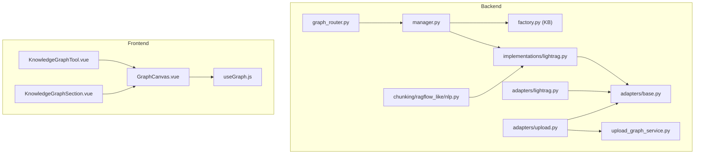
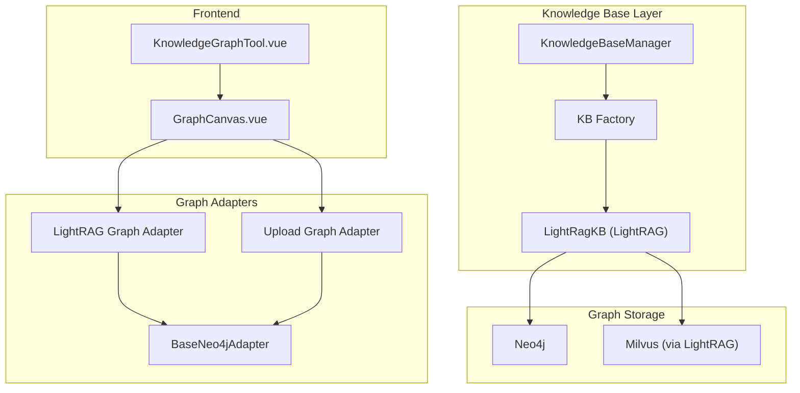
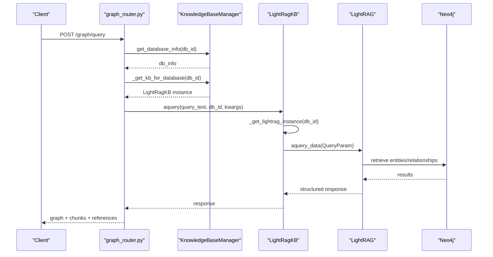
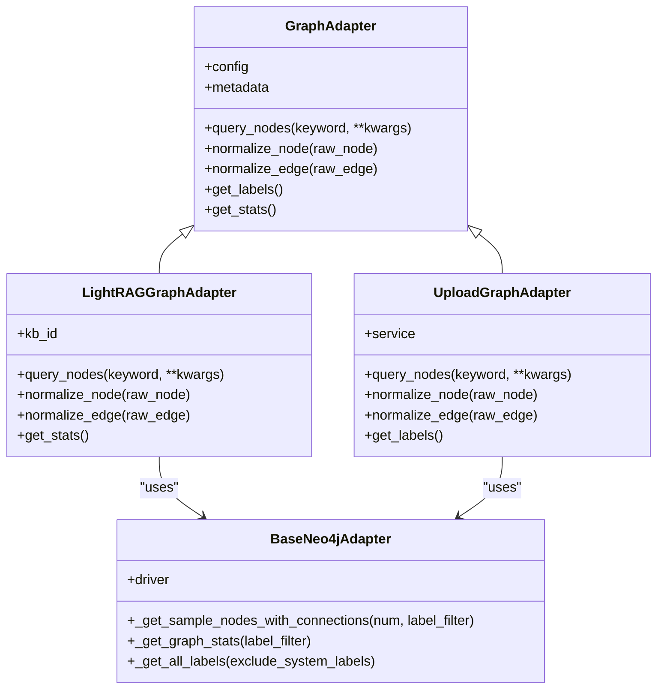
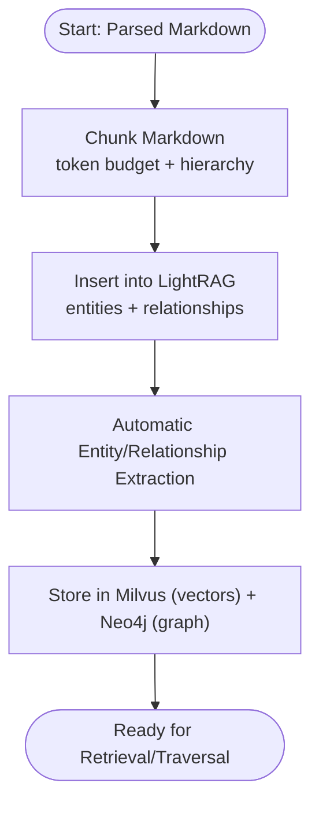
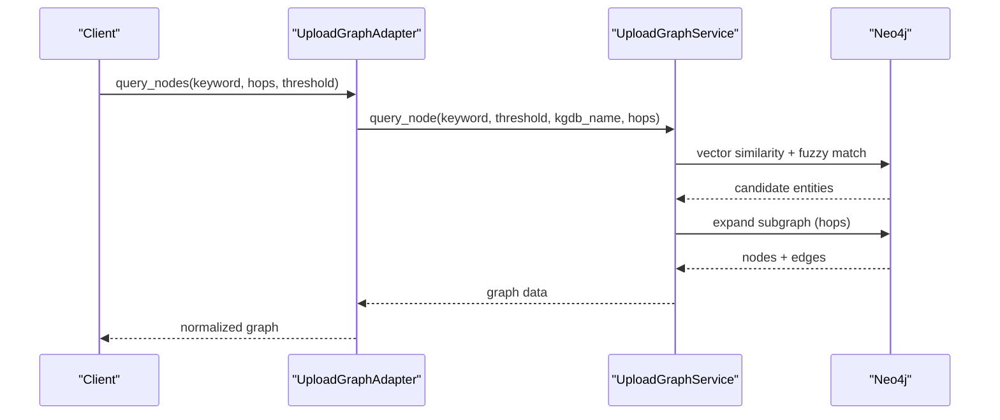
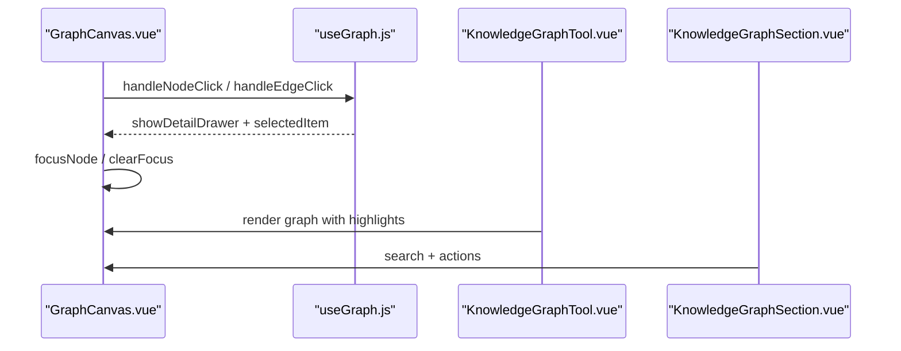
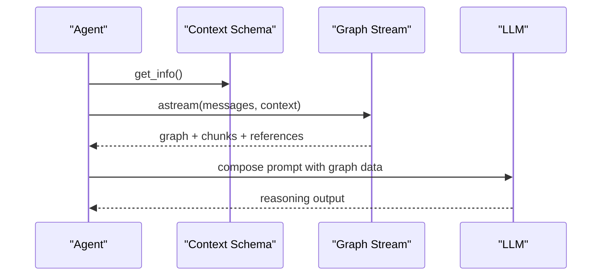
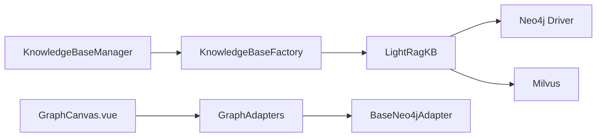

# Knowledge Graph Construction

<cite>
**Referenced Files in This Document**
- [graph_router.py](file://backend/server/routers/graph_router.py)
- [lightrag.py](file://backend/package/yuxi/knowledge/implementations/lightrag.py)
- [manager.py](file://backend/package/yuxi/knowledge/manager.py)
- [factory.py](file://backend/package/yuxi/knowledge/factory.py)
- [base.py](file://backend/package/yuxi/knowledge/graphs/adapters/base.py)
- [lightrag.py](file://backend/package/yuxi/knowledge/graphs/adapters/lightrag.py)
- [upload.py](file://backend/package/yuxi/knowledge/graphs/adapters/upload.py)
- [factory.py](file://backend/package/yuxi/knowledge/graphs/adapters/factory.py)
- [upload_graph_service.py](file://backend/package/yuxi/knowledge/graphs/upload_graph_service.py)
- [nlp.py](file://backend/package/yuxi/knowledge/chunking/ragflow_like/nlp.py)
- [GraphCanvas.vue](file://web/src/components/GraphCanvas.vue)
- [useGraph.js](file://web/src/composables/useGraph.js)
- [KnowledgeGraphTool.vue](file://web/src/components/ToolCallingResult/tools/KnowledgeGraphTool.vue)
- [KnowledgeGraphSection.vue](file://web/src/components/KnowledgeGraphSection.vue)
</cite>

## Table of Contents
1. [Introduction](#introduction)
2. [Project Structure](#project-structure)
3. [Core Components](#core-components)
4. [Architecture Overview](#architecture-overview)
5. [Detailed Component Analysis](#detailed-component-analysis)
6. [Dependency Analysis](#dependency-analysis)
7. [Performance Considerations](#performance-considerations)
8. [Troubleshooting Guide](#troubleshooting-guide)
9. [Conclusion](#conclusion)
10. [Appendices](#appendices)

## Introduction
This document explains the knowledge graph construction system, focusing on LightRAG integration for automatic entity extraction and relationship building, dual graph database management (LightRAG-backed and Neo4j-based), entity extraction algorithms, relationship mapping, graph traversal, visualization, and agent reasoning integration. It also covers workflows, parameter tuning, quality assessment, and performance considerations for large-scale deployments.

## Project Structure
The knowledge graph system spans backend services, graph adapters, and frontend visualization:
- Backend routers expose graph operations and integrate with knowledge base managers.
- Knowledge base implementations manage LightRAG and related storages.
- Graph adapters abstract Neo4j operations for both LightRAG and upload graphs.
- Frontend components render interactive graphs and support agent tooling.

**Diagram sources**
- [graph_router.py:70-102](file://backend/server/routers/graph_router.py#L70-L102)
- [manager.py:15-102](file://backend/package/yuxi/knowledge/manager.py#L15-L102)
- [factory.py:1-108](file://backend/package/yuxi/knowledge/factory.py#L1-L108)
- [lightrag.py:23-42](file://backend/package/yuxi/knowledge/implementations/lightrag.py#L23-L42)
- [base.py:43-96](file://backend/package/yuxi/knowledge/graphs/adapters/base.py#L43-L96)
- [lightrag.py:8-28](file://backend/package/yuxi/knowledge/graphs/adapters/lightrag.py#L8-L28)
- [upload.py:11-40](file://backend/package/yuxi/knowledge/graphs/adapters/upload.py#L11-L40)
- [upload_graph_service.py:18-61](file://backend/package/yuxi/knowledge/graphs/upload_graph_service.py#L18-L61)
- [nlp.py:1-535](file://backend/package/yuxi/knowledge/chunking/ragflow_like/nlp.py#L1-L535)
- [GraphCanvas.vue:1-588](file://web/src/components/GraphCanvas.vue#L1-L588)
- [useGraph.js:1-73](file://web/src/composables/useGraph.js#L1-L73)
- [KnowledgeGraphTool.vue:1-293](file://web/src/components/ToolCallingResult/tools/KnowledgeGraphTool.vue#L1-L293)
- [KnowledgeGraphSection.vue:1-36](file://web/src/components/KnowledgeGraphSection.vue#L1-L36)

**Section sources**
- [graph_router.py:70-102](file://backend/server/routers/graph_router.py#L70-L102)
- [manager.py:15-102](file://backend/package/yuxi/knowledge/manager.py#L15-L102)
- [factory.py:1-108](file://backend/package/yuxi/knowledge/factory.py#L1-L108)
- [lightrag.py:23-42](file://backend/package/yuxi/knowledge/implementations/lightrag.py#L23-L42)
- [base.py:43-96](file://backend/package/yuxi/knowledge/graphs/adapters/base.py#L43-L96)
- [lightrag.py:8-28](file://backend/package/yuxi/knowledge/graphs/adapters/lightrag.py#L8-L28)
- [upload.py:11-40](file://backend/package/yuxi/knowledge/graphs/adapters/upload.py#L11-L40)
- [upload_graph_service.py:18-61](file://backend/package/yuxi/knowledge/graphs/upload_graph_service.py#L18-L61)
- [nlp.py:1-535](file://backend/package/yuxi/knowledge/chunking/ragflow_like/nlp.py#L1-L535)
- [GraphCanvas.vue:1-588](file://web/src/components/GraphCanvas.vue#L1-L588)
- [useGraph.js:1-73](file://web/src/composables/useGraph.js#L1-L73)
- [KnowledgeGraphTool.vue:1-293](file://web/src/components/ToolCallingResult/tools/KnowledgeGraphTool.vue#L1-L293)
- [KnowledgeGraphSection.vue:1-36](file://web/src/components/KnowledgeGraphSection.vue#L1-L36)

## Core Components
- KnowledgeBaseManager orchestrates knowledge base instances, supports multiple types (e.g., LightRAG), and exposes unified APIs for creation, querying, and metadata management.
- LightRagKB implements LightRAG-backed knowledge graph with entity/relationship extraction, vector storage, and graph storage integration.
- Graph adapters abstract Neo4j operations for both LightRAG-style kb_id-tagged graphs and upload graphs with embeddings and thresholds.
- UploadGraphService manages upload-type graphs, including vector indexing and entity/triple ingestion.
- Frontend graph components provide interactive visualization, highlighting, and selection handling.

**Section sources**
- [manager.py:15-102](file://backend/package/yuxi/knowledge/manager.py#L15-L102)
- [lightrag.py:23-42](file://backend/package/yuxi/knowledge/implementations/lightrag.py#L23-L42)
- [base.py:43-96](file://backend/package/yuxi/knowledge/graphs/adapters/base.py#L43-L96)
- [lightrag.py:8-28](file://backend/package/yuxi/knowledge/graphs/adapters/lightrag.py#L8-L28)
- [upload.py:11-40](file://backend/package/yuxi/knowledge/graphs/adapters/upload.py#L11-L40)
- [upload_graph_service.py:18-61](file://backend/package/yuxi/knowledge/graphs/upload_graph_service.py#L18-L61)
- [GraphCanvas.vue:1-588](file://web/src/components/GraphCanvas.vue#L1-L588)
- [useGraph.js:1-73](file://web/src/composables/useGraph.js#L1-L73)

## Architecture Overview
The system integrates LightRAG for automatic entity extraction and relationship building, with Neo4j serving as the graph storage backend. Two graph types coexist:
- LightRAG graph: kb_id-tagged nodes and edges, managed via LightRAG’s graph storage and Neo4j.
- Upload graph: user-provided triples stored as Entity:Upload nodes and RELATION edges, optionally with vector embeddings.

**Diagram sources**
- [lightrag.py:23-42](file://backend/package/yuxi/knowledge/implementations/lightrag.py#L23-L42)
- [factory.py:1-108](file://backend/package/yuxi/knowledge/factory.py#L1-L108)
- [manager.py:15-102](file://backend/package/yuxi/knowledge/manager.py#L15-L102)
- [lightrag.py:8-28](file://backend/package/yuxi/knowledge/graphs/adapters/lightrag.py#L8-L28)
- [upload.py:11-40](file://backend/package/yuxi/knowledge/graphs/adapters/upload.py#L11-L40)
- [base.py:206-219](file://backend/package/yuxi/knowledge/graphs/adapters/base.py#L206-L219)
- [GraphCanvas.vue:1-588](file://web/src/components/GraphCanvas.vue#L1-L588)
- [KnowledgeGraphTool.vue:1-293](file://web/src/components/ToolCallingResult/tools/KnowledgeGraphTool.vue#L1-L293)

## Detailed Component Analysis

### LightRAG Integration and Entity Extraction
LightRAG performs automatic entity extraction and relationship building from parsed chunks. The implementation:
- Creates LightRAG instances per database with configured LLM and embedding functions.
- Uses Milvus for vector storage and Neo4j for graph storage.
- Supports asynchronous indexing, re-indexing, and retrieval of chunks/entities/relationships.
- Exposes query modes mixing graph and vector retrieval.

**Diagram sources**
- [graph_router.py:70-102](file://backend/server/routers/graph_router.py#L70-L102)
- [manager.py:111-137](file://backend/package/yuxi/knowledge/manager.py#L111-L137)
- [lightrag.py:526-600](file://backend/package/yuxi/knowledge/implementations/lightrag.py#L526-L600)
- [lightrag.py:195-223](file://backend/package/yuxi/knowledge/implementations/lightrag.py#L195-L223)

**Section sources**
- [lightrag.py:136-174](file://backend/package/yuxi/knowledge/implementations/lightrag.py#L136-L174)
- [lightrag.py:305-421](file://backend/package/yuxi/knowledge/implementations/lightrag.py#L305-L421)
- [lightrag.py:526-600](file://backend/package/yuxi/knowledge/implementations/lightrag.py#L526-L600)
- [nlp.py:1-535](file://backend/package/yuxi/knowledge/chunking/ragflow_like/nlp.py#L1-L535)

### Graph Database Management (LightRAG and Neo4j)
- LightRAG graph adapter normalizes LightRAG’s entity/relationship outputs and builds Cypher queries keyed by kb_id.
- Upload graph adapter manages user-provided triples, supports vector similarity and fuzzy matching, and constructs subgraphs around queried entities.
- BaseNeo4jAdapter centralizes Neo4j connectivity and common operations like sampling subgraphs and label statistics.

**Diagram sources**
- [base.py:43-96](file://backend/package/yuxi/knowledge/graphs/adapters/base.py#L43-L96)
- [lightrag.py:8-28](file://backend/package/yuxi/knowledge/graphs/adapters/lightrag.py#L8-L28)
- [upload.py:11-40](file://backend/package/yuxi/knowledge/graphs/adapters/upload.py#L11-L40)
- [base.py:206-219](file://backend/package/yuxi/knowledge/graphs/adapters/base.py#L206-L219)

**Section sources**
- [lightrag.py:30-107](file://backend/package/yuxi/knowledge/graphs/adapters/lightrag.py#L30-L107)
- [lightrag.py:168-188](file://backend/package/yuxi/knowledge/graphs/adapters/lightrag.py#L168-L188)
- [upload.py:42-122](file://backend/package/yuxi/knowledge/graphs/adapters/upload.py#L42-L122)
- [base.py:242-384](file://backend/package/yuxi/knowledge/graphs/adapters/base.py#L242-L384)

### Entity Extraction Algorithms and Relationship Mapping
- Entity extraction leverages LightRAG’s built-in pipeline, with chunking handled by a robust markdown chunker that merges hierarchical sections and enforces token budgets.
- Relationship mapping occurs automatically during indexing; the system preserves entity names and properties, and constructs directed edges between entities.

**Diagram sources**
- [nlp.py:411-482](file://backend/package/yuxi/knowledge/chunking/ragflow_like/nlp.py#L411-L482)
- [lightrag.py:384-392](file://backend/package/yuxi/knowledge/implementations/lightrag.py#L384-L392)

**Section sources**
- [nlp.py:411-482](file://backend/package/yuxi/knowledge/chunking/ragflow_like/nlp.py#L411-L482)
- [lightrag.py:384-392](file://backend/package/yuxi/knowledge/implementations/lightrag.py#L384-L392)

### Graph Traversal and Query Capabilities
- LightRAG graph adapter supports kb_id-scoped queries and builds Cypher to traverse entities with configurable depth.
- Upload graph adapter supports vector similarity and fuzzy matching, then expands to a subgraph of neighbors up to a specified hop count.

**Diagram sources**
- [upload.py:42-63](file://backend/package/yuxi/knowledge/graphs/adapters/upload.py#L42-L63)
- [upload_graph_service.py:525-609](file://backend/package/yuxi/knowledge/graphs/upload_graph_service.py#L525-L609)
- [upload_graph_service.py:668-777](file://backend/package/yuxi/knowledge/graphs/upload_graph_service.py#L668-L777)

**Section sources**
- [lightrag.py:168-188](file://backend/package/yuxi/knowledge/graphs/adapters/lightrag.py#L168-L188)
- [upload.py:42-63](file://backend/package/yuxi/knowledge/graphs/adapters/upload.py#L42-L63)
- [upload_graph_service.py:525-609](file://backend/package/yuxi/knowledge/graphs/upload_graph_service.py#L525-L609)
- [upload_graph_service.py:668-777](file://backend/package/yuxi/knowledge/graphs/upload_graph_service.py#L668-L777)

### Knowledge Graph Visualization and Interactive Exploration
- GraphCanvas renders nodes and edges with force-directed layout, highlighting, and selection events.
- useGraph composes selection, detail drawer, and refresh logic for the frontend.
- KnowledgeGraphTool and KnowledgeGraphSection integrate graph rendering into agent tooling and compact UI.

**Diagram sources**
- [GraphCanvas.vue:227-247](file://web/src/components/GraphCanvas.vue#L227-L247)
- [GraphCanvas.vue:368-404](file://web/src/components/GraphCanvas.vue#L368-L404)
- [useGraph.js:14-36](file://web/src/composables/useGraph.js#L14-L36)
- [KnowledgeGraphTool.vue:10-37](file://web/src/components/ToolCallingResult/tools/KnowledgeGraphTool.vue#L10-L37)
- [KnowledgeGraphSection.vue:11-36](file://web/src/components/KnowledgeGraphSection.vue#L11-L36)

**Section sources**
- [GraphCanvas.vue:1-588](file://web/src/components/GraphCanvas.vue#L1-L588)
- [useGraph.js:1-73](file://web/src/composables/useGraph.js#L1-L73)
- [KnowledgeGraphTool.vue:1-293](file://web/src/components/ToolCallingResult/tools/KnowledgeGraphTool.vue#L1-L293)
- [KnowledgeGraphSection.vue:1-36](file://web/src/components/KnowledgeGraphSection.vue#L1-L36)

### Agent Reasoning and Decision-Making Participation
- Agents can stream graph-aware values, enabling reasoning over retrieved entities and relationships alongside textual chunks.
- Knowledge graph results can be passed to downstream LLM prompts with configurable scopes (chunks, graph, or combined).

**Diagram sources**
- [agents/base.py:64-70](file://backend/package/yuxi/agents/base.py#L64-L70)
- [lightrag.py:572-596](file://backend/package/yuxi/knowledge/implementations/lightrag.py#L572-L596)

**Section sources**
- [agents/base.py:64-70](file://backend/package/yuxi/agents/base.py#L64-L70)
- [lightrag.py:572-596](file://backend/package/yuxi/knowledge/implementations/lightrag.py#L572-L596)

## Dependency Analysis
- KnowledgeBaseManager depends on KnowledgeBaseFactory and repositories to manage multiple KB types.
- LightRagKB depends on LightRAG library and Neo4j/Milvus integrations.
- Graph adapters depend on BaseNeo4jAdapter for connectivity and operations.
- Frontend components depend on AntV G6 and Vue composition utilities.

**Diagram sources**
- [manager.py:15-102](file://backend/package/yuxi/knowledge/manager.py#L15-L102)
- [factory.py:1-108](file://backend/package/yuxi/knowledge/factory.py#L1-L108)
- [lightrag.py:23-42](file://backend/package/yuxi/knowledge/implementations/lightrag.py#L23-L42)
- [base.py:206-219](file://backend/package/yuxi/knowledge/graphs/adapters/base.py#L206-L219)
- [GraphCanvas.vue:1-588](file://web/src/components/GraphCanvas.vue#L1-L588)

**Section sources**
- [manager.py:15-102](file://backend/package/yuxi/knowledge/manager.py#L15-L102)
- [factory.py:1-108](file://backend/package/yuxi/knowledge/factory.py#L1-L108)
- [lightrag.py:23-42](file://backend/package/yuxi/knowledge/implementations/lightrag.py#L23-L42)
- [base.py:206-219](file://backend/package/yuxi/knowledge/graphs/adapters/base.py#L206-L219)
- [GraphCanvas.vue:1-588](file://web/src/components/GraphCanvas.vue#L1-L588)

## Performance Considerations
- Vector indexing: Ensure vector indices exist for upload graphs to enable efficient similarity search.
- Sampling subgraphs: Use sampling and hop-limited traversals to bound result sizes.
- Batch embedding: Process embeddings in batches to optimize throughput and memory usage.
- Connection pooling: Reuse Neo4j drivers and avoid frequent reconnects.
- Token budgets: Configure chunk token limits to balance recall and performance.

[No sources needed since this section provides general guidance]

## Troubleshooting Guide
- Neo4j connectivity: Verify URI, credentials, and network reachability; check status via connection manager.
- Missing vector index: Upload graphs require a vector index; create it before similarity queries.
- kb_id format: LightRAG adapter validates kb_id; ensure only alphanumeric and underscore characters.
- Query timeouts: Reduce max_nodes/max_depth or increase limit cautiously; consider sampling subgraphs.

**Section sources**
- [base.py:149-204](file://backend/package/yuxi/knowledge/graphs/adapters/base.py#L149-L204)
- [upload_graph_service.py:632-666](file://backend/package/yuxi/knowledge/graphs/upload_graph_service.py#L632-L666)
- [lightrag.py:66-68](file://backend/package/yuxi/knowledge/graphs/adapters/lightrag.py#L66-L68)

## Conclusion
The knowledge graph system combines LightRAG’s automatic entity extraction with Neo4j-backed graph storage, offering dual graph types and robust traversal. The frontend provides interactive visualization and agent tooling, while backend services manage ingestion, indexing, and retrieval. Proper configuration of chunking, embeddings, and graph traversal parameters ensures scalable and accurate knowledge graph construction.

[No sources needed since this section summarizes without analyzing specific files]

## Appendices

### Practical Workflows and Parameter Tuning
- Build a LightRAG graph:
  - Create a database via KnowledgeBaseManager.
  - Parse and index files; ensure chunks are generated and inserted.
  - Retrieve entities/relationships and references for downstream use.
- Build an upload graph:
  - Ingest triples via UploadGraphService.
  - Create vector index and compute embeddings for nodes.
  - Query with threshold and hops to expand subgraphs.
- Parameter tuning:
  - Adjust chunk token budgets and overlaps for better entity coverage.
  - Tune retrieval top_k and mode for balancing precision/recall.
  - Control max_nodes and max_depth to manage traversal cost.

**Section sources**
- [manager.py:326-387](file://backend/package/yuxi/knowledge/manager.py#L326-L387)
- [lightrag.py:305-421](file://backend/package/yuxi/knowledge/implementations/lightrag.py#L305-L421)
- [upload_graph_service.py:145-316](file://backend/package/yuxi/knowledge/graphs/upload_graph_service.py#L145-L316)
- [lightrag.py:689-741](file://backend/package/yuxi/knowledge/implementations/lightrag.py#L689-L741)

### Quality Assessment Methods
- Entity completeness: Compare extracted entities against ground-truth or domain dictionaries.
- Relationship accuracy: Validate relationships via domain experts or cross-document coherence checks.
- Retrieval effectiveness: Evaluate recall/precision of graph + vector retrieval modes.
- Graph density and clustering: Analyze label distributions and clustering coefficients.

[No sources needed since this section provides general guidance]