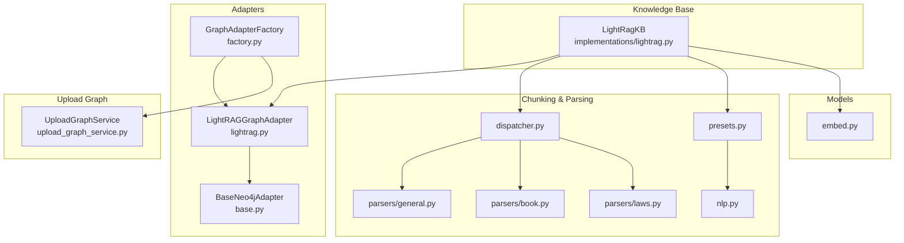
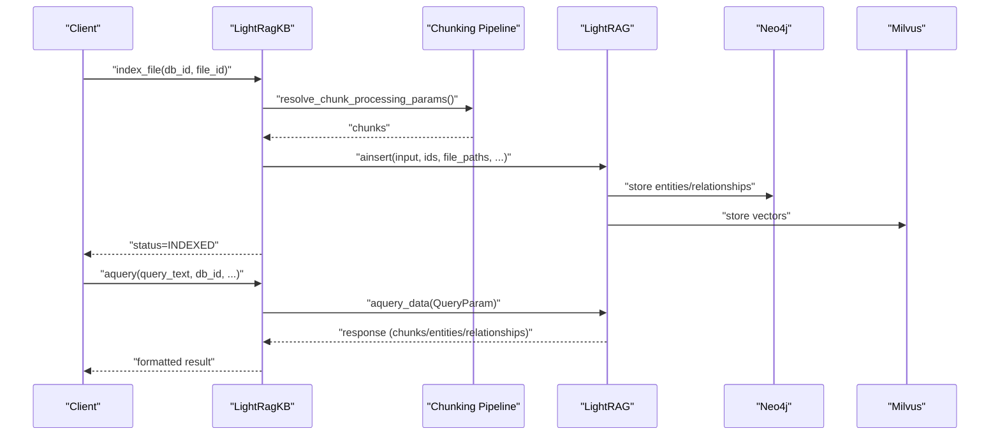
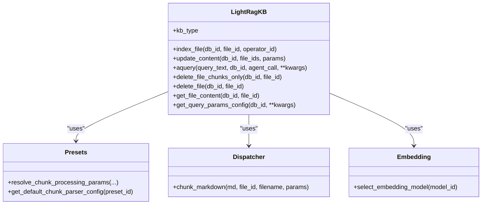
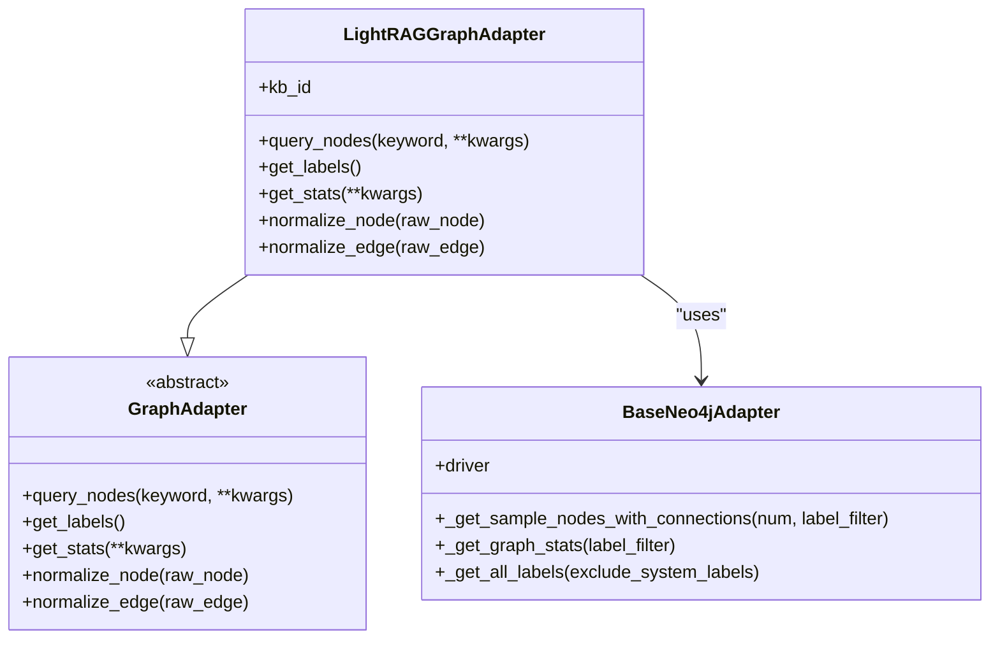
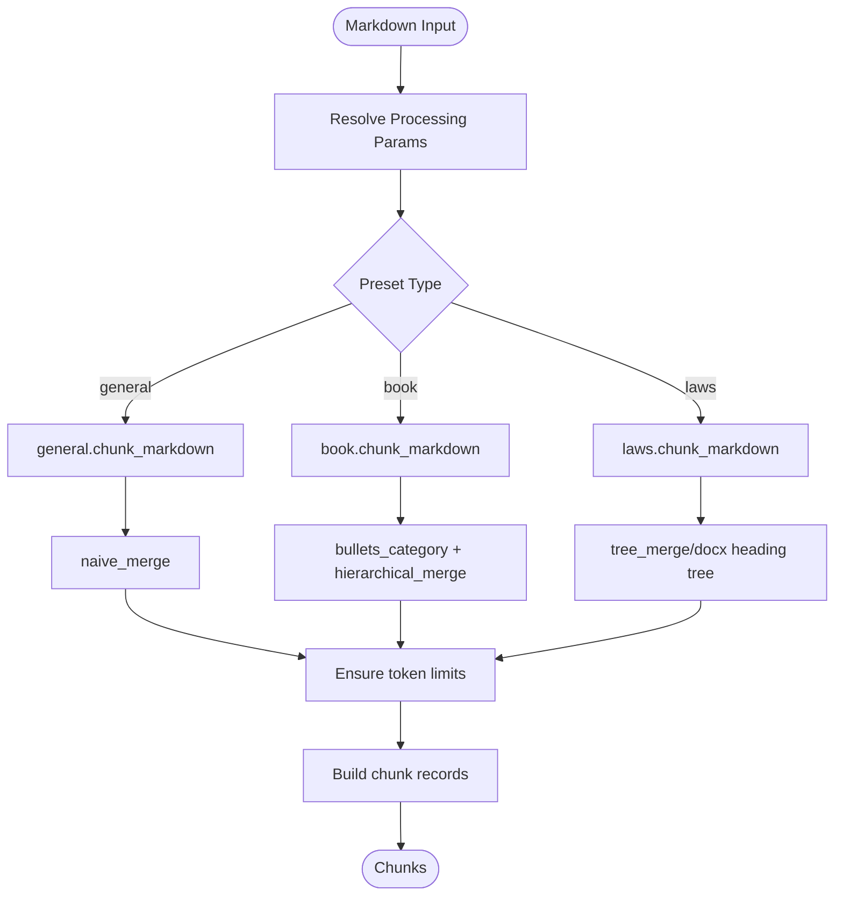
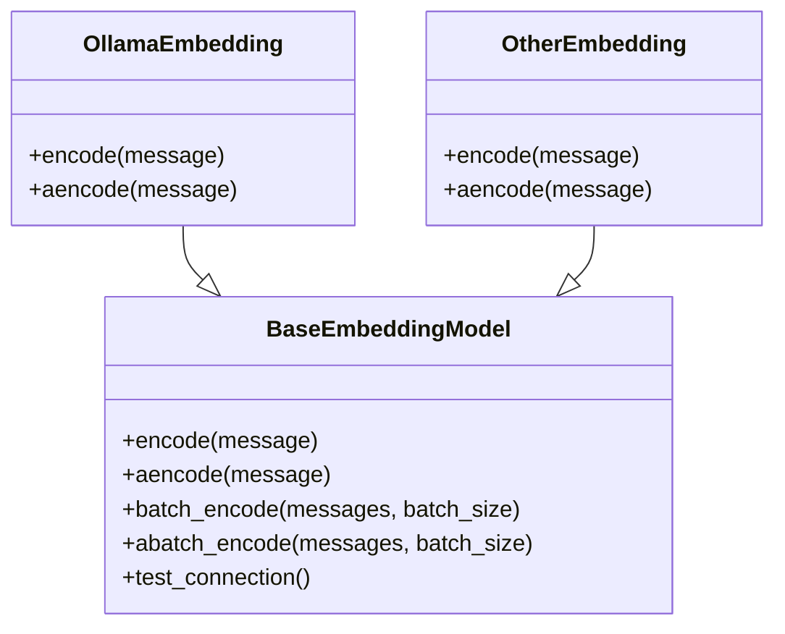
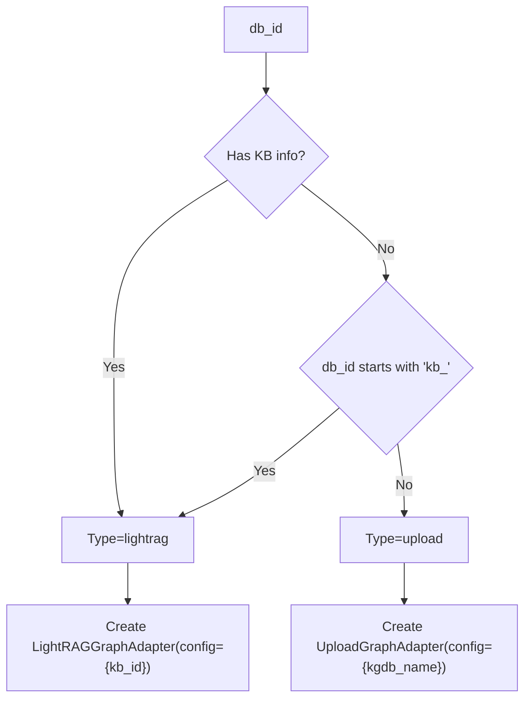
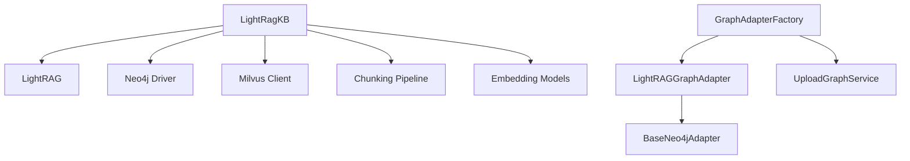

# LightRAG Integration

<cite>
**Referenced Files in This Document**
- [lightrag.py](file://backend/package/yuxi/knowledge/implementations/lightrag.py)
- [lightrag.py](file://backend/package/yuxi/knowledge/graphs/adapters/lightrag.py)
- [base.py](file://backend/package/yuxi/knowledge/graphs/adapters/base.py)
- [factory.py](file://backend/package/yuxi/knowledge/graphs/adapters/factory.py)
- [dispatcher.py](file://backend/package/yuxi/knowledge/chunking/ragflow_like/dispatcher.py)
- [presets.py](file://backend/package/yuxi/knowledge/chunking/ragflow_like/presets.py)
- [general.py](file://backend/package/yuxi/knowledge/chunking/ragflow_like/parsers/general.py)
- [book.py](file://backend/package/yuxi/knowledge/chunking/ragflow_like/parsers/book.py)
- [laws.py](file://backend/package/yuxi/knowledge/chunking/ragflow_like/parsers/laws.py)
- [nlp.py](file://backend/package/yuxi/knowledge/chunking/ragflow_like/nlp.py)
- [upload_graph_service.py](file://backend/package/yuxi/knowledge/graphs/upload_graph_service.py)
- [embed.py](file://backend/package/yuxi/models/embed.py)
</cite>

## Table of Contents
1. [Introduction](#introduction)
2. [Project Structure](#project-structure)
3. [Core Components](#core-components)
4. [Architecture Overview](#architecture-overview)
5. [Detailed Component Analysis](#detailed-component-analysis)
6. [Dependency Analysis](#dependency-analysis)
7. [Performance Considerations](#performance-considerations)
8. [Troubleshooting Guide](#troubleshooting-guide)
9. [Conclusion](#conclusion)

## Introduction
This document explains the LightRAG integration within the knowledge graph construction system. It covers how LightRAG powers automatic entity extraction, relationship building, and knowledge graph construction from unstructured documents. It documents the LightRAG adapter implementation, configuration parameters, embedding models, graph construction algorithms, and the integration with document chunking and preprocessing workflows. Practical guidance is included for configuration, performance tuning, troubleshooting, memory optimization, batch processing, and scalability for large document collections.

## Project Structure
The LightRAG integration spans several modules:
- Knowledge graph adapters and factories for graph access and detection
- LightRAG-specific knowledge base implementation
- Document chunking and parsing pipeline with presets and parsers
- Embedding model abstraction and selection
- Upload graph service for comparison and contrast

**Diagram sources**
- [factory.py:1-93](file://backend/package/yuxi/knowledge/graphs/adapters/factory.py#L1-L93)
- [base.py:206-459](file://backend/package/yuxi/knowledge/graphs/adapters/base.py#L206-L459)
- [lightrag.py:8-329](file://backend/package/yuxi/knowledge/graphs/adapters/lightrag.py#L1-L329)
- [lightrag.py:23-779](file://backend/package/yuxi/knowledge/implementations/lightrag.py#L1-L779)
- [dispatcher.py:1-65](file://backend/package/yuxi/knowledge/chunking/ragflow_like/dispatcher.py#L1-L65)
- [presets.py:1-239](file://backend/package/yuxi/knowledge/chunking/ragflow_like/presets.py#L1-L239)
- [general.py:1-47](file://backend/package/yuxi/knowledge/chunking/ragflow_like/parsers/general.py#L1-L47)
- [book.py:1-62](file://backend/package/yuxi/knowledge/chunking/ragflow_like/parsers/book.py#L1-L62)
- [laws.py:1-210](file://backend/package/yuxi/knowledge/chunking/ragflow_like/parsers/laws.py#L1-L210)
- [nlp.py:1-535](file://backend/package/yuxi/knowledge/chunking/ragflow_like/nlp.py#L1-L535)
- [upload_graph_service.py:18-778](file://backend/package/yuxi/knowledge/graphs/upload_graph_service.py#L1-L778)
- [embed.py:1-296](file://backend/package/yuxi/models/embed.py#L1-L296)

**Section sources**
- [factory.py:1-93](file://backend/package/yuxi/knowledge/graphs/adapters/factory.py#L1-L93)
- [base.py:206-459](file://backend/package/yuxi/knowledge/graphs/adapters/base.py#L206-L459)
- [lightrag.py:8-329](file://backend/package/yuxi/knowledge/graphs/adapters/lightrag.py#L1-L329)
- [lightrag.py:23-779](file://backend/package/yuxi/knowledge/implementations/lightrag.py#L1-L779)
- [dispatcher.py:1-65](file://backend/package/yuxi/knowledge/chunking/ragflow_like/dispatcher.py#L1-L65)
- [presets.py:1-239](file://backend/package/yuxi/knowledge/chunking/ragflow_like/presets.py#L1-L239)
- [general.py:1-47](file://backend/package/yuxi/knowledge/chunking/ragflow_like/parsers/general.py#L1-L47)
- [book.py:1-62](file://backend/package/yuxi/knowledge/chunking/ragflow_like/parsers/book.py#L1-L62)
- [laws.py:1-210](file://backend/package/yuxi/knowledge/chunking/ragflow_like/parsers/laws.py#L1-L210)
- [nlp.py:1-535](file://backend/package/yuxi/knowledge/chunking/ragflow_like/nlp.py#L1-L535)
- [upload_graph_service.py:18-778](file://backend/package/yuxi/knowledge/graphs/upload_graph_service.py#L1-L778)
- [embed.py:1-296](file://backend/package/yuxi/models/embed.py#L1-L296)

## Core Components
- LightRagKB: Implements the LightRAG knowledge base lifecycle, including instance creation, initialization, indexing, querying, and deletion. It integrates with chunking, embedding, and Neo4j/Milvus storages.
- LightRAGGraphAdapter: Provides graph access via Neo4j for LightRAG-managed knowledge bases, supporting node queries, label retrieval, and statistics.
- GraphAdapterFactory: Detects graph type by database ID and creates appropriate adapters.
- Chunking Pipeline: Resolves chunk presets, dispatches to parsers, and produces chunk records with metadata.
- Embedding Models: Abstraction for embedding generation, supporting OpenAI-style and Ollama backends.

**Section sources**
- [lightrag.py:23-779](file://backend/package/yuxi/knowledge/implementations/lightrag.py#L1-L779)
- [lightrag.py:8-329](file://backend/package/yuxi/knowledge/graphs/adapters/lightrag.py#L1-L329)
- [factory.py:37-93](file://backend/package/yuxi/knowledge/graphs/adapters/factory.py#L37-L93)
- [dispatcher.py:49-65](file://backend/package/yuxi/knowledge/chunking/ragflow_like/dispatcher.py#L49-L65)
- [presets.py:161-213](file://backend/package/yuxi/knowledge/chunking/ragflow_like/presets.py#L161-L213)
- [embed.py:13-296](file://backend/package/yuxi/models/embed.py#L1-L296)

## Architecture Overview
LightRAG orchestrates entity extraction and relationship building through a pipeline that:
- Parses documents into structured markdown
- Splits markdown into chunks with configurable presets
- Inserts chunks into LightRAG, which builds entities and relationships
- Stores entities and relationships in Neo4j and vectors in Milvus
- Exposes graph queries via the LightRAGGraphAdapter

**Diagram sources**
- [lightrag.py:305-421](file://backend/package/yuxi/knowledge/implementations/lightrag.py#L305-L421)
- [lightrag.py:526-596](file://backend/package/yuxi/knowledge/implementations/lightrag.py#L526-L596)
- [dispatcher.py:49-65](file://backend/package/yuxi/knowledge/chunking/ragflow_like/dispatcher.py#L49-L65)

## Detailed Component Analysis

### LightRAG Knowledge Base Implementation
- Instance lifecycle: Creates and initializes LightRAG instances per database, with caching and locks to avoid contention.
- Embedding and LLM configuration: Selects embedding and LLM functions based on stored configuration, supporting OpenAI and Ollama.
- Indexing pipeline: Reads markdown, resolves chunking parameters, chunks content, inserts into LightRAG, and validates processing status.
- Querying: Builds QueryParam from request and database settings, executes hybrid retrieval, and returns structured results.
- Deletion: Supports selective deletion of chunks and full file removal.

**Diagram sources**
- [lightrag.py:23-779](file://backend/package/yuxi/knowledge/implementations/lightrag.py#L1-L779)
- [presets.py:161-213](file://backend/package/yuxi/knowledge/chunking/ragflow_like/presets.py#L161-L213)
- [dispatcher.py:49-65](file://backend/package/yuxi/knowledge/chunking/ragflow_like/dispatcher.py#L49-L65)
- [embed.py:279-296](file://backend/package/yuxi/models/embed.py#L279-L296)

**Section sources**
- [lightrag.py:136-224](file://backend/package/yuxi/knowledge/implementations/lightrag.py#L136-L224)
- [lightrag.py:263-303](file://backend/package/yuxi/knowledge/implementations/lightrag.py#L263-L303)
- [lightrag.py:305-421](file://backend/package/yuxi/knowledge/implementations/lightrag.py#L305-L421)
- [lightrag.py:526-596](file://backend/package/yuxi/knowledge/implementations/lightrag.py#L526-L596)
- [lightrag.py:602-625](file://backend/package/yuxi/knowledge/implementations/lightrag.py#L602-L625)

### LightRAG Graph Adapter
- Purpose: Provides graph access for LightRAG-managed knowledge bases using Neo4j.
- Features:
  - Node query with keyword filtering and depth expansion
  - Label enumeration and statistics
  - Normalization of nodes and edges to a standard format
  - Subgraph sampling and result post-processing

**Diagram sources**
- [base.py:43-147](file://backend/package/yuxi/knowledge/graphs/adapters/base.py#L43-L147)
- [base.py:206-459](file://backend/package/yuxi/knowledge/graphs/adapters/base.py#L206-L459)
- [lightrag.py:8-329](file://backend/package/yuxi/knowledge/graphs/adapters/lightrag.py#L1-L329)

**Section sources**
- [lightrag.py:30-106](file://backend/package/yuxi/knowledge/graphs/adapters/lightrag.py#L30-L106)
- [lightrag.py:108-166](file://backend/package/yuxi/knowledge/graphs/adapters/lightrag.py#L108-L166)
- [lightrag.py:168-281](file://backend/package/yuxi/knowledge/graphs/adapters/lightrag.py#L168-L281)
- [base.py:206-459](file://backend/package/yuxi/knowledge/graphs/adapters/base.py#L206-L459)

### Chunking and Preprocessing Pipeline
- Presets: Define default chunking behavior per domain (general, QA, book, laws).
- Resolution: Merges request, file, and KB parameters to produce effective chunking configuration.
- Dispatch: Routes markdown to appropriate parser based on preset.
- Parsers: General, book, and laws parsers implement domain-aware splitting and token-limit protection.
- NLP Utilities: Token counting, heading detection, hierarchical merging, and safe hard splits.

**Diagram sources**
- [presets.py:161-213](file://backend/package/yuxi/knowledge/chunking/ragflow_like/presets.py#L161-L213)
- [dispatcher.py:32-57](file://backend/package/yuxi/knowledge/chunking/ragflow_like/dispatcher.py#L32-L57)
- [general.py:33-47](file://backend/package/yuxi/knowledge/chunking/ragflow_like/parsers/general.py#L33-L47)
- [book.py:26-62](file://backend/package/yuxi/knowledge/chunking/ragflow_like/parsers/book.py#L26-L62)
- [laws.py:169-210](file://backend/package/yuxi/knowledge/chunking/ragflow_like/parsers/laws.py#L169-L210)
- [nlp.py:411-482](file://backend/package/yuxi/knowledge/chunking/ragflow_like/nlp.py#L411-L482)

**Section sources**
- [presets.py:161-213](file://backend/package/yuxi/knowledge/chunking/ragflow_like/presets.py#L161-L213)
- [dispatcher.py:32-57](file://backend/package/yuxi/knowledge/chunking/ragflow_like/dispatcher.py#L32-L57)
- [general.py:33-47](file://backend/package/yuxi/knowledge/chunking/ragflow_like/parsers/general.py#L33-L47)
- [book.py:26-62](file://backend/package/yuxi/knowledge/chunking/ragflow_like/parsers/book.py#L26-L62)
- [laws.py:169-210](file://backend/package/yuxi/knowledge/chunking/ragflow_like/parsers/laws.py#L169-L210)
- [nlp.py:411-482](file://backend/package/yuxi/knowledge/chunking/ragflow_like/nlp.py#L411-L482)

### Embedding Models and Configuration
- Abstraction: BaseEmbeddingModel defines sync/async encoding and batching helpers.
- Providers: OllamaEmbedding and OtherEmbedding implement provider-specific payloads and responses.
- Selection: select_embedding_model chooses provider and constructs the appropriate model.

**Diagram sources**
- [embed.py:13-139](file://backend/package/yuxi/models/embed.py#L13-L139)
- [embed.py:140-181](file://backend/package/yuxi/models/embed.py#L140-L181)
- [embed.py:183-216](file://backend/package/yuxi/models/embed.py#L183-L216)

**Section sources**
- [embed.py:13-139](file://backend/package/yuxi/models/embed.py#L13-L139)
- [embed.py:140-181](file://backend/package/yuxi/models/embed.py#L140-L181)
- [embed.py:183-216](file://backend/package/yuxi/models/embed.py#L183-L216)
- [embed.py:279-296](file://backend/package/yuxi/models/embed.py#L279-L296)

### Graph Type Detection and Factory
- Detection: GraphAdapterFactory detects whether a database is LightRAG-managed by checking metadata or db_id prefix.
- Creation: Creates LightRAGGraphAdapter with kb_id or UploadGraphAdapter with kgdb_name.

**Diagram sources**
- [factory.py:37-93](file://backend/package/yuxi/knowledge/graphs/adapters/factory.py#L37-L93)

**Section sources**
- [factory.py:37-93](file://backend/package/yuxi/knowledge/graphs/adapters/factory.py#L37-L93)

## Dependency Analysis
- LightRagKB depends on:
  - LightRAG library for entity/relationship extraction
  - Neo4j driver for graph storage
  - Milvus client for vector storage
  - Chunking pipeline for preprocessing
  - Embedding models for vectorization
- LightRAGGraphAdapter depends on BaseNeo4jAdapter for Neo4j connectivity and Cypher queries.
- GraphAdapterFactory centralizes adapter creation and detection logic.

**Diagram sources**
- [lightrag.py:23-779](file://backend/package/yuxi/knowledge/implementations/lightrag.py#L1-L779)
- [lightrag.py:8-329](file://backend/package/yuxi/knowledge/graphs/adapters/lightrag.py#L1-L329)
- [base.py:206-459](file://backend/package/yuxi/knowledge/graphs/adapters/base.py#L206-L459)
- [factory.py:1-93](file://backend/package/yuxi/knowledge/graphs/adapters/factory.py#L1-L93)
- [upload_graph_service.py:18-778](file://backend/package/yuxi/knowledge/graphs/upload_graph_service.py#L1-L778)

**Section sources**
- [lightrag.py:23-779](file://backend/package/yuxi/knowledge/implementations/lightrag.py#L1-L779)
- [lightrag.py:8-329](file://backend/package/yuxi/knowledge/graphs/adapters/lightrag.py#L1-L329)
- [base.py:206-459](file://backend/package/yuxi/knowledge/graphs/adapters/base.py#L206-L459)
- [factory.py:1-93](file://backend/package/yuxi/knowledge/graphs/adapters/factory.py#L1-L93)
- [upload_graph_service.py:18-778](file://backend/package/yuxi/knowledge/graphs/upload_graph_service.py#L1-L778)

## Performance Considerations
- Chunking and token limits:
  - Use presets tailored to document types (general, QA, book, laws) to improve coherence.
  - Ensure token limits are enforced to prevent oversized embeddings; the laws parser includes explicit protections.
- Batch processing:
  - Embedding batching is handled by the embedding model abstraction; choose appropriate batch sizes for throughput vs. memory trade-offs.
- Concurrency:
  - LightRagKB uses per-db write and instance locks to serialize expensive operations and avoid contention.
- Vector storage:
  - Milvus collections are dropped and recreated during cleanup; ensure proper sizing and indexing for large-scale deployments.
- Query depth and limits:
  - Graph queries cap node counts and optionally expand subgraphs; tune max_depth and limit for performance.

[No sources needed since this section provides general guidance]

## Troubleshooting Guide
Common issues and resolutions:
- LightRAG instance creation failures:
  - Verify LLM and embedding configurations; the implementation logs errors and clears caches when LLM info changes.
- Document processing errors:
  - The indexing process validates file status and updates metadata accordingly; inspect error fields for root causes.
- Export functionality disabled:
  - The native export feature is currently disabled due to upstream Milvus compatibility issues; use alternative extraction methods.
- Neo4j connectivity:
  - The adapter relies on BaseNeo4jAdapter; ensure environment variables for URI, username, and password are set correctly.
- Embedding model connectivity:
  - Use the embedding model testing utilities to validate endpoints and dimensions.

**Section sources**
- [lightrag.py:112-134](file://backend/package/yuxi/knowledge/implementations/lightrag.py#L112-L134)
- [lightrag.py:331-344](file://backend/package/yuxi/knowledge/implementations/lightrag.py#L331-L344)
- [lightrag.py:408-416](file://backend/package/yuxi/knowledge/implementations/lightrag.py#L408-L416)
- [lightrag.py:743-751](file://backend/package/yuxi/knowledge/implementations/lightrag.py#L743-L751)
- [base.py:149-204](file://backend/package/yuxi/knowledge/graphs/adapters/base.py#L149-L204)
- [embed.py:218-248](file://backend/package/yuxi/models/embed.py#L218-L248)

## Conclusion
The LightRAG integration provides a robust pipeline for transforming unstructured documents into a knowledge graph with automatic entity extraction and relationship building. The implementation leverages a modular design: a configurable chunking pipeline, flexible embedding backends, and a Neo4j-based adapter for graph access. With proper configuration, batching, and monitoring, the system scales to large document collections while maintaining performance and reliability.