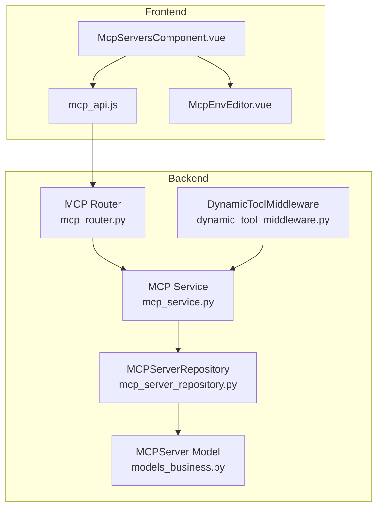
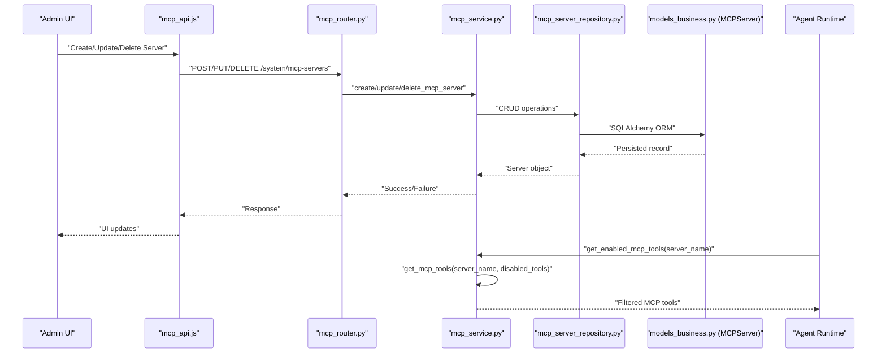
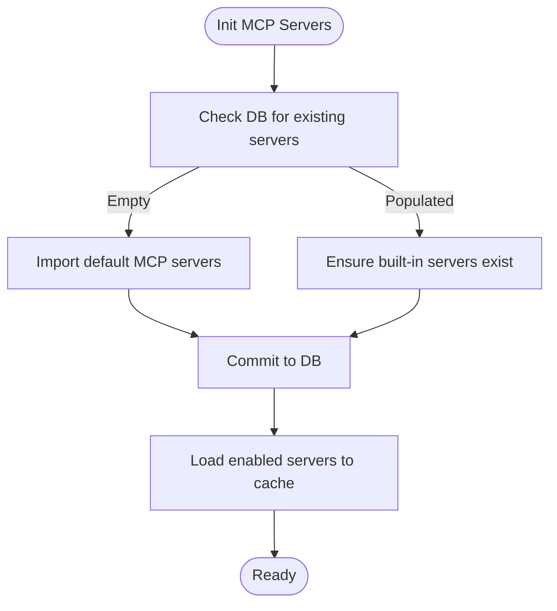
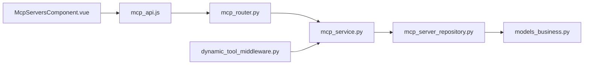

# MCP Integration

<cite>
**Referenced Files in This Document**
- [mcp_service.py](file://backend/package/yuxi/services/mcp_service.py)
- [mcp_router.py](file://backend/server/routers/mcp_router.py)
- [mcp_server_repository.py](file://backend/package/yuxi/repositories/mcp_server_repository.py)
- [models_business.py](file://backend/package/yuxi/storage/postgres/models_business.py)
- [dynamic_tool_middleware.py](file://backend/package/yuxi/agents/middlewares/dynamic_tool_middleware.py)
- [mcp_api.js](file://web/src/apis/mcp_api.js)
- [McpServersComponent.vue](file://web/src/components/McpServersComponent.vue)
- [McpEnvEditor.vue](file://web/src/components/McpEnvEditor.vue)
- [mcp-integration.md](file://docs/agents/mcp-integration.md)
- [test_mcp_router.py](file://backend/test/unit/routers/test_mcp_router.py)
</cite>

## Table of Contents
1. [Introduction](#introduction)
2. [Project Structure](#project-structure)
3. [Core Components](#core-components)
4. [Architecture Overview](#architecture-overview)
5. [Detailed Component Analysis](#detailed-component-analysis)
6. [Dependency Analysis](#dependency-analysis)
7. [Performance Considerations](#performance-considerations)
8. [Troubleshooting Guide](#troubleshooting-guide)
9. [Conclusion](#conclusion)
10. [Appendices](#appendices)

## Introduction
This document explains Model Context Protocol (MCP) integration in Yuxi. It covers the MCP specification, how Yuxi extends agent capabilities via external tool servers, server management (registration, discovery, lifecycle), tool integration into agent workflows, built-in MCP servers, custom server development, security configuration, performance, error handling, and debugging. It also documents the MCP protocol implementation, message formats, and communication patterns used in the platform.

## Project Structure
Yuxi implements MCP support across backend services, persistence, routing, and the frontend management UI:
- Backend service layer orchestrates MCP server configuration, caching, and tool retrieval.
- Database models persist MCP server configurations and state.
- FastAPI routes expose administrative APIs for server and tool management.
- Frontend components provide a UI for adding/removing servers, configuring transports, testing connectivity, and toggling tool enablement.

**Diagram sources**
- [mcp_service.py:1-650](file://backend/package/yuxi/services/mcp_service.py#L1-L650)
- [mcp_router.py:1-394](file://backend/server/routers/mcp_router.py#L1-L394)
- [mcp_server_repository.py:1-82](file://backend/package/yuxi/repositories/mcp_server_repository.py#L1-L82)
- [models_business.py:427-525](file://backend/package/yuxi/storage/postgres/models_business.py#L427-L525)
- [dynamic_tool_middleware.py:1-70](file://backend/package/yuxi/agents/middlewares/dynamic_tool_middleware.py#L1-L70)
- [mcp_api.js:1-135](file://web/src/apis/mcp_api.js#L1-L135)
- [McpServersComponent.vue:1-1167](file://web/src/components/McpServersComponent.vue#L1-L1167)
- [McpEnvEditor.vue:1-146](file://web/src/components/McpEnvEditor.vue#L1-L146)

**Section sources**
- [mcp_service.py:1-650](file://backend/package/yuxi/services/mcp_service.py#L1-L650)
- [mcp_router.py:1-394](file://backend/server/routers/mcp_router.py#L1-L394)
- [mcp_server_repository.py:1-82](file://backend/package/yuxi/repositories/mcp_server_repository.py#L1-L82)
- [models_business.py:427-525](file://backend/package/yuxi/storage/postgres/models_business.py#L427-L525)
- [dynamic_tool_middleware.py:1-70](file://backend/package/yuxi/agents/middlewares/dynamic_tool_middleware.py#L1-L70)
- [mcp_api.js:1-135](file://web/src/apis/mcp_api.js#L1-L135)
- [McpServersComponent.vue:1-1167](file://web/src/components/McpServersComponent.vue#L1-L1167)
- [McpEnvEditor.vue:1-146](file://web/src/components/McpEnvEditor.vue#L1-L146)

## Core Components
- MCP Service: Centralizes server configuration CRUD, cache synchronization, tool fetching and filtering, and statistics.
- MCP Router: Exposes administrative endpoints for server/tool management and testing.
- MCPServer Repository: Data access for MCP server records.
- MCPServer Model: Database schema and conversion helpers for MCP configs.
- DynamicToolMiddleware: Integrates MCP tools into agent workflows by pre-loading and dynamically selecting tools at runtime.
- Frontend MCP API and UI: Provides server/tool management UX and environment variable editor.

Key responsibilities:
- Server configuration CRUD and cache sync (Database ↔ Runtime cache).
- Unified entry point for agents to retrieve MCP tools with automatic filtering of disabled tools.
- Tool caching and statistics for reporting enabled/disabled counts.
- Agent middleware to register MCP tools and filter by runtime selections.

**Section sources**
- [mcp_service.py:1-650](file://backend/package/yuxi/services/mcp_service.py#L1-L650)
- [mcp_router.py:1-394](file://backend/server/routers/mcp_router.py#L1-L394)
- [mcp_server_repository.py:1-82](file://backend/package/yuxi/repositories/mcp_server_repository.py#L1-L82)
- [models_business.py:427-525](file://backend/package/yuxi/storage/postgres/models_business.py#L427-L525)
- [dynamic_tool_middleware.py:1-70](file://backend/package/yuxi/agents/middlewares/dynamic_tool_middleware.py#L1-L70)
- [mcp_api.js:1-135](file://web/src/apis/mcp_api.js#L1-L135)
- [McpServersComponent.vue:1-1167](file://web/src/components/McpServersComponent.vue#L1-L1167)
- [McpEnvEditor.vue:1-146](file://web/src/components/McpEnvEditor.vue#L1-L146)

## Architecture Overview
Yuxi’s MCP architecture consists of:
- Configuration layer: Database-backed MCPServer records with transport-specific fields.
- Service layer: MCP Service manages runtime cache, tool retrieval, and filtering.
- Agent integration: DynamicToolMiddleware registers MCP tools and selects them per agent run.
- API/UI layer: Administrative endpoints and Vue components for server/tool management.

**Diagram sources**
- [mcp_router.py:81-220](file://backend/server/routers/mcp_router.py#L81-L220)
- [mcp_service.py:391-512](file://backend/package/yuxi/services/mcp_service.py#L391-L512)
- [mcp_server_repository.py:32-59](file://backend/package/yuxi/repositories/mcp_server_repository.py#L32-L59)
- [models_business.py:427-525](file://backend/package/yuxi/storage/postgres/models_business.py#L427-L525)
- [mcp_api.js:14-57](file://web/src/apis/mcp_api.js#L14-L57)
- [McpServersComponent.vue:708-762](file://web/src/components/McpServersComponent.vue#L708-L762)

## Detailed Component Analysis

### MCP Service
The MCP Service centralizes:
- Initialization and synchronization of MCP server configurations from the database to a runtime cache.
- Tool retrieval with caching and filtering by disabled tools.
- Statistics for enabled/disabled tool counts.
- CRUD operations for server configuration and status toggling.

Key behaviors:
- Loads enabled servers from DB to a global cache and clears tool cache upon server changes.
- Renders unique tool IDs by combining server and tool names in camelCase.
- Supports refreshing tools from the server and clearing caches for testing.

**Diagram sources**
- [mcp_service.py:120-205](file://backend/package/yuxi/services/mcp_service.py#L120-L205)

**Section sources**
- [mcp_service.py:1-650](file://backend/package/yuxi/services/mcp_service.py#L1-L650)

### MCP Router
The MCP Router exposes administrative endpoints:
- CRUD for MCP servers with validation for transport-specific fields.
- Toggle server enabled status.
- Test server connectivity by fetching tools.
- Manage tools: list, refresh, and toggle individual tool enablement.

Security:
- Requires admin user for all operations.
- Prevents deletion of system-created servers.

**Section sources**
- [mcp_router.py:1-394](file://backend/server/routers/mcp_router.py#L1-L394)

### MCPServer Repository
Provides database operations for MCP servers:
- Retrieve by name, list all, list enabled, create, update, delete, upsert, existence check.

**Section sources**
- [mcp_server_repository.py:1-82](file://backend/package/yuxi/repositories/mcp_server_repository.py#L1-L82)

### MCPServer Model
Defines the MCP server schema and conversion helpers:
- Transport-specific fields: url, command, args, env, headers, timeouts.
- UI fields: tags, icon.
- State fields: enabled, disabled_tools.
- Conversion to MCP config for runtime cache and to_dict for API responses.

**Section sources**
- [models_business.py:427-525](file://backend/package/yuxi/storage/postgres/models_business.py#L427-L525)

### DynamicToolMiddleware
Integrates MCP tools into agent workflows:
- Preloads MCP tools from configured servers and registers them with the agent.
- At runtime, filters tools based on selected tools and selected MCP servers from the agent’s runtime context.
- Logs warnings if a requested MCP server was not preloaded.

**Section sources**
- [dynamic_tool_middleware.py:1-70](file://backend/package/yuxi/agents/middlewares/dynamic_tool_middleware.py#L1-L70)

### Frontend MCP API and UI
- mcp_api.js: Wraps administrative MCP endpoints for the UI.
- McpServersComponent.vue: Full-featured UI for managing servers and tools, including transport-specific forms, environment variable editor, and tool toggles.
- McpEnvEditor.vue: Edits environment variables for stdio transports with row-based key/value editing and JSON normalization.

**Section sources**
- [mcp_api.js:1-135](file://web/src/apis/mcp_api.js#L1-L135)
- [McpServersComponent.vue:1-1167](file://web/src/components/McpServersComponent.vue#L1-L1167)
- [McpEnvEditor.vue:1-146](file://web/src/components/McpEnvEditor.vue#L1-L146)

## Dependency Analysis
- Backend depends on SQLAlchemy for persistence and a MultiServer MCP client adapter for tool retrieval.
- Router depends on Service for business logic.
- Service depends on Repository and Model for data access and conversion.
- Middleware depends on Service for tool retrieval.
- Frontend depends on Router via API module.

**Diagram sources**
- [mcp_router.py:1-394](file://backend/server/routers/mcp_router.py#L1-L394)
- [mcp_service.py:1-650](file://backend/package/yuxi/services/mcp_service.py#L1-L650)
- [mcp_server_repository.py:1-82](file://backend/package/yuxi/repositories/mcp_server_repository.py#L1-L82)
- [models_business.py:427-525](file://backend/package/yuxi/storage/postgres/models_business.py#L427-L525)
- [dynamic_tool_middleware.py:1-70](file://backend/package/yuxi/agents/middlewares/dynamic_tool_middleware.py#L1-L70)
- [mcp_api.js:1-135](file://web/src/apis/mcp_api.js#L1-L135)
- [McpServersComponent.vue:1-1167](file://web/src/components/McpServersComponent.vue#L1-L1167)

**Section sources**
- [mcp_router.py:1-394](file://backend/server/routers/mcp_router.py#L1-L394)
- [mcp_service.py:1-650](file://backend/package/yuxi/services/mcp_service.py#L1-L650)
- [mcp_server_repository.py:1-82](file://backend/package/yuxi/repositories/mcp_server_repository.py#L1-L82)
- [models_business.py:427-525](file://backend/package/yuxi/storage/postgres/models_business.py#L427-L525)
- [dynamic_tool_middleware.py:1-70](file://backend/package/yuxi/agents/middlewares/dynamic_tool_middleware.py#L1-L70)
- [mcp_api.js:1-135](file://web/src/apis/mcp_api.js#L1-L135)
- [McpServersComponent.vue:1-1167](file://web/src/components/McpServersComponent.vue#L1-L1167)

## Performance Considerations
- Caching: Tools are cached per server to avoid repeated network calls. Use refresh endpoints to invalidate cache when server tools change.
- Concurrency: A global lock protects MCP state updates to prevent race conditions.
- Filtering: Disabled tools are filtered at retrieval time to minimize overhead in agent tool selection.
- Batch operations: Use batch retrieval for tools across all servers when needed.

[No sources needed since this section provides general guidance]

## Troubleshooting Guide
Common issues and resolutions:
- Server not found: Ensure the server name matches the database record and is enabled.
- Transport mismatch: Verify transport type and required fields (url for HTTP transports, command for stdio).
- Tool list empty: Confirm server connectivity and that tools are not all disabled.
- Permission errors: Confirm admin credentials and that system servers are not being deleted.

Operational checks:
- Use the “Test” endpoint to validate server connectivity and count discovered tools.
- Use “Refresh” to reload tools and update statistics.
- Toggle individual tools to isolate problematic ones.

**Section sources**
- [mcp_router.py:227-251](file://backend/server/routers/mcp_router.py#L227-L251)
- [mcp_router.py:332-371](file://backend/server/routers/mcp_router.py#L332-L371)
- [test_mcp_router.py:31-68](file://backend/test/unit/routers/test_mcp_router.py#L31-L68)

## Conclusion
Yuxi’s MCP integration provides a robust, admin-managed framework for extending agent capabilities with external tool servers. It supports multiple transport types, granular tool enablement, caching, and seamless agent integration via middleware. The combination of backend services, database persistence, API endpoints, and a comprehensive frontend UI enables secure, scalable MCP deployments.

[No sources needed since this section summarizes without analyzing specific files]

## Appendices

### MCP Specification and Communication Patterns
- Supported transports: streamable_http, sse, stdio.
- Configuration fields vary by transport; HTTP transports accept url and optional headers; stdio accepts command, args, and env.
- Tool IDs are generated by combining server and tool names in camelCase for unique identification.

**Section sources**
- [mcp-integration.md:7-13](file://docs/agents/mcp-integration.md#L7-L13)
- [mcp_service.py:280-293](file://backend/package/yuxi/services/mcp_service.py#L280-L293)
- [models_business.py:484-525](file://backend/package/yuxi/storage/postgres/models_business.py#L484-L525)

### Built-in MCP Servers
On first run, Yuxi seeds default MCP servers into the database and ensures they exist on subsequent runs. These built-ins can be enabled or disabled by administrators.

**Section sources**
- [mcp_service.py:120-205](file://backend/package/yuxi/services/mcp_service.py#L120-L205)

### Security Configuration
- Authentication and authorization: All MCP administrative endpoints require admin authentication.
- Transport security:
  - streamable_http/sse: Configure headers for bearer tokens or custom auth.
  - stdio: Pass secrets via env variables managed through the UI.
- Access control: System-created servers cannot be deleted by users.

**Section sources**
- [mcp_router.py:198-220](file://backend/server/routers/mcp_router.py#L198-L220)
- [McpServersComponent.vue:449-466](file://web/src/components/McpServersComponent.vue#L449-L466)
- [McpEnvEditor.vue:1-146](file://web/src/components/McpEnvEditor.vue#L1-L146)

### Practical Examples
- Remote MCP server (streamable_http): Provide name, transport, and url.
- Local MCP server (stdio): Provide command and optional args/env.
- Enabling a server: Toggle status to enabled; it loads into runtime cache.
- Testing connectivity: Use the test endpoint to discover tool count.
- Managing tools: View all tools, refresh, and toggle individual tool enablement.

**Section sources**
- [mcp-integration.md:15-41](file://docs/agents/mcp-integration.md#L15-L41)
- [mcp_router.py:227-251](file://backend/server/routers/mcp_router.py#L227-L251)
- [mcp_router.py:281-330](file://backend/server/routers/mcp_router.py#L281-L330)