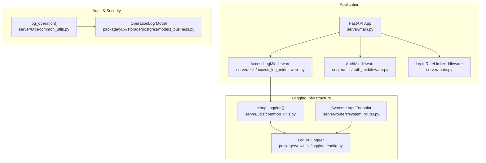
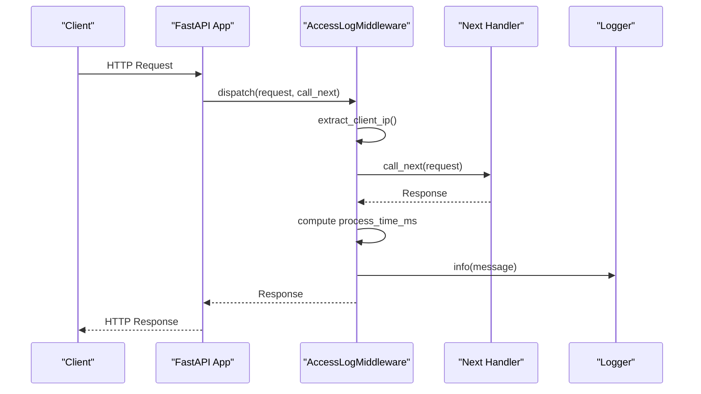
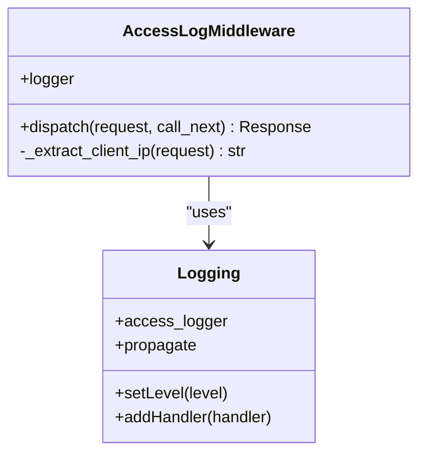
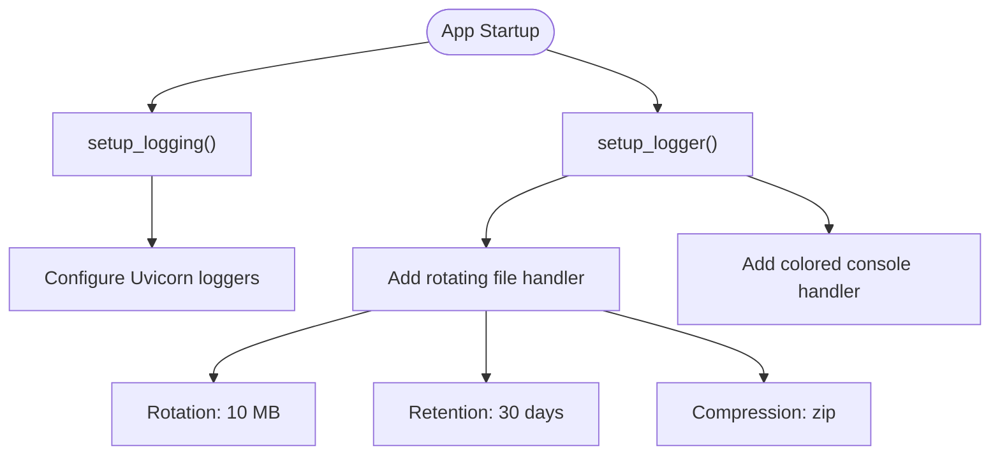
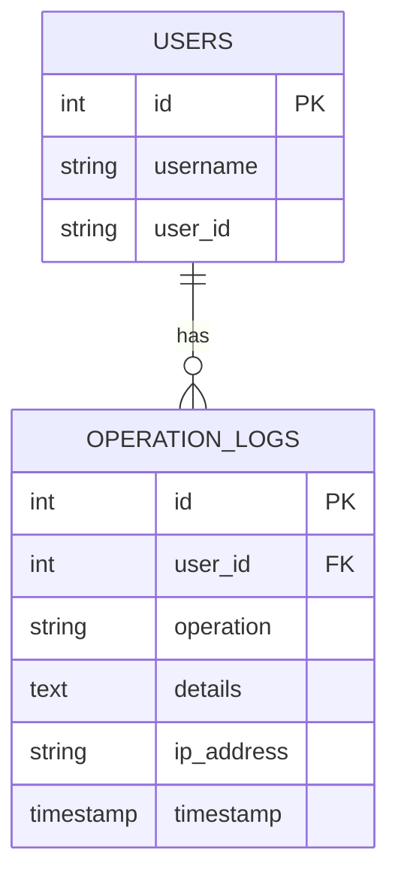
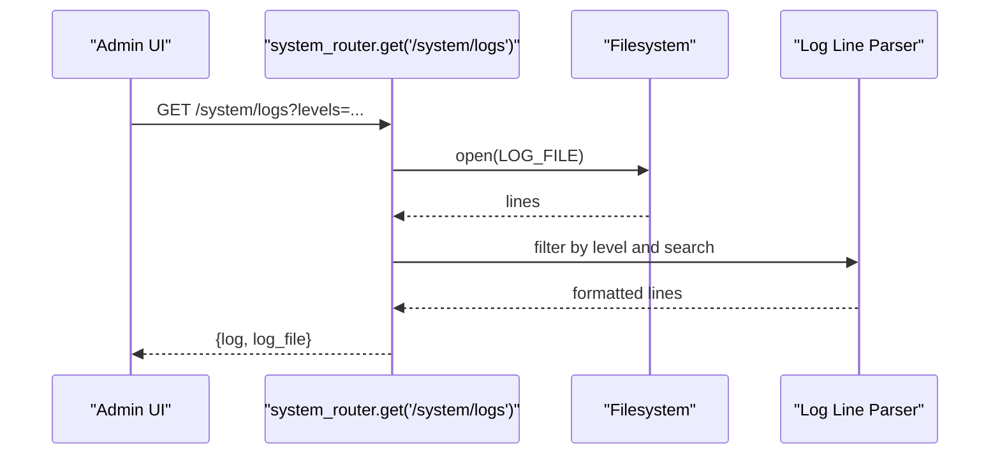
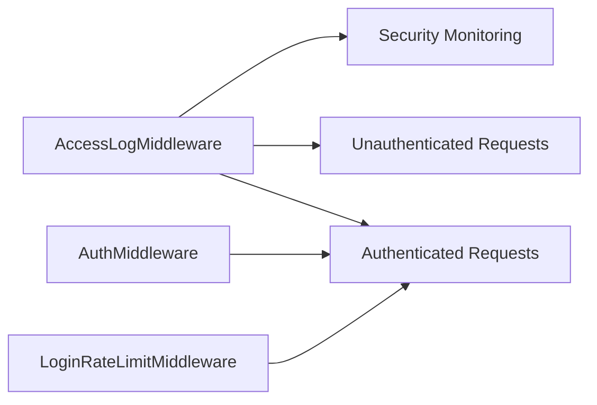
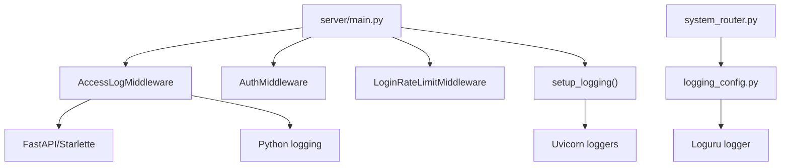

# Access Logging Middleware

<cite>
**Referenced Files in This Document**
- [access_log_middleware.py](file://backend/server/utils/access_log_middleware.py)
- [main.py](file://backend/server/main.py)
- [common_utils.py](file://backend/server/utils/common_utils.py)
- [logging_config.py](file://backend/package/yuxi/utils/logging_config.py)
- [system_router.py](file://backend/server/routers/system_router.py)
- [auth_middleware.py](file://backend/server/utils/auth_middleware.py)
- [models_business.py](file://backend/package/yuxi/storage/postgres/models_business.py)
</cite>

## Table of Contents
1. [Introduction](#introduction)
2. [Project Structure](#project-structure)
3. [Core Components](#core-components)
4. [Architecture Overview](#architecture-overview)
5. [Detailed Component Analysis](#detailed-component-analysis)
6. [Dependency Analysis](#dependency-analysis)
7. [Performance Considerations](#performance-considerations)
8. [Troubleshooting Guide](#troubleshooting-guide)
9. [Conclusion](#conclusion)

## Introduction
This document describes the access logging middleware system used to capture HTTP request/response traces, user activity, and operational metrics. It explains how the middleware records request processing time, extracts client IP addresses, and integrates with the application’s logging infrastructure. It also covers log formatting, structured logging patterns, log level configuration, and how access logs relate to security monitoring and audit trails.

## Project Structure
The access logging middleware is implemented as a FastAPI middleware and integrated into the application lifecycle. Supporting utilities configure logging formats and storage, while routers expose administrative endpoints to retrieve logs for analysis.

**Diagram sources**
- [main.py:132-137](file://backend/server/main.py#L132-L137)
- [access_log_middleware.py:34-67](file://backend/server/utils/access_log_middleware.py#L34-L67)
- [common_utils.py:11-31](file://backend/server/utils/common_utils.py#L11-L31)
- [logging_config.py:55-89](file://backend/package/yuxi/utils/logging_config.py#L55-L89)
- [system_router.py:54-94](file://backend/server/routers/system_router.py#L54-L94)
- [auth_middleware.py:100-129](file://backend/server/utils/auth_middleware.py#L100-L129)
- [models_business.py:373-396](file://backend/package/yuxi/storage/postgres/models_business.py#L373-L396)

**Section sources**
- [main.py:132-137](file://backend/server/main.py#L132-L137)
- [access_log_middleware.py:34-67](file://backend/server/utils/access_log_middleware.py#L34-L67)
- [common_utils.py:11-31](file://backend/server/utils/common_utils.py#L11-L31)
- [logging_config.py:55-89](file://backend/package/yuxi/utils/logging_config.py#L55-L89)
- [system_router.py:54-94](file://backend/server/routers/system_router.py#L54-L94)
- [auth_middleware.py:100-129](file://backend/server/utils/auth_middleware.py#L100-L129)
- [models_business.py:373-396](file://backend/package/yuxi/storage/postgres/models_business.py#L373-L396)

## Core Components
- AccessLogMiddleware: Captures request method, path, query string, HTTP version, response status code, and processing time in milliseconds. It extracts client IP via X-Forwarded-For header or request client host.
- Logging configuration: Provides two complementary logging setups:
  - setup_logging(): Standard Python logging configuration for Uvicorn and general app logs.
  - Loguru logger: Structured logging with file rotation, retention, compression, and console output.
- Audit trail utilities: log_operation() writes user operation logs to the database, and OperationLog model persists user actions with optional IP address.

**Section sources**
- [access_log_middleware.py:24-67](file://backend/server/utils/access_log_middleware.py#L24-L67)
- [common_utils.py:11-31](file://backend/server/utils/common_utils.py#L11-L31)
- [logging_config.py:55-89](file://backend/package/yuxi/utils/logging_config.py#L55-L89)
- [models_business.py:373-396](file://backend/package/yuxi/storage/postgres/models_business.py#L373-L396)

## Architecture Overview
The middleware participates in the request lifecycle to produce access logs. It is registered early in the middleware stack to ensure it captures all requests and responses consistently. The application also centralizes logging configuration and exposes a system endpoint to stream recent logs for analysis.

**Diagram sources**
- [access_log_middleware.py:41-67](file://backend/server/utils/access_log_middleware.py#L41-L67)
- [main.py:132-137](file://backend/server/main.py#L132-L137)

## Detailed Component Analysis

### AccessLogMiddleware
- Purpose: Record request metadata and timing for audit and performance monitoring.
- Key behaviors:
  - Extracts client IP from X-Forwarded-For header or request client host.
  - Computes processing time using high-resolution monotonic counter and logs in milliseconds.
  - Formats a concise access log line containing client IP/port, method/path/query, HTTP version, status code, and latency.
  - Uses a dedicated logger named “access_logger” to avoid duplication and integrate cleanly with the logging pipeline.

**Diagram sources**
- [access_log_middleware.py:34-67](file://backend/server/utils/access_log_middleware.py#L34-L67)

**Section sources**
- [access_log_middleware.py:24-67](file://backend/server/utils/access_log_middleware.py#L24-L67)

### Logging Configuration and Rotation
- setup_logging():
  - Configures basic logging format for the application.
  - Adjusts Uvicorn access logger to suppress default access logs and align formatting.
- Loguru logger:
  - Creates a rotating file logger with daily log files under saves/logs.
  - Applies rotation by size (10 MB), retention (30 days), and compression (zip).
  - Adds a colored console handler for local development.
  - Bridges third-party libraries to Loguru to unify logging.

**Diagram sources**
- [common_utils.py:11-31](file://backend/server/utils/common_utils.py#L11-L31)
- [logging_config.py:55-89](file://backend/package/yuxi/utils/logging_config.py#L55-L89)

**Section sources**
- [common_utils.py:11-31](file://backend/server/utils/common_utils.py#L11-L31)
- [logging_config.py:55-89](file://backend/package/yuxi/utils/logging_config.py#L55-L89)

### Audit Trail and Operation Logs
- OperationLog model stores user operations with user_id, operation type, details, IP address, and timestamp.
- log_operation() writes entries to the database asynchronously, ensuring failures do not block the request path.
- These logs complement access logs by capturing authenticated user actions for compliance and forensics.

**Diagram sources**
- [models_business.py:373-396](file://backend/package/yuxi/storage/postgres/models_business.py#L373-L396)

**Section sources**
- [models_business.py:373-396](file://backend/package/yuxi/storage/postgres/models_business.py#L373-L396)
- [common_utils.py:33-45](file://backend/server/utils/common_utils.py#L33-L45)

### Log Retrieval and Filtering
- System logs endpoint reads the latest rotated log file and supports filtering by log level.
- Frontend parsing expects lines in a standard format and supports search and level filtering.

**Diagram sources**
- [system_router.py:54-94](file://backend/server/routers/system_router.py#L54-L94)

**Section sources**
- [system_router.py:54-94](file://backend/server/routers/system_router.py#L54-L94)

### Relationship to Authentication and Security Monitoring
- Access logs capture unauthenticated and authenticated traffic uniformly, enabling detection of suspicious patterns (e.g., repeated failures, unusual paths).
- Authentication middleware marks public endpoints and delegates token verification; access logs remain unaffected and still record request metadata.
- Login rate limiting reduces brute-force exposure; access logs help correlate spikes with rate-limit events.

**Diagram sources**
- [main.py:132-137](file://backend/server/main.py#L132-L137)
- [auth_middleware.py:100-129](file://backend/server/utils/auth_middleware.py#L100-L129)

**Section sources**
- [main.py:132-137](file://backend/server/main.py#L132-L137)
- [auth_middleware.py:100-129](file://backend/server/utils/auth_middleware.py#L100-L129)

## Dependency Analysis
- AccessLogMiddleware depends on:
  - FastAPI Request/Response types and Starlette BaseHTTPMiddleware.
  - Python logging module for emitting access entries.
  - Utility function to extract client IP from headers or request client.
- Application integration:
  - Registered in main.py after CORS and before authentication middlewares to ensure broad coverage.
  - setup_logging() ensures Uvicorn access logs are suppressed and aligned with custom access logging.
- Storage and retrieval:
  - Loguru handles file rotation and retention.
  - System router reads the current log file for administrative viewing.

**Diagram sources**
- [access_log_middleware.py:34-67](file://backend/server/utils/access_log_middleware.py#L34-L67)
- [main.py:132-137](file://backend/server/main.py#L132-L137)
- [common_utils.py:11-31](file://backend/server/utils/common_utils.py#L11-L31)
- [logging_config.py:55-89](file://backend/package/yuxi/utils/logging_config.py#L55-L89)
- [system_router.py:54-94](file://backend/server/routers/system_router.py#L54-L94)

**Section sources**
- [access_log_middleware.py:34-67](file://backend/server/utils/access_log_middleware.py#L34-L67)
- [main.py:132-137](file://backend/server/main.py#L132-L137)
- [common_utils.py:11-31](file://backend/server/utils/common_utils.py#L11-L31)
- [logging_config.py:55-89](file://backend/package/yuxi/utils/logging_config.py#L55-L89)
- [system_router.py:54-94](file://backend/server/routers/system_router.py#L54-L94)

## Performance Considerations
- Minimal overhead: The middleware performs lightweight operations—timing, header parsing, and a single logger.info call—ensuring negligible impact on latency.
- Asynchronous logging: Loguru’s enqueue option buffers writes to reduce blocking.
- Rotation and retention: File rotation prevents unbounded growth; adjust rotation size and retention to balance disk usage and historical analysis needs.
- Console vs file: Prefer file logging in production; console handlers add colorization overhead but are useful for local debugging.

[No sources needed since this section provides general guidance]

## Troubleshooting Guide
- Access logs not appearing:
  - Verify AccessLogMiddleware is registered in main.py and runs before authentication.
  - Confirm setup_logging() is called at startup to align Uvicorn access logs.
- Duplicate or missing access logs:
  - The dedicated “access_logger” avoids propagation to root; ensure custom handlers are attached.
- Log file location and rotation:
  - Logs are stored under saves/logs with daily filenames; rotation is 10 MB and retention 30 days.
- Viewing logs:
  - Use the /system/logs endpoint with optional level filters (e.g., INFO, ERROR).
- Audit trail gaps:
  - log_operation() writes to the database asynchronously; failures are swallowed to avoid impacting request flow.

**Section sources**
- [main.py:132-137](file://backend/server/main.py#L132-L137)
- [access_log_middleware.py:10-21](file://backend/server/utils/access_log_middleware.py#L10-L21)
- [logging_config.py:55-89](file://backend/package/yuxi/utils/logging_config.py#L55-L89)
- [system_router.py:54-94](file://backend/server/routers/system_router.py#L54-L94)
- [common_utils.py:33-45](file://backend/server/utils/common_utils.py#L33-L45)

## Conclusion
The access logging middleware provides a lightweight, reliable mechanism to capture request metadata and processing times. Combined with centralized logging configuration and the operation log audit trail, it enables effective monitoring, debugging, and security analysis. Administrators can filter and retrieve recent logs via the system endpoint, while rotation and retention policies support long-term observability.