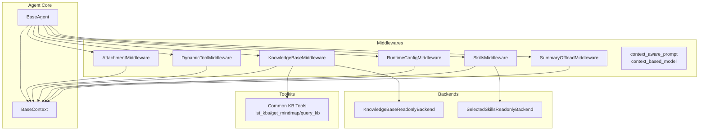
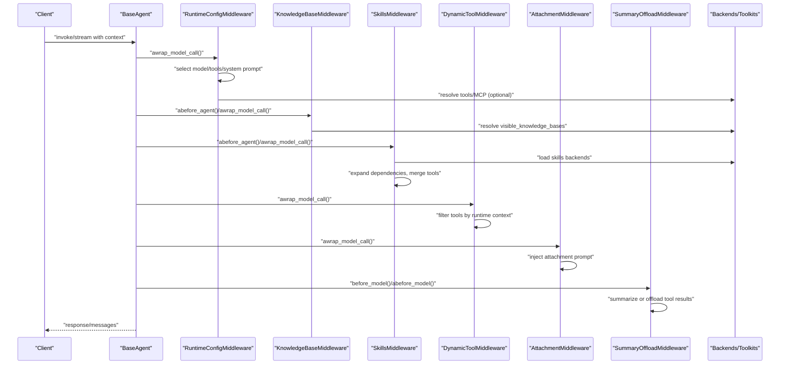
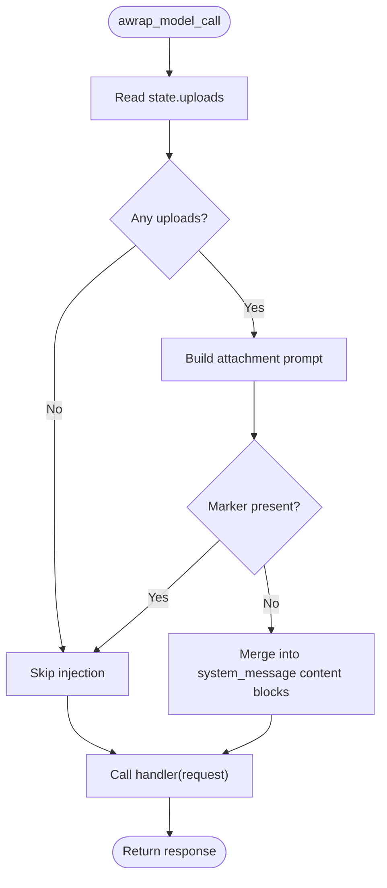
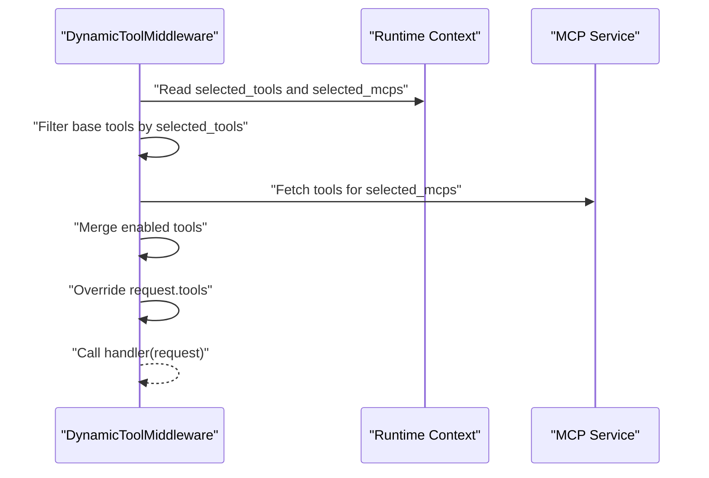
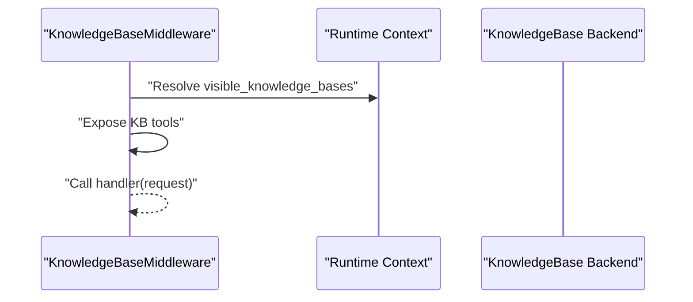
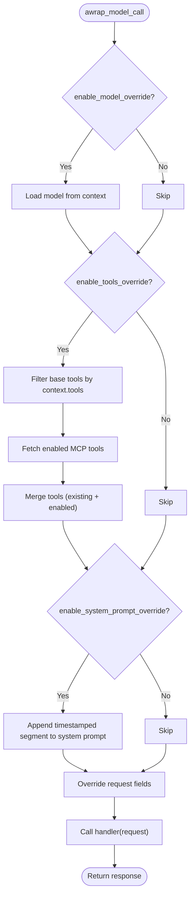
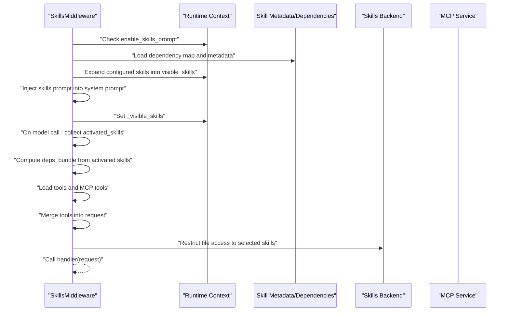
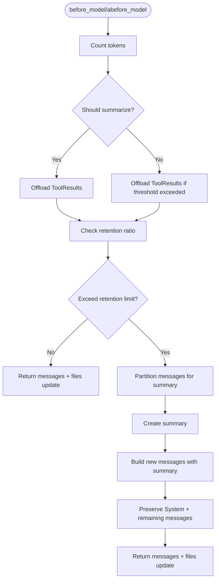
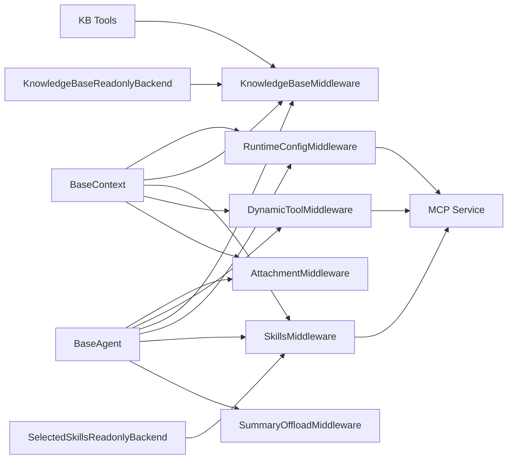

# Agent-Specific Middlewares

<cite>
**Referenced Files in This Document**
- [attachment_middleware.py](file://backend/package/yuxi/agents/middlewares/attachment_middleware.py)
- [dynamic_tool_middleware.py](file://backend/package/yuxi/agents/middlewares/dynamic_tool_middleware.py)
- [knowledge_base_middleware.py](file://backend/package/yuxi/agents/middlewares/knowledge_base_middleware.py)
- [runtime_config_middleware.py](file://backend/package/yuxi/agents/middlewares/runtime_config_middleware.py)
- [skills_middleware.py](file://backend/package/yuxi/agents/middlewares/skills_middleware.py)
- [summary_middleware.py](file://backend/package/yuxi/agents/middlewares/summary_middleware.py)
- [context_middlewares.py](file://backend/package/yuxi/agents/middlewares/context_middlewares.py)
- [__init__.py](file://backend/package/yuxi/agents/middlewares/__init__.py)
- [knowledge_base_backend.py](file://backend/package/yuxi/agents/backends/knowledge_base_backend.py)
- [skills_backend.py](file://backend/package/yuxi/agents/backends/skills_backend.py)
- [tools.py](file://backend/package/yuxi/agents/toolkits/kbs/tools.py)
- [base.py](file://backend/package/yuxi/agents/base.py)
- [context.py](file://backend/package/yuxi/agents/context.py)
- [test_skills_backend.py](file://backend/test/unit/backends/test_skills_backend.py)
- [test_knowledge_base_backend.py](file://backend/test/unit/backends/test_knowledge_base_backend.py)
</cite>

## Table of Contents
1. [Introduction](#introduction)
2. [Project Structure](#project-structure)
3. [Core Components](#core-components)
4. [Architecture Overview](#architecture-overview)
5. [Detailed Component Analysis](#detailed-component-analysis)
6. [Dependency Analysis](#dependency-analysis)
7. [Performance Considerations](#performance-considerations)
8. [Troubleshooting Guide](#troubleshooting-guide)
9. [Conclusion](#conclusion)

## Introduction
This document explains the agent-specific middleware components in Yuxi that shape the agent execution pipeline. It covers specialized middlewares for:
- Attachment processing
- Dynamic tool integration
- Knowledge base access
- Runtime configuration management
- Skills orchestration
- Response summarization

It details roles, data transformation patterns, state management, configuration options, and integration with agent backends. Practical usage patterns, execution flows, and troubleshooting guidance are included, along with performance considerations and optimization strategies for middleware chains.

## Project Structure
The agent middlewares live under the agents middlewares package and integrate with agent backends, toolkits, and context schemas. The following diagram shows the primary modules involved in agent middleware execution.

**Diagram sources**
- [attachment_middleware.py:54-88](file://backend/package/yuxi/agents/middlewares/attachment_middleware.py#L54-L88)
- [dynamic_tool_middleware.py:10-69](file://backend/package/yuxi/agents/middlewares/dynamic_tool_middleware.py#L10-L69)
- [knowledge_base_middleware.py:12-32](file://backend/package/yuxi/agents/middlewares/knowledge_base_middleware.py#L12-L32)
- [runtime_config_middleware.py:16-117](file://backend/package/yuxi/agents/middlewares/runtime_config_middleware.py#L16-L117)
- [skills_middleware.py:145-271](file://backend/package/yuxi/agents/middlewares/skills_middleware.py#L145-L271)
- [summary_middleware.py:209-447](file://backend/package/yuxi/agents/middlewares/summary_middleware.py#L209-L447)
- [context_middlewares.py:11-25](file://backend/package/yuxi/agents/middlewares/context_middlewares.py#L11-L25)
- [knowledge_base_backend.py:104-124](file://backend/package/yuxi/agents/backends/knowledge_base_backend.py#L104-L124)
- [skills_backend.py:12-114](file://backend/package/yuxi/agents/backends/skills_backend.py#L12-L114)
- [tools.py:213-221](file://backend/package/yuxi/agents/toolkits/kbs/tools.py#L213-L221)
- [context.py:11-191](file://backend/package/yuxi/agents/context.py#L11-L191)
- [base.py:64-150](file://backend/package/yuxi/agents/base.py#L64-L150)

**Section sources**
- [__init__.py:1-17](file://backend/package/yuxi/agents/middlewares/__init__.py#L1-L17)
- [context.py:11-191](file://backend/package/yuxi/agents/context.py#L11-L191)
- [base.py:64-150](file://backend/package/yuxi/agents/base.py#L64-L150)

## Core Components
- AttachmentMiddleware: Injects readable file paths from state into the system prompt to guide the model to use a read_file tool when needed.
- DynamicToolMiddleware: Selects tools dynamically at runtime from a curated set, including MCP tools pre-loaded by server name.
- KnowledgeBaseMiddleware: Provides three common knowledge base tools and resolves visible knowledge bases per context.
- RuntimeConfigMiddleware: Applies runtime overrides for model, tools, and system prompt; supports custom context field names and selective enabling/disabling of overrides.
- SkillsMiddleware: Manages skills lifecycle: injects skills prompts, expands dependencies, loads tool/MCP dependencies, and handles dynamic skill activation via tool calls.
- SummaryOffloadMiddleware: Summarizes long histories and offloads large tool results to a virtual file system to reduce token usage.

**Section sources**
- [attachment_middleware.py:54-88](file://backend/package/yuxi/agents/middlewares/attachment_middleware.py#L54-L88)
- [dynamic_tool_middleware.py:10-69](file://backend/package/yuxi/agents/middlewares/dynamic_tool_middleware.py#L10-L69)
- [knowledge_base_middleware.py:12-32](file://backend/package/yuxi/agents/middlewares/knowledge_base_middleware.py#L12-L32)
- [runtime_config_middleware.py:16-117](file://backend/package/yuxi/agents/middlewares/runtime_config_middleware.py#L16-L117)
- [skills_middleware.py:145-271](file://backend/package/yuxi/agents/middlewares/skills_middleware.py#L145-L271)
- [summary_middleware.py:209-447](file://backend/package/yuxi/agents/middlewares/summary_middleware.py#L209-L447)

## Architecture Overview
The agent execution pipeline integrates middlewares around a LangGraph runtime. Each middleware can mutate the request’s tools, system prompt, model, or state, and can coordinate with backends and toolkits.

**Diagram sources**
- [runtime_config_middleware.py:75-117](file://backend/package/yuxi/agents/middlewares/runtime_config_middleware.py#L75-L117)
- [knowledge_base_middleware.py:28-32](file://backend/package/yuxi/agents/middlewares/knowledge_base_middleware.py#L28-L32)
- [skills_middleware.py:175-271](file://backend/package/yuxi/agents/middlewares/skills_middleware.py#L175-L271)
- [dynamic_tool_middleware.py:40-69](file://backend/package/yuxi/agents/middlewares/dynamic_tool_middleware.py#L40-L69)
- [attachment_middleware.py:59-85](file://backend/package/yuxi/agents/middlewares/attachment_middleware.py#L59-L85)
- [summary_middleware.py:308-447](file://backend/package/yuxi/agents/middlewares/summary_middleware.py#L308-L447)
- [knowledge_base_backend.py:104-124](file://backend/package/yuxi/agents/backends/knowledge_base_backend.py#L104-L124)
- [skills_backend.py:12-114](file://backend/package/yuxi/agents/backends/skills_backend.py#L12-L114)
- [tools.py:213-221](file://backend/package/yuxi/agents/toolkits/kbs/tools.py#L213-L221)

## Detailed Component Analysis

### Attachment Processing Middleware
Role:
- Reads uploaded file metadata from state and injects a structured prompt block into the system message, instructing the model to use a read_file tool on the provided paths.
- Prevents duplicate injection using a marker.

Data transformation:
- Builds a prompt from state.uploads and merges it into the system message content blocks.
- Skips injection if the marker is already present.

State management:
- Uses a dedicated state schema with an uploads field.
- Logs the number of uploads discovered.

Integration:
- Works with the agent’s runtime context and LangGraph state.
- Designed to be paired with a read_file tool in the toolset.

Configuration and parameters:
- No constructor parameters; relies on runtime context and state.

Execution flow:

**Diagram sources**
- [attachment_middleware.py:59-85](file://backend/package/yuxi/agents/middlewares/attachment_middleware.py#L59-L85)

**Section sources**
- [attachment_middleware.py:21-88](file://backend/package/yuxi/agents/middlewares/attachment_middleware.py#L21-L88)

### Dynamic Tool Integration Middleware
Role:
- Dynamically selects tools at runtime based on context fields for tools and MCP servers.
- Preloads MCP tools during initialization to avoid runtime latency.

Data transformation:
- Filters base tools and MCP tools according to runtime context.
- Merges enabled tools into the request’s tool list.

State management:
- Stores base tools and preloaded MCP tools.
- Logs enabled tools and warnings for missing MCP servers.

Integration:
- Uses runtime context fields for tool selection and MCP server lists.
- Integrates with the MCP service to fetch tools.

Configuration and parameters:
- Constructor accepts base tools and optional MCP server list.
- Supports asynchronous initialization to pre-load MCP tools.

Execution flow:

**Diagram sources**
- [dynamic_tool_middleware.py:40-69](file://backend/package/yuxi/agents/middlewares/dynamic_tool_middleware.py#L40-L69)

**Section sources**
- [dynamic_tool_middleware.py:10-69](file://backend/package/yuxi/agents/middlewares/dynamic_tool_middleware.py#L10-L69)

### Knowledge Base Access Middleware
Role:
- Provides three common knowledge base tools: list_kbs, get_mindmap, and query_kb.
- Resolves visible knowledge bases for the current context.

Data transformation:
- Preloads KB tools and exposes them as middleware tools.
- Resolves visible KBs from context and sets a context attribute for downstream use.

State management:
- Sets a context attribute storing visible knowledge bases for later tool usage.

Integration:
- Uses the knowledge base backend to resolve visibility.
- Exposes toolkit tools for listing, mindmap retrieval, and querying.

Configuration and parameters:
- No constructor parameters; initializes with common KB tools.

Execution flow:

**Diagram sources**
- [knowledge_base_middleware.py:28-32](file://backend/package/yuxi/agents/middlewares/knowledge_base_middleware.py#L28-L32)
- [knowledge_base_backend.py:104-124](file://backend/package/yuxi/agents/backends/knowledge_base_backend.py#L104-L124)
- [tools.py:213-221](file://backend/package/yuxi/agents/toolkits/kbs/tools.py#L213-L221)

**Section sources**
- [knowledge_base_middleware.py:12-32](file://backend/package/yuxi/agents/middlewares/knowledge_base_middleware.py#L12-L32)
- [knowledge_base_backend.py:104-124](file://backend/package/yuxi/agents/backends/knowledge_base_backend.py#L104-L124)
- [tools.py:213-221](file://backend/package/yuxi/agents/toolkits/kbs/tools.py#L213-L221)

### Runtime Configuration Management Middleware
Role:
- Applies runtime overrides for model, tools, and system prompt.
- Supports custom context field names and selective enabling of overrides.

Data transformation:
- Loads a model from context if enabled.
- Merges tools by filtering base tools and adding MCP tools resolved from context.
- Appends a timestamped system prompt segment to the existing system message.

State management:
- Stores base tools and manages tool merging to avoid duplication.
- Logs warnings when extra tools are provided but overrides are disabled.

Integration:
- Uses the model loader and MCP service to resolve tools.
- Reads context fields for model, tools, system prompt, knowledge base names, and MCP servers.

Configuration and parameters:
- Constructor supports custom context field names and toggles for model/system prompt/tools overrides.
- Optional extra_tools parameter augments the tool list when tools override is enabled.

Execution flow:

**Diagram sources**
- [runtime_config_middleware.py:75-117](file://backend/package/yuxi/agents/middlewares/runtime_config_middleware.py#L75-L117)

**Section sources**
- [runtime_config_middleware.py:16-161](file://backend/package/yuxi/agents/middlewares/runtime_config_middleware.py#L16-L161)

### Skills Orchestration Middleware
Role:
- Manages skills lifecycle: injects skills prompts, expands dependencies, loads tool/MCP dependencies, and handles dynamic skill activation via tool calls.

Data transformation:
- Builds a skills section from metadata and injects it into the system prompt.
- Expands configured and activated skills into a closure of dependencies.
- Loads tools and MCP tools for activated skills and merges them into the request.

State management:
- Uses a state schema with an activated_skills field.
- Stores visible skills in context for later checks.

Integration:
- Loads skills metadata and dependency maps from the database.
- Uses a skills backend to restrict file access to selected skills.
- Handles dynamic activation when a read_file tool reads a skill’s SKILL.md.

Configuration and parameters:
- Constructor supports custom context field name for skills and toggles for prompt injection and sources for skills location hints.

Execution flow:

**Diagram sources**
- [skills_middleware.py:175-271](file://backend/package/yuxi/agents/middlewares/skills_middleware.py#L175-L271)
- [skills_backend.py:12-114](file://backend/package/yuxi/agents/backends/skills_backend.py#L12-L114)

**Section sources**
- [skills_middleware.py:145-476](file://backend/package/yuxi/agents/middlewares/skills_middleware.py#L145-L476)
- [skills_backend.py:12-114](file://backend/package/yuxi/agents/backends/skills_backend.py#L12-L114)

### Response Summarization and Tool Result Offload Middleware
Role:
- Summarizes long conversation histories and offloads large tool results to a virtual file system to reduce token usage.
- Preserves System messages and maintains AI/Tool message pairing integrity.

Data transformation:
- Scans ToolMessage results and offloads oversized results to files with placeholders.
- Triggers summarization when token thresholds are exceeded and applies retention ratio logic.

State management:
- Operates on the agent state’s messages and uses a token counter tuned per model.
- Ensures message IDs for proper state updates.

Integration:
- Uses a configurable model for summarization and a summary prompt template.
- Writes offloaded content to a virtual file system path under the outputs directory.

Configuration and parameters:
- Constructor supports trigger conditions (messages/tokens/fraction), keep policy, token counter, summary prompt, trim limits, offload threshold, and retention ratio.
- Validates context size configurations and raises errors for unsupported fractional limits without model profile.

Execution flow:

**Diagram sources**
- [summary_middleware.py:308-447](file://backend/package/yuxi/agents/middlewares/summary_middleware.py#L308-L447)

**Section sources**
- [summary_middleware.py:209-717](file://backend/package/yuxi/agents/middlewares/summary_middleware.py#L209-L717)

### Context-Aware Prompt and Model Middlewares
Role:
- Provide lightweight context-aware prompt and model selection helpers.
- Useful as standalone decorators or wrappers to inject dynamic prompt segments or select models from context.

Integration:
- Uses the model loader to instantiate a model from context.
- Returns the system prompt from context for dynamic injection.

**Section sources**
- [context_middlewares.py:11-25](file://backend/package/yuxi/agents/middlewares/context_middlewares.py#L11-L25)

## Dependency Analysis
The middlewares depend on:
- Runtime context fields defined in BaseContext
- Agent backends for knowledge base and skills
- Toolkits for common KB tools
- MCP service for dynamic tool loading
- LangGraph runtime and state

**Diagram sources**
- [context.py:11-191](file://backend/package/yuxi/agents/context.py#L11-L191)
- [runtime_config_middleware.py:16-161](file://backend/package/yuxi/agents/middlewares/runtime_config_middleware.py#L16-L161)
- [knowledge_base_middleware.py:12-32](file://backend/package/yuxi/agents/middlewares/knowledge_base_middleware.py#L12-L32)
- [skills_middleware.py:145-271](file://backend/package/yuxi/agents/middlewares/skills_middleware.py#L145-L271)
- [dynamic_tool_middleware.py:10-69](file://backend/package/yuxi/agents/middlewares/dynamic_tool_middleware.py#L10-L69)
- [attachment_middleware.py:54-88](file://backend/package/yuxi/agents/middlewares/attachment_middleware.py#L54-L88)
- [knowledge_base_backend.py:104-124](file://backend/package/yuxi/agents/backends/knowledge_base_backend.py#L104-L124)
- [skills_backend.py:12-114](file://backend/package/yuxi/agents/backends/skills_backend.py#L12-L114)
- [tools.py:213-221](file://backend/package/yuxi/agents/toolkits/kbs/tools.py#L213-L221)
- [base.py:64-150](file://backend/package/yuxi/agents/base.py#L64-L150)

**Section sources**
- [__init__.py:1-17](file://backend/package/yuxi/agents/middlewares/__init__.py#L1-L17)
- [context.py:11-191](file://backend/package/yuxi/agents/context.py#L11-L191)
- [base.py:64-150](file://backend/package/yuxi/agents/base.py#L64-L150)

## Performance Considerations
- Tool resolution cost:
  - Preload MCP tools in DynamicToolMiddleware to avoid runtime latency.
  - Use RuntimeConfigMiddleware’s tools override selectively to minimize unnecessary tool instantiation.
- Knowledge base resolution:
  - Resolve visible knowledge bases once per agent cycle to avoid repeated lookups.
  - Limit the number of enabled knowledge bases per conversation.
- Skills dependency expansion:
  - Keep the activated_skills list minimal; avoid expanding large dependency closures unnecessarily.
  - Use the skills backend to restrict file access and reduce I/O overhead.
- Summarization and offloading:
  - Tune trigger thresholds and retention ratios to balance memory pressure and fidelity.
  - Prefer token-based triggers for models with known profiles; otherwise use absolute token counts.
  - Offload large ToolMessage results to reduce token usage and improve throughput.
- Model selection:
  - Use context-based model selection to match workload characteristics and cost targets.

[No sources needed since this section provides general guidance]

## Troubleshooting Guide
Common issues and resolutions:
- Attachment prompt not injected:
  - Ensure state.uploads contains valid entries with path and file_name.
  - Verify the marker is not already present in the system prompt.
  - Confirm the middleware is included in the agent chain.

- Dynamic tools not applied:
  - Verify runtime context includes tools and mcps fields.
  - Ensure MCP servers are pre-loaded in DynamicToolMiddleware.
  - Check logs for warnings about missing MCP servers.

- Knowledge base tools unavailable:
  - Confirm visible knowledge bases are resolved for the context.
  - Verify the KB tools are exposed by the middleware.
  - Check permissions and backend availability.

- Skills not activating:
  - Ensure skills are configured and visible.
  - Confirm read_file tool calls target a valid skill path.
  - Verify the skills backend restricts access to selected skills.

- Summarization not triggered:
  - Adjust trigger conditions (messages/tokens/fraction).
  - Validate model profile for fractional limits.
  - Increase retention ratio if summaries are being overly aggressive.

- Tool result overflow:
  - Reduce offload threshold or increase retention ratio.
  - Consider using a smaller model or shorter context windows.

**Section sources**
- [attachment_middleware.py:59-85](file://backend/package/yuxi/agents/middlewares/attachment_middleware.py#L59-L85)
- [dynamic_tool_middleware.py:40-69](file://backend/package/yuxi/agents/middlewares/dynamic_tool_middleware.py#L40-L69)
- [knowledge_base_middleware.py:28-32](file://backend/package/yuxi/agents/middlewares/knowledge_base_middleware.py#L28-L32)
- [skills_middleware.py:380-447](file://backend/package/yuxi/agents/middlewares/skills_middleware.py#L380-L447)
- [summary_middleware.py:449-468](file://backend/package/yuxi/agents/middlewares/summary_middleware.py#L449-L468)
- [test_skills_backend.py:21-46](file://backend/test/unit/backends/test_skills_backend.py#L21-L46)
- [test_knowledge_base_backend.py:91-107](file://backend/test/unit/backends/test_knowledge_base_backend.py#L91-L107)

## Conclusion
Yuxi’s agent-specific middlewares provide a flexible, composable pipeline for configuring models, tools, knowledge, skills, attachments, and response management. By leveraging runtime context, backends, and toolkits, they enable dynamic, secure, and efficient agent behavior. Proper configuration of context fields, middleware ordering, and thresholds ensures optimal performance and reliability.

[No sources needed since this section summarizes without analyzing specific files]