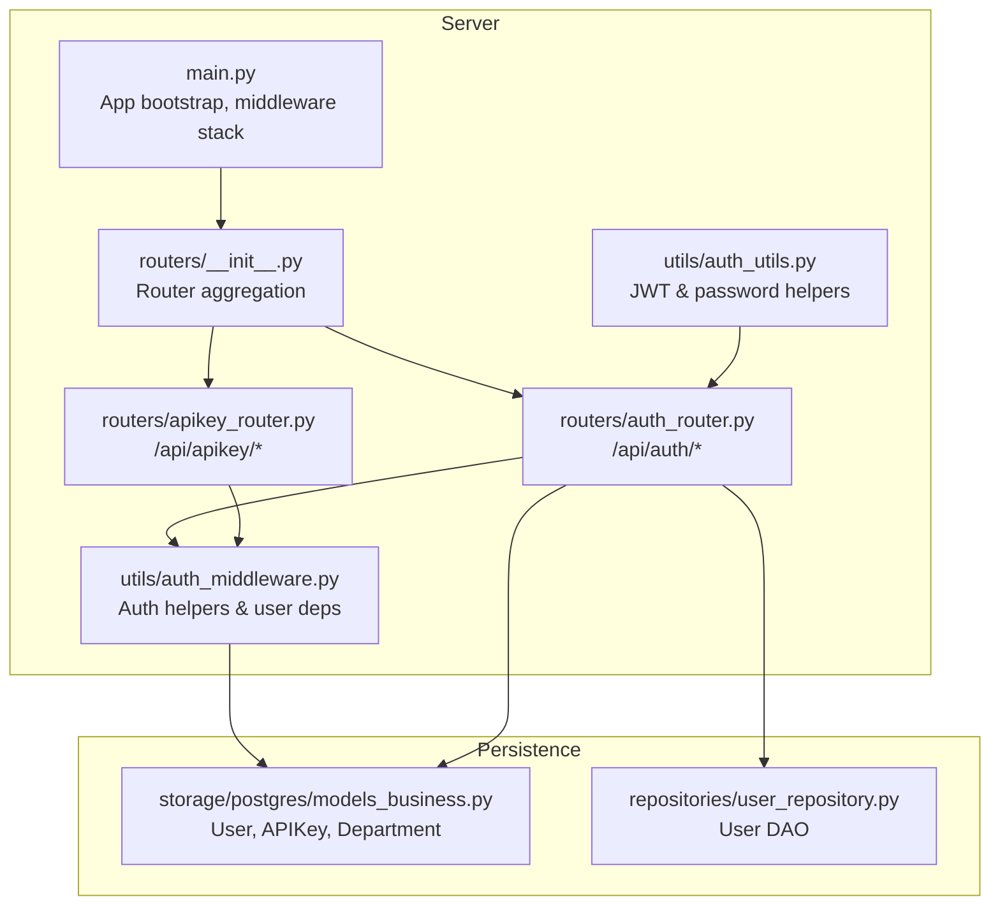
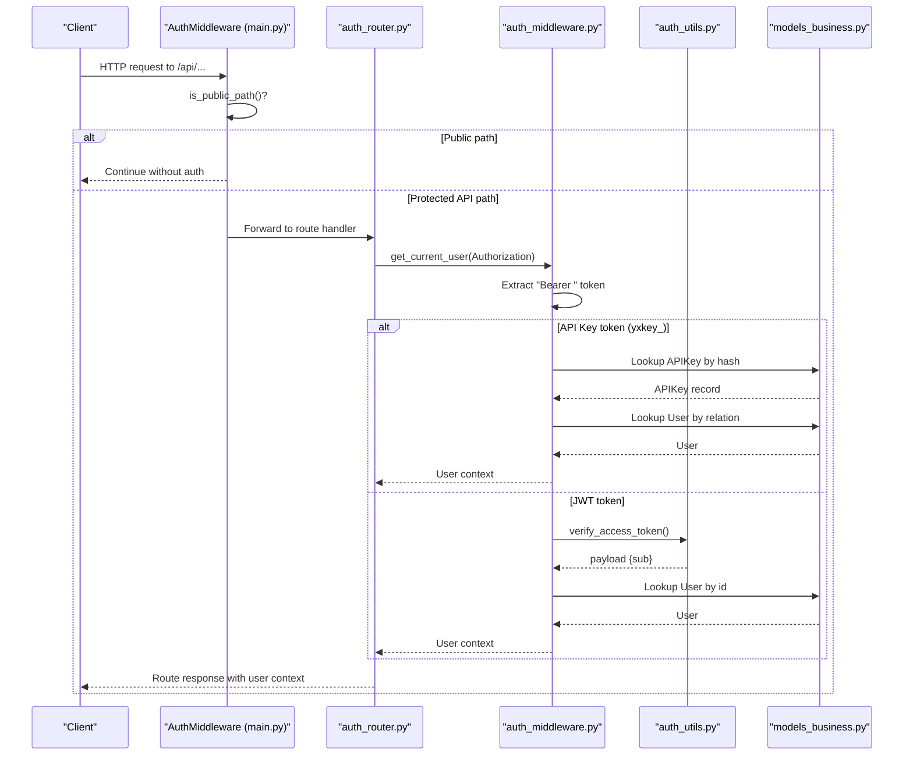
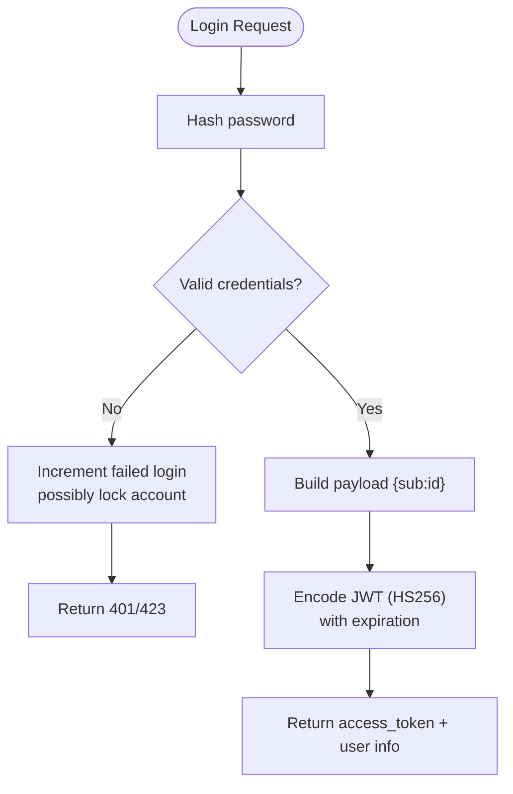
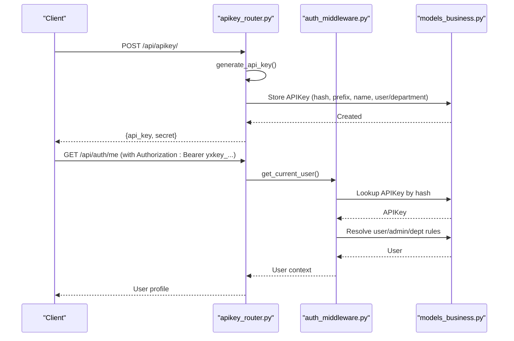
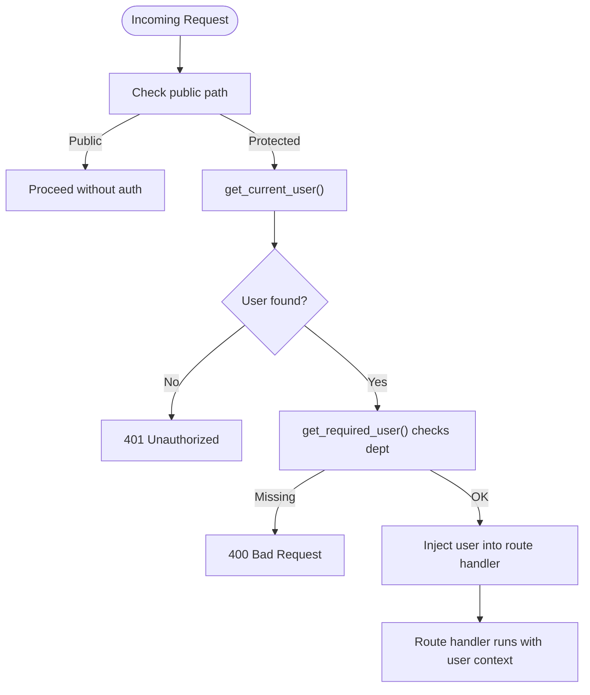
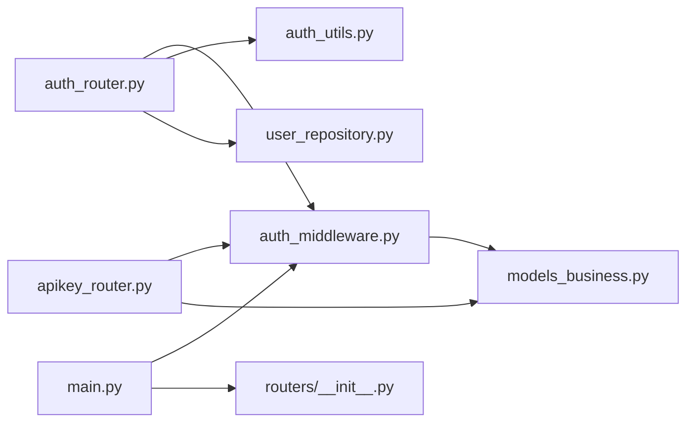

# Authentication Middleware

<cite>
**Referenced Files in This Document**
- [auth_middleware.py](file://backend/server/utils/auth_middleware.py)
- [auth_utils.py](file://backend/server/utils/auth_utils.py)
- [auth_router.py](file://backend/server/routers/auth_router.py)
- [apikey_router.py](file://backend/server/routers/apikey_router.py)
- [main.py](file://backend/server/main.py)
- [models_business.py](file://backend/package/yuxi/storage/postgres/models_business.py)
- [user_repository.py](file://backend/package/yuxi/repositories/user_repository.py)
- [__init__.py](file://backend/server/routers/__init__.py)
- [test_auth_router.py](file://backend/test/integration/api/test_auth_router.py)
- [test_auth_utils.py](file://backend/test/unit/test_auth_utils.py)
</cite>

## Table of Contents
1. [Introduction](#introduction)
2. [Project Structure](#project-structure)
3. [Core Components](#core-components)
4. [Architecture Overview](#architecture-overview)
5. [Detailed Component Analysis](#detailed-component-analysis)
6. [Dependency Analysis](#dependency-analysis)
7. [Performance Considerations](#performance-considerations)
8. [Troubleshooting Guide](#troubleshooting-guide)
9. [Conclusion](#conclusion)

## Introduction
This document describes the authentication middleware system in Yuxi, focusing on JWT token handling, API key authentication, session-like user state propagation, and middleware configuration. It explains how tokens are extracted from Authorization headers, validated against JWT or API keys, and how user context is injected into request handlers. It also covers secure key management practices, rate limiting for login attempts, and integration points with user repositories and authorization roles.

## Project Structure
The authentication system spans several modules:
- Middleware and utilities: extract and validate tokens, enforce public paths, and inject user context
- Routers: expose authentication endpoints and API key management
- Models and repositories: define user and API key data structures and provide CRUD operations
- Application bootstrap: register routers and middleware globally

**Diagram sources**
- [main.py:40-137](file://backend/server/main.py#L40-L137)
- [__init__.py:20-49](file://backend/server/routers/__init__.py#L20-L49)
- [auth_router.py:29-829](file://backend/server/routers/auth_router.py#L29-L829)
- [apikey_router.py:16-259](file://backend/server/routers/apikey_router.py#L16-L259)
- [auth_middleware.py:15-169](file://backend/server/utils/auth_middleware.py#L15-L169)
- [auth_utils.py:20-81](file://backend/server/utils/auth_utils.py#L20-L81)
- [models_business.py:51-706](file://backend/package/yuxi/storage/postgres/models_business.py#L51-L706)
- [user_repository.py:16-148](file://backend/package/yuxi/repositories/user_repository.py#L16-L148)

**Section sources**
- [main.py:40-137](file://backend/server/main.py#L40-L137)
- [__init__.py:20-49](file://backend/server/routers/__init__.py#L20-L49)

## Core Components
- Token extraction and routing:
  - Public paths bypass authentication
  - Non-API paths are passed through
  - API paths are handled by dependency injection that extracts Authorization headers and validates tokens
- JWT handling:
  - Creation of access tokens with expiration
  - Decoding and verification with HS256
  - Error handling for expired or invalid tokens
- API key authentication:
  - API keys are prefixed and hashed before storage
  - Validation checks enabled state, expiration, and associated user/admin constraints
- User context injection:
  - get_current_user resolves the current user from either JWT or API key
  - get_required_user enforces logged-in state and department binding
  - Role-based dependencies enforce admin/superadmin access

**Section sources**
- [auth_middleware.py:15-169](file://backend/server/utils/auth_middleware.py#L15-L169)
- [auth_utils.py:20-81](file://backend/server/utils/auth_utils.py#L20-L81)
- [auth_router.py:115-207](file://backend/server/routers/auth_router.py#L115-L207)
- [apikey_router.py:19-31](file://backend/server/routers/apikey_router.py#L19-L31)

## Architecture Overview
The authentication flow integrates middleware, routers, and utilities to provide a cohesive security layer.

**Diagram sources**
- [main.py:100-129](file://backend/server/main.py#L100-L129)
- [auth_middleware.py:74-123](file://backend/server/utils/auth_middleware.py#L74-L123)
- [auth_utils.py:72-81](file://backend/server/utils/auth_utils.py#L72-L81)
- [auth_router.py:115-207](file://backend/server/routers/auth_router.py#L115-L207)
- [models_business.py:51-706](file://backend/package/yuxi/storage/postgres/models_business.py#L51-L706)

## Detailed Component Analysis

### JWT Token Handling
- Token creation:
  - Payload augmented with expiration derived from environment or default
  - Encoded with HS256 algorithm
- Token validation:
  - Decodes and verifies signature
  - Distinguishes expired vs invalid token errors
- Refresh mechanism:
  - No explicit refresh endpoint is present in the analyzed code
  - Clients should re-authenticate via the token endpoint to obtain a new JWT

**Diagram sources**
- [auth_router.py:115-207](file://backend/server/routers/auth_router.py#L115-L207)
- [auth_utils.py:46-81](file://backend/server/utils/auth_utils.py#L46-L81)

**Section sources**
- [auth_utils.py:46-81](file://backend/server/utils/auth_utils.py#L46-L81)
- [auth_router.py:115-207](file://backend/server/routers/auth_router.py#L115-L207)

### API Key Authentication Workflow
- Key generation:
  - Random secret generated and stored as SHA-256 hash
  - Prefix shown to users; full secret only returned upon creation
- Validation:
  - Enabled flag and expiration checked
  - Association rules: user-bound, department admin-bound, or fallback to superadmin
  - Last-used timestamp updated on successful API usage
- Management:
  - Listing, creation, updating, deletion, and regeneration endpoints
  - Permissions enforced by role and ownership

**Diagram sources**
- [apikey_router.py:19-31](file://backend/server/routers/apikey_router.py#L19-L31)
- [apikey_router.py:100-149](file://backend/server/routers/apikey_router.py#L100-L149)
- [auth_middleware.py:35-101](file://backend/server/utils/auth_middleware.py#L35-L101)
- [models_business.py:618-663](file://backend/package/yuxi/storage/postgres/models_business.py#L618-L663)

**Section sources**
- [apikey_router.py:19-31](file://backend/server/routers/apikey_router.py#L19-L31)
- [apikey_router.py:100-149](file://backend/server/routers/apikey_router.py#L100-L149)
- [auth_middleware.py:35-101](file://backend/server/utils/auth_middleware.py#L35-L101)
- [models_business.py:618-663](file://backend/package/yuxi/storage/postgres/models_business.py#L618-L663)

### Session Management and User Context Injection
- Session-like state:
  - No server-side sessions; user identity is propagated via dependency injection
  - get_current_user returns a User object or None
  - get_required_user raises 401 if missing or 400 if department missing
  - Role-based dependencies enforce admin/superadmin access
- Public paths:
  - Explicitly whitelisted to bypass authentication
- Rate limiting:
  - Login attempts throttled per IP for the token endpoint

**Diagram sources**
- [auth_middleware.py:16-169](file://backend/server/utils/auth_middleware.py#L16-L169)
- [auth_middleware.py:74-139](file://backend/server/utils/auth_middleware.py#L74-L139)
- [main.py:100-129](file://backend/server/main.py#L100-L129)

**Section sources**
- [auth_middleware.py:16-169](file://backend/server/utils/auth_middleware.py#L16-L169)
- [auth_middleware.py:74-139](file://backend/server/utils/auth_middleware.py#L74-L139)
- [main.py:100-129](file://backend/server/main.py#L100-L129)

### Secure Key Management Practices
- Secrets are handled carefully:
  - Full secret is returned only once during creation
  - Storage uses SHA-256 hashes; prefixes exposed for UX
  - Regeneration replaces the stored hash and prefix
- Operational hygiene:
  - Expiration controls for API keys
  - Enabled flag toggles validity
  - Last-used timestamps help track usage

**Section sources**
- [apikey_router.py:19-31](file://backend/server/routers/apikey_router.py#L19-L31)
- [apikey_router.py:229-258](file://backend/server/routers/apikey_router.py#L229-L258)
- [models_business.py:618-663](file://backend/package/yuxi/storage/postgres/models_business.py#L618-L663)

### Authentication Middleware Configuration and Token Extraction
- Global middleware stack:
  - Access log middleware
  - Login rate limit middleware (endpoint-specific)
  - Auth middleware (placeholder for future enforcement)
- Token extraction:
  - Authorization header expected in "Bearer ..." format
  - API key tokens identified by "yxkey_" prefix
  - JWT tokens processed via AuthUtils.verify_access_token()

**Section sources**
- [main.py:40-137](file://backend/server/main.py#L40-L137)
- [auth_middleware.py:74-123](file://backend/server/utils/auth_middleware.py#L74-L123)

### Practical Authentication Flows and Patterns
- Standard login flow:
  - Submit credentials to the token endpoint
  - Receive JWT access_token and user info
  - Use Authorization: Bearer <token> for protected requests
- API key flow:
  - Create API key via API; receive secret once
  - Use Authorization: Bearer yxkey_<secret> for protected requests
- Error handling patterns:
  - Invalid or missing credentials: 401 Unauthorized
  - Locked accounts: 423 Locked with X-Lock-Remaining header
  - Invalid tokens: 401 Unauthorized with specific detail

**Section sources**
- [auth_router.py:115-207](file://backend/server/routers/auth_router.py#L115-L207)
- [test_auth_router.py:14-39](file://backend/test/integration/api/test_auth_router.py#L14-L39)

### Integration with User Repositories
- UserRepository provides:
  - Lookup by id, user_id, phone
  - Listing with department joins
  - Counting and existence checks
- Used by routers for:
  - Profile updates
  - User management (admin/superadmin)
  - Soft deletion and auditing

**Section sources**
- [user_repository.py:16-148](file://backend/package/yuxi/repositories/user_repository.py#L16-L148)
- [auth_router.py:299-371](file://backend/server/routers/auth_router.py#L299-L371)

### Relationship Between Authentication and Authorization
- Roles:
  - user, admin, superadmin
- Enforced via dependency:
  - get_required_user: ensures login and department presence
  - get_admin_user/get_superadmin_user: enforce role gates
- Department isolation:
  - Admins operate within own department unless superadmin
  - Department admin count checks prevent orphaning departments

**Section sources**
- [auth_middleware.py:126-159](file://backend/server/utils/auth_middleware.py#L126-L159)
- [auth_router.py:474-496](file://backend/server/routers/auth_router.py#L474-L496)
- [auth_router.py:524-619](file://backend/server/routers/auth_router.py#L524-L619)

## Dependency Analysis

**Diagram sources**
- [auth_router.py:15-25](file://backend/server/routers/auth_router.py#L15-L25)
- [apikey_router.py:12-13](file://backend/server/routers/apikey_router.py#L12-L13)
- [auth_middleware.py:10-13](file://backend/server/utils/auth_middleware.py#L10-L13)
- [main.py:40-42](file://backend/server/main.py#L40-L42)
- [__init__.py:5-15](file://backend/server/routers/__init__.py#L5-L15)

**Section sources**
- [auth_router.py:15-25](file://backend/server/routers/auth_router.py#L15-L25)
- [apikey_router.py:12-13](file://backend/server/routers/apikey_router.py#L12-L13)
- [auth_middleware.py:10-13](file://backend/server/utils/auth_middleware.py#L10-L13)
- [main.py:40-42](file://backend/server/main.py#L40-L42)
- [__init__.py:5-15](file://backend/server/routers/__init__.py#L5-L15)

## Performance Considerations
- Token verification is lightweight; avoid unnecessary decoding by ensuring early exit for malformed Authorization headers
- API key lookup performs hashing and database queries; cache frequently accessed keys at the application level if needed
- Rate limiting reduces brute-force login attempts and protects the token endpoint

## Troubleshooting Guide
- Invalid or expired JWT:
  - Ensure the token is signed with the configured secret and algorithm
  - Confirm expiration is within limits
- Invalid API key:
  - Verify the key starts with the expected prefix and matches stored hash
  - Check enabled flag and expiration
- Locked account:
  - Observe X-Lock-Remaining header and wait for unlock
- Missing department:
  - Ensure the user belongs to a department; otherwise, get_required_user returns 400

**Section sources**
- [auth_utils.py:72-81](file://backend/server/utils/auth_utils.py#L72-L81)
- [auth_middleware.py:35-101](file://backend/server/utils/auth_middleware.py#L35-L101)
- [test_auth_router.py:20-39](file://backend/test/integration/api/test_auth_router.py#L20-L39)

## Conclusion
Yuxi’s authentication middleware provides a robust, layered approach combining JWT and API key authentication, strict role-based access control, and operational safeguards like rate limiting and login locking. The design favors stateless, dependency-injected user contexts, simplifying scalability and integration with downstream routers and repositories.