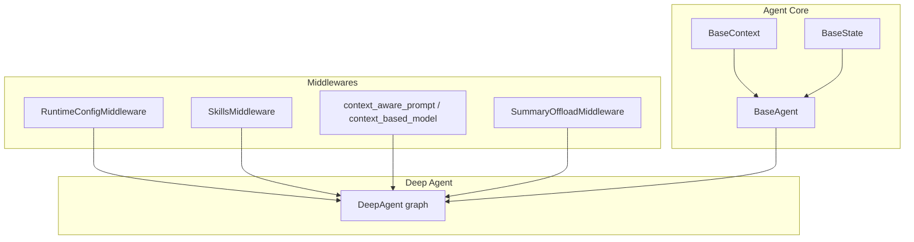
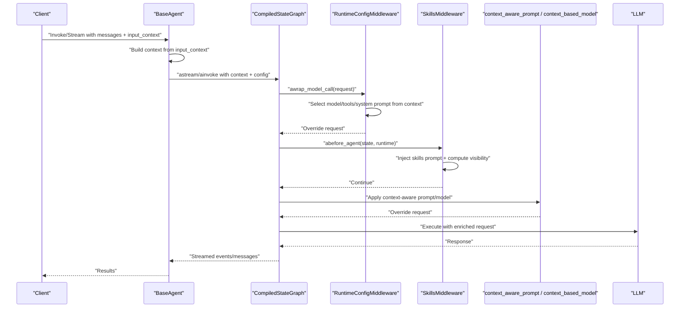
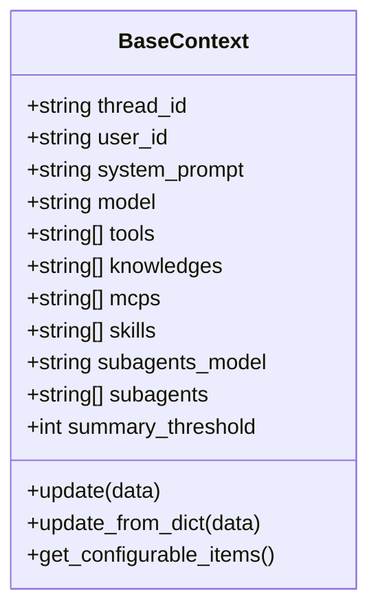
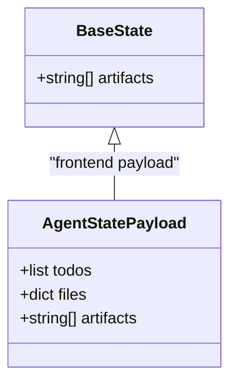
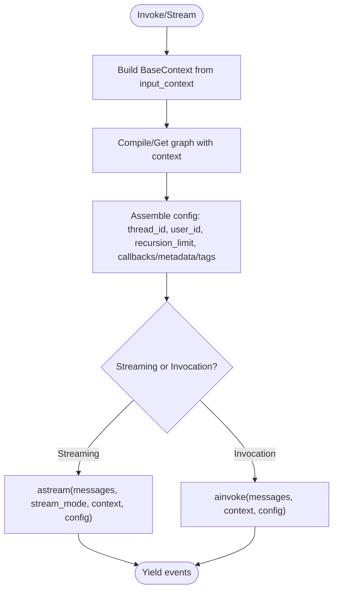
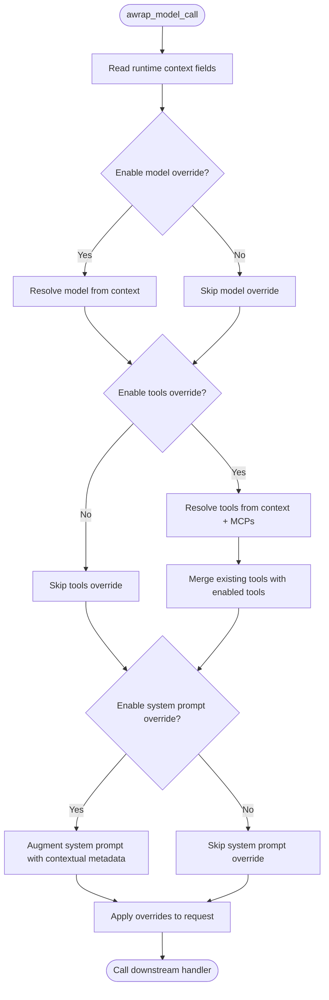
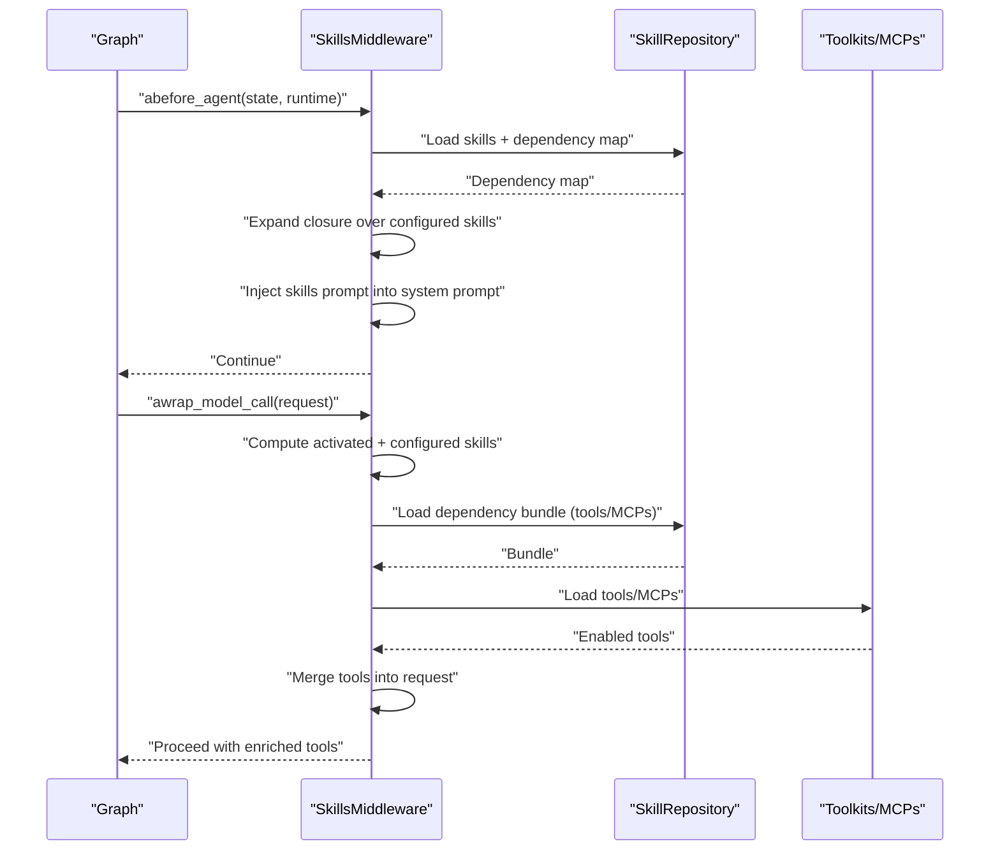
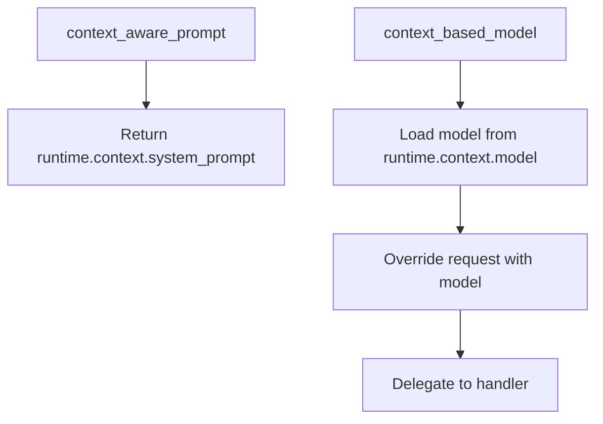
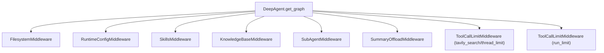
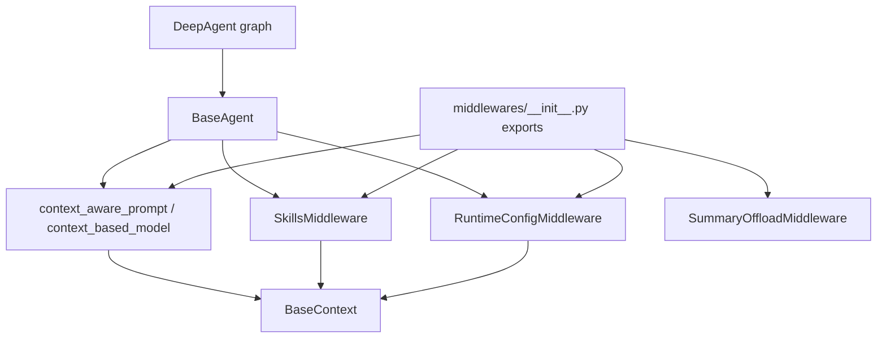

# Context Processing Middleware

<cite>
**Referenced Files in This Document**
- [context_middlewares.py](file://backend/package/yuxi/agents/middlewares/context_middlewares.py)
- [runtime_config_middleware.py](file://backend/package/yuxi/agents/middlewares/runtime_config_middleware.py)
- [skills_middleware.py](file://backend/package/yuxi/agents/middlewares/skills_middleware.py)
- [__init__.py](file://backend/package/yuxi/agents/middlewares/__init__.py)
- [context.py](file://backend/package/yuxi/agents/context.py)
- [state.py](file://backend/package/yuxi/agents/state.py)
- [base.py](file://backend/package/yuxi/agents/base.py)
- [graph.py](file://backend/package/yuxi/agents/buildin/deep_agent/graph.py)
</cite>

## Table of Contents
1. [Introduction](#introduction)
2. [Project Structure](#project-structure)
3. [Core Components](#core-components)
4. [Architecture Overview](#architecture-overview)
5. [Detailed Component Analysis](#detailed-component-analysis)
6. [Dependency Analysis](#dependency-analysis)
7. [Performance Considerations](#performance-considerations)
8. [Troubleshooting Guide](#troubleshooting-guide)
9. [Conclusion](#conclusion)

## Introduction
This document explains the context processing middleware system used to prepare agent execution contexts, manage conversation history, and maintain session state. It covers request/response transformation patterns, data enrichment, context building, state management, and integration with agent state management, conversation repositories, and context builders. It also documents middleware execution order, dependency relationships, performance considerations, memory management for large contexts, debugging strategies, and examples of context processing pipelines and custom transformations.

## Project Structure
The context processing middleware system spans several modules:
- Middlewares: runtime configuration, skills, context-aware prompt/model selection, and summary offloading
- Agent base and state: graph orchestration, streaming, invocation, and state schemas
- Context builder: typed configuration for agent behavior and resources
- Deep Agent graph: demonstrates middleware composition and context-driven orchestration

**Diagram sources**
- [runtime_config_middleware.py:16-162](file://backend/package/yuxi/agents/middlewares/runtime_config_middleware.py#L16-L162)
- [skills_middleware.py:145-477](file://backend/package/yuxi/agents/middlewares/skills_middleware.py#L145-L477)
- [context_middlewares.py:11-26](file://backend/package/yuxi/agents/middlewares/context_middlewares.py#L11-L26)
- [base.py:17-263](file://backend/package/yuxi/agents/base.py#L17-L263)
- [state.py:19-31](file://backend/package/yuxi/agents/state.py#L19-L31)
- [context.py:11-191](file://backend/package/yuxi/agents/context.py#L11-L191)
- [graph.py:27-124](file://backend/package/yuxi/agents/buildin/deep_agent/graph.py#L27-L124)

**Section sources**
- [__init__.py:1-17](file://backend/package/yuxi/agents/middlewares/__init__.py#L1-L17)
- [base.py:17-263](file://backend/package/yuxi/agents/base.py#L17-L263)
- [context.py:11-191](file://backend/package/yuxi/agents/context.py#L11-L191)
- [state.py:19-31](file://backend/package/yuxi/agents/state.py#L19-L31)
- [graph.py:27-124](file://backend/package/yuxi/agents/buildin/deep_agent/graph.py#L27-L124)

## Core Components
- BaseContext: Typed configuration for agent behavior, including identifiers, system prompt, model selection, tools, knowledge bases, MCP servers, skills, subagents, and summary thresholds. Provides helpers to extract configurable items and metadata for UI rendering.
- BaseState: Shared state fields for agents, including artifacts with a merge reducer to preserve order and deduplicate file paths.
- BaseAgent: Orchestrates graph compilation, streaming, invocation, and history retrieval. Manages checkpointer selection (SQLite, Postgres, or in-memory) and thread/user IDs for session state.
- RuntimeConfigMiddleware: Applies runtime overrides for model, tools, and system prompt from context, merges tools, and augments system prompt with contextual metadata.
- SkillsMiddleware: Injects skills prompts, expands dependencies, dynamically loads tools and MCPs, and supports dynamic skill activation via tool call results.
- context_aware_prompt and context_based_model: Context-aware prompt injection and model selection based on runtime context.
- DeepAgent graph: Demonstrates middleware composition, including filesystem and subagent middleware, tool call limits, and summary offloading.

**Section sources**
- [context.py:11-191](file://backend/package/yuxi/agents/context.py#L11-L191)
- [state.py:19-31](file://backend/package/yuxi/agents/state.py#L19-L31)
- [base.py:17-263](file://backend/package/yuxi/agents/base.py#L17-L263)
- [runtime_config_middleware.py:16-162](file://backend/package/yuxi/agents/middlewares/runtime_config_middleware.py#L16-L162)
- [skills_middleware.py:145-477](file://backend/package/yuxi/agents/middlewares/skills_middleware.py#L145-L477)
- [context_middlewares.py:11-26](file://backend/package/yuxi/agents/middlewares/context_middlewares.py#L11-L26)
- [graph.py:27-124](file://backend/package/yuxi/agents/buildin/deep_agent/graph.py#L27-L124)

## Architecture Overview
The context processing pipeline integrates middleware layers around agent execution to enrich requests with runtime context, select appropriate models and tools, and maintain state across conversations.

**Diagram sources**
- [base.py:64-150](file://backend/package/yuxi/agents/base.py#L64-L150)
- [runtime_config_middleware.py:75-117](file://backend/package/yuxi/agents/middlewares/runtime_config_middleware.py#L75-L117)
- [skills_middleware.py:175-214](file://backend/package/yuxi/agents/middlewares/skills_middleware.py#L175-L214)
- [context_middlewares.py:11-26](file://backend/package/yuxi/agents/middlewares/context_middlewares.py#L11-L26)

## Detailed Component Analysis

### Context Builder: BaseContext
- Purpose: Centralized, typed configuration for agent behavior and resources.
- Key fields:
  - Identifiers: thread_id, user_id
  - Behavior: system_prompt, model, subagents_model
  - Capabilities: tools, knowledges, mcps, skills, subagents
  - Controls: summary_threshold
- Utilities:
  - get_configurable_items: introspects fields and metadata for UI exposure
  - update/update_from_dict: mutable updates from runtime inputs
  - Template metadata extraction for prompt/tool/LLM/knowledge/MCP/skill kinds

**Diagram sources**
- [context.py:11-191](file://backend/package/yuxi/agents/context.py#L11-L191)

**Section sources**
- [context.py:11-191](file://backend/package/yuxi/agents/context.py#L11-L191)

### State Management: BaseState and Reducers
- BaseState extends AgentState with artifacts annotated with a merge reducer to preserve order and remove duplicates.
- AgentStatePayload defines serialized state consumed by the frontend.

**Diagram sources**
- [state.py:19-31](file://backend/package/yuxi/agents/state.py#L19-L31)

**Section sources**
- [state.py:19-31](file://backend/package/yuxi/agents/state.py#L19-L31)

### Agent Orchestration: BaseAgent
- Responsibilities:
  - Build context from input_context
  - Stream and invoke graph with context and configuration
  - Manage checkpointer selection (SQLite, Postgres, in-memory)
  - Retrieve conversation history via checkpointer
- Streaming modes:
  - values, messages, and combined modes supported
- Configuration keys:
  - thread_id, user_id
  - recursion limits and optional callbacks/metadata/tags

**Diagram sources**
- [base.py:64-150](file://backend/package/yuxi/agents/base.py#L64-L150)

**Section sources**
- [base.py:64-150](file://backend/package/yuxi/agents/base.py#L64-L150)

### Runtime Configuration Middleware
- Purpose: Apply runtime overrides for model, tools, and system prompt from context.
- Features:
  - Optional model override
  - Tool merging: retain existing tools, keep non-managed tools, and add enabled tools from context
  - System prompt augmentation with contextual metadata
  - Customizable context field names for different scenarios
- Tool resolution:
  - From context.tools and context.mcps
  - Parallel loading of MCP tools with error handling

**Diagram sources**
- [runtime_config_middleware.py:75-117](file://backend/package/yuxi/agents/middlewares/runtime_config_middleware.py#L75-L117)

**Section sources**
- [runtime_config_middleware.py:16-162](file://backend/package/yuxi/agents/middlewares/runtime_config_middleware.py#L16-L162)

### Skills Middleware
- Purpose: Inject skills prompts, expand dependencies, and dynamically activate skills during execution.
- Phases:
  - abefore_agent: inject skills prompt and compute visible skills closure
  - awrap_model_call: compute activated skills, build dependency bundle, load tools/MCPs, and merge into request
  - awrap_tool_call: detect dynamic skill activation via tool call results and update state/command
- Dependency expansion:
  - DFS over dependency map to compute closure
  - Deduplication and cycle detection
- Dynamic activation:
  - Reads file path from tool call args
  - Validates slug against visible skills
  - Updates state/command with activated_skills

**Diagram sources**
- [skills_middleware.py:175-271](file://backend/package/yuxi/agents/middlewares/skills_middleware.py#L175-L271)

**Section sources**
- [skills_middleware.py:145-477](file://backend/package/yuxi/agents/middlewares/skills_middleware.py#L145-L477)

### Context-Aware Prompt and Model Middleware
- context_aware_prompt: Extracts system_prompt from runtime context for dynamic prompt injection.
- context_based_model: Selects model from runtime context and overrides the request with the resolved model.

**Diagram sources**
- [context_middlewares.py:11-26](file://backend/package/yuxi/agents/middlewares/context_middlewares.py#L11-L26)

**Section sources**
- [context_middlewares.py:11-26](file://backend/package/yuxi/agents/middlewares/context_middlewares.py#L11-L26)

### Deep Agent Graph Composition
- Demonstrates middleware composition for a specialized agent:
  - Filesystem and patch tool calls middleware
  - RuntimeConfigMiddleware (extra tools from MCP)
  - SkillsMiddleware
  - KnowledgeBaseMiddleware
  - SubAgentMiddleware with defaults and tool call limits
  - SummaryOffloadMiddleware for context compression
  - Tool call limits to prevent runaway loops

**Diagram sources**
- [graph.py:94-121](file://backend/package/yuxi/agents/buildin/deep_agent/graph.py#L94-L121)

**Section sources**
- [graph.py:27-124](file://backend/package/yuxi/agents/buildin/deep_agent/graph.py#L27-L124)

## Dependency Analysis
- Middlewares export:
  - RuntimeConfigMiddleware, SkillsMiddleware, SummaryOffloadMiddleware, context_aware_prompt, context_based_model, and attachment helpers
- Dependencies:
  - RuntimeConfigMiddleware depends on toolkits and MCP service for tool resolution
  - SkillsMiddleware depends on repository/service layers for skills metadata and dependency map
  - Context-aware middlewares depend on BaseContext for runtime context fields
  - BaseAgent orchestrates middleware usage and manages checkpointer/session state

**Diagram sources**
- [__init__.py:1-17](file://backend/package/yuxi/agents/middlewares/__init__.py#L1-L17)
- [runtime_config_middleware.py:63-74](file://backend/package/yuxi/agents/middlewares/runtime_config_middleware.py#L63-L74)
- [skills_middleware.py:156-173](file://backend/package/yuxi/agents/middlewares/skills_middleware.py#L156-L173)
- [context_middlewares.py:11-26](file://backend/package/yuxi/agents/middlewares/context_middlewares.py#L11-L26)
- [base.py:64-150](file://backend/package/yuxi/agents/base.py#L64-L150)
- [graph.py:94-121](file://backend/package/yuxi/agents/buildin/deep_agent/graph.py#L94-L121)

**Section sources**
- [__init__.py:1-17](file://backend/package/yuxi/agents/middlewares/__init__.py#L1-L17)
- [runtime_config_middleware.py:16-162](file://backend/package/yuxi/agents/middlewares/runtime_config_middleware.py#L16-L162)
- [skills_middleware.py:145-477](file://backend/package/yuxi/agents/middlewares/skills_middleware.py#L145-L477)
- [context_middlewares.py:11-26](file://backend/package/yuxi/agents/middlewares/context_middlewares.py#L11-L26)
- [base.py:64-150](file://backend/package/yuxi/agents/base.py#L64-L150)
- [graph.py:27-124](file://backend/package/yuxi/agents/buildin/deep_agent/graph.py#L27-L124)

## Performance Considerations
- Context building
  - Prefer lazy loading for MCP tools and skills dependencies to avoid blocking the request path.
  - Cache dependency maps and prompt metadata to reduce repeated database queries.
- Memory management for large contexts
  - Use SummaryOffloadMiddleware to compress long histories when exceeding threshold.
  - Limit tool call rounds and thread/tool usage to prevent unbounded growth.
- Model and tool selection
  - Defer model instantiation until needed; reuse resolved models when possible.
  - Merge tools efficiently to avoid duplication and minimize overhead.
- Streaming vs. invocation
  - Use streaming modes for incremental feedback and early termination.
  - For invocation, ensure recursion limits are tuned to prevent deep stacks.

## Troubleshooting Guide
- Context not applied
  - Verify input_context is passed to BaseAgent and BaseContext.update_from_dict is invoked.
  - Confirm runtime context fields match middleware expectations (e.g., model, tools, system_prompt).
- Skills not injected or activated
  - Ensure SkillsMiddleware is included and abefore_agent runs before model call.
  - Check dependency map availability and slug validity; inspect activated_skills propagation.
- Tool resolution failures
  - Review RuntimeConfigMiddleware logs for skipped tools and MCP servers.
  - Validate tool names and MCP server configurations.
- History retrieval issues
  - Confirm checkpointer is configured and thread_id/user_id match stored state.
  - Inspect BaseAgent.get_history for exceptions and fallback behavior.

**Section sources**
- [runtime_config_middleware.py:66-74](file://backend/package/yuxi/agents/middlewares/runtime_config_middleware.py#L66-L74)
- [skills_middleware.py:175-214](file://backend/package/yuxi/agents/middlewares/skills_middleware.py#L175-L214)
- [base.py:158-184](file://backend/package/yuxi/agents/base.py#L158-L184)

## Conclusion
The context processing middleware system provides a robust framework for building agent execution contexts, enriching requests with runtime configuration, dynamically selecting models and tools, injecting skills prompts, and maintaining session state. By composing middlewares around BaseAgent orchestration and leveraging BaseContext/BaseState, applications can implement flexible, scalable, and debuggable context pipelines tailored to complex conversational and multi-agent workflows.