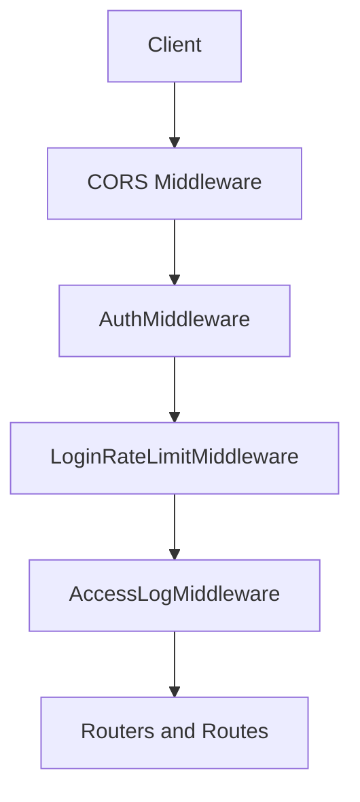
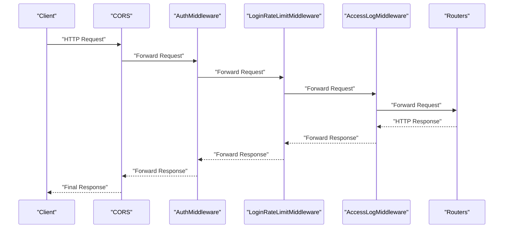
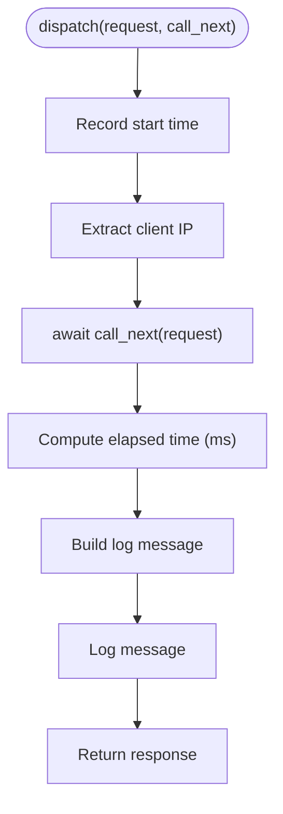
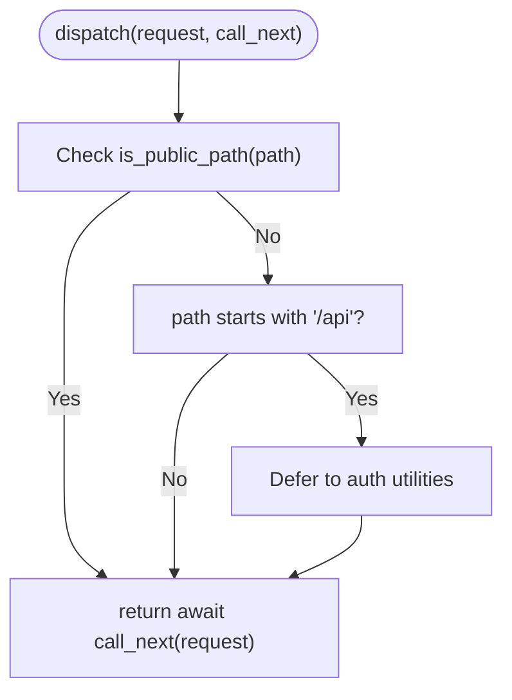
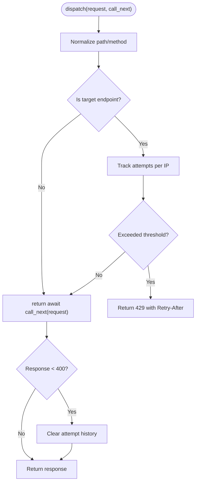
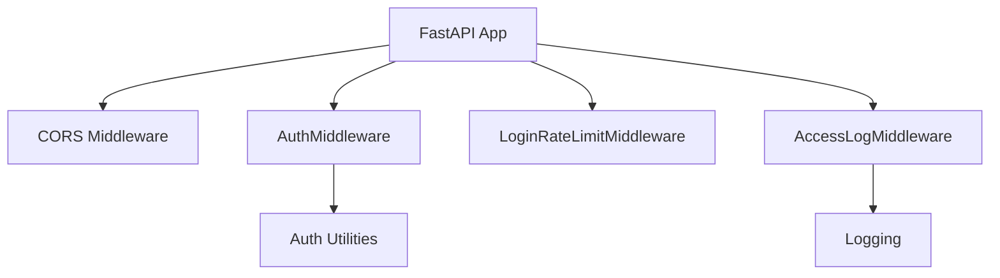

# Custom Middleware Development

<cite>
**Referenced Files in This Document**
- [AccessLogMiddleware](file://backend/server/utils/access_log_middleware.py)
- [AuthMiddleware](file://backend/server/main.py)
- [LoginRateLimitMiddleware](file://backend/server/main.py)
- [Access Log Middleware Implementation](file://backend/server/utils/access_log_middleware.py)
- [Auth Middleware Implementation](file://backend/server/utils/auth_middleware.py)
- [Server Main Application](file://backend/server/main.py)
</cite>

## Table of Contents
1. [Introduction](#introduction)
2. [Project Structure](#project-structure)
3. [Core Components](#core-components)
4. [Architecture Overview](#architecture-overview)
5. [Detailed Component Analysis](#detailed-component-analysis)
6. [Dependency Analysis](#dependency-analysis)
7. [Performance Considerations](#performance-considerations)
8. [Troubleshooting Guide](#troubleshooting-guide)
9. [Conclusion](#conclusion)
10. [Appendices](#appendices)

## Introduction
This document explains how to develop custom middleware in Yuxi, focusing on the server-side FastAPI middleware stack. It covers the middleware base class, interface requirements, registration patterns, lifecycle phases, priority and execution order, conflict resolution, advanced patterns (conditional processing, asynchronous operations, error propagation), testing strategies, integration with existing middleware chains, composition patterns, reusable components, performance optimization, debugging approaches, and common pitfalls.

Yuxi uses FastAPI with Starlette’s BaseHTTPMiddleware as the foundation for middleware. The server application demonstrates three primary middleware categories:
- Access logging middleware
- Authentication and authorization middleware
- Rate limiting middleware

These are registered in a specific order to define the middleware chain’s priority and behavior.

## Project Structure
The middleware ecosystem centers around the server application and utility modules:
- Server main application registers middleware and routes.
- Utility modules provide reusable middleware implementations.
- Authentication utilities support middleware logic.

**Diagram sources**
- [Server Main Application:44-137](file://backend/server/main.py#L44-L137)
- [Access Log Middleware Implementation:34-67](file://backend/server/utils/access_log_middleware.py#L34-L67)

**Section sources**
- [Server Main Application:40-137](file://backend/server/main.py#L40-L137)

## Core Components
This section outlines the middleware base class, interface requirements, and registration patterns used in Yuxi.

- Base class and interface
  - All middleware inherit from Starlette’s BaseHTTPMiddleware and implement an async dispatch method that accepts a Request and a callable call_next. The dispatch method controls the request lifecycle and response handling.
  - Reference: [AccessLogMiddleware.dispatch:41-67](file://backend/server/utils/access_log_middleware.py#L41-L67), [AuthMiddleware.dispatch:100-129](file://backend/server/main.py#L100-L129), [LoginRateLimitMiddleware.dispatch:63-96](file://backend/server/main.py#L63-L96)

- Registration patterns
  - Middleware is registered via app.add_middleware(MiddlewareClass) in the server application. The order of registration determines the execution order: earlier registrations wrap later ones.
  - Reference: [CORS registration:44-51](file://backend/server/main.py#L44-L51), [AccessLog registration](file://backend/server/main.py#L133), [Login rate limit registration](file://backend/server/main.py#L136), [Auth registration](file://backend/server/main.py#L137)

- Lifecycle phases
  - Initialization: Middleware constructor runs once per application startup.
  - Request processing: dispatch executes before the route handler.
  - Response modification: dispatch can modify the response before returning it.
  - Cleanup: No explicit cleanup hook is shown; use lifespan events for resource management if needed.
  - Reference: [AccessLogMiddleware.dispatch:41-67](file://backend/server/utils/access_log_middleware.py#L41-L67), [AuthMiddleware.dispatch:100-129](file://backend/server/main.py#L100-L129), [LoginRateLimitMiddleware.dispatch:63-96](file://backend/server/main.py#L63-L96)

- Priority and execution order
  - The server registers middleware in this order: CORS → AuthMiddleware → LoginRateLimitMiddleware → AccessLogMiddleware. This defines the chain priority from outermost to innermost.
  - Reference: [Registration order:133-137](file://backend/server/main.py#L133-L137)

- Conflict resolution mechanisms
  - Public path bypass: AuthMiddleware checks for public paths and skips authentication for those routes.
  - Reference: [Public path check:105-107](file://backend/server/main.py#L105-L107), [Auth utility:162-168](file://backend/server/utils/auth_middleware.py#L162-L168)

**Section sources**
- [Access Log Middleware Implementation:34-67](file://backend/server/utils/access_log_middleware.py#L34-L67)
- [Auth Middleware Implementation:16-168](file://backend/server/utils/auth_middleware.py#L16-L168)
- [Server Main Application:44-137](file://backend/server/main.py#L44-L137)

## Architecture Overview
The middleware architecture follows a layered pipeline:
- Outermost middleware runs first and can short-circuit or transform requests/responses.
- Innermost middleware reaches the route handlers.
- Responses travel back through the chain in reverse order.

**Diagram sources**
- [Server Main Application:44-137](file://backend/server/main.py#L44-L137)
- [Access Log Middleware Implementation:41-67](file://backend/server/utils/access_log_middleware.py#L41-L67)

## Detailed Component Analysis

### AccessLogMiddleware
Purpose: Logs request details including client IP, method, path, status code, and processing time.

Key behaviors:
- Extracts client IP from headers or request client.
- Measures processing time using perf_counter.
- Emits structured logs via a dedicated logger.
- Returns the response unchanged.

**Diagram sources**
- [AccessLogMiddleware.dispatch:41-67](file://backend/server/utils/access_log_middleware.py#L41-L67)

**Section sources**
- [Access Log Middleware Implementation:34-67](file://backend/server/utils/access_log_middleware.py#L34-L67)

### AuthMiddleware
Purpose: Enforces authentication for protected routes by checking public paths and delegating user retrieval to authentication utilities.

Key behaviors:
- Skips authentication for public paths.
- Allows non-API paths to pass through.
- Delegates user verification to authentication utilities.
- Continues the chain for authenticated requests.

**Diagram sources**
- [AuthMiddleware.dispatch:100-129](file://backend/server/main.py#L100-L129)
- [Auth utility:162-168](file://backend/server/utils/auth_middleware.py#L162-L168)

**Section sources**
- [Auth Middleware Implementation:16-168](file://backend/server/utils/auth_middleware.py#L16-L168)
- [Server Main Application:99-129](file://backend/server/main.py#L99-L129)

### LoginRateLimitMiddleware
Purpose: Applies rate limiting to specific endpoints (e.g., login) to mitigate brute-force attempts.

Key behaviors:
- Normalizes endpoint signatures (path + method).
- Tracks attempts per client IP in a sliding window.
- Returns a 429 response if limits are exceeded.
- Clears tracking on successful responses.

**Diagram sources**
- [LoginRateLimitMiddleware.dispatch:63-96](file://backend/server/main.py#L63-L96)

**Section sources**
- [Server Main Application:63-96](file://backend/server/main.py#L63-L96)

### Middleware Priority and Execution Order
- Registration order defines priority: CORS (outermost) → AuthMiddleware → LoginRateLimitMiddleware → AccessLogMiddleware (innermost).
- This ensures logging occurs after authentication and rate limiting, and that public paths bypass authentication checks efficiently.

**Section sources**
- [Server Main Application:44-137](file://backend/server/main.py#L44-L137)

### Advanced Patterns

#### Conditional Processing
- Public path bypass in AuthMiddleware prevents unnecessary authentication overhead for open endpoints.
- Reference: [AuthMiddleware.public path check:105-107](file://backend/server/main.py#L105-L107), [Auth utility public paths:18-26](file://backend/server/utils/auth_middleware.py#L18-L26)

#### Asynchronous Operations
- All middleware methods are async, enabling non-blocking I/O (e.g., database lookups, external service calls).
- Example: Authentication utilities perform async database queries.
- Reference: [Auth utilities async session:30-33](file://backend/server/utils/auth_middleware.py#L30-L33)

#### Error Propagation
- Middleware can short-circuit by returning early (e.g., 429 from rate limiter).
- Route handlers receive the request after middleware completion; errors raised in handlers propagate as FastAPI responses.
- Reference: [LoginRateLimitMiddleware 429:80-84](file://backend/server/main.py#L80-L84)

#### Composition Patterns
- Compose middleware by chaining them in the desired order.
- Use shared utilities (e.g., auth helpers) to reduce duplication.
- Reference: [Auth utility composition:74-123](file://backend/server/utils/auth_middleware.py#L74-L123)

#### Reusable Middleware Components
- AccessLogMiddleware encapsulates logging concerns and can be reused across applications.
- Reference: [AccessLogMiddleware class:34-67](file://backend/server/utils/access_log_middleware.py#L34-L67)

**Section sources**
- [Auth Middleware Implementation:18-123](file://backend/server/utils/auth_middleware.py#L18-L123)
- [Server Main Application:63-137](file://backend/server/main.py#L63-L137)
- [Access Log Middleware Implementation:34-67](file://backend/server/utils/access_log_middleware.py#L34-L67)

## Dependency Analysis
The middleware stack depends on FastAPI and Starlette for the BaseHTTPMiddleware base class and on shared authentication utilities.

**Diagram sources**
- [Server Main Application:44-137](file://backend/server/main.py#L44-L137)
- [Auth Middleware Implementation:16-168](file://backend/server/utils/auth_middleware.py#L16-L168)
- [Access Log Middleware Implementation:10-21](file://backend/server/utils/access_log_middleware.py#L10-L21)

**Section sources**
- [Server Main Application:44-137](file://backend/server/main.py#L44-L137)
- [Auth Middleware Implementation:16-168](file://backend/server/utils/auth_middleware.py#L16-L168)
- [Access Log Middleware Implementation:10-21](file://backend/server/utils/access_log_middleware.py#L10-L21)

## Performance Considerations
- Minimize synchronous work in middleware; leverage async I/O for database and external calls.
- Keep logging lightweight; avoid heavy formatting or disk writes inside hot paths.
- Use in-memory tracking for rate limiting with efficient data structures (deque) and locks.
- Prefer early exits for public paths to reduce downstream processing.
- Tune logging verbosity and avoid propagating logs to root handlers to prevent duplication.

## Troubleshooting Guide
Common issues and resolutions:
- Authentication bypasses
  - Symptom: Requests to protected endpoints succeed without tokens.
  - Cause: Non-API paths or public paths not properly matched.
  - Resolution: Verify public path patterns and path normalization.
  - References: [AuthMiddleware path checks:105-111](file://backend/server/main.py#L105-L111), [Public paths:18-26](file://backend/server/utils/auth_middleware.py#L18-L26)

- Rate limit false positives
  - Symptom: Legitimate users receive 429 Too Many Requests.
  - Cause: Aggressive thresholds or insufficient window size.
  - Resolution: Adjust RATE_LIMIT_MAX_ATTEMPTS and RATE_LIMIT_WINDOW_SECONDS.
  - References: [Rate limit constants:32-34](file://backend/server/main.py#L32-L34), [Dispatch logic:63-96](file://backend/server/main.py#L63-L96)

- Logging duplicates or missing entries
  - Symptom: Duplicate logs or missing access logs.
  - Cause: Logger propagation or middleware ordering issues.
  - Resolution: Disable propagate on access logger; ensure AccessLogMiddleware is placed appropriately.
  - References: [Logger setup:14-21](file://backend/server/utils/access_log_middleware.py#L14-L21), [Registration order](file://backend/server/main.py#L133)

- Windows async event loop issues
  - Symptom: psycopg async errors on Windows.
  - Cause: ProactorEventLoop incompatibility.
  - Resolution: Set WindowsSelectorEventLoopPolicy early in application startup.
  - References: [Event loop policy:9-12](file://backend/server/main.py#L9-L12)

**Section sources**
- [Auth Middleware Implementation:18-26](file://backend/server/utils/auth_middleware.py#L18-L26)
- [Server Main Application:32-12](file://backend/server/main.py#L32-L12)
- [Access Log Middleware Implementation:14-21](file://backend/server/utils/access_log_middleware.py#L14-L21)

## Conclusion
Yuxi’s middleware system is built on FastAPI and Starlette, with a clear registration order that defines priority and behavior. By leveraging BaseHTTPMiddleware, implementing async dispatch methods, and composing middleware thoughtfully, developers can build robust, maintainable middleware chains. Following the patterns demonstrated here—public path handling, rate limiting, logging, and authentication—will help ensure predictable performance, clear error propagation, and easy debugging.

## Appendices

### Step-by-Step: Creating a Custom Middleware
1. Define a new class inheriting from BaseHTTPMiddleware.
2. Implement an async dispatch method that:
   - Optionally inspects the request.
   - Calls call_next(request) to continue the chain.
   - Optionally modifies the response before returning.
3. Register the middleware in the server application using app.add_middleware(MiddlewareClass).
4. Place the middleware in the appropriate position in the chain to achieve the desired priority.
5. Test the middleware with various scenarios (public/private paths, rate-limited endpoints, logged requests).
6. Integrate with shared utilities (e.g., auth helpers) to reuse logic.
7. Optimize for performance by minimizing blocking operations and tuning thresholds.
8. Add logging and debugging aids to track behavior during development.

References:
- [BaseHTTPMiddleware usage:34-67](file://backend/server/utils/access_log_middleware.py#L34-L67)
- [Middleware registration:133-137](file://backend/server/main.py#L133-L137)
- [Auth utility integration:74-123](file://backend/server/utils/auth_middleware.py#L74-L123)