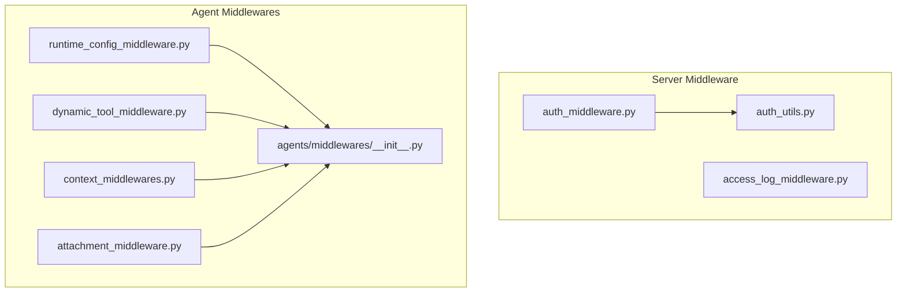
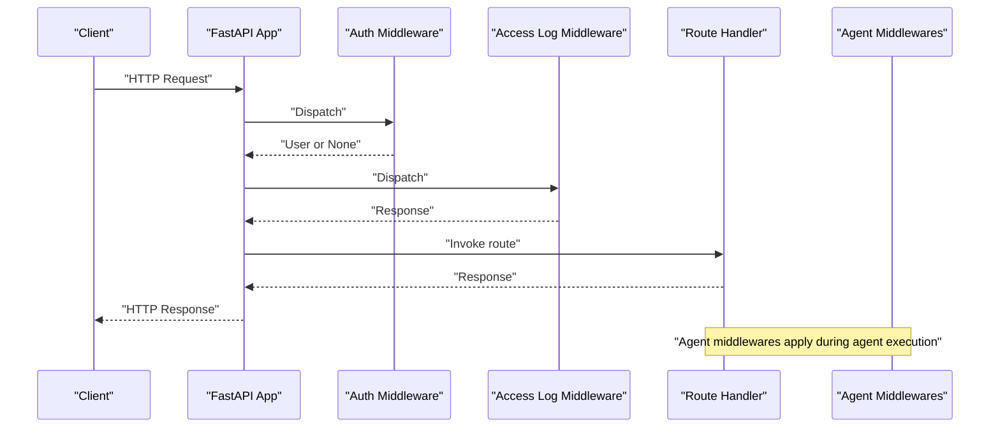
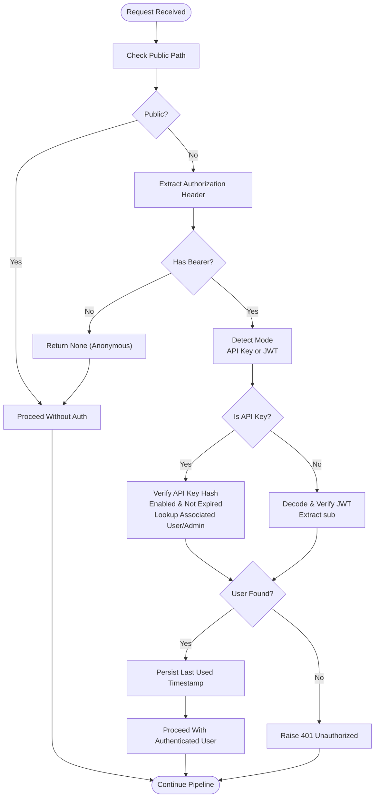
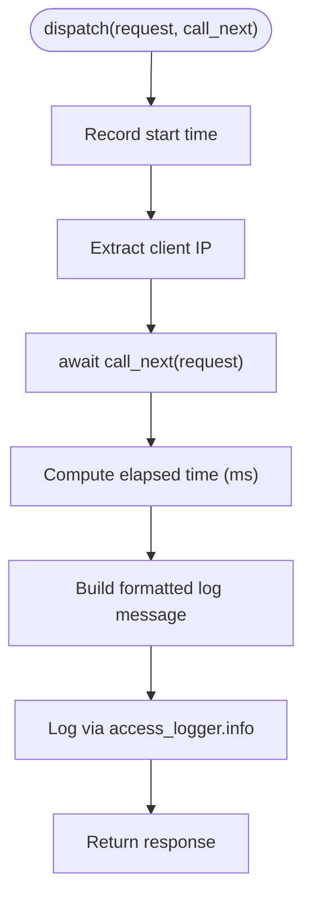
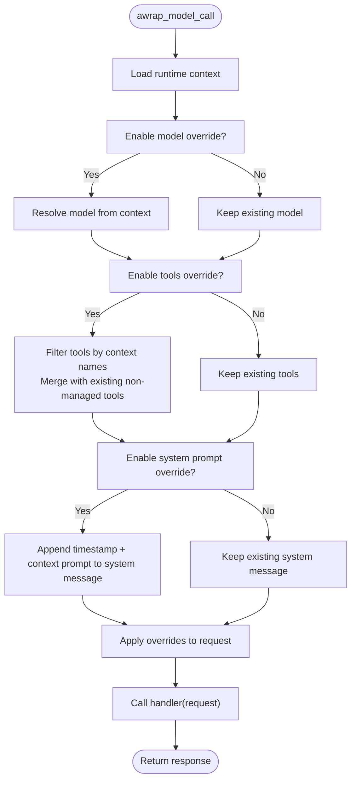
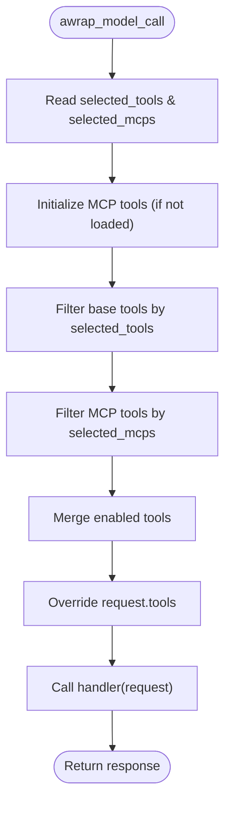
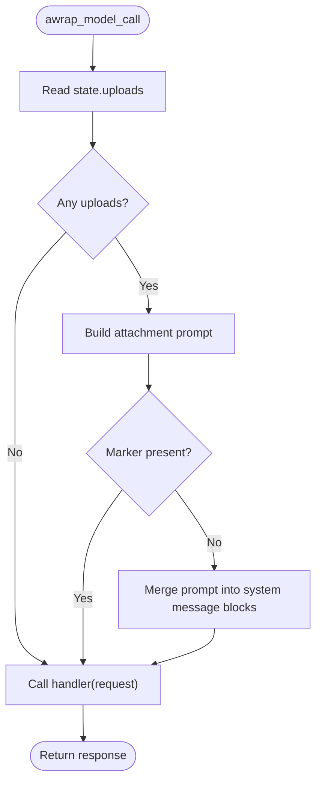
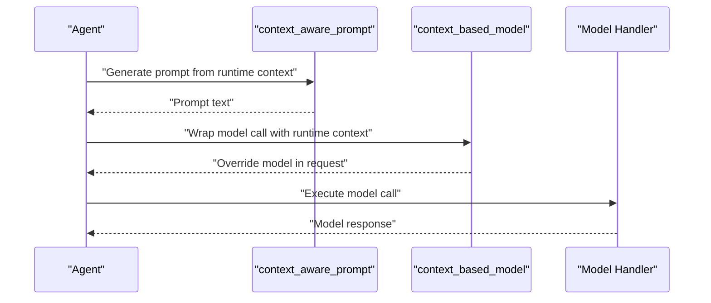
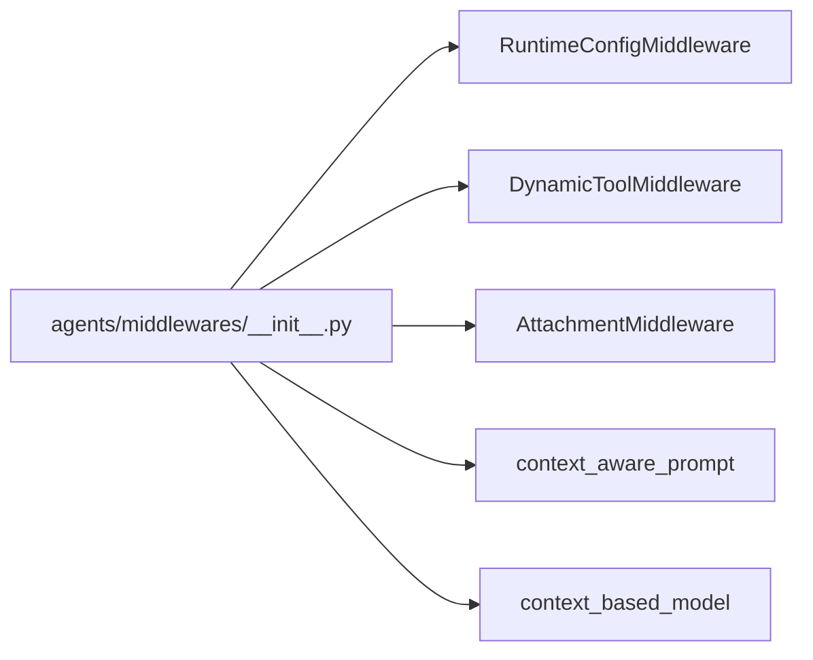
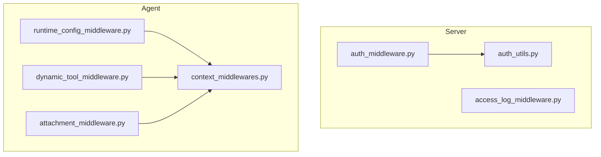

# Middleware & Interceptors

<cite>
**Referenced Files in This Document**
- [auth_middleware.py](file://backend/server/utils/auth_middleware.py)
- [auth_utils.py](file://backend/server/utils/auth_utils.py)
- [access_log_middleware.py](file://backend/server/utils/access_log_middleware.py)
- [context_middlewares.py](file://backend/package/yuxi/agents/middlewares/context_middlewares.py)
- [attachment_middleware.py](file://backend/package/yuxi/agents/middlewares/attachment_middleware.py)
- [dynamic_tool_middleware.py](file://backend/package/yuxi/agents/middlewares/dynamic_tool_middleware.py)
- [runtime_config_middleware.py](file://backend/package/yuxi/agents/middlewares/runtime_config_middleware.py)
- [__init__.py](file://backend/package/yuxi/agents/middlewares/__init__.py)
</cite>

## Table of Contents
1. [Introduction](#introduction)
2. [Project Structure](#project-structure)
3. [Core Components](#core-components)
4. [Architecture Overview](#architecture-overview)
5. [Detailed Component Analysis](#detailed-component-analysis)
6. [Dependency Analysis](#dependency-analysis)
7. [Performance Considerations](#performance-considerations)
8. [Troubleshooting Guide](#troubleshooting-guide)
9. [Conclusion](#conclusion)
10. [Appendices](#appendices)

## Introduction
This document explains the middleware and interceptor systems in Yuxi, focusing on:
- Authentication middleware supporting JWT tokens and API keys, plus session-like user binding
- Access logging middleware for audit trails and performance monitoring
- Context processing middleware for request/response transformation and data enrichment
- Agent-specific middlewares for context building, tool execution, and state management
- Practical configuration, custom middleware development, and integration patterns
- Execution order, priority handling, and conflict resolution strategies

## Project Structure
The middleware ecosystem spans two primary areas:
- Server-side FastAPI middleware stack for authentication and access logging
- Agent middlewares built on top of LangGraph’s middleware framework for context-aware model calls, tool selection, and runtime configuration

**Diagram sources**
- [auth_middleware.py:1-169](file://backend/server/utils/auth_middleware.py#L1-L169)
- [access_log_middleware.py:1-68](file://backend/server/utils/access_log_middleware.py#L1-L68)
- [auth_utils.py:1-81](file://backend/server/utils/auth_utils.py#L1-L81)
- [runtime_config_middleware.py:1-162](file://backend/package/yuxi/agents/middlewares/runtime_config_middleware.py#L1-L162)
- [dynamic_tool_middleware.py:1-70](file://backend/package/yuxi/agents/middlewares/dynamic_tool_middleware.py#L1-L70)
- [context_middlewares.py:1-26](file://backend/package/yuxi/agents/middlewares/context_middlewares.py#L1-L26)
- [attachment_middleware.py:1-90](file://backend/package/yuxi/agents/middlewares/attachment_middleware.py#L1-L90)
- [__init__.py:1-17](file://backend/package/yuxi/agents/middlewares/__init__.py#L1-L17)

**Section sources**
- [auth_middleware.py:1-169](file://backend/server/utils/auth_middleware.py#L1-L169)
- [access_log_middleware.py:1-68](file://backend/server/utils/access_log_middleware.py#L1-L68)
- [auth_utils.py:1-81](file://backend/server/utils/auth_utils.py#L1-L81)
- [runtime_config_middleware.py:1-162](file://backend/package/yuxi/agents/middlewares/runtime_config_middleware.py#L1-L162)
- [dynamic_tool_middleware.py:1-70](file://backend/package/yuxi/agents/middlewares/dynamic_tool_middleware.py#L1-L70)
- [context_middlewares.py:1-26](file://backend/package/yuxi/agents/middlewares/context_middlewares.py#L1-L26)
- [attachment_middleware.py:1-90](file://backend/package/yuxi/agents/middlewares/attachment_middleware.py#L1-L90)
- [__init__.py:1-17](file://backend/package/yuxi/agents/middlewares/__init__.py#L1-L17)

## Core Components
- Authentication middleware
  - Supports JWT bearer tokens and API key authentication
  - Public path bypass, user lookup, role checks, and last-used updates
- Access logging middleware
  - Records request method, path, status, and elapsed time with client IP extraction
- Agent middlewares
  - RuntimeConfigMiddleware: merges model, tools, and system prompt from runtime context
  - DynamicToolMiddleware: filters tools based on runtime context and preloaded MCP servers
  - AttachmentMiddleware: injects file attachment context into system prompts
  - Context-aware prompt/model wrappers: dynamic prompt generation and model selection

**Section sources**
- [auth_middleware.py:18-169](file://backend/server/utils/auth_middleware.py#L18-L169)
- [access_log_middleware.py:34-68](file://backend/server/utils/access_log_middleware.py#L34-L68)
- [runtime_config_middleware.py:16-118](file://backend/package/yuxi/agents/middlewares/runtime_config_middleware.py#L16-L118)
- [dynamic_tool_middleware.py:10-70](file://backend/package/yuxi/agents/middlewares/dynamic_tool_middleware.py#L10-L70)
- [attachment_middleware.py:54-90](file://backend/package/yuxi/agents/middlewares/attachment_middleware.py#L54-L90)
- [context_middlewares.py:11-26](file://backend/package/yuxi/agents/middlewares/context_middlewares.py#L11-L26)

## Architecture Overview
The middleware stack integrates at two layers:
- Server-level middleware pipeline (FastAPI): authentication and access logging
- Agent-level middleware pipeline (LangGraph): runtime configuration, tool selection, attachments, and context-aware prompting

**Diagram sources**
- [auth_middleware.py:74-139](file://backend/server/utils/auth_middleware.py#L74-L139)
- [access_log_middleware.py:41-67](file://backend/server/utils/access_log_middleware.py#L41-L67)

## Detailed Component Analysis

### Authentication Middleware
Implements:
- Public path detection via regex patterns
- Dual-mode authentication:
  - API key: SHA-256 hash lookup, expiration and enablement checks, association with user or admin user by department
  - JWT: HS256 verification via shared secret, claims extraction, and user lookup
- Role gating:
  - Required user with department binding
  - Admin and SuperAdmin roles
- Session-like behavior:
  - On successful API key authentication, last-used timestamp is persisted

**Diagram sources**
- [auth_middleware.py:18-169](file://backend/server/utils/auth_middleware.py#L18-L169)
- [auth_utils.py:46-81](file://backend/server/utils/auth_utils.py#L46-L81)

**Section sources**
- [auth_middleware.py:18-169](file://backend/server/utils/auth_middleware.py#L18-L169)
- [auth_utils.py:13-81](file://backend/server/utils/auth_utils.py#L13-L81)

### Access Logging Middleware
- Extracts client IP from x-forwarded-for or request client host
- Measures per-request latency using high-resolution timer
- Logs method, path, query string, HTTP version, status code, and elapsed time
- Uses a dedicated logger to avoid duplication and configure formatting

**Diagram sources**
- [access_log_middleware.py:41-67](file://backend/server/utils/access_log_middleware.py#L41-L67)

**Section sources**
- [access_log_middleware.py:1-68](file://backend/server/utils/access_log_middleware.py#L1-L68)

### Agent Middlewares

#### RuntimeConfigMiddleware
- Purpose: Merge runtime context into model call requests
- Features:
  - Optional model override from context field
  - Optional tools override by filtering against preloaded tool set
  - Optional system prompt merge with contextualized timestamp
- Behavior:
  - Preloads base tools and supports extra tools
  - Respects enable flags for each override type
  - Merges system prompt content blocks safely

**Diagram sources**
- [runtime_config_middleware.py:75-118](file://backend/package/yuxi/agents/middlewares/runtime_config_middleware.py#L75-L118)

**Section sources**
- [runtime_config_middleware.py:16-162](file://backend/package/yuxi/agents/middlewares/runtime_config_middleware.py#L16-L162)

#### DynamicToolMiddleware
- Purpose: Dynamically select tools based on runtime context
- Behavior:
  - Preloads MCP tools from configured servers into an internal registry
  - Filters base tools and MCP tools according to context-selected lists
  - Updates request.tools with the filtered set

**Diagram sources**
- [dynamic_tool_middleware.py:40-70](file://backend/package/yuxi/agents/middlewares/dynamic_tool_middleware.py#L40-L70)

**Section sources**
- [dynamic_tool_middleware.py:10-70](file://backend/package/yuxi/agents/middlewares/dynamic_tool_middleware.py#L10-L70)

#### AttachmentMiddleware
- Purpose: Inject file attachment context into the system prompt
- Behavior:
  - Reads uploads from state
  - Builds a concise prompt block listing uploaded files
  - Safely injects the block into system message content blocks
  - Prevents duplicate injection using a marker

**Diagram sources**
- [attachment_middleware.py:59-85](file://backend/package/yuxi/agents/middlewares/attachment_middleware.py#L59-L85)

**Section sources**
- [attachment_middleware.py:54-90](file://backend/package/yuxi/agents/middlewares/attachment_middleware.py#L54-L90)

#### Context-Aware Prompt and Model Wrappers
- Dynamic prompt generator reads system prompt from runtime context
- Model selector resolves a chat model from runtime context and overrides the request

**Diagram sources**
- [context_middlewares.py:11-26](file://backend/package/yuxi/agents/middlewares/context_middlewares.py#L11-L26)

**Section sources**
- [context_middlewares.py:11-26](file://backend/package/yuxi/agents/middlewares/context_middlewares.py#L11-L26)

### Registration Patterns
Agent middlewares are exported via a single module initializer, enabling straightforward import and composition in agent graphs.

**Diagram sources**
- [__init__.py:1-17](file://backend/package/yuxi/agents/middlewares/__init__.py#L1-L17)

**Section sources**
- [__init__.py:1-17](file://backend/package/yuxi/agents/middlewares/__init__.py#L1-L17)

## Dependency Analysis
- Server middleware dependencies
  - Authentication middleware depends on:
    - PostgreSQL async session manager for user/API key queries
    - JWT utilities for token decoding and verification
    - Utility for current UTC time
  - Access logging middleware depends on:
    - Starlette BaseHTTPMiddleware
    - Python logging module
- Agent middleware dependencies
  - RuntimeConfigMiddleware depends on:
    - Model loader and tool registries
    - MCP service for enabled tool discovery
    - Datetime utilities and logging
  - DynamicToolMiddleware depends on:
    - MCP service for tool loading
    - Logger
  - AttachmentMiddleware depends on:
    - LangGraph AgentState and message types
    - Logger

**Diagram sources**
- [auth_middleware.py:10-13](file://backend/server/utils/auth_middleware.py#L10-L13)
- [auth_utils.py:14-17](file://backend/server/utils/auth_utils.py#L14-L17)
- [runtime_config_middleware.py:9-13](file://backend/package/yuxi/agents/middlewares/runtime_config_middleware.py#L9-L13)
- [dynamic_tool_middleware.py:6-7](file://backend/package/yuxi/agents/middlewares/dynamic_tool_middleware.py#L6-L7)
- [attachment_middleware.py:14-16](file://backend/package/yuxi/agents/middlewares/attachment_middleware.py#L14-L16)
- [context_middlewares.py:5-8](file://backend/package/yuxi/agents/middlewares/context_middlewares.py#L5-L8)

**Section sources**
- [auth_middleware.py:10-13](file://backend/server/utils/auth_middleware.py#L10-L13)
- [auth_utils.py:14-17](file://backend/server/utils/auth_utils.py#L14-L17)
- [runtime_config_middleware.py:9-13](file://backend/package/yuxi/agents/middlewares/runtime_config_middleware.py#L9-L13)
- [dynamic_tool_middleware.py:6-7](file://backend/package/yuxi/agents/middlewares/dynamic_tool_middleware.py#L6-L7)
- [attachment_middleware.py:14-16](file://backend/package/yuxi/agents/middlewares/attachment_middleware.py#L14-L16)
- [context_middlewares.py:5-8](file://backend/package/yuxi/agents/middlewares/context_middlewares.py#L5-L8)

## Performance Considerations
- Authentication
  - API key verification performs a single hash lookup and optional user/admin joins; keep indexes on hashed keys and timestamps
  - JWT verification is CPU-bound; tune secret rotation and consider caching decoded claims for short-lived requests
- Access logging
  - Minimal overhead; ensure structured logging and appropriate log levels to avoid I/O bottlenecks
- Agent middlewares
  - Preloading MCP tools reduces runtime latency; initialize early and reuse instances
  - Tool filtering is O(n) over tool sets; keep tool lists concise and avoid repeated recomputation
  - System prompt merging is linear in content block count; avoid excessively large prompts

[No sources needed since this section provides general guidance]

## Troubleshooting Guide
- Authentication failures
  - Verify Authorization header format and presence
  - Confirm API key enablement, expiration, and associated user/admin status
  - Check JWT secret and algorithm configuration
- Role errors
  - Ensure authenticated user belongs to a department and meets minimum role requirements
- Access logs
  - Confirm logger configuration and handler setup
  - Validate x-forwarded-for header presence behind proxies
- Agent middlewares
  - Tool selection warnings indicate missing tool names or MCP servers not preloaded
  - System prompt injection skips if marker already present; adjust markers or state accordingly
  - Model override requires a valid model spec in runtime context

**Section sources**
- [auth_middleware.py:78-139](file://backend/server/utils/auth_middleware.py#L78-L139)
- [auth_utils.py:62-81](file://backend/server/utils/auth_utils.py#L62-L81)
- [runtime_config_middleware.py:119-162](file://backend/package/yuxi/agents/middlewares/runtime_config_middleware.py#L119-L162)
- [dynamic_tool_middleware.py:54-65](file://backend/package/yuxi/agents/middlewares/dynamic_tool_middleware.py#L54-L65)
- [attachment_middleware.py:76-85](file://backend/package/yuxi/agents/middlewares/attachment_middleware.py#L76-L85)

## Conclusion
Yuxi’s middleware stack combines robust server-side authentication and observability with flexible agent-level context processing. By leveraging preloading, selective overrides, and safe prompt merging, the system achieves both security and extensibility. Proper configuration of public paths, tool registries, and logging ensures reliable operation and strong auditability.

[No sources needed since this section summarizes without analyzing specific files]

## Appendices

### Middleware Execution Order and Priority
- Server pipeline order (typical):
  1) Authentication middleware
  2) Access logging middleware
  3) Route handlers
- Agent pipeline order (LangGraph):
  - RuntimeConfigMiddleware typically runs before tool selection and model execution
  - DynamicToolMiddleware filters tools after configuration
  - AttachmentMiddleware injects context into system messages prior to model calls
  - Context-aware prompt/model wrappers operate around model invocation

[No sources needed since this section provides general guidance]

### Practical Configuration Examples
- Authentication
  - Configure public paths to exclude health checks and initialization endpoints
  - Set JWT secret and algorithm environment variables
- Access logging
  - Adjust logger level and formatter for production logging
- Agent middlewares
  - Initialize RuntimeConfigMiddleware with desired context field names and override flags
  - Preload MCP servers in DynamicToolMiddleware constructor
  - Ensure AttachmentMiddleware finds uploads in agent state

[No sources needed since this section provides general guidance]