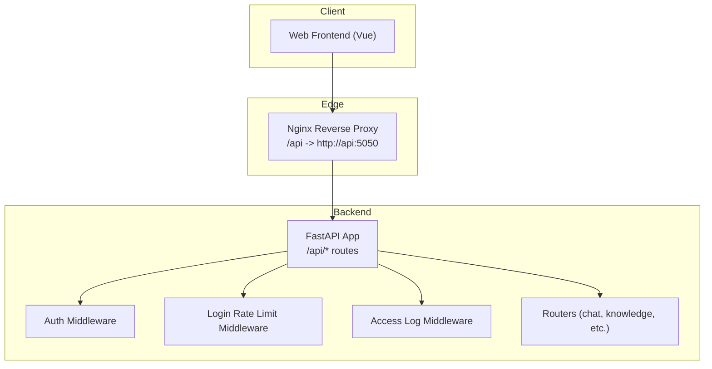
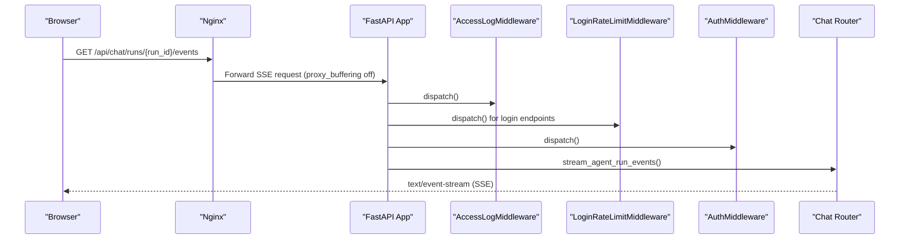
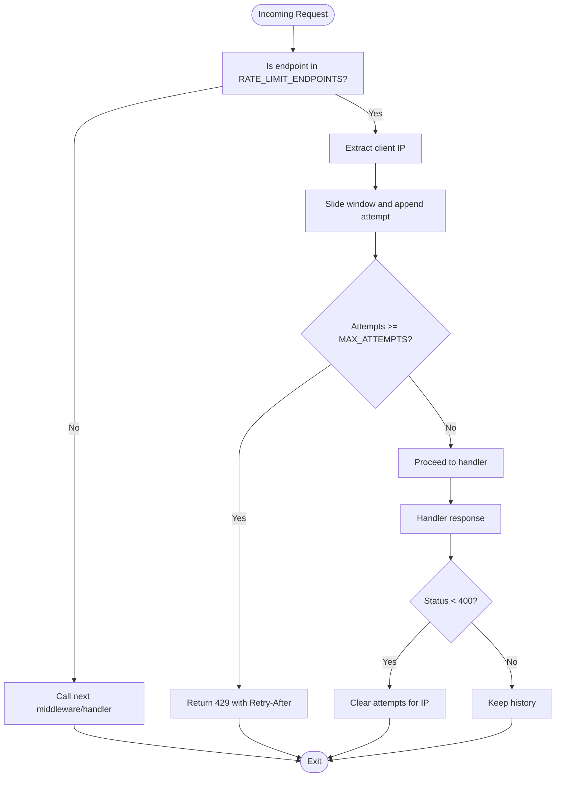
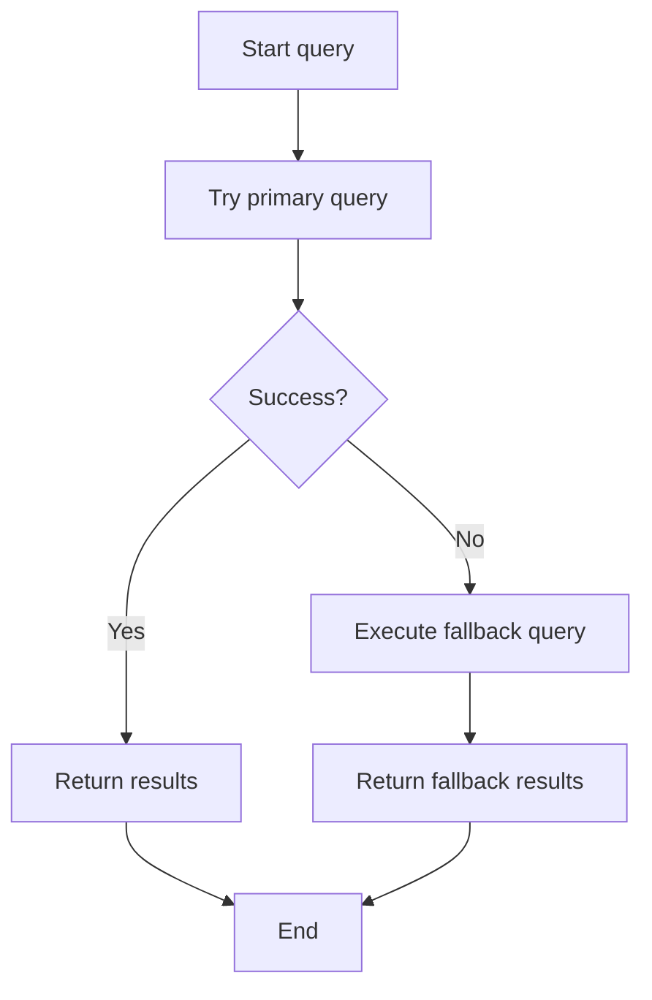
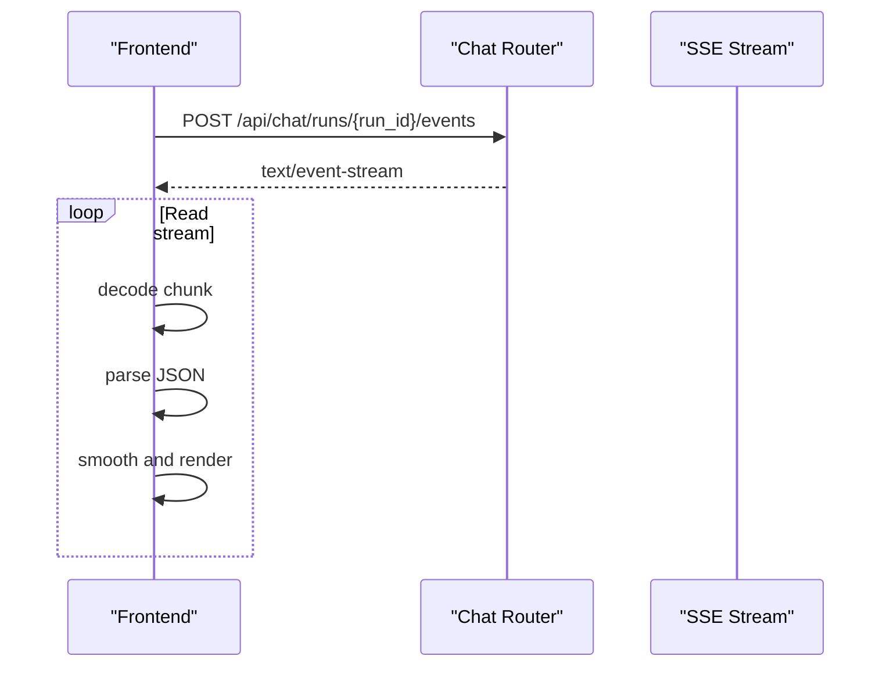
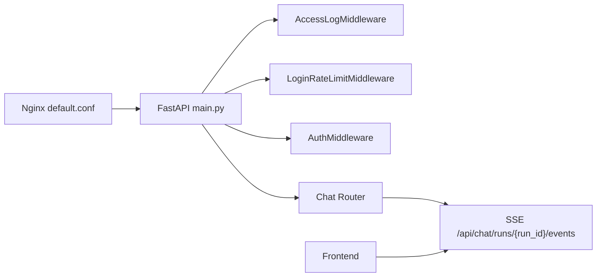

# API Performance Optimization

<cite>
**Referenced Files in This Document**
- [main.py](file://backend/server/main.py)
- [access_log_middleware.py](file://backend/server/utils/access_log_middleware.py)
- [auth_middleware.py](file://backend/server/utils/auth_middleware.py)
- [chat_router.py](file://backend/server/routers/chat_router.py)
- [default.conf](file://docker/nginx/default.conf)
- [useStreamSmoother.js](file://web/src/composables/useStreamSmoother.js)
- [useAgentStreamHandler.js](file://web/src/composables/useAgentStreamHandler.js)
- [useAgentRunStream.js](file://web/src/composables/useAgentRunStream.js)
- [messageProcessor.js](file://web/src/utils/messageProcessor.js)
- [image_processor.py](file://backend/package/yuxi/utils/image_processor.py)
- [knowledge_base_backend.py](file://backend/package/yuxi/agents/backends/knowledge_base_backend.py)
- [base.py](file://backend/package/yuxi/knowledge/graphs/adapters/base.py)
</cite>

## Table of Contents
1. [Introduction](#introduction)
2. [Project Structure](#project-structure)
3. [Core Components](#core-components)
4. [Architecture Overview](#architecture-overview)
5. [Detailed Component Analysis](#detailed-component-analysis)
6. [Dependency Analysis](#dependency-analysis)
7. [Performance Considerations](#performance-considerations)
8. [Troubleshooting Guide](#troubleshooting-guide)
9. [Conclusion](#conclusion)

## Introduction
This document provides API performance optimization guidance for the Yuxi platform. It focuses on reducing network overhead and improving throughput via request batching strategies, optimizing response sizes with compression, implementing rate limiting to protect backend resources, and optimizing endpoints for efficient queries, selective field retrieval, and pagination. It also covers practical streaming patterns for large payloads, WebSocket/SSE optimizations for real-time features, async processing patterns, caching strategies across layers, CDN and edge computing considerations, performance monitoring, latency optimization techniques, and error handling for degraded performance scenarios.

## Project Structure
The Yuxi platform consists of:
- Backend API built with FastAPI and Uvicorn, exposing routes under /api.
- Nginx acting as a reverse proxy and load balancer for the frontend and API.
- Frontend Vue.js SPA that consumes the API and implements streaming UI smoothing.

**Diagram sources**
- [main.py:40-137](file://backend/server/main.py#L40-L137)
- [default.conf:13-31](file://docker/nginx/default.conf#L13-L31)

**Section sources**
- [main.py:40-137](file://backend/server/main.py#L40-L137)
- [default.conf:13-31](file://docker/nginx/default.conf#L13-L31)

## Core Components
- Authentication and authorization middleware supporting bearer tokens and API keys.
- Login rate limiting middleware to mitigate brute-force attempts.
- Access logging middleware for request duration tracking.
- Streaming endpoints for chat and async runs using Server-Sent Events (SSE) and JSON chunks.
- Frontend streaming handlers and smoothing utilities to render incremental updates efficiently.

Key implementation references:
- Authentication and public paths: [auth_middleware.py:18-26](file://backend/server/utils/auth_middleware.py#L18-L26)
- Rate limiting for login: [main.py:32-34](file://backend/server/main.py#L32-L34), [main.py:63-96](file://backend/server/main.py#L63-L96)
- Access logging: [access_log_middleware.py:34-67](file://backend/server/utils/access_log_middleware.py#L34-L67)
- Streaming chat and runs: [chat_router.py:362-456](file://backend/server/routers/chat_router.py#L362-L456), [chat_router.py:437-456](file://backend/server/routers/chat_router.py#L437-L456)
- Frontend SSE/JSON streaming: [useAgentRunStream.js:59-116](file://web/src/composables/useAgentRunStream.js#L59-L116), [useAgentStreamHandler.js:10-63](file://web/src/composables/useAgentStreamHandler.js#L10-L63), [messageProcessor.js:453-490](file://web/src/utils/messageProcessor.js#L453-L490)
- Frontend smoothing: [useStreamSmoother.js:173-220](file://web/src/composables/useStreamSmoother.js#L173-L220)

**Section sources**
- [auth_middleware.py:18-26](file://backend/server/utils/auth_middleware.py#L18-L26)
- [main.py:32-34](file://backend/server/main.py#L32-L34)
- [main.py:63-96](file://backend/server/main.py#L63-L96)
- [access_log_middleware.py:34-67](file://backend/server/utils/access_log_middleware.py#L34-L67)
- [chat_router.py:362-456](file://backend/server/routers/chat_router.py#L362-L456)
- [useAgentRunStream.js:59-116](file://web/src/composables/useAgentRunStream.js#L59-L116)
- [useAgentStreamHandler.js:10-63](file://web/src/composables/useAgentStreamHandler.js#L10-L63)
- [messageProcessor.js:453-490](file://web/src/utils/messageProcessor.js#L453-L490)
- [useStreamSmoother.js:173-220](file://web/src/composables/useStreamSmoother.js#L173-L220)

## Architecture Overview
The platform’s API pipeline integrates Nginx, FastAPI, and streaming endpoints. Nginx proxies /api requests to the backend and disables buffering for streaming responses. FastAPI applies middleware for auth, rate limiting, and access logging, while routers expose streaming and async endpoints.

**Diagram sources**
- [default.conf:22-31](file://docker/nginx/default.conf#L22-L31)
- [main.py:132-137](file://backend/server/main.py#L132-L137)
- [chat_router.py:437-456](file://backend/server/routers/chat_router.py#L437-L456)

**Section sources**
- [default.conf:22-31](file://docker/nginx/default.conf#L22-L31)
- [main.py:132-137](file://backend/server/main.py#L132-L137)
- [chat_router.py:437-456](file://backend/server/routers/chat_router.py#L437-L456)

## Detailed Component Analysis

### Request Batching Strategies
- Batch related operations into a single request where feasible. For example, group multiple small reads or metadata queries into a single endpoint call to reduce round trips.
- Use streaming responses for large datasets to avoid building massive payloads in memory. The platform already supports streaming via JSON chunks and SSE.

Practical references:
- Streaming chat responses: [chat_router.py:362-373](file://backend/server/routers/chat_router.py#L362-L373)
- SSE for run events: [chat_router.py:437-456](file://backend/server/routers/chat_router.py#L437-L456)
- Frontend streaming handlers: [useAgentRunStream.js:59-116](file://web/src/composables/useAgentRunStream.js#L59-L116), [useAgentStreamHandler.js:10-63](file://web/src/composables/useAgentStreamHandler.js#L10-L63)

**Section sources**
- [chat_router.py:362-373](file://backend/server/routers/chat_router.py#L362-L373)
- [chat_router.py:437-456](file://backend/server/routers/chat_router.py#L437-L456)
- [useAgentRunStream.js:59-116](file://web/src/composables/useAgentRunStream.js#L59-L116)
- [useAgentStreamHandler.js:10-63](file://web/src/composables/useAgentStreamHandler.js#L10-L63)

### Response Compression Techniques
- Enable gzip/brotli compression at the edge/proxy layer. Nginx can compress responses for static and dynamic content.
- Tune compression level and types to balance CPU cost and bandwidth savings.

Recommendations:
- Configure gzip/brotli in Nginx for static assets and API responses.
- Prefer brotli for modern browsers; enable fallback to gzip for compatibility.

[No sources needed since this section provides general guidance]

### Rate Limiting Implementation
- The platform implements login rate limiting using an in-memory sliding window per client IP for the token endpoint. This reduces brute-force attempts and protects backend resources.

**Diagram sources**
- [main.py:32-34](file://backend/server/main.py#L32-L34)
- [main.py:63-96](file://backend/server/main.py#L63-L96)

**Section sources**
- [main.py:32-34](file://backend/server/main.py#L32-L34)
- [main.py:63-96](file://backend/server/main.py#L63-L96)

### API Endpoint Optimization
- Efficient query patterns: Use database adapters with bounded limits and fallbacks to avoid heavy scans. The graph adapter demonstrates a fallback query when a connected subgraph query fails.

**Diagram sources**
- [base.py:332-381](file://backend/package/yuxi/knowledge/graphs/adapters/base.py#L332-L381)

- Selective field retrieval: Design endpoints to return only required fields. For example, list endpoints can support filtering and projection to minimize payload size.

- Pagination optimization: The chat router’s file content endpoint supports offset/limit with a capped limit to prevent oversized payloads.

References:
- Graph adapter fallback: [base.py:332-381](file://backend/package/yuxi/knowledge/graphs/adapters/base.py#L332-L381)
- File content pagination: [chat_router.py:836-853](file://backend/server/routers/chat_router.py#L836-L853)

**Section sources**
- [base.py:332-381](file://backend/package/yuxi/knowledge/graphs/adapters/base.py#L332-L381)
- [chat_router.py:836-853](file://backend/server/routers/chat_router.py#L836-L853)

### Request/Response Streaming for Large Payloads
- Chat streaming: The chat endpoint streams JSON chunks for incremental responses.
- Run events streaming: SSE endpoint streams run events with JSON payloads.
- Frontend parsing: Handlers split the stream into lines, parse JSON chunks, and apply smoothing to render progressively.

**Diagram sources**
- [chat_router.py:437-456](file://backend/server/routers/chat_router.py#L437-L456)
- [useAgentRunStream.js:59-116](file://web/src/composables/useAgentRunStream.js#L59-L116)
- [messageProcessor.js:453-490](file://web/src/utils/messageProcessor.js#L453-L490)

**Section sources**
- [chat_router.py:437-456](file://backend/server/routers/chat_router.py#L437-L456)
- [useAgentRunStream.js:59-116](file://web/src/composables/useAgentRunStream.js#L59-L116)
- [messageProcessor.js:453-490](file://web/src/utils/messageProcessor.js#L453-L490)

### WebSocket Optimization for Real-Time Features
- The platform uses SSE for real-time updates. Ensure:
  - Disable proxy buffering for SSE in Nginx.
  - Set appropriate timeouts for long-lived connections.
  - Use lightweight JSON payloads and incremental rendering on the client.

References:
- Nginx SSE configuration: [default.conf:22-31](file://docker/nginx/default.conf#L22-L31)
- SSE handler: [useAgentRunStream.js:59-116](file://web/src/composables/useAgentRunStream.js#L59-L116)

**Section sources**
- [default.conf:22-31](file://docker/nginx/default.conf#L22-L31)
- [useAgentRunStream.js:59-116](file://web/src/composables/useAgentRunStream.js#L59-L116)

### Async Processing Patterns
- Asynchronous runs are supported via queueing and SSE event streaming. The frontend resumes streams and handles terminal states.

References:
- Async run creation and streaming: [chat_router.py:399-456](file://backend/server/routers/chat_router.py#L399-L456)
- Frontend run stream lifecycle: [useAgentRunStream.js:168-300](file://web/src/composables/useAgentRunStream.js#L168-L300)

**Section sources**
- [chat_router.py:399-456](file://backend/server/routers/chat_router.py#L399-L456)
- [useAgentRunStream.js:168-300](file://web/src/composables/useAgentRunStream.js#L168-L300)

### API Caching Strategies
- Application-level caching: Use in-memory caches for frequently accessed configuration or metadata. The MCP service maintains cached server configurations.
- Database-level caching: Leverage connection pooling and query result caching for repeated reads.
- Edge caching: Use Nginx caching for static assets and immutable API responses.
- CDN integration: Serve static assets via CDN to reduce origin load and latency.

References:
- MCP server caching: [mcp_service.py:77-81](file://backend/package/yuxi/services/mcp_service.py#L77-L81)

**Section sources**
- [mcp_service.py:77-81](file://backend/package/yuxi/services/mcp_service.py#L77-L81)

### CDN Integration and Edge Computing
- Static assets: Serve via CDN to improve global latency and reduce origin traffic.
- Edge compute: Offload image processing and transformations at the edge where possible.
- Nginx tuning: Keep proxy_buffering off for streaming endpoints; configure timeouts for uploads and long-lived streams.

References:
- Nginx static and API routing: [default.conf:8-31](file://docker/nginx/default.conf#L8-L31)

**Section sources**
- [default.conf:8-31](file://docker/nginx/default.conf#L8-L31)

### Performance Monitoring and Latency Optimization
- Access logs: Record request durations to identify slow endpoints and hotspots.
- Metrics: Track response times, error rates, and throughput at the edge and application layers.
- Latency optimization: Reduce payload sizes, enable compression, leverage caching, and minimize round trips.

References:
- Access log middleware: [access_log_middleware.py:34-67](file://backend/server/utils/access_log_middleware.py#L34-L67)

**Section sources**
- [access_log_middleware.py:34-67](file://backend/server/utils/access_log_middleware.py#L34-L67)

### Error Handling Strategies for Degraded Performance
- Graceful degradation: Return partial results or smaller payloads during high load.
- Retry policies: Implement exponential backoff for transient failures in streaming.
- Circuit breakers: Temporarily disable expensive endpoints when thresholds are exceeded.
- Frontend resilience: Stop and restart streams on errors; persist and resume run state.

References:
- SSE error handling and retries: [useAgentRunStream.js:182-299](file://web/src/composables/useAgentRunStream.js#L182-L299)

**Section sources**
- [useAgentRunStream.js:182-299](file://web/src/composables/useAgentRunStream.js#L182-L299)

## Dependency Analysis
The API stack integrates middleware and routers with streaming endpoints and frontend consumers.

**Diagram sources**
- [default.conf:13-31](file://docker/nginx/default.conf#L13-L31)
- [main.py:132-137](file://backend/server/main.py#L132-L137)
- [chat_router.py:437-456](file://backend/server/routers/chat_router.py#L437-L456)

**Section sources**
- [default.conf:13-31](file://docker/nginx/default.conf#L13-L31)
- [main.py:132-137](file://backend/server/main.py#L132-L137)
- [chat_router.py:437-456](file://backend/server/routers/chat_router.py#L437-L456)

## Performance Considerations
- Network overhead reduction:
  - Prefer streaming for large responses.
  - Use selective retrieval and pagination.
- Payload size reduction:
  - Compress responses at the edge.
  - Optimize images and binary assets.
- Throughput improvement:
  - Apply rate limiting to protect critical endpoints.
  - Use async processing and SSE for non-blocking I/O.
- Latency optimization:
  - Cache frequently accessed data.
  - Offload work to CDN and edge.

[No sources needed since this section provides general guidance]

## Troubleshooting Guide
- Streaming issues:
  - Verify Nginx proxy_buffering is disabled for SSE endpoints.
  - Ensure long timeouts for read/connect/send.
- Frontend streaming:
  - Confirm JSON parsing and line splitting logic.
  - Use smoothing utilities to stabilize UI rendering.
- Authentication and rate limiting:
  - Check public paths and token validation.
  - Monitor rate-limit triggers and adjust thresholds.

References:
- Nginx streaming config: [default.conf:22-31](file://docker/nginx/default.conf#L22-L31)
- Frontend SSE parsing: [useAgentRunStream.js:59-116](file://web/src/composables/useAgentRunStream.js#L59-L116), [messageProcessor.js:453-490](file://web/src/utils/messageProcessor.js#L453-L490)
- Public paths and auth: [auth_middleware.py:18-26](file://backend/server/utils/auth_middleware.py#L18-L26)

**Section sources**
- [default.conf:22-31](file://docker/nginx/default.conf#L22-L31)
- [useAgentRunStream.js:59-116](file://web/src/composables/useAgentRunStream.js#L59-L116)
- [messageProcessor.js:453-490](file://web/src/utils/messageProcessor.js#L453-L490)
- [auth_middleware.py:18-26](file://backend/server/utils/auth_middleware.py#L18-L26)

## Conclusion
By combining streaming responses, selective retrieval, pagination, rate limiting, compression, caching, and edge optimizations, the Yuxi platform can achieve significant improvements in throughput, latency, and reliability. The existing middleware and streaming infrastructure provides a strong foundation—extend it with targeted caching, CDN integration, and robust error handling to sustain performance under load.