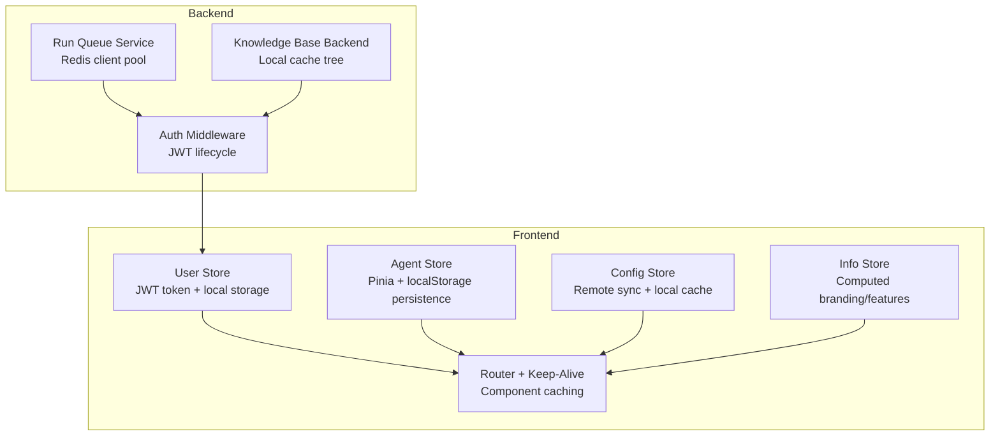
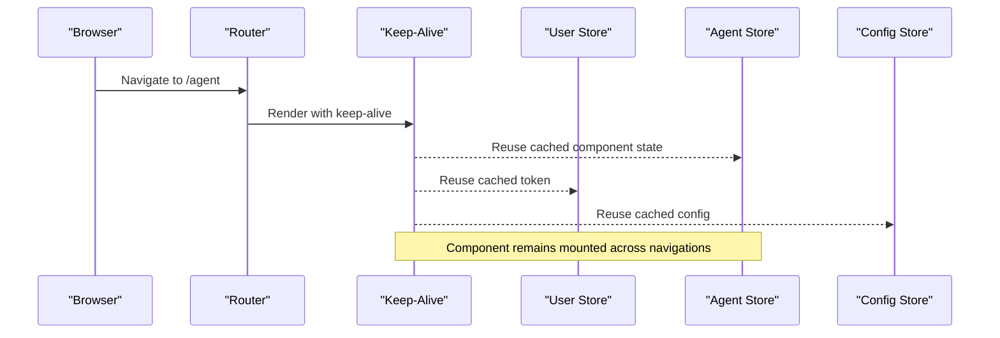
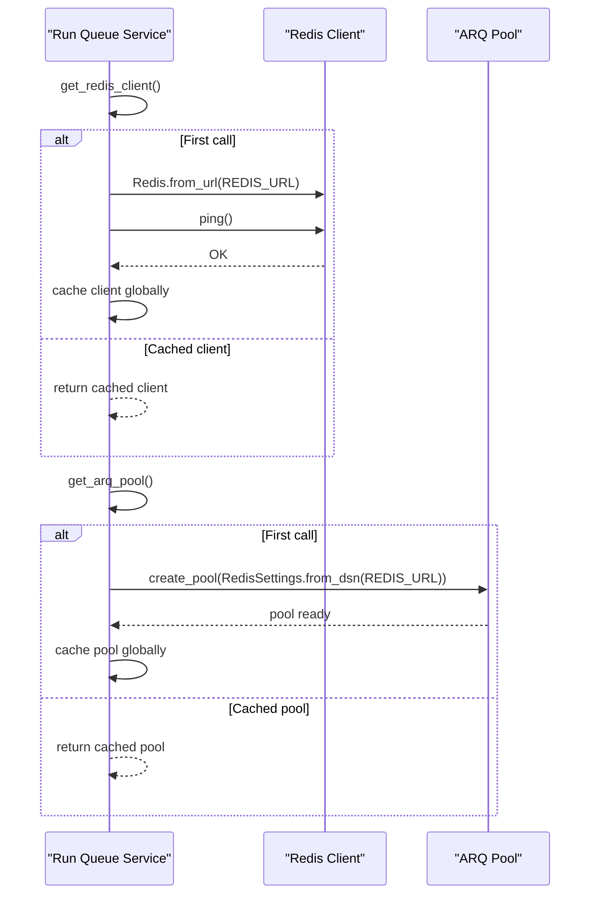
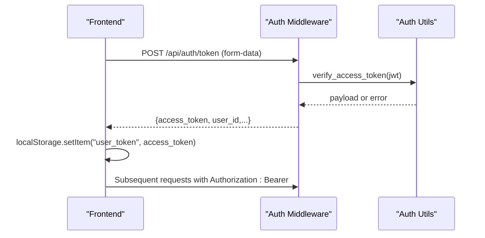
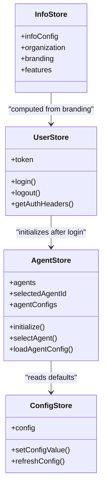
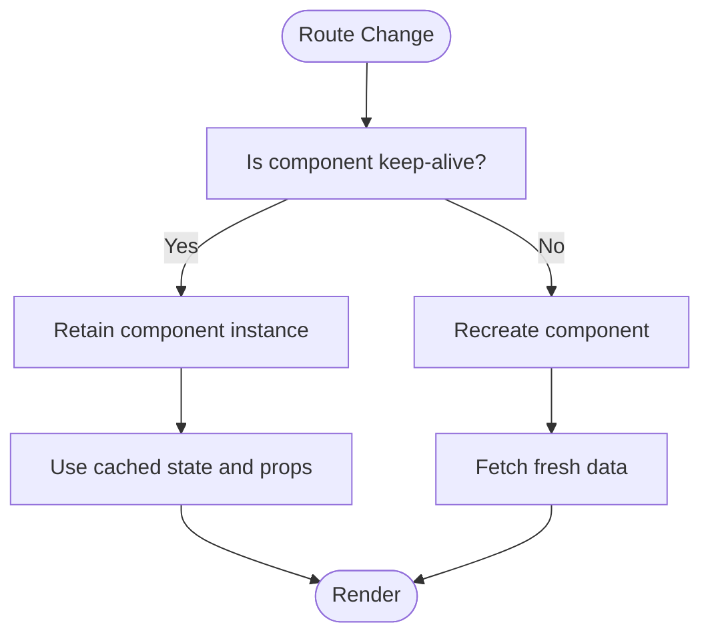
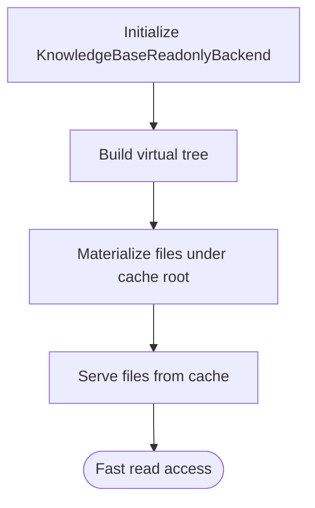
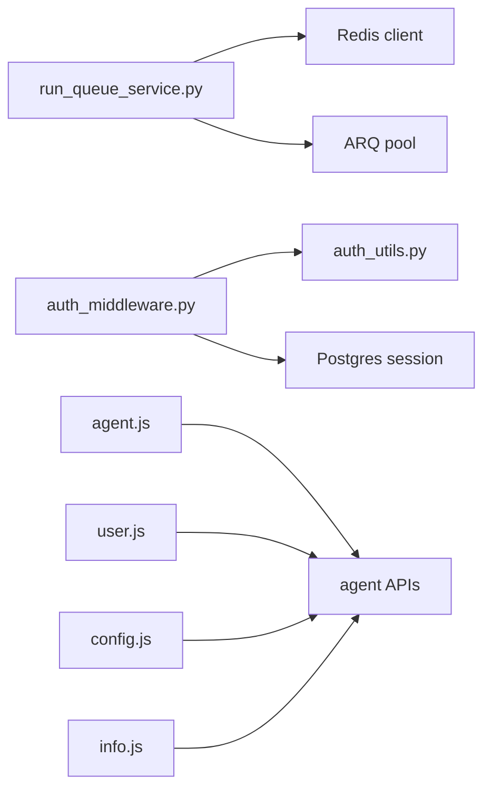

# Caching Strategies

<cite>
**Referenced Files in This Document**
- [auth_middleware.py](file://backend/server/utils/auth_middleware.py)
- [auth_utils.py](file://backend/server/utils/auth_utils.py)
- [run_queue_service.py](file://backend/package/yuxi/services/run_queue_service.py)
- [test_run_queue_service.py](file://backend/test/unit/services/test_run_queue_service.py)
- [user.js](file://web/src/stores/user.js)
- [agent.js](file://web/src/stores/agent.js)
- [config.js](file://web/src/stores/config.js)
- [info.js](file://web/src/stores/info.js)
- [main.js](file://web/src/main.js)
- [BlankLayout.vue](file://web/src/layouts/BlankLayout.vue)
- [index.js](file://web/src/router/index.js)
- [knowledge_base_backend.py](file://backend/package/yuxi/agents/backends/knowledge_base_backend.py)
- [singleton.py](file://backend/server/utils/singleton.py)
</cite>

## Table of Contents
1. [Introduction](#introduction)
2. [Project Structure](#project-structure)
3. [Core Components](#core-components)
4. [Architecture Overview](#architecture-overview)
5. [Detailed Component Analysis](#detailed-component-analysis)
6. [Dependency Analysis](#dependency-analysis)
7. [Performance Considerations](#performance-considerations)
8. [Troubleshooting Guide](#troubleshooting-guide)
9. [Conclusion](#conclusion)
10. [Appendices](#appendices)

## Introduction
This document defines a comprehensive caching strategy for the Yuxi platform. It covers backend Redis caching for frequently accessed data (user sessions, API responses, and computed results), cache invalidation to maintain consistency after knowledge base and agent configuration updates, and frontend caching via browser storage, component state caching, and Pinia store optimizations. It also outlines cache warming, tiering, serialization, distributed deployment considerations, and operational practices for debugging, monitoring, and recovery.

## Project Structure
The caching strategy spans backend services and frontend stores:
- Backend: Authentication middleware and utilities manage JWT lifetimes; Redis-backed run queues and ARQ job scheduling are present; knowledge base backends materialize and cache data locally.
- Frontend: Pinia stores cache agent metadata and configuration; keep-alive routing caches rendered components; browser local storage persists tokens and selected agent state.

**Diagram sources**
- [auth_middleware.py:1-169](file://backend/server/utils/auth_middleware.py#L1-L169)
- [auth_utils.py:1-81](file://backend/server/utils/auth_utils.py#L1-L81)
- [run_queue_service.py:61-99](file://backend/package/yuxi/services/run_queue_service.py#L61-L99)
- [knowledge_base_backend.py:135-147](file://backend/package/yuxi/agents/backends/knowledge_base_backend.py#L135-L147)
- [user.js:1-404](file://web/src/stores/user.js#L1-L404)
- [agent.js:558-567](file://web/src/stores/agent.js#L558-L567)
- [config.js:15-50](file://web/src/stores/config.js#L15-L50)
- [info.js:1-58](file://web/src/stores/info.js#L1-L58)
- [BlankLayout.vue:1-9](file://web/src/layouts/BlankLayout.vue#L1-L9)
- [index.js:1-50](file://web/src/router/index.js#L1-L50)

**Section sources**
- [auth_middleware.py:1-169](file://backend/server/utils/auth_middleware.py#L1-L169)
- [auth_utils.py:1-81](file://backend/server/utils/auth_utils.py#L1-L81)
- [run_queue_service.py:61-99](file://backend/package/yuxi/services/run_queue_service.py#L61-L99)
- [knowledge_base_backend.py:135-147](file://backend/package/yuxi/agents/backends/knowledge_base_backend.py#L135-L147)
- [user.js:1-404](file://web/src/stores/user.js#L1-L404)
- [agent.js:558-567](file://web/src/stores/agent.js#L558-L567)
- [config.js:15-50](file://web/src/stores/config.js#L15-L50)
- [info.js:1-58](file://web/src/stores/info.js#L1-L58)
- [BlankLayout.vue:1-9](file://web/src/layouts/BlankLayout.vue#L1-L9)
- [index.js:1-50](file://web/src/router/index.js#L1-L50)

## Core Components
- Backend Redis client and ARQ pool initialization with lazy instantiation and health-check ping.
- JWT-based user sessions with fixed expiration configured in the backend.
- Frontend Pinia stores with localStorage persistence for selected agent and configuration keys.
- Keep-Alive routing to cache rendered components across navigations.
- Knowledge base backend that materializes and caches files locally for read-only access.

**Section sources**
- [run_queue_service.py:61-99](file://backend/package/yuxi/services/run_queue_service.py#L61-L99)
- [auth_utils.py:13-17](file://backend/server/utils/auth_utils.py#L13-L17)
- [user.js:7-63](file://web/src/stores/user.js#L7-L63)
- [agent.js:558-567](file://web/src/stores/agent.js#L558-L567)
- [BlankLayout.vue:4-6](file://web/src/layouts/BlankLayout.vue#L4-L6)
- [knowledge_base_backend.py:135-147](file://backend/package/yuxi/agents/backends/knowledge_base_backend.py#L135-L147)

## Architecture Overview
The caching architecture integrates backend and frontend layers:
- Backend caches:
  - Redis-backed run queues and ARQ job scheduling pools.
  - JWT tokens for session management with server-side verification.
- Frontend caches:
  - Browser localStorage for tokens and selected agent/config state.
  - Pinia store persistence for agent selection and config ID.
  - Keep-Alive caching of route components to avoid re-fetching data unnecessarily.

**Diagram sources**
- [BlankLayout.vue:1-9](file://web/src/layouts/BlankLayout.vue#L1-L9)
- [index.js:30-46](file://web/src/router/index.js#L30-L46)
- [user.js:7-63](file://web/src/stores/user.js#L7-L63)
- [agent.js:558-567](file://web/src/stores/agent.js#L558-L567)
- [config.js:15-50](file://web/src/stores/config.js#L15-L50)

## Detailed Component Analysis

### Backend Redis and Run Queue Caching
- Redis client and ARQ pool are lazily initialized and cached globally to avoid repeated connections and redundant health checks.
- The Redis client ping ensures connectivity once per process lifetime during first acquisition.
- ARQ pool is created from Redis DSN settings for asynchronous job scheduling.

**Diagram sources**
- [run_queue_service.py:61-99](file://backend/package/yuxi/services/run_queue_service.py#L61-L99)

**Section sources**
- [run_queue_service.py:61-99](file://backend/package/yuxi/services/run_queue_service.py#L61-L99)
- [test_run_queue_service.py:55-81](file://backend/test/unit/services/test_run_queue_service.py#L55-L81)

### JWT Session Caching and Invalidation
- JWT secret, algorithm, and expiration are configured in the backend utilities.
- Authentication middleware validates tokens and supports API key fallback; public paths bypass authentication.
- On successful login, the frontend stores only the JWT token in localStorage and reuses it for subsequent requests.

**Diagram sources**
- [auth_middleware.py:74-123](file://backend/server/utils/auth_middleware.py#L74-L123)
- [auth_utils.py:46-80](file://backend/server/utils/auth_utils.py#L46-L80)
- [user.js:23-70](file://web/src/stores/user.js#L23-L70)

**Section sources**
- [auth_middleware.py:18-26](file://backend/server/utils/auth_middleware.py#L18-L26)
- [auth_utils.py:13-17](file://backend/server/utils/auth_utils.py#L13-L17)
- [user.js:7-63](file://web/src/stores/user.js#L7-L63)

### Frontend Pinia Store Caching and Persistence
- Agent store persists selected agent and selected agent config ID to localStorage to avoid re-fetching on page reload.
- Config store caches configuration locally and synchronizes batch updates to the backend.
- Info store caches computed branding and feature data; user store caches token and user metadata.

**Diagram sources**
- [user.js:1-404](file://web/src/stores/user.js#L1-L404)
- [agent.js:558-567](file://web/src/stores/agent.js#L558-L567)
- [config.js:15-50](file://web/src/stores/config.js#L15-L50)
- [info.js:1-58](file://web/src/stores/info.js#L1-L58)

**Section sources**
- [agent.js:558-567](file://web/src/stores/agent.js#L558-L567)
- [config.js:15-50](file://web/src/stores/config.js#L15-L50)
- [info.js:1-58](file://web/src/stores/info.js#L1-L58)
- [main.js:13-14](file://web/src/main.js#L13-L14)

### Keep-Alive Component Caching
- The BlankLayout wraps router-view with keep-alive to retain component instances across navigation, reducing repeated network calls and re-computation.

**Diagram sources**
- [BlankLayout.vue:1-9](file://web/src/layouts/BlankLayout.vue#L1-L9)
- [index.js:19-46](file://web/src/router/index.js#L19-L46)

**Section sources**
- [BlankLayout.vue:4-6](file://web/src/layouts/BlankLayout.vue#L4-L6)
- [index.js:19-46](file://web/src/router/index.js#L19-L46)

### Knowledge Base Local Cache
- The knowledge base backend builds a virtual tree and materializes files under a cache root, enabling fast read-only access without repeated backend calls.

**Diagram sources**
- [knowledge_base_backend.py:135-147](file://backend/package/yuxi/agents/backends/knowledge_base_backend.py#L135-L147)

**Section sources**
- [knowledge_base_backend.py:135-147](file://backend/package/yuxi/agents/backends/knowledge_base_backend.py#L135-L147)

## Dependency Analysis
- Backend Redis client and ARQ pool are singletons via module-level globals and lazy initialization.
- Authentication middleware depends on JWT utilities and database session resolution.
- Frontend stores depend on API clients and localStorage persistence plugin.

**Diagram sources**
- [run_queue_service.py:61-99](file://backend/package/yuxi/services/run_queue_service.py#L61-L99)
- [auth_middleware.py:1-169](file://backend/server/utils/auth_middleware.py#L1-L169)
- [auth_utils.py:1-81](file://backend/server/utils/auth_utils.py#L1-L81)
- [agent.js:1-10](file://web/src/stores/agent.js#L1-L10)
- [user.js:1-5](file://web/src/stores/user.js#L1-L5)
- [config.js:1-4](file://web/src/stores/config.js#L1-L4)
- [info.js:1-4](file://web/src/stores/info.js#L1-L4)

**Section sources**
- [run_queue_service.py:61-99](file://backend/package/yuxi/services/run_queue_service.py#L61-L99)
- [auth_middleware.py:1-169](file://backend/server/utils/auth_middleware.py#L1-L169)
- [auth_utils.py:1-81](file://backend/server/utils/auth_utils.py#L1-L81)
- [agent.js:1-10](file://web/src/stores/agent.js#L1-L10)
- [user.js:1-5](file://web/src/stores/user.js#L1-L5)
- [config.js:1-4](file://web/src/stores/config.js#L1-L4)
- [info.js:1-4](file://web/src/stores/info.js#L1-L4)

## Performance Considerations
- Prefer keep-alive caching for frequently visited pages to reduce repeated fetches.
- Persist only essential keys in Pinia stores to minimize localStorage footprint.
- Use short-lived JWT tokens with automatic refresh to balance security and performance.
- Cache warm-up: pre-initialize stores and fetch lightweight metadata on app bootstrap.
- Tiered caching: keep frequently accessed small data in-memory, larger payloads on disk or Redis.

## Troubleshooting Guide
- Redis connectivity failures: the Redis client ping occurs once per process; subsequent calls reuse the cached client. If Redis becomes unavailable, the service raises a runtime error indicating connection failure.
- Authentication errors: verify JWT secret and algorithm match backend configuration; ensure tokens are not expired.
- Frontend state resets: if localStorage entries are missing or corrupted, stores will re-fetch data on demand; ensure the persistence plugin is registered.

**Section sources**
- [test_run_queue_service.py:55-81](file://backend/test/unit/services/test_run_queue_service.py#L55-L81)
- [run_queue_service.py:61-99](file://backend/package/yuxi/services/run_queue_service.py#L61-L99)
- [auth_utils.py:13-17](file://backend/server/utils/auth_utils.py#L13-L17)
- [main.js:13-14](file://web/src/main.js#L13-L14)

## Conclusion
Yuxi’s caching strategy combines backend Redis-backed run queues and ARQ scheduling with frontend Pinia store persistence and keep-alive component caching. By leveraging short-lived JWT sessions, selective localStorage persistence, and virtualized local knowledge base caching, the platform achieves responsive UX and scalable backend processing. Consistent invalidation policies and operational practices ensure data consistency and reliability across multi-instance deployments.

## Appendices

### Cache Invalidation Strategies
- Knowledge base updates: invalidate or refresh the virtual tree cache when content changes; consider cache tagging or versioned keys to evict stale entries.
- Agent configuration changes: clear agent detail and config caches when defaults or profiles change; rely on Pinia store persistence to rehydrate state post-refresh.
- JWT sessions: enforce token expiration and require re-authentication after sensitive changes; invalidate sessions proactively when roles or permissions shift.

### Cache Key Design Examples
- User session: user:{userId}:session
- Agent detail: agent:{agentId}:detail
- Agent config profile: agent:{agentId}:config:{configId}
- Knowledge base file: kb:{dbId}:file:{fileId}
- Public metadata: public:{resource}:{version}

### TTL Management
- Short TTL for ephemeral UI state (e.g., minutes).
- Medium TTL for agent metadata and configuration (e.g., hours).
- Long TTL for branding and info data (e.g., days) with explicit refresh triggers.

### Cache Hit Ratio Optimization
- Co-locate cache close to compute (local cache for knowledge base).
- Use keep-alive to reduce repeated fetches.
- Batch and debounce frequent updates (e.g., config updates).

### Distributed Caching and Clustering
- Use a shared Redis cluster for ARQ pools and cross-instance coordination.
- Implement cache sharding by tenant or user domain to scale horizontally.
- Employ consistent hashing for cache keys to distribute load evenly.

### Cache Serialization Techniques
- Serialize complex nested structures compactly; compress large payloads when feasible.
- Normalize cache keys to avoid collisions and enable targeted invalidation.

### Monitoring and Debugging
- Track Redis ping latency and pool utilization.
- Monitor JWT token issuance and revocation events.
- Observe frontend store hydration and keep-alive hit rates.