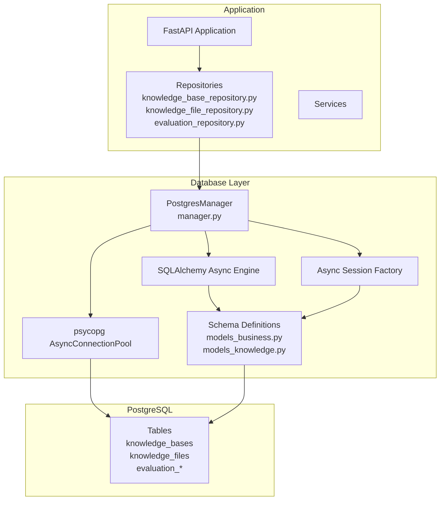
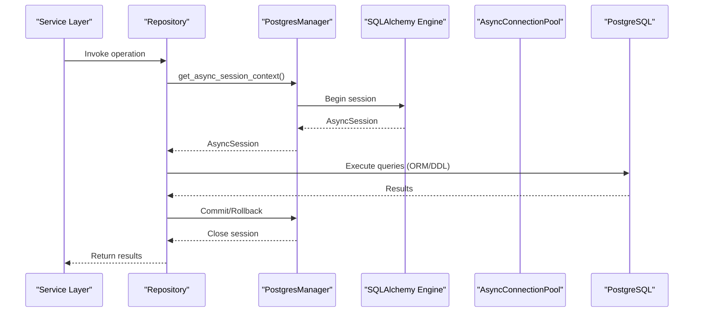
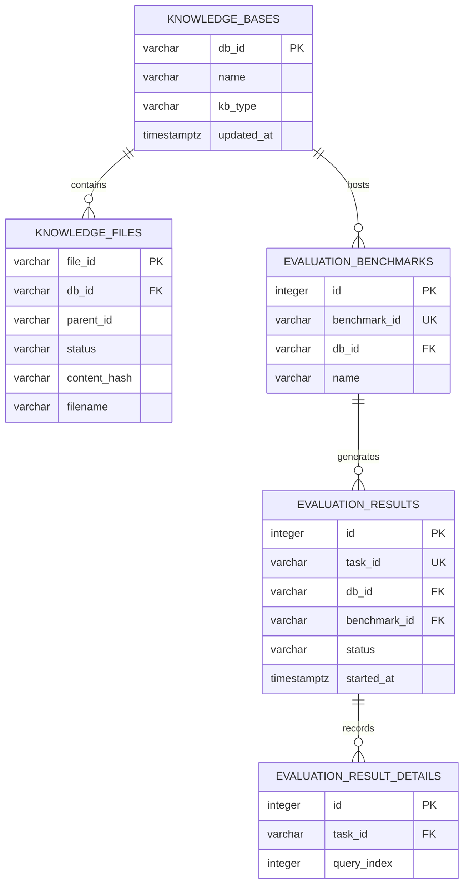
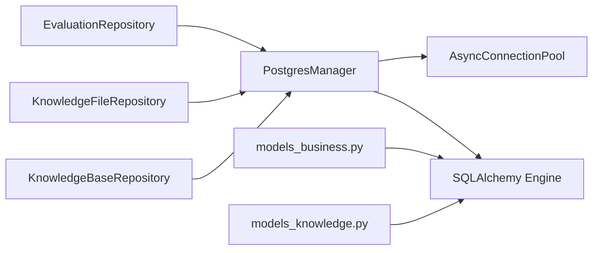

# Database Optimization

<cite>
**Referenced Files in This Document**
- [manager.py](file://backend/package/yuxi/storage/postgres/manager.py)
- [models_business.py](file://backend/package/yuxi/storage/postgres/models_business.py)
- [models_knowledge.py](file://backend/package/yuxi/storage/postgres/models_knowledge.py)
- [knowledge_base_repository.py](file://backend/package/yuxi/repositories/knowledge_base_repository.py)
- [knowledge_file_repository.py](file://backend/package/yuxi/repositories/knowledge_file_repository.py)
- [evaluation_repository.py](file://backend/package/yuxi/repositories/evaluation_repository.py)
- [migrate.py](file://backend/server/utils/migrate.py)
- [singleton.py](file://backend/server/utils/singleton.py)
</cite>

## Table of Contents
1. [Introduction](#introduction)
2. [Project Structure](#project-structure)
3. [Core Components](#core-components)
4. [Architecture Overview](#architecture-overview)
5. [Detailed Component Analysis](#detailed-component-analysis)
6. [Dependency Analysis](#dependency-analysis)
7. [Performance Considerations](#performance-considerations)
8. [Troubleshooting Guide](#troubleshooting-guide)
9. [Conclusion](#conclusion)
10. [Appendices](#appendices)

## Introduction
This document provides comprehensive database optimization guidance for the Yuxi platform, focusing on PostgreSQL configuration, indexing strategies, query optimization, schema design, maintenance, and operational best practices. It synthesizes the repository’s database management layer, schema definitions, and repository patterns to deliver actionable recommendations for connection pooling, indexing, pagination, JOINs, partitioning, and maintenance routines.

## Project Structure
The database layer centers around a singleton PostgreSQL manager that initializes two connection mechanisms:
- An asynchronous SQLAlchemy engine/session factory for ORM-driven operations.
- A dedicated native AsyncConnectionPool for LangGraph checkpoints requiring autocommit semantics.

**Diagram sources**
- [manager.py:28-90](file://backend/package/yuxi/storage/postgres/manager.py#L28-L90)
- [models_business.py:23-706](file://backend/package/yuxi/storage/postgres/models_business.py#L23-L706)
- [models_knowledge.py:23-139](file://backend/package/yuxi/storage/postgres/models_knowledge.py#L23-L139)

**Section sources**
- [manager.py:28-90](file://backend/package/yuxi/storage/postgres/manager.py#L28-L90)
- [models_business.py:23-706](file://backend/package/yuxi/storage/postgres/models_business.py#L23-L706)
- [models_knowledge.py:23-139](file://backend/package/yuxi/storage/postgres/models_knowledge.py#L23-L139)

## Core Components
- PostgresManager: Centralizes initialization of SQLAlchemy async engine, ORM session factory, and a separate AsyncConnectionPool for LangGraph. It also exposes helpers to ensure schema compatibility via SQL DDL statements and indexes.
- Schema models: Define tables for business data (users, departments, conversations, etc.) and knowledge/evaluation domains (knowledge_bases, knowledge_files, evaluation_benchmarks/results/details).
- Repositories: Encapsulate CRUD and query patterns for knowledge and evaluation domains, consistently using the shared async session context.

Key configuration highlights:
- SQLAlchemy engine settings include JSON serialization hooks and connection lifecycle controls.
- AsyncConnectionPool configured with a fixed max_size and autocommit for LangGraph checkpointing.
- Index creation for frequently filtered/sorted columns across knowledge and evaluation tables.

**Section sources**
- [manager.py:28-90](file://backend/package/yuxi/storage/postgres/manager.py#L28-L90)
- [manager.py:119-178](file://backend/package/yuxi/storage/postgres/manager.py#L119-L178)
- [models_business.py:51-131](file://backend/package/yuxi/storage/postgres/models_business.py#L51-L131)
- [models_knowledge.py:23-139](file://backend/package/yuxi/storage/postgres/models_knowledge.py#L23-L139)
- [knowledge_base_repository.py:11-44](file://backend/package/yuxi/repositories/knowledge_base_repository.py#L11-L44)
- [knowledge_file_repository.py:11-52](file://backend/package/yuxi/repositories/knowledge_file_repository.py#L11-L52)
- [evaluation_repository.py:11-119](file://backend/package/yuxi/repositories/evaluation_repository.py#L11-L119)

## Architecture Overview
The database architecture separates concerns:
- ORM layer for general business operations.
- Native pool for specialized workflows (LangGraph).
- Repositories mediate between services and the database, ensuring consistent transactional behavior and error handling.

**Diagram sources**
- [manager.py:235-248](file://backend/package/yuxi/storage/postgres/manager.py#L235-L248)
- [knowledge_base_repository.py:13-25](file://backend/package/yuxi/repositories/knowledge_base_repository.py#L13-L25)
- [evaluation_repository.py:14-21](file://backend/package/yuxi/repositories/evaluation_repository.py#L14-L21)

## Detailed Component Analysis

### Connection Pooling and Management
- SQLAlchemy async engine: Configured with JSON serializer/deserializer hooks and pool pre-ping/recycle to maintain healthy connections.
- AsyncConnectionPool for LangGraph: Dedicated pool with autocommit enabled and a fixed max_size suitable for concurrent agent runs.
- Singleton pattern: Ensures a single manager instance across the application lifecycle.

Operational guidance:
- Tune max_size based on observed concurrency of agent runs and LangGraph checkpoints.
- Monitor pool utilization and adjust pool_pre_ping and pool_recycle according to workload and connection churn.
- Prefer the shared session context for ORM operations to ensure consistent transaction boundaries.

**Section sources**
- [manager.py:55-61](file://backend/package/yuxi/storage/postgres/manager.py#L55-L61)
- [manager.py:79-83](file://backend/package/yuxi/storage/postgres/manager.py#L79-L83)
- [singleton.py:4-17](file://backend/server/utils/singleton.py#L4-L17)

### Indexing Strategies for Frequently Queried Columns
Indexes are created for:
- knowledge_bases: kb_type, name, db_id (unique), timestamps.
- knowledge_files: db_id, parent_id, status, content_hash, file_id (unique).
- evaluation_benchmarks: db_id, benchmark_id (unique).
- evaluation_results: db_id, status, started_at desc, task_id (unique).
- evaluation_result_details: task_id, composite (task_id, query_index).

Recommended coverage:
- Add selective filters: status, kb_type, db_id.
- Add ordering indexes: started_at desc for time-series sorting.
- Consider covering indexes for hot report queries combining db_id + status + timestamps.

**Diagram sources**
- [models_knowledge.py:23-139](file://backend/package/yuxi/storage/postgres/models_knowledge.py#L23-L139)
- [manager.py:167-177](file://backend/package/yuxi/storage/postgres/manager.py#L167-L177)

**Section sources**
- [manager.py:167-177](file://backend/package/yuxi/storage/postgres/manager.py#L167-L177)
- [models_knowledge.py:23-139](file://backend/package/yuxi/storage/postgres/models_knowledge.py#L23-L139)

### Query Optimization Techniques for Large Datasets
- Pagination: Use OFFSET/LIMIT with stable sort keys (e.g., created_at desc) to avoid expensive ORDER BY on large unindexed sets.
- Efficient JOINs: Prefer INNER JOINs with indexed foreign keys; filter early using WHERE clauses to reduce intermediate result sizes.
- Selectivity: Narrow results with targeted WHERE predicates on indexed columns (db_id, status, kb_type).
- Aggregation: Use window functions or materialized summaries for frequently accessed metrics.

Repository patterns:
- Repositories consistently wrap operations in a shared async session context, enabling controlled transactions and rollbacks.

**Section sources**
- [knowledge_base_repository.py:17-20](file://backend/package/yuxi/repositories/knowledge_base_repository.py#L17-L20)
- [knowledge_file_repository.py:23-26](file://backend/package/yuxi/repositories/knowledge_file_repository.py#L23-L26)
- [evaluation_repository.py:31-38](file://backend/package/yuxi/repositories/evaluation_repository.py#L31-L38)

### Schema Design Patterns and Partitioning Considerations
- JSON/JSONB fields: Use JSONB for knowledge_bases and knowledge_files to support flexible metadata and efficient containment operations.
- Timestamps: Use TIMESTAMPTZ for precise temporal queries and timezone-aware analytics.
- Foreign keys: Enforce referential integrity with CASCADE/SET NULL where appropriate (e.g., db_id FKs).
- Partitioning: For very large evaluation_results tables, consider table partitioning by time (started_at) or db_id to improve maintenance and query performance.

[No sources needed since this section provides general guidance]

### Practical Examples: Slow Query Identification and Plan Optimization
- Use EXPLAIN ANALYZE to inspect query plans for long-running reports or bulk operations.
- Focus on eliminating sequential scans on large tables by adding appropriate indexes.
- For time-series queries, ensure indexes cover both partition keys and sort columns.

[No sources needed since this section provides general guidance]

### Connection Management Best Practices
- Use the shared async session context to ensure consistent commit/rollback semantics.
- Avoid long-running transactions; keep sessions short-lived.
- For write-heavy workloads, stagger batch writes and monitor pool exhaustion.

**Section sources**
- [manager.py:235-248](file://backend/package/yuxi/storage/postgres/manager.py#L235-L248)

### Transaction Isolation and Deadlock Prevention
- Keep transactions small and fast; minimize lock contention.
- Access related entities in a consistent order to prevent deadlocks.
- Use READ COMMITTED for most operations; escalate to SERIALIZABLE only when necessary.

[No sources needed since this section provides general guidance]

### Maintenance Tasks
- Vacuum/Analyze: Schedule periodic VACUUM FULL and ANALYZE for heavily updated tables.
- Statistics Updates: Ensure ANALYZE runs after large DML batches.
- Index Rebuilding: Periodically REINDEX or rebuild stale indexes if fragmentation is suspected.

[No sources needed since this section provides general guidance]

## Dependency Analysis
The database layer exhibits low coupling and high cohesion:
- Repositories depend on PostgresManager for sessions.
- Models define schema contracts; managers apply DDL/index changes.
- Singleton ensures centralized configuration and lifecycle.

**Diagram sources**
- [manager.py:28-90](file://backend/package/yuxi/storage/postgres/manager.py#L28-L90)
- [knowledge_base_repository.py:7](file://backend/package/yuxi/repositories/knowledge_base_repository.py#L7)
- [knowledge_file_repository.py:7](file://backend/package/yuxi/repositories/knowledge_file_repository.py#L7)
- [evaluation_repository.py:7](file://backend/package/yuxi/repositories/evaluation_repository.py#L7)
- [models_business.py:23](file://backend/package/yuxi/storage/postgres/models_business.py#L23)
- [models_knowledge.py:17](file://backend/package/yuxi/storage/postgres/models_knowledge.py#L17)

**Section sources**
- [manager.py:28-90](file://backend/package/yuxi/storage/postgres/manager.py#L28-L90)
- [knowledge_base_repository.py:7](file://backend/package/yuxi/repositories/knowledge_base_repository.py#L7)
- [knowledge_file_repository.py:7](file://backend/package/yuxi/repositories/knowledge_file_repository.py#L7)
- [evaluation_repository.py:7](file://backend/package/yuxi/repositories/evaluation_repository.py#L7)
- [models_business.py:23](file://backend/package/yuxi/storage/postgres/models_business.py#L23)
- [models_knowledge.py:17](file://backend/package/yuxi/storage/postgres/models_knowledge.py#L17)

## Performance Considerations
- Connection pool sizing: Align max_size with peak concurrent agent runs; monitor wait times and timeouts.
- Index coverage: Ensure hot query predicates hit indexes; avoid partial index misuse.
- Query patterns: Favor indexed sorts and seeks; avoid expressions on indexed columns in WHERE clauses.
- Batch operations: Use bulk inserts/updates and minimize round-trips.

[No sources needed since this section provides general guidance]

## Troubleshooting Guide
Common issues and remedies:
- Initialization failures: Verify POSTGRES_URL environment variable and connectivity; check logs for initialization errors.
- Pool exhaustion: Increase max_size cautiously; review transaction durations and session lifecycles.
- Slow queries: Add missing indexes for frequent filters/sorts; rewrite queries to leverage existing indexes.
- Migration drift: Run ensure_knowledge_schema/ensure_business_schema to reconcile schema differences.

**Section sources**
- [manager.py:45-51](file://backend/package/yuxi/storage/postgres/manager.py#L45-L51)
- [manager.py:119-178](file://backend/package/yuxi/storage/postgres/manager.py#L119-L178)
- [migrate.py:180-241](file://backend/server/utils/migrate.py#L180-L241)

## Conclusion
By leveraging the centralized PostgresManager, maintaining robust indexes, optimizing query patterns, and following disciplined maintenance routines, the Yuxi platform can achieve reliable, scalable database performance. Apply the recommendations here to enhance throughput, reduce latency, and simplify operational overhead.

## Appendices

### Appendix A: Environment and Configuration
- Connection string: Provided via POSTGRES_URL; ensure it matches the target PostgreSQL instance.
- JSON handling: SQLAlchemy engine configured with JSON serializer/deserializer hooks.

**Section sources**
- [manager.py:45-61](file://backend/package/yuxi/storage/postgres/manager.py#L45-L61)

### Appendix B: Schema Compatibility and Migration
- ensure_knowledge_schema and ensure_business_schema apply incremental DDL to align legacy databases with evolving models.
- migrate.py orchestrates SQLite-based migrations; while not PostgreSQL-specific, it demonstrates safe migration practices (backup, atomicity, versioning).

**Section sources**
- [manager.py:119-178](file://backend/package/yuxi/storage/postgres/manager.py#L119-L178)
- [migrate.py:180-241](file://backend/server/utils/migrate.py#L180-L241)