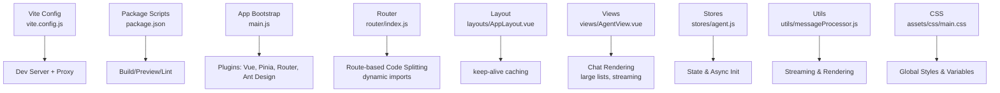
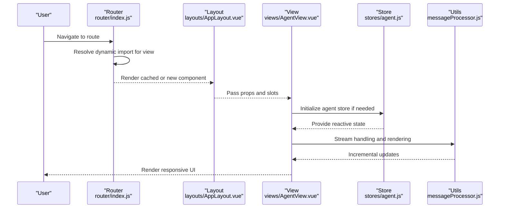
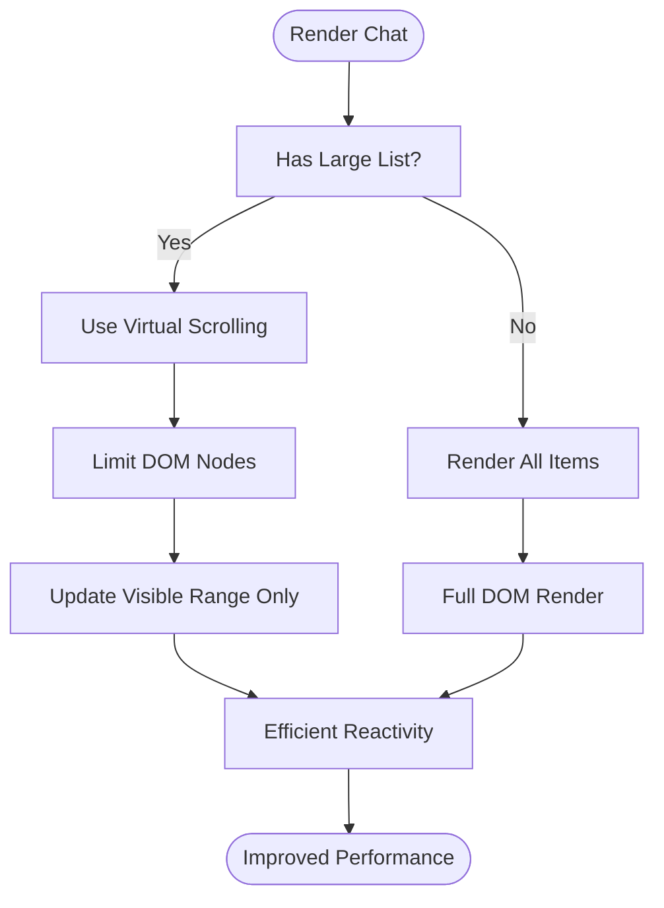
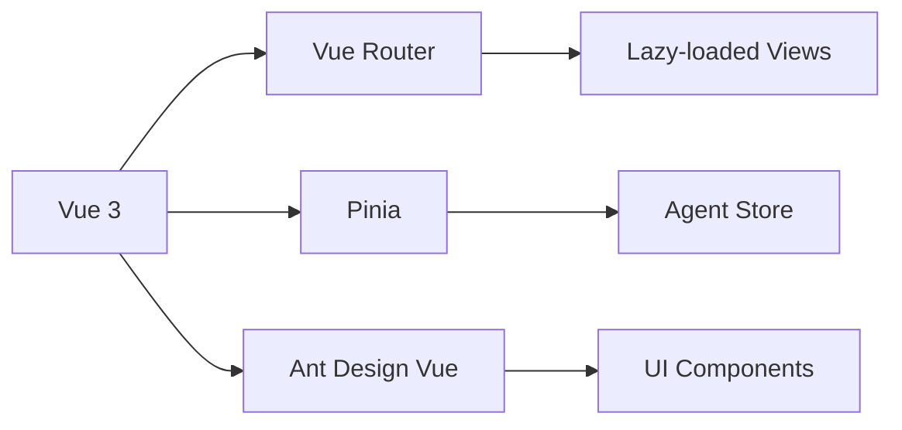

# Frontend Optimization

<cite>
**Referenced Files in This Document**
- [vite.config.js](file://web/vite.config.js)
- [package.json](file://web/package.json)
- [main.js](file://web/src/main.js)
- [router/index.js](file://web/src/router/index.js)
- [App.vue](file://web/src/App.vue)
- [layouts/AppLayout.vue](file://web/src/layouts/AppLayout.vue)
- [views/AgentView.vue](file://web/src/views/AgentView.vue)
- [stores/agent.js](file://web/src/stores/agent.js)
- [utils/messageProcessor.js](file://web/src/utils/messageProcessor.js)
- [utils/scrollController.js](file://web/src/utils/scrollController.js)
- [composables/useStreamSmoother.js](file://web/src/composables/useStreamSmoother.js)
- [assets/css/main.css](file://web/src/assets/css/main.css)
</cite>

## Table of Contents
1. [Introduction](#introduction)
2. [Project Structure](#project-structure)
3. [Core Components](#core-components)
4. [Architecture Overview](#architecture-overview)
5. [Detailed Component Analysis](#detailed-component-analysis)
6. [Dependency Analysis](#dependency-analysis)
7. [Performance Considerations](#performance-considerations)
8. [Troubleshooting Guide](#troubleshooting-guide)
9. [Conclusion](#conclusion)
10. [Appendices](#appendices)

## Introduction
This document provides comprehensive frontend optimization guidance for the Yuxi Vue.js application. It focuses on modern build tooling, route-based code splitting, component lazy loading, asset optimization, performance monitoring, component-level optimizations, caching and CDN strategies, and Progressive Web App readiness. The recommendations are grounded in the current codebase and aim to improve perceived and actual performance, maintainability, and user experience across devices and network conditions.

## Project Structure
The frontend is a Vue 3 application built with Vite. Key areas relevant to optimization:
- Build and dev server configuration
- Application bootstrap and plugin registration
- Routing with route-based code splitting via dynamic imports
- Layout and keep-alive for selective caching
- Stores and composables for streaming and rendering efficiency
- CSS organization and global styles

**Diagram sources**
- [vite.config.js:1-30](file://web/vite.config.js#L1-L30)
- [package.json:1-51](file://web/package.json#L1-L51)
- [main.js:1-26](file://web/src/main.js#L1-L26)
- [router/index.js:1-200](file://web/src/router/index.js#L1-L200)
- [layouts/AppLayout.vue:1-545](file://web/src/layouts/AppLayout.vue#L1-L545)
- [views/AgentView.vue:1-384](file://web/src/views/AgentView.vue#L1-L384)
- [stores/agent.js:1-567](file://web/src/stores/agent.js#L1-L567)
- [utils/messageProcessor.js:1-491](file://web/src/utils/messageProcessor.js#L1-L491)
- [assets/css/main.css:1-59](file://web/src/assets/css/main.css#L1-L59)

**Section sources**
- [vite.config.js:1-30](file://web/vite.config.js#L1-L30)
- [package.json:1-51](file://web/package.json#L1-L51)
- [main.js:1-26](file://web/src/main.js#L1-L26)
- [router/index.js:1-200](file://web/src/router/index.js#L1-L200)
- [layouts/AppLayout.vue:1-545](file://web/src/layouts/AppLayout.vue#L1-L545)
- [views/AgentView.vue:1-384](file://web/src/views/AgentView.vue#L1-L384)
- [stores/agent.js:1-567](file://web/src/stores/agent.js#L1-L567)
- [utils/messageProcessor.js:1-491](file://web/src/utils/messageProcessor.js#L1-L491)
- [assets/css/main.css:1-59](file://web/src/assets/css/main.css#L1-L59)

## Core Components
- Route-based code splitting: Implemented via dynamic imports per route, enabling lazy loading of views and reducing initial bundle size.
- Keep-alive caching: Applied selectively in the layout to cache rendered route components during navigation.
- Streaming and rendering: Utilities and composables manage incremental rendering of long streams to keep UI responsive.
- CSS organization: Centralized main stylesheet imports and global variables for consistent styling.

Practical implications:
- Users navigate quickly to cached routes; new routes load lazily.
- Large chat histories benefit from streaming rendering and controlled updates.
- Global styles and variables streamline maintenance and reduce duplication.

**Section sources**
- [router/index.js:18-121](file://web/src/router/index.js#L18-L121)
- [layouts/AppLayout.vue:221-226](file://web/src/layouts/AppLayout.vue#L221-L226)
- [utils/messageProcessor.js:406-487](file://web/src/utils/messageProcessor.js#L406-L487)
- [assets/css/main.css:1-59](file://web/src/assets/css/main.css#L1-L59)

## Architecture Overview
The frontend architecture leverages Vue 3’s Composition API, Pinia for state, and Vite for fast builds. Routing is configured with dynamic imports for code splitting. The layout conditionally caches route components, and the chat view orchestrates streaming rendering.

**Diagram sources**
- [router/index.js:1-200](file://web/src/router/index.js#L1-L200)
- [layouts/AppLayout.vue:1-545](file://web/src/layouts/AppLayout.vue#L1-L545)
- [views/AgentView.vue:1-384](file://web/src/views/AgentView.vue#L1-L384)
- [stores/agent.js:1-567](file://web/src/stores/agent.js#L1-L567)
- [utils/messageProcessor.js:1-491](file://web/src/utils/messageProcessor.js#L1-L491)

## Detailed Component Analysis

### Route-Based Code Splitting and Lazy Loading
- Dynamic imports are used for each route view, ensuring that only the required code for the current route is loaded initially.
- The router guards handle authentication and initialization, minimizing unnecessary work on cached routes.

Optimization opportunities:
- Group related routes under shared parents to share chunks.
- Consider preloading near-future routes based on user behavior.
- Use route meta hints to prefetch critical assets alongside route chunks.

**Section sources**
- [router/index.js:18-121](file://web/src/router/index.js#L18-L121)

### Keep-Alive Caching in Layout
- The layout wraps router-view with keep-alive for routes that opt-in via meta.keepAlive, reducing re-mount overhead and preserving scroll positions.

Best practices:
- Apply keep-alive to frequently visited, heavy components.
- Avoid keep-alive for components with external subscriptions or timers.
- Use include/exclude filters to control caching scope.

**Section sources**
- [layouts/AppLayout.vue:221-226](file://web/src/layouts/AppLayout.vue#L221-L226)

### Component Lazy Loading Patterns
- Views and components are lazy-loaded via dynamic imports in routes and templates.
- Consider lazy-loading heavy third-party libraries inside components to further reduce initial payload.

Recommendations:
- Wrap heavy imports in dynamic imports within components that are not immediately visible.
- Use Suspense boundaries for predictable fallbacks during component loading.

**Section sources**
- [router/index.js:18-121](file://web/src/router/index.js#L18-L121)
- [views/AgentView.vue:86-88](file://web/src/views/AgentView.vue#L86-L88)

### Asset Optimization
- CSS: Consolidated imports in main.css centralize styles and variables.
- Consider extracting critical CSS for above-the-fold content and deferring non-critical CSS.
- Minimize and compress images; leverage modern formats (AVIF/WebP) with fallbacks.

Implementation pointers:
- Use Vite plugins for CSS extraction and autoprefixing.
- Optimize images with automated tooling and responsive sizes.

**Section sources**
- [assets/css/main.css:1-59](file://web/src/assets/css/main.css#L1-L59)

### JavaScript Bundle Analysis and Tree Shaking
- Vite’s default bundling and ES modules support tree shaking.
- Audit bundles regularly to identify oversized dependencies and remove unused exports.

Actionable steps:
- Run bundle analysis during CI.
- Prefer side-effect-free module designs.
- Remove unused dependencies and dead code.

**Section sources**
- [package.json:14-39](file://web/package.json#L14-L39)

### Performance Monitoring with Chrome DevTools, Lighthouse, and Web Vitals
- Use Chrome DevTools Performance panel to record interactions and inspect long tasks.
- Run Lighthouse reports to track Core Web Vitals and discover optimizations.
- Track Web Vitals in production using the Web Vitals extension or analytics.

Focus areas:
- Largest Contentful Paint (LCP): defer non-critical resources, optimize fonts and images.
- First Input Delay (FID): minimize main-thread work, use idle callbacks.
- Cumulative Layout Shift (CLS): reserve space for images and ads.

**Section sources**
- [router/index.js:125-197](file://web/src/router/index.js#L125-L197)

### Component Performance Optimization
- Virtual scrolling for large lists: Implement virtual lists for chat histories and file trees to limit DOM nodes.
- Memoization: Use computed and shallowReactive/ref for derived state to avoid unnecessary recomputations.
- Efficient reactivity: Batch updates and avoid frequent deep mutations.

[No sources needed since this diagram shows conceptual workflow, not actual code structure]

**Section sources**
- [utils/messageProcessor.js:406-487](file://web/src/utils/messageProcessor.js#L406-L487)

### Streaming Rendering and UI Responsiveness
- MessageProcessor handles streaming chunks and incremental rendering.
- useStreamSmoother smooths rendering bursts and controls emission pacing.

Recommendations:
- Tune smoothing parameters based on device class.
- Debounce or throttle UI updates after large batches.
- Use requestAnimationFrame for smooth animations.

**Section sources**
- [utils/messageProcessor.js:406-487](file://web/src/utils/messageProcessor.js#L406-L487)
- [composables/useStreamSmoother.js:1-436](file://web/src/composables/useStreamSmoother.js#L1-L436)

### Store Initialization and Navigation Guards
- Router guards check authentication and initialize stores before navigation.
- Agent store manages async initialization and caching of agent configs.

Guidance:
- Defer heavy initialization until after authentication.
- Cache initialization results to avoid repeated work.

**Section sources**
- [router/index.js:125-197](file://web/src/router/index.js#L125-L197)
- [stores/agent.js:120-176](file://web/src/stores/agent.js#L120-L176)

### CSS and Global Styles
- Centralized imports in main.css simplify maintenance.
- Define layout and icon button styles consistently.

Tips:
- Extract critical CSS for above-the-fold.
- Use CSS custom properties for themes and dark mode.

**Section sources**
- [assets/css/main.css:1-59](file://web/src/assets/css/main.css#L1-L59)

## Dependency Analysis
The application relies on Vue 3, Vue Router, Pinia, and Ant Design Vue. Third-party libraries include visualization and charting tools. Dependency health impacts bundle size and runtime performance.

**Diagram sources**
- [package.json:14-39](file://web/package.json#L14-L39)
- [main.js:1-26](file://web/src/main.js#L1-L26)
- [router/index.js:1-200](file://web/src/router/index.js#L1-L200)
- [stores/agent.js:1-567](file://web/src/stores/agent.js#L1-L567)

**Section sources**
- [package.json:14-39](file://web/package.json#L14-L39)
- [main.js:1-26](file://web/src/main.js#L1-L26)

## Performance Considerations
- Build tooling: Use Vite’s native ES module support and lazy loading defaults.
- Network: Enable HTTP/2 or HTTP/3, gzip/br compression, and CDN distribution.
- Caching: Leverage browser cache headers, service worker precaching, and stale-while-revalidate strategies.
- Rendering: Prefer virtualization, memoization, and efficient reactivity patterns.
- Observability: Integrate Web Vitals reporting and periodic Lighthouse checks.

[No sources needed since this section provides general guidance]

## Troubleshooting Guide
Common issues and remedies:
- Slow initial load: Verify code splitting and remove unused dependencies.
- Stalls during streaming: Adjust smoothing parameters and ensure UI updates are batched.
- Memory leaks: Avoid global listeners and clean up timers in onUnmounted hooks.
- Authentication redirects: Confirm router guards and session state handling.

**Section sources**
- [router/index.js:125-197](file://web/src/router/index.js#L125-L197)
- [utils/scrollController.js:1-206](file://web/src/utils/scrollController.js#L1-L206)
- [utils/messageProcessor.js:406-487](file://web/src/utils/messageProcessor.js#L406-L487)

## Conclusion
By leveraging route-based code splitting, selective keep-alive caching, streaming rendering, and robust performance monitoring, the Yuxi Vue.js application can achieve faster startup, smoother interactions, and improved user satisfaction. Adopting the recommendations here will help sustain performance as the application evolves.

[No sources needed since this section summarizes without analyzing specific files]

## Appendices

### Practical Build and Optimization References
- Vite configuration and plugins: [vite.config.js:1-30](file://web/vite.config.js#L1-L30)
- Package scripts and dependencies: [package.json:1-51](file://web/package.json#L1-L51)
- Application bootstrap: [main.js:1-26](file://web/src/main.js#L1-L26)
- Router and guards: [router/index.js:1-200](file://web/src/router/index.js#L1-L200)
- Layout and caching: [layouts/AppLayout.vue:1-545](file://web/src/layouts/AppLayout.vue#L1-L545)
- View orchestration: [views/AgentView.vue:1-384](file://web/src/views/AgentView.vue#L1-L384)
- Store initialization: [stores/agent.js:1-567](file://web/src/stores/agent.js#L1-L567)
- Streaming utilities: [utils/messageProcessor.js:1-491](file://web/src/utils/messageProcessor.js#L1-L491)
- Scroll utilities: [utils/scrollController.js:1-206](file://web/src/utils/scrollController.js#L1-L206)
- CSS foundation: [assets/css/main.css:1-59](file://web/src/assets/css/main.css#L1-L59)