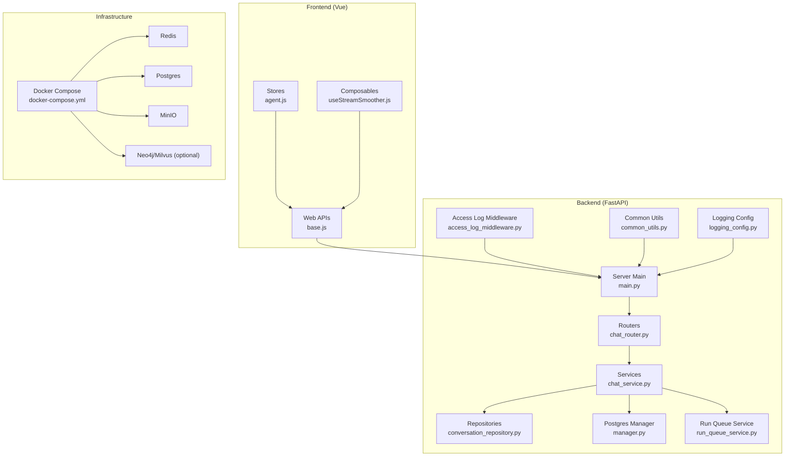
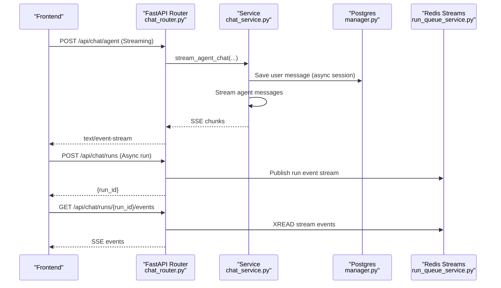
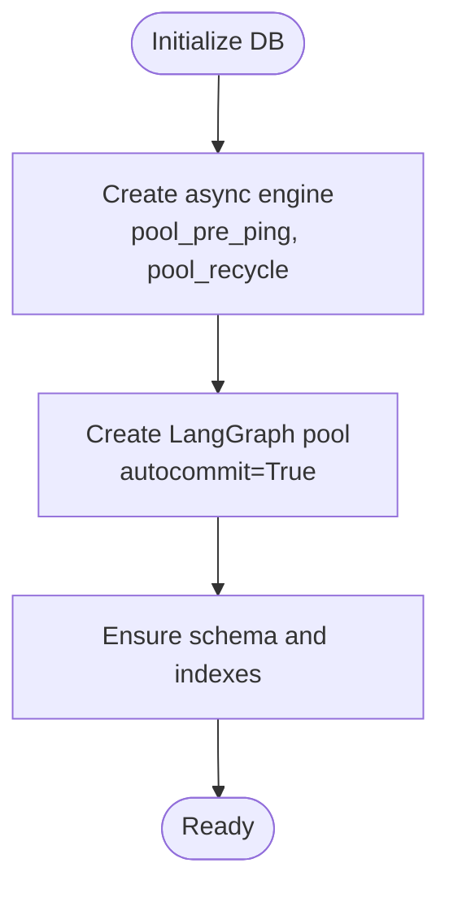
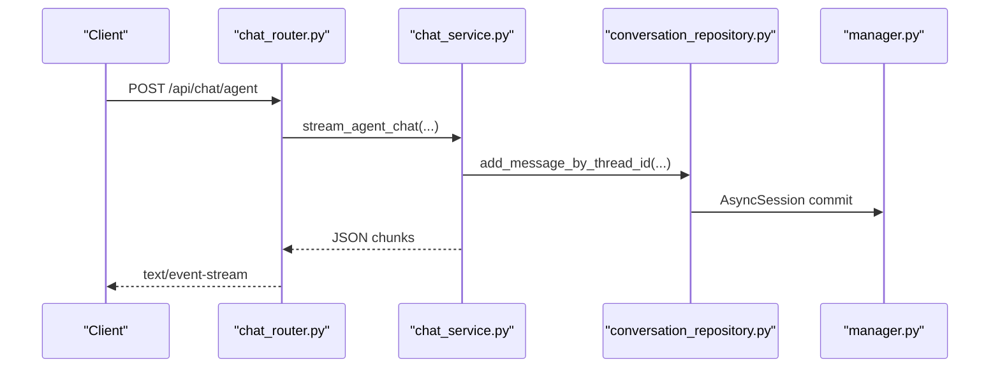
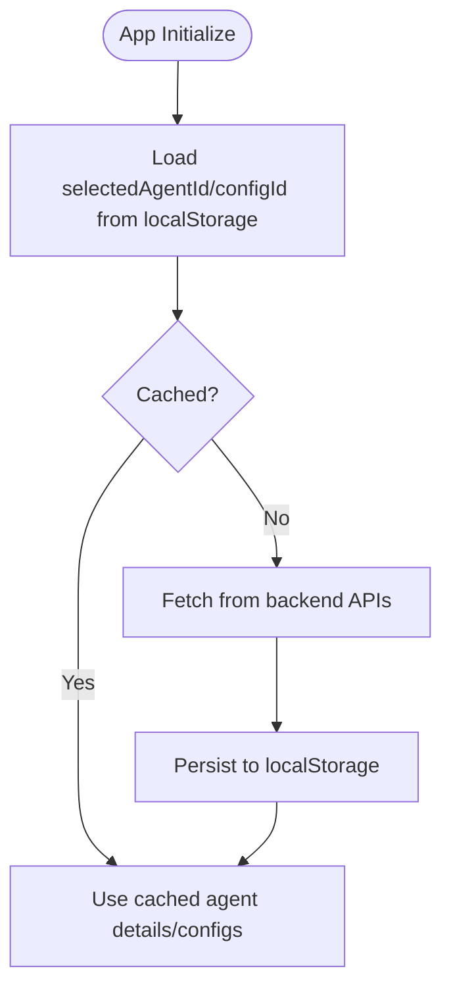
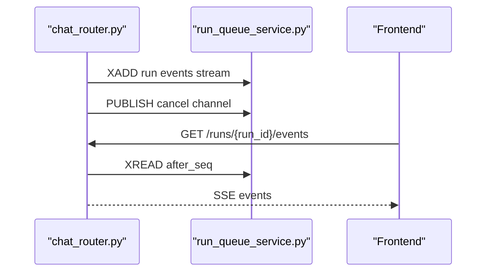
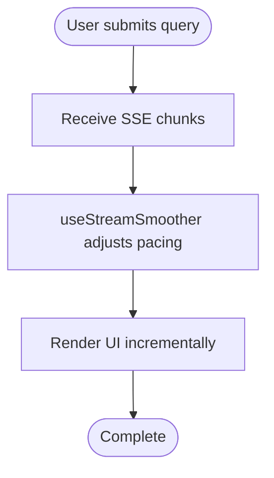
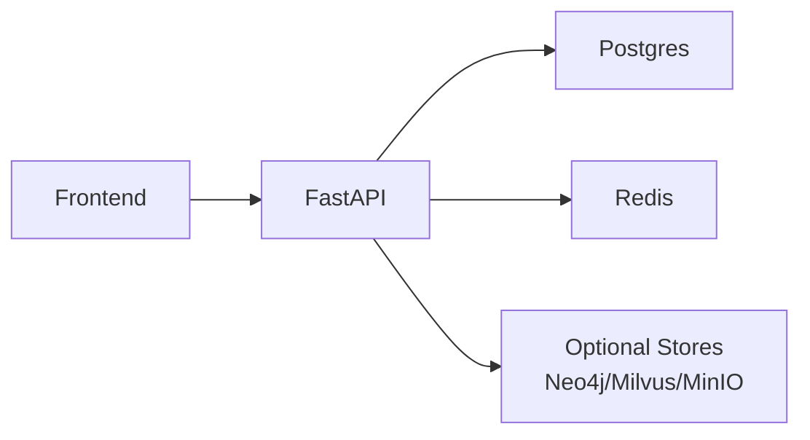

# Performance & Optimization

<cite>
**Referenced Files in This Document**
- [docker-compose.yml](file://docker-compose.yml)
- [main.py](file://backend/server/main.py)
- [access_log_middleware.py](file://backend/server/utils/access_log_middleware.py)
- [common_utils.py](file://backend/server/utils/common_utils.py)
- [manager.py](file://backend/package/yuxi/storage/postgres/manager.py)
- [conversation_repository.py](file://backend/package/yuxi/repositories/conversation_repository.py)
- [chat_router.py](file://backend/server/routers/chat_router.py)
- [chat_service.py](file://backend/package/yuxi/services/chat_service.py)
- [run_queue_service.py](file://backend/package/yuxi/services/run_queue_service.py)
- [logging_config.py](file://backend/package/yuxi/utils/logging_config.py)
- [base.js](file://web/src/apis/base.js)
- [vite.config.js](file://web/vite.config.js)
- [agent.js](file://web/src/stores/agent.js)
- [useStreamSmoother.js](file://web/src/composables/useStreamSmoother.js)
</cite>

## Table of Contents
1. [Introduction](#introduction)
2. [Project Structure](#project-structure)
3. [Core Components](#core-components)
4. [Architecture Overview](#architecture-overview)
5. [Detailed Component Analysis](#detailed-component-analysis)
6. [Dependency Analysis](#dependency-analysis)
7. [Performance Considerations](#performance-considerations)
8. [Troubleshooting Guide](#troubleshooting-guide)
9. [Conclusion](#conclusion)
10. [Appendices](#appendices)

## Introduction
This document provides a comprehensive performance and optimization guide for the Yuxi platform. It covers database optimization (indexing, queries, connection pooling), caching strategies, API performance (batching, streaming, rate limiting), frontend optimization (lazy loading, code splitting, asset optimization), resource management (agents, concurrency), practical profiling and bottleneck identification, scalability and load testing, and monitoring/alerting for performance metrics.

## Project Structure
The Yuxi platform is a FastAPI-based backend with a Vue 3 frontend, orchestrated via Docker Compose. The backend integrates PostgreSQL for persistence, Redis for asynchronous queues and run events, and optional external services (Neo4j, Milvus, MinIO). The frontend uses Pinia stores and composable utilities to manage state and optimize streaming responses.

**Diagram sources**
- [docker-compose.yml](file://docker-compose.yml)
- [main.py](file://backend/server/main.py)
- [access_log_middleware.py](file://backend/server/utils/access_log_middleware.py)
- [common_utils.py](file://backend/server/utils/common_utils.py)
- [manager.py](file://backend/package/yuxi/storage/postgres/manager.py)
- [conversation_repository.py](file://backend/package/yuxi/repositories/conversation_repository.py)
- [chat_router.py](file://backend/server/routers/chat_router.py)
- [chat_service.py](file://backend/package/yuxi/services/chat_service.py)
- [run_queue_service.py](file://backend/package/yuxi/services/run_queue_service.py)
- [logging_config.py](file://backend/package/yuxi/utils/logging_config.py)
- [base.js](file://web/src/apis/base.js)
- [agent.js](file://web/src/stores/agent.js)
- [useStreamSmoother.js](file://web/src/composables/useStreamSmoother.js)

**Section sources**
- [docker-compose.yml](file://docker-compose.yml)
- [main.py](file://backend/server/main.py)

## Core Components
- Database layer: Asynchronous SQLAlchemy engine with connection pooling and a dedicated LangGraph pool; schema migration and index creation are automated during initialization.
- API layer: FastAPI with access logging, rate limiting for sensitive endpoints, and streaming responses for long-running tasks.
- Run queue: Redis-backed streams and pub/sub for run lifecycle events and cancellation signals.
- Frontend: Unified API wrapper with standardized error handling, Pinia stores for caching and initialization, and a streaming smoother for UI responsiveness.

**Section sources**
- [manager.py](file://backend/package/yuxi/storage/postgres/manager.py)
- [main.py](file://backend/server/main.py)
- [access_log_middleware.py](file://backend/server/utils/access_log_middleware.py)
- [run_queue_service.py](file://backend/package/yuxi/services/run_queue_service.py)
- [base.js](file://web/src/apis/base.js)
- [agent.js](file://web/src/stores/agent.js)
- [useStreamSmoother.js](file://web/src/composables/useStreamSmoother.js)

## Architecture Overview
The platform follows a streaming-first API design for agent interactions, with Redis for asynchronous run orchestration and PostgreSQL for durable state. The frontend optimizes UX by smoothing streamed chunks and caching frequently accessed data.

**Diagram sources**
- [chat_router.py](file://backend/server/routers/chat_router.py)
- [chat_service.py](file://backend/package/yuxi/services/chat_service.py)
- [manager.py](file://backend/package/yuxi/storage/postgres/manager.py)
- [run_queue_service.py](file://backend/package/yuxi/services/run_queue_service.py)

## Detailed Component Analysis

### Database Optimization (PostgreSQL)
- Connection pooling and engine tuning:
  - Asynchronous SQLAlchemy engine configured with JSON serializers and pre-ping/recycle for robustness.
  - Dedicated LangGraph pool using psycopg_pool with autocommit enabled for checkpoint compatibility.
- Schema and indexes:
  - Automated schema migrations add JSONB fields and indexes for knowledge bases, files, evaluations, and agent runs.
  - Indexes on frequent filters: knowledge base type/name, file db_id/parent/status/hash, evaluation results status/started, and agent runs user/thread/status timestamps.
- Recommendations:
  - Add partial indexes for high-cardinality filters (e.g., status='active').
  - Consider GIN indexes for JSONB fields if heavy filtering is introduced.
  - Monitor slow queries via access logs and pg_stat_statements.

**Diagram sources**
- [manager.py](file://backend/package/yuxi/storage/postgres/manager.py)

**Section sources**
- [manager.py](file://backend/package/yuxi/storage/postgres/manager.py)

### API Performance Optimization
- Streaming responses:
  - Chat endpoints return Server-Sent Events for real-time updates, reducing perceived latency.
  - Run events are streamed via Redis streams with configurable TTL and maxlen.
- Rate limiting:
  - Login attempts are rate-limited per IP with sliding window tracking.
- Access logging:
  - Middleware records request duration and status for observability.

**Diagram sources**
- [chat_router.py](file://backend/server/routers/chat_router.py)
- [chat_service.py](file://backend/package/yuxi/services/chat_service.py)
- [conversation_repository.py](file://backend/package/yuxi/repositories/conversation_repository.py)
- [manager.py](file://backend/package/yuxi/storage/postgres/manager.py)

**Section sources**
- [chat_router.py](file://backend/server/routers/chat_router.py)
- [chat_service.py](file://backend/package/yuxi/services/chat_service.py)
- [conversation_repository.py](file://backend/package/yuxi/repositories/conversation_repository.py)
- [access_log_middleware.py](file://backend/server/utils/access_log_middleware.py)
- [main.py](file://backend/server/main.py)

### Caching Strategies
- Frontend caching:
  - Pinia stores persist selected agent and config IDs to localStorage to avoid re-fetching on reload.
  - Agent details and configs are cached until refresh or selection changes.
- Backend caching:
  - No explicit in-process caches are observed; rely on database indexes and efficient queries.
  - Consider Redis for hot data (e.g., agent configs, recent threads) if contention arises.

**Diagram sources**
- [agent.js](file://web/src/stores/agent.js)

**Section sources**
- [agent.js](file://web/src/stores/agent.js)

### Run Queue and Event Streaming
- Redis-backed run events:
  - Streams store structured events with TTL and optional maxlen.
  - Pub/Sub supports cancellation signaling via keys and channels.
- Best practices:
  - Set appropriate TTLs and maxlen to prevent unbounded growth.
  - Normalize stream IDs and handle missing sequences gracefully.

**Diagram sources**
- [chat_router.py](file://backend/server/routers/chat_router.py)
- [run_queue_service.py](file://backend/package/yuxi/services/run_queue_service.py)

**Section sources**
- [run_queue_service.py](file://backend/package/yuxi/services/run_queue_service.py)
- [chat_router.py](file://backend/server/routers/chat_router.py)

### Frontend Optimization
- Lazy loading and code splitting:
  - Vue plugin is configured; ensure route-level code splitting for heavy pages.
- Asset optimization:
  - Vite dev server proxy targets the backend; production builds should enable minification and compression.
- Streaming UX:
  - useStreamSmoother dynamically adjusts chunk sizes and release delays to smooth rendering under bursty streams.

**Diagram sources**
- [useStreamSmoother.js](file://web/src/composables/useStreamSmoother.js)
- [vite.config.js](file://web/vite.config.js)

**Section sources**
- [useStreamSmoother.js](file://web/src/composables/useStreamSmoother.js)
- [vite.config.js](file://web/vite.config.js)

### Resource Management and Concurrency
- Database:
  - Async engine pool and LangGraph pool configured; tune max_size according to workload.
- Redis:
  - Streams TTL and maxlen prevent memory bloat; monitor key counts and memory usage.
- Agents and runs:
  - Streaming reduces memory pressure compared to buffering full responses.
  - Consider run cancellation and timeouts to bound long-running tasks.

**Section sources**
- [manager.py](file://backend/package/yuxi/storage/postgres/manager.py)
- [run_queue_service.py](file://backend/package/yuxi/services/run_queue_service.py)
- [chat_service.py](file://backend/package/yuxi/services/chat_service.py)

## Dependency Analysis
The backend’s performance depends on three primary external systems: PostgreSQL, Redis, and optional vector/graph stores. The frontend depends on the backend’s streaming endpoints and the stability of Redis for run events.

**Diagram sources**
- [docker-compose.yml](file://docker-compose.yml)
- [main.py](file://backend/server/main.py)

**Section sources**
- [docker-compose.yml](file://docker-compose.yml)

## Performance Considerations
- Database
  - Use indexes on JOIN and WHERE columns; monitor slow queries via access logs.
  - Keep JSONB fields minimal; add GIN/GIST indexes if needed.
  - Pool sizing: balance max_size with CPU/memory; test under load.
- API
  - Prefer streaming for long operations; avoid large synchronous payloads.
  - Apply rate limiting to sensitive endpoints; expose Retry-After headers.
  - Centralize logging and ensure low overhead.
- Frontend
  - Split routes and components; defer non-critical resources.
  - Use streaming UI smoothing to maintain responsiveness.
- Infrastructure
  - Scale Redis and Postgres independently; monitor saturation.
  - Use health checks and restart policies in Docker Compose.

[No sources needed since this section provides general guidance]

## Troubleshooting Guide
- Slow requests
  - Enable access logs and correlate with database queries; identify long-running routes.
  - Check Redis stream lag and key sizes.
- Authentication failures
  - Review rate-limiting middleware behavior and client IP extraction.
- Streaming stalls
  - Verify SSE headers and browser support; confirm Redis connectivity and stream TTLs.
- Logging
  - Bridge Python logging to loguru for unified logs; configure file rotation and compression.

**Section sources**
- [access_log_middleware.py](file://backend/server/utils/access_log_middleware.py)
- [main.py](file://backend/server/main.py)
- [logging_config.py](file://backend/package/yuxi/utils/logging_config.py)

## Conclusion
The Yuxi platform leverages streaming APIs, Redis-backed run orchestration, and asynchronous database access to achieve responsive performance. By tuning database indexes and pools, applying rate limiting, optimizing frontend streaming, and monitoring key metrics, the platform can scale effectively under varied workloads.

[No sources needed since this section summarizes without analyzing specific files]

## Appendices

### Practical Examples

- Profiling and bottleneck identification
  - Use access logs to identify slow endpoints and durations.
  - Instrument service methods to capture time-to-first-byte and total latency.
  - Correlate with Redis stream read/write latencies.

- Optimization implementation checklist
  - Database: add missing indexes, review JSONB usage, adjust pool sizes.
  - API: enforce streaming, apply rate limits, centralize logging.
  - Frontend: code-split routes, smooth streaming UI, cache store state.
  - Infrastructure: set TTLs/maxlen on Redis streams, monitor health checks.

- Scalability and load testing
  - Simulate concurrent chat sessions and run events; measure Redis and DB saturation.
  - Test cancellation signals and event replay scenarios.

- Monitoring and alerting
  - Track request latency, error rates, and Redis stream backlog.
  - Alert on pool exhaustion, slow DB queries, and streaming timeouts.

[No sources needed since this section provides general guidance]