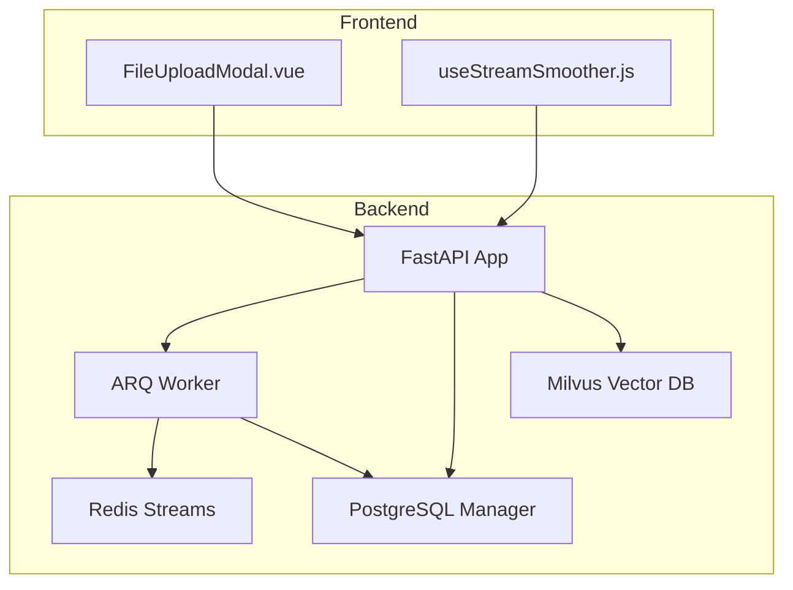
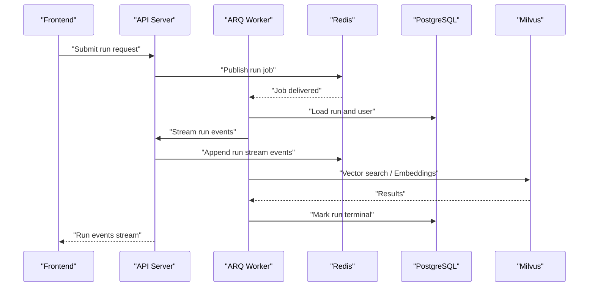
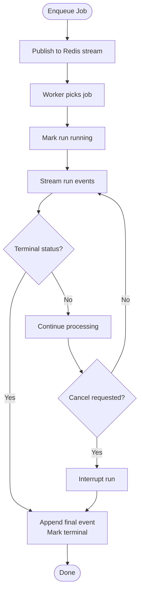
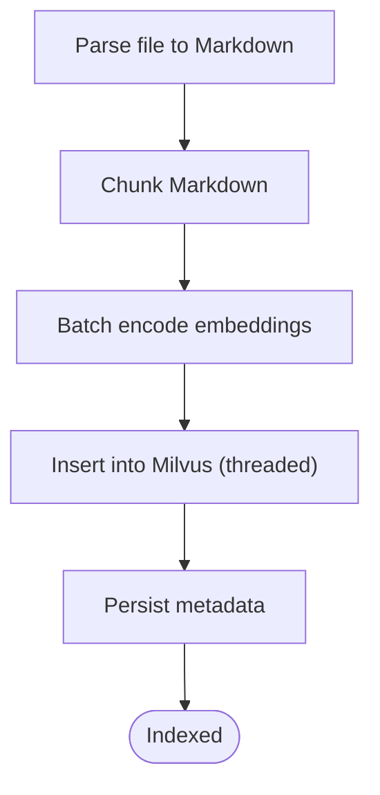
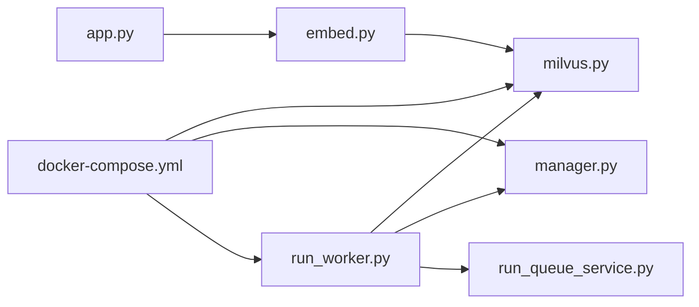

# Resource Management

<cite>
**Referenced Files in This Document**
- [run_worker.py](file://backend/package/yuxi/services/run_worker.py)
- [run_queue_service.py](file://backend/package/yuxi/services/run_queue_service.py)
- [milvus.py](file://backend/package/yuxi/knowledge/implementations/milvus.py)
- [manager.py](file://backend/package/yuxi/storage/postgres/manager.py)
- [embed.py](file://backend/package/yuxi/models/embed.py)
- [app.py](file://backend/package/yuxi/config/app.py)
- [docker-compose.yml](file://docker-compose.yml)
- [useStreamSmoother.js](file://web/src/composables/useStreamSmoother.js)
- [FileUploadModal.vue](file://web/src/components/FileUploadModal.vue)
- [test_run_queue_service.py](file://backend/test/unit/services/test_run_queue_service.py)
</cite>

## Table of Contents
1. [Introduction](#introduction)
2. [Project Structure](#project-structure)
3. [Core Components](#core-components)
4. [Architecture Overview](#architecture-overview)
5. [Detailed Component Analysis](#detailed-component-analysis)
6. [Dependency Analysis](#dependency-analysis)
7. [Performance Considerations](#performance-considerations)
8. [Troubleshooting Guide](#troubleshooting-guide)
9. [Conclusion](#conclusion)
10. [Appendices](#appendices)

## Introduction
This document provides comprehensive resource management guidance for the Yuxi platform. It focuses on agent concurrency control (queues, worker pools, execution limits), memory optimization for large knowledge bases and embeddings, CPU allocation for intensive operations, I/O optimization for uploads and external APIs, monitoring and scaling strategies, and operational safeguards against resource exhaustion.

## Project Structure
The Yuxi platform is organized around:
- Backend services for agent runs, queues, and knowledge base operations
- Storage managers for PostgreSQL and Milvus
- Embedding models and chunking utilities
- Frontend components for upload queuing and streaming UI smoothing
- Container orchestration via Docker Compose

**Diagram sources**
- [docker-compose.yml:38-123](file://docker-compose.yml#L38-L123)
- [run_worker.py:374-388](file://backend/package/yuxi/services/run_worker.py#L374-L388)
- [run_queue_service.py:61-97](file://backend/package/yuxi/services/run_queue_service.py#L61-L97)
- [manager.py:40-90](file://backend/package/yuxi/storage/postgres/manager.py#L40-L90)
- [milvus.py:24-63](file://backend/package/yuxi/knowledge/implementations/milvus.py#L24-L63)
- [FileUploadModal.vue:1048-1083](file://web/src/components/FileUploadModal.vue#L1048-L1083)
- [useStreamSmoother.js:173-400](file://web/src/composables/useStreamSmoother.js#L173-L400)

**Section sources**
- [docker-compose.yml:38-123](file://docker-compose.yml#L38-L123)

## Core Components
- Agent run queue and worker: ARQ-based worker with Redis streams for run events and cancellation signaling.
- PostgreSQL connection pooling and schema management for business and knowledge data.
- Milvus vector database with configurable search modes and batch embedding.
- Embedding model abstraction with batch encoding and async support.
- Frontend upload queue and streaming smoothing for user experience.

**Section sources**
- [run_worker.py:374-388](file://backend/package/yuxi/services/run_worker.py#L374-L388)
- [run_queue_service.py:61-97](file://backend/package/yuxi/services/run_queue_service.py#L61-L97)
- [manager.py:40-90](file://backend/package/yuxi/storage/postgres/manager.py#L40-L90)
- [milvus.py:471-676](file://backend/package/yuxi/knowledge/implementations/milvus.py#L471-L676)
- [embed.py:61-119](file://backend/package/yuxi/models/embed.py#L61-L119)
- [FileUploadModal.vue:1048-1083](file://web/src/components/FileUploadModal.vue#L1048-L1083)

## Architecture Overview
The platform orchestrates asynchronous agent runs with Redis-backed queues and PostgreSQL persistence. Milvus handles vector similarity searches and embedding computations. Embedding models support batching and async execution to optimize throughput. The frontend manages upload concurrency and smooths streaming responses.

**Diagram sources**
- [run_worker.py:189-361](file://backend/package/yuxi/services/run_worker.py#L189-L361)
- [run_queue_service.py:165-182](file://backend/package/yuxi/services/run_queue_service.py#L165-L182)
- [manager.py:230-248](file://backend/package/yuxi/storage/postgres/manager.py#L230-L248)
- [milvus.py:511-555](file://backend/package/yuxi/knowledge/implementations/milvus.py#L511-L555)

## Detailed Component Analysis

### Agent Concurrency Control and Queue Management
- Redis-backed job queue and run event streams:
  - Job publishing and run event appending use Redis streams with TTL and maxlen controls.
  - Cancellation signaling via Redis keys and pub/sub channels.
- Worker settings:
  - Max tries, job timeout, and keep-result durations are configured centrally.
  - Startup/shutdown hooks initialize and close database connections.
- Run lifecycle:
  - Runs are marked running, streamed in chunks, and finalized as completed/failed/cancelled/interrupted.

**Diagram sources**
- [run_worker.py:189-361](file://backend/package/yuxi/services/run_worker.py#L189-L361)
- [run_queue_service.py:114-182](file://backend/package/yuxi/services/run_queue_service.py#L114-L182)

**Section sources**
- [run_worker.py:374-388](file://backend/package/yuxi/services/run_worker.py#L374-L388)
- [run_queue_service.py:61-97](file://backend/package/yuxi/services/run_queue_service.py#L61-L97)
- [run_queue_service.py:114-182](file://backend/package/yuxi/services/run_queue_service.py#L114-L182)
- [test_run_queue_service.py:54-80](file://backend/test/unit/services/test_run_queue_service.py#L54-L80)

### Memory Optimization for Large Knowledge Base Processing
- Chunking and metadata locking:
  - Text is split into chunks using configurable presets; chunk records are built with minimal overhead.
  - Metadata updates are protected by an asyncio lock to prevent race conditions.
- Embedding batch sizing:
  - Embedding models expose a recommended batch size; Milvus embedding functions derive batch sizes from model configs.
  - Batch encoding tracks progress and consolidates results efficiently.
- Vector ingestion:
  - Milvus insert operations are executed in a thread pool to keep the event loop responsive.

**Diagram sources**
- [milvus.py:227-359](file://backend/package/yuxi/knowledge/implementations/milvus.py#L227-L359)
- [embed.py:61-119](file://backend/package/yuxi/models/embed.py#L61-L119)

**Section sources**
- [milvus.py:227-359](file://backend/package/yuxi/knowledge/implementations/milvus.py#L227-L359)
- [embed.py:61-119](file://backend/package/yuxi/models/embed.py#L61-L119)

### CPU Resource Allocation for Intensive Operations
- Vector similarity searches:
  - Milvus supports configurable metric types and nprobe parameters; adjust recall_top_k and final_top_k to balance latency and accuracy.
  - Hybrid search mode combines vector and keyword retrieval; consider enabling reranking for improved precision.
- Embedding computations:
  - Use async batch encoding to overlap network I/O with computation.
  - Tune embedding model batch_size according to model capabilities and GPU memory.
- PostgreSQL and Milvus:
  - PostgreSQL engine uses pool_pre_ping and pool_recycle to maintain healthy connections.
  - Milvus index parameters (e.g., IVF_FLAT) influence CPU usage during search; choose appropriate nlist.

**Section sources**
- [milvus.py:471-676](file://backend/package/yuxi/knowledge/implementations/milvus.py#L471-L676)
- [embed.py:61-119](file://backend/package/yuxi/models/embed.py#L61-L119)
- [manager.py:54-61](file://backend/package/yuxi/storage/postgres/manager.py#L54-L61)

### I/O Optimization Strategies
- File uploads:
  - Frontend enforces per-user upload concurrency; uploads are queued and processed sequentially to avoid overload.
  - Progress events are handled via XHR with onprogress callbacks.
- Redis streams:
  - Event streams cap length and set TTL to control memory growth.
  - Stream IDs are normalized to ensure efficient pagination.
- Milvus and MinIO:
  - Vector inserts are offloaded to threads to keep the main loop responsive.
  - Use appropriate TTLs and stream maxlen to bound memory usage.

**Section sources**
- [FileUploadModal.vue:1048-1083](file://web/src/components/FileUploadModal.vue#L1048-L1083)
- [run_queue_service.py:165-182](file://backend/package/yuxi/services/run_queue_service.py#L165-L182)
- [milvus.py:329-332](file://backend/package/yuxi/knowledge/implementations/milvus.py#L329-L332)

### Practical Examples of Resource Monitoring and Scaling
- Prometheus/Grafana:
  - Expose metrics for queue depth, worker busy ratios, run durations, and embedding latencies.
  - Track Redis stream lengths and PostgreSQL pool usage.
- Container resource limits in Docker:
  - Set CPU and memory limits for api, worker, postgres, redis, milvus, and minio containers.
  - Configure ulimits for GPU-accelerated services (e.g., mineru).
- Auto-scaling:
  - Scale ARQ workers horizontally based on Redis stream backlog.
  - Scale PostgreSQL and Redis instances vertically or horizontally depending on workload.

[No sources needed since this section provides general guidance]

### Garbage Collection, Connection Pooling, and Cleanup Patterns
- PostgreSQL:
  - AsyncConnectionPool and native pool for LangGraph checkpoints; pre-ping and recycle configured.
  - Sessions are committed or rolled back with proper cleanup.
- Redis:
  - Client and ARQ pool cached globally with explicit close routines.
  - Stream TTLs and maxlen prevent unbounded growth.
- Milvus:
  - Connections are disconnected in destructor; collections are loaded into memory on demand.
- Embedding models:
  - Async clients are scoped per request; state tracking for long-running batches.

**Section sources**
- [manager.py:250-257](file://backend/package/yuxi/storage/postgres/manager.py#L250-L257)
- [run_queue_service.py:226-240](file://backend/package/yuxi/services/run_queue_service.py#L226-L240)
- [milvus.py:890-897](file://backend/package/yuxi/knowledge/implementations/milvus.py#L890-L897)
- [embed.py:121-138](file://backend/package/yuxi/models/embed.py#L121-L138)

### Capacity Planning and Graceful Degradation
- Capacity planning:
  - Estimate peak concurrent runs, embedding throughput, and vector search QPS.
  - Size Redis, PostgreSQL, and Milvus appropriately; provision headroom for spikes.
- Execution limits:
  - WorkerSettings.job_timeout and max_tries define hard limits; configure based on SLAs.
- Graceful degradation:
  - Disable heavy features (e.g., reranking) under load.
  - Reduce final_top_k/recall_top_k to lower CPU and memory usage.
  - Use keyword-only search mode when vector search is too expensive.

**Section sources**
- [run_worker.py:374-388](file://backend/package/yuxi/services/run_worker.py#L374-L388)
- [milvus.py:471-676](file://backend/package/yuxi/knowledge/implementations/milvus.py#L471-L676)

## Dependency Analysis
The following diagram highlights key dependencies among components involved in resource management.

**Diagram sources**
- [run_worker.py:15-23](file://backend/package/yuxi/services/run_worker.py#L15-L23)
- [run_queue_service.py:13-17](file://backend/package/yuxi/services/run_queue_service.py#L13-L17)
- [manager.py:28-38](file://backend/package/yuxi/storage/postgres/manager.py#L28-L38)
- [milvus.py:11-19](file://backend/package/yuxi/knowledge/implementations/milvus.py#L11-L19)
- [embed.py:9-10](file://backend/package/yuxi/models/embed.py#L9-L10)
- [app.py:31-125](file://backend/package/yuxi/config/app.py#L31-L125)
- [docker-compose.yml:38-123](file://docker-compose.yml#L38-L123)

**Section sources**
- [run_worker.py:15-23](file://backend/package/yuxi/services/run_worker.py#L15-L23)
- [run_queue_service.py:13-17](file://backend/package/yuxi/services/run_queue_service.py#L13-L17)
- [manager.py:28-38](file://backend/package/yuxi/storage/postgres/manager.py#L28-L38)
- [milvus.py:11-19](file://backend/package/yuxi/knowledge/implementations/milvus.py#L11-L19)
- [embed.py:9-10](file://backend/package/yuxi/models/embed.py#L9-L10)
- [app.py:31-125](file://backend/package/yuxi/config/app.py#L31-L125)
- [docker-compose.yml:38-123](file://docker-compose.yml#L38-L123)

## Performance Considerations
- Queue and worker sizing:
  - Match worker count to CPU cores and I/O capacity; monitor Redis backlog to tune autoscaling.
- Embedding throughput:
  - Increase batch_size cautiously; monitor GPU/CPU utilization and latency.
- Vector search tuning:
  - Adjust nprobe, metric type, and top-k parameters to balance speed and relevance.
- Database and cache:
  - Use pool_pre_ping and pool_recycle; monitor connection usage and timeouts.
- Frontend responsiveness:
  - Use streaming smoothing to reduce perceived latency and improve UX.

[No sources needed since this section provides general guidance]

## Troubleshooting Guide
- Redis connectivity failures:
  - The Redis client is cached and validated on first use; ping failures raise clear errors with redacted URLs.
- Run cancellation:
  - Workers poll cancellation signals and terminate gracefully; ensure Redis is reachable for pub/sub.
- Database initialization:
  - PostgreSQL manager initializes engines and pools; verify environment variables and health checks.
- Milvus connection issues:
  - Connections are established per work_dir alias; ensure URI/token and database availability.

**Section sources**
- [run_queue_service.py:61-82](file://backend/package/yuxi/services/run_queue_service.py#L61-L82)
- [run_worker.py:364-371](file://backend/package/yuxi/services/run_worker.py#L364-L371)
- [manager.py:40-90](file://backend/package/yuxi/storage/postgres/manager.py#L40-L90)
- [milvus.py:70-89](file://backend/package/yuxi/knowledge/implementations/milvus.py#L70-L89)

## Conclusion
The Yuxi platform employs Redis-backed queues, PostgreSQL connection pooling, and Milvus vector search to manage agent concurrency and large-scale knowledge processing. By tuning batch sizes, search parameters, and worker counts, and by leveraging streaming UI smoothing and robust cleanup patterns, the system achieves predictable performance and resilience under load.

## Appendices
- Environment variables and service configuration are defined in the Docker Compose file; ensure consistent configuration across environments.

**Section sources**
- [docker-compose.yml:1-436](file://docker-compose.yml#L1-L436)