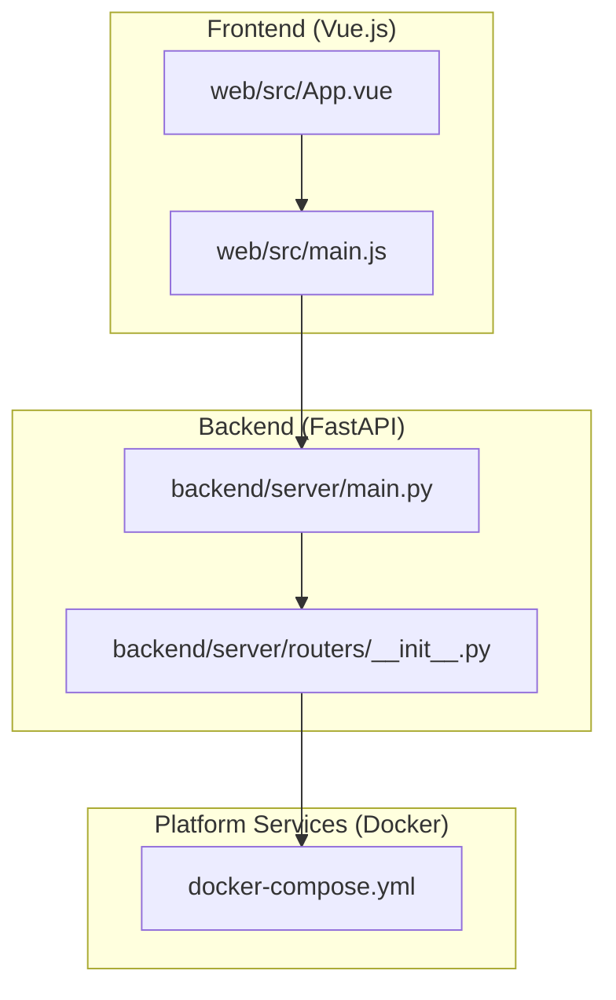
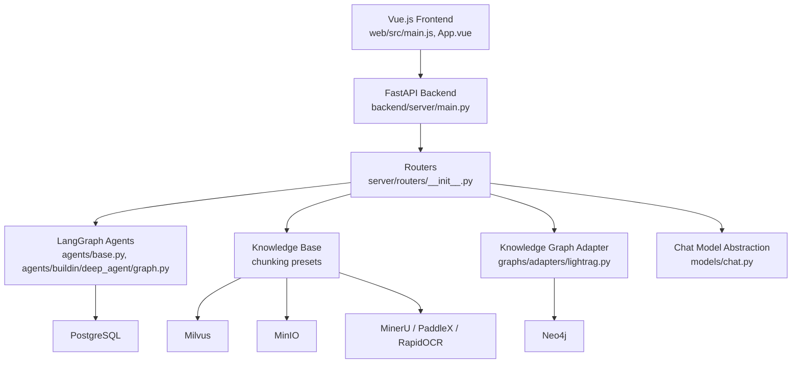
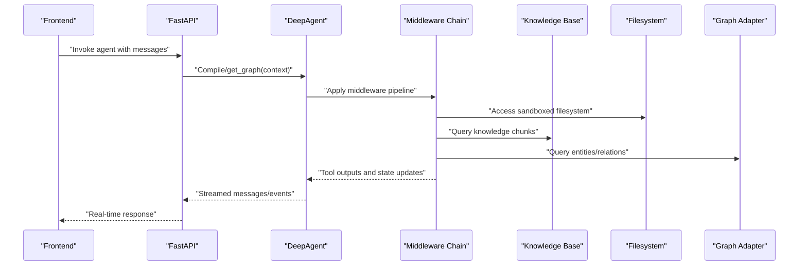
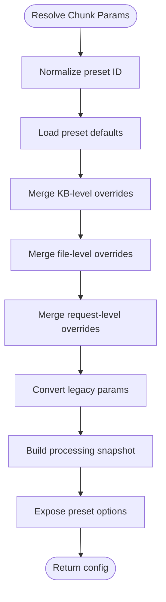
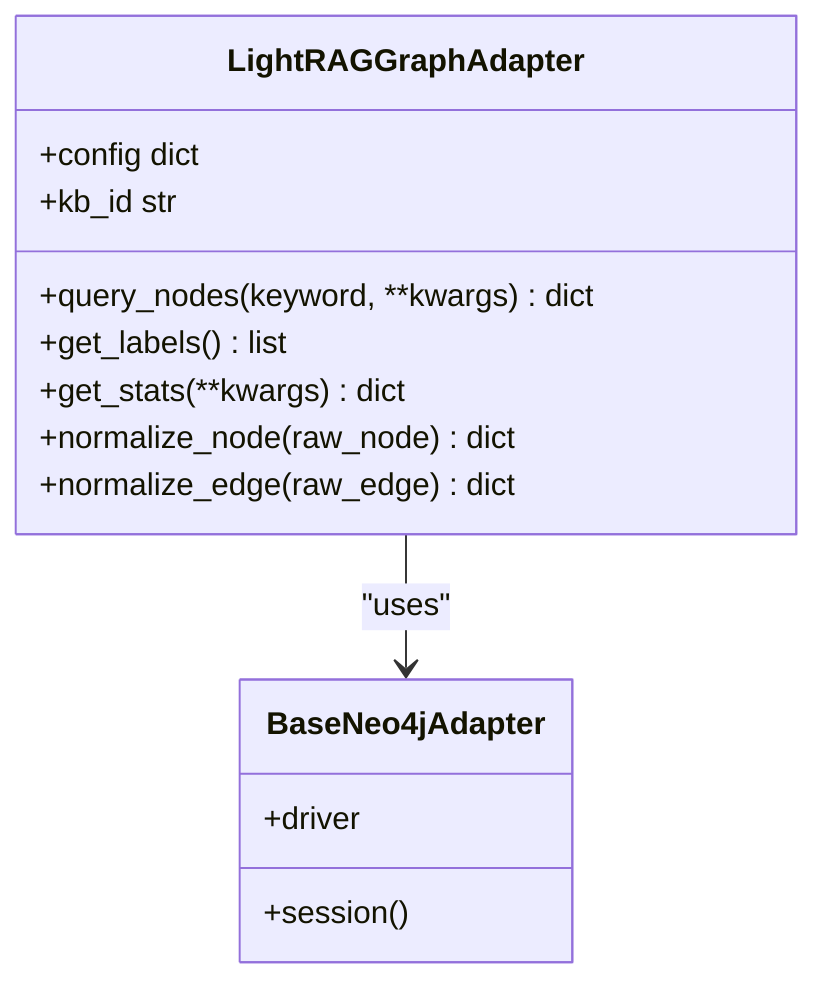
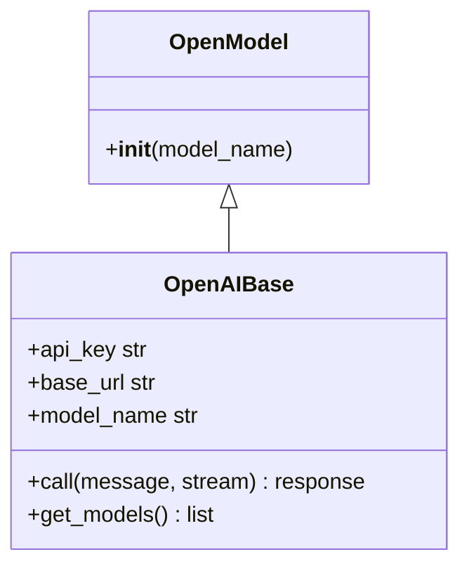
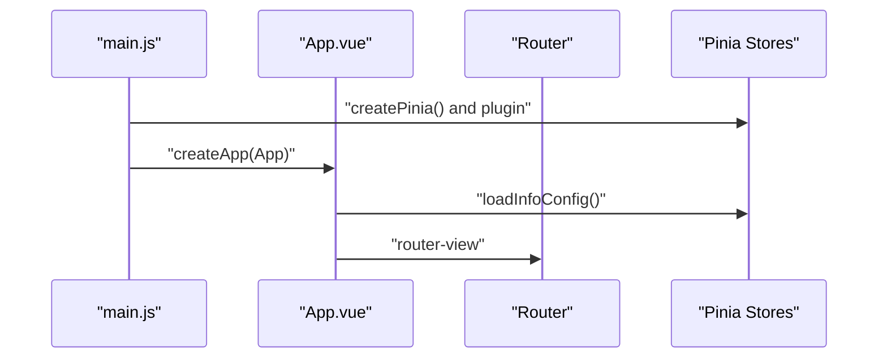
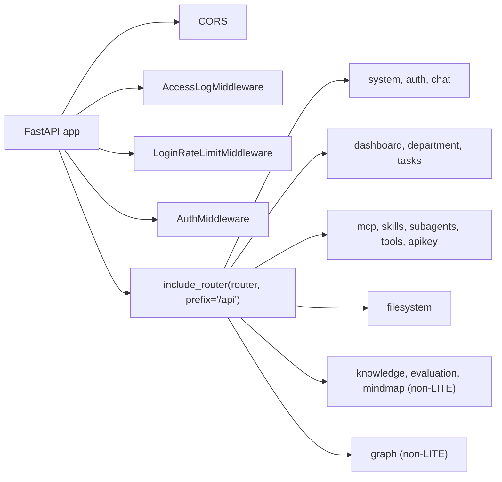
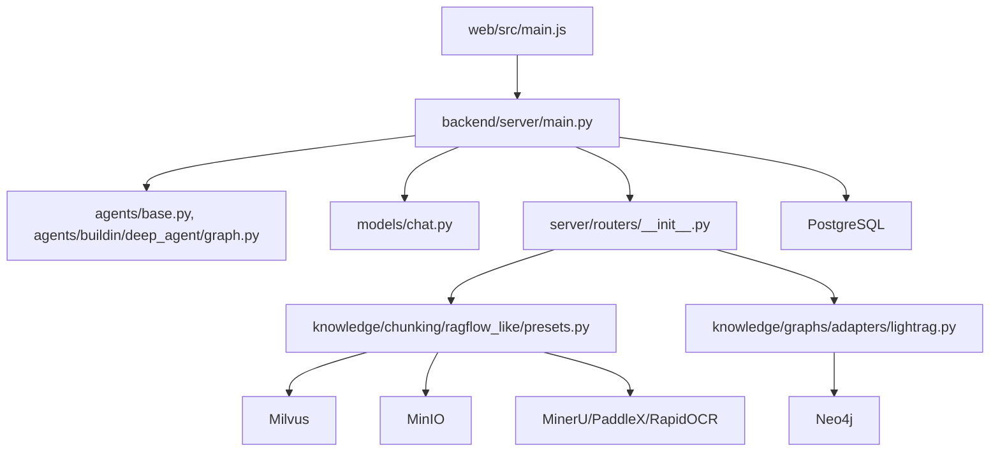

# Project Overview

<cite>
**Referenced Files in This Document**
- [README.md](file://README.md)
- [project-overview.md](file://docs/intro/project-overview.md)
- [main.js](file://web/src/main.js)
- [App.vue](file://web/src/App.vue)
- [main.py](file://backend/server/main.py)
- [routers/__init__.py](file://backend/server/routers/__init__.py)
- [base.py](file://backend/package/yuxi/agents/base.py)
- [graph.py](file://backend/package/yuxi/agents/buildin/deep_agent/graph.py)
- [chat.py](file://backend/package/yuxi/models/chat.py)
- [presets.py](file://backend/package/yuxi/knowledge/chunking/ragflow_like/presets.py)
- [lightrag.py](file://backend/package/yuxi/knowledge/graphs/adapters/lightrag.py)
- [docker-compose.yml](file://docker-compose.yml)
</cite>

## Table of Contents
1. [Introduction](#introduction)
2. [Project Structure](#project-structure)
3. [Core Components](#core-components)
4. [Architecture Overview](#architecture-overview)
5. [Detailed Component Analysis](#detailed-component-analysis)
6. [Dependency Analysis](#dependency-analysis)
7. [Performance Considerations](#performance-considerations)
8. [Troubleshooting Guide](#troubleshooting-guide)
9. [Conclusion](#conclusion)
10. [Appendices](#appendices)

## Introduction
Yuxi (语析) is a business-oriented AI agent development platform that combines Retrieval-Augmented Generation (RAG) with knowledge graph construction. It enables organizations to build production-grade AI applications that understand and reason over internal knowledge. The platform integrates LangGraph-based agents, a Vue.js frontend, and a FastAPI backend, and it supports enterprise-grade capabilities such as knowledge base ingestion, graph construction, sandboxed execution, and containerized deployment.

Key value propositions:
- Intelligent agent development powered by LangGraph v1 with subagents, skills, MCPs, tools, and middleware.
- Knowledge base management with multi-format document ingestion, chunking presets, embedding/rerank configuration, and evaluation.
- Knowledge graph construction and reasoning via LightRAG and Neo4j, integrated into agent workflows.
- Production-ready deployment with Docker Compose, hot-reload development, dark mode, and API key authentication.

Practical outcomes users can achieve:
- Build RAG-powered agents that answer complex questions using structured knowledge.
- Construct and query knowledge graphs from unstructured documents for deeper reasoning.
- Orchestrate multi-step tasks with subagents and tools, including file system operations and web search.
- Manage permissions, skills, tools, and subagents through a centralized admin interface.

**Section sources**
- [README.md:22-36](file://README.md#L22-L36)
- [project-overview.md:3-81](file://docs/intro/project-overview.md#L3-L81)

## Project Structure
The repository is organized into three major layers:
- Frontend (Vue.js): Single-page application with routing, stores, and UI components.
- Backend (FastAPI): REST API with modular routers, middleware, and domain services.
- Platform services: Docker Compose-managed infrastructure including databases, graph engine, vector store, object storage, and OCR/document parsing services.

**Diagram sources**
- [main.js:1-26](file://web/src/main.js#L1-L26)
- [App.vue:1-23](file://web/src/App.vue#L1-L23)
- [main.py:139-150](file://backend/server/main.py#L139-L150)
- [routers/__init__.py:20-49](file://backend/server/routers/__init__.py#L20-L49)
- [docker-compose.yml:37-84](file://docker-compose.yml#L37-L84)

**Section sources**
- [docker-compose.yml:37-84](file://docker-compose.yml#L37-L84)
- [main.js:1-26](file://web/src/main.js#L1-L26)
- [main.py:139-150](file://backend/server/main.py#L139-L150)

## Core Components
- LangGraph-based agents: Base agent abstraction and built-in DeepAgent graph with middleware pipeline for tools, skills, subagents, and knowledge base integration.
- Knowledge base and chunking: Preset-driven chunking strategies (general, QA, book, laws) with defaults and legacy parameter compatibility.
- Knowledge graph adapter: Neo4j-backed adapter for LightRAG, exposing standardized node/edge queries and statistics.
- Chat model abstraction: Unified OpenAI-compatible client with retry/backoff and model selection logic.
- Frontend: Vue 3 app bootstrapped with Pinia, Ant Design Vue, and router; mounts and initializes stores on startup.
- Backend: FastAPI app with CORS, access logging, rate-limiting, and modular routers; includes system, auth, chat, dashboard, tasks, tools, skills, subagents, filesystem, knowledge, evaluation, and graph routes.

**Section sources**
- [base.py:17-263](file://backend/package/yuxi/agents/base.py#L17-L263)
- [graph.py:27-124](file://backend/package/yuxi/agents/buildin/deep_agent/graph.py#L27-L124)
- [presets.py:1-239](file://backend/package/yuxi/knowledge/chunking/ragflow_like/presets.py#L1-L239)
- [lightrag.py:8-329](file://backend/package/yuxi/knowledge/graphs/adapters/lightrag.py#L8-L329)
- [chat.py:26-203](file://backend/package/yuxi/models/chat.py#L26-L203)
- [main.js:1-26](file://web/src/main.js#L1-L26)
- [main.py:40-137](file://backend/server/main.py#L40-L137)
- [routers/__init__.py:20-49](file://backend/server/routers/__init__.py#L20-L49)

## Architecture Overview
The platform’s runtime architecture connects the frontend UI to the backend API, which orchestrates agent execution, knowledge base operations, and graph queries. Platform services provide persistent storage, vector search, graph traversal, and document parsing.

**Diagram sources**
- [main.js:1-26](file://web/src/main.js#L1-L26)
- [App.vue:1-23](file://web/src/App.vue#L1-L23)
- [main.py:40-137](file://backend/server/main.py#L40-L137)
- [routers/__init__.py:20-49](file://backend/server/routers/__init__.py#L20-L49)
- [base.py:17-263](file://backend/package/yuxi/agents/base.py#L17-L263)
- [graph.py:27-124](file://backend/package/yuxi/agents/buildin/deep_agent/graph.py#L27-L124)
- [presets.py:1-239](file://backend/package/yuxi/knowledge/chunking/ragflow_like/presets.py#L1-L239)
- [lightrag.py:8-329](file://backend/package/yuxi/knowledge/graphs/adapters/lightrag.py#L8-L329)
- [chat.py:26-203](file://backend/package/yuxi/models/chat.py#L26-L203)

## Detailed Component Analysis

### Agent Runtime and Middleware Pipeline
The agent runtime compiles a LangGraph workflow with a checkpointer for state persistence and streams events/messages. The DeepAgent demonstrates a middleware pipeline integrating filesystem access, skills, knowledge base tools, subagents, and tool-call limits.

**Diagram sources**
- [graph.py:52-124](file://backend/package/yuxi/agents/buildin/deep_agent/graph.py#L52-L124)
- [base.py:64-150](file://backend/package/yuxi/agents/base.py#L64-L150)

**Section sources**
- [graph.py:27-124](file://backend/package/yuxi/agents/buildin/deep_agent/graph.py#L27-L124)
- [base.py:17-263](file://backend/package/yuxi/agents/base.py#L17-L263)

### Knowledge Base Chunking and Presets
The chunking subsystem normalizes preset IDs, merges defaults and overrides, and resolves effective configuration snapshots. It supports legacy parameters and exposes preset options for UI consumption.

**Diagram sources**
- [presets.py:79-213](file://backend/package/yuxi/knowledge/chunking/ragflow_like/presets.py#L79-L213)

**Section sources**
- [presets.py:1-239](file://backend/package/yuxi/knowledge/chunking/ragflow_like/presets.py#L1-L239)

### Knowledge Graph Adapter (LightRAG)
The LightRAG adapter wraps a Neo4j-based graph, normalizing nodes and edges, building Cypher queries, and returning standardized graph structures. It supports keyword search, label discovery, and statistics.

**Diagram sources**
- [lightrag.py:8-329](file://backend/package/yuxi/knowledge/graphs/adapters/lightrag.py#L8-L329)

**Section sources**
- [lightrag.py:8-329](file://backend/package/yuxi/knowledge/graphs/adapters/lightrag.py#L8-L329)

### Chat Model Abstraction
The chat model abstraction encapsulates provider selection, model resolution, and streaming responses with exponential backoff and retry logic.

**Diagram sources**
- [chat.py:26-203](file://backend/package/yuxi/models/chat.py#L26-L203)

**Section sources**
- [chat.py:26-203](file://backend/package/yuxi/models/chat.py#L26-L203)

### Frontend Bootstrapping and Routing
The Vue application initializes Pinia, registers Ant Design Vue, and mounts the root component. It loads pre-configured branding and info, and routes users to the appropriate views.

**Diagram sources**
- [main.js:1-26](file://web/src/main.js#L1-L26)
- [App.vue:1-23](file://web/src/App.vue#L1-L23)

**Section sources**
- [main.js:1-26](file://web/src/main.js#L1-L26)
- [App.vue:1-23](file://web/src/App.vue#L1-L23)

### Backend API and Routers
The FastAPI app sets up CORS, access logging, rate limiting, and authentication middleware. It includes modular routers for system, auth, chat, dashboard, tasks, tools, skills, subagents, filesystem, knowledge, evaluation, and graph.

**Diagram sources**
- [main.py:40-137](file://backend/server/main.py#L40-L137)
- [routers/__init__.py:20-49](file://backend/server/routers/__init__.py#L20-L49)

**Section sources**
- [main.py:40-137](file://backend/server/main.py#L40-L137)
- [routers/__init__.py:20-49](file://backend/server/routers/__init__.py#L20-L49)

## Dependency Analysis
- Frontend depends on Vue 3 ecosystem (Pinia, Ant Design Vue) and router; it communicates with the backend API.
- Backend depends on LangGraph for agent orchestration, PostgreSQL for persistence, Milvus for vector search, Neo4j for graph storage, MinIO for object storage, and OCR/document parsing services.
- Docker Compose defines service dependencies and environment variables for seamless orchestration.

**Diagram sources**
- [main.js:1-26](file://web/src/main.js#L1-L26)
- [main.py:40-137](file://backend/server/main.py#L40-L137)
- [base.py:17-263](file://backend/package/yuxi/agents/base.py#L17-L263)
- [graph.py:27-124](file://backend/package/yuxi/agents/buildin/deep_agent/graph.py#L27-L124)
- [chat.py:26-203](file://backend/package/yuxi/models/chat.py#L26-L203)
- [routers/__init__.py:20-49](file://backend/server/routers/__init__.py#L20-L49)
- [presets.py:1-239](file://backend/package/yuxi/knowledge/chunking/ragflow_like/presets.py#L1-L239)
- [lightrag.py:8-329](file://backend/package/yuxi/knowledge/graphs/adapters/lightrag.py#L8-L329)

**Section sources**
- [docker-compose.yml:37-436](file://docker-compose.yml#L37-L436)

## Performance Considerations
- Streaming responses: Use agent streaming APIs to deliver incremental updates and reduce perceived latency.
- Chunking presets: Choose appropriate chunk sizes and overlap to balance retrieval accuracy and latency.
- Middleware limits: Enforce tool-call limits and summary offloading to prevent long-running runs and excessive context growth.
- Vector and graph indexing: Tune embedding dimensions, similarity thresholds, and graph traversal depth for query performance.
- Container resource allocation: Configure GPU/CPU/memory for OCR and embedding services to avoid bottlenecks.

[No sources needed since this section provides general guidance]

## Troubleshooting Guide
Common issues and remedies:
- Backend health checks failing: Verify service readiness and network connectivity among api, postgres, redis, minio, and sandbox-provisioner.
- Authentication and rate limiting: Review login attempts and ensure proper credentials; adjust rate-limit windows if needed.
- Agent history and checkpoints: Confirm checkpointer configuration (SQLite/PostgreSQL) and availability of persisted state.
- Knowledge base ingestion: Validate chunking presets and ensure OCR/document parsing services are healthy.

**Section sources**
- [docker-compose.yml:69-84](file://docker-compose.yml#L69-L84)
- [main.py:63-96](file://backend/server/main.py#L63-L96)
- [base.py:199-254](file://backend/package/yuxi/agents/base.py#L199-L254)

## Conclusion
Yuxi provides a cohesive, production-ready framework for building intelligent agents that combine RAG and knowledge graphs. Its modular architecture, robust middleware pipeline, and containerized deployment simplify real-world adoption. Teams can rapidly prototype and operate scalable AI applications tailored to business needs.

[No sources needed since this section summarizes without analyzing specific files]

## Appendices
- Quick start: Clone the repository, initialize environment, and bring up services with Docker Compose. Access the frontend at the configured port and log in to explore agents, knowledge bases, and graphs.
- Technology stack highlights: Vue 3 + Pinia + Ant Design Vue for frontend; FastAPI + Uvicorn for backend; LangGraph v1 for agents; LightRAG + Neo4j for graphs; Milvus for vectors; PostgreSQL, Redis, MinIO for persistence and storage; Docker Compose for orchestration.

[No sources needed since this section provides general guidance]