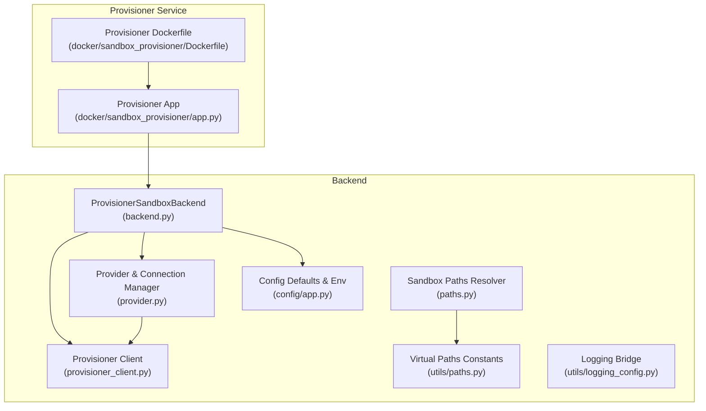
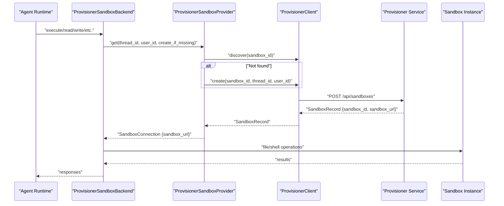
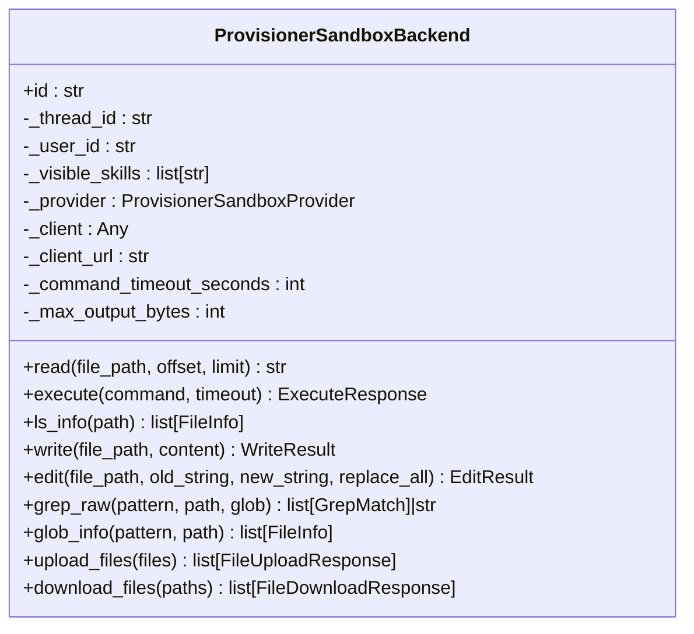
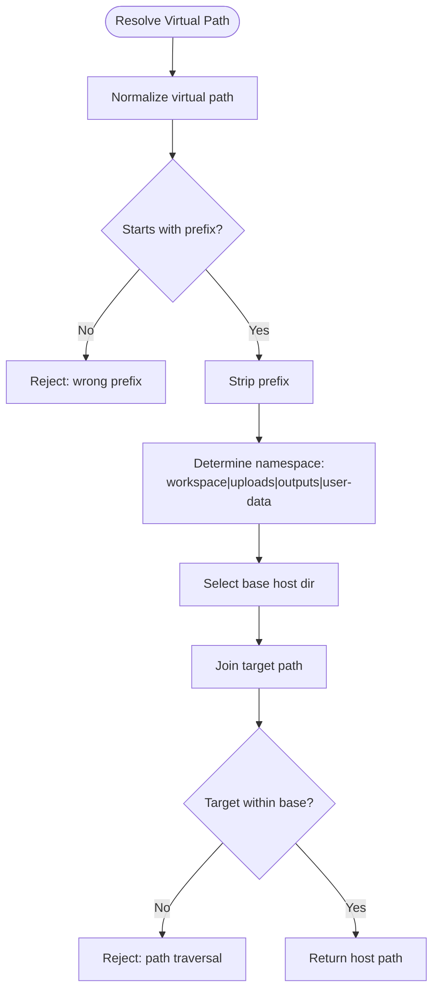
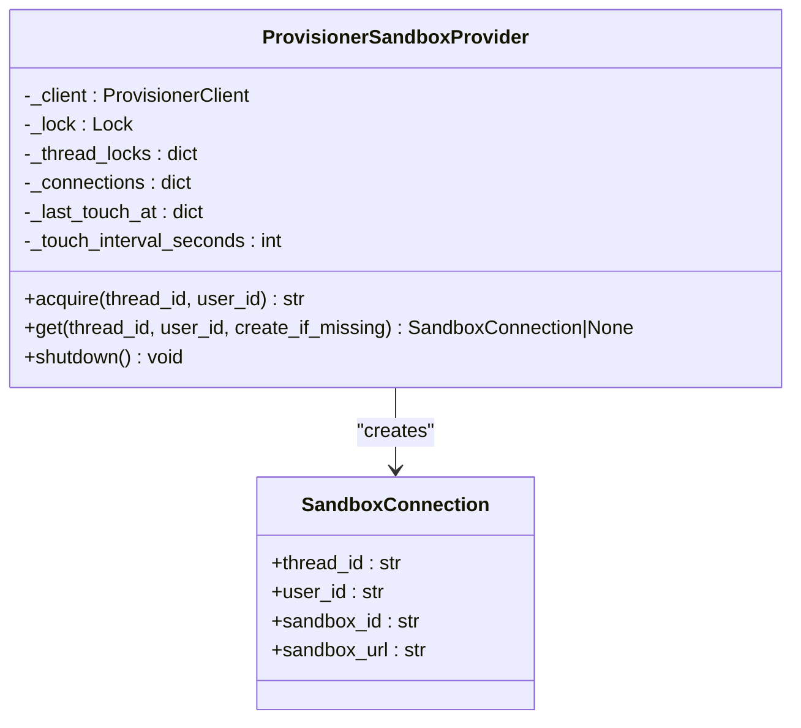
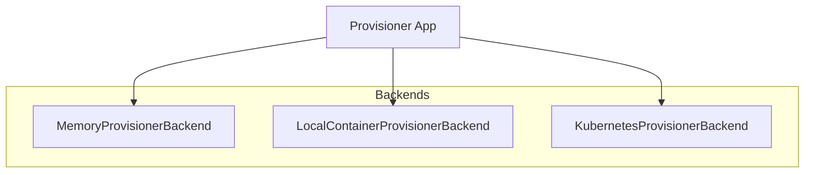

# Sandbox Environment

<cite>
**Referenced Files in This Document**
- [backend.py](file://backend/package/yuxi/agents/backends/sandbox/backend.py)
- [paths.py](file://backend/package/yuxi/agents/backends/sandbox/paths.py)
- [provider.py](file://backend/package/yuxi/agents/backends/sandbox/provider.py)
- [provisioner_client.py](file://backend/package/yuxi/agents/backends/sandbox/provisioner_client.py)
- [app.py](file://docker/sandbox_provisioner/app.py)
- [Dockerfile](file://docker/sandbox_provisioner/Dockerfile)
- [app.py](file://backend/package/yuxi/config/app.py)
- [paths.py](file://backend/package/yuxi/utils/paths.py)
- [logging_config.py](file://backend/package/yuxi/utils/logging_config.py)
- [test_sandbox_backends.py](file://backend/test/unit/backends/test_sandbox_backends.py)
- [test_sandbox_provisioner_config.py](file://backend/test/unit/backends/test_sandbox_provisioner_config.py)
</cite>

## Table of Contents
1. [Introduction](#introduction)
2. [Project Structure](#project-structure)
3. [Core Components](#core-components)
4. [Architecture Overview](#architecture-overview)
5. [Detailed Component Analysis](#detailed-component-analysis)
6. [Dependency Analysis](#dependency-analysis)
7. [Performance Considerations](#performance-considerations)
8. [Troubleshooting Guide](#troubleshooting-guide)
9. [Conclusion](#conclusion)
10. [Appendices](#appendices)

## Introduction
This document describes the sandbox execution environment used by the agents to operate securely within isolated workspaces. It explains the sandboxed execution model, virtual filesystem implementation, file access controls, resource management, attachment and artifact handling, debugging and monitoring, and security considerations. Practical guidance is included for configuration, customization, and troubleshooting.

## Project Structure
The sandbox environment spans backend Python components, a provisioner service, and Docker packaging. The backend defines the sandbox backend interface and orchestration, the provisioner manages lifecycle and mounts, and configuration governs behavior and limits.

**Diagram sources**
- [backend.py:64-402](file://backend/package/yuxi/agents/backends/sandbox/backend.py#L64-L402)
- [paths.py:1-136](file://backend/package/yuxi/agents/backends/sandbox/paths.py#L1-L136)
- [provider.py:27-171](file://backend/package/yuxi/agents/backends/sandbox/provider.py#L27-L171)
- [provisioner_client.py:15-73](file://backend/package/yuxi/agents/backends/sandbox/provisioner_client.py#L15-L73)
- [app.py:78-86](file://backend/package/yuxi/config/app.py#L78-L86)
- [paths.py:5-14](file://backend/package/yuxi/utils/paths.py#L5-L14)
- [app.py:1-800](file://docker/sandbox_provisioner/app.py#L1-L800)
- [Dockerfile:1-16](file://docker/sandbox_provisioner/Dockerfile#L1-L16)

**Section sources**
- [backend.py:1-402](file://backend/package/yuxi/agents/backends/sandbox/backend.py#L1-L402)
- [paths.py:1-136](file://backend/package/yuxi/agents/backends/sandbox/paths.py#L1-L136)
- [provider.py:1-171](file://backend/package/yuxi/agents/backends/sandbox/provider.py#L1-L171)
- [provisioner_client.py:1-73](file://backend/package/yuxi/agents/backends/sandbox/provisioner_client.py#L1-L73)
- [app.py:78-86](file://backend/package/yuxi/config/app.py#L78-L86)
- [paths.py:1-27](file://backend/package/yuxi/utils/paths.py#L1-L27)
- [app.py:1-800](file://docker/sandbox_provisioner/app.py#L1-L800)
- [Dockerfile:1-16](file://docker/sandbox_provisioner/Dockerfile#L1-L16)

## Core Components
- ProvisionerSandboxBackend: Implements the sandbox backend interface, orchestrating file operations, shell execution, and glob/search utilities via a remote sandbox client.
- Sandbox Paths Resolver: Validates and resolves virtual paths to host filesystem locations, enforcing namespace isolation and preventing path traversal.
- Provider & Connection Manager: Manages sandbox acquisition, reuse, keepalive, and lifecycle cleanup.
- Provisioner Client: HTTP client to the sandbox provisioner API for create/discover/touch/delete operations.
- Provisioner Service: FastAPI service that provisions sandboxes via Docker/Kubernetes/Memory backends, exposes lifecycle endpoints, and enforces idle reaping.
- Configuration: Centralized defaults and environment overrides for sandbox behavior, timeouts, and limits.
- Logging: Unified logging bridge for observability.

**Section sources**
- [backend.py:64-402](file://backend/package/yuxi/agents/backends/sandbox/backend.py#L64-L402)
- [paths.py:12-136](file://backend/package/yuxi/agents/backends/sandbox/paths.py#L12-L136)
- [provider.py:27-171](file://backend/package/yuxi/agents/backends/sandbox/provider.py#L27-L171)
- [provisioner_client.py:15-73](file://backend/package/yuxi/agents/backends/sandbox/provisioner_client.py#L15-L73)
- [app.py:19-800](file://docker/sandbox_provisioner/app.py#L19-L800)
- [app.py:78-86](file://backend/package/yuxi/config/app.py#L78-L86)
- [logging_config.py:1-99](file://backend/package/yuxi/utils/logging_config.py#L1-L99)

## Architecture Overview
The system integrates a backend sandbox backend with a provisioner service that creates and manages sandbox instances. The backend communicates with the provisioner to obtain a sandbox URL, then uses a remote client to perform file operations and shell commands. Virtual paths map to host directories with strict isolation and validation.

**Diagram sources**
- [backend.py:95-105](file://backend/package/yuxi/agents/backends/sandbox/backend.py#L95-L105)
- [provider.py:103-128](file://backend/package/yuxi/agents/backends/sandbox/provider.py#L103-L128)
- [provisioner_client.py:32-58](file://backend/package/yuxi/agents/backends/sandbox/provisioner_client.py#L32-L58)
- [app.py:322-399](file://docker/sandbox_provisioner/app.py#L322-L399)

## Detailed Component Analysis

### Sandbox Backend
The backend encapsulates sandbox operations:
- Path normalization and validation to prevent traversal.
- File read/edit/write/download/upload with robust error handling and binary detection.
- Shell command execution with timeout and output truncation.
- Glob and search utilities backed by the sandbox file API.

**Diagram sources**
- [backend.py:64-402](file://backend/package/yuxi/agents/backends/sandbox/backend.py#L64-L402)

**Section sources**
- [backend.py:26-35](file://backend/package/yuxi/agents/backends/sandbox/backend.py#L26-L35)
- [backend.py:107-135](file://backend/package/yuxi/agents/backends/sandbox/backend.py#L107-L135)
- [backend.py:136-170](file://backend/package/yuxi/agents/backends/sandbox/backend.py#L136-L170)
- [backend.py:171-199](file://backend/package/yuxi/agents/backends/sandbox/backend.py#L171-L199)
- [backend.py:201-228](file://backend/package/yuxi/agents/backends/sandbox/backend.py#L201-L228)
- [backend.py:230-253](file://backend/package/yuxi/agents/backends/sandbox/backend.py#L230-L253)
- [backend.py:255-301](file://backend/package/yuxi/agents/backends/sandbox/backend.py#L255-L301)
- [backend.py:303-321](file://backend/package/yuxi/agents/backends/sandbox/backend.py#L303-L321)
- [backend.py:322-338](file://backend/package/yuxi/agents/backends/sandbox/backend.py#L322-L338)
- [backend.py:340-371](file://backend/package/yuxi/agents/backends/sandbox/backend.py#L340-L371)
- [backend.py:373-401](file://backend/package/yuxi/agents/backends/sandbox/backend.py#L373-L401)

### Virtual Filesystem and Path Resolution
The resolver enforces:
- Virtual path prefix enforcement.
- Namespace-aware mapping to host directories (workspace, uploads, outputs).
- Strict path traversal checks and relative-to-base validation.
- Utility to convert host paths back to virtual paths for UI/tooling.

**Diagram sources**
- [paths.py:95-110](file://backend/package/yuxi/agents/backends/sandbox/paths.py#L95-L110)

**Section sources**
- [paths.py:12-14](file://backend/package/yuxi/agents/backends/sandbox/paths.py#L12-L14)
- [paths.py:16-22](file://backend/package/yuxi/agents/backends/sandbox/paths.py#L16-L22)
- [paths.py:25-27](file://backend/package/yuxi/agents/backends/sandbox/paths.py#L25-L27)
- [paths.py:45-46](file://backend/package/yuxi/agents/backends/sandbox/paths.py#L45-L46)
- [paths.py:49-51](file://backend/package/yuxi/agents/backends/sandbox/paths.py#L49-L51)
- [paths.py:54-59](file://backend/package/yuxi/agents/backends/sandbox/paths.py#L54-L59)
- [paths.py:62-66](file://backend/package/yuxi/agents/backends/sandbox/paths.py#L62-L66)
- [paths.py:69-92](file://backend/package/yuxi/agents/backends/sandbox/paths.py#L69-L92)
- [paths.py:95-110](file://backend/package/yuxi/agents/backends/sandbox/paths.py#L95-L110)
- [paths.py:113-135](file://backend/package/yuxi/agents/backends/sandbox/paths.py#L113-L135)

### Provider and Connection Management
The provider:
- Derives a stable sandbox identifier from thread_id.
- Ensures thread-scoped locks for safe concurrent access.
- Discovers or creates sandboxes via the provisioner.
- Performs periodic keepalive touches and tracks last activity.
- Shuts down and deletes sandboxes on demand.

**Diagram sources**
- [provider.py:27-171](file://backend/package/yuxi/agents/backends/sandbox/provider.py#L27-L171)

**Section sources**
- [provider.py:14-16](file://backend/package/yuxi/agents/backends/sandbox/provider.py#L14-L16)
- [provider.py:44-50](file://backend/package/yuxi/agents/backends/sandbox/provider.py#L44-L50)
- [provider.py:52-61](file://backend/package/yuxi/agents/backends/sandbox/provider.py#L52-L61)
- [provider.py:63-76](file://backend/package/yuxi/agents/backends/sandbox/provider.py#L63-L76)
- [provider.py:78-101](file://backend/package/yuxi/agents/backends/sandbox/provider.py#L78-L101)
- [provider.py:103-128](file://backend/package/yuxi/agents/backends/sandbox/provider.py#L103-L128)
- [provider.py:130-143](file://backend/package/yuxi/agents/backends/sandbox/provider.py#L130-L143)
- [provider.py:149-161](file://backend/package/yuxi/agents/backends/sandbox/provider.py#L149-L161)

### Provisioner Client
The client wraps HTTP requests to the provisioner API:
- Health checks.
- Create, discover, touch, and delete sandbox records.

**Section sources**
- [provisioner_client.py:15-73](file://backend/package/yuxi/agents/backends/sandbox/provisioner_client.py#L15-L73)

### Provisioner Service (Docker/Kubernetes/Memory)
The provisioner service:
- Supports multiple backends (memory, local container, Kubernetes).
- Creates and manages sandbox lifecycles, ensuring proper mounts and readiness.
- Provides endpoints for health, creation, discovery, touching, and deletion.
- Includes an idle reaper to automatically delete long-idle sandboxes.

**Diagram sources**
- [app.py:61-100](file://docker/sandbox_provisioner/app.py#L61-L100)
- [app.py:116-455](file://docker/sandbox_provisioner/app.py#L116-L455)
- [app.py:457-698](file://docker/sandbox_provisioner/app.py#L457-L698)

**Section sources**
- [app.py:19-24](file://docker/sandbox_provisioner/app.py#L19-L24)
- [app.py:61-100](file://docker/sandbox_provisioner/app.py#L61-L100)
- [app.py:116-455](file://docker/sandbox_provisioner/app.py#L116-L455)
- [app.py:457-698](file://docker/sandbox_provisioner/app.py#L457-L698)
- [app.py:700-776](file://docker/sandbox_provisioner/app.py#L700-L776)
- [Dockerfile:1-16](file://docker/sandbox_provisioner/Dockerfile#L1-L16)

### Configuration and Environment
Configuration governs:
- Sandbox provider selection and provisioner URL.
- Virtual path prefix.
- Execution timeout and output size limits.
- Keepalive interval.

Environment variables override defaults and validate inputs.

**Section sources**
- [app.py:78-86](file://backend/package/yuxi/config/app.py#L78-L86)
- [app.py:245-270](file://backend/package/yuxi/config/app.py#L245-L270)

### Logging and Observability
Logging bridges third-party libraries and captures structured logs with rotation and retention.

**Section sources**
- [logging_config.py:1-99](file://backend/package/yuxi/utils/logging_config.py#L1-L99)

## Dependency Analysis
The backend depends on the provider and provisioner client to manage sandbox connectivity. The provider depends on the provisioner client, which calls the provisioner service. The resolver depends on configuration and utility path constants.

```mermaid
graph LR
Backend["ProvisionerSandboxBackend"] --> Provider["ProvisionerSandboxProvider"]
Provider --> ProvClient["ProvisionerClient"]
ProvClient --> ProvSvc["Provisioner Service"]
Backend --> Resolver["Sandbox Paths Resolver"]
Resolver --> UtilsPaths["Virtual Paths Constants"]
Backend --> Config["Config Defaults"]
Backend --> Logger["Logging"]
```

**Diagram sources**
- [backend.py:23-24](file://backend/package/yuxi/agents/backends/sandbox/backend.py#L23-L24)
- [provider.py:11-42](file://backend/package/yuxi/agents/backends/sandbox/provider.py#L11-L42)
- [provisioner_client.py:15-26](file://backend/package/yuxi/agents/backends/sandbox/provisioner_client.py#L15-L26)
- [paths.py:5-14](file://backend/package/yuxi/utils/paths.py#L5-L14)
- [app.py:78-86](file://backend/package/yuxi/config/app.py#L78-L86)
- [logging_config.py:1-99](file://backend/package/yuxi/utils/logging_config.py#L1-L99)

**Section sources**
- [backend.py:1-25](file://backend/package/yuxi/agents/backends/sandbox/backend.py#L1-L25)
- [provider.py:1-42](file://backend/package/yuxi/agents/backends/sandbox/provider.py#L1-L42)
- [provisioner_client.py:1-26](file://backend/package/yuxi/agents/backends/sandbox/provisioner_client.py#L1-L26)
- [paths.py:1-27](file://backend/package/yuxi/utils/paths.py#L1-L27)
- [app.py:1-125](file://backend/package/yuxi/config/app.py#L1-L125)

## Performance Considerations
- Command timeouts and output truncation prevent runaway processes and large payloads.
- Keepalive intervals balance resource usage with liveness guarantees.
- Idle reaper prevents accumulation of stale sandboxes.
- Mount strategies ensure minimal overhead and predictable IO behavior.

[No sources needed since this section provides general guidance]

## Troubleshooting Guide
Common issues and diagnostics:
- Sandbox unavailability: Verify provisioner URL and health endpoint.
- Path errors: Ensure paths start with the virtual prefix and avoid traversal.
- Binary file rendering: The backend refuses to render binary files as text.
- Upload/download failures: Distinguish invalid path vs read failure via error codes.
- Execution failures: Inspect exit codes and truncated output.

**Section sources**
- [test_sandbox_backends.py:56-63](file://backend/test/unit/backends/test_sandbox_backends.py#L56-L63)
- [test_sandbox_backends.py:75-82](file://backend/test/unit/backends/test_sandbox_backends.py#L75-L82)
- [test_sandbox_backends.py:99-113](file://backend/test/unit/backends/test_sandbox_backends.py#L99-L113)
- [test_sandbox_backends.py:116-131](file://backend/test/unit/backends/test_sandbox_backends.py#L116-L131)
- [backend.py:37-49](file://backend/package/yuxi/agents/backends/sandbox/backend.py#L37-L49)
- [backend.py:171-199](file://backend/package/yuxi/agents/backends/sandbox/backend.py#L171-L199)

## Conclusion
The sandbox environment provides a secure, isolated execution model with strong path validation, controlled file operations, and robust lifecycle management. Configuration enables tuning of timeouts, limits, and keepalive behavior. The provisioner service offers flexible backends and automatic cleanup, while logging and tests support observability and reliability.

[No sources needed since this section summarizes without analyzing specific files]

## Appendices

### Security Considerations
- Path traversal prevention enforced at both backend and resolver layers.
- Virtual path prefix ensures all sandbox-visible paths are namespaced.
- Mount strategies isolate user data and skills, limiting lateral movement.
- Network isolation is managed by the chosen backend (Docker/Kubernetes) and container networking policies.
- Privilege escalation prevention relies on container security contexts and least-privilege mounts.

**Section sources**
- [paths.py:95-110](file://backend/package/yuxi/agents/backends/sandbox/paths.py#L95-L110)
- [app.py:322-399](file://docker/sandbox_provisioner/app.py#L322-L399)
- [app.py:457-698](file://docker/sandbox_provisioner/app.py#L457-L698)

### Resource Management
- CPU/memory/storage limits are governed by the underlying backend (Docker/Kubernetes) and container configuration.
- Execution timeouts and output size limits protect against resource exhaustion.
- Idle reaper deletes long-idle sandboxes to reclaim resources.

**Section sources**
- [app.py:83-85](file://backend/package/yuxi/config/app.py#L83-L85)
- [app.py:700-776](file://docker/sandbox_provisioner/app.py#L700-L776)

### Attachment and Artifact Handling
- Attachments and artifacts are stored under user-data namespaces (uploads/outputs) and exposed via virtual paths.
- The backend supports upload and download operations with appropriate error handling.

**Section sources**
- [paths.py:54-59](file://backend/package/yuxi/agents/backends/sandbox/paths.py#L54-L59)
- [backend.py:340-371](file://backend/package/yuxi/agents/backends/sandbox/backend.py#L340-L371)
- [backend.py:373-401](file://backend/package/yuxi/agents/backends/sandbox/backend.py#L373-L401)

### Debugging and Monitoring
- Structured logs with rotation and retention.
- Third-party library bridging reduces noise and improves signal.
- Tests validate path resolution, error reporting, and execution behavior.

**Section sources**
- [logging_config.py:1-99](file://backend/package/yuxi/utils/logging_config.py#L1-L99)
- [test_sandbox_backends.py:1-131](file://backend/test/unit/backends/test_sandbox_backends.py#L1-L131)

### Practical Examples

- Sandbox configuration
  - Set provider and provisioner URL via environment variables.
  - Adjust execution timeout and output limits.
  - Configure virtual path prefix and keepalive interval.

  **Section sources**
  - [app.py:245-270](file://backend/package/yuxi/config/app.py#L245-L270)
  - [app.py:78-86](file://backend/package/yuxi/config/app.py#L78-L86)

- Custom sandbox setup
  - Choose backend via environment variable and ensure required paths/credentials are present.
  - For Docker backend, configure host bind paths and network settings.
  - For Kubernetes backend, configure PVCs and cluster access.

  **Section sources**
  - [app.py:19-24](file://docker/sandbox_provisioner/app.py#L19-L24)
  - [app.py:116-187](file://docker/sandbox_provisioner/app.py#L116-L187)
  - [app.py:457-482](file://docker/sandbox_provisioner/app.py#L457-L482)

- Troubleshooting sandbox issues
  - Validate virtual path prefix and absence of traversal sequences.
  - Confirm provisioner health and sandbox readiness.
  - Review logs for permission errors, invalid paths, and read failures.

  **Section sources**
  - [paths.py:95-110](file://backend/package/yuxi/agents/backends/sandbox/paths.py#L95-L110)
  - [provisioner_client.py:28-30](file://backend/package/yuxi/agents/backends/sandbox/provisioner_client.py#L28-L30)
  - [backend.py:37-49](file://backend/package/yuxi/agents/backends/sandbox/backend.py#L37-L49)
  - [test_sandbox_backends.py:56-63](file://backend/test/unit/backends/test_sandbox_backends.py#L56-L63)

### Best Practices
- Always validate and normalize paths before file operations.
- Use glob and search utilities for safer file discovery.
- Limit command execution timeouts and output sizes.
- Monitor idle sandboxes and enable automatic reaping.
- Keep virtual path prefix consistent across services.

[No sources needed since this section provides general guidance]