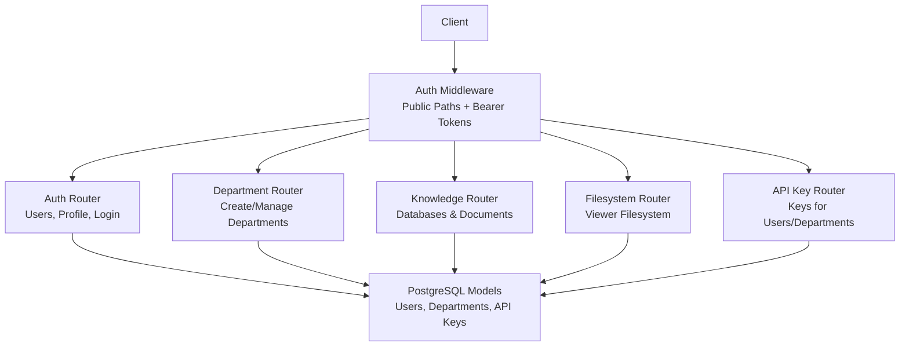
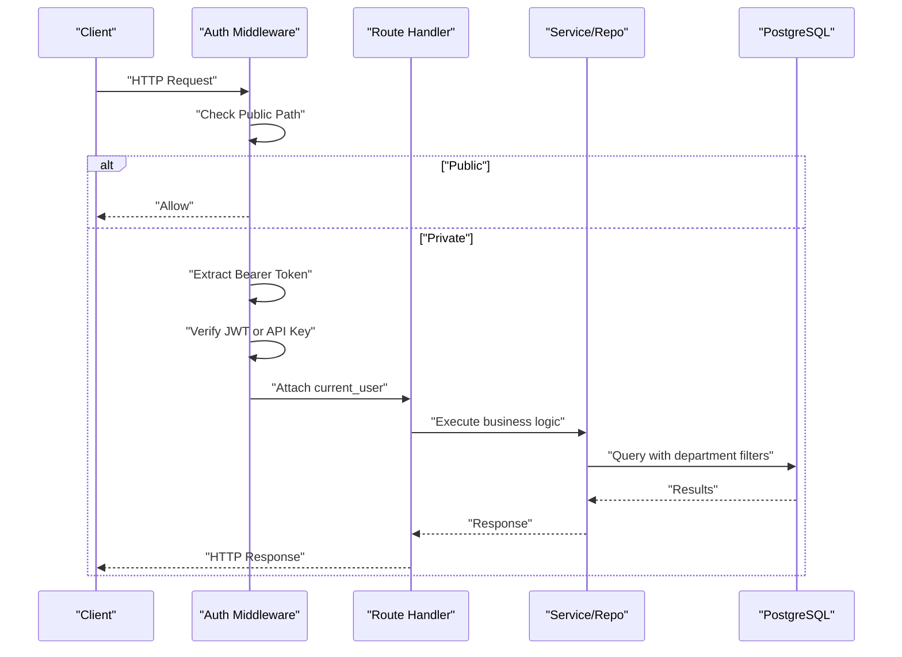
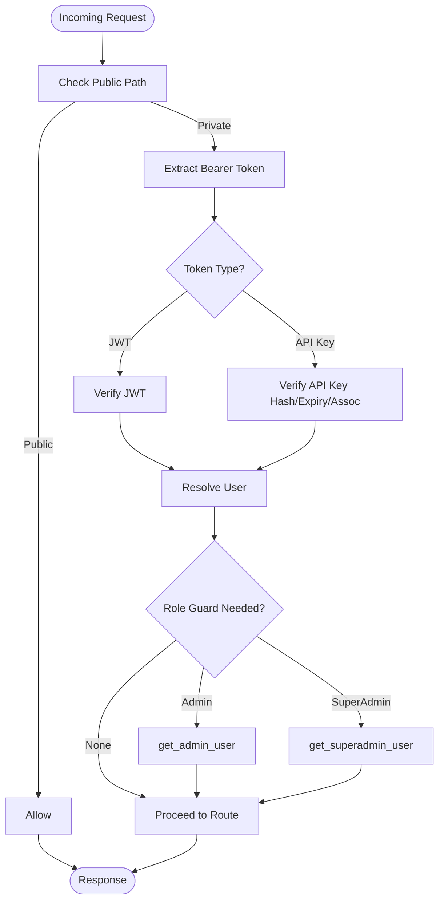
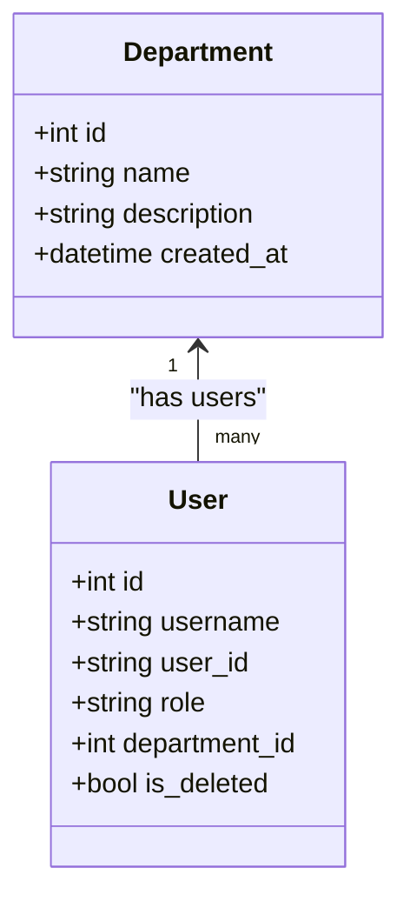
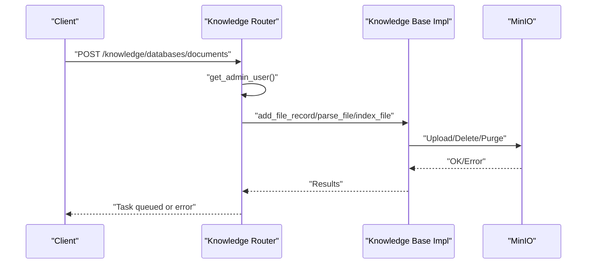
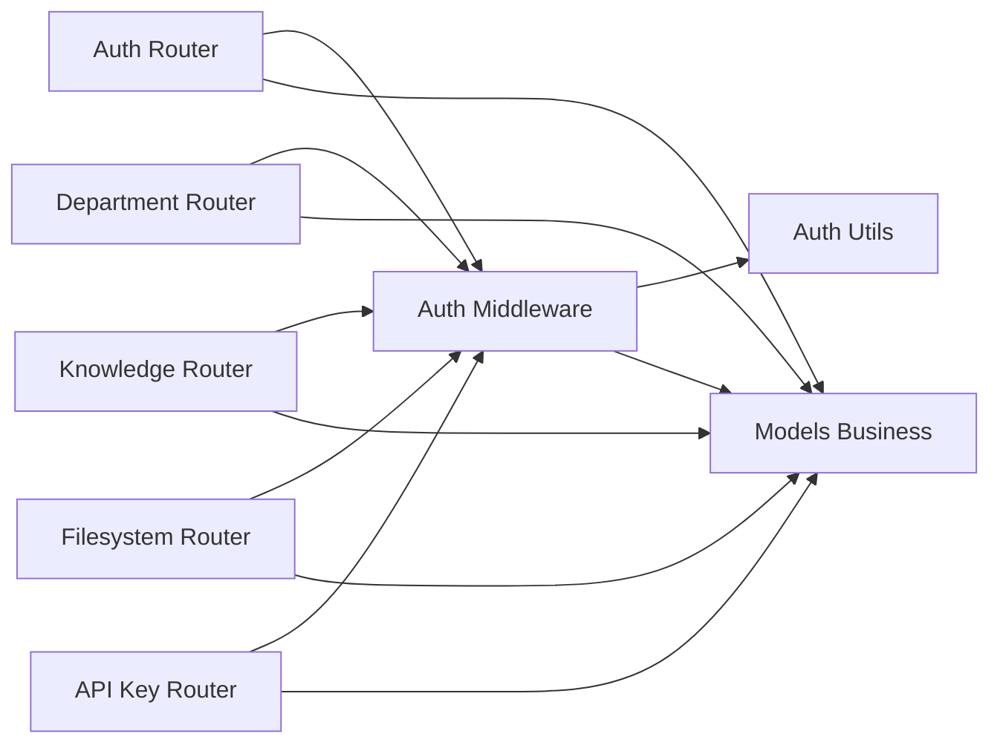

# Access Control

<cite>
**Referenced Files in This Document**
- [auth_middleware.py](file://backend/server/utils/auth_middleware.py)
- [auth_utils.py](file://backend/server/utils/auth_utils.py)
- [main.py](file://backend/server/main.py)
- [models_business.py](file://backend/package/yuxi/storage/pgsql/models_business.py)
- [user_repository.py](file://backend/package/yuxi/repositories/user_repository.py)
- [department_repository.py](file://backend/package/yuxi/repositories/department_repository.py)
- [auth_router.py](file://backend/server/routers/auth_router.py)
- [department_router.py](file://backend/server/routers/department_router.py)
- [knowledge_router.py](file://backend/server/routers/knowledge_router.py)
- [filesystem_router.py](file://backend/server/routers/filesystem_router.py)
- [apikey_router.py](file://backend/server/routers/apikey_router.py)
- [common_utils.py](file://backend/server/utils/common_utils.py)
- [user.js](file://web/src/stores/user.js)
- [department_api.js](file://web/src/apis/department_api.js)
- [test_auth_router.py](file://backend/test/integration/api/test_auth_router.py)
- [test_apikey_router.py](file://backend/test/integration/api/test_apikey_router.py)
</cite>

## Table of Contents
1. [Introduction](#introduction)
2. [Project Structure](#project-structure)
3. [Core Components](#core-components)
4. [Architecture Overview](#architecture-overview)
5. [Detailed Component Analysis](#detailed-component-analysis)
6. [Dependency Analysis](#dependency-analysis)
7. [Performance Considerations](#performance-considerations)
8. [Troubleshooting Guide](#troubleshooting-guide)
9. [Conclusion](#conclusion)
10. [Appendices](#appendices)

## Introduction
This document describes the access control system of the Yuxi platform with a focus on role-based access control (RBAC), department-based isolation, and resource-level authorization. It explains how authentication and authorization are enforced across the backend, how API endpoints enforce permissions, and how department hierarchies and multi-tenant boundaries are maintained. It also covers authorization middleware, permission checking mechanisms, API endpoint authorization rules, parameter-level security controls, practical configuration examples, testing approaches, and common pitfalls to avoid.

## Project Structure
The access control implementation spans several layers:
- Authentication and authorization middleware that intercepts requests and enforces public/private paths and bearer tokens.
- Role-based guards that restrict access to administrative endpoints.
- Department-aware repositories and routers that enforce tenant isolation.
- Resource-specific routers for agents, knowledge bases, files, and system configurations.
- Audit logging utilities to track sensitive operations.

**Diagram sources**
- [auth_middleware.py:15-168](file://backend/server/utils/auth_middleware.py#L15-L168)
- [auth_router.py:115-207](file://backend/server/routers/auth_router.py#L115-L207)
- [department_router.py:97-170](file://backend/server/routers/department_router.py#L97-L170)
- [knowledge_router.py:90-198](file://backend/server/routers/knowledge_router.py#L90-L198)
- [filesystem_router.py:24-97](file://backend/server/routers/filesystem_router.py#L24-L97)
- [apikey_router.py:100-194](file://backend/server/routers/apikey_router.py#L100-L194)
- [models_business.py:29-104](file://backend/package/yuxi/storage/pgsql/models_business.py#L29-L104)

**Section sources**
- [auth_middleware.py:15-168](file://backend/server/utils/auth_middleware.py#L15-L168)
- [auth_router.py:115-207](file://backend/server/routers/auth_router.py#L115-L207)
- [department_router.py:97-170](file://backend/server/routers/department_router.py#L97-L170)
- [knowledge_router.py:90-198](file://backend/server/routers/knowledge_router.py#L90-L198)
- [filesystem_router.py:24-97](file://backend/server/routers/filesystem_router.py#L24-L97)
- [apikey_router.py:100-194](file://backend/server/routers/apikey_router.py#L100-L194)
- [models_business.py:29-104](file://backend/package/yuxi/storage/pgsql/models_business.py#L29-L104)

## Core Components
- Authentication and Authorization Middleware
  - Public paths whitelist allows anonymous access to health checks and initialization endpoints.
  - Bearer token extraction supports both JWT and API Key formats.
  - Enforces role-based guards via dependency injectors for admin and superadmin.
- Roles and Permissions
  - Roles: superadmin, admin, user.
  - Superadmin can manage all resources and users; admin is restricted to department-scoped actions; user is restricted to personal actions.
- Department-Based Multi-Tenant Isolation
  - Users belong to departments; routers filter lists and operations by department.
  - Department creation automatically assigns an admin user to the newly created department.
- Resource-Level Access Control
  - Knowledge base routers enforce admin-level access for destructive operations and Dify-type restrictions.
  - Filesystem viewer endpoints require a logged-in user and derive visibility from agent configuration and department context.
- Audit Logging
  - Centralized logging utility records operations with IP address and user context.

**Section sources**
- [auth_middleware.py:15-168](file://backend/server/utils/auth_middleware.py#L15-L168)
- [auth_router.py:379-471](file://backend/server/routers/auth_router.py#L379-L471)
- [department_router.py:97-170](file://backend/server/routers/department_router.py#L97-L170)
- [knowledge_router.py:90-198](file://backend/server/routers/knowledge_router.py#L90-L198)
- [filesystem_router.py:24-97](file://backend/server/routers/filesystem_router.py#L24-L97)
- [common_utils.py:33-45](file://backend/server/utils/common_utils.py#L33-L45)

## Architecture Overview
The authorization pipeline:
1. Requests enter the FastAPI application.
2. Middleware inspects the path against public patterns; if private, requires a valid bearer token.
3. Token is verified as either JWT or API Key; associated user is resolved.
4. Route-level dependencies enforce role checks (admin/superadmin) and department scoping.
5. Repositories and services apply department filters to queries.
6. Operations are logged for audit.

**Diagram sources**
- [auth_middleware.py:74-123](file://backend/server/utils/auth_middleware.py#L74-L123)
- [auth_router.py:379-471](file://backend/server/routers/auth_router.py#L379-L471)
- [models_business.py:29-104](file://backend/package/yuxi/storage/pgsql/models_business.py#L29-L104)

## Detailed Component Analysis

### Authentication and Authorization Middleware
- Public paths: health checks, initialization, and token endpoint are publicly accessible.
- Token verification:
  - JWT: validated via a shared secret and expiration.
  - API Key: validated by hash lookup, enabled flag, expiration, and association to user/admin/superadmin or department-level fallback.
- Role guards:
  - get_required_user ensures a user is bound to a department.
  - get_admin_user/get_superadmin_user enforce role checks.
- Rate limiting and login attempts:
  - Login rate limiting middleware tracks attempts per IP for the token endpoint.
  - User login lockout prevents brute force after repeated failures.

**Diagram sources**
- [auth_middleware.py:15-168](file://backend/server/utils/auth_middleware.py#L15-L168)
- [auth_utils.py:46-80](file://backend/server/utils/auth_utils.py#L46-L80)
- [main.py:63-129](file://backend/server/main.py#L63-L129)

**Section sources**
- [auth_middleware.py:15-168](file://backend/server/utils/auth_middleware.py#L15-L168)
- [auth_utils.py:46-80](file://backend/server/utils/auth_utils.py#L46-L80)
- [main.py:63-129](file://backend/server/main.py#L63-L129)

### Role-Based Access Control (RBAC)
- Roles:
  - superadmin: full system control, including user and department management, and cross-department operations.
  - admin: department-scoped management (users, knowledge base operations).
  - user: personal profile updates and read-only access to resources they can reach.
- Route-level enforcement:
  - Admin-only routes use get_admin_user dependency.
  - Superadmin-only routes use get_superadmin_user dependency.
  - Personal actions (e.g., profile update) use get_required_user.

**Section sources**
- [auth_router.py:379-471](file://backend/server/routers/auth_router.py#L379-L471)
- [department_router.py:97-170](file://backend/server/routers/department_router.py#L97-L170)
- [auth_middleware.py:142-159](file://backend/server/utils/auth_middleware.py#L142-L159)

### Department Hierarchies and Multi-Tenant Security Isolation
- Department model links users and agent configurations.
- Department-aware repositories:
  - UserRepository.list_with_department applies department filters.
  - DepartmentRepository.list_with_user_count aggregates counts.
- Department management:
  - Creation creates a department and an admin user bound to it.
  - Updates/deletes enforce uniqueness of admin per department.
- Frontend helpers:
  - Web APIs for department management reflect role-based access (admin vs superadmin).

**Diagram sources**
- [models_business.py:29-104](file://backend/package/yuxi/storage/pgsql/models_business.py#L29-L104)
- [user_repository.py:51-69](file://backend/package/yuxi/repositories/user_repository.py#L51-L69)
- [department_repository.py:32-50](file://backend/package/yuxi/repositories/department_repository.py#L32-L50)

**Section sources**
- [models_business.py:29-104](file://backend/package/yuxi/storage/pgsql/models_business.py#L29-L104)
- [user_repository.py:51-69](file://backend/package/yuxi/repositories/user_repository.py#L51-L69)
- [department_repository.py:32-50](file://backend/package/yuxi/repositories/department_repository.py#L32-L50)
- [department_router.py:97-170](file://backend/server/routers/department_router.py#L97-L170)
- [department_api.js:19-70](file://web/src/apis/department_api.js#L19-L70)

### Resource-Level Access Control

#### Agents and Agent Configurations
- Agent configuration records are scoped to departments and agent IDs.
- Context resolution for filesystem and knowledge base visibility respects department and agent configuration.

**Section sources**
- [models_business.py:133-184](file://backend/package/yuxi/storage/pgsql/models_business.py#L133-L184)
- [filesystem_router.py:24-97](file://backend/server/routers/filesystem_router.py#L24-L97)

#### Knowledge Bases and Documents
- Admin-only routes for creating, updating, deleting, exporting, and managing databases and documents.
- Dify-type knowledge bases are restricted from destructive operations.
- Filesystem viewer endpoints require a logged-in user and derive visibility from agent configuration and department context.

**Diagram sources**
- [knowledge_router.py:302-491](file://backend/server/routers/knowledge_router.py#L302-L491)

**Section sources**
- [knowledge_router.py:90-198](file://backend/server/routers/knowledge_router.py#L90-L198)
- [knowledge_router.py:302-491](file://backend/server/routers/knowledge_router.py#L302-L491)
- [knowledge_router.py:717-749](file://backend/server/routers/knowledge_router.py#L717-L749)

#### Files and Filesystem Viewer
- Viewer filesystem endpoints require a logged-in user and derive visibility from agent configuration and department context.
- Parameter validation ensures safe traversal and operation paths.

**Section sources**
- [filesystem_router.py:24-97](file://backend/server/routers/filesystem_router.py#L24-L97)

#### System Configurations and API Keys
- API Key management is user-scoped by default; superadmins can operate across users.
- API Keys can be bound to users or departments; verification resolves associated user or falls back to department admin.

**Section sources**
- [apikey_router.py:100-194](file://backend/server/routers/apikey_router.py#L100-L194)
- [auth_middleware.py:35-70](file://backend/server/utils/auth_middleware.py#L35-L70)

### Authorization Middleware Implementation
- Public path detection avoids authentication for health checks and initialization.
- Bearer token parsing supports JWT and API Key prefixes.
- Role guards are applied via FastAPI Depends, ensuring route handlers receive validated users with appropriate roles.

**Section sources**
- [auth_middleware.py:15-168](file://backend/server/utils/auth_middleware.py#L15-L168)
- [main.py:102-129](file://backend/server/main.py#L102-L129)

### Permission Checking Mechanisms Throughout the Application
- Route dependencies:
  - get_required_user: ensures a user is present and belongs to a department.
  - get_admin_user/get_superadmin_user: enforce role checks.
- Repository-level filtering:
  - UserRepository.list_with_department applies department filters.
  - DepartmentRepository.list_with_user_count aggregates counts.
- Router-level checks:
  - Knowledge base routes enforce admin-only operations.
  - API key routes enforce ownership or superadmin privileges.

**Section sources**
- [auth_middleware.py:126-159](file://backend/server/utils/auth_middleware.py#L126-L159)
- [user_repository.py:51-69](file://backend/package/yuxi/repositories/user_repository.py#L51-L69)
- [department_router.py:97-170](file://backend/server/routers/department_router.py#L97-L170)
- [knowledge_router.py:90-198](file://backend/server/routers/knowledge_router.py#L90-L198)
- [apikey_router.py:152-194](file://backend/server/routers/apikey_router.py#L152-L194)

### API Endpoint Authorization Rules and Parameter-Level Security Controls
- Authentication:
  - All /api routes require a valid bearer token except public paths.
- Authorization:
  - Admin-only endpoints: users management, knowledge base management, department management.
  - Superadmin-only endpoints: initial admin creation, department creation with admin assignment.
  - Parameter-level controls:
    - Knowledge base creation validates embedding model availability and Dify parameters.
    - File uploads enforce content type and size limits.
    - Knowledge base document operations validate paths and prevent unauthorized access.
- Frontend helpers:
  - Web APIs for department management reflect role-based access (admin vs superadmin).

**Section sources**
- [auth_router.py:115-207](file://backend/server/routers/auth_router.py#L115-L207)
- [knowledge_router.py:100-177](file://backend/server/routers/knowledge_router.py#L100-L177)
- [knowledge_router.py:302-338](file://backend/server/routers/knowledge_router.py#L302-L338)
- [department_api.js:19-70](file://web/src/apis/department_api.js#L19-L70)

### Practical Examples

#### Creating a Department and Assigning an Admin
- Superadmin creates a department and an admin user bound to it.
- The admin inherits department scope for subsequent operations.

**Section sources**
- [department_router.py:97-170](file://backend/server/routers/department_router.py#L97-L170)

#### Managing Users Within a Department
- Admin can create/update/delete users within their department.
- Superadmin can bypass department constraints.

**Section sources**
- [auth_router.py:379-471](file://backend/server/routers/auth_router.py#L379-L471)
- [auth_router.py:524-619](file://backend/server/routers/auth_router.py#L524-L619)

#### Uploading and Managing Knowledge Base Documents
- Admin uploads files; backend validates content type and size.
- Parsing and indexing are queued tasks with progress reporting.

**Section sources**
- [knowledge_router.py:302-491](file://backend/server/routers/knowledge_router.py#L302-L491)

#### Using API Keys for Programmatic Access
- Users can create API Keys bound to themselves or departments.
- API Key verification resolves associated user or department admin.

**Section sources**
- [apikey_router.py:100-194](file://backend/server/routers/apikey_router.py#L100-L194)
- [auth_middleware.py:35-70](file://backend/server/utils/auth_middleware.py#L35-L70)

### Access Control Testing
- Authentication tests verify:
  - Invalid credentials rejected.
  - Repeated failed logins trigger lockouts with remaining time headers.
  - Admin can manage users and profiles.
- API key tests verify:
  - Listing, creating, retrieving, and updating API keys.
  - Ownership and superadmin privileges enforced.

**Section sources**
- [test_auth_router.py:14-75](file://backend/test/integration/api/test_auth_router.py#L14-L75)
- [test_apikey_router.py:38-99](file://backend/test/integration/api/test_apikey_router.py#L38-L99)

## Dependency Analysis
- Middleware depends on:
  - Auth utilities for JWT encode/decode.
  - Database session management for user lookup.
- Routers depend on:
  - Repositories for data access with department filters.
  - Auth middleware for role checks.
- Models define relationships between Users, Departments, and API Keys.

**Diagram sources**
- [auth_middleware.py:15-168](file://backend/server/utils/auth_middleware.py#L15-L168)
- [auth_utils.py:46-80](file://backend/server/utils/auth_utils.py#L46-L80)
- [auth_router.py:15-25](file://backend/server/routers/auth_router.py#L15-L25)
- [department_router.py:13-20](file://backend/server/routers/department_router.py#L13-L20)
- [knowledge_router.py:13-25](file://backend/server/routers/knowledge_router.py#L13-L25)
- [filesystem_router.py:12-19](file://backend/server/routers/filesystem_router.py#L12-L19)
- [apikey_router.py:100-194](file://backend/server/routers/apikey_router.py#L100-L194)
- [models_business.py:29-104](file://backend/package/yuxi/storage/pgsql/models_business.py#L29-L104)

**Section sources**
- [auth_middleware.py:15-168](file://backend/server/utils/auth_middleware.py#L15-L168)
- [auth_router.py:15-25](file://backend/server/routers/auth_router.py#L15-L25)
- [department_router.py:13-20](file://backend/server/routers/department_router.py#L13-L20)
- [knowledge_router.py:13-25](file://backend/server/routers/knowledge_router.py#L13-L25)
- [filesystem_router.py:12-19](file://backend/server/routers/filesystem_router.py#L12-L19)
- [apikey_router.py:100-194](file://backend/server/routers/apikey_router.py#L100-L194)
- [models_business.py:29-104](file://backend/package/yuxi/storage/pgsql/models_business.py#L29-L104)

## Performance Considerations
- Middleware overhead: token verification and role checks occur per request; keep token size minimal and avoid unnecessary role checks.
- Database queries: department filters add joins; ensure proper indexing on foreign keys and frequently filtered columns.
- Background tasks: knowledge ingestion and indexing are offloaded; monitor queue throughput and worker capacity.
- Rate limiting: login attempts are tracked per IP; tune thresholds to balance security and usability.

## Troubleshooting Guide
- 401 Unauthorized:
  - Missing or invalid Authorization header; ensure Bearer token is present and valid.
- 403 Forbidden:
  - Insufficient role (admin/superadmin) or attempting to modify cross-department resources.
- 423 Locked:
  - Account locked due to repeated failed logins; wait for lock duration to expire.
- 404 Not Found:
  - Resource does not exist or user lacks visibility (department-scoped).
- Audit logs:
  - Use operation logs to trace user actions and IP addresses for investigations.

**Section sources**
- [auth_router.py:115-207](file://backend/server/routers/auth_router.py#L115-L207)
- [auth_router.py:622-690](file://backend/server/routers/auth_router.py#L622-L690)
- [common_utils.py:33-45](file://backend/server/utils/common_utils.py#L33-L45)

## Conclusion
The Yuxi platform implements a robust RBAC system with clear role boundaries, department-based multi-tenancy, and strong authorization at the router and repository levels. Authentication middleware enforces public/private paths and validates tokens, while route dependencies ensure only authorized users can perform privileged operations. Resource-level controls protect knowledge bases and files, and audit logging supports compliance and incident response.

## Appendices

### Least Privilege Principles
- Grant users the minimum role required (prefer user over admin).
- Limit department admin assignments; maintain separation of duties.
- Use API Keys sparingly and bind them to specific users or departments.

### Audit Trail Requirements
- Enable operation logging for all sensitive endpoints.
- Include user ID, IP address, operation type, and timestamps.
- Retain logs per policy and support retention and export capabilities.