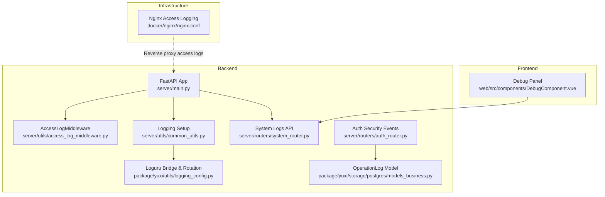
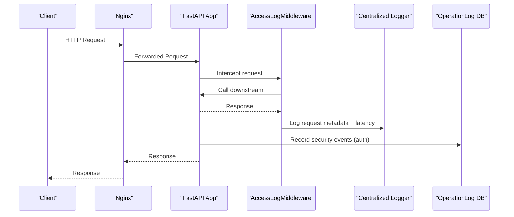
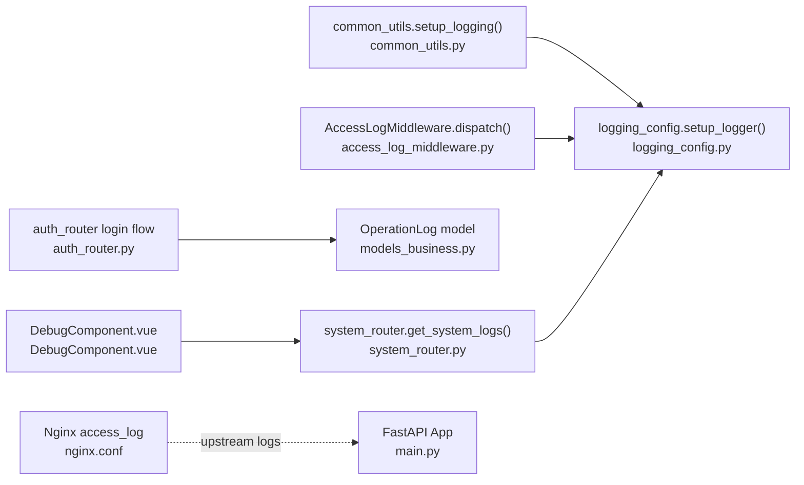

# Audit Logging & Monitoring

<cite>
**Referenced Files in This Document**
- [main.py](file://backend/server/main.py)
- [access_log_middleware.py](file://backend/server/utils/access_log_middleware.py)
- [common_utils.py](file://backend/server/utils/common_utils.py)
- [logging_config.py](file://backend/package/yuxi/utils/logging_config.py)
- [system_router.py](file://backend/server/routers/system_router.py)
- [auth_router.py](file://backend/server/routers/auth_router.py)
- [models_business.py](file://backend/package/yuxi/storage/postgres/models_business.py)
- [nginx.conf](file://docker/nginx/nginx.conf)
- [DebugComponent.vue](file://web/src/components/DebugComponent.vue)
</cite>

## Table of Contents
1. [Introduction](#introduction)
2. [Project Structure](#project-structure)
3. [Core Components](#core-components)
4. [Architecture Overview](#architecture-overview)
5. [Detailed Component Analysis](#detailed-component-analysis)
6. [Dependency Analysis](#dependency-analysis)
7. [Performance Considerations](#performance-considerations)
8. [Troubleshooting Guide](#troubleshooting-guide)
9. [Conclusion](#conclusion)
10. [Appendices](#appendices)

## Introduction
This document provides comprehensive audit logging and monitoring guidance for the Yuxi platform. It covers centralized logging configuration (structured logs, log levels, rotation), access logging middleware for API request visibility, security event logging for authentication and authorization events, integration with external monitoring systems, and practical procedures for log analysis, incident response, retention, secure transmission, and privacy considerations.

## Project Structure
The logging and monitoring stack spans backend middleware, application logging configuration, database-backed operation logs, and a frontend debug panel for log viewing. Nginx provides upstream access logging for reverse-proxy scenarios.

**Diagram sources**
- [main.py:132-137](file://backend/server/main.py#L132-L137)
- [access_log_middleware.py:34-67](file://backend/server/utils/access_log_middleware.py#L34-L67)
- [common_utils.py:11-31](file://backend/server/utils/common_utils.py#L11-L31)
- [logging_config.py:55-89](file://backend/package/yuxi/utils/logging_config.py#L55-L89)
- [system_router.py:54-94](file://backend/server/routers/system_router.py#L54-L94)
- [auth_router.py:156-192](file://backend/server/routers/auth_router.py#L156-L192)
- [models_business.py:373-390](file://backend/package/yuxi/storage/postgres/models_business.py#L373-L390)
- [nginx.conf:15-19](file://docker/nginx/nginx.conf#L15-L19)
- [DebugComponent.vue:1-200](file://web/src/components/DebugComponent.vue#L1-L200)

**Section sources**
- [main.py:132-137](file://backend/server/main.py#L132-L137)
- [access_log_middleware.py:1-68](file://backend/server/utils/access_log_middleware.py#L1-L68)
- [common_utils.py:11-31](file://backend/server/utils/common_utils.py#L11-L31)
- [logging_config.py:55-89](file://backend/package/yuxi/utils/logging_config.py#L55-L89)
- [system_router.py:54-94](file://backend/server/routers/system_router.py#L54-L94)
- [auth_router.py:156-192](file://backend/server/routers/auth_router.py#L156-L192)
- [models_business.py:373-390](file://backend/package/yuxi/storage/postgres/models_business.py#L373-L390)
- [nginx.conf:15-19](file://docker/nginx/nginx.conf#L15-L19)
- [DebugComponent.vue:1-200](file://web/src/components/DebugComponent.vue#L1-L200)

## Core Components
- Centralized logging configuration with structured logs and rotation:
  - Application-wide logging format and uvicorn access suppression.
  - Loguru bridge to capture third-party library logs and write to rotating files with retention and compression.
- Access logging middleware:
  - Records client IP, method, path, query, HTTP version, status code, and response time.
- Security event logging:
  - Authentication failure and lock events recorded as operation logs with user identity and IP.
- Frontend log viewer:
  - Parses and filters backend log files by level and text, supports auto-refresh and fullscreen.
- Infrastructure logging:
  - Nginx access logs for reverse-proxy traffic visibility.

**Section sources**
- [common_utils.py:11-31](file://backend/server/utils/common_utils.py#L11-L31)
- [logging_config.py:55-89](file://backend/package/yuxi/utils/logging_config.py#L55-L89)
- [access_log_middleware.py:34-67](file://backend/server/utils/access_log_middleware.py#L34-L67)
- [system_router.py:54-94](file://backend/server/routers/system_router.py#L54-L94)
- [auth_router.py:156-192](file://backend/server/routers/auth_router.py#L156-L192)
- [models_business.py:373-390](file://backend/package/yuxi/storage/postgres/models_business.py#L373-L390)
- [DebugComponent.vue:201-283](file://web/src/components/DebugComponent.vue#L201-L283)
- [nginx.conf:15-19](file://docker/nginx/nginx.conf#L15-L19)

## Architecture Overview
The system integrates multiple layers of logging and monitoring:
- Application logging: structured logs via Loguru with rotation and retention.
- Middleware logging: access logs for every request with timing and client IP.
- Security logging: operation logs for authentication events and user actions.
- Frontend viewer: real-time log inspection with filtering and auto-refresh.
- Reverse proxy logging: Nginx access logs for upstream traffic.

**Diagram sources**
- [main.py:132-137](file://backend/server/main.py#L132-L137)
- [access_log_middleware.py:34-67](file://backend/server/utils/access_log_middleware.py#L34-L67)
- [logging_config.py:55-89](file://backend/package/yuxi/utils/logging_config.py#L55-L89)
- [auth_router.py:156-192](file://backend/server/routers/auth_router.py#L156-L192)
- [models_business.py:373-390](file://backend/package/yuxi/storage/postgres/models_business.py#L373-L390)
- [nginx.conf:15-19](file://docker/nginx/nginx.conf#L15-L19)

## Detailed Component Analysis

### Centralized Logging Configuration
- Structured logging:
  - Root logger configured with a consistent format.
  - uvicorn access logs suppressed and re-formatted to match application logs.
- Loguru bridge:
  - Bridges Python logging to Loguru to capture third-party libraries.
  - Writes to rotating files with size-based rotation, retention, and compression.
- Save location and filename:
  - Logs written under a saves-directory with daily filenames.

Practical configuration highlights:
- Log format and uvicorn alignment.
- Rotation policy: size-based rotation.
- Retention policy: days-based retention.
- Compression: zip compression for archived logs.
- Console vs file handlers: colorized console handler and non-colorized file handler.

**Section sources**
- [common_utils.py:11-31](file://backend/server/utils/common_utils.py#L11-L31)
- [logging_config.py:55-89](file://backend/package/yuxi/utils/logging_config.py#L55-L89)

### Access Logging Middleware
- Purpose:
  - Capture every request’s client IP, method, path, query string, HTTP version, status code, and processing time.
- Implementation:
  - Extracts X-Forwarded-For or direct client host.
  - Measures elapsed time using high-resolution timer.
  - Emits a single structured log line per request.
- Output:
  - Dedicated access logger with a simple format.

Operational impact:
- Enables request profiling and anomaly detection.
- Supports correlation with application logs and database operation logs.

**Section sources**
- [access_log_middleware.py:24-67](file://backend/server/utils/access_log_middleware.py#L24-L67)
- [main.py:132-137](file://backend/server/main.py#L132-L137)

### Security Event Logging (Authentication Failures, Authorization Attempts)
- Operation logs:
  - Database model captures user ID, operation type, details, IP address, and timestamp.
  - Utility writes operation logs asynchronously and tolerates failures to avoid impacting primary operations.
- Authentication events:
  - On failed login attempts, the system increments failure counters and records “Login Failure” entries.
  - When lock threshold is reached, a locked response is returned with headers indicating remaining lock time.
  - On successful login, a “Login” operation log is recorded.

Security controls:
- Login rate limiting per IP for the token endpoint.
- Account lockout after repeated failures with remaining lock time exposed via headers.

**Section sources**
- [models_business.py:373-390](file://backend/package/yuxi/storage/postgres/models_business.py#L373-L390)
- [common_utils.py:33-45](file://backend/server/utils/common_utils.py#L33-L45)
- [auth_router.py:156-192](file://backend/server/routers/auth_router.py#L156-L192)
- [main.py:63-96](file://backend/server/main.py#L63-L96)

### Frontend Log Viewer and Filtering
- Capabilities:
  - Fetches recent log lines from the backend system logs endpoint.
  - Parses structured log lines into timestamp, level, module, and message.
  - Filters by log level and free-text search.
  - Auto-refresh toggle and fullscreen mode.
- Backend integration:
  - Uses the system logs endpoint with optional level filter.
  - Reads up to a bounded number of recent lines from the log file.

**Section sources**
- [system_router.py:54-94](file://backend/server/routers/system_router.py#L54-L94)
- [DebugComponent.vue:201-283](file://web/src/components/DebugComponent.vue#L201-L283)

### Infrastructure Logging (Nginx Access Logs)
- Nginx logs upstream HTTP requests with client IP, user agent, forwarded-for header, status, and body bytes.
- Useful for detecting anomalies at the edge and correlating with backend logs.

**Section sources**
- [nginx.conf:15-19](file://docker/nginx/nginx.conf#L15-L19)

## Dependency Analysis
- Application startup depends on centralized logging setup.
- Access logging middleware is registered globally and runs before route handlers.
- Security event logging depends on the operation log model and database session.
- Frontend log viewer depends on the system logs endpoint and parses structured lines.

**Diagram sources**
- [common_utils.py:11-31](file://backend/server/utils/common_utils.py#L11-L31)
- [logging_config.py:55-89](file://backend/package/yuxi/utils/logging_config.py#L55-L89)
- [access_log_middleware.py:34-67](file://backend/server/utils/access_log_middleware.py#L34-L67)
- [auth_router.py:156-192](file://backend/server/routers/auth_router.py#L156-L192)
- [models_business.py:373-390](file://backend/package/yuxi/storage/postgres/models_business.py#L373-L390)
- [system_router.py:54-94](file://backend/server/routers/system_router.py#L54-L94)
- [DebugComponent.vue:201-283](file://web/src/components/DebugComponent.vue#L201-L283)
- [nginx.conf:15-19](file://docker/nginx/nginx.conf#L15-L19)
- [main.py:132-137](file://backend/server/main.py#L132-L137)

**Section sources**
- [main.py:132-137](file://backend/server/main.py#L132-L137)
- [access_log_middleware.py:34-67](file://backend/server/utils/access_log_middleware.py#L34-L67)
- [common_utils.py:11-31](file://backend/server/utils/common_utils.py#L11-L31)
- [logging_config.py:55-89](file://backend/package/yuxi/utils/logging_config.py#L55-L89)
- [system_router.py:54-94](file://backend/server/routers/system_router.py#L54-L94)
- [auth_router.py:156-192](file://backend/server/routers/auth_router.py#L156-L192)
- [models_business.py:373-390](file://backend/package/yuxi/storage/postgres/models_business.py#L373-L390)
- [DebugComponent.vue:201-283](file://web/src/components/DebugComponent.vue#L201-L283)
- [nginx.conf:15-19](file://docker/nginx/nginx.conf#L15-L19)

## Performance Considerations
- Access logging overhead:
  - Minimal cost due to simple formatting and single log emission per request.
- Log rotation and retention:
  - Size-based rotation prevents unbounded disk growth; retention and compression reduce long-term storage costs.
- Frontend log viewer:
  - Limits the number of lines fetched and parsed to maintain responsiveness.
- Rate limiting:
  - Login attempts are rate-limited per IP to reduce load and mitigate brute-force attacks.

[No sources needed since this section provides general guidance]

## Troubleshooting Guide
- Logs not appearing in the frontend viewer:
  - Verify the system logs endpoint is reachable and the log file path is correct.
  - Confirm the log level filter selection and search text are not excluding expected entries.
- Excessive logs or disk pressure:
  - Adjust rotation size and retention settings in the logging configuration.
- Duplicate or missing access logs:
  - Ensure the AccessLogMiddleware is registered and uvicorn access logs are suppressed.
- Authentication lockout confusion:
  - Check the remaining lock time headers and verify account lock thresholds.

**Section sources**
- [system_router.py:54-94](file://backend/server/routers/system_router.py#L54-L94)
- [DebugComponent.vue:201-283](file://web/src/components/DebugComponent.vue#L201-L283)
- [access_log_middleware.py:14-21](file://backend/server/utils/access_log_middleware.py#L14-L21)
- [common_utils.py:22-31](file://backend/server/utils/common_utils.py#L22-L31)
- [auth_router.py:164-176](file://backend/server/routers/auth_router.py#L164-L176)

## Conclusion
The Yuxi platform implements a layered logging and monitoring strategy combining structured application logs, request access logs, security operation logs, and a frontend viewer. Together with infrastructure logging and rate-limiting controls, this foundation supports robust auditability, incident detection, and compliance reporting.

[No sources needed since this section summarizes without analyzing specific files]

## Appendices

### Practical Examples

- Centralized logging configuration
  - Configure application-wide logging format and uvicorn access suppression.
  - Set up Loguru with size-based rotation, retention, and compression.
  - Example paths:
    - [common_utils.py:11-31](file://backend/server/utils/common_utils.py#L11-L31)
    - [logging_config.py:55-89](file://backend/package/yuxi/utils/logging_config.py#L55-L89)

- Access logging middleware
  - Register the AccessLogMiddleware globally.
  - Review emitted logs for client IP, method, path, status, and latency.
  - Example paths:
    - [main.py:132-137](file://backend/server/main.py#L132-L137)
    - [access_log_middleware.py:34-67](file://backend/server/utils/access_log_middleware.py#L34-L67)

- Security monitoring setup
  - Monitor authentication failures and locks via operation logs.
  - Use the system logs endpoint to inspect security events.
  - Example paths:
    - [auth_router.py:156-192](file://backend/server/routers/auth_router.py#L156-L192)
    - [models_business.py:373-390](file://backend/package/yuxi/storage/postgres/models_business.py#L373-L390)
    - [system_router.py:54-94](file://backend/server/routers/system_router.py#L54-L94)

- Incident response procedure
  - Reproduce the issue using the frontend log viewer with level filters.
  - Correlate backend access logs with Nginx upstream logs.
  - Example paths:
    - [DebugComponent.vue:201-283](file://web/src/components/DebugComponent.vue#L201-L283)
    - [nginx.conf:15-19](file://docker/nginx/nginx.conf#L15-L19)

- Log retention, secure transmission, and privacy
  - Retention and compression are handled by the logging configuration.
  - Secure transmission: forward logs to SIEM or log aggregation systems using encrypted channels.
  - Privacy: avoid logging sensitive fields; sanitize logs; restrict access to the system logs endpoint.
  - Example paths:
    - [logging_config.py:63-72](file://backend/package/yuxi/utils/logging_config.py#L63-L72)
    - [system_router.py:54-94](file://backend/server/routers/system_router.py#L54-L94)