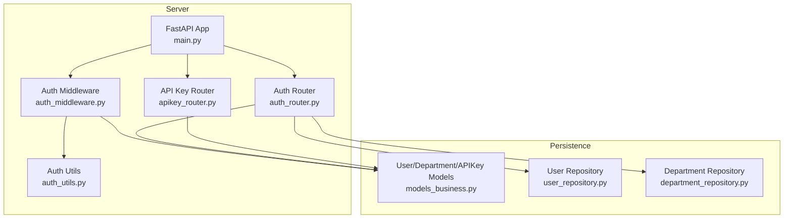
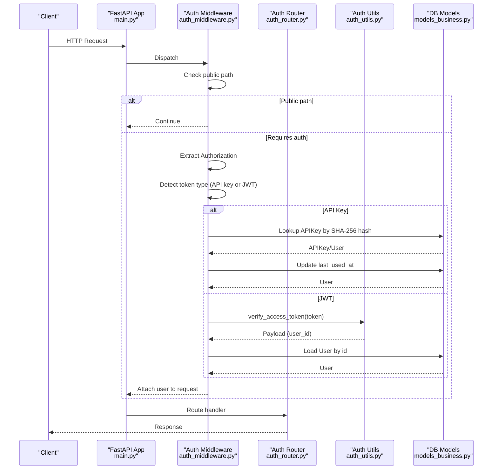
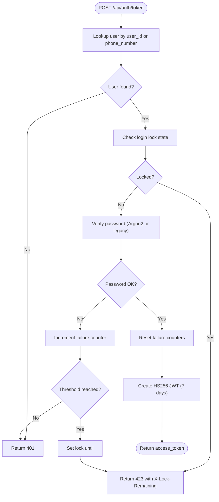
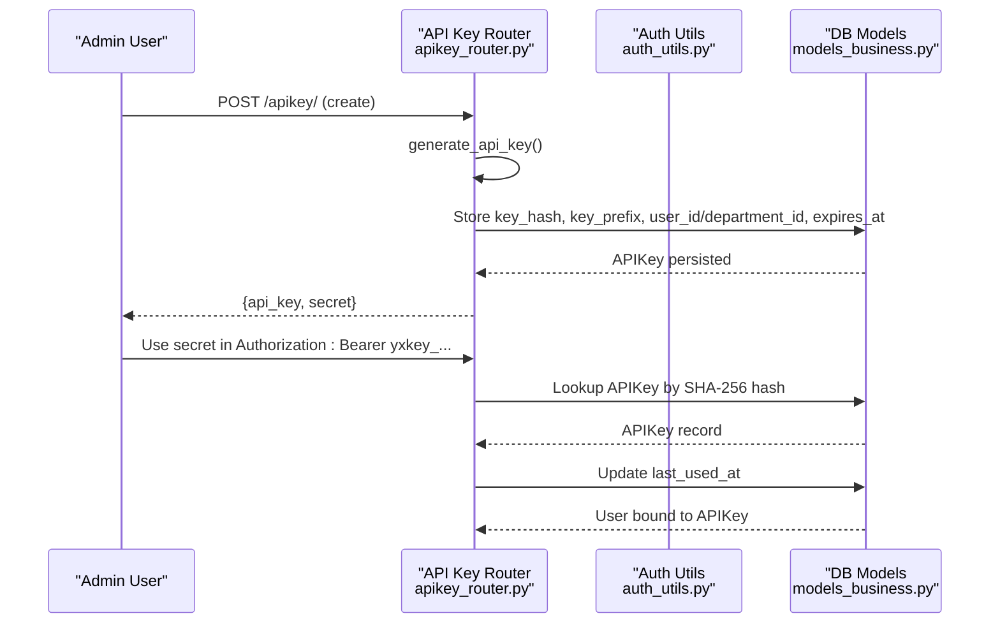
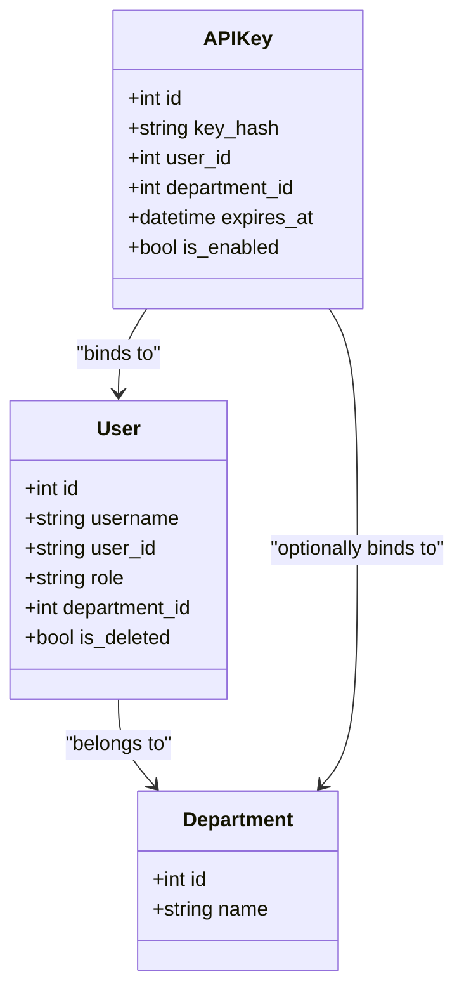
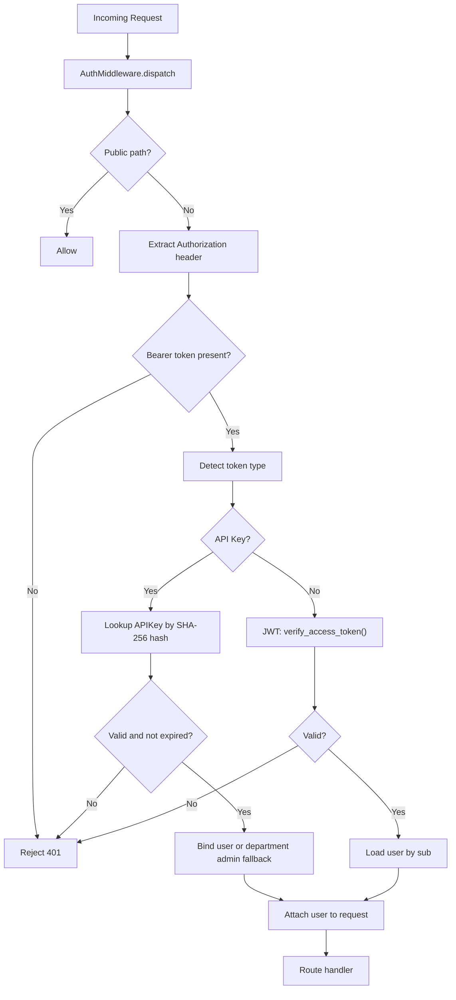
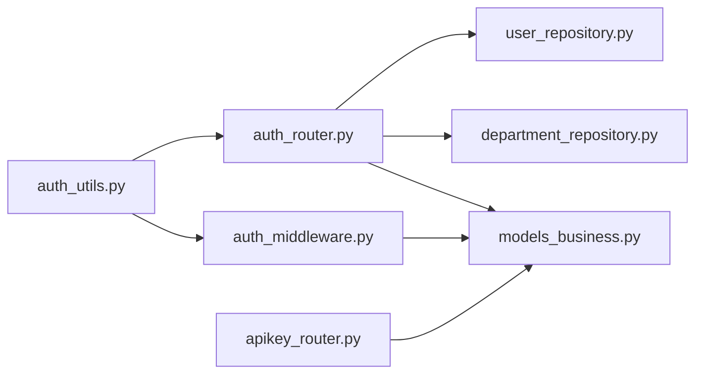

# Authentication & Authorization

<cite>
**Referenced Files in This Document**
- [auth_middleware.py](file://backend/server/utils/auth_middleware.py)
- [auth_utils.py](file://backend/server/utils/auth_utils.py)
- [auth_router.py](file://backend/server/routers/auth_router.py)
- [apikey_router.py](file://backend/server/routers/apikey_router.py)
- [main.py](file://backend/server/main.py)
- [models_business.py](file://backend/package/yuxi/storage/postgres/models_business.py)
- [user_repository.py](file://backend/package/yuxi/repositories/user_repository.py)
- [department_repository.py](file://backend/package/yuxi/repositories/department_repository.py)
- [api-key-integration.md](file://docs/advanced/api-key-integration.md)
- [test_auth_router.py](file://backend/test/integration/api/test_auth_router.py)
- [test_auth_utils.py](file://backend/test/unit/test_auth_utils.py)
</cite>

## Table of Contents
1. [Introduction](#introduction)
2. [Project Structure](#project-structure)
3. [Core Components](#core-components)
4. [Architecture Overview](#architecture-overview)
5. [Detailed Component Analysis](#detailed-component-analysis)
6. [Dependency Analysis](#dependency-analysis)
7. [Performance Considerations](#performance-considerations)
8. [Troubleshooting Guide](#troubleshooting-guide)
9. [Conclusion](#conclusion)
10. [Appendices](#appendices)

## Introduction
This document explains the Yuxi platform’s authentication and authorization system. It covers:
- JWT-based authentication for human users, including token generation, validation, and expiration handling
- Password hashing using Argon2 with backward compatibility for legacy SHA-256 with salt
- API key management for programmatic access and service authentication
- Role-based access control (RBAC) with department hierarchies and permission inheritance
- Authentication middleware pipeline and token verification processes
- Practical examples for login flows, API key usage, and operational best practices

## Project Structure
The authentication stack spans server utilities, routers, database models, repositories, and middleware. The main application wires middleware and rate-limiting around the API routers.

**Diagram sources**
- [main.py:40-150](file://backend/server/main.py#L40-L150)
- [auth_middleware.py:1-169](file://backend/server/utils/auth_middleware.py#L1-L169)
- [auth_utils.py:1-81](file://backend/server/utils/auth_utils.py#L1-L81)
- [auth_router.py:1-829](file://backend/server/routers/auth_router.py#L1-L829)
- [apikey_router.py:1-259](file://backend/server/routers/apikey_router.py#L1-L259)
- [models_business.py:51-663](file://backend/package/yuxi/storage/postgres/models_business.py#L51-L663)
- [user_repository.py:16-148](file://backend/package/yuxi/repositories/user_repository.py#L16-L148)
- [department_repository.py:11-96](file://backend/package/yuxi/repositories/department_repository.py#L11-L96)

**Section sources**
- [main.py:40-150](file://backend/server/main.py#L40-L150)
- [auth_middleware.py:1-169](file://backend/server/utils/auth_middleware.py#L1-L169)
- [auth_utils.py:1-81](file://backend/server/utils/auth_utils.py#L1-L81)
- [auth_router.py:1-829](file://backend/server/routers/auth_router.py#L1-L829)
- [apikey_router.py:1-259](file://backend/server/routers/apikey_router.py#L1-L259)
- [models_business.py:51-663](file://backend/package/yuxi/storage/postgres/models_business.py#L51-L663)
- [user_repository.py:16-148](file://backend/package/yuxi/repositories/user_repository.py#L16-L148)
- [department_repository.py:11-96](file://backend/package/yuxi/repositories/department_repository.py#L11-L96)

## Core Components
- JWT utilities and password hashing:
  - Argon2-based password hashing and verification with legacy SHA-256:salt support
  - HS256 JWT signing with configurable secret and fixed 7-day expiry
- Authentication router:
  - Login endpoint supporting user_id or phone_number identifiers
  - First-run initialization for superadmin creation
  - User CRUD and RBAC enforcement
- API key router:
  - Creation, listing, updating, deletion, and regeneration of API keys
  - SHA-256 hashing of secret keys stored in DB; prefix-based identification
- Authentication middleware:
  - Public path exemptions
  - Dual-mode token detection (API key vs JWT)
  - User resolution and role checks

**Section sources**
- [auth_utils.py:13-81](file://backend/server/utils/auth_utils.py#L13-L81)
- [auth_router.py:115-207](file://backend/server/routers/auth_router.py#L115-L207)
- [auth_router.py:218-290](file://backend/server/routers/auth_router.py#L218-L290)
- [apikey_router.py:19-31](file://backend/server/routers/apikey_router.py#L19-L31)
- [auth_middleware.py:16-169](file://backend/server/utils/auth_middleware.py#L16-L169)

## Architecture Overview
The authentication pipeline integrates middleware, routers, and persistence. Requests are rate-limited and optionally authenticated via JWT or API key.

**Diagram sources**
- [main.py:63-137](file://backend/server/main.py#L63-L137)
- [auth_middleware.py:74-124](file://backend/server/utils/auth_middleware.py#L74-L124)
- [auth_utils.py:72-81](file://backend/server/utils/auth_utils.py#L72-L81)
- [models_business.py:618-663](file://backend/package/yuxi/storage/postgres/models_business.py#L618-L663)

## Detailed Component Analysis

### JWT Authentication and Password Hashing
- Password hashing:
  - Uses Argon2 via a PasswordHasher instance
  - Backward-compatible verification supports legacy "hash:salt" format
- Token lifecycle:
  - HS256 signed tokens with a 7-day expiry
  - Expiration enforced during decoding; expired tokens raise a specific error
- Login flow:
  - Accepts user_id or phone_number
  - Enforces lockout after repeated failures
  - Generates JWT upon successful authentication

**Diagram sources**
- [auth_router.py:115-207](file://backend/server/routers/auth_router.py#L115-L207)
- [auth_utils.py:24-43](file://backend/server/utils/auth_utils.py#L24-L43)
- [models_business.py:106-131](file://backend/package/yuxi/storage/postgres/models_business.py#L106-L131)

**Section sources**
- [auth_utils.py:13-81](file://backend/server/utils/auth_utils.py#L13-L81)
- [auth_router.py:115-207](file://backend/server/routers/auth_router.py#L115-L207)
- [models_business.py:106-131](file://backend/package/yuxi/storage/postgres/models_business.py#L106-L131)
- [test_auth_utils.py:8-20](file://backend/test/unit/test_auth_utils.py#L8-L20)
- [test_auth_router.py:14-40](file://backend/test/integration/api/test_auth_router.py#L14-L40)

### API Key Management
- Generation:
  - Random 24-byte secret material prefixed with "yxkey_"
  - Full secret returned only once; stored as SHA-256 hash
  - Prefix retained for display
- Storage and validation:
  - APIKey model stores key_hash, key_prefix, optional user_id/department_id, expiry, enabled flag, last_used_at
  - Validation checks enabled state, expiry, and binds to a user or department admin or superadmin fallback
- Operations:
  - Create, list, update, delete, and regenerate endpoints
  - Regeneration replaces the stored hash and returns a new secret once

**Diagram sources**
- [apikey_router.py:19-31](file://backend/server/routers/apikey_router.py#L19-L31)
- [apikey_router.py:100-149](file://backend/server/routers/apikey_router.py#L100-L149)
- [auth_middleware.py:35-70](file://backend/server/utils/auth_middleware.py#L35-L70)
- [models_business.py:618-663](file://backend/package/yuxi/storage/postgres/models_business.py#L618-L663)

**Section sources**
- [apikey_router.py:19-31](file://backend/server/routers/apikey_router.py#L19-L31)
- [apikey_router.py:100-149](file://backend/server/routers/apikey_router.py#L100-L149)
- [auth_middleware.py:35-70](file://backend/server/utils/auth_middleware.py#L35-L70)
- [models_business.py:618-663](file://backend/package/yuxi/storage/postgres/models_business.py#L618-L663)
- [api-key-integration.md:1-82](file://docs/advanced/api-key-integration.md#L1-L82)

### Role-Based Access Control (RBAC) and Department Hierarchies
- Roles:
  - superadmin: highest privilege; can manage users and systems
  - admin: department-scoped privileges; cannot create superadmin
  - user: standard user
- Department isolation:
  - Users belong to a department; admins can only act within their department
  - Superadmins can list/view all users and modify departments
- Permission inheritance:
  - Department admin count checks prevent orphaning a department by demoting the last admin
  - Deletion of users enforces soft-delete and role restrictions

**Diagram sources**
- [models_business.py:51-104](file://backend/package/yuxi/storage/postgres/models_business.py#L51-L104)
- [models_business.py:618-663](file://backend/package/yuxi/storage/postgres/models_business.py#L618-L663)

**Section sources**
- [auth_router.py:379-471](file://backend/server/routers/auth_router.py#L379-L471)
- [auth_router.py:525-619](file://backend/server/routers/auth_router.py#L525-L619)
- [auth_router.py:623-690](file://backend/server/routers/auth_router.py#L623-L690)
- [models_business.py:51-104](file://backend/package/yuxi/storage/postgres/models_business.py#L51-L104)

### Authentication Middleware Pipeline
- Public paths:
  - Allow unauthenticated access to health checks and initial setup endpoints
- Dual-token mode:
  - If token starts with "yxkey_", treat as API key; otherwise, treat as JWT
- User binding:
  - For API keys, bind to a specific user or a department admin fallback
  - For JWT, resolve user by sub claim
- Role gates:
  - get_required_user ensures a user is bound and has a department
  - get_admin_user and get_superadmin_user enforce role checks

**Diagram sources**
- [auth_middleware.py:16-169](file://backend/server/utils/auth_middleware.py#L16-L169)
- [auth_middleware.py:74-124](file://backend/server/utils/auth_middleware.py#L74-L124)
- [auth_utils.py:72-81](file://backend/server/utils/auth_utils.py#L72-L81)

**Section sources**
- [auth_middleware.py:16-169](file://backend/server/utils/auth_middleware.py#L16-L169)
- [main.py:63-137](file://backend/server/main.py#L63-L137)

### Practical Examples

- Login flow
  - Endpoint: POST /api/auth/token
  - Body: OAuth2PasswordRequestForm with username (user_id or phone_number) and password
  - Response: access_token, token_type, user metadata
  - Behavior: lockout after repeated failures; lock duration and remaining time exposed

- API key usage
  - Create: POST /apikey/ with name, optional user_id/department_id, expires_at
  - Use: Authorization: Bearer yxkey_<secret> on supported endpoints
  - Regenerate: POST /apikey/{id}/regenerate to replace secret once

- Token refresh
  - Current implementation does not expose a dedicated refresh endpoint; clients should re-authenticate to obtain a new JWT

**Section sources**
- [auth_router.py:115-207](file://backend/server/routers/auth_router.py#L115-L207)
- [auth_router.py:218-290](file://backend/server/routers/auth_router.py#L218-L290)
- [apikey_router.py:100-149](file://backend/server/routers/apikey_router.py#L100-L149)
- [apikey_router.py:229-258](file://backend/server/routers/apikey_router.py#L229-L258)
- [api-key-integration.md:15-42](file://docs/advanced/api-key-integration.md#L15-L42)

## Dependency Analysis
- Internal dependencies:
  - auth_middleware depends on auth_utils for JWT verification and on models_business for User/APIKey
  - auth_router depends on repositories for user/department operations and on auth_utils for password hashing
  - apikey_router depends on models_business for APIKey persistence
- External dependencies:
  - Argon2 for password hashing
  - PyJWT for HS256 token encoding/decoding

**Diagram sources**
- [auth_utils.py:13-81](file://backend/server/utils/auth_utils.py#L13-L81)
- [auth_router.py:1-829](file://backend/server/routers/auth_router.py#L1-L829)
- [auth_middleware.py:1-169](file://backend/server/utils/auth_middleware.py#L1-L169)
- [user_repository.py:16-148](file://backend/package/yuxi/repositories/user_repository.py#L16-L148)
- [department_repository.py:11-96](file://backend/package/yuxi/repositories/department_repository.py#L11-L96)
- [models_business.py:51-663](file://backend/package/yuxi/storage/postgres/models_business.py#L51-L663)
- [apikey_router.py:1-259](file://backend/server/routers/apikey_router.py#L1-L259)

**Section sources**
- [auth_utils.py:13-81](file://backend/server/utils/auth_utils.py#L13-L81)
- [auth_router.py:1-829](file://backend/server/routers/auth_router.py#L1-L829)
- [auth_middleware.py:1-169](file://backend/server/utils/auth_middleware.py#L1-169)
- [user_repository.py:16-148](file://backend/package/yuxi/repositories/user_repository.py#L16-L148)
- [department_repository.py:11-96](file://backend/package/yuxi/repositories/department_repository.py#L11-L96)
- [models_business.py:51-663](file://backend/package/yuxi/storage/postgres/models_business.py#L51-L663)
- [apikey_router.py:1-259](file://backend/server/routers/apikey_router.py#L1-L259)

## Performance Considerations
- Token verification is CPU-bound; keep JWT_SECRET_KEY secure and avoid excessive token churn
- Argon2 hashing is intentionally expensive; ensure batch operations (e.g., user imports) are optimized
- Rate limiting on login attempts reduces brute-force risk and protects DB queries
- API key lookups rely on SHA-256 hash indexing; maintain low cardinality and rotate keys regularly

[No sources needed since this section provides general guidance]

## Troubleshooting Guide
- Invalid credentials or locked account:
  - Login returns 401; lockout returns 423 with X-Lock-Remaining header
- Missing Authorization or malformed Bearer:
  - Auth middleware rejects unauthorized requests; ensure Authorization: Bearer <token>
- API key not working:
  - Confirm token starts with "yxkey_" and matches stored SHA-256 hash
  - Check enabled flag and expiry; verify binding to user or department admin
- Role errors:
  - 403 Forbidden when attempting actions outside department scope or without required role

**Section sources**
- [auth_router.py:130-176](file://backend/server/routers/auth_router.py#L130-L176)
- [auth_middleware.py:78-139](file://backend/server/utils/auth_middleware.py#L78-L139)
- [auth_middleware.py:95-101](file://backend/server/utils/auth_middleware.py#L95-L101)
- [apikey_router.py:152-169](file://backend/server/routers/apikey_router.py#L152-L169)

## Conclusion
Yuxi’s authentication system combines modern JWT-based user authentication with robust API key support for programmatic access. Argon2 secures passwords while maintaining backward compatibility, and RBAC with department boundaries enforces clear permission scopes. The middleware pipeline cleanly separates concerns and supports both human and service authentication seamlessly.

[No sources needed since this section summarizes without analyzing specific files]

## Appendices

### Security Best Practices
- Rotate JWT_SECRET_KEY regularly and restrict access to secrets
- Enforce short-lived sessions and prompt re-authentication for sensitive operations
- Use API key expiration and frequent rotation; revoke immediately on compromise
- Limit API key scope to least privilege; bind to specific users or departments
- Monitor login attempts and lockouts; alert on unusual patterns

[No sources needed since this section provides general guidance]