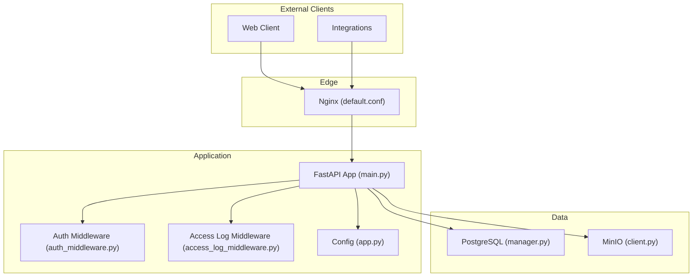
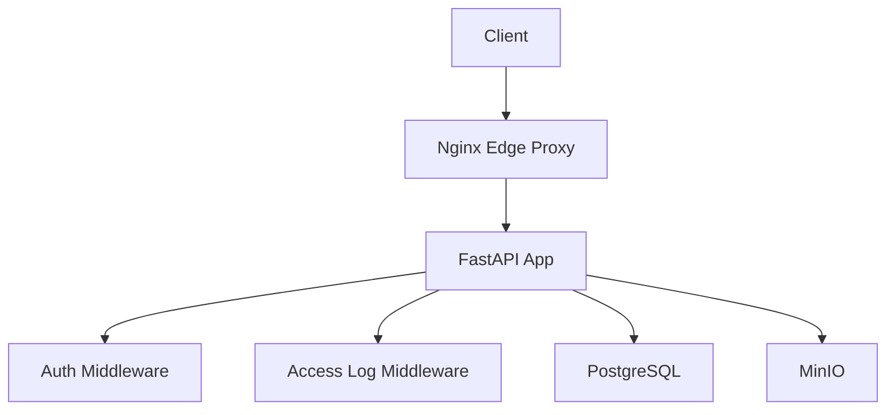
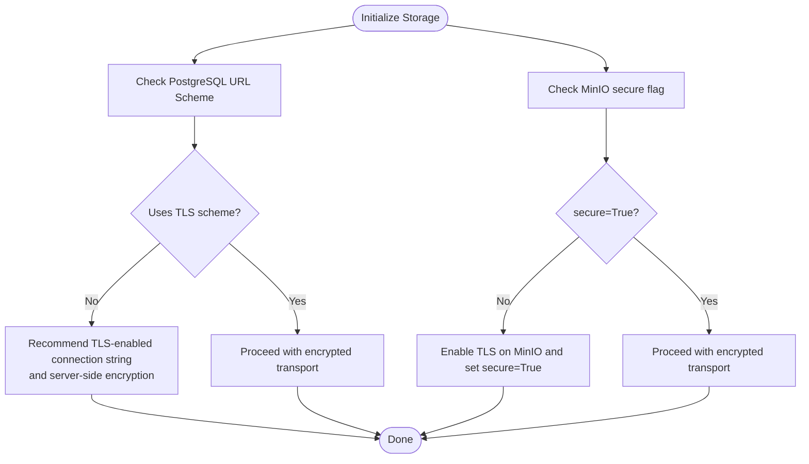
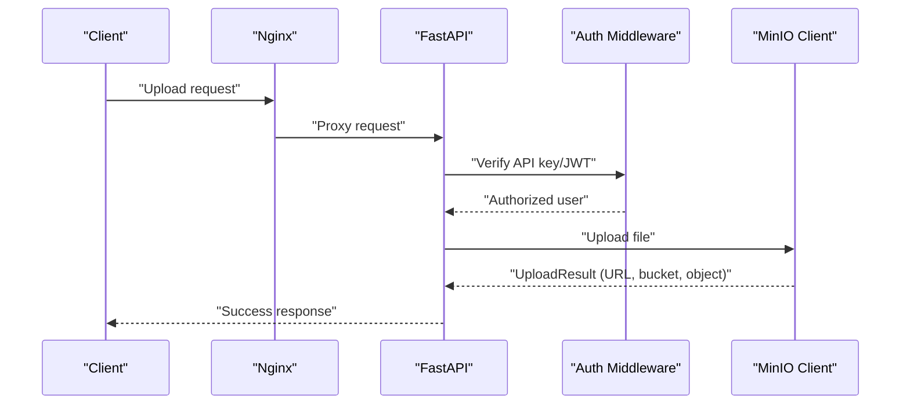
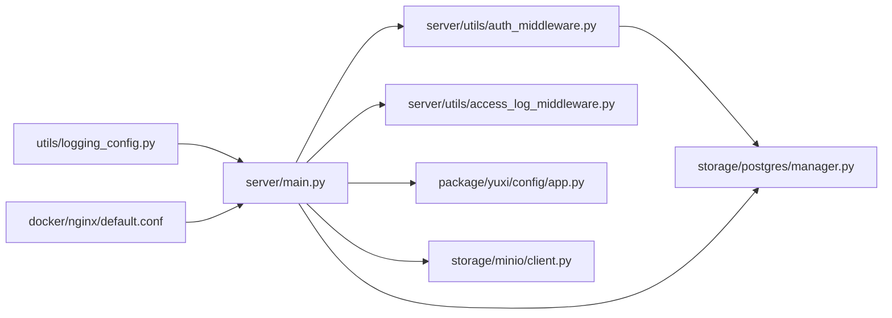

# Data Protection

<cite>
**Referenced Files in This Document**
- [docker-compose.yml](file://docker-compose.yml)
- [docker-compose.prod.yml](file://docker-compose.prod.yml)
- [nginx.conf](file://docker/nginx/nginx.conf)
- [default.conf](file://docker/nginx/default.conf)
- [main.py](file://backend/server/main.py)
- [access_log_middleware.py](file://backend/server/utils/access_log_middleware.py)
- [auth_middleware.py](file://backend/server/utils/auth_middleware.py)
- [manager.py](file://backend/package/yuxi/storage/postgres/manager.py)
- [client.py](file://backend/package/yuxi/storage/minio/client.py)
- [logging_config.py](file://backend/package/yuxi/utils/logging_config.py)
- [app.py](file://backend/package/yuxi/config/app.py)
</cite>

## Table of Contents
1. [Introduction](#introduction)
2. [Project Structure](#project-structure)
3. [Core Components](#core-components)
4. [Architecture Overview](#architecture-overview)
5. [Detailed Component Analysis](#detailed-component-analysis)
6. [Dependency Analysis](#dependency-analysis)
7. [Performance Considerations](#performance-considerations)
8. [Troubleshooting Guide](#troubleshooting-guide)
9. [Conclusion](#conclusion)
10. [Appendices](#appendices)

## Introduction
This document provides comprehensive data protection guidance for the Yuxi platform with a focus on:
- Encryption at rest for PostgreSQL and MinIO
- Data transmission security via HTTPS/TLS and secure transport
- Data validation and sanitization to prevent injection and corruption
- Data retention, anonymization, and secure deletion
- Audit logging with sensitive data redaction
- Practical secure handling patterns, encryption key management, and compliance considerations
- Mitigations for common data security vulnerabilities and monitoring approaches

Where applicable, this document maps protections to concrete implementation details in the repository.

## Project Structure
The Yuxi platform comprises:
- Backend API and middleware stack (FastAPI) with authentication, rate limiting, and access logging
- PostgreSQL for relational data
- MinIO for object storage
- Nginx acting as an API gateway/proxy
- Configuration and logging utilities

**Diagram sources**
- [main.py:40-150](file://backend/server/main.py#L40-L150)
- [auth_middleware.py:1-169](file://backend/server/utils/auth_middleware.py#L1-L169)
- [access_log_middleware.py:1-68](file://backend/server/utils/access_log_middleware.py#L1-L68)
- [manager.py:1-291](file://backend/package/yuxi/storage/postgres/manager.py#L1-L291)
- [client.py:1-455](file://backend/package/yuxi/storage/minio/client.py#L1-L455)
- [default.conf:1-32](file://docker/nginx/default.conf#L1-L32)

**Section sources**
- [docker-compose.yml:1-436](file://docker-compose.yml#L1-L436)
- [docker-compose.prod.yml:1-373](file://docker-compose.prod.yml#L1-L373)
- [nginx.conf:1-25](file://docker/nginx/nginx.conf#L1-L25)
- [default.conf:1-32](file://docker/nginx/default.conf#L1-L32)

## Core Components
- PostgreSQL Manager: Asynchronous ORM engine, connection pooling, schema migrations, and session management.
- MinIO Client: Object storage operations with bucket policies, presigned URLs, and temporary file handling.
- Logging and Audit: Centralized logging with retention and rotation; access logs middleware; bridging third-party libraries to a unified logger.
- Authentication and Authorization: Public path handling, API key and JWT verification, and role-based access checks.
- Transport Security: Nginx proxy configuration for upstream requests and streaming support.

**Section sources**
- [manager.py:28-291](file://backend/package/yuxi/storage/postgres/manager.py#L28-L291)
- [client.py:40-455](file://backend/package/yuxi/storage/minio/client.py#L40-L455)
- [logging_config.py:1-99](file://backend/package/yuxi/utils/logging_config.py#L1-L99)
- [auth_middleware.py:1-169](file://backend/server/utils/auth_middleware.py#L1-L169)
- [access_log_middleware.py:1-68](file://backend/server/utils/access_log_middleware.py#L1-L68)
- [default.conf:13-31](file://docker/nginx/default.conf#L13-L31)

## Architecture Overview
End-to-end data protection posture across the platform:

**Diagram sources**
- [main.py:40-150](file://backend/server/main.py#L40-L150)
- [auth_middleware.py:1-169](file://backend/server/utils/auth_middleware.py#L1-L169)
- [access_log_middleware.py:1-68](file://backend/server/utils/access_log_middleware.py#L1-L68)
- [manager.py:28-291](file://backend/package/yuxi/storage/postgres/manager.py#L28-L291)
- [client.py:40-455](file://backend/package/yuxi/storage/minio/client.py#L40-L455)
- [default.conf:13-31](file://docker/nginx/default.conf#L13-L31)

## Detailed Component Analysis

### Encryption at Rest

- PostgreSQL
  - The PostgreSQL manager initializes an asynchronous SQLAlchemy engine and a dedicated connection pool for LangGraph checkpoints. While the engine supports TLS via SQLAlchemy dialects, the current environment configuration passes a plain connection string. To enforce encryption at rest, configure the database server to require encrypted connections and ensure the connection string uses a secure scheme. The manager also exposes schema migration helpers to evolve table structures safely.
  - Recommendations:
    - Use a connection string with a secure scheme (e.g., a dialect variant that implies TLS) and ensure the server enforces TLS.
    - Apply database-level encryption-at-rest policies (e.g., TDE) at the DBMS level.
    - Store secrets (e.g., passwords) in a secrets manager and inject via environment variables.

- MinIO
  - The MinIO client is instantiated with secure=False by default, indicating plaintext HTTP transport. For production, enable TLS on MinIO and update the client initialization to use secure transport. The client supports presigned URLs for controlled access and bucket policies for public read access where appropriate.

**Diagram sources**
- [manager.py:55-83](file://backend/package/yuxi/storage/postgres/manager.py#L55-L83)
- [client.py:83-86](file://backend/package/yuxi/storage/minio/client.py#L83-L86)

**Section sources**
- [manager.py:40-90](file://backend/package/yuxi/storage/postgres/manager.py#L40-L90)
- [client.py:54-86](file://backend/package/yuxi/storage/minio/client.py#L54-L86)

### Data Transmission Security (HTTPS/TLS and Secure Protocols)

- Nginx Edge Proxy
  - The Nginx configuration proxies API requests to the backend and sets standard headers for reverse proxying. It enables streaming and disables buffering for server-sent events and long-lived streams. There is no TLS termination configured in the provided Nginx files; therefore, TLS termination should be handled by an external load balancer or a separate TLS-terminating proxy in front of Nginx.
  - Recommendations:
    - Terminate TLS at the edge (e.g., a load balancer or a dedicated TLS-terminating proxy) and forward to Nginx using HTTPS.
    - Enforce strong TLS versions and cipher suites at the TLS terminator.
    - Ensure HSTS and security headers are applied at the TLS terminator.

- Backend Transport
  - The backend runs behind Nginx and relies on the proxy for TLS termination. No explicit HTTPS/TLS configuration is present in the FastAPI application itself, so rely on the edge proxy for encrypted ingress.

**Section sources**
- [default.conf:13-31](file://docker/nginx/default.conf#L13-L31)
- [nginx.conf:1-25](file://docker/nginx/nginx.conf#L1-L25)
- [main.py:139-150](file://backend/server/main.py#L139-L150)

### Data Validation and Sanitization

- URL and Path Validation in MinIO Client
  - The MinIO client validates URLs for protocol, host, and path traversal attempts. It rejects URLs that do not match the configured endpoint host or contain path traversal sequences. It also validates allowed file extensions and parses bucket/object names from the URL path.
  - Recommendations:
    - Extend validation to sanitize user-supplied identifiers and filenames.
    - Apply input length limits and charset restrictions for object names and bucket names.
    - Enforce strict content-type validation and size limits for uploads.

- Public Endpoint and Bucket Policies
  - Public buckets are explicitly declared. Ensure bucket policies grant least privilege and avoid blanket public-read unless required. Prefer signed URLs for controlled access.

- Authentication and Authorization
  - Public paths are whitelisted; all other routes require authentication. The middleware supports API keys and JWT tokens, with expiration and enabled-state checks. Role-based access checks are available for admin and superadmin roles.

**Section sources**
- [client.py:364-426](file://backend/package/yuxi/storage/minio/client.py#L364-L426)
- [auth_middleware.py:18-26](file://backend/server/utils/auth_middleware.py#L18-L26)
- [auth_middleware.py:35-123](file://backend/server/utils/auth_middleware.py#L35-L123)

### Data Retention, Anonymization, and Secure Deletion

- Data Retention
  - Logging retention is configured to 30 days. Consider aligning retention with regulatory requirements and internal policies. Archive logs securely and apply deletion policies accordingly.

- Secure Deletion
  - MinIO client supports deleting individual objects, bulk deletion by prefix, and complete bucket removal after purging objects. Use these APIs to implement secure deletion workflows.
  - PostgreSQL schema helpers include table creation/drop and index management. Use these to manage lifecycle of sensitive datasets.

- Anonymization
  - The codebase does not include built-in anonymization utilities. Implement anonymization at ingestion or export stages using deterministic hashing for PII-like fields and masking for partial identifiers.

**Section sources**
- [logging_config.py:68-72](file://backend/package/yuxi/utils/logging_config.py#L68-L72)
- [client.py:232-304](file://backend/package/yuxi/storage/minio/client.py#L232-L304)
- [manager.py:96-118](file://backend/package/yuxi/storage/postgres/manager.py#L96-L118)

### Logging Configuration and Audit Trails

- Centralized Logging
  - The logging configuration uses Loguru with file rotation and retention. Third-party library logs are bridged to Loguru to centralize auditing.
  - Access logs are captured by a dedicated middleware that records client IP, method, path, status code, and response time.

- Redaction and Sensitive Data Handling
  - The logging configuration does not include built-in redaction filters. Add redaction rules for sensitive fields (e.g., tokens, API keys, personal data) in the logging pipeline.
  - Avoid logging raw request bodies; instead, log structured summaries with redacted fields.

**Section sources**
- [logging_config.py:55-99](file://backend/package/yuxi/utils/logging_config.py#L55-L99)
- [access_log_middleware.py:24-67](file://backend/server/utils/access_log_middleware.py#L24-L67)

### Practical Secure Data Handling Patterns

- Secure Upload Flow (MinIO)
  - Validate and sanitize the incoming URL/path, confirm allowed extensions, and enforce size/content-type constraints before upload.
  - Use presigned URLs for controlled downloads and limit expiry windows.
  - Store metadata separately in PostgreSQL with JSONB fields for structured attributes.

- Secure Download Flow (MinIO)
  - Verify the URL origin matches the configured endpoint and reject path traversal attempts.
  - Stream downloads to avoid loading entire files into memory when possible.

- Authentication Flow
  - Use API keys for service-to-service authentication and JWT for human sessions.
  - Enforce rate limiting on authentication endpoints to mitigate brute force.

- Database Operations
  - Use async sessions with automatic rollback on exceptions.
  - Apply schema migration helpers to add new columns and indexes safely.

**Diagram sources**
- [default.conf:13-31](file://docker/nginx/default.conf#L13-L31)
- [main.py:40-150](file://backend/server/main.py#L40-L150)
- [auth_middleware.py:74-123](file://backend/server/utils/auth_middleware.py#L74-L123)
- [client.py:109-135](file://backend/package/yuxi/storage/minio/client.py#L109-L135)

**Section sources**
- [client.py:109-135](file://backend/package/yuxi/storage/minio/client.py#L109-L135)
- [auth_middleware.py:74-123](file://backend/server/utils/auth_middleware.py#L74-L123)
- [main.py:63-96](file://backend/server/main.py#L63-L96)

### Encryption Key Management

- Current State
  - The MinIO client initializes with access and secret keys from environment variables. There is no in-code key rotation or KMS integration demonstrated in the referenced files.

- Recommendations
  - Rotate keys regularly and store them in a secrets manager (e.g., Vault, KMS).
  - Use short-lived credentials and scoped policies.
  - For PostgreSQL, ensure the connection string uses a secure scheme and store credentials in a secrets manager.

**Section sources**
- [client.py:56-59](file://backend/package/yuxi/storage/minio/client.py#L56-L59)
- [manager.py:55-61](file://backend/package/yuxi/storage/postgres/manager.py#L55-L61)

### Compliance Considerations

- Data Subject Rights
  - Implement secure deletion and data portability by leveraging MinIO deletion APIs and PostgreSQL export capabilities.
- Data Minimization
  - Limit stored fields and retain only necessary data; apply anonymization for non-essential attributes.
- Least Privilege
  - Restrict MinIO bucket policies and database permissions to least privilege roles.
- Auditability
  - Maintain access logs and centralized logs with retention aligned to policy.

[No sources needed since this section provides general guidance]

## Dependency Analysis

**Diagram sources**
- [main.py:23-137](file://backend/server/main.py#L23-L137)
- [auth_middleware.py:1-169](file://backend/server/utils/auth_middleware.py#L1-L169)
- [access_log_middleware.py:1-68](file://backend/server/utils/access_log_middleware.py#L1-L68)
- [manager.py:1-291](file://backend/package/yuxi/storage/postgres/manager.py#L1-L291)
- [client.py:1-455](file://backend/package/yuxi/storage/minio/client.py#L1-L455)
- [logging_config.py:1-99](file://backend/package/yuxi/utils/logging_config.py#L1-L99)
- [default.conf:1-32](file://docker/nginx/default.conf#L1-L32)

**Section sources**
- [docker-compose.yml:1-436](file://docker-compose.yml#L1-L436)
- [docker-compose.prod.yml:1-373](file://docker-compose.prod.yml#L1-L373)

## Performance Considerations
- PostgreSQL
  - Async engine and connection pooling improve concurrency. Tune pool sizes and timeouts according to workload.
- MinIO
  - Streaming downloads and uploads minimize memory footprint. Use presigned URLs for large objects to reduce server load.
- Logging
  - Rotation and retention prevent disk exhaustion. Consider compression and offloading logs to external systems for long-term retention.

[No sources needed since this section provides general guidance]

## Troubleshooting Guide

- Authentication Failures
  - Verify API key hash, enabled state, and expiration. Ensure JWT verification succeeds and user is not deleted.
- Rate Limiting
  - Login attempts are rate-limited per IP window. Adjust thresholds if legitimate traffic is affected.
- Access Logs
  - Confirm access log middleware is registered and client IPs are extracted from headers.
- MinIO Connectivity
  - Check endpoint host, secure flag, and bucket existence. Validate presigned URL generation and expiration.

**Section sources**
- [auth_middleware.py:35-123](file://backend/server/utils/auth_middleware.py#L35-L123)
- [main.py:63-96](file://backend/server/main.py#L63-L96)
- [access_log_middleware.py:24-67](file://backend/server/utils/access_log_middleware.py#L24-L67)
- [client.py:76-86](file://backend/package/yuxi/storage/minio/client.py#L76-L86)

## Conclusion
The Yuxi platform provides a solid foundation for secure data handling with asynchronous PostgreSQL access, object storage operations, and centralized logging. To achieve end-to-end data protection:
- Enforce TLS at the edge and for MinIO
- Harden MinIO policies and validate/sanitize all inputs
- Implement secure deletion and anonymization workflows
- Add redaction to logs and align retention with compliance
- Manage encryption keys via a secrets manager and rotate regularly

[No sources needed since this section summarizes without analyzing specific files]

## Appendices

### Environment Variables and Secrets
- PostgreSQL: POSTGRES_URL
- MinIO: MINIO_URI, MINIO_ACCESS_KEY, MINIO_SECRET_KEY
- Application: SAVE_DIR, MODEL_DIR, SANDBOX_* variables

**Section sources**
- [docker-compose.yml:7-35](file://docker-compose.yml#L7-L35)
- [docker-compose.prod.yml:7-27](file://docker-compose.prod.yml#L7-L27)
- [client.py:56-59](file://backend/package/yuxi/storage/minio/client.py#L56-L59)
- [manager.py:45-61](file://backend/package/yuxi/storage/postgres/manager.py#L45-L61)